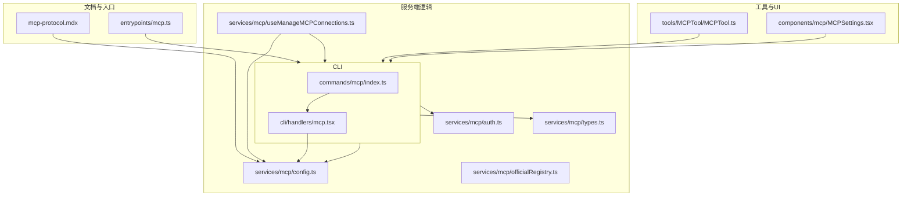
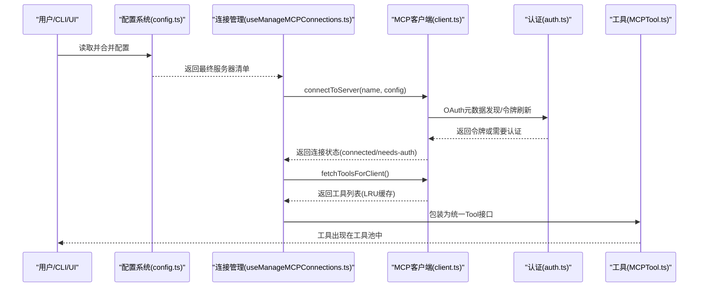
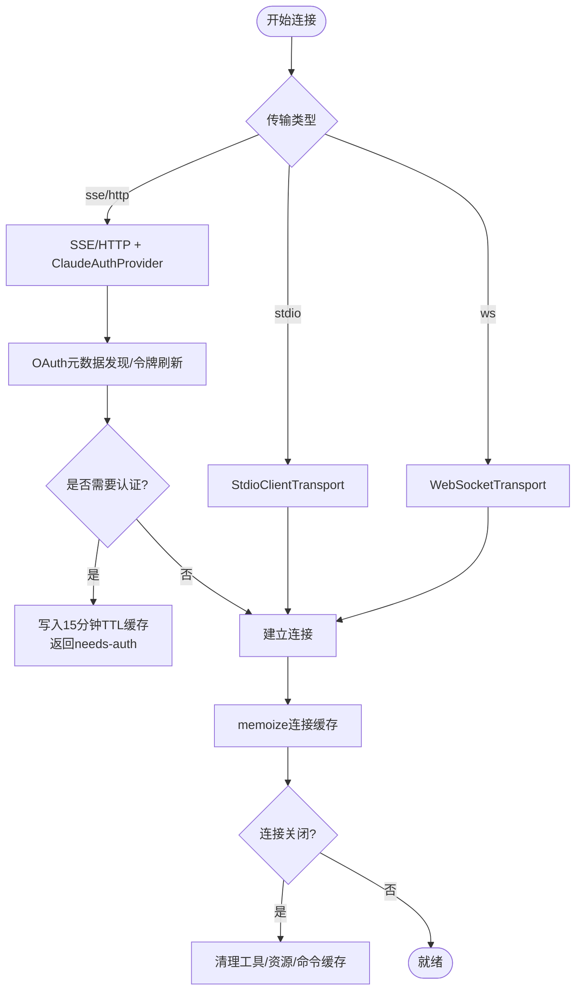
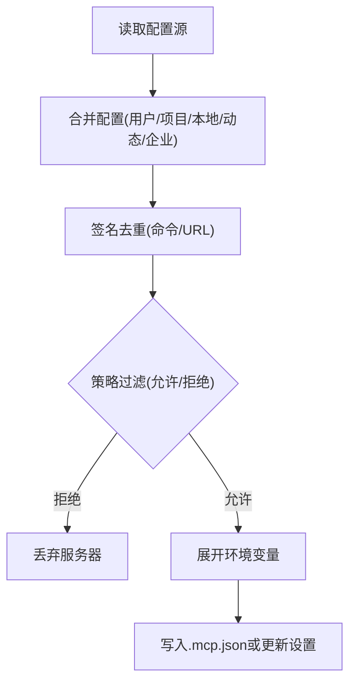
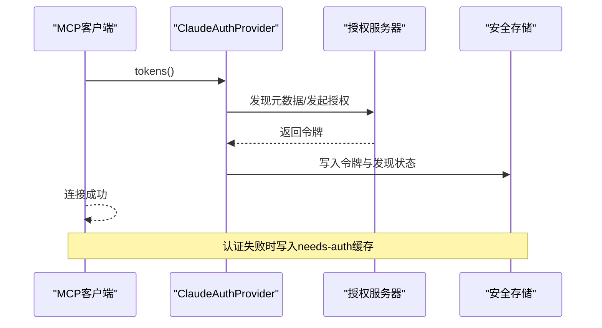
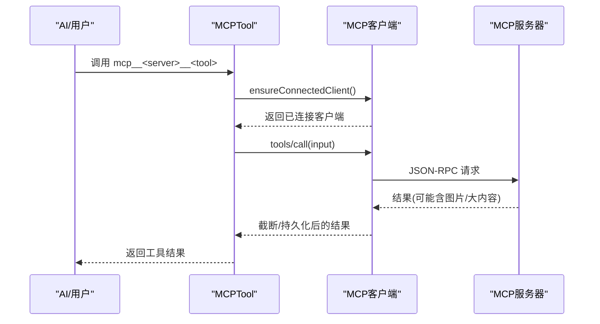
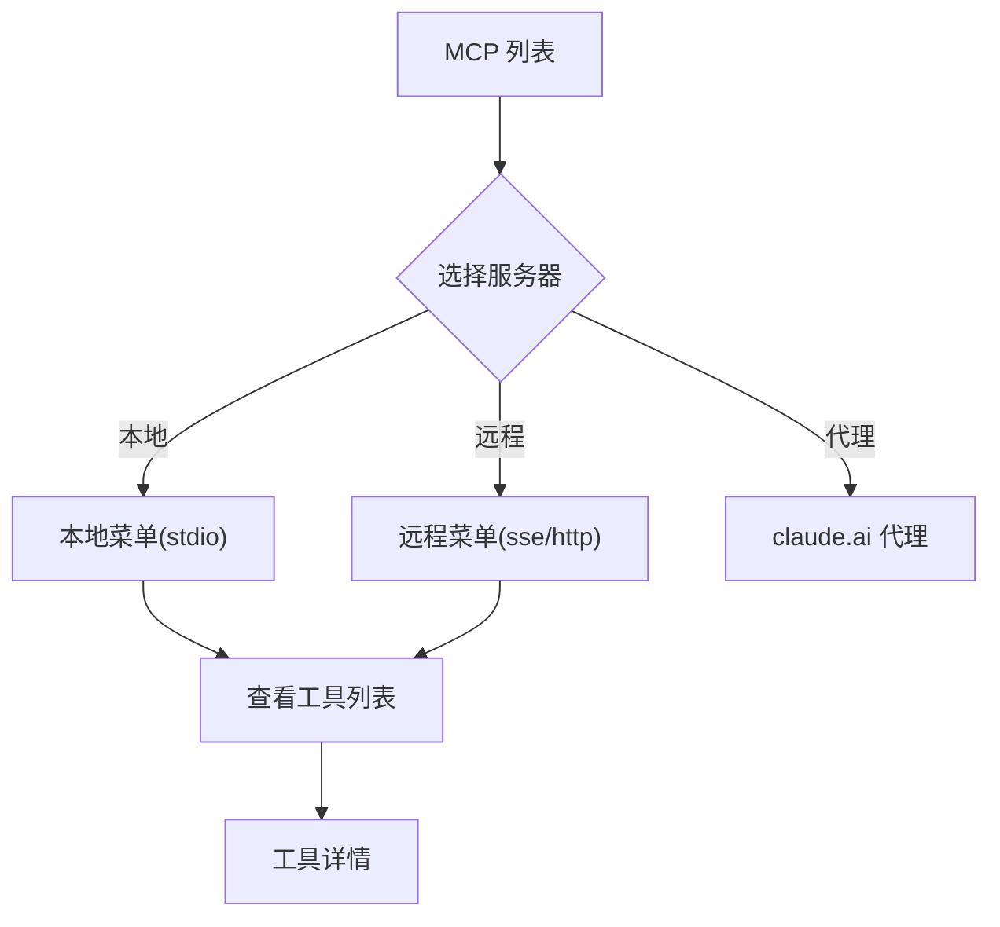
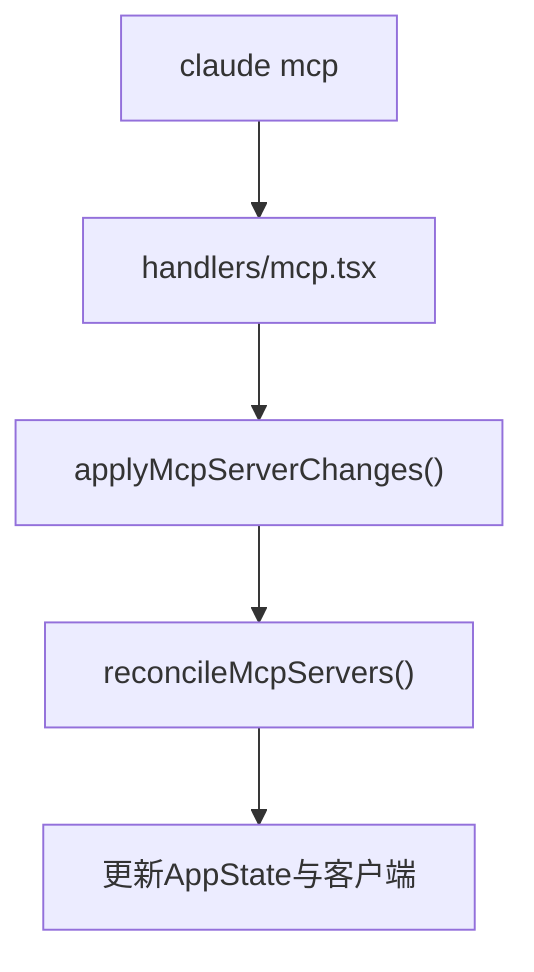
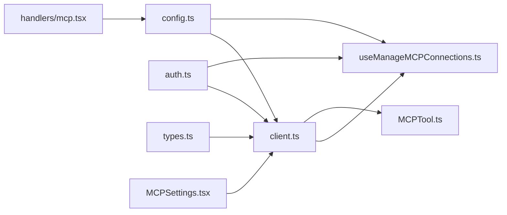

# MCP 协议集成

<cite>
**本文引用的文件**
- [mcp-protocol.mdx](file://docs/extensibility/mcp-protocol.mdx)
- [client.ts](file://src/services/mcp/client.ts)
- [config.ts](file://src/services/mcp/config.ts)
- [auth.ts](file://src/services/mcp/auth.ts)
- [types.ts](file://src/services/mcp/types.ts)
- [useManageMCPConnections.ts](file://src/services/mcp/useManageMCPConnections.ts)
- [MCPTool.ts](file://src/tools/MCPTool/MCPTool.ts)
- [MCPSettings.tsx](file://src/components/mcp/MCPSettings.tsx)
- [officialRegistry.ts](file://src/services/mcp/officialRegistry.ts)
- [mcp.ts](file://src/entrypoints/mcp.ts)
- [mcp.tsx](file://src/cli/handlers/mcp.tsx)
- [index.ts](file://src/commands/mcp/index.ts)
</cite>

## 目录
1. [简介](#简介)
2. [项目结构](#项目结构)
3. [核心组件](#核心组件)
4. [架构总览](#架构总览)
5. [详细组件分析](#详细组件分析)
6. [依赖关系分析](#依赖关系分析)
7. [性能考量](#性能考量)
8. [故障排除指南](#故障排除指南)
9. [结论](#结论)
10. [附录](#附录)

## 简介
本文件系统性阐述 Claude Code 的 MCP（Model Context Protocol）集成方案，覆盖协议工作原理、客户端架构、服务器发现与认证、连接管理、请求路由与响应处理、工具发现与执行链路、以及面向开发者的 MCP 服务器实现指南。文档同时提供本地/远程/官方配置支持、UI 设置面板、CLI 管理命令、性能优化与故障排除建议。

## 项目结构
围绕 MCP 的核心代码分布在以下模块：
- 文档与说明：docs/extensibility/mcp-protocol.mdx
- 服务端逻辑：src/services/mcp/*
- 工具适配：src/tools/MCPTool/*
- UI 设置与菜单：src/components/mcp/*
- CLI 管理命令：src/commands/mcp/*、src/cli/handlers/mcp.tsx
- 入口点：src/entrypoints/mcp.ts

**图表来源**
- [mcp-protocol.mdx](file://docs/extensibility/mcp-protocol.mdx)
- [client.ts](file://src/services/mcp/client.ts)
- [config.ts](file://src/services/mcp/config.ts)
- [auth.ts](file://src/services/mcp/auth.ts)
- [types.ts](file://src/services/mcp/types.ts)
- [useManageMCPConnections.ts](file://src/services/mcp/useManageMCPConnections.ts)
- [MCPTool.ts](file://src/tools/MCPTool/MCPTool.ts)
- [MCPSettings.tsx](file://src/components/mcp/MCPSettings.tsx)
- [officialRegistry.ts](file://src/services/mcp/officialRegistry.ts)
- [mcp.ts](file://src/entrypoints/mcp.ts)
- [mcp.tsx](file://src/cli/handlers/mcp.tsx)
- [index.ts](file://src/commands/mcp/index.ts)

**章节来源**
- [mcp-protocol.mdx](file://docs/extensibility/mcp-protocol.mdx)
- [client.ts](file://src/services/mcp/client.ts)
- [config.ts](file://src/services/mcp/config.ts)
- [auth.ts](file://src/services/mcp/auth.ts)
- [types.ts](file://src/services/mcp/types.ts)
- [useManageMCPConnections.ts](file://src/services/mcp/useManageMCPConnections.ts)
- [MCPTool.ts](file://src/tools/MCPTool/MCPTool.ts)
- [MCPSettings.tsx](file://src/components/mcp/MCPSettings.tsx)
- [officialRegistry.ts](file://src/services/mcp/officialRegistry.ts)
- [mcp.ts](file://src/entrypoints/mcp.ts)
- [mcp.tsx](file://src/cli/handlers/mcp.tsx)
- [index.ts](file://src/commands/mcp/index.ts)

## 核心组件
- MCP 客户端与连接管理：封装 @modelcontextprotocol/sdk，负责连接建立、传输选择、超时控制、缓存与重连、会话过期处理。
- 配置与策略：合并用户/项目/本地/动态/企业配置，支持去重、策略过滤（允许/拒绝）、环境变量展开、.mcp.json 写入。
- 认证与授权：OAuth 发现、令牌刷新、跨应用访问（XAA）、令牌撤销、认证失败缓存与 UI 提示。
- 工具发现与执行：工具列表缓存（LRU）、权限检查（统一走权限链路）、工具调用与结果截断/持久化。
- UI 设置与菜单：MCP 列表、远程/本地菜单、工具详情、认证状态展示。
- CLI 管理：列出/添加/删除/启用/禁用 MCP 服务器，动态配置同步。

**章节来源**
- [client.ts](file://src/services/mcp/client.ts)
- [config.ts](file://src/services/mcp/config.ts)
- [auth.ts](file://src/services/mcp/auth.ts)
- [types.ts](file://src/services/mcp/types.ts)
- [MCPTool.ts](file://src/tools/MCPTool/MCPTool.ts)
- [MCPSettings.tsx](file://src/components/mcp/MCPSettings.tsx)
- [mcp.tsx](file://src/cli/handlers/mcp.tsx)

## 架构总览
下图展示了从配置到可用工具的端到端链路，涵盖连接缓存、工具发现、权限检查与执行。

**图表来源**
- [config.ts](file://src/services/mcp/config.ts)
- [useManageMCPConnections.ts](file://src/services/mcp/useManageMCPConnections.ts)
- [client.ts](file://src/services/mcp/client.ts)
- [auth.ts](file://src/services/mcp/auth.ts)
- [MCPTool.ts](file://src/tools/MCPTool/MCPTool.ts)

## 详细组件分析

### 客户端架构与连接管理
- 传输层分发：根据配置 type 选择 stdio/sse/http/ws 等传输；远程传输使用 ClaudeAuthProvider 进行 OAuth。
- 连接缓存：connectToServer 使用 memoize 缓存，键为 name+config 序列化；连接关闭时清理工具/资源/命令缓存。
- 重连与降级：连续错误计数达到阈值自动关闭并触发重连；HTTP 传输检测会话过期并自动重试一次。
- 请求超时：独立的 setTimeout 控制单次请求超时，避免 AbortSignal.timeout 的 GC 延迟问题。
- 并发控制：本地服务器默认并发 3，远程服务器默认并发 20。

**图表来源**
- [client.ts](file://src/services/mcp/client.ts)
- [auth.ts](file://src/services/mcp/auth.ts)

**章节来源**
- [client.ts](file://src/services/mcp/client.ts)
- [mcp-protocol.mdx](file://docs/extensibility/mcp-protocol.mdx)

### 配置与策略（含官方注册表）
- 配置合并：用户/项目/本地/动态/企业配置合并，支持去重与策略过滤（允许/拒绝列表）。
- 签名去重：基于命令数组或 URL（去除查询参数与尾斜杠）进行去重，避免插件与手动配置冲突。
- 策略过滤：名称/命令/URL 三类策略，支持通配符 URL 匹配；企业策略优先。
- 官方注册表：预取官方 MCP 服务器 URL，用于 UI/策略判断（fail-closed）。

**图表来源**
- [config.ts](file://src/services/mcp/config.ts)
- [officialRegistry.ts](file://src/services/mcp/officialRegistry.ts)

**章节来源**
- [config.ts](file://src/services/mcp/config.ts)
- [officialRegistry.ts](file://src/services/mcp/officialRegistry.ts)

### 认证与安全
- OAuth 元数据发现：支持配置元数据 URL 或按 RFC 9728/8414 自动发现；POST 错误体标准化以正确识别 invalid_grant。
- 令牌刷新与撤销：刷新失败分类统计；支持 RFC 7009 令牌撤销（先刷新令牌再访问令牌）。
- 认证失败缓存：远程认证失败写入 15 分钟 TTL 缓存，避免重复弹窗。
- XAA（跨应用访问）：一次性 IdP 登录复用，AS 侧 RFC 8693+jwt-bearer 交换，统一存储与刷新路径。
- 安全注意：敏感 OAuth 参数日志脱敏；HTTPS 强制要求；令牌撤销回退兼容非标准服务器。

**图表来源**
- [auth.ts](file://src/services/mcp/auth.ts)

**章节来源**
- [auth.ts](file://src/services/mcp/auth.ts)

### 工具发现与执行链路
- 工具发现：LRU(20) 缓存工具列表；工具名前缀 mcp__<serverName>__<toolName>；描述长度截断；注解映射只读/破坏性/开放世界。
- 权限检查：MCP 工具默认 passthrough，进入统一权限链路；工具名精确匹配权限规则。
- 执行流程：ensureConnectedClient → 带 Elicitation 重试 → tools/call → 图片结果处理与截断 → 会话过期自动重试一次。

**图表来源**
- [MCPTool.ts](file://src/tools/MCPTool/MCPTool.ts)
- [client.ts](file://src/services/mcp/client.ts)

**章节来源**
- [MCPTool.ts](file://src/tools/MCPTool/MCPTool.ts)
- [client.ts](file://src/services/mcp/client.ts)

### UI 设置与菜单
- MCPSettings：展示服务器列表、认证状态、工具数量；按传输类型区分菜单；支持查看工具详情与返回。
- 交互：切换视图、打开服务器菜单、查看工具列表、返回上级。

**图表来源**
- [MCPSettings.tsx](file://src/components/mcp/MCPSettings.tsx)

**章节来源**
- [MCPSettings.tsx](file://src/components/mcp/MCPSettings.tsx)

### CLI 管理与入口
- 命令入口：/mcp 命令加载 handlers/mcp.tsx，提供 list/add/remove/enable/disable 等子命令。
- 动态配置：reconcileMcpServers 将期望状态与当前状态对比，执行增删改并返回响应。

**图表来源**
- [index.ts](file://src/commands/mcp/index.ts)
- [mcp.tsx](file://src/cli/handlers/mcp.tsx)
- [client.ts](file://src/cli/src/services/mcp/types.ts)

**章节来源**
- [index.ts](file://src/commands/mcp/index.ts)
- [mcp.tsx](file://src/cli/handlers/mcp.tsx)
- [client.ts](file://src/cli/src/services/mcp/types.ts)

## 依赖关系分析
- 组件耦合：client.ts 依赖 auth.ts、config.ts、types.ts；useManageMCPConnections.ts 依赖 client.ts 与 config.ts；MCPTool.ts 依赖 client.ts 的工具包装。
- 外部依赖：@modelcontextprotocol/sdk、OAuth SDK、axios、lodash-es、AbortSignal.timeout 替代方案。
- 循环依赖：通过导出类型与延迟 require 避免循环。

**图表来源**
- [config.ts](file://src/services/mcp/config.ts)
- [client.ts](file://src/services/mcp/client.ts)
- [auth.ts](file://src/services/mcp/auth.ts)
- [types.ts](file://src/services/mcp/types.ts)
- [useManageMCPConnections.ts](file://src/services/mcp/useManageMCPConnections.ts)
- [MCPTool.ts](file://src/tools/MCPTool/MCPTool.ts)
- [MCPSettings.tsx](file://src/components/mcp/MCPSettings.tsx)
- [mcp.tsx](file://src/cli/handlers/mcp.tsx)

**章节来源**
- [client.ts](file://src/services/mcp/client.ts)
- [config.ts](file://src/services/mcp/config.ts)
- [auth.ts](file://src/services/mcp/auth.ts)
- [types.ts](file://src/services/mcp/types.ts)
- [useManageMCPConnections.ts](file://src/services/mcp/useManageMCPConnections.ts)
- [MCPTool.ts](file://src/tools/MCPTool/MCPTool.ts)
- [MCPSettings.tsx](file://src/components/mcp/MCPSettings.tsx)
- [mcp.tsx](file://src/cli/handlers/mcp.tsx)

## 性能考量
- 连接缓存：memoize 缓存连接对象，减少重复初始化成本。
- 工具缓存：LRU(20) 缓存工具列表，降低频繁请求开销。
- 请求超时：独立超时控制，避免 AbortSignal.timeout 的 GC 延迟导致内存压力。
- 并发控制：本地服务器默认并发 3，远程服务器默认并发 20，平衡资源占用与吞吐。
- 内容截断与持久化：对大输出进行截断与二进制内容落盘，避免内存膨胀。

[本节为通用指导，无需特定文件引用]

## 故障排除指南
- 连接失败
  - 检查网络与 URL 正确性；查看远程认证失败缓存（15 分钟）。
  - 查看连接关闭事件触发的缓存清理与重连逻辑。
- 认证失败
  - 确认 OAuth 元数据发现与令牌刷新流程；必要时执行令牌撤销并重新授权。
  - 对于 XAA，检查 IdP 与 AS 配置一致性。
- 工具不可用
  - 确认工具列表缓存是否命中；检查权限规则与工具前缀命名。
  - 若出现会话过期，等待自动重试一次。
- CLI 管理
  - 使用 mcp list/add/remove/enable/disable 子命令核对配置；动态配置变更通过 reconcileMcpServers 生效。

**章节来源**
- [client.ts](file://src/services/mcp/client.ts)
- [auth.ts](file://src/services/mcp/auth.ts)
- [mcp.tsx](file://src/cli/handlers/mcp.tsx)

## 结论
Claude Code 的 MCP 集成在协议层面遵循 @modelcontextprotocol/sdk，在工程上实现了高可靠连接、灵活认证、高效工具发现与统一权限检查。通过配置策略、UI 设置与 CLI 管理，用户可以安全地接入本地/远程/官方 MCP 服务器，并获得一致的工具使用体验。

[本节为总结，无需特定文件引用]

## 附录

### MCP 服务器开发指南（开发者）
- 协议实现
  - 支持传输：stdio/sse/http/ws；远程传输需实现 OAuth 元数据与令牌端点。
  - 能力声明：通过 ServerCapabilities 描述支持的工具/资源/提示。
- 认证机制
  - OAuth：支持标准授权码+PKCE，元数据发现与令牌刷新；POST 错误体标准化。
  - XAA：跨应用访问，IdP 一次性登录，AS 侧 jwt-bearer 交换。
- 安全考虑
  - HTTPS 强制；令牌撤销遵循 RFC 7009；敏感参数日志脱敏。
  - 会话过期检测与自动重试；连接降级与指数退避重连。
- 工具与资源
  - 工具描述长度限制；注解映射只读/破坏性/开放世界；权限检查统一走 passthrough。
  - 资源与提示列表变更通知订阅，保持 UI 与能力同步。

**章节来源**
- [types.ts](file://src/services/mcp/types.ts)
- [auth.ts](file://src/services/mcp/auth.ts)
- [client.ts](file://src/services/mcp/client.ts)

### 实际配置示例与最佳实践
- settings.json 中的 MCP 配置示例与工具命名规范（mcp__<server>__<tool>）。
- 企业策略：允许/拒绝列表、名称/命令/URL 三类策略、通配符 URL 匹配。
- 官方注册表：预取官方 URL 用于 UI/策略判断（fail-closed）。

**章节来源**
- [mcp-protocol.mdx](file://docs/extensibility/mcp-protocol.mdx)
- [config.ts](file://src/services/mcp/config.ts)
- [officialRegistry.ts](file://src/services/mcp/officialRegistry.ts)