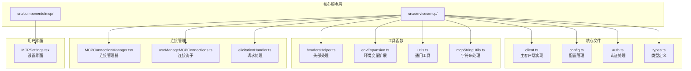
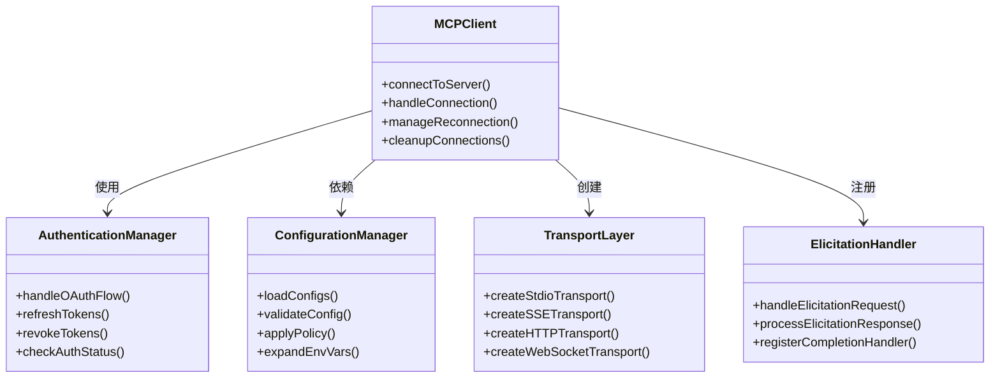
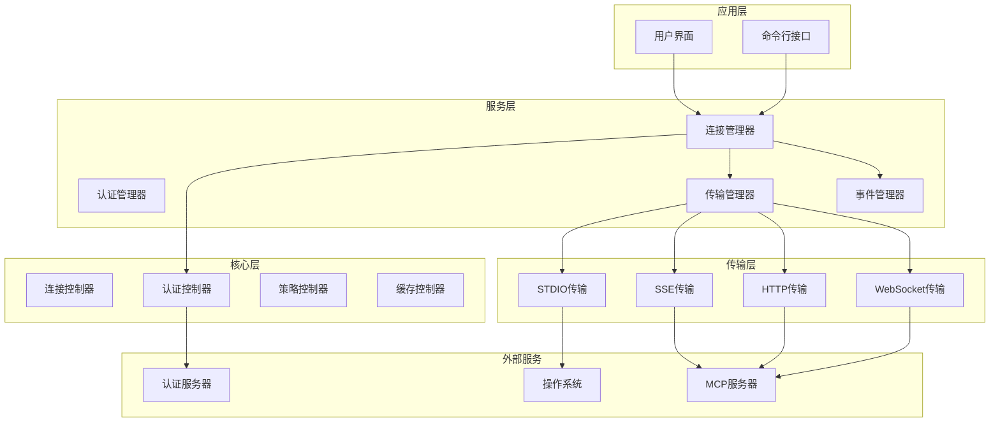
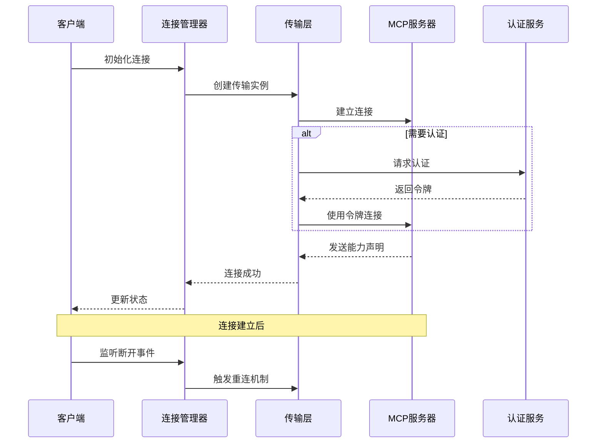
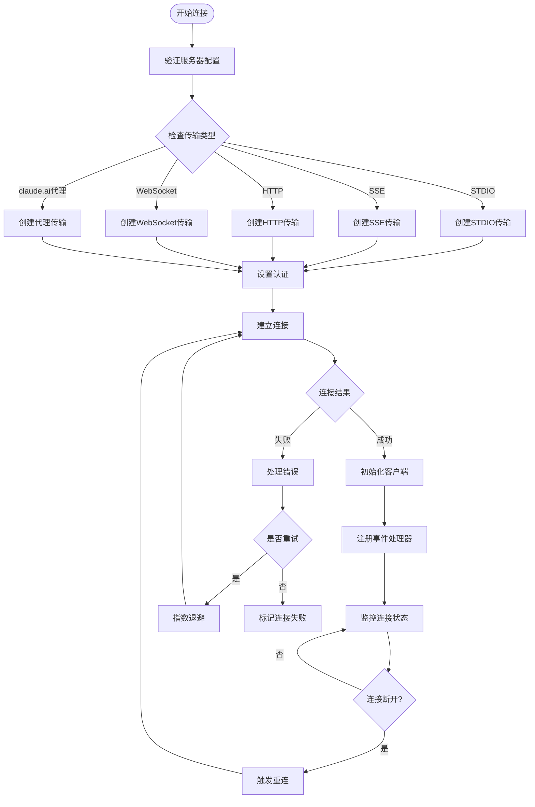
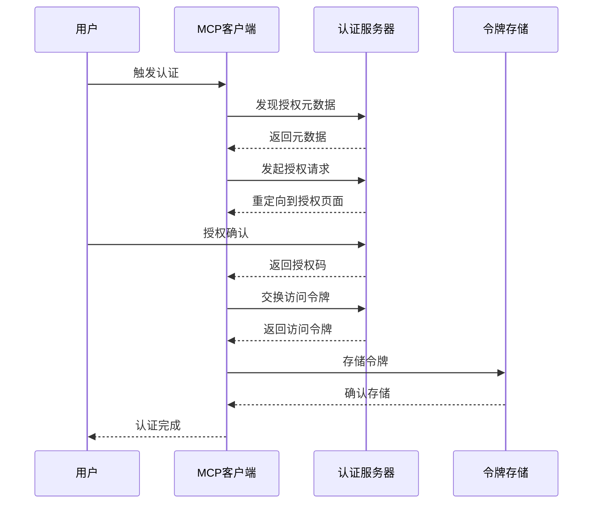
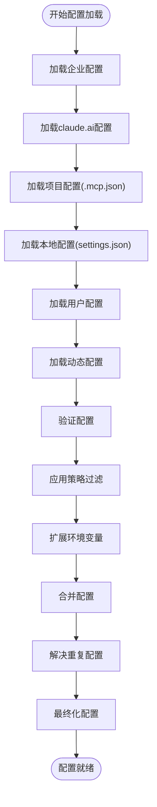
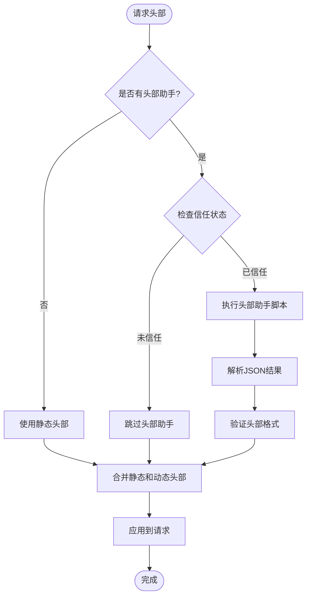
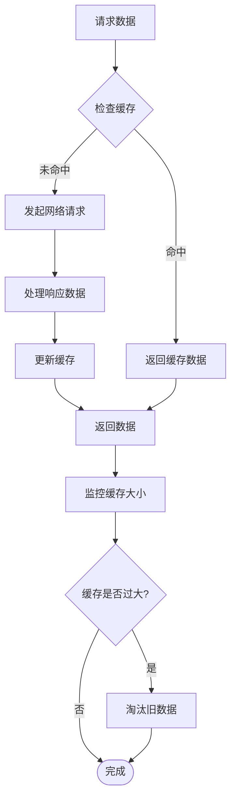

# MCP 客户端架构

<cite>
**本文档引用的文件**
- [client.ts](file://src/services/mcp/client.ts)
- [MCPConnectionManager.tsx](file://src/services/mcp/MCPConnectionManager.tsx)
- [config.ts](file://src/services/mcp/config.ts)
- [auth.ts](file://src/services/mcp/auth.ts)
- [headersHelper.ts](file://src/services/mcp/headersHelper.ts)
- [types.ts](file://src/services/mcp/types.ts)
- [useManageMCPConnections.ts](file://src/services/mcp/useManageMCPConnections.ts)
- [envExpansion.ts](file://src/services/mcp/envExpansion.ts)
- [utils.ts](file://src/services/mcp/utils.ts)
- [mcpStringUtils.ts](file://src/services/mcp/mcpStringUtils.ts)
- [elicitationHandler.ts](file://src/services/mcp/elicitationHandler.ts)
- [MCPSettings.tsx](file://src/components/mcp/MCPSettings.tsx)
- [mcp.ts](file://src/entrypoints/mcp.ts)
</cite>

## 目录
1. [引言](#引言)
2. [项目结构](#项目结构)
3. [核心组件](#核心组件)
4. [架构概览](#架构概览)
5. [详细组件分析](#详细组件分析)
6. [依赖关系分析](#依赖关系分析)
7. [性能考虑](#性能考虑)
8. [故障排除指南](#故障排除指南)
9. [结论](#结论)

## 引言

MCP（Model Context Protocol）客户端架构是 Claude Code 平台中用于连接和管理外部 MCP 服务器的核心系统。该架构实现了标准化的协议支持，提供了灵活的连接管理、智能的重连策略、完善的认证机制以及丰富的配置选项。

本架构支持多种传输协议（STDIO、SSE、HTTP、WebSocket），能够连接本地进程、远程服务器以及 claude.ai 代理服务。通过模块化的设计，系统实现了高可扩展性和良好的错误处理能力。

## 项目结构

MCP 客户端架构主要分布在以下目录结构中：



**图表来源**
- [client.ts](file://src/services/mcp/client.ts)
- [config.ts](file://src/services/mcp/config.ts)
- [auth.ts](file://src/services/mcp/auth.ts)
- [types.ts](file://src/services/mcp/types.ts)

**章节来源**
- [client.ts](file://src/services/mcp/client.ts)
- [config.ts](file://src/services/mcp/config.ts)
- [auth.ts](file://src/services/mcp/auth.ts)

## 核心组件

### 主要组件概述

MCP 客户端架构由以下核心组件构成：

1. **连接管理器**：负责服务器连接的生命周期管理
2. **认证处理器**：处理 OAuth 和其他认证机制
3. **配置管理器**：管理服务器配置和策略
4. **传输适配器**：支持多种传输协议
5. **工具函数库**：提供字符串处理、缓存管理等辅助功能

### 组件交互图



**图表来源**
- [client.ts](file://src/services/mcp/client.ts)
- [auth.ts](file://src/services/mcp/auth.ts)
- [config.ts](file://src/services/mcp/config.ts)
- [elicitationHandler.ts](file://src/services/mcp/elicitationHandler.ts)

**章节来源**
- [client.ts](file://src/services/mcp/client.ts)
- [auth.ts](file://src/services/mcp/auth.ts)
- [config.ts](file://src/services/mcp/config.ts)

## 架构概览

### 整体架构设计

MCP 客户端采用分层架构设计，确保各组件职责清晰、耦合度低：



**图表来源**
- [client.ts](file://src/services/mcp/client.ts)
- [MCPConnectionManager.tsx](file://src/services/mcp/MCPConnectionManager.tsx)
- [useManageMCPConnections.ts](file://src/services/mcp/useManageMCPConnections.ts)

### 连接生命周期管理



**图表来源**
- [client.ts](file://src/services/mcp/client.ts)
- [useManageMCPConnections.ts](file://src/services/mcp/useManageMCPConnections.ts)

## 详细组件分析

### 客户端连接管理

#### 连接建立流程

MCP 客户端的连接建立过程经过精心设计，确保了稳定性和可靠性：



**图表来源**
- [client.ts](file://src/services/mcp/client.ts)
- [useManageMCPConnections.ts](file://src/services/mcp/useManageMCPConnections.ts)

#### 传输层实现

不同的传输协议有不同的实现方式：

**STDIO 传输**：
- 用于本地进程通信
- 支持标准输入输出管道
- 自动处理进程生命周期

**SSE 传输**：
- 基于 Server-Sent Events
- 支持长连接和实时更新
- 自动处理重连逻辑

**HTTP 传输**：
- 基于 HTTP/1.1 协议
- 支持流式响应
- 实现了 MCP Streamable HTTP 规范

**WebSocket 传输**：
- 全双工通信
- 支持二进制和文本消息
- 实现了 mcp 协议

**章节来源**
- [client.ts](file://src/services/mcp/client.ts)

### 认证机制实现

#### OAuth 流程

MCP 客户端实现了完整的 OAuth 2.0 认证流程：



**图表来源**
- [auth.ts](file://src/services/mcp/auth.ts)

#### 认证状态管理

认证状态通过以下机制进行管理：

1. **令牌缓存**：本地存储访问令牌和刷新令牌
2. **自动刷新**：在令牌过期前自动刷新
3. **错误处理**：处理认证失败和令牌失效
4. **安全存储**：使用加密存储敏感信息

**章节来源**
- [auth.ts](file://src/services/mcp/auth.ts)

### 配置管理系统

#### 配置加载流程

MCP 客户端支持多种配置源，配置加载遵循特定的优先级顺序：



**图表来源**
- [config.ts](file://src/services/mcp/config.ts)

#### 策略过滤机制

系统实现了多层次的策略过滤机制：

1. **允许列表**：白名单机制，仅允许特定服务器
2. **拒绝列表**：黑名单机制，阻止特定服务器
3. **企业策略**：组织级别的安全策略
4. **动态策略**：运行时可调整的安全策略

**章节来源**
- [config.ts](file://src/services/mcp/config.ts)

### 头部信息处理

#### 动态头部生成

MCP 客户端支持动态头部生成，通过外部脚本获取临时认证信息：



**图表来源**
- [headersHelper.ts](file://src/services/mcp/headersHelper.ts)

**章节来源**
- [headersHelper.ts](file://src/services/mcp/headersHelper.ts)

### 工具函数库

#### 字符串处理工具

MCP 客户端提供了专门的字符串处理工具：

1. **名称规范化**：将服务器名称转换为规范格式
2. **工具名构建**：生成完整的 MCP 工具名称
3. **显示名称提取**：从完整名称中提取显示名称
4. **权限检查**：支持 MCP 工具的权限验证

#### 缓存管理

系统实现了多层缓存机制：

1. **连接缓存**：缓存已建立的连接
2. **工具缓存**：缓存服务器工具列表
3. **资源缓存**：缓存服务器资源信息
4. **认证缓存**：缓存认证状态

**章节来源**
- [mcpStringUtils.ts](file://src/services/mcp/mcpStringUtils.ts)
- [utils.ts](file://src/services/mcp/utils.ts)

## 依赖关系分析

### 组件依赖图

```mermaid
graph TB
subgraph "外部依赖"
SDK[@modelcontextprotocol/sdk<br/>MCP SDK]
Lodash[lodash-es<br/>工具函数库]
Axios[axios<br/>HTTP客户端]
WS[ws<br/>WebSocket库]
end
subgraph "内部模块"
Client[client.ts]
Auth[auth.ts]
Config[config.ts]
Types[types.ts]
Utils[utils.ts]
Headers[headersHelper.ts]
Elicitation[elicitationHandler.ts]
end
subgraph "UI组件"
Settings[MCPSettings.tsx]
Manager[MCPConnectionManager.tsx]
Hook[useManageMCPConnections.ts]
end
SDK --> Client
Lodash --> Client
Axios --> Auth
WS --> Client
Client --> Auth
Client --> Config
Client --> Utils
Client --> Headers
Client --> Elicitation
Config --> Types
Auth --> Types
Utils --> Types
Elicitation --> Types
Settings --> Manager
Manager --> Hook
Hook --> Client
```

**图表来源**
- [client.ts](file://src/services/mcp/client.ts)
- [auth.ts](file://src/services/mcp/auth.ts)
- [config.ts](file://src/services/mcp/config.ts)
- [types.ts](file://src/services/mcp/types.ts)

### 关键依赖关系

1. **MCP SDK 依赖**：所有传输层操作都基于官方 MCP SDK
2. **认证依赖**：OAuth 流程依赖第三方认证服务器
3. **配置依赖**：配置管理依赖文件系统和设置存储
4. **UI 依赖**：用户界面依赖 React 和状态管理

**章节来源**
- [client.ts](file://src/services/mcp/client.ts)
- [auth.ts](file://src/services/mcp/auth.ts)
- [config.ts](file://src/services/mcp/config.ts)

## 性能考虑

### 连接池优化

MCP 客户端实现了智能的连接池管理：

1. **批量连接**：支持批量连接多个服务器
2. **连接复用**：避免重复创建连接
3. **内存管理**：及时清理不再使用的连接
4. **并发控制**：限制同时连接的服务器数量

### 缓存策略



**图表来源**
- [client.ts](file://src/services/mcp/client.ts)

### 超时和重试机制

系统实现了多层次的超时和重试机制：

1. **连接超时**：默认 30 秒连接超时
2. **请求超时**：默认 60 秒请求超时
3. **指数退避**：最大 30 次重试，最长 30 秒间隔
4. **智能重试**：根据错误类型决定是否重试

## 故障排除指南

### 常见问题诊断

#### 连接问题

**问题症状**：无法连接到 MCP 服务器
**可能原因**：
1. 网络连接问题
2. 服务器地址配置错误
3. 认证信息过期
4. 防火墙阻拦

**解决方案**：
1. 检查网络连接状态
2. 验证服务器 URL 格式
3. 刷新认证令牌
4. 检查防火墙设置

#### 认证问题

**问题症状**：认证失败或频繁要求重新认证
**可能原因**：
1. 令牌过期
2. 认证服务器不可用
3. 网络代理问题
4. 时间同步问题

**解决方案**：
1. 手动刷新认证
2. 检查认证服务器状态
3. 配置正确的代理设置
4. 同步系统时间

#### 性能问题

**问题症状**：连接缓慢或响应延迟
**可能原因**：
1. 网络带宽不足
2. 服务器负载过高
3. 缓存未命中
4. 并发连接过多

**解决方案**：
1. 优化网络配置
2. 减少并发连接数
3. 清理缓存数据
4. 调整连接池大小

### 调试工具

系统提供了多种调试工具：

1. **日志系统**：详细的连接和错误日志
2. **状态监控**：实时监控连接状态
3. **性能分析**：分析连接性能瓶颈
4. **错误报告**：收集和报告错误信息

**章节来源**
- [client.ts](file://src/services/mcp/client.ts)
- [auth.ts](file://src/services/mcp/auth.ts)

## 结论

MCP 客户端架构是一个设计精良、功能完备的系统，具有以下特点：

1. **模块化设计**：清晰的组件分离和职责划分
2. **协议兼容**：支持多种传输协议和认证机制
3. **可靠性强**：完善的错误处理和重连机制
4. **性能优化**：智能缓存和连接池管理
5. **安全性高**：多层次的安全策略和认证机制

该架构为 Claude Code 平台提供了强大的 MCP 服务器连接能力，支持各种复杂的使用场景，并为未来的扩展奠定了坚实的基础。

通过本文档的详细分析，开发者可以更好地理解 MCP 客户端架构的设计理念和实现细节，为系统的维护和扩展提供指导。