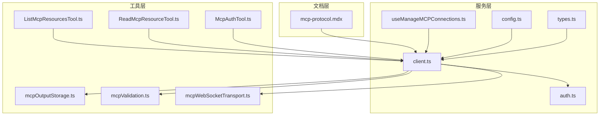
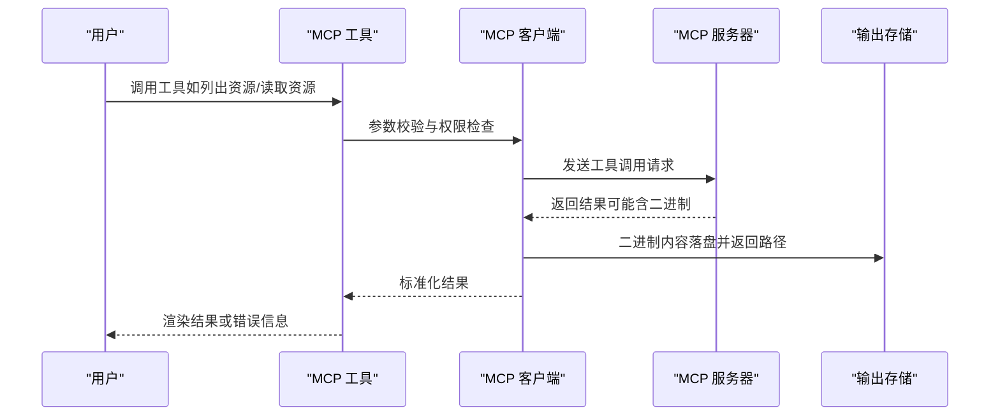
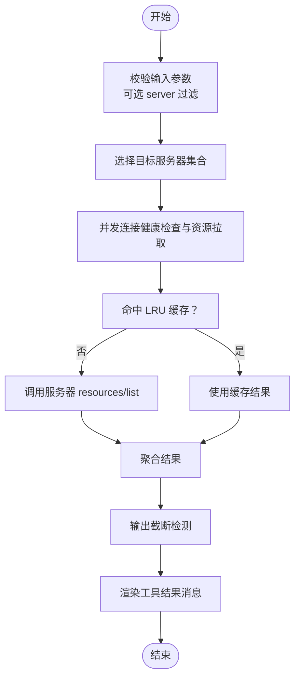
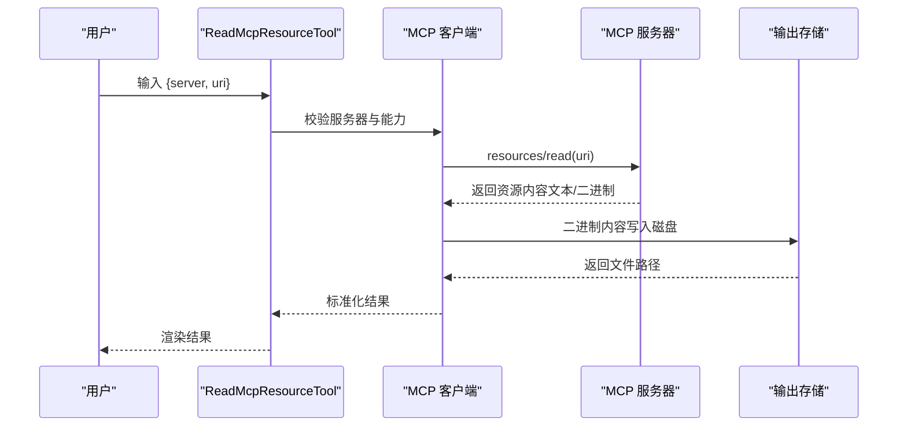
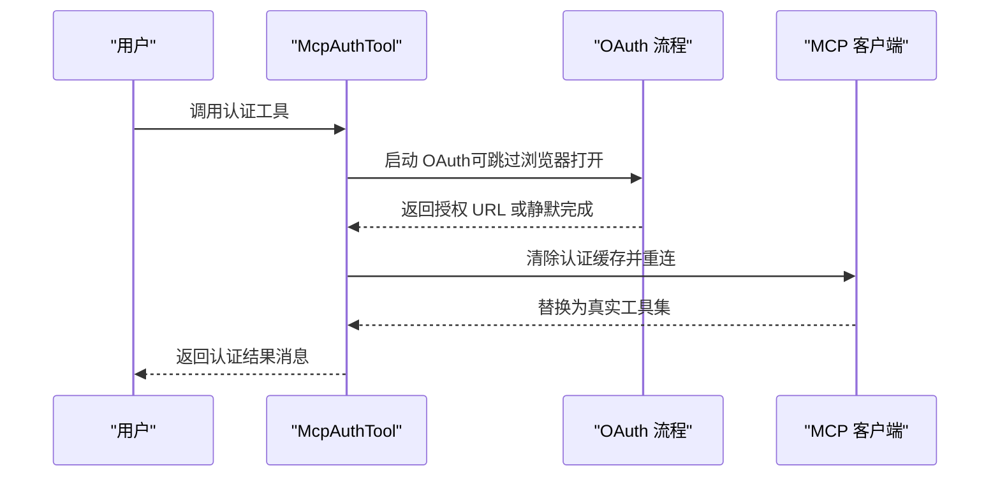
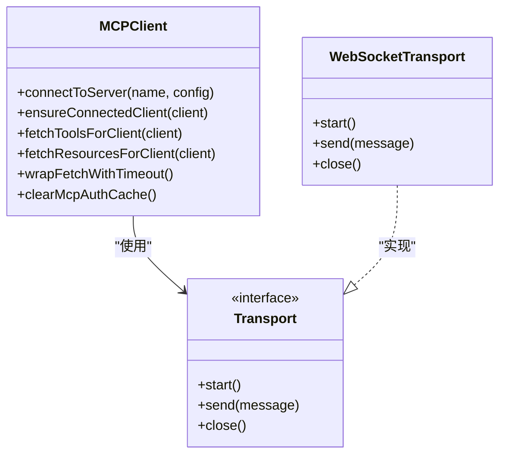
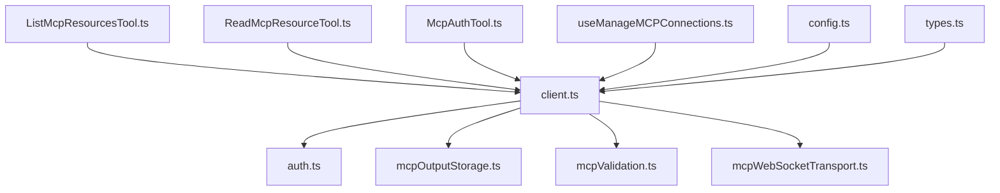

# MCP 工具集成

<cite>
**本文档引用的文件**
- [mcp-protocol.mdx](file://docs/extensibility/mcp-protocol.mdx)
- [ListMcpResourcesTool.ts](file://src/tools/ListMcpResourcesTool/ListMcpResourcesTool.ts)
- [ReadMcpResourceTool.ts](file://src/tools/ReadMcpResourceTool/ReadMcpResourceTool.ts)
- [McpAuthTool.ts](file://src/tools/McpAuthTool/McpAuthTool.ts)
- [client.ts](file://src/services/mcp/client.ts)
- [config.ts](file://src/services/mcp/config.ts)
- [types.ts](file://src/services/mcp/types.ts)
- [auth.ts](file://src/services/mcp/auth.ts)
- [useManageMCPConnections.ts](file://src/services/mcp/useManageMCPConnections.ts)
- [mcpOutputStorage.ts](file://src/utils/mcpOutputStorage.ts)
- [mcpValidation.ts](file://src/utils/mcpValidation.ts)
- [mcpWebSocketTransport.ts](file://src/utils/mcpWebSocketTransport.ts)
</cite>

## 目录
1. [简介](#简介)
2. [项目结构](#项目结构)
3. [核心组件](#核心组件)
4. [架构概览](#架构概览)
5. [详细组件分析](#详细组件分析)
6. [依赖关系分析](#依赖关系分析)
7. [性能考量](#性能考量)
8. [故障排除指南](#故障排除指南)
9. [结论](#结论)
10. [附录](#附录)

## 简介
本文件系统性阐述 Claude Code 中 MCP（Model Context Protocol）工具集成的设计原理、资源管理与工具调用机制。重点覆盖以下方面：
- MCP 工具的注册流程、参数传递与结果处理
- 资源列表工具、资源读取工具与认证工具的使用方法
- MCP 工具配置选项、权限设置与安全考虑
- 实际使用示例、错误处理与调试技巧
- 性能优化、缓存策略与最佳实践

## 项目结构
MCP 工具集成由多个层次协同构成：
- 文档层：提供 MCP 协议与集成概览说明
- 工具层：封装具体 MCP 工具（资源列表、资源读取、认证）
- 服务层：负责 MCP 客户端连接、认证、缓存与通知处理
- 工具层：通用工具能力（输出存储、内容截断、WebSocket 传输）

**图表来源**
- [mcp-protocol.mdx](file://docs/extensibility/mcp-protocol.mdx)
- [ListMcpResourcesTool.ts](file://src/tools/ListMcpResourcesTool/ListMcpResourcesTool.ts)
- [ReadMcpResourceTool.ts](file://src/tools/ReadMcpResourceTool/ReadMcpResourceTool.ts)
- [McpAuthTool.ts](file://src/tools/McpAuthTool/McpAuthTool.ts)
- [client.ts](file://src/services/mcp/client.ts)
- [config.ts](file://src/services/mcp/config.ts)
- [types.ts](file://src/services/mcp/types.ts)
- [auth.ts](file://src/services/mcp/auth.ts)
- [useManageMCPConnections.ts](file://src/services/mcp/useManageMCPConnections.ts)
- [mcpOutputStorage.ts](file://src/utils/mcpOutputStorage.ts)
- [mcpValidation.ts](file://src/utils/mcpValidation.ts)
- [mcpWebSocketTransport.ts](file://src/utils/mcpWebSocketTransport.ts)

**章节来源**
- [mcp-protocol.mdx](file://docs/extensibility/mcp-protocol.mdx)
- [client.ts](file://src/services/mcp/client.ts)

## 核心组件
- MCP 客户端与连接管理：负责服务器连接、能力探测、通知订阅与重连机制
- MCP 工具封装：将 MCP 工具统一为内部 Tool 接口，支持权限检查与 UI 渲染
- 资源管理：提供资源列表与读取能力，支持二进制内容落盘与路径替换
- 认证与授权：支持 OAuth 发现、令牌刷新、跨应用访问（XAA）与安全存储
- 配置与策略：企业级策略（允许/拒绝列表）、插件去重与动态配置
- 传输适配：多种传输层（stdio、SSE、HTTP、WebSocket、IDE 集成）与代理支持

**章节来源**
- [client.ts](file://src/services/mcp/client.ts)
- [types.ts](file://src/services/mcp/types.ts)
- [auth.ts](file://src/services/mcp/auth.ts)
- [config.ts](file://src/services/mcp/config.ts)

## 架构概览
MCP 工具集成遵循“配置 → 连接 → 工具发现 → 权限检查 → 执行 → 结果处理”的完整链路。

**图表来源**
- [client.ts](file://src/services/mcp/client.ts)
- [mcpOutputStorage.ts](file://src/utils/mcpOutputStorage.ts)
- [ListMcpResourcesTool.ts](file://src/tools/ListMcpResourcesTool/ListMcpResourcesTool.ts)
- [ReadMcpResourceTool.ts](file://src/tools/ReadMcpResourceTool/ReadMcpResourceTool.ts)

## 详细组件分析

### 资源列表工具（ListMcpResourcesTool）
职责与特性：
- 支持按服务器过滤资源
- 并行获取各已连接服务器的资源清单
- LRU 缓存与失效策略（基于服务器名称）
- 错误隔离：单个服务器失败不影响整体结果
- 输出截断与 UI 渲染

**图表来源**
- [ListMcpResourcesTool.ts](file://src/tools/ListMcpResourcesTool/ListMcpResourcesTool.ts)
- [client.ts](file://src/services/mcp/client.ts)

**章节来源**
- [ListMcpResourcesTool.ts](file://src/tools/ListMcpResourcesTool/ListMcpResourcesTool.ts)
- [client.ts](file://src/services/mcp/client.ts)

### 资源读取工具（ReadMcpResourceTool）
职责与特性：
- 严格校验服务器存在性、连接状态与资源能力
- 调用 resources/read 获取资源内容
- 二进制内容自动落盘并替换为文件路径
- 图片内容自动缩放与持久化
- 输出截断与 UI 渲染

**图表来源**
- [ReadMcpResourceTool.ts](file://src/tools/ReadMcpResourceTool/ReadMcpResourceTool.ts)
- [client.ts](file://src/services/mcp/client.ts)
- [mcpOutputStorage.ts](file://src/utils/mcpOutputStorage.ts)

**章节来源**
- [ReadMcpResourceTool.ts](file://src/tools/ReadMcpResourceTool/ReadMcpResourceTool.ts)
- [mcpOutputStorage.ts](file://src/utils/mcpOutputStorage.ts)

### 认证工具（McpAuthTool）
职责与特性：
- 为未认证的 MCP 服务器生成“伪工具”，引导用户发起 OAuth 流程
- 支持 HTTP/SSE 传输的 OAuth 授权 URL 获取
- OAuth 成功后自动重连并替换为真实工具集
- 错误处理与日志记录

**图表来源**
- [McpAuthTool.ts](file://src/tools/McpAuthTool/McpAuthTool.ts)
- [auth.ts](file://src/services/mcp/auth.ts)
- [client.ts](file://src/services/mcp/client.ts)

**章节来源**
- [McpAuthTool.ts](file://src/tools/McpAuthTool/McpAuthTool.ts)
- [auth.ts](file://src/services/mcp/auth.ts)

### MCP 客户端与连接管理
职责与特性：
- 多种传输层实现（stdio、SSE、HTTP、WS、IDE 集成、SDK）
- 连接缓存与失效（memoize + onclose 清理）
- 远程连接降级检测与指数回退重连
- 请求级超时保护（避免 AbortSignal 60s 回收问题）
- 工具/资源/命令的 LRU 缓存与变更通知订阅

**图表来源**
- [client.ts](file://src/services/mcp/client.ts)
- [mcpWebSocketTransport.ts](file://src/utils/mcpWebSocketTransport.ts)

**章节来源**
- [client.ts](file://src/services/mcp/client.ts)
- [mcpWebSocketTransport.ts](file://src/utils/mcpWebSocketTransport.ts)

### 配置与策略
职责与特性：
- 企业级策略：允许/拒绝列表（名称、命令、URL 模式）
- 插件与手动配置去重：签名匹配与优先级策略
- 动态配置与范围控制（用户/项目/本地）
- 策略过滤与告警

**章节来源**
- [config.ts](file://src/services/mcp/config.ts)

### 权限与安全
职责与特性：
- 工具权限检查：MCP 工具默认走权限确认流程
- OAuth 安全：元数据发现、令牌刷新、撤销与红蓝日志
- XAA（跨应用访问）：统一 IdP 登录与令牌交换
- 传输安全：代理、TLS、User-Agent、头部合并与敏感参数脱敏

**章节来源**
- [client.ts](file://src/services/mcp/client.ts)
- [auth.ts](file://src/services/mcp/auth.ts)
- [useManageMCPConnections.ts](file://src/services/mcp/useManageMCPConnections.ts)

## 依赖关系分析

**图表来源**
- [ListMcpResourcesTool.ts](file://src/tools/ListMcpResourcesTool/ListMcpResourcesTool.ts)
- [ReadMcpResourceTool.ts](file://src/tools/ReadMcpResourceTool/ReadMcpResourceTool.ts)
- [McpAuthTool.ts](file://src/tools/McpAuthTool/McpAuthTool.ts)
- [client.ts](file://src/services/mcp/client.ts)
- [auth.ts](file://src/services/mcp/auth.ts)
- [mcpOutputStorage.ts](file://src/utils/mcpOutputStorage.ts)
- [mcpValidation.ts](file://src/utils/mcpValidation.ts)
- [mcpWebSocketTransport.ts](file://src/utils/mcpWebSocketTransport.ts)
- [useManageMCPConnections.ts](file://src/services/mcp/useManageMCPConnections.ts)
- [config.ts](file://src/services/mcp/config.ts)
- [types.ts](file://src/services/mcp/types.ts)

**章节来源**
- [client.ts](file://src/services/mcp/client.ts)

## 性能考量
- 连接缓存：connectToServer 使用 memoize，缓存键包含服务器配置哈希，避免重复连接
- 并发控制：本地服务器默认并发 3，远程服务器默认并发 20；可通过环境变量调整
- 请求超时：每个 HTTP 请求使用独立超时控制器，避免 AbortSignal 60s 回收导致的内存泄漏
- 工具/资源缓存：LRU 缓存（上限 20），配合服务器通知（list_changed）进行失效
- 输出截断：基于令牌估算与内容大小启发式判断，必要时截断并附加提示
- 二进制内容：自动落盘并替换路径，避免将大体积二进制直接注入上下文

**章节来源**
- [client.ts](file://src/services/mcp/client.ts)
- [mcpValidation.ts](file://src/utils/mcpValidation.ts)
- [mcpOutputStorage.ts](file://src/utils/mcpOutputStorage.ts)

## 故障排除指南
常见问题与定位建议：
- 连接超时：检查 MCP_TIMEOUT 与网络代理设置；查看连接日志中的 URL、头信息与错误栈
- 401 未授权：确认 OAuth 配置与令牌是否有效；查看 needs-auth 缓存文件与认证流程日志
- SSE/WS 断开：关注连续错误计数与最大重连次数；确认服务器端是否支持长连接
- 工具/资源不更新：检查 list_changed 通知是否启用与缓存失效逻辑
- 输出过大：启用截断与分块读取；使用文件路径替代直接上下文注入
- 二进制内容异常：检查 MIME 类型映射与文件扩展名；确认磁盘写入权限

**章节来源**
- [client.ts](file://src/services/mcp/client.ts)
- [auth.ts](file://src/services/mcp/auth.ts)
- [mcpValidation.ts](file://src/utils/mcpValidation.ts)
- [mcpOutputStorage.ts](file://src/utils/mcpOutputStorage.ts)

## 结论
MCP 工具集成在 Claude Code 中实现了从配置到工具执行的完整闭环：通过多传输层适配、严格的认证与安全策略、完善的缓存与重连机制，以及对输出与二进制内容的精细化处理，既保证了易用性，也兼顾了性能与安全性。推荐在生产环境中结合企业策略、监控与日志体系，持续优化连接并发、缓存策略与错误恢复。

## 附录

### 实际使用示例
- 列出资源：调用资源列表工具，传入可选 server 名称进行过滤
- 读取资源：调用资源读取工具，传入 server 与 uri，自动处理二进制内容落盘
- 认证流程：调用认证工具，获取授权 URL 或静默完成，随后自动重连并替换工具

**章节来源**
- [ListMcpResourcesTool.ts](file://src/tools/ListMcpResourcesTool/ListMcpResourcesTool.ts)
- [ReadMcpResourceTool.ts](file://src/tools/ReadMcpResourceTool/ReadMcpResourceTool.ts)
- [McpAuthTool.ts](file://src/tools/McpAuthTool/McpAuthTool.ts)

### 配置选项与环境变量
- MCP_TOOL_TIMEOUT：工具调用超时（毫秒）
- MCP_TIMEOUT：连接超时（毫秒）
- MCP_SERVER_CONNECTION_BATCH_SIZE：本地服务器连接并发
- MCP_REMOTE_SERVER_CONNECTION_BATCH_SIZE：远程服务器连接并发
- MAX_MCP_OUTPUT_TOKENS：MCP 输出令牌上限
- MCP_TOOL_MAX_RESULT_SIZE_CHARS：工具结果大小限制

**章节来源**
- [client.ts](file://src/services/mcp/client.ts)
- [mcpValidation.ts](file://src/utils/mcpValidation.ts)