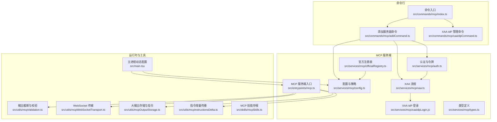
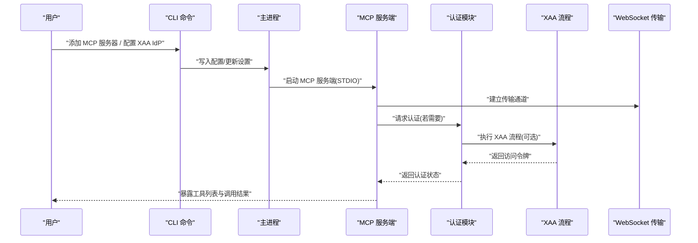
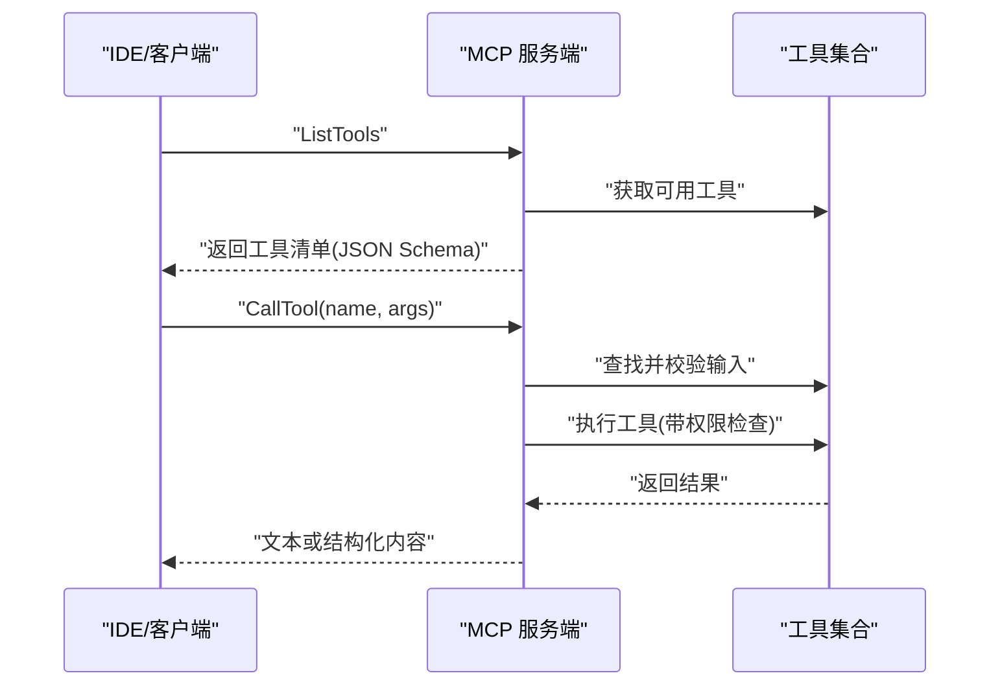
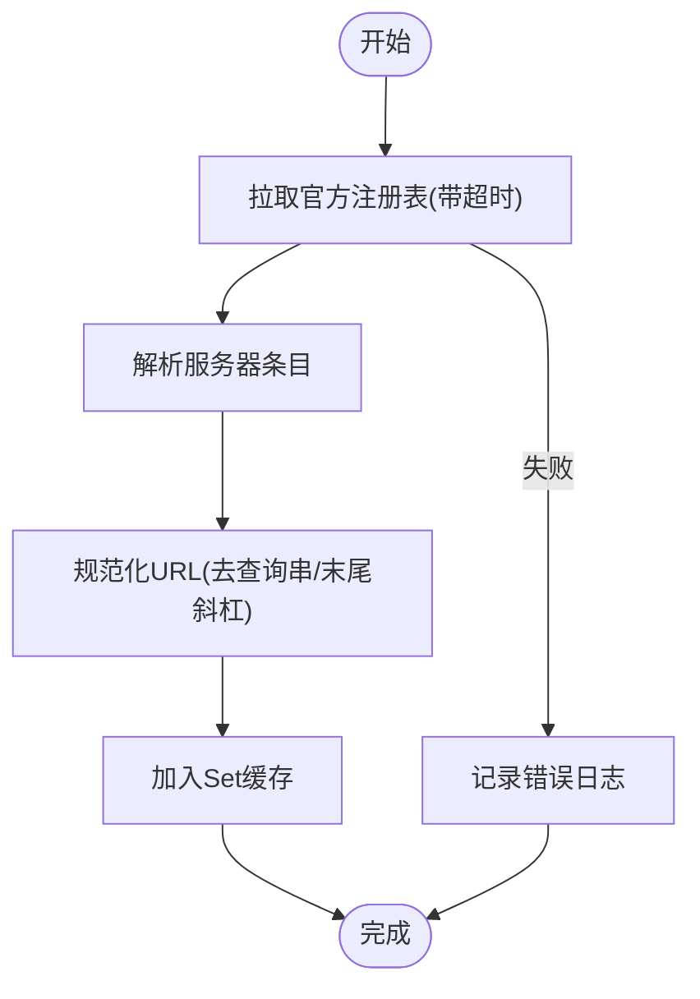
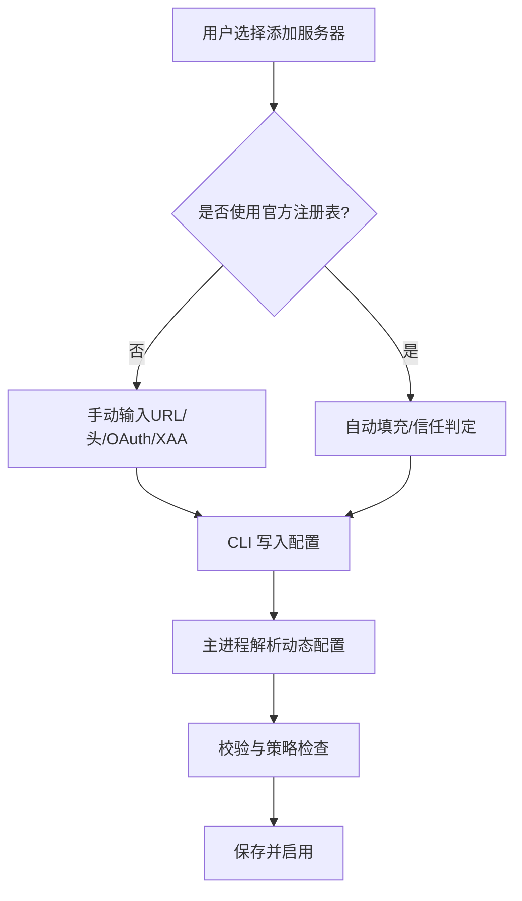
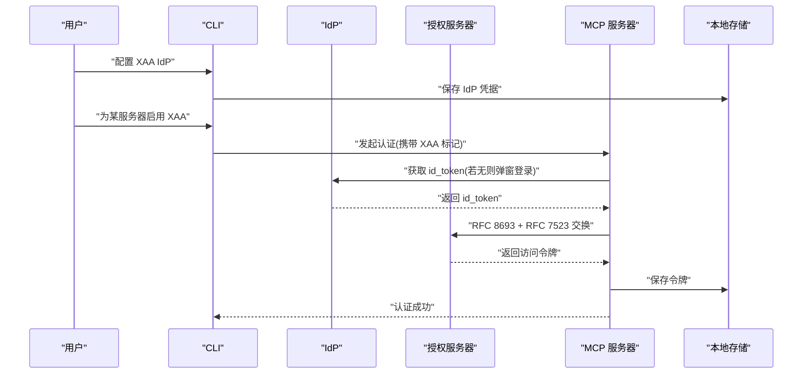
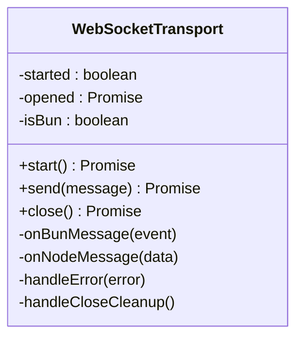
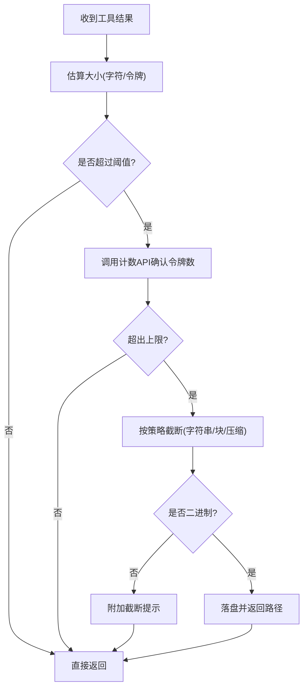
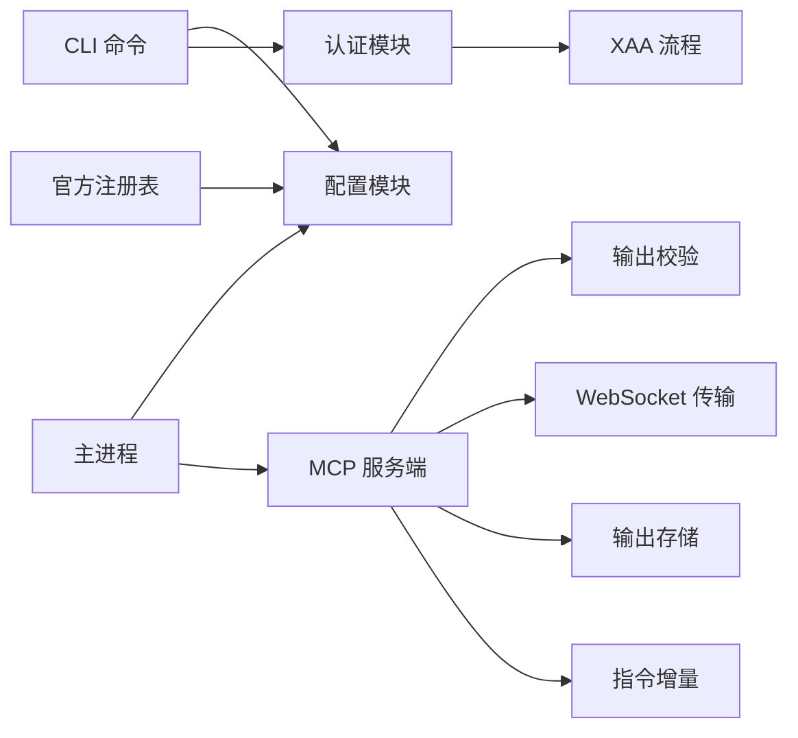

# MCP 服务器支持

<cite>
**本文引用的文件**   
- [src/entrypoints/mcp.ts](file://src/entrypoints/mcp.ts)
- [src/services/mcp/officialRegistry.ts](file://src/services/mcp/officialRegistry.ts)
- [src/services/mcp/config.ts](file://src/services/mcp/config.ts)
- [src/services/mcp/auth.ts](file://src/services/mcp/auth.ts)
- [src/services/mcp/xaa.ts](file://src/services/mcp/xaa.ts)
- [src/services/mcp/xaaIdpLogin.js](file://src/services/mcp/xaaIdpLogin.js)
- [src/services/mcp/types.ts](file://src/services/mcp/types.ts)
- [src/utils/mcpValidation.ts](file://src/utils/mcpValidation.ts)
- [src/utils/mcpWebSocketTransport.ts](file://src/utils/mcpWebSocketTransport.ts)
- [src/utils/mcpOutputStorage.ts](file://src/utils/mcpOutputStorage.ts)
- [src/utils/mcpInstructionsDelta.ts](file://src/utils/mcpInstructionsDelta.ts)
- [src/skills/mcpSkills.ts](file://src/skills/mcpSkills.ts)
- [src/commands/mcp/index.ts](file://src/commands/mcp/index.ts)
- [src/commands/mcp/addCommand.ts](file://src/commands/mcp/addCommand.ts)
- [src/commands/mcp/xaaIdpCommand.ts](file://src/commands/mcp/xaaIdpCommand.ts)
- [src/main.tsx](file://src/main.tsx)
</cite>

## 目录
1. [简介](#简介)
2. [项目结构](#项目结构)
3. [核心组件](#核心组件)
4. [架构总览](#架构总览)
5. [组件详解](#组件详解)
6. [依赖关系分析](#依赖关系分析)
7. [性能与容量](#性能与容量)
8. [故障排除指南](#故障排除指南)
9. [结论](#结论)
10. [附录：配置与使用示例](#附录配置与使用示例)

## 简介
本文件系统化梳理 Claude Code 中对 MCP（Model Context Protocol）服务器的支持，覆盖官方服务器注册表、Claude AI 服务器与 VS Code SDK MCP 的集成路径；详述服务器发现、自动与手动配置流程；阐述 XAA（跨应用访问）身份验证、登录与安全认证机制；提供连接配置、证书管理与网络设置指南；给出多类型服务器的使用示例与配置模板；并包含兼容性检查、版本管理与故障排除方法。

## 项目结构
围绕 MCP 的核心代码分布在以下模块：
- 入口与服务端实现：MCP 服务端入口、官方注册表、配置与认证、XAA 流程、工具输出与传输等
- 命令行与 UI 集成：CLI 子命令用于添加/管理 MCP 服务器，以及 XAA IdP 管理
- 工具与技能：MCP 工具与技能的暴露与权限控制
- 运行时与主进程：动态 MCP 配置解析与加载

**图表来源**
- [src/entrypoints/mcp.ts:1-197](file://src/entrypoints/mcp.ts#L1-L197)
- [src/services/mcp/officialRegistry.ts:1-73](file://src/services/mcp/officialRegistry.ts#L1-L73)
- [src/services/mcp/config.ts:657-679](file://src/services/mcp/config.ts#L657-L679)
- [src/services/mcp/auth.ts:620-901](file://src/services/mcp/auth.ts#L620-L901)
- [src/services/mcp/xaa.ts:398-439](file://src/services/mcp/xaa.ts#L398-L439)
- [src/services/mcp/xaaIdpLogin.js](file://src/services/mcp/xaaIdpLogin.js)
- [src/services/mcp/types.ts](file://src/services/mcp/types.ts)
- [src/utils/mcpValidation.ts:1-209](file://src/utils/mcpValidation.ts#L1-L209)
- [src/utils/mcpWebSocketTransport.ts:1-201](file://src/utils/mcpWebSocketTransport.ts#L1-L201)
- [src/utils/mcpOutputStorage.ts:1-190](file://src/utils/mcpOutputStorage.ts#L1-L190)
- [src/utils/mcpInstructionsDelta.ts:1-131](file://src/utils/mcpInstructionsDelta.ts#L1-L131)
- [src/skills/mcpSkills.ts:1-8](file://src/skills/mcpSkills.ts#L1-L8)
- [src/commands/mcp/index.ts:1-13](file://src/commands/mcp/index.ts#L1-L13)
- [src/commands/mcp/addCommand.ts:198-229](file://src/commands/mcp/addCommand.ts#L198-L229)
- [src/commands/mcp/xaaIdpCommand.ts:1-27](file://src/commands/mcp/xaaIdpCommand.ts#L1-L27)
- [src/main.tsx:1413-1422](file://src/main.tsx#L1413-L1422)

**章节来源**
- [src/entrypoints/mcp.ts:1-197](file://src/entrypoints/mcp.ts#L1-L197)
- [src/services/mcp/officialRegistry.ts:1-73](file://src/services/mcp/officialRegistry.ts#L1-L73)
- [src/services/mcp/config.ts:657-679](file://src/services/mcp/config.ts#L657-L679)
- [src/services/mcp/auth.ts:620-901](file://src/services/mcp/auth.ts#L620-L901)
- [src/services/mcp/xaa.ts:398-439](file://src/services/mcp/xaa.ts#L398-L439)
- [src/services/mcp/xaaIdpLogin.js](file://src/services/mcp/xaaIdpLogin.js)
- [src/services/mcp/types.ts](file://src/services/mcp/types.ts)
- [src/utils/mcpValidation.ts:1-209](file://src/utils/mcpValidation.ts#L1-L209)
- [src/utils/mcpWebSocketTransport.ts:1-201](file://src/utils/mcpWebSocketTransport.ts#L1-L201)
- [src/utils/mcpOutputStorage.ts:1-190](file://src/utils/mcpOutputStorage.ts#L1-L190)
- [src/utils/mcpInstructionsDelta.ts:1-131](file://src/utils/mcpInstructionsDelta.ts#L1-L131)
- [src/skills/mcpSkills.ts:1-8](file://src/skills/mcpSkills.ts#L1-L8)
- [src/commands/mcp/index.ts:1-13](file://src/commands/mcp/index.ts#L1-L13)
- [src/commands/mcp/addCommand.ts:198-229](file://src/commands/mcp/addCommand.ts#L198-L229)
- [src/commands/mcp/xaaIdpCommand.ts:1-27](file://src/commands/mcp/xaaIdpCommand.ts#L1-L27)
- [src/main.tsx:1413-1422](file://src/main.tsx#L1413-L1422)

## 核心组件
- MCP 服务端入口：基于 SDK 创建 MCP 服务端，暴露工具列表与调用处理，通过 STDIO 传输
- 官方注册表：拉取并缓存官方 MCP 服务器地址，用于合规与信任判定
- 配置与策略：校验服务器配置、企业策略白名单/黑名单检查
- 认证与令牌：支持 OAuth 与 XAA（跨应用访问）两种认证路径，含令牌持久化与刷新
- XAA 流程：从 IdP 获取 id_token，执行 RFC 8693 + RFC 7523 交换，生成 JWT Bearer 并换取访问令牌
- 输出与传输：WebSocket 传输适配器、内容截断与二进制输出落盘、指令增量传播
- CLI 与主进程：命令行添加服务器、XAA IdP 管理；主进程解析动态配置

**章节来源**
- [src/entrypoints/mcp.ts:35-196](file://src/entrypoints/mcp.ts#L35-L196)
- [src/services/mcp/officialRegistry.ts:29-72](file://src/services/mcp/officialRegistry.ts#L29-L72)
- [src/services/mcp/config.ts:657-679](file://src/services/mcp/config.ts#L657-L679)
- [src/services/mcp/auth.ts:664-901](file://src/services/mcp/auth.ts#L664-L901)
- [src/services/mcp/xaa.ts:426-439](file://src/services/mcp/xaa.ts#L426-L439)
- [src/utils/mcpWebSocketTransport.ts:22-200](file://src/utils/mcpWebSocketTransport.ts#L22-L200)
- [src/utils/mcpValidation.ts:26-47](file://src/utils/mcpValidation.ts#L26-L47)
- [src/utils/mcpOutputStorage.ts:138-190](file://src/utils/mcpOutputStorage.ts#L138-L190)
- [src/utils/mcpInstructionsDelta.ts:37-131](file://src/utils/mcpInstructionsDelta.ts#L37-L131)
- [src/commands/mcp/index.ts:3-12](file://src/commands/mcp/index.ts#L3-L12)
- [src/commands/mcp/addCommand.ts:198-229](file://src/commands/mcp/addCommand.ts#L198-L229)
- [src/main.tsx:1413-1422](file://src/main.tsx#L1413-L1422)

## 架构总览
下图展示 MCP 服务器在客户端侧的整体交互：CLI 添加服务器与 XAA IdP 配置，主进程加载动态配置，MCP 服务端通过 STDIO 暴露工具，认证模块负责 OAuth/XAA，传输层负责 WebSocket 通信，工具结果经截断与落盘处理后返回。

**图表来源**
- [src/entrypoints/mcp.ts:35-196](file://src/entrypoints/mcp.ts#L35-L196)
- [src/services/mcp/auth.ts:664-901](file://src/services/mcp/auth.ts#L664-L901)
- [src/services/mcp/xaa.ts:426-439](file://src/services/mcp/xaa.ts#L426-L439)
- [src/utils/mcpWebSocketTransport.ts:142-199](file://src/utils/mcpWebSocketTransport.ts#L142-L199)
- [src/commands/mcp/addCommand.ts:198-229](file://src/commands/mcp/addCommand.ts#L198-L229)
- [src/commands/mcp/xaaIdpCommand.ts:1-27](file://src/commands/mcp/xaaIdpCommand.ts#L1-L27)
- [src/main.tsx:1413-1422](file://src/main.tsx#L1413-L1422)

## 组件详解

### MCP 服务端入口与工具暴露
- 通过 STDIO 传输启动 MCP 服务端，声明能力为工具
- 列出工具时将工具输入/输出模式转换为 JSON Schema，并按权限上下文过滤
- 调用工具时构建工具使用上下文，执行前校验输入，异常统一转为错误响应

**图表来源**
- [src/entrypoints/mcp.ts:59-188](file://src/entrypoints/mcp.ts#L59-L188)

**章节来源**
- [src/entrypoints/mcp.ts:35-196](file://src/entrypoints/mcp.ts#L35-L196)

### 官方服务器注册表与信任判定
- 后台拉取官方 MCP 服务器清单，规范化 URL 并缓存
- 提供 isOfficialMcpUrl 判定函数，未命中注册表时采用“失败关闭”策略
- 支持测试重置缓存

**图表来源**
- [src/services/mcp/officialRegistry.ts:33-60](file://src/services/mcp/officialRegistry.ts#L33-L60)

**章节来源**
- [src/services/mcp/officialRegistry.ts:1-73](file://src/services/mcp/officialRegistry.ts#L1-L73)

### 服务器发现、自动与手动配置
- 自动配置：后台预取官方注册表，便于后续信任判定与合规检查
- 手动配置：CLI 添加命令支持 HTTP 类型服务器，可指定头、回调端口、OAuth 或 XAA 标记
- 主进程支持动态 MCP 配置字符串/文件解析，进行校验与合并

**图表来源**
- [src/commands/mcp/addCommand.ts:198-229](file://src/commands/mcp/addCommand.ts#L198-L229)
- [src/main.tsx:1413-1422](file://src/main.tsx#L1413-L1422)
- [src/services/mcp/officialRegistry.ts:33-60](file://src/services/mcp/officialRegistry.ts#L33-L60)

**章节来源**
- [src/commands/mcp/addCommand.ts:198-229](file://src/commands/mcp/addCommand.ts#L198-L229)
- [src/main.tsx:1413-1422](file://src/main.tsx#L1413-L1422)
- [src/services/mcp/officialRegistry.ts:1-73](file://src/services/mcp/officialRegistry.ts#L1-L73)

### XAA 身份验证、登录流程与安全认证
- XAA 流程：IdP 登录获取 id_token，PRM 发现授权服务器，RFC 8693 + RFC 7523 交换，生成 JWT Bearer 并换取访问令牌
- IdP 配置：一次性配置，所有 XAA 服务器复用同一 IdP 凭据
- 认证路径：若服务器配置开启 XAA，则强制走 XAA；否则走常规 OAuth
- 令牌持久化：与 OAuth 使用相同密钥链槽位，支持清理

**图表来源**
- [src/services/mcp/auth.ts:664-901](file://src/services/mcp/auth.ts#L664-L901)
- [src/services/mcp/xaa.ts:426-439](file://src/services/mcp/xaa.ts#L426-L439)
- [src/services/mcp/xaaIdpLogin.js](file://src/services/mcp/xaaIdpLogin.js)
- [src/commands/mcp/xaaIdpCommand.ts:1-27](file://src/commands/mcp/xaaIdpCommand.ts#L1-L27)

**章节来源**
- [src/services/mcp/auth.ts:620-901](file://src/services/mcp/auth.ts#L620-L901)
- [src/services/mcp/xaa.ts:398-439](file://src/services/mcp/xaa.ts#L398-L439)
- [src/services/mcp/xaaIdpLogin.js](file://src/services/mcp/xaaIdpLogin.js)
- [src/commands/mcp/xaaIdpCommand.ts:1-27](file://src/commands/mcp/xaaIdpCommand.ts#L1-L27)

### 服务器连接配置、证书管理与网络设置
- 传输层：WebSocketTransport 支持原生与 ws 两种环境，统一封装事件监听、消息解析与发送
- 连接状态：start/close 明确生命周期，readyState 校验防止非法操作
- 网络与证书：通过 ws 包或原生 WebSocket 发送 JSON-RPC 消息；证书由底层运行时处理
- 失败诊断：连接失败、消息失败、发送失败均有诊断日志

**图表来源**
- [src/utils/mcpWebSocketTransport.ts:22-200](file://src/utils/mcpWebSocketTransport.ts#L22-L200)

**章节来源**
- [src/utils/mcpWebSocketTransport.ts:1-201](file://src/utils/mcpWebSocketTransport.ts#L1-L201)

### 工具输出截断、二进制落盘与指令增量传播
- 截断阈值：基于令牌估算与环境变量/特性开关双重控制，避免超限
- 截断策略：字符串直接裁剪，结构化内容按块裁剪并尝试压缩图片
- 二进制落盘：根据 MIME 推导扩展名，写入工具结果目录，提供读取指引
- 指令增量：会话中仅对新增/移除的服务器广播其初始化说明，减少冗余

**图表来源**
- [src/utils/mcpValidation.ts:151-208](file://src/utils/mcpValidation.ts#L151-L208)
- [src/utils/mcpOutputStorage.ts:148-190](file://src/utils/mcpOutputStorage.ts#L148-L190)
- [src/utils/mcpInstructionsDelta.ts:55-131](file://src/utils/mcpInstructionsDelta.ts#L55-L131)

**章节来源**
- [src/utils/mcpValidation.ts:1-209](file://src/utils/mcpValidation.ts#L1-L209)
- [src/utils/mcpOutputStorage.ts:1-190](file://src/utils/mcpOutputStorage.ts#L1-L190)
- [src/utils/mcpInstructionsDelta.ts:1-131](file://src/utils/mcpInstructionsDelta.ts#L1-L131)

### VS Code SDK MCP 集成要点
- VS Code 侧通过 MCP SDK 连接客户端提供的 MCP 服务端（STDIO）
- 客户端在启动时建立传输并注册工具处理器，IDE 侧可列出并调用工具
- 本仓库以服务端视角实现，VS Code 作为客户端消费工具

**章节来源**
- [src/entrypoints/mcp.ts:35-196](file://src/entrypoints/mcp.ts#L35-L196)

## 依赖关系分析
- 命令行依赖配置与认证模块，确保服务器合法性与安全性
- 服务端入口依赖工具系统、权限与消息工具，输出经截断与落盘处理
- 传输层独立于业务逻辑，提供跨平台 WebSocket 封装
- 注册表为信任与合规提供数据支撑

**图表来源**
- [src/commands/mcp/index.ts:3-12](file://src/commands/mcp/index.ts#L3-L12)
- [src/commands/mcp/addCommand.ts:198-229](file://src/commands/mcp/addCommand.ts#L198-L229)
- [src/services/mcp/config.ts:657-679](file://src/services/mcp/config.ts#L657-L679)
- [src/services/mcp/auth.ts:664-901](file://src/services/mcp/auth.ts#L664-L901)
- [src/services/mcp/xaa.ts:426-439](file://src/services/mcp/xaa.ts#L426-L439)
- [src/main.tsx:1413-1422](file://src/main.tsx#L1413-L1422)
- [src/entrypoints/mcp.ts:35-196](file://src/entrypoints/mcp.ts#L35-L196)
- [src/utils/mcpValidation.ts:1-209](file://src/utils/mcpValidation.ts#L1-L209)
- [src/utils/mcpWebSocketTransport.ts:1-201](file://src/utils/mcpWebSocketTransport.ts#L1-L201)
- [src/utils/mcpOutputStorage.ts:1-190](file://src/utils/mcpOutputStorage.ts#L1-L190)
- [src/utils/mcpInstructionsDelta.ts:1-131](file://src/utils/mcpInstructionsDelta.ts#L1-L131)
- [src/services/mcp/officialRegistry.ts:1-73](file://src/services/mcp/officialRegistry.ts#L1-L73)

**章节来源**
- [src/commands/mcp/index.ts:1-13](file://src/commands/mcp/index.ts#L1-L13)
- [src/commands/mcp/addCommand.ts:198-229](file://src/commands/mcp/addCommand.ts#L198-L229)
- [src/services/mcp/config.ts:657-679](file://src/services/mcp/config.ts#L657-L679)
- [src/services/mcp/auth.ts:620-901](file://src/services/mcp/auth.ts#L620-L901)
- [src/services/mcp/xaa.ts:398-439](file://src/services/mcp/xaa.ts#L398-L439)
- [src/main.tsx:1413-1422](file://src/main.tsx#L1413-L1422)
- [src/entrypoints/mcp.ts:1-197](file://src/entrypoints/mcp.ts#L1-L197)
- [src/utils/mcpValidation.ts:1-209](file://src/utils/mcpValidation.ts#L1-L209)
- [src/utils/mcpWebSocketTransport.ts:1-201](file://src/utils/mcpWebSocketTransport.ts#L1-L201)
- [src/utils/mcpOutputStorage.ts:1-190](file://src/utils/mcpOutputStorage.ts#L1-L190)
- [src/utils/mcpInstructionsDelta.ts:1-131](file://src/utils/mcpInstructionsDelta.ts#L1-L131)
- [src/services/mcp/officialRegistry.ts:1-73](file://src/services/mcp/officialRegistry.ts#L1-L73)

## 性能与容量
- 工具列表转换：将 Zod 模式转 JSON Schema，过滤不支持的联合类型，避免运行时开销
- 缓存与截断：文件状态缓存限制、输出截断阈值与估算，降低内存与令牌消耗
- 传输优化：统一事件监听与错误处理，避免重复绑定与泄漏
- 环境可控：通过环境变量与特性开关调整输出上限，满足不同场景需求

**章节来源**
- [src/entrypoints/mcp.ts:66-96](file://src/entrypoints/mcp.ts#L66-L96)
- [src/utils/mcpValidation.ts:26-47](file://src/utils/mcpValidation.ts#L26-L47)
- [src/utils/mcpWebSocketTransport.ts:142-199](file://src/utils/mcpWebSocketTransport.ts#L142-L199)

## 故障排除指南
- 连接失败
  - 检查 WebSocket 是否已打开，readyState 必须为 OPEN
  - 查看诊断日志中的连接失败/消息失败标记
- 认证失败
  - 若启用 XAA，确认 IdP 已配置且 id_token 可用
  - 检查授权服务器端点与客户端凭据
- 输出过大
  - 调整 MAX_MCP_OUTPUT_TOKENS 或特性开关
  - 使用分页/过滤工具或按提示分块读取落盘文件
- 指令未生效
  - 确认服务器连接状态与初始化说明是否变更
  - 检查会话附件中是否已广播对应服务器的说明块

**章节来源**
- [src/utils/mcpWebSocketTransport.ts:142-199](file://src/utils/mcpWebSocketTransport.ts#L142-L199)
- [src/services/mcp/auth.ts:664-901](file://src/services/mcp/auth.ts#L664-L901)
- [src/utils/mcpValidation.ts:151-208](file://src/utils/mcpValidation.ts#L151-L208)
- [src/utils/mcpInstructionsDelta.ts:55-131](file://src/utils/mcpInstructionsDelta.ts#L55-L131)

## 结论
本实现以服务端为核心，结合官方注册表、严格的配置与策略校验、灵活的认证路径（OAuth/XAA）、稳健的传输与输出处理，为 MCP 服务器在 Claude Code 中的集成提供了完整方案。通过 CLI 与主进程的配合，既支持自动发现与信任判定，也支持手动配置与细粒度控制，满足企业级合规与安全要求。

## 附录：配置与使用示例

### 示例一：手动添加 HTTP 服务器（含 OAuth）
- 步骤
  - 使用命令添加服务器，指定 URL、自定义头、回调端口与客户端凭据
  - 如需 XAA，添加 xaa 标记并在 IdP 中完成一次性配置
- 关键参数
  - url：服务器地址
  - headers：请求头
  - oauth.clientId/callbackPort/xaa：认证方式
- 参考路径
  - [src/commands/mcp/addCommand.ts:198-229](file://src/commands/mcp/addCommand.ts#L198-L229)

**章节来源**
- [src/commands/mcp/addCommand.ts:198-229](file://src/commands/mcp/addCommand.ts#L198-L229)

### 示例二：XAA IdP 配置与使用
- 步骤
  - 一次性配置 IdP（issuer、client-id、client-secret）
  - 对目标服务器启用 XAA
  - 首次认证会触发 IdP 登录，后续复用缓存
- 参考路径
  - [src/commands/mcp/xaaIdpCommand.ts:1-27](file://src/commands/mcp/xaaIdpCommand.ts#L1-L27)
  - [src/services/mcp/xaaIdpLogin.js](file://src/services/mcp/xaaIdpLogin.js)
  - [src/services/mcp/auth.ts:664-901](file://src/services/mcp/auth.ts#L664-L901)

**章节来源**
- [src/commands/mcp/xaaIdpCommand.ts:1-27](file://src/commands/mcp/xaaIdpCommand.ts#L1-L27)
- [src/services/mcp/xaaIdpLogin.js](file://src/services/mcp/xaaIdpLogin.js)
- [src/services/mcp/auth.ts:664-901](file://src/services/mcp/auth.ts#L664-L901)

### 示例三：动态 MCP 配置注入
- 步骤
  - 在启动参数中传入 MCP 配置字符串/文件
  - 主进程解析并合并，进行校验与策略检查
- 参考路径
  - [src/main.tsx:1413-1422](file://src/main.tsx#L1413-L1422)
  - [src/services/mcp/config.ts:657-679](file://src/services/mcp/config.ts#L657-L679)

**章节来源**
- [src/main.tsx:1413-1422](file://src/main.tsx#L1413-L1422)
- [src/services/mcp/config.ts:657-679](file://src/services/mcp/config.ts#L657-L679)

### 示例四：服务器兼容性与版本管理
- 兼容性检查
  - 通过官方注册表判定服务器 URL 是否受官方认可
  - 企业策略白名单/黑名单控制
- 版本管理
  - 服务端声明版本号，客户端据此进行能力协商
- 参考路径
  - [src/services/mcp/officialRegistry.ts:66-68](file://src/services/mcp/officialRegistry.ts#L66-L68)
  - [src/services/mcp/config.ts:657-679](file://src/services/mcp/config.ts#L657-L679)
  - [src/entrypoints/mcp.ts:47-57](file://src/entrypoints/mcp.ts#L47-L57)

**章节来源**
- [src/services/mcp/officialRegistry.ts:62-68](file://src/services/mcp/officialRegistry.ts#L62-L68)
- [src/services/mcp/config.ts:657-679](file://src/services/mcp/config.ts#L657-L679)
- [src/entrypoints/mcp.ts:47-57](file://src/entrypoints/mcp.ts#L47-L57)