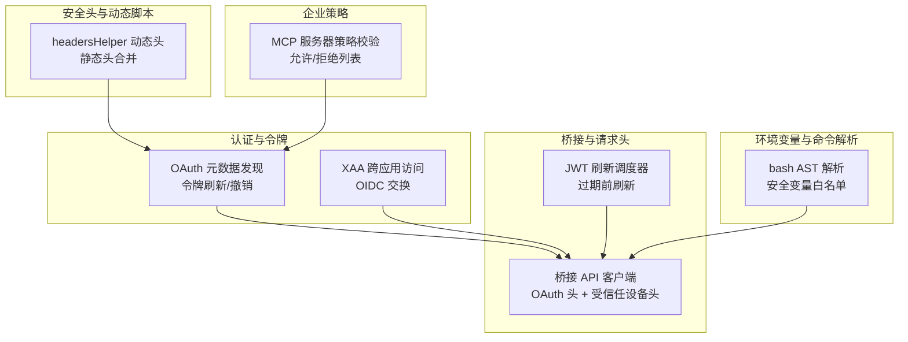
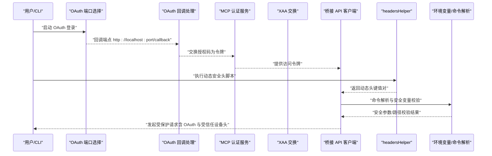
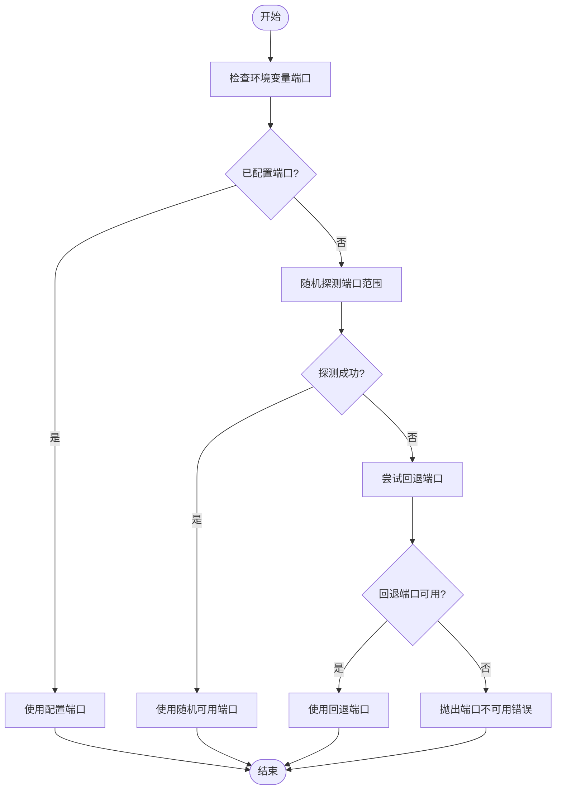
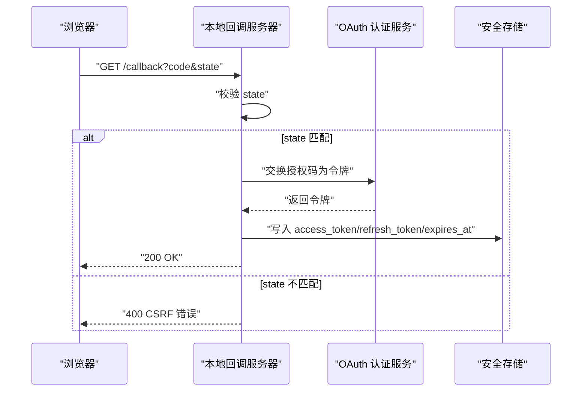
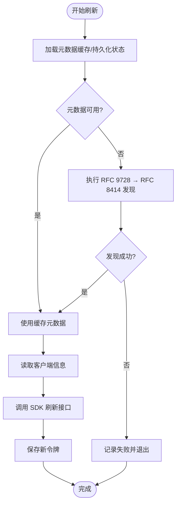
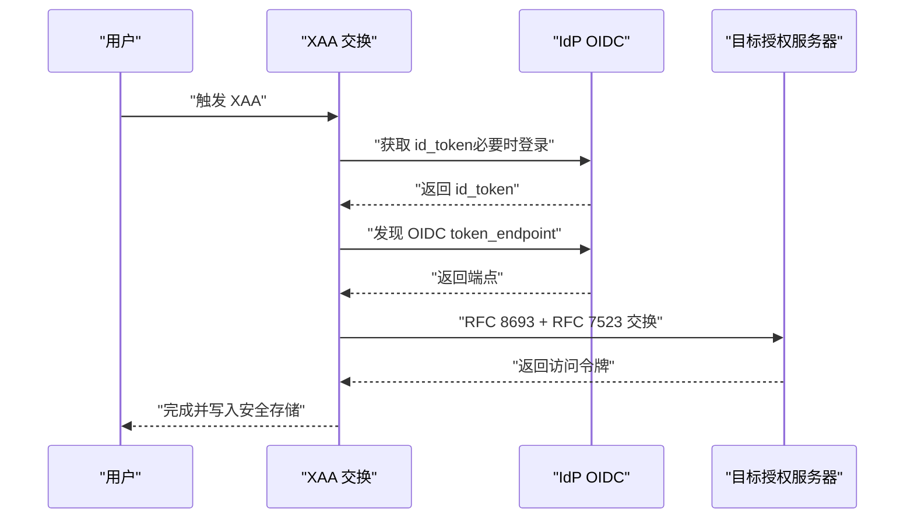
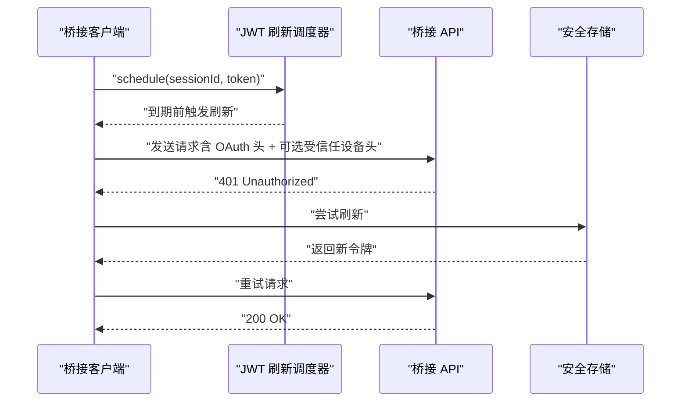
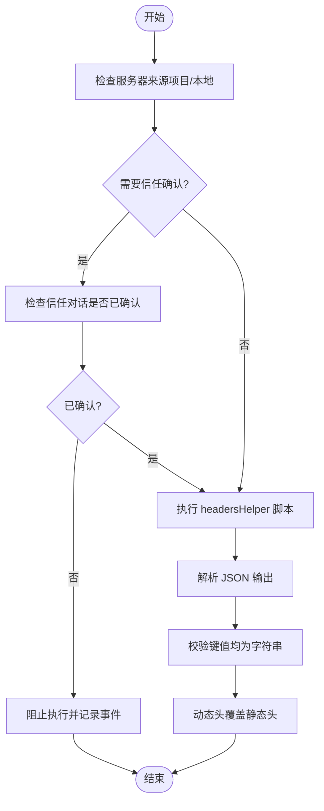
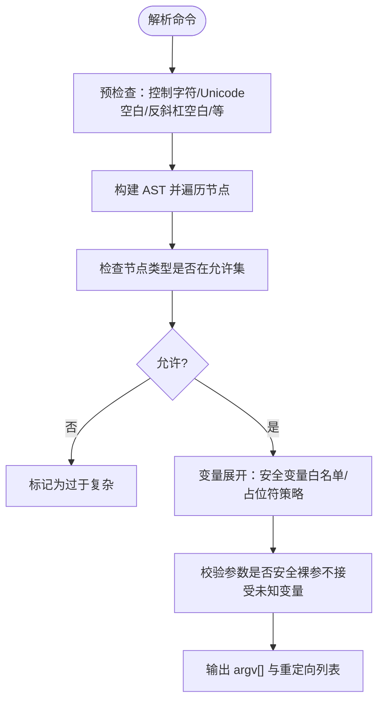
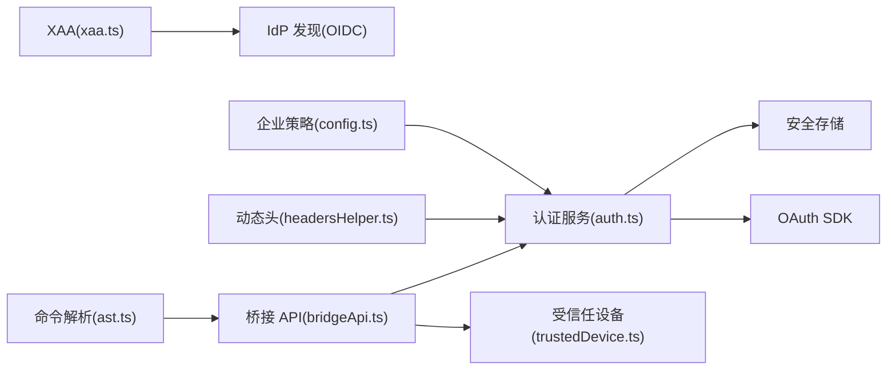

# 认证与安全

<cite>
**本文引用的文件**
- [src/services/mcp/auth.ts](file://src/services/mcp/auth.ts)
- [src/services/mcp/oauthPort.ts](file://src/services/mcp/oauthPort.ts)
- [src/services/mcp/headersHelper.ts](file://src/services/mcp/headersHelper.ts)
- [src/services/mcp/xaa.ts](file://src/services/mcp/xaa.ts)
- [src/bridge/jwtUtils.ts](file://src/bridge/jwtUtils.ts)
- [src/bridge/trustedDevice.ts](file://src/bridge/trustedDevice.ts)
- [src/bridge/bridgeApi.ts](file://src/bridge/bridgeApi.ts)
- [src/bridge/bridgeConfig.ts](file://src/bridge/bridgeConfig.ts)
- [src/utils/bash/ast.ts](file://src/utils/bash/ast.ts)
- [src/services/mcp/config.ts](file://src/services/mcp/config.ts)
</cite>

## 目录
1. [简介](#简介)
2. [项目结构](#项目结构)
3. [核心组件](#核心组件)
4. [架构总览](#架构总览)
5. [详细组件分析](#详细组件分析)
6. [依赖关系分析](#依赖关系分析)
7. [性能考量](#性能考量)
8. [故障排除指南](#故障排除指南)
9. [结论](#结论)
10. [附录](#附录)

## 简介
本文件系统性阐述 MCP（Model Context Protocol）在本仓库中的认证与安全机制，覆盖以下主题：
- OAuth 端口配置与回调端点选择策略
- 动态安全头处理与规范化合并逻辑
- 环境变量扩展与注入的安全边界
- 认证令牌生命周期管理与刷新重试
- 跨应用访问（XAA）与 OIDC 流程
- 受信任设备令牌与远程控制安全头
- 企业级访问控制与策略校验
- 实际认证流程示例、最佳实践与常见问题排查

## 项目结构
围绕 MCP 的认证与安全，关键模块分布如下：
- 认证与令牌：服务端 OAuth 发现、令牌刷新、撤销与 XAA
- 客户端桥接：桥接 API 请求头生成、OAuth 刷新重试、受信任设备头
- 安全头与动态脚本：headersHelper 动态头获取与权限校验
- 环境变量与命令解析：bash AST 解析与安全变量白名单
- 企业策略：MCP 服务器允许/拒绝列表与策略校验

**图表来源**
- [src/services/mcp/auth.ts](file://src/services/mcp/auth.ts)
- [src/services/mcp/xaa.ts](file://src/services/mcp/xaa.ts)
- [src/bridge/bridgeApi.ts](file://src/bridge/bridgeApi.ts)
- [src/bridge/jwtUtils.ts](file://src/bridge/jwtUtils.ts)
- [src/services/mcp/headersHelper.ts](file://src/services/mcp/headersHelper.ts)
- [src/utils/bash/ast.ts](file://src/utils/bash/ast.ts)
- [src/services/mcp/config.ts](file://src/services/mcp/config.ts)

**章节来源**
- [src/services/mcp/auth.ts](file://src/services/mcp/auth.ts)
- [src/services/mcp/oauthPort.ts](file://src/services/mcp/oauthPort.ts)
- [src/services/mcp/headersHelper.ts](file://src/services/mcp/headersHelper.ts)
- [src/services/mcp/xaa.ts](file://src/services/mcp/xaa.ts)
- [src/bridge/jwtUtils.ts](file://src/bridge/jwtUtils.ts)
- [src/bridge/trustedDevice.ts](file://src/bridge/trustedDevice.ts)
- [src/bridge/bridgeApi.ts](file://src/bridge/bridgeApi.ts)
- [src/bridge/bridgeConfig.ts](file://src/bridge/bridgeConfig.ts)
- [src/utils/bash/ast.ts](file://src/utils/bash/ast.ts)
- [src/services/mcp/config.ts](file://src/services/mcp/config.ts)

## 核心组件
- OAuth 元数据发现与令牌刷新：支持标准 OAuth 与非标准错误码归一化、超时信号组合、缓存与持久化发现状态。
- XAA 跨应用访问：复用 IdP 的 id_token，通过 RFC 8693/RFC 7523 交换到目标授权服务器的访问令牌。
- 桥接 API 客户端：统一生成 OAuth Bearer 头与可选的受信任设备头；对 401 执行一次自动刷新重试。
- 动态安全头：通过 headersHelper 脚本动态生成头，支持项目/本地设置下的信任检查与严格类型校验。
- 环境变量与命令解析：基于 AST 的 bash 命令解析，限定安全变量白名单与禁止节点类型，避免注入与路径扩张。
- 企业策略：基于名称、命令行与 URL 的允许/拒绝列表，确保 MCP 服务器接入符合组织策略。

**章节来源**
- [src/services/mcp/auth.ts](file://src/services/mcp/auth.ts)
- [src/services/mcp/xaa.ts](file://src/services/mcp/xaa.ts)
- [src/bridge/bridgeApi.ts](file://src/bridge/bridgeApi.ts)
- [src/services/mcp/headersHelper.ts](file://src/services/mcp/headersHelper.ts)
- [src/utils/bash/ast.ts](file://src/utils/bash/ast.ts)
- [src/services/mcp/config.ts](file://src/services/mcp/config.ts)

## 架构总览
下图展示了 MCP 认证与安全的关键交互路径：从 OAuth 端口选择、回调处理、令牌存储与刷新，到桥接 API 请求头生成与受信任设备头注入，再到动态安全头与企业策略校验。

**图表来源**
- [src/services/mcp/oauthPort.ts](file://src/services/mcp/oauthPort.ts)
- [src/services/mcp/auth.ts](file://src/services/mcp/auth.ts)
- [src/services/mcp/xaa.ts](file://src/services/mcp/xaa.ts)
- [src/bridge/bridgeApi.ts](file://src/bridge/bridgeApi.ts)
- [src/services/mcp/headersHelper.ts](file://src/services/mcp/headersHelper.ts)
- [src/utils/bash/ast.ts](file://src/utils/bash/ast.ts)

## 详细组件分析

### 组件一：OAuth 端口配置与回调处理
- 端口范围与回退策略：根据平台选择不同端口范围，优先使用配置的环境变量端口；随机探测可用端口，失败则回退到固定端口。
- 回调端点：统一使用 localhost 的 /callback 路径，遵循 RFC 8252 的原生应用回调规范。
- 安全性：随机端口降低被扫描风险；Windows 使用保留范围以避免冲突。

**图表来源**
- [src/services/mcp/oauthPort.ts](file://src/services/mcp/oauthPort.ts)

**章节来源**
- [src/services/mcp/oauthPort.ts](file://src/services/mcp/oauthPort.ts)

### 组件二：OAuth 回调处理与令牌存储
- 回调路由：监听 /callback，校验 state 参数防止 CSRF；记录并清理临时资源。
- 错误处理：对 state 不匹配等异常进行标准化响应与日志记录。
- 令牌存储：使用安全存储保存 access_token、refresh_token、过期时间与客户端信息；提供按作用域的失效接口（全部、仅客户端、仅令牌、仅验证器、仅发现）。

**图表来源**
- [src/services/mcp/auth.ts](file://src/services/mcp/auth.ts)

**章节来源**
- [src/services/mcp/auth.ts](file://src/services/mcp/auth.ts)

### 组件三：OAuth 元数据发现与令牌刷新
- 元数据发现：优先使用配置的元数据 URL；否则按 RFC 9728 → RFC 8414 探测；保留路径感知兼容旧式服务器。
- 刷新流程：优先使用内存缓存或持久化发现状态；若无则重新发现；支持非标准错误码归一化与重试上限。
- 安全头：支持 Basic 或 POST 方式客户端认证，严格遵循 RFC 7009 的撤销流程。

**图表来源**
- [src/services/mcp/auth.ts](file://src/services/mcp/auth.ts)

**章节来源**
- [src/services/mcp/auth.ts](file://src/services/mcp/auth.ts)

### 组件四：跨应用访问（XAA）与 OIDC 交换
- XAA 流程：复用 IdP 的 id_token，通过 OIDC token_endpoint 交换到目标授权服务器的访问令牌；支持 Basic 或 POST 客户端认证方式。
- 失败阶段归因：对 IdP 登录、发现、交换、JWT-Bearer 四个阶段进行失败归因，便于诊断与提示用户操作。
- 存储：直接写入安全存储，保证首次写入也能携带客户端信息。

**图表来源**
- [src/services/mcp/xaa.ts](file://src/services/mcp/xaa.ts)

**章节来源**
- [src/services/mcp/xaa.ts](file://src/services/mcp/xaa.ts)

### 组件五：桥接 API 请求头与受信任设备头
- 请求头生成：统一添加 Authorization、Content-Type、anthropic-version、anthropic-beta、runner 版本等头；可选加入 X-Trusted-Device-Token。
- 401 自动刷新：当收到 401 时尝试一次 OAuth 刷新重试，失败则抛出致命错误。
- 受信任设备：在门控开启且存在有效令牌时注入头；支持清除缓存与持久化。

**图表来源**
- [src/bridge/bridgeApi.ts](file://src/bridge/bridgeApi.ts)
- [src/bridge/jwtUtils.ts](file://src/bridge/jwtUtils.ts)
- [src/bridge/trustedDevice.ts](file://src/bridge/trustedDevice.ts)

**章节来源**
- [src/bridge/bridgeApi.ts](file://src/bridge/bridgeApi.ts)
- [src/bridge/jwtUtils.ts](file://src/bridge/jwtUtils.ts)
- [src/bridge/trustedDevice.ts](file://src/bridge/trustedDevice.ts)

### 组件六：动态安全头与规范化合并
- 动态头脚本：通过 headersHelper 执行外部脚本，传入服务器上下文环境变量；严格校验输出为字符串键值对对象。
- 合并策略：动态头覆盖静态头；对项目/本地设置的服务器在非自动化会话中要求信任确认。
- 日志与容错：失败时不阻断连接，记录错误并返回空头。

**图表来源**
- [src/services/mcp/headersHelper.ts](file://src/services/mcp/headersHelper.ts)

**章节来源**
- [src/services/mcp/headersHelper.ts](file://src/services/mcp/headersHelper.ts)

### 组件七：环境变量扩展与注入安全
- 安全变量白名单：仅允许 bash/OS 控制的确定性变量（如 HOME、PATH、UID 等）在字符串内展开；裸参数位置禁止未跟踪变量展开。
- 禁止节点与模式：禁止命令替换、进程替换、算术扩展、花括号扩展、heredoc 等高风险节点；对控制字符、Unicode 空白、反斜杠空白等进行预检。
- 占位符策略：对已跟踪变量与命令子输出使用占位符，避免路径膨胀与注入。

**图表来源**
- [src/utils/bash/ast.ts](file://src/utils/bash/ast.ts)

**章节来源**
- [src/utils/bash/ast.ts](file://src/utils/bash/ast.ts)

### 组件八：企业策略与访问控制
- 策略校验：支持基于名称、命令数组与 URL 的允许/拒绝列表；拒绝列表优先于允许列表。
- 配置校验：在添加服务器前先进行配置有效性校验与策略检查，不符合者直接报错。
- 与认证解耦：策略校验在配置阶段执行，不影响运行时认证流程。

**章节来源**
- [src/services/mcp/config.ts](file://src/services/mcp/config.ts)

## 依赖关系分析
- 认证服务依赖安全存储与 OAuth SDK；XAA 依赖 IdP 发现与 OIDC 元数据；桥接 API 客户端依赖 OAuth 令牌与受信任设备令牌。
- headersHelper 与企业策略分别在“动态头生成”和“服务器准入”两个维度增强安全性。
- bash AST 解析为命令执行提供静态分析能力，避免危险展开与注入。

**图表来源**
- [src/services/mcp/auth.ts](file://src/services/mcp/auth.ts)
- [src/services/mcp/xaa.ts](file://src/services/mcp/xaa.ts)
- [src/bridge/bridgeApi.ts](file://src/bridge/bridgeApi.ts)
- [src/bridge/trustedDevice.ts](file://src/bridge/trustedDevice.ts)
- [src/services/mcp/headersHelper.ts](file://src/services/mcp/headersHelper.ts)
- [src/services/mcp/config.ts](file://src/services/mcp/config.ts)
- [src/utils/bash/ast.ts](file://src/utils/bash/ast.ts)

**章节来源**
- [src/services/mcp/auth.ts](file://src/services/mcp/auth.ts)
- [src/services/mcp/xaa.ts](file://src/services/mcp/xaa.ts)
- [src/bridge/bridgeApi.ts](file://src/bridge/bridgeApi.ts)
- [src/bridge/trustedDevice.ts](file://src/bridge/trustedDevice.ts)
- [src/services/mcp/headersHelper.ts](file://src/services/mcp/headersHelper.ts)
- [src/services/mcp/config.ts](file://src/services/mcp/config.ts)
- [src/utils/bash/ast.ts](file://src/utils/bash/ast.ts)

## 性能考量
- 令牌读取缓存：tokens() 读取安全存储时避免强制清空 keychain 缓存，减少频繁 spawnSync 导致的 CPU 开销。
- 刷新调度：基于 JWT exp 与缓冲窗口定时刷新，避免过期抖动；失败重试限制与指数退避减少风暴。
- 端口探测：随机选择与有限尝试次数，避免长时间阻塞；Windows 使用保留范围减少冲突。
- 动态头执行：超时限制与严格类型校验，失败快速降级不阻断主流程。

[本节为通用指导，无需具体文件引用]

## 故障排除指南
- OAuth 回调失败（CSRF）：检查 state 参数是否匹配；确认浏览器未禁用本地回连。
- 令牌刷新失败：查看元数据发现与客户端信息是否存在；关注非标准错误码归一化后的 invalid_grant。
- XAA 交换失败：根据失败阶段定位（IdP 登录/发现/交换/JWT-Bearer），必要时清理 IdP 缓存 id_token。
- 桥接 401：启用自动刷新重试；若失败，检查 OAuth 凭据与受信任设备令牌状态。
- 动态头无效：确认脚本返回 JSON 对象且所有值为字符串；在项目/本地设置下确保信任已确认。
- 企业策略拒绝：核对服务器名称、命令数组与 URL 是否命中拒绝/未在允许列表。

**章节来源**
- [src/services/mcp/auth.ts](file://src/services/mcp/auth.ts)
- [src/services/mcp/xaa.ts](file://src/services/mcp/xaa.ts)
- [src/bridge/bridgeApi.ts](file://src/bridge/bridgeApi.ts)
- [src/services/mcp/headersHelper.ts](file://src/services/mcp/headersHelper.ts)
- [src/services/mcp/config.ts](file://src/services/mcp/config.ts)

## 结论
本仓库对 MCP 的认证与安全采取了多层防护与工程化设计：
- 通过严格的 OAuth 端口与回调策略、元数据发现与令牌刷新机制，保障认证链路稳定与安全。
- 通过 XAA 与受信任设备头，实现跨应用与远程控制场景下的强身份保障。
- 通过动态安全头与企业策略，实现灵活可控的接入与访问控制。
- 通过 bash AST 解析与安全变量白名单，降低命令执行注入风险。
建议在生产环境中启用企业策略、严格信任检查与受信任设备门控，并定期轮换密钥与令牌。

[本节为总结性内容，无需具体文件引用]

## 附录

### 认证配置选项与密钥管理
- OAuth 端口配置：通过环境变量 MCP_OAUTH_CALLBACK_PORT 指定；否则随机探测可用端口。
- 安全存储：集中管理 mcpOAuth 与 mcpOAuthClientConfig，支持按服务器键隔离。
- 受信任设备：在门控开启时自动注入 X-Trusted-Device-Token，支持清除与持久化。

**章节来源**
- [src/services/mcp/oauthPort.ts](file://src/services/mcp/oauthPort.ts)
- [src/services/mcp/auth.ts](file://src/services/mcp/auth.ts)
- [src/bridge/trustedDevice.ts](file://src/bridge/trustedDevice.ts)

### 安全头设置与环境变量注入安全
- 动态头：headersHelper 返回对象覆盖静态头；项目/本地设置需信任确认。
- 环境变量：仅允许安全变量白名单在字符串内展开；裸参数位置禁止未知变量展开。
- 命令解析：禁止高危节点与模式，采用占位符策略避免路径膨胀。

**章节来源**
- [src/services/mcp/headersHelper.ts](file://src/services/mcp/headersHelper.ts)
- [src/utils/bash/ast.ts](file://src/utils/bash/ast.ts)

### 认证流程实际示例
- OAuth 登录：选择端口 → 启动本地回调 → 浏览器授权 → 交换令牌 → 写入安全存储 → 发起受保护请求。
- XAA 登录：IdP 获取 id_token → OIDC 发现 → RFC 8693 交换 → 写入安全存储 → 发起受保护请求。
- 桥接请求：生成 OAuth 头 + 可选受信任设备头 → 401 自动刷新重试 → 成功返回。

**章节来源**
- [src/services/mcp/oauthPort.ts](file://src/services/mcp/oauthPort.ts)
- [src/services/mcp/auth.ts](file://src/services/mcp/auth.ts)
- [src/services/mcp/xaa.ts](file://src/services/mcp/xaa.ts)
- [src/bridge/bridgeApi.ts](file://src/bridge/bridgeApi.ts)