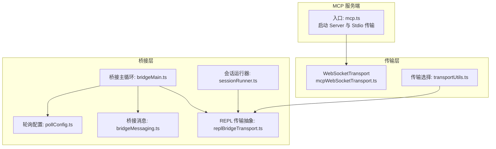
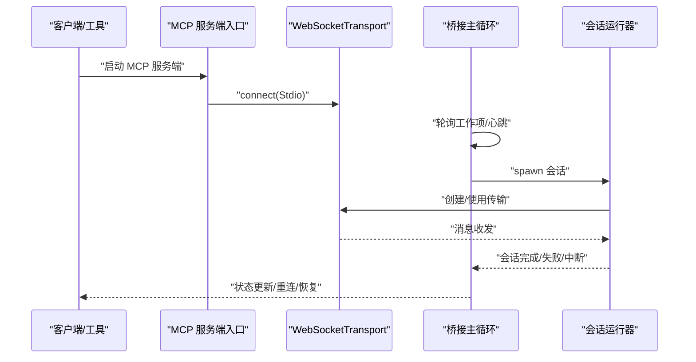
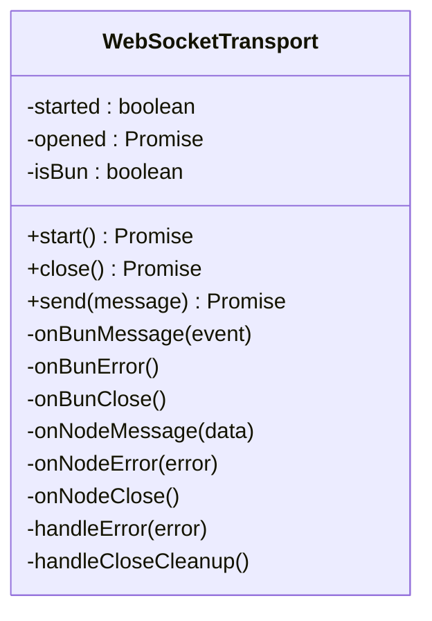
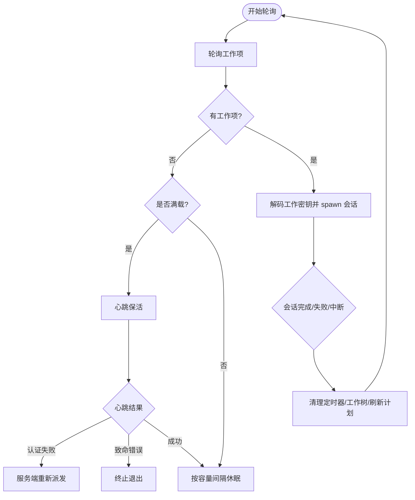
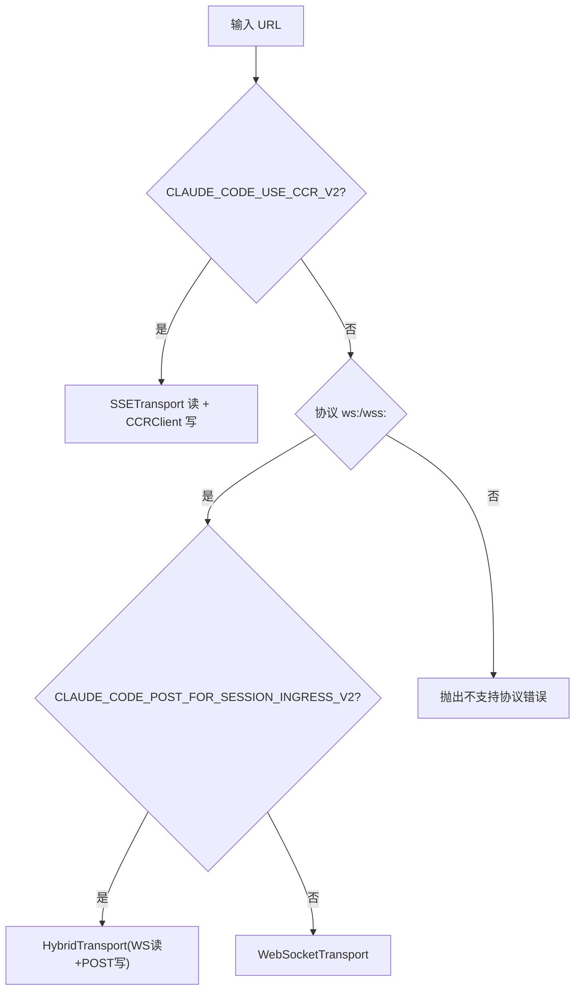
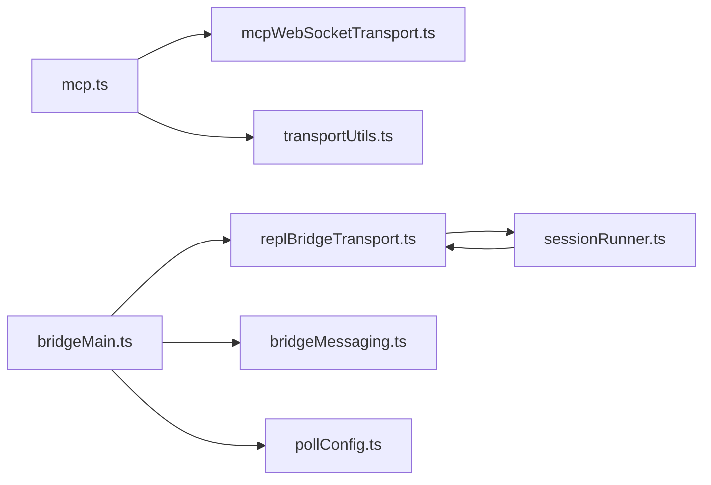

# 连接管理与传输

<cite>
**本文引用的文件**
- [src/entrypoints/mcp.ts](file://src/entrypoints/mcp.ts)
- [src/utils/mcpWebSocketTransport.ts](file://src/utils/mcpWebSocketTransport.ts)
- [src/bridge/bridgeMain.ts](file://src/bridge/bridgeMain.ts)
- [src/bridge/bridgeMessaging.ts](file://src/bridge/bridgeMessaging.ts)
- [src/bridge/replBridgeTransport.ts](file://src/bridge/replBridgeTransport.ts)
- [src/bridge/sessionRunner.ts](file://src/bridge/sessionRunner.ts)
- [src/bridge/types.ts](file://src/bridge/types.ts)
- [src/bridge/pollConfig.ts](file://src/bridge/pollConfig.ts)
- [src/services/mcp/client.ts](file://src/services/mcp/client.ts)
- [src/services/mcp/mcpStringUtils.ts](file://src/services/mcp/mcpStringUtils.ts)
- [src/cli/transports/transportUtils.ts](file://src/cli/transports/transportUtils.ts)
</cite>

## 目录
1. [引言](#引言)
2. [项目结构](#项目结构)
3. [核心组件](#核心组件)
4. [架构总览](#架构总览)
5. [详细组件分析](#详细组件分析)
6. [依赖关系分析](#依赖关系分析)
7. [性能考量](#性能考量)
8. [故障排查指南](#故障排查指南)
9. [结论](#结论)
10. [附录：连接配置与示例](#附录连接配置与示例)

## 引言
本文件聚焦于 MCP（Model Context Protocol）连接管理与传输机制，系统性阐述以下主题：
- MCP 连接的建立、维护与销毁流程
- 进程内传输、SDK 控制传输与连接管理器的实现原理
- 通道权限控制、允许列表管理与安全策略
- 连接状态监控、心跳检测与异常恢复
- 连接配置、传输协议选择与性能调优
- 实际连接管理示例与常见问题解决方案

## 项目结构
围绕 MCP 的连接与传输，相关代码主要分布在如下模块：
- 入口与服务端：MCP 服务端入口负责启动服务器与处理工具请求
- 传输层：WebSocket 传输适配器封装消息收发与错误处理
- 桥接层：桥接主循环负责工作项轮询、心跳、会话生命周期与异常恢复
- 传输选择：根据 URL 协议与环境变量选择 SSE/WS/Hybrid 传输
- 权限与消息：桥接消息处理与去重、控制请求响应、结果归档
- 类型与配置：桥接类型定义、轮询配置与 MCP 工具字符串解析

图表来源
- [src/entrypoints/mcp.ts:35-196](file://src/entrypoints/mcp.ts#L35-L196)
- [src/utils/mcpWebSocketTransport.ts:22-200](file://src/utils/mcpWebSocketTransport.ts#L22-L200)
- [src/cli/transports/transportUtils.ts:16-45](file://src/cli/transports/transportUtils.ts#L16-L45)
- [src/bridge/bridgeMain.ts:141-800](file://src/bridge/bridgeMain.ts#L141-L800)
- [src/bridge/replBridgeTransport.ts:119-371](file://src/bridge/replBridgeTransport.ts#L119-L371)
- [src/bridge/sessionRunner.ts:248-551](file://src/bridge/sessionRunner.ts#L248-L551)
- [src/bridge/bridgeMessaging.ts:132-463](file://src/bridge/bridgeMessaging.ts#L132-L463)
- [src/bridge/pollConfig.ts:102-111](file://src/bridge/pollConfig.ts#L102-L111)

章节来源
- [src/entrypoints/mcp.ts:35-196](file://src/entrypoints/mcp.ts#L35-L196)
- [src/utils/mcpWebSocketTransport.ts:22-200](file://src/utils/mcpWebSocketTransport.ts#L22-L200)
- [src/cli/transports/transportUtils.ts:16-45](file://src/cli/transports/transportUtils.ts#L16-L45)
- [src/bridge/bridgeMain.ts:141-800](file://src/bridge/bridgeMain.ts#L141-L800)
- [src/bridge/replBridgeTransport.ts:119-371](file://src/bridge/replBridgeTransport.ts#L119-L371)
- [src/bridge/sessionRunner.ts:248-551](file://src/bridge/sessionRunner.ts#L248-L551)
- [src/bridge/bridgeMessaging.ts:132-463](file://src/bridge/bridgeMessaging.ts#L132-L463)
- [src/bridge/pollConfig.ts:102-111](file://src/bridge/pollConfig.ts#L102-L111)

## 核心组件
- MCP 服务端入口：初始化 Server、注册工具列表与调用处理器，并通过 Stdio 传输启动服务
- WebSocket 传输：统一 WebSocket 连接、消息解析、错误与关闭清理逻辑
- 桥接主循环：轮询工作项、心跳保活、会话生命周期管理、异常恢复与重连
- 传输选择器：依据 URL 协议与环境变量选择 SSE/WS/Hybrid 传输
- 桥接消息处理：入站消息解析、去重、控制请求响应与结果归档
- 类型与配置：桥接类型定义、轮询配置与 MCP 工具字符串解析

章节来源
- [src/entrypoints/mcp.ts:35-196](file://src/entrypoints/mcp.ts#L35-L196)
- [src/utils/mcpWebSocketTransport.ts:22-200](file://src/utils/mcpWebSocketTransport.ts#L22-L200)
- [src/bridge/bridgeMain.ts:141-800](file://src/bridge/bridgeMain.ts#L141-L800)
- [src/cli/transports/transportUtils.ts:16-45](file://src/cli/transports/transportUtils.ts#L16-L45)
- [src/bridge/bridgeMessaging.ts:132-463](file://src/bridge/bridgeMessaging.ts#L132-L463)
- [src/bridge/types.ts:178-262](file://src/bridge/types.ts#L178-L262)
- [src/services/mcp/mcpStringUtils.ts:19-107](file://src/services/mcp/mcpStringUtils.ts#L19-L107)

## 架构总览
下图展示了 MCP 连接从建立到维护的关键路径，包括桥接层与传输层的交互。

图表来源
- [src/entrypoints/mcp.ts:35-196](file://src/entrypoints/mcp.ts#L35-L196)
- [src/utils/mcpWebSocketTransport.ts:22-200](file://src/utils/mcpWebSocketTransport.ts#L22-L200)
- [src/bridge/bridgeMain.ts:141-800](file://src/bridge/bridgeMain.ts#L141-L800)
- [src/bridge/sessionRunner.ts:248-551](file://src/bridge/sessionRunner.ts#L248-L551)

## 详细组件分析

### 组件一：MCP 服务端入口与进程内传输
- 职责：初始化 MCP 服务端、注册工具列表与调用处理器；通过 Stdio 传输启动服务
- 关键点：
  - 使用 SDK Server 创建服务端实例，声明能力（如 tools）
  - 注册 ListTools 与 CallTool 请求处理器，进行输入校验与工具执行
  - 通过 StdioServerTransport 启动连接，便于在进程内直接通信

章节来源
- [src/entrypoints/mcp.ts:35-196](file://src/entrypoints/mcp.ts#L35-L196)

### 组件二：WebSocket 传输适配器
- 职责：封装 WebSocket 连接、消息解析、发送与关闭清理
- 关键点：
  - 统一 Bun 与 Node 的事件模型，支持 open/error/close 处理
  - 解析 JSONRPC 消息并通过 Schema 校验
  - 提供 start/close/send 方法，确保连接状态与错误日志一致
  - 在关闭时清理监听器，避免内存泄漏

图表来源
- [src/utils/mcpWebSocketTransport.ts:22-200](file://src/utils/mcpWebSocketTransport.ts#L22-L200)

章节来源
- [src/utils/mcpWebSocketTransport.ts:22-200](file://src/utils/mcpWebSocketTransport.ts#L22-L200)

### 组件三：桥接主循环与心跳保活
- 职责：轮询工作项、心跳保活、异常恢复与会话生命周期管理
- 关键点：
  - 心跳函数对活动会话发送心跳，区分认证失败、致命错误与一般失败
  - 认证失败触发服务端重新派发工作，避免死锁
  - 容量模式下，心跳与轮询可并行或按阈值退出，避免紧循环
  - 会话结束时清理定时器、工作树与令牌刷新计划

图表来源
- [src/bridge/bridgeMain.ts:141-800](file://src/bridge/bridgeMain.ts#L141-L800)

章节来源
- [src/bridge/bridgeMain.ts:141-800](file://src/bridge/bridgeMain.ts#L141-L800)

### 组件四：传输选择器与 REPL 传输抽象
- 职责：根据 URL 协议与环境变量选择合适的传输（SSE/WS/Hybrid），并抽象 REPL 写入路径
- 关键点：
  - 优先级：CLAUDE_CODE_USE_CCR_V2 -> CLAUDE_CODE_POST_FOR_SESSION_INGRESS_V2 -> 默认 WS
  - v2 模式下使用 SSE 读取 + CCRClient 写入，支持状态上报与交付确认
  - v1 模式下使用 HybridTransport（WS 读 + POST 写）

图表来源
- [src/cli/transports/transportUtils.ts:16-45](file://src/cli/transports/transportUtils.ts#L16-L45)
- [src/bridge/replBridgeTransport.ts:119-371](file://src/bridge/replBridgeTransport.ts#L119-L371)

章节来源
- [src/cli/transports/transportUtils.ts:16-45](file://src/cli/transports/transportUtils.ts#L16-L45)
- [src/bridge/replBridgeTransport.ts:119-371](file://src/bridge/replBridgeTransport.ts#L119-L371)

### 组件五：桥接消息处理与去重
- 职责：解析入站消息、去重（回显与重复）、路由控制请求与权限响应
- 关键点：
  - 使用 BoundedUUIDSet 实现固定容量的环形去重集合
  - 对 control_request 做快速响应，避免服务端超时
  - 对用户消息进行标题提取与事件归档

章节来源
- [src/bridge/bridgeMessaging.ts:132-463](file://src/bridge/bridgeMessaging.ts#L132-L463)

### 组件六：会话运行器与传输集成
- 职责：spawn 子进程、解析 NDJSON 输出、转发控制请求、处理权限请求与令牌刷新
- 关键点：
  - 通过环境变量传递访问令牌与 CCR v2 标记
  - 将子进程 stdout 的 NDJSON 行解析为活动记录与权限请求
  - 支持通过 stdin 更新环境变量（如访问令牌）

章节来源
- [src/bridge/sessionRunner.ts:248-551](file://src/bridge/sessionRunner.ts#L248-L551)

### 组件七：MCP 客户端连接管理与重连
- 职责：根据服务器类型选择 WebSocket 或 HTTP 传输，建立连接并处理超时与重连
- 关键点：
  - WebSocket 传输支持 headers/proxy/tls 配置
  - 连接超时触发清理并返回超时错误
  - 重连流程记录尝试次数与耗时，成功后注册处理器

章节来源
- [src/services/mcp/client.ts:742-800](file://src/services/mcp/client.ts#L742-L800)
- [src/services/mcp/client.ts:1050-1079](file://src/services/mcp/client.ts#L1050-L1079)

### 组件八：MCP 工具字符串解析与权限匹配
- 职责：解析 MCP 工具名前缀、生成显示名、用于权限规则匹配
- 关键点：
  - 支持从全名中提取服务器与工具名称
  - 生成规范化前缀与全名，避免内置工具与 MCP 替代工具的误匹配

章节来源
- [src/services/mcp/mcpStringUtils.ts:19-107](file://src/services/mcp/mcpStringUtils.ts#L19-L107)

## 依赖关系分析
- 入口与传输：mcp.ts 依赖 WebSocketTransport 进行进程内传输
- 桥接与传输：bridgeMain 通过 replBridgeTransport 抽象与传输层交互
- 传输选择：transportUtils 与 replBridgeTransport 共同决定传输类型
- 权限与消息：bridgeMessaging 独立于桥接主循环，提供纯函数式消息处理
- 类型与配置：bridge/types.ts 定义桥接类型，pollConfig.ts 提供轮询配置

图表来源
- [src/entrypoints/mcp.ts:35-196](file://src/entrypoints/mcp.ts#L35-L196)
- [src/utils/mcpWebSocketTransport.ts:22-200](file://src/utils/mcpWebSocketTransport.ts#L22-L200)
- [src/cli/transports/transportUtils.ts:16-45](file://src/cli/transports/transportUtils.ts#L16-L45)
- [src/bridge/bridgeMain.ts:141-800](file://src/bridge/bridgeMain.ts#L141-L800)
- [src/bridge/replBridgeTransport.ts:119-371](file://src/bridge/replBridgeTransport.ts#L119-L371)
- [src/bridge/sessionRunner.ts:248-551](file://src/bridge/sessionRunner.ts#L248-L551)
- [src/bridge/bridgeMessaging.ts:132-463](file://src/bridge/bridgeMessaging.ts#L132-L463)
- [src/bridge/pollConfig.ts:102-111](file://src/bridge/pollConfig.ts#L102-L111)

章节来源
- [src/entrypoints/mcp.ts:35-196](file://src/entrypoints/mcp.ts#L35-L196)
- [src/utils/mcpWebSocketTransport.ts:22-200](file://src/utils/mcpWebSocketTransport.ts#L22-L200)
- [src/cli/transports/transportUtils.ts:16-45](file://src/cli/transports/transportUtils.ts#L16-L45)
- [src/bridge/bridgeMain.ts:141-800](file://src/bridge/bridgeMain.ts#L141-L800)
- [src/bridge/replBridgeTransport.ts:119-371](file://src/bridge/replBridgeTransport.ts#L119-L371)
- [src/bridge/sessionRunner.ts:248-551](file://src/bridge/sessionRunner.ts#L248-L551)
- [src/bridge/bridgeMessaging.ts:132-463](file://src/bridge/bridgeMessaging.ts#L132-L463)
- [src/bridge/pollConfig.ts:102-111](file://src/bridge/pollConfig.ts#L102-L111)

## 性能考量
- 传输选择：优先使用 SSE/HTTP POST（v2）以降低写入延迟与丢包风险
- 心跳与轮询：通过轮询配置限制空闲轮询频率，满载时启用非独占心跳，避免紧循环
- 缓存与去重：使用固定容量的 UUID 去重集合，控制内存占用与去重效率
- 连接超时：为连接设置超时，避免长时间阻塞导致资源浪费
- 日志与诊断：统一错误日志与诊断日志，便于定位性能瓶颈

## 故障排查指南
- 连接失败
  - 检查 WebSocket 连接状态与错误日志，确认 readyState 与事件绑定
  - 核对传输选择逻辑，确保 URL 协议与环境变量正确
- 心跳失败
  - 认证失败触发服务端重新派发；检查会话令牌与刷新策略
  - 致命错误（如环境过期）需终止并重建环境
- 会话异常
  - 查看会话 stderr 与活动记录，定位工具调用与权限问题
  - 确认权限请求是否被正确转发与响应
- 重连与恢复
  - 记录重连尝试次数与耗时，避免无限重试
  - 成功后注册处理器并恢复通道与资源

章节来源
- [src/utils/mcpWebSocketTransport.ts:22-200](file://src/utils/mcpWebSocketTransport.ts#L22-L200)
- [src/cli/transports/transportUtils.ts:16-45](file://src/cli/transports/transportUtils.ts#L16-L45)
- [src/bridge/bridgeMain.ts:141-800](file://src/bridge/bridgeMain.ts#L141-L800)
- [src/bridge/bridgeMessaging.ts:132-463](file://src/bridge/bridgeMessaging.ts#L132-L463)
- [src/bridge/sessionRunner.ts:248-551](file://src/bridge/sessionRunner.ts#L248-L551)

## 结论
本文梳理了 MCP 连接管理与传输机制的关键路径：从进程内服务端入口、WebSocket 传输适配器，到桥接主循环的心跳保活与异常恢复，再到传输选择器与消息处理的协同。通过合理的传输选择、严格的权限控制与去重策略、以及完善的连接监控与重连机制，系统实现了稳定、可扩展的 MCP 连接管理。

## 附录：连接配置与示例
- 传输协议选择
  - v2 模式：设置环境变量以启用 SSE 读取与 CCRClient 写入
  - v1 模式：根据协议选择 WebSocketTransport 或 HybridTransport
- 连接配置要点
  - WebSocket 头部与代理：结合会话令牌与自定义头部
  - 连接超时：为连接设置合理超时时间并清理资源
  - 心跳与轮询：根据容量与负载调整心跳间隔与轮询策略
- 示例参考
  - 进程内 MCP 服务端启动与工具处理：[src/entrypoints/mcp.ts:35-196](file://src/entrypoints/mcp.ts#L35-L196)
  - WebSocket 传输适配器：[src/utils/mcpWebSocketTransport.ts:22-200](file://src/utils/mcpWebSocketTransport.ts#L22-L200)
  - 桥接主循环与心跳保活：[src/bridge/bridgeMain.ts:141-800](file://src/bridge/bridgeMain.ts#L141-L800)
  - 传输选择器：[src/cli/transports/transportUtils.ts:16-45](file://src/cli/transports/transportUtils.ts#L16-L45)
  - 桥接消息处理与去重：[src/bridge/bridgeMessaging.ts:132-463](file://src/bridge/bridgeMessaging.ts#L132-L463)
  - 会话运行器与传输集成：[src/bridge/sessionRunner.ts:248-551](file://src/bridge/sessionRunner.ts#L248-L551)
  - MCP 客户端连接管理与重连：[src/services/mcp/client.ts:742-800](file://src/services/mcp/client.ts#L742-L800)