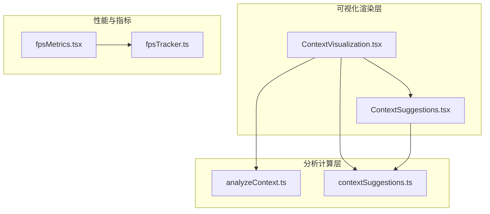
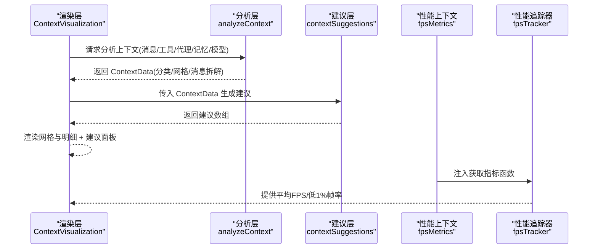
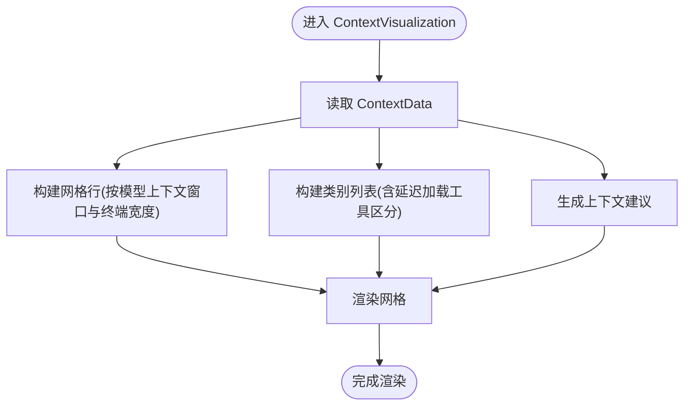
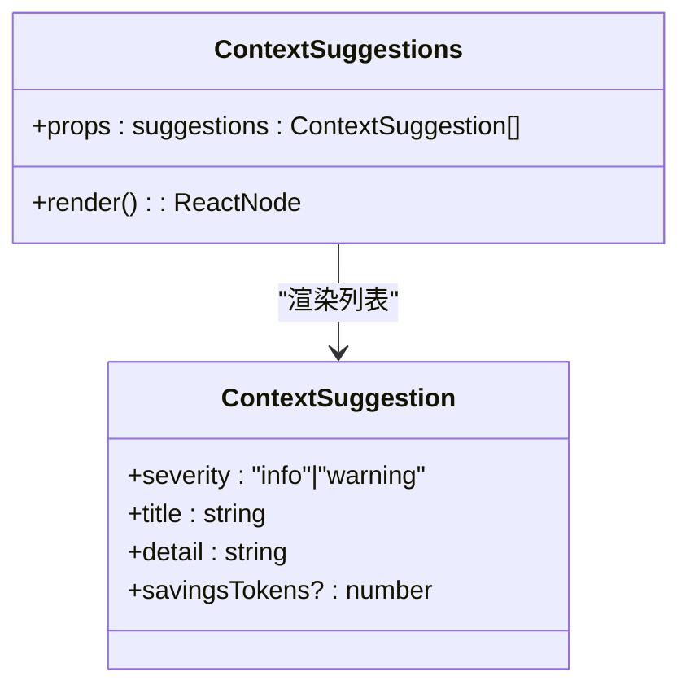
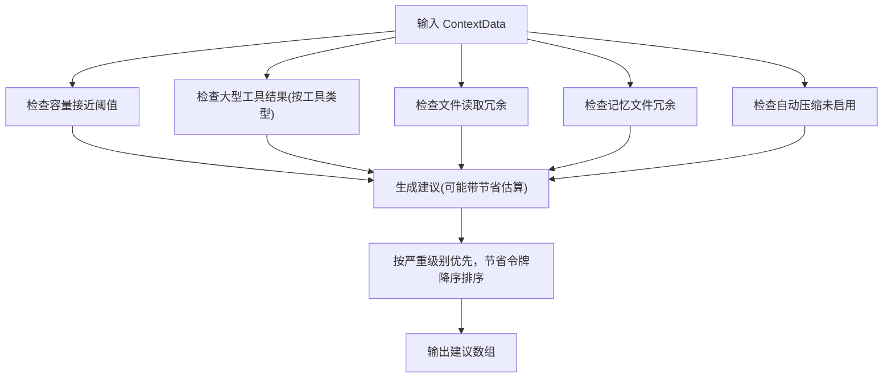
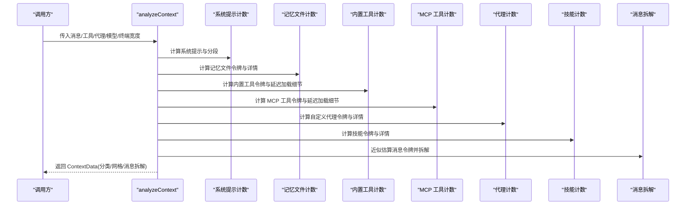
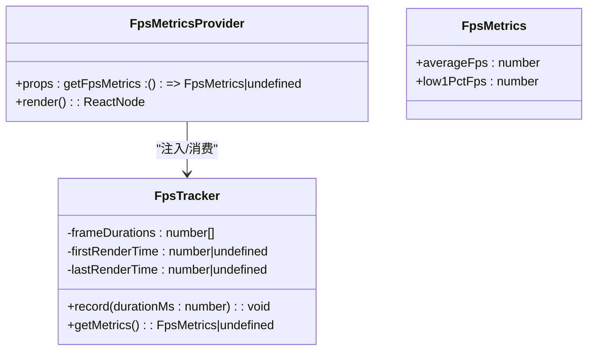
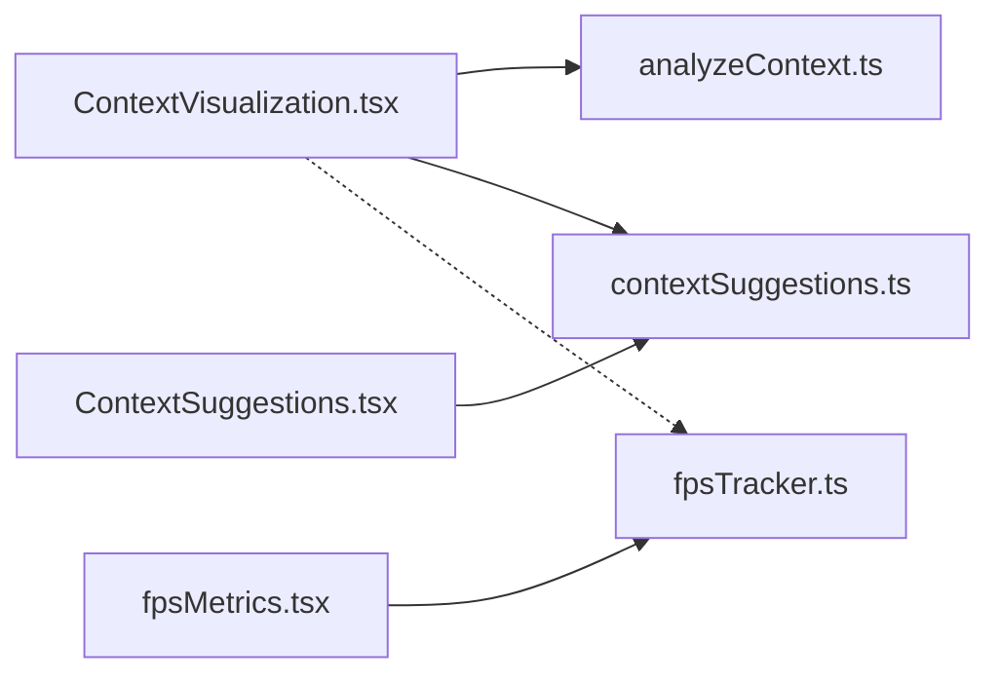

# 上下文可视化

<cite>
**本文引用的文件**
- [ContextVisualization.tsx](file://src/components/ContextVisualization.tsx)
- [ContextSuggestions.tsx](file://src/components/ContextSuggestions.tsx)
- [fpsMetrics.tsx](file://src/context/fpsMetrics.tsx)
- [fpsTracker.ts](file://src/utils/fpsTracker.ts)
- [contextSuggestions.ts](file://src/utils/contextSuggestions.ts)
- [analyzeContext.ts](file://src/utils/analyzeContext.ts)
</cite>

## 目录
1. [简介](#简介)
2. [项目结构](#项目结构)
3. [核心组件](#核心组件)
4. [架构总览](#架构总览)
5. [详细组件分析](#详细组件分析)
6. [依赖关系分析](#依赖关系分析)
7. [性能考量](#性能考量)
8. [故障排查指南](#故障排查指南)
9. [结论](#结论)
10. [附录](#附录)

## 简介
本文件面向 Claude Code 的“上下文可视化”系统，系统性阐述上下文可视化组件的实现原理、交互设计、上下文建议算法与推荐机制、FPS 指标监控与性能分析工具、配置与样式定制、调试与优化实践，以及可视化对用户体验的影响与实时更新策略。

## 项目结构
上下文可视化由三部分组成：
- 可视化渲染层：负责将上下文使用情况以网格与分类列表的形式呈现，并嵌入上下文建议面板。
- 分析计算层：负责聚合消息、工具、代理、记忆文件等信息，生成 ContextData 并构建可视化所需的网格与统计。
- 建议与性能层：负责根据 ContextData 生成上下文建议；同时提供 FPS 指标采集与展示能力。

**图表来源**
- [ContextVisualization.tsx:105-393](file://src/components/ContextVisualization.tsx#L105-L393)
- [ContextSuggestions.tsx:11-47](file://src/components/ContextSuggestions.tsx#L11-L47)
- [analyzeContext.ts:921-1385](file://src/utils/analyzeContext.ts#L921-L1385)
- [contextSuggestions.ts:31-51](file://src/utils/contextSuggestions.ts#L31-L51)
- [fpsMetrics.tsx:10-29](file://src/context/fpsMetrics.tsx#L10-L29)
- [fpsTracker.ts:6-47](file://src/utils/fpsTracker.ts#L6-L47)

**章节来源**
- [ContextVisualization.tsx:105-393](file://src/components/ContextVisualization.tsx#L105-L393)
- [analyzeContext.ts:921-1385](file://src/utils/analyzeContext.ts#L921-L1385)

## 核心组件
- ContextVisualization：负责渲染上下文使用概览（模型、总量、百分比）、网格图（按类别填充方块）、各类别明细、MCP/系统工具、代理、记忆文件、技能、消息拆解等，并调用上下文建议模块生成建议面板。
- ContextSuggestions：接收建议数组并渲染标题、严重级别图标、建议标题、节省令牌估算与详情说明。
- analyzeContext：核心分析器，聚合系统提示、工具、代理、记忆文件、消息内容等，计算各分类令牌数、总使用量、网格方块布局、消息拆解统计，并输出 ContextData。
- contextSuggestions：基于 ContextData 生成上下文建议，包括容量接近、工具结果过大、文件读取冗余、记忆文件冗余、自动压缩未启用等场景。
- fpsMetrics/fpsTracker：提供 FPS 指标上下文与追踪器，用于监控渲染性能并反馈到可视化或诊断界面。

**章节来源**
- [ContextVisualization.tsx:105-393](file://src/components/ContextVisualization.tsx#L105-L393)
- [ContextSuggestions.tsx:11-47](file://src/components/ContextSuggestions.tsx#L11-L47)
- [analyzeContext.ts:190-232](file://src/utils/analyzeContext.ts#L190-L232)
- [contextSuggestions.ts:31-51](file://src/utils/contextSuggestions.ts#L31-L51)
- [fpsMetrics.tsx:10-29](file://src/context/fpsMetrics.tsx#L10-L29)
- [fpsTracker.ts:6-47](file://src/utils/fpsTracker.ts#L6-L47)

## 架构总览
上下文可视化采用“分析-建议-渲染”的分层架构：
- 输入：消息、工具、代理、记忆文件、当前模型与终端宽度等。
- 分析：analyzeContext 聚合并估算令牌，构建 ContextData。
- 建议：contextSuggestions 基于阈值规则生成建议。
- 渲染：ContextVisualization 将 ContextData 渲染为网格与文本明细，并插入 ContextSuggestions 面板。
- 性能：fpsMetrics 提供 FPS 指标上下文，fpsTracker 计算平均 FPS 与低 1% 帧率指标。

**图表来源**
- [ContextVisualization.tsx:363-377](file://src/components/ContextVisualization.tsx#L363-L377)
- [analyzeContext.ts:921-1385](file://src/utils/analyzeContext.ts#L921-L1385)
- [contextSuggestions.ts:31-51](file://src/utils/contextSuggestions.ts#L31-L51)
- [fpsMetrics.tsx:10-29](file://src/context/fpsMetrics.tsx#L10-L29)
- [fpsTracker.ts:20-46](file://src/utils/fpsTracker.ts#L20-L46)

## 详细组件分析

### 组件一：ContextVisualization（上下文可视化）
职责与特性：
- 展示模型名、总令牌用量、最大令牌限制、百分比。
- 展示“上下文策略”状态（如是否启用折叠）。
- 渲染网格图：按类别比例填充方块，保留“空闲空间”与“预留缓冲”位置。
- 列出各类别明细（令牌数与占比），支持延迟加载工具的“可用/已加载”区分显示。
- 汇总 MCP 工具、系统工具、代理、记忆文件、技能、消息拆解等。
- 调用 generateContextSuggestions(data) 生成建议面板。

交互与渲染要点：
- 使用 memo 缓存减少重复渲染。
- 对不同来源（Project/User/Managed/Plugin/Built-in）进行分组与排序。
- 通过颜色主题映射为网格方块与文本高亮。
- 当存在延迟加载工具时，分别列出“已加载”和“可用”。

**图表来源**
- [ContextVisualization.tsx:105-393](file://src/components/ContextVisualization.tsx#L105-L393)
- [analyzeContext.ts:1179-1298](file://src/utils/analyzeContext.ts#L1179-L1298)

**章节来源**
- [ContextVisualization.tsx:105-393](file://src/components/ContextVisualization.tsx#L105-L393)

### 组件二：ContextSuggestions（上下文建议）
职责与特性：
- 接收建议数组，渲染标题与建议项。
- 每条建议包含严重级别、标题、节省令牌估算与详情说明。
- 使用状态图标标识严重级别。

**图表来源**
- [ContextSuggestions.tsx:11-47](file://src/components/ContextSuggestions.tsx#L11-L47)
- [contextSuggestions.ts:13-19](file://src/utils/contextSuggestions.ts#L13-L19)

**章节来源**
- [ContextSuggestions.tsx:11-47](file://src/components/ContextSuggestions.tsx#L11-L47)

### 组件三：上下文建议算法（contextSuggestions）
算法与推荐机制：
- 容量接近阈值：当使用百分比达到阈值时给出警告，提示自动压缩即将触发或手动压缩。
- 大型工具结果：按工具类型统计调用与结果令牌，超过阈值（百分比与绝对值双阈值）给出警告或信息级建议，并估算可节省令牌。
- 文件读取冗余：针对文件读取工具的结果占比与绝对值进行检查，给出优化建议。
- 记忆文件冗余：统计记忆文件总令牌占比与绝对值，列出前三大文件并建议清理。
- 自动压缩未启用：当容量使用处于中间区间且未启用自动压缩时，给出启用建议。

排序策略：先按严重级别降序，再按节省令牌估算降序。

**图表来源**
- [contextSuggestions.ts:31-51](file://src/utils/contextSuggestions.ts#L31-L51)
- [contextSuggestions.ts:55-68](file://src/utils/contextSuggestions.ts#L55-L68)
- [contextSuggestions.ts:70-96](file://src/utils/contextSuggestions.ts#L70-L96)
- [contextSuggestions.ts:151-185](file://src/utils/contextSuggestions.ts#L151-L185)
- [contextSuggestions.ts:187-217](file://src/utils/contextSuggestions.ts#L187-L217)
- [contextSuggestions.ts:219-235](file://src/utils/contextSuggestions.ts#L219-L235)

**章节来源**
- [contextSuggestions.ts:31-51](file://src/utils/contextSuggestions.ts#L31-L51)

### 组件四：analyzeContext（上下文分析）
职责与流程：
- 聚合系统提示、内置工具、MCP 工具、自定义代理、记忆文件、技能、消息内容等。
- 计算各分类令牌数、总使用量、百分比、网格方块布局（考虑“空闲空间”与“预留缓冲”）。
- 生成消息拆解统计（工具调用/结果、附件类型、用户/助手消息）。
- 输出 ContextData，供渲染层与建议层使用。

关键点：
- 工具计数采用批量 API 调用并减去单次调用的固定开销，避免重复叠加。
- 延迟加载工具（工具搜索开启时）分别统计“已加载”与“可用”令牌，仅“已加载”计入实际使用。
- 网格尺寸随模型上下文窗口与终端宽度动态调整，保证在窄屏与大模型下的可读性。
- “预留缓冲”在自动压缩或特定功能开启时可能被跳过，以保持透明性。

**图表来源**
- [analyzeContext.ts:921-986](file://src/utils/analyzeContext.ts#L921-L986)
- [analyzeContext.ts:1010-1160](file://src/utils/analyzeContext.ts#L1010-L1160)
- [analyzeContext.ts:1179-1298](file://src/utils/analyzeContext.ts#L1179-L1298)

**章节来源**
- [analyzeContext.ts:921-1385](file://src/utils/analyzeContext.ts#L921-L1385)

### 组件五：FPS 指标监控（fpsMetrics / fpsTracker）
职责与流程：
- FpsMetricsProvider：向子树注入获取 FPS 指标的 getter。
- FpsTracker：记录帧耗时，计算平均 FPS 与低 1% 帧率（对应低 1% 帧耗时的倒数），用于识别卡顿尾部。

**图表来源**
- [fpsMetrics.tsx:10-29](file://src/context/fpsMetrics.tsx#L10-L29)
- [fpsTracker.ts:1-47](file://src/utils/fpsTracker.ts#L1-L47)

**章节来源**
- [fpsMetrics.tsx:10-29](file://src/context/fpsMetrics.tsx#L10-L29)
- [fpsTracker.ts:6-47](file://src/utils/fpsTracker.ts#L6-L47)

## 依赖关系分析
- ContextVisualization 依赖 analyzeContext 生成的 ContextData，并调用 contextSuggestions 生成建议。
- ContextSuggestions 依赖 contextSuggestions 的建议生成逻辑。
- FPS 指标通过 fpsMetrics 上下文与 fpsTracker 实现，可用于诊断渲染性能问题。

**图表来源**
- [ContextVisualization.tsx:363-377](file://src/components/ContextVisualization.tsx#L363-L377)
- [analyzeContext.ts:921-1385](file://src/utils/analyzeContext.ts#L921-L1385)
- [contextSuggestions.ts:31-51](file://src/utils/contextSuggestions.ts#L31-L51)
- [fpsMetrics.tsx:10-29](file://src/context/fpsMetrics.tsx#L10-L29)
- [fpsTracker.ts:6-47](file://src/utils/fpsTracker.ts#L6-L47)

**章节来源**
- [ContextVisualization.tsx:363-377](file://src/components/ContextVisualization.tsx#L363-L377)
- [contextSuggestions.ts:31-51](file://src/utils/contextSuggestions.ts#L31-L51)
- [fpsMetrics.tsx:10-29](file://src/context/fpsMetrics.tsx#L10-L29)

## 性能考量
- 渲染缓存：ContextVisualization 内部广泛使用 memo 缓存，避免不必要的重渲染。
- 网格布局：网格大小随模型上下文窗口与终端宽度自适应，兼顾可读性与性能。
- 延迟加载工具：仅“已加载”工具计入实际使用，减少不必要的令牌估算与渲染。
- 建议排序：建议按严重级别与节省令牌降序，帮助用户快速定位高价值优化点。
- FPS 监控：通过 fpsTracker 计算平均与低 1% 帧率，辅助定位卡顿根因。

[本节为通用性能讨论，无需具体文件分析]

## 故障排查指南
- 上下文建议不出现或不准确
  - 检查 ContextData 是否正确传入，确认 messageBreakdown 与 percentage 等字段有效。
  - 确认阈值设置是否合理，必要时调整百分比与绝对值阈值。
- 网格显示异常
  - 检查模型上下文窗口与终端宽度参数，确保网格宽高计算正确。
  - 确认“预留缓冲”是否被跳过（自动压缩或特定功能开启时）。
- FPS 下降
  - 使用 fpsMetrics 获取指标，结合 fpsTracker 的低 1% 帧率判断是否存在极端卡顿。
  - 检查是否启用了大量延迟加载工具导致一次性渲染压力增大。

**章节来源**
- [contextSuggestions.ts:21-28](file://src/utils/contextSuggestions.ts#L21-L28)
- [analyzeContext.ts:1179-1298](file://src/utils/analyzeContext.ts#L1179-L1298)
- [fpsMetrics.tsx:10-29](file://src/context/fpsMetrics.tsx#L10-L29)
- [fpsTracker.ts:20-46](file://src/utils/fpsTracker.ts#L20-L46)

## 结论
上下文可视化通过“分析-建议-渲染”的清晰分层，将复杂的上下文使用情况以直观的网格与明细形式呈现，并辅以上下文建议与 FPS 指标监控，帮助用户在有限上下文内高效组织信息、优化工具使用、提升交互流畅度。其设计兼顾准确性与性能，适合在多种模型与终端环境下稳定运行。

[本节为总结性内容，无需具体文件分析]

## 附录

### 配置选项与自定义样式
- 主题与颜色映射：网格方块颜色来自主题键，用于区分不同类别（如系统提示、MCP 工具、消息、空闲空间等）。
- 终端宽度与网格尺寸：根据终端宽度与模型上下文窗口动态选择网格宽高，保证在窄屏与大模型下的可读性。
- 延迟加载工具显示：当工具搜索开启时，分别显示“已加载”与“可用”工具，便于用户控制上下文占用。

**章节来源**
- [ContextVisualization.tsx:1179-1191](file://src/components/ContextVisualization.tsx#L1179-L1191)
- [analyzeContext.ts:1036-1064](file://src/utils/analyzeContext.ts#L1036-L1064)

### 调试与优化应用方法
- 使用 FPS 指标定位渲染卡顿，结合建议面板优先处理高价值优化点（如大型工具结果、文件读取冗余、记忆文件冗余）。
- 在自动压缩未启用或接近阈值时，主动执行压缩或调整阈值，避免对话中断。
- 通过分组与排序建议，优先清理占用最多令牌的来源，提升整体效率。

**章节来源**
- [contextSuggestions.ts:42-48](file://src/utils/contextSuggestions.ts#L42-L48)
- [analyzeContext.ts:1004-1008](file://src/utils/analyzeContext.ts#L1004-L1008)

### 用户体验关系与实时更新
- 可视化直接影响用户对上下文占用的认知，建议面板提供即时改进建议，降低认知负担。
- 网格图直观反映“空闲空间”，有助于用户在接近容量时及时采取行动。
- 实时更新策略：在消息、工具、代理、记忆文件等数据变化时重新触发 analyzeContext 与渲染，确保建议与网格同步。

**章节来源**
- [ContextVisualization.tsx:105-393](file://src/components/ContextVisualization.tsx#L105-L393)
- [analyzeContext.ts:921-1385](file://src/utils/analyzeContext.ts#L921-L1385)