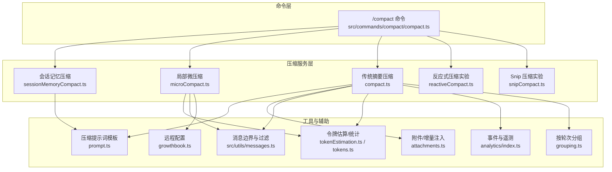
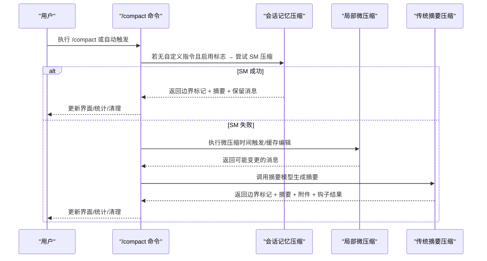
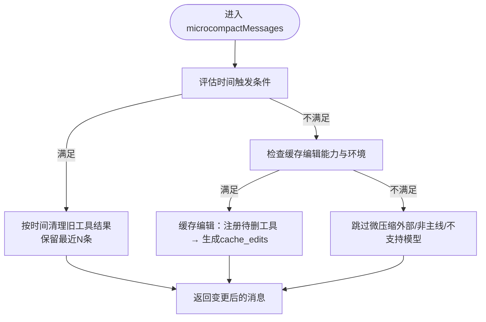
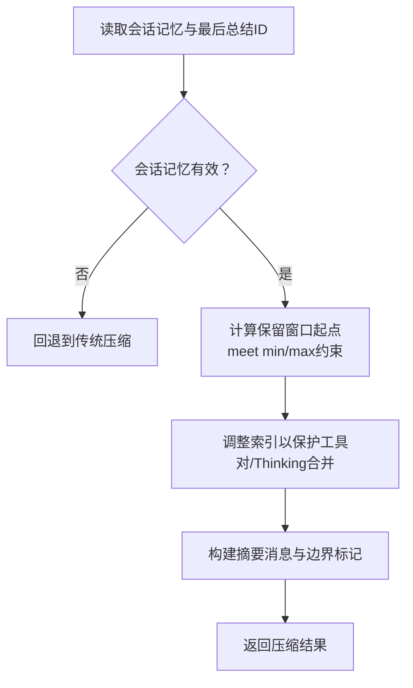
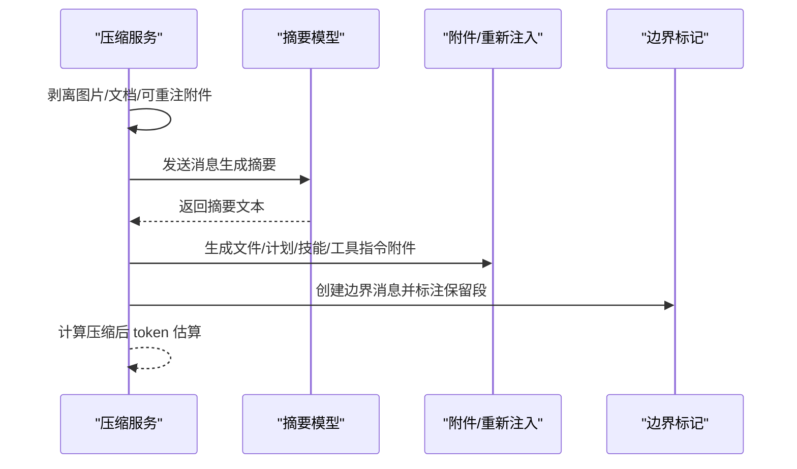
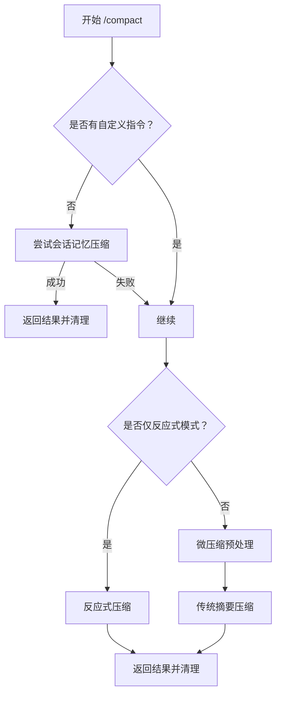
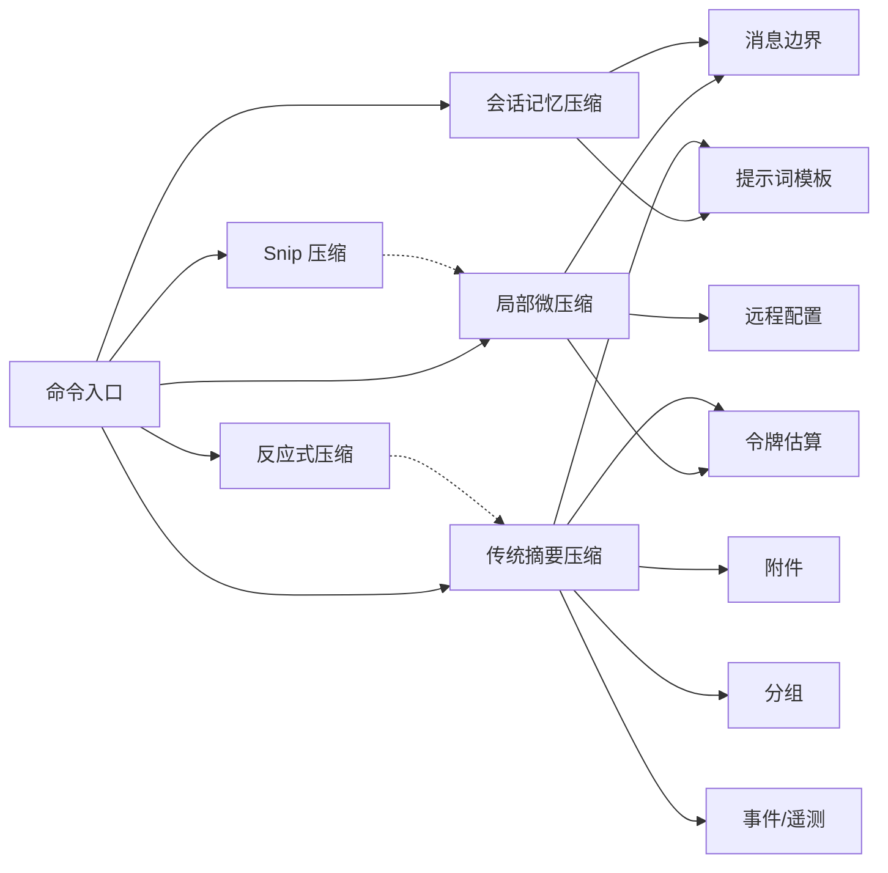

# 上下文折叠

<cite>
**本文引用的文件**
- [compaction.mdx](file://docs/context/compaction.mdx)
- [index.ts](file://src/services/contextCollapse/index.ts)
- [operations.ts](file://src/services/contextCollapse/operations.ts)
- [compact.ts](file://src/services/compact/compact.ts)
- [microCompact.ts](file://src/services/compact/microCompact.ts)
- [sessionMemoryCompact.ts](file://src/services/compact/sessionMemoryCompact.ts)
- [timeBasedMCConfig.ts](file://src/services/compact/timeBasedMCConfig.ts)
- [compact.ts](file://src/commands/compact/compact.ts)
- [messages.ts](file://src/utils/messages.ts)
- [prompt.ts](file://src/services/compact/prompt.ts)
- [grouping.ts](file://src/services/compact/grouping.ts)
- [reactiveCompact.ts](file://src/services/compact/reactiveCompact.ts)
- [snipCompact.ts](file://src/services/compact/snipCompact.ts)
- [snipProjection.ts](file://src/services/compact/snipProjection.ts)
- [cachedMCConfig.ts](file://src/services/compact/cachedMCConfig.ts)
- [cachedMicrocompact.ts](file://src/services/compact/cachedMicrocompact.ts)
- [postCompactCleanup.ts](file://src/services/compact/postCompactCleanup.ts)
- [compactWarningState.ts](file://src/services/compact/compactWarningState.ts)
- [promptCacheBreakDetection.ts](file://src/services/api/promptCacheBreakDetection.ts)
- [analytics/index.ts](file://src/services/analytics/index.ts)
- [growthbook.ts](file://src/services/analytics/growthbook.ts)
- [tokenEstimation.ts](file://src/services/tokenEstimation.ts)
- [tokens.ts](file://src/utils/tokens.ts)
- [systemPrompt.js](file://src/utils/systemPrompt.js)
- [systemStorage.ts](file://src/utils/sessionStorage.ts)
- [sessionStart.ts](file://src/utils/sessionStart.ts)
- [errors.ts](file://src/utils/errors.ts)
- [sleep.ts](file://src/utils/sleep.ts)
- [forkedAgent.ts](file://src/utils/forkedAgent.ts)
- [attachments.ts](file://src/utils/attachments.ts)
- [contextAnalysis.ts](file://src/utils/contextAnalysis.ts)
- [model/model.ts](file://src/utils/model/model.ts)
- [shellToolUtils.ts](file://src/utils/shell/shellToolUtils.ts)
- [toolSearch.ts](file://src/utils/toolSearch.ts)
- [settings.ts](file://src/utils/settings/settings.ts)
</cite>

## 目录
1. [简介](#简介)
2. [项目结构](#项目结构)
3. [核心组件](#核心组件)
4. [架构总览](#架构总览)
5. [详细组件分析](#详细组件分析)
6. [依赖关系分析](#依赖关系分析)
7. [性能考量](#性能考量)
8. [故障排查指南](#故障排查指南)
9. [结论](#结论)
10. [附录](#附录)

## 简介
本文件系统性阐述 Claude Code 的上下文折叠（Compaction）体系，覆盖三层策略（局部微压缩、会话记忆压缩、传统摘要压缩）、边界机制、钩子扩展、紧急降级路径与性能优化，并说明折叠后的上下文如何影响 AI 的理解与响应，以及配置与自定义策略、不同场景的最佳实践与对话质量关系。

## 项目结构
围绕“上下文折叠”的关键目录与文件：
- 文档：docs/context/compaction.mdx
- 命令入口：src/commands/compact/compact.ts
- 核心压缩实现：src/services/compact/*.ts
- 上下文折叠接口（占位）：src/services/contextCollapse/index.ts、operations.ts
- 辅助工具：src/utils/messages.ts、src/services/compact/prompt.ts、grouping.ts、tokenEstimation.ts、tokens.ts 等

图示来源
- [compact.ts:40-137](file://src/commands/compact/compact.ts#L40-L137)
- [microCompact.ts:253-293](file://src/services/compact/microCompact.ts#L253-L293)
- [sessionMemoryCompact.ts:514-631](file://src/services/compact/sessionMemoryCompact.ts#L514-L631)
- [compact.ts:389-765](file://src/services/compact/compact.ts#L389-L765)
- [messages.ts](file://src/utils/messages.ts)
- [prompt.ts](file://src/services/compact/prompt.ts)
- [grouping.ts](file://src/services/compact/grouping.ts)
- [tokenEstimation.ts](file://src/services/tokenEstimation.ts)
- [tokens.ts](file://src/utils/tokens.ts)
- [attachments.ts](file://src/utils/attachments.ts)
- [analytics/index.ts](file://src/services/analytics/index.ts)
- [growthbook.ts](file://src/services/analytics/growthbook.ts)

章节来源
- [compaction.mdx:9-43](file://docs/context/compaction.mdx#L9-L43)
- [compact.ts:40-137](file://src/commands/compact/compact.ts#L40-L137)

## 核心组件
- 命令入口：负责优先级链选择、前置/后置钩子、显示文案与清理收尾。
- 局部微压缩（MicroCompact）：在不调用摘要模型的前提下，清理旧工具输出、图片/文档块，支持基于时间的触发与缓存编辑路径。
- 会话记忆压缩（Session Memory Compact）：利用已抽取的会话记忆作为摘要，无需额外 API 调用，具备严格的工具对完整性保护与保留窗口计算。
- 传统摘要压缩（Legacy Compact）：调用摘要模型生成摘要，进行图片剥离、重新注入关键上下文，支持 PTL 紧急降级与多次重试。
- 反应式压缩（Reactive Compact）：在提示过长时采取更激进的局部裁剪（当前为实验占位）。
- Snip 压缩（Snip Compact）：更细粒度的消息级裁剪（实验占位）。

章节来源
- [compaction.mdx:44-240](file://docs/context/compaction.mdx#L44-L240)
- [compact.ts:389-765](file://src/services/compact/compact.ts#L389-L765)
- [microCompact.ts:253-531](file://src/services/compact/microCompact.ts#L253-L531)
- [sessionMemoryCompact.ts:514-631](file://src/services/compact/sessionMemoryCompact.ts#L514-L631)
- [compact.ts:40-137](file://src/commands/compact/compact.ts#L40-L137)

## 架构总览
压缩入口的优先级链与触发条件如下：

图示来源
- [compact.ts:55-108](file://src/commands/compact/compact.ts#L55-L108)
- [sessionMemoryCompact.ts:514-631](file://src/services/compact/sessionMemoryCompact.ts#L514-L631)
- [microCompact.ts:253-293](file://src/services/compact/microCompact.ts#L253-L293)
- [compact.ts:389-765](file://src/services/compact/compact.ts#L389-L765)

## 详细组件分析

### 组件一：局部微压缩（MicroCompact）
- 目标：在不调用摘要模型的情况下，清理旧工具输出、图片/文档块，减少 token 并维持工作上下文。
- 关键策略
  - 工具白名单：仅对可压缩工具（如文件读写、搜索、Web 搜索/抓取、部分 Shell 工具）进行清理。
  - 时间触发：若自上次主循环助手消息以来的时间间隔超过阈值，则清理旧工具结果，保留最近若干条。
  - 缓存编辑路径：在支持的模型与主线程场景下，通过缓存编辑 API 在不破坏前缀缓存的前提下删除工具结果。
  - 令牌估算：对文本、工具结果、图片/文档块进行保守估算，避免截断误差。
- 重要边界
  - 保留最近 N 条工具结果，避免完全清空导致工作上下文丢失。
  - 对图片/文档块设置最大估算 token（例如 2000），超限时同样清理。
- 配置与遥测
  - 远程配置项：时间触发开关、阈值分钟数、保留数量。
  - 事件上报：触发原因、清理数量、保存 token 数、查询来源等。

图示来源
- [microCompact.ts:253-531](file://src/services/compact/microCompact.ts#L253-L531)
- [timeBasedMCConfig.ts:36-43](file://src/services/compact/timeBasedMCConfig.ts#L36-L43)

章节来源
- [compaction.mdx:44-74](file://docs/context/compaction.mdx#L44-L74)
- [microCompact.ts:40-531](file://src/services/compact/microCompact.ts#L40-L531)
- [timeBasedMCConfig.ts:18-43](file://src/services/compact/timeBasedMCConfig.ts#L18-L43)

### 组件二：会话记忆压缩（Session Memory Compact）
- 目标：直接使用已抽取的会话记忆作为摘要，避免额外 API 调用，同时保证工具对完整性与消息连续性。
- 保留窗口计算
  - 从“最后总结消息”开始向前扩展，累计 token 数与包含文本块的消息数，达到最小阈值或达到最大阈值为止。
  - 严格调整起始索引以避免切割工具对与共享 message.id 的 thinking 块。
- 配置
  - minTokens、minTextBlockMessages、maxTokens 三元组，支持从远程配置动态加载。
- 适用条件
  - 需同时启用两个 feature flag；会话记忆文件存在且非模板内容；可定位最后总结消息 ID 或为恢复会话场景。

图示来源
- [sessionMemoryCompact.ts:514-631](file://src/services/compact/sessionMemoryCompact.ts#L514-L631)
- [compact.ts:332-340](file://src/services/compact/compact.ts#L332-L340)

章节来源
- [compaction.mdx:75-121](file://docs/context/compaction.mdx#L75-L121)
- [sessionMemoryCompact.ts:47-130](file://src/services/compact/sessionMemoryCompact.ts#L47-L130)
- [sessionMemoryCompact.ts:324-397](file://src/services/compact/sessionMemoryCompact.ts#L324-L397)
- [sessionMemoryCompact.ts:232-314](file://src/services/compact/sessionMemoryCompact.ts#L232-L314)

### 组件三：传统摘要压缩（Legacy Compact）
- 目标：调用摘要模型生成对话摘要，随后进行关键上下文的重新注入与边界标记插入。
- 压缩前处理
  - 图片/文档剥离为占位符，避免摘要 API 自身触发 prompt-too-long。
  - 剥离会被重新注入的附件（如技能发现/列举），避免污染摘要。
- 重新注入预算
  - 总预算、每文件/每技能上限、最多恢复文件数等，确保关键上下文得以保留。
- 边界与注解
  - 插入系统边界消息，记录压缩类型、压缩前 token、最后用户消息 UUID、保留段落等。
- PTL 紧急降级
  - 当压缩后仍超限，尝试反应式压缩；若仍失败，按轮次组丢弃最早内容并重试；最终兜底截断。

图示来源
- [compact.ts:147-225](file://src/services/compact/compact.ts#L147-L225)
- [compact.ts:534-587](file://src/services/compact/compact.ts#L534-L587)
- [compact.ts:600-644](file://src/services/compact/compact.ts#L600-L644)
- [messages.ts](file://src/utils/messages.ts)

章节来源
- [compaction.mdx:122-213](file://docs/context/compaction.mdx#L122-L213)
- [compact.ts:124-151](file://src/services/compact/compact.ts#L124-L151)
- [compact.ts:245-293](file://src/services/compact/compact.ts#L245-L293)

### 组件四：命令入口与优先级链
- 优先级链
  - 无自定义指令时优先尝试会话记忆压缩；否则进入传统摘要压缩。
  - 支持“仅反应式模式”（实验）与微压缩预处理。
- 显示与清理
  - 构建显示文案、抑制警告、运行后清理、标记压缩完成状态。

图示来源
- [compact.ts:55-108](file://src/commands/compact/compact.ts#L55-L108)

章节来源
- [compact.ts:40-137](file://src/commands/compact/compact.ts#L40-L137)

### 组件五：上下文折叠接口（占位）
- 当前为自动生成的占位实现，提供统计、订阅、应用折叠、溢出恢复等接口签名，便于未来接入新的折叠策略。

章节来源
- [index.ts:1-67](file://src/services/contextCollapse/index.ts#L1-L67)
- [operations.ts:1-5](file://src/services/contextCollapse/operations.ts#L1-L5)

## 依赖关系分析
- 命令层依赖压缩服务层；压缩服务层相互协作并共享工具与辅助模块。
- 微压缩依赖远程配置、令牌估算、消息边界与缓存检测；会话记忆压缩依赖会话记忆文件与会话启动钩子；传统压缩依赖附件生成、分组与 PTL 重试。
- 事件与遥测贯穿各层，用于观测压缩效果与异常。

图示来源
- [compact.ts:40-137](file://src/commands/compact/compact.ts#L40-L137)
- [microCompact.ts:253-531](file://src/services/compact/microCompact.ts#L253-L531)
- [sessionMemoryCompact.ts:514-631](file://src/services/compact/sessionMemoryCompact.ts#L514-L631)
- [compact.ts:389-765](file://src/services/compact/compact.ts#L389-L765)
- [growthbook.ts](file://src/services/analytics/growthbook.ts)
- [tokenEstimation.ts](file://src/services/tokenEstimation.ts)
- [messages.ts](file://src/utils/messages.ts)
- [attachments.ts](file://src/utils/attachments.ts)
- [grouping.ts](file://src/services/compact/grouping.ts)
- [analytics/index.ts](file://src/services/analytics/index.ts)

## 性能考量
- 减少 API 调用
  - 会话记忆压缩无需摘要模型调用，显著降低 token 使用与延迟。
  - 局部微压缩在多数情况下可提前释放大量 token，减少摘要成本。
- 令牌估算与保守 padding
  - 采用保守 padding（约 4/3）估算消息 token，避免截断风险。
- 提示词缓存共享
  - 传统压缩支持提示词缓存共享参数，减少冷缓存命中率低带来的额外 token 开销。
- 重新注入预算控制
  - 通过总预算与分项上限控制恢复内容规模，避免过度占用上下文。
- PTL 紧急降级
  - 多次重试与按轮次组丢弃兜底，避免用户卡死。

章节来源
- [compaction.mdx:122-213](file://docs/context/compaction.mdx#L122-L213)
- [compact.ts:437-440](file://src/services/compact/compact.ts#L437-L440)
- [compact.ts:124-132](file://src/services/compact/compact.ts#L124-L132)
- [compact.ts:245-293](file://src/services/compact/compact.ts#L245-L293)

## 故障排查指南
- 常见错误与处理
  - “消息不足无法压缩”：检查消息数量与边界过滤（仅保留边界之后的消息）。
  - “摘要响应不完整”：网络抖动或模型中断，建议重试。
  - “提示过长”：启用 PTL 重试路径，必要时进行轮次组丢弃。
- 钩子与状态
  - 前置/后置钩子可用于强制保留关键信息或校验压缩结果。
  - 压缩警告抑制与状态管理，避免重复告警。
- 缓存与检测
  - 压缩后通知缓存断点检测，避免误报缓存断裂。
  - 会话记忆压缩后重置缓存基线，避免后续断点误判。

章节来源
- [compact.ts:227-300](file://src/services/compact/compact.ts#L227-L300)
- [compact.ts:125-136](file://src/commands/compact/compact.ts#L125-L136)
- [compactWarningState.ts](file://src/services/compact/compactWarningState.ts)
- [promptCacheBreakDetection.ts](file://src/services/api/promptCacheBreakDetection.ts)

## 结论
上下文折叠通过三层策略与边界机制，在不牺牲对话质量的前提下显著降低 token 使用与 API 调用次数。局部微压缩与会话记忆压缩优先，传统摘要压缩作为兜底与增强手段。通过钩子、预算控制与 PTL 紧急降级，系统在不同场景下均能稳定运行并提升用户体验。

## 附录

### 配置选项与自定义策略
- 远程配置（会话记忆压缩）
  - minTokens、minTextBlockMessages、maxTokens：保留窗口三元组。
  - 动态加载与默认回退。
- 远程配置（微压缩时间触发）
  - enabled、gapThresholdMinutes、keepRecent：时间触发开关、阈值与保留数量。
- 钩子扩展
  - PreCompact/PostCompact/SessionStart 钩子可在压缩前后注入或校验上下文。
- 传统压缩预算
  - 总预算、每文件/每技能上限、最多恢复文件数。

章节来源
- [sessionMemoryCompact.ts:47-130](file://src/services/compact/sessionMemoryCompact.ts#L47-L130)
- [timeBasedMCConfig.ts:18-43](file://src/services/compact/timeBasedMCConfig.ts#L18-L43)
- [compact.ts:124-132](file://src/services/compact/compact.ts#L124-L132)
- [settings.ts:594-608](file://src/utils/settings/settings.ts#L594-L608)

### 不同场景下的策略与最佳实践
- 长对话/高工具交互：优先启用会话记忆压缩；若不可用则先微压缩再摘要。
- 图片/文档频繁：微压缩阶段即剥离，避免摘要 API 提示过长。
- 自定义指令较多：绕过会话记忆压缩，直接走传统摘要路径。
- 自动压缩压力大：结合时间触发微压缩与预算控制，减少后续触发频率。

章节来源
- [compaction.mdx:9-43](file://docs/context/compaction.mdx#L9-L43)
- [compaction.mdx:122-213](file://docs/context/compaction.mdx#L122-L213)