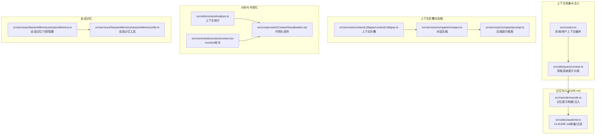
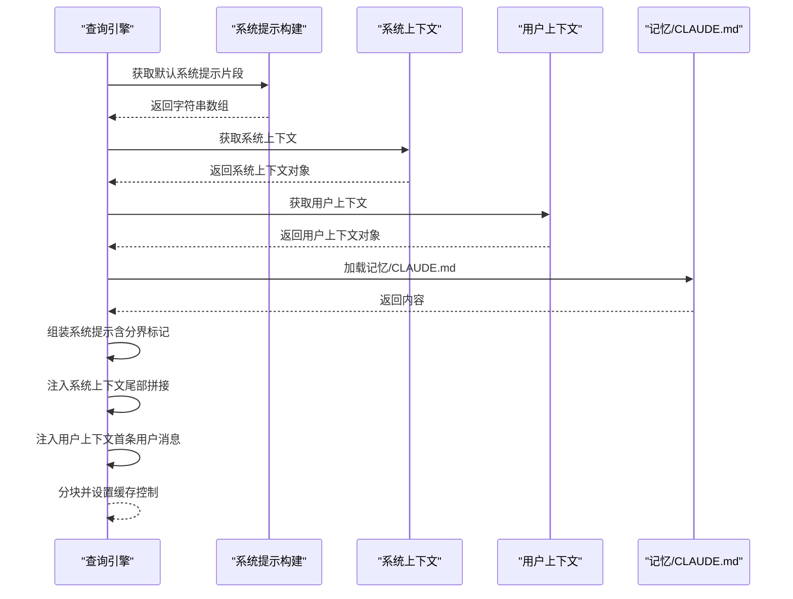
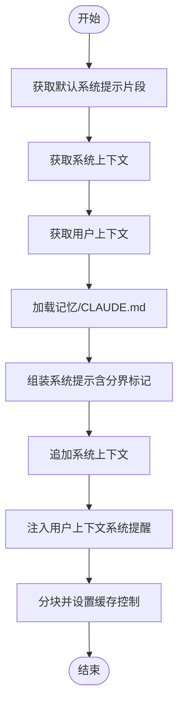
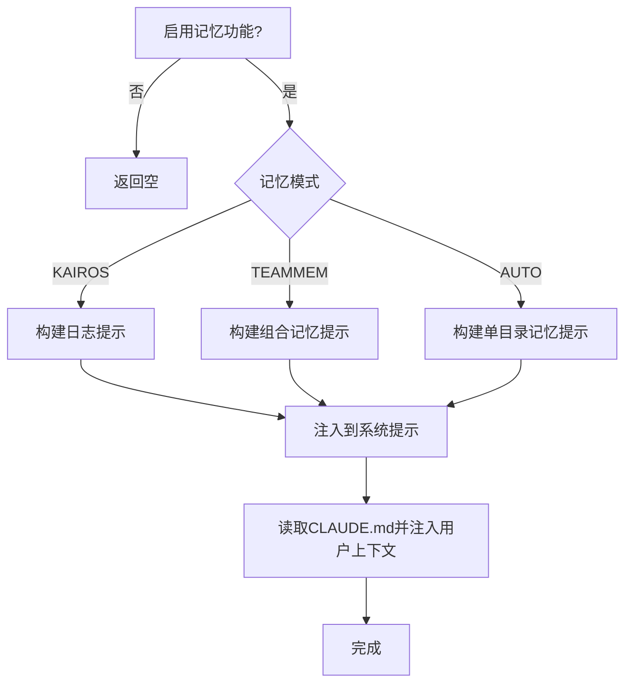
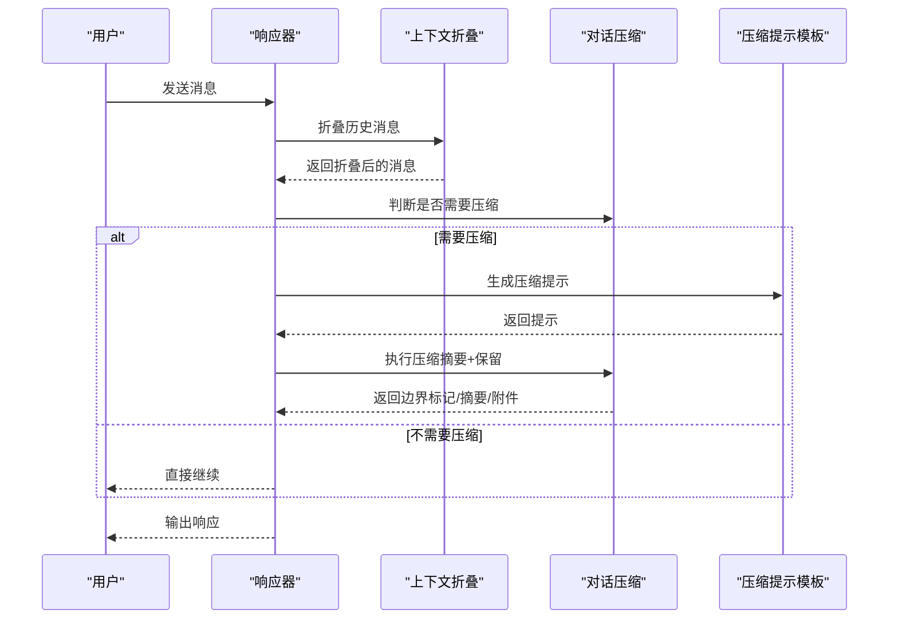
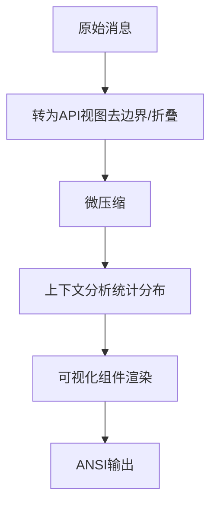
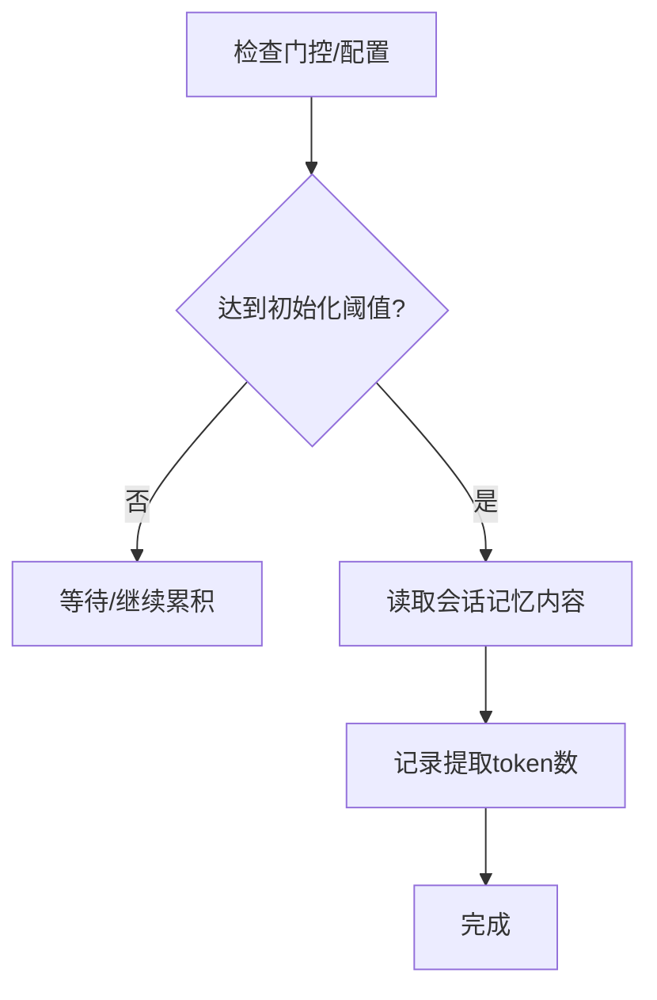
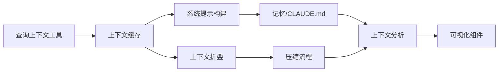

# 上下文管理

<cite>
**本文引用的文件**
- [src/context.ts](file://src/context.ts)
- [src/memdir/memdir.ts](file://src/memdir/memdir.ts)
- [src/utils/claudemd.ts](file://src/utils/claudemd.ts)
- [src/utils/queryContext.ts](file://src/utils/queryContext.ts)
- [src/services/compact/compact.ts](file://src/services/compact/compact.ts)
- [src/services/compact/prompt.ts](file://src/services/compact/prompt.ts)
- [src/services/contextCollapse/contextCollapse.ts](file://src/services/contextCollapse/contextCollapse.ts)
- [src/utils/contextAnalysis.ts](file://src/utils/contextAnalysis.ts)
- [src/components/ContextVisualization.tsx](file://src/components/ContextVisualization.tsx)
- [src/commands/context/context.tsx](file://src/commands/context/context.tsx)
- [src/services/SessionMemory/sessionMemoryUtils.ts](file://src/services/SessionMemory/sessionMemoryUtils.ts)
- [src/services/SessionMemory/sessionMemory.ts](file://src/services/SessionMemory/sessionMemory.ts)
- [docs/context/system-prompt.mdx](file://docs/context/system-prompt.mdx)
- [docs/context/project-memory.mdx](file://docs/context/project-memory.mdx)
- [docs/context/compaction.mdx](file://docs/context/compaction.mdx)
</cite>

## 目录
1. [简介](#简介)
2. [项目结构](#项目结构)
3. [核心组件](#核心组件)
4. [架构总览](#架构总览)
5. [详细组件分析](#详细组件分析)
6. [依赖分析](#依赖分析)
7. [性能考量](#性能考量)
8. [故障排查指南](#故障排查指南)
9. [结论](#结论)
10. [附录](#附录)

## 简介
本文件系统性阐述 Claude Code 的上下文管理系统，覆盖以下主题：
- 项目上下文与系统提示的动态组装机制
- 记忆（Memory）与 CLAUDE.md 的收集、存储与注入流程
- 上下文折叠（Context Collapse）、压缩（Compaction）与窗口管理策略
- 上下文可视化与分析工具
- 上下文配置项与自定义上下文处理器的使用方式
- 权限系统与上下文安全控制
- 性能优化与内存管理实践

## 项目结构
围绕“上下文”这一核心主题，相关代码主要分布在如下模块：
- 上下文采集与注入：src/context.ts、src/utils/queryContext.ts
- 记忆与 CLAUDE.md：src/memdir/memdir.ts、src/utils/claudemd.ts
- 上下文折叠与压缩：src/services/contextCollapse/contextCollapse.ts、src/services/compact/compact.ts、src/services/compact/prompt.ts
- 上下文分析与可视化：src/utils/contextAnalysis.ts、src/components/ContextVisualization.tsx、src/commands/context/context.tsx
- 会话记忆（Session Memory）：src/services/SessionMemory/sessionMemory.ts、src/services/SessionMemory/sessionMemoryUtils.ts
- 文档与设计说明：docs/context/*.mdx

图表来源
- [src/context.ts:1-190](file://src/context.ts#L1-L190)
- [src/utils/queryContext.ts:30-74](file://src/utils/queryContext.ts#L30-L74)
- [src/memdir/memdir.ts:419-508](file://src/memdir/memdir.ts#L419-L508)
- [src/utils/claudemd.ts:1110-1151](file://src/utils/claudemd.ts#L1110-L1151)
- [src/services/contextCollapse/contextCollapse.ts](file://src/services/contextCollapse/contextCollapse.ts)
- [src/services/compact/compact.ts:389-765](file://src/services/compact/compact.ts#L389-L765)
- [src/services/compact/prompt.ts:293-303](file://src/services/compact/prompt.ts#L293-L303)
- [src/utils/contextAnalysis.ts:27-96](file://src/utils/contextAnalysis.ts#L27-L96)
- [src/components/ContextVisualization.tsx:105-134](file://src/components/ContextVisualization.tsx#L105-L134)
- [src/commands/context/context.tsx:30-63](file://src/commands/context/context.tsx#L30-L63)
- [src/services/SessionMemory/sessionMemory.ts:64-99](file://src/services/SessionMemory/sessionMemory.ts#L64-L99)
- [src/services/SessionMemory/sessionMemoryUtils.ts:85-138](file://src/services/SessionMemory/sessionMemoryUtils.ts#L85-L138)

章节来源
- [src/context.ts:1-190](file://src/context.ts#L1-L190)
- [src/utils/queryContext.ts:30-74](file://src/utils/queryContext.ts#L30-L74)
- [src/memdir/memdir.ts:419-508](file://src/memdir/memdir.ts#L419-L508)
- [src/utils/claudemd.ts:1110-1151](file://src/utils/claudemd.ts#L1110-L1151)
- [src/services/contextCollapse/contextCollapse.ts](file://src/services/contextCollapse/contextCollapse.ts)
- [src/services/compact/compact.ts:389-765](file://src/services/compact/compact.ts#L389-L765)
- [src/services/compact/prompt.ts:293-303](file://src/services/compact/prompt.ts#L293-L303)
- [src/utils/contextAnalysis.ts:27-96](file://src/utils/contextAnalysis.ts#L27-L96)
- [src/components/ContextVisualization.tsx:105-134](file://src/components/ContextVisualization.tsx#L105-L134)
- [src/commands/context/context.tsx:30-63](file://src/commands/context/context.tsx#L30-L63)
- [src/services/SessionMemory/sessionMemory.ts:64-99](file://src/services/SessionMemory/sessionMemory.ts#L64-L99)
- [src/services/SessionMemory/sessionMemoryUtils.ts:85-138](file://src/services/SessionMemory/sessionMemoryUtils.ts#L85-L138)

## 核心组件
- 系统/用户上下文缓存：负责会话级缓存的系统上下文与用户上下文，避免重复计算与网络/磁盘 IO。
- 记忆与 CLAUDE.md：统一构建记忆提示、处理 MEMORY.md 与 CLAUDE.md 的读取、截断与注入。
- 上下文折叠与压缩：在进入新回合前进行上下文折叠，必要时执行对话压缩，确保窗口不超限。
- 上下文分析与可视化：统计各来源 token 占比、生成可视化网格与建议，辅助诊断与优化。
- 会话记忆：基于门控与远程配置，按阈值初始化并记录会话记忆状态。

章节来源
- [src/context.ts:116-190](file://src/context.ts#L116-L190)
- [src/memdir/memdir.ts:199-316](file://src/memdir/memdir.ts#L199-L316)
- [src/utils/claudemd.ts:1110-1151](file://src/utils/claudemd.ts#L1110-L1151)
- [src/services/compact/compact.ts:389-765](file://src/services/compact/compact.ts#L389-L765)
- [src/utils/contextAnalysis.ts:27-96](file://src/utils/contextAnalysis.ts#L27-L96)
- [src/components/ContextVisualization.tsx:105-134](file://src/components/ContextVisualization.tsx#L105-L134)
- [src/services/SessionMemory/sessionMemoryUtils.ts:140-177](file://src/services/SessionMemory/sessionMemoryUtils.ts#L140-L177)

## 架构总览
系统提示与上下文的组装遵循“分层、分块、缓存”的设计原则：
- System Prompt 以字符串数组形式存在，便于按块分发缓存控制（全局/组织级/禁用）。
- 动态区通过“分界标记”与“Section 注册表”实现按需注入，避免破坏缓存。
- 用户上下文通过“系统提醒”形式注入为第一条用户消息，不参与系统提示缓存键。
- 记忆与 CLAUDE.md 作为用户上下文的一部分被注入，且支持特性开关与注入过滤。

图表来源
- [src/utils/queryContext.ts:44-74](file://src/utils/queryContext.ts#L44-L74)
- [src/context.ts:116-190](file://src/context.ts#L116-L190)
- [src/memdir/memdir.ts:419-508](file://src/memdir/memdir.ts#L419-L508)
- [docs/context/system-prompt.mdx:13-253](file://docs/context/system-prompt.mdx#L13-L253)

章节来源
- [docs/context/system-prompt.mdx:13-253](file://docs/context/system-prompt.mdx#L13-L253)
- [src/context.ts:116-190](file://src/context.ts#L116-L190)
- [src/utils/queryContext.ts:44-74](file://src/utils/queryContext.ts#L44-L74)

## 详细组件分析

### 系统提示与上下文注入
- 系统提示以字符串数组形式存在，通过“分界标记”将静态区与动态区分隔，使静态区可跨组织缓存，动态区按需重建。
- 用户上下文通过“系统提醒”注入为第一条用户消息，系统上下文追加到系统提示尾部。
- CLAUDE.md 与 MEMORY.md 的内容作为用户上下文的一部分注入，支持特性开关与注入过滤。

图表来源
- [src/utils/queryContext.ts:44-74](file://src/utils/queryContext.ts#L44-L74)
- [src/context.ts:116-190](file://src/context.ts#L116-L190)
- [src/memdir/memdir.ts:419-508](file://src/memdir/memdir.ts#L419-L508)

章节来源
- [src/context.ts:116-190](file://src/context.ts#L116-L190)
- [src/utils/queryContext.ts:44-74](file://src/utils/queryContext.ts#L44-L74)
- [docs/context/system-prompt.mdx:168-214](file://docs/context/system-prompt.mdx#L168-L214)

### 记忆与 CLAUDE.md 管理
- MEMORY.md 的内容会被截断并注入到系统提示的“记忆”部分；同时，CLAUDE.md 的多级合并内容作为用户上下文注入。
- 支持多种记忆模式：纯自动记忆、组合团队记忆、KAIROS 日志模式等，并可通过特性开关控制是否注入索引。
- 提供缓存清理与重置接口，保证在工作树切换、设置同步等事件后上下文正确性。

图表来源
- [src/memdir/memdir.ts:419-508](file://src/memdir/memdir.ts#L419-L508)
- [src/utils/claudemd.ts:1110-1151](file://src/utils/claudemd.ts#L1110-L1151)

章节来源
- [src/memdir/memdir.ts:419-508](file://src/memdir/memdir.ts#L419-L508)
- [src/utils/claudemd.ts:1110-1151](file://src/utils/claudemd.ts#L1110-L1151)
- [docs/context/project-memory.mdx:146-179](file://docs/context/project-memory.mdx#L146-L179)

### 上下文折叠与压缩
- 上下文折叠：在进入新回合前，对历史消息进行折叠，减少冗余内容，保留关键信息。
- 对话压缩：当上下文接近阈值或触发自动压缩时，生成摘要并保留近期消息，同时注入必要的附件与钩子消息。
- 压缩提示模板：提供“全面摘要”和“局部摘要”两种模板，分别面向整段对话与近期消息。

图表来源
- [src/services/contextCollapse/contextCollapse.ts](file://src/services/contextCollapse/contextCollapse.ts)
- [src/services/compact/compact.ts:389-765](file://src/services/compact/compact.ts#L389-L765)
- [src/services/compact/prompt.ts:293-303](file://src/services/compact/prompt.ts#L293-L303)

章节来源
- [src/services/compact/compact.ts:389-765](file://src/services/compact/compact.ts#L389-L765)
- [src/services/compact/prompt.ts:293-303](file://src/services/compact/prompt.ts#L293-L303)
- [docs/context/compaction.mdx](file://docs/context/compaction.mdx)

### 上下文分析与可视化
- 上下文分析：统计人类消息、助手消息、工具调用/结果、附件、重复文件读取等 token 分布，生成指标。
- 可视化组件：以网格形式展示各类别 token 占比、剩余空间、延迟加载工具等，并提供建议。
- /context 命令：在 REPL 中渲染上下文可视化，支持微压缩与折叠视图，帮助用户直观了解上下文构成。

图表来源
- [src/commands/context/context.tsx:30-63](file://src/commands/context/context.tsx#L30-L63)
- [src/utils/contextAnalysis.ts:27-96](file://src/utils/contextAnalysis.ts#L27-L96)
- [src/components/ContextVisualization.tsx:105-134](file://src/components/ContextVisualization.tsx#L105-L134)

章节来源
- [src/utils/contextAnalysis.ts:27-96](file://src/utils/contextAnalysis.ts#L27-L96)
- [src/components/ContextVisualization.tsx:105-134](file://src/components/ContextVisualization.tsx#L105-L134)
- [src/commands/context/context.tsx:30-63](file://src/commands/context/context.tsx#L30-L63)

### 会话记忆（Session Memory）
- 门控与远程配置：通过特性门与动态配置控制会话记忆的启用与阈值。
- 初始化与阈值：根据上下文窗口 token 数判断是否初始化，记录提取 token 数以度量增长。
- 内容读取与等待：提供读取会话记忆内容与等待提取完成的工具方法。

图表来源
- [src/services/SessionMemory/sessionMemory.ts:64-99](file://src/services/SessionMemory/sessionMemory.ts#L64-L99)
- [src/services/SessionMemory/sessionMemoryUtils.ts:140-177](file://src/services/SessionMemory/sessionMemoryUtils.ts#L140-L177)
- [src/services/SessionMemory/sessionMemoryUtils.ts:85-138](file://src/services/SessionMemory/sessionMemoryUtils.ts#L85-L138)

章节来源
- [src/services/SessionMemory/sessionMemory.ts:64-99](file://src/services/SessionMemory/sessionMemory.ts#L64-L99)
- [src/services/SessionMemory/sessionMemoryUtils.ts:140-177](file://src/services/SessionMemory/sessionMemoryUtils.ts#L140-L177)
- [src/services/SessionMemory/sessionMemoryUtils.ts:85-138](file://src/services/SessionMemory/sessionMemoryUtils.ts#L85-L138)

## 依赖分析
- 上下文采集依赖系统提示构建与查询上下文工具，确保在进入 API 调用前完成组装。
- 记忆与 CLAUDE.md 的注入依赖特性开关与注入过滤，避免不必要的内容进入系统提示。
- 折叠与压缩依赖上下文分析结果与提示模板，形成闭环。
- 可视化组件依赖分析结果与设置来源映射，提供用户可读的上下文视图。

图表来源
- [src/utils/queryContext.ts:44-74](file://src/utils/queryContext.ts#L44-L74)
- [src/context.ts:116-190](file://src/context.ts#L116-L190)
- [src/memdir/memdir.ts:419-508](file://src/memdir/memdir.ts#L419-L508)
- [src/utils/contextAnalysis.ts:27-96](file://src/utils/contextAnalysis.ts#L27-L96)
- [src/components/ContextVisualization.tsx:105-134](file://src/components/ContextVisualization.tsx#L105-L134)
- [src/services/contextCollapse/contextCollapse.ts](file://src/services/contextCollapse/contextCollapse.ts)
- [src/services/compact/compact.ts:389-765](file://src/services/compact/compact.ts#L389-L765)

章节来源
- [src/utils/queryContext.ts:44-74](file://src/utils/queryContext.ts#L44-L74)
- [src/context.ts:116-190](file://src/context.ts#L116-L190)
- [src/memdir/memdir.ts:419-508](file://src/memdir/memdir.ts#L419-L508)
- [src/utils/contextAnalysis.ts:27-96](file://src/utils/contextAnalysis.ts#L27-L96)
- [src/components/ContextVisualization.tsx:105-134](file://src/components/ContextVisualization.tsx#L105-L134)
- [src/services/compact/compact.ts:389-765](file://src/services/compact/compact.ts#L389-L765)

## 性能考量
- Prompt Cache 分块与 TTL：通过分界标记与缓存控制，最大化静态区的跨组织缓存命中，降低 token 成本。
- 上下文折叠与压缩：在接近阈值前主动折叠与压缩，避免一次性超限导致失败重试。
- 微压缩与折叠视图：在 /context 命令中先进行微压缩与折叠视图，再分析与渲染，提升诊断效率。
- 缓存清理与重置：针对记忆文件缓存提供清理与重置接口，保证在工作树切换、设置同步等事件后上下文正确性与性能。

## 故障排查指南
- 缓存破坏：若系统提示频繁失效，检查是否在静态区放置了运行时条件（应置于动态区或使用分界标记）。
- 上下文过大：使用 /context 命令查看可视化，识别占用 token 最多的类别，针对性裁剪或折叠。
- 记忆性能问题：关注大型记忆文件数量与大小，必要时拆分或移除冗余内容。
- 权限与注入：确认特性开关与注入过滤逻辑，避免不必要的内容进入上下文。

章节来源
- [docs/context/system-prompt.mdx:149-167](file://docs/context/system-prompt.mdx#L149-L167)
- [src/commands/context/context.tsx:30-63](file://src/commands/context/context.tsx#L30-L63)
- [src/utils/status.tsx:116-125](file://src/utils/status.tsx#L116-L125)

## 结论
Claude Code 的上下文管理通过“分层、分块、缓存”的系统提示设计与“折叠/压缩”的窗口管理策略，在保证上下文完整性的同时显著降低了 token 成本与运行时开销。结合可视化与分析工具，开发者可以直观掌握上下文构成并进行优化；配合会话记忆与权限控制，进一步提升了安全性与可维护性。

## 附录
- 上下文配置选项与自定义处理器
  - 系统提示优先级：Override > Coordinator > Agent > Custom > Default，支持追加段落。
  - 记忆模式：KAIROS 日志、TEAMMEM 组合、纯自动记忆，均可通过特性开关与注入过滤控制。
  - 上下文折叠与压缩：提供微压缩与折叠视图，支持局部与全面摘要模板。
- 权限系统与上下文安全
  - 系统提示与上下文注入均遵循缓存策略，避免泄露敏感信息；运行时条件置于动态区，防止缓存污染。
- 性能优化与内存管理
  - 采用 Prompt Cache 分块与 TTL 策略，结合折叠/压缩与缓存清理，平衡性能与准确性。