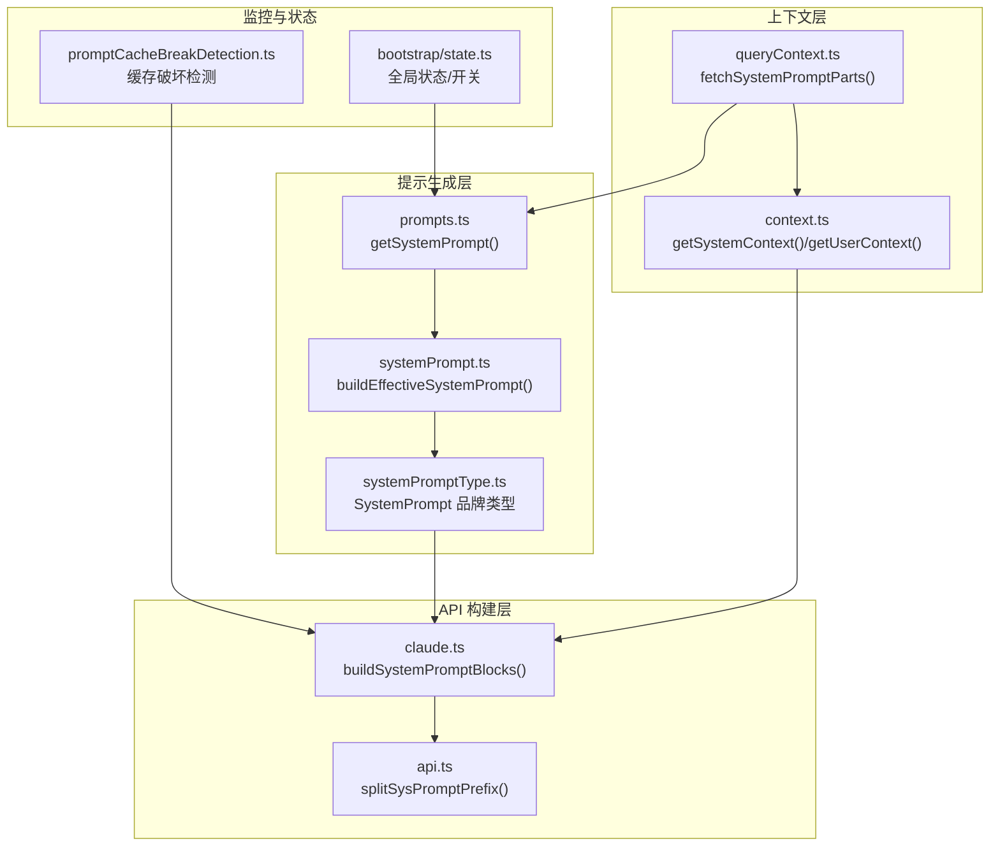
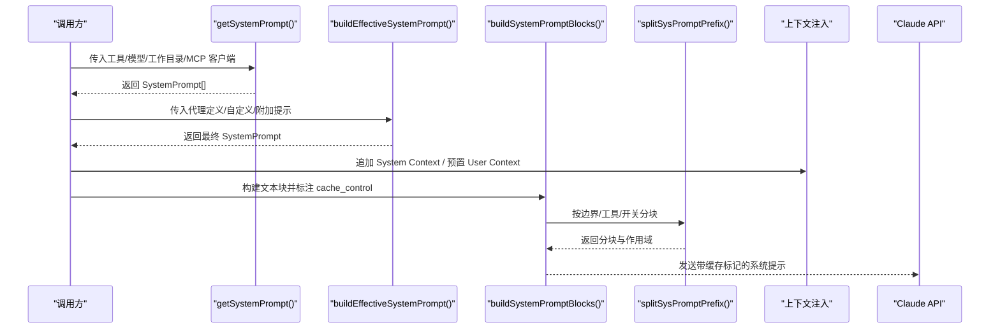
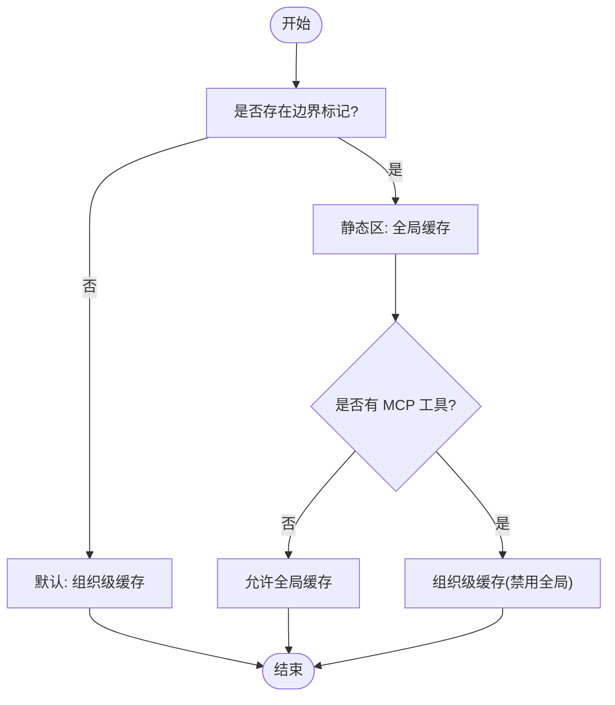
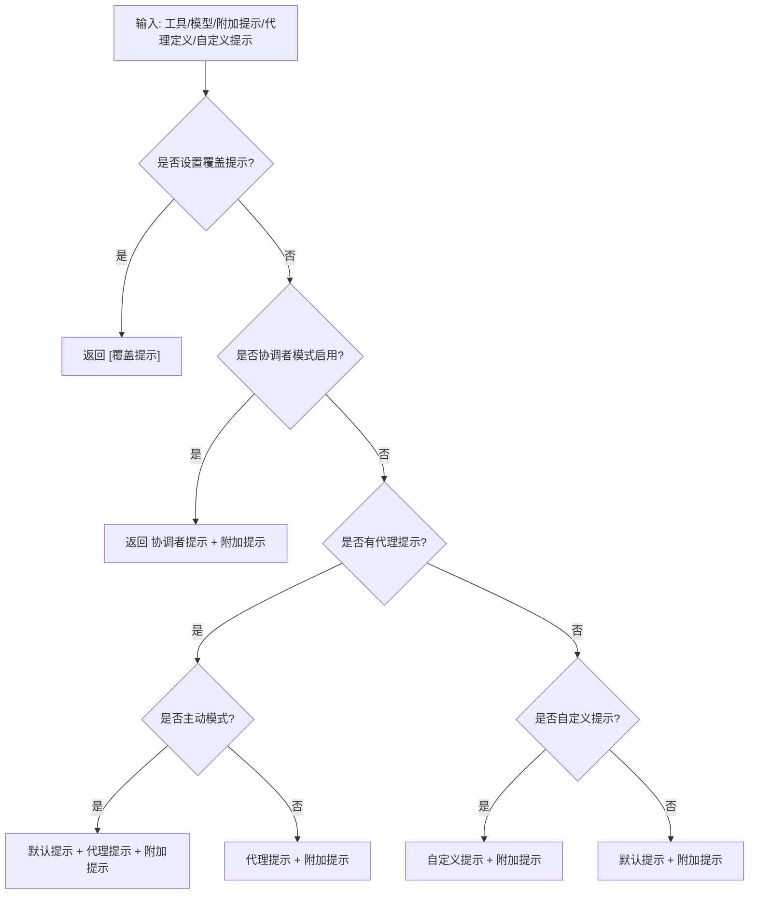
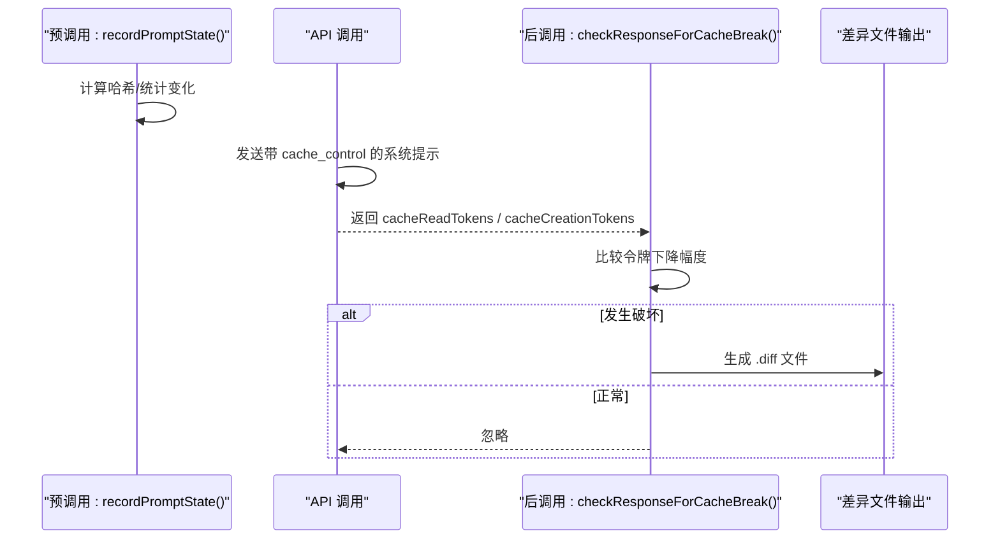
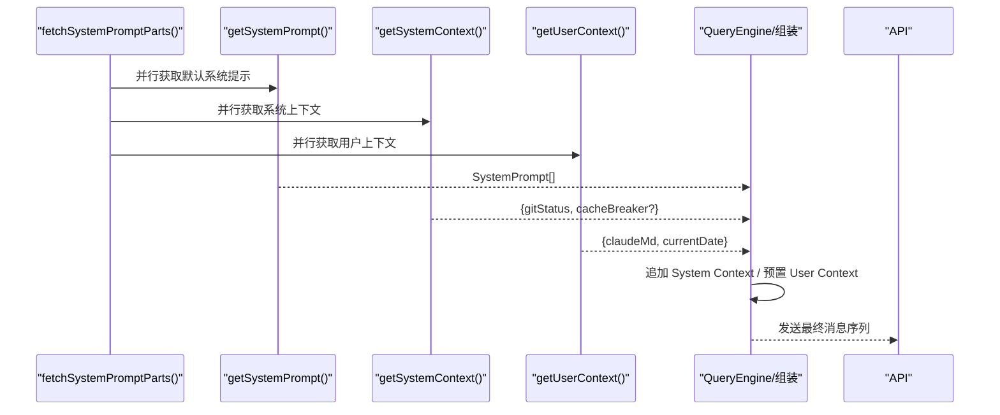
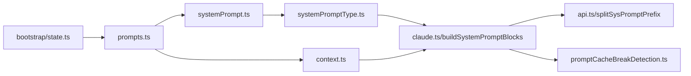
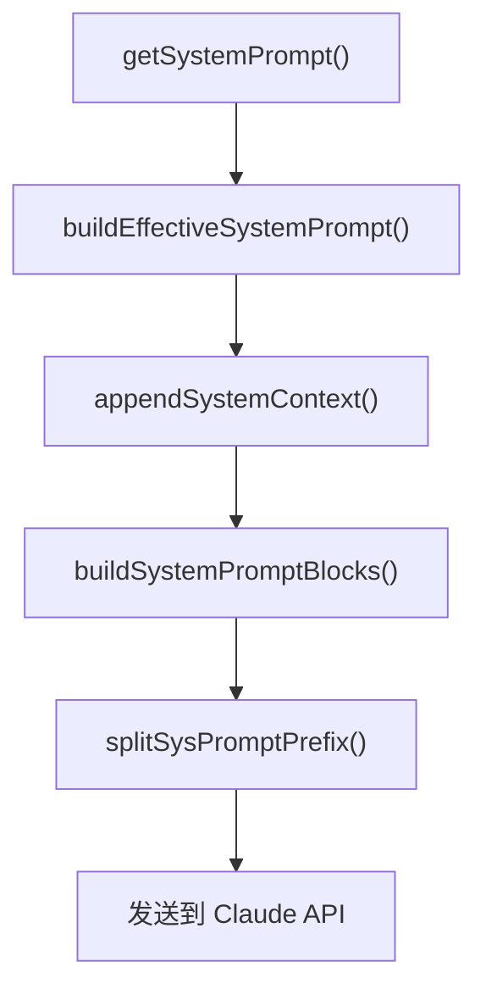

# 系统提示管理

<cite>
**本文引用的文件**
- [docs/context/system-prompt.mdx](file://docs/context/system-prompt.mdx)
- [src/constants/prompts.ts](file://src/constants/prompts.ts)
- [src/utils/systemPrompt.ts](file://src/utils/systemPrompt.ts)
- [src/utils/systemPromptType.ts](file://src/utils/systemPromptType.ts)
- [src/services/api/claude.ts](file://src/services/api/claude.ts)
- [src/utils/api.ts](file://src/utils/api.ts)
- [src/bootstrap/state.ts](file://src/bootstrap/state.ts)
- [src/context.ts](file://src/context.ts)
- [src/utils/queryContext.ts](file://src/utils/queryContext.ts)
- [src/services/api/promptCacheBreakDetection.ts](file://src/services/api/promptCacheBreakDetection.ts)
- [src/main.tsx](file://src/main.tsx)
</cite>

## 目录
1. [简介](#简介)
2. [项目结构](#项目结构)
3. [核心组件](#核心组件)
4. [架构总览](#架构总览)
5. [详细组件分析](#详细组件分析)
6. [依赖关系分析](#依赖关系分析)
7. [性能考量](#性能考量)
8. [故障排查指南](#故障排查指南)
9. [结论](#结论)
10. [附录](#附录)

## 简介
本文件系统性阐述 Claude Code 的“系统提示”（System Prompt）管理机制，覆盖以下关键主题：
- 系统提示的结构与组成：静态区、动态区、边界标记、品牌类型与注入点
- 动态生成与个性化：Section 注册表、优先级选择、附加提示与代理提示
- 缓存策略与破坏：分块、作用域、TTL、边界标记与破坏触发
- 上下文注入：System Context 与 User Context 的来源、时机与影响
- 安全控制与权限：模型覆盖、隐蔽模式、权限与合规
- 调试与监控：缓存破坏检测、差异记录、性能指标
- 应用场景与最佳实践：不同入口、代理模式、自定义提示与环境变量

## 项目结构
围绕系统提示管理的关键代码分布在如下模块：
- 文档与说明：docs/context/system-prompt.mdx
- 提示生成与组装：src/constants/prompts.ts、src/utils/systemPrompt.ts、src/utils/systemPromptType.ts
- API 构建与缓存：src/services/api/claude.ts、src/utils/api.ts
- 上下文注入：src/context.ts、src/utils/queryContext.ts
- 缓存破坏检测：src/services/api/promptCacheBreakDetection.ts
- 全局状态与开关：src/bootstrap/state.ts
- 主流程集成：src/main.tsx

**图表来源**
- [src/constants/prompts.ts:444-577](file://src/constants/prompts.ts#L444-L577)
- [src/utils/systemPrompt.ts:41-123](file://src/utils/systemPrompt.ts#L41-L123)
- [src/utils/systemPromptType.ts:8-14](file://src/utils/systemPromptType.ts#L8-L14)
- [src/services/api/claude.ts:3214-3238](file://src/services/api/claude.ts#L3214-L3238)
- [src/utils/api.ts:321-329](file://src/utils/api.ts#L321-L329)
- [src/context.ts:116-189](file://src/context.ts#L116-L189)
- [src/utils/queryContext.ts:44-74](file://src/utils/queryContext.ts#L44-L74)
- [src/services/api/promptCacheBreakDetection.ts:1-200](file://src/services/api/promptCacheBreakDetection.ts#L1-L200)
- [src/bootstrap/state.ts:202-257](file://src/bootstrap/state.ts#L202-L257)

**章节来源**
- [docs/context/system-prompt.mdx:1-253](file://docs/context/system-prompt.mdx#L1-L253)
- [src/constants/prompts.ts:1-915](file://src/constants/prompts.ts#L1-L915)
- [src/utils/systemPrompt.ts:1-124](file://src/utils/systemPrompt.ts#L1-L124)
- [src/utils/systemPromptType.ts:1-15](file://src/utils/systemPromptType.ts#L1-L15)
- [src/services/api/claude.ts:3214-3238](file://src/services/api/claude.ts#L3214-L3238)
- [src/utils/api.ts:296-329](file://src/utils/api.ts#L296-L329)
- [src/context.ts:116-189](file://src/context.ts#L116-L189)
- [src/utils/queryContext.ts:44-74](file://src/utils/queryContext.ts#L44-L74)
- [src/services/api/promptCacheBreakDetection.ts:1-200](file://src/services/api/promptCacheBreakDetection.ts#L1-L200)
- [src/bootstrap/state.ts:202-257](file://src/bootstrap/state.ts#L202-L257)

## 核心组件
- 系统提示品牌类型与工厂
  - SystemPrompt 品牌类型确保只有经显式转换的数组能进入 API 调用，避免误用普通字符串数组。
  - getSystemPrompt() 返回有序字符串数组，包含静态段与动态段，并在合适位置插入边界标记。
- 有效提示选择器
  - buildEffectiveSystemPrompt() 按优先级选择提示：覆盖 > 协调者 > 代理 > 自定义 > 默认，并可追加附加提示。
- API 构建与缓存
  - buildSystemPromptBlocks() 将 SystemPrompt 拆分为 TextBlock 并标注 cache_control。
  - splitSysPromptPrefix() 根据 MCP 工具、边界标记与全局缓存开关进行分块与作用域划分。
- 上下文注入
  - getSystemContext() 与 getUserContext() 分别提供系统侧与用户侧上下文，分别追加到 System Prompt 与作为首条用户消息注入。
- 缓存破坏检测
  - promptCacheBreakDetection.ts 记录前后状态，基于缓存读取令牌变化判断是否发生破坏，并生成差异文件辅助诊断。

**章节来源**
- [src/utils/systemPromptType.ts:8-14](file://src/utils/systemPromptType.ts#L8-L14)
- [src/constants/prompts.ts:444-577](file://src/constants/prompts.ts#L444-L577)
- [src/utils/systemPrompt.ts:41-123](file://src/utils/systemPrompt.ts#L41-L123)
- [src/services/api/claude.ts:3214-3238](file://src/services/api/claude.ts#L3214-L3238)
- [src/utils/api.ts:296-329](file://src/utils/api.ts#L296-L329)
- [src/context.ts:116-189](file://src/context.ts#L116-L189)
- [src/services/api/promptCacheBreakDetection.ts:243-492](file://src/services/api/promptCacheBreakDetection.ts#L243-L492)

## 架构总览
系统提示从“生成—组装—分块—缓存—注入—调用”的完整链路如下：

**图表来源**
- [src/constants/prompts.ts:444-577](file://src/constants/prompts.ts#L444-L577)
- [src/utils/systemPrompt.ts:41-123](file://src/utils/systemPrompt.ts#L41-L123)
- [src/services/api/claude.ts:3214-3238](file://src/services/api/claude.ts#L3214-L3238)
- [src/utils/api.ts:296-329](file://src/utils/api.ts#L296-L329)
- [src/context.ts:116-189](file://src/context.ts#L116-L189)

## 详细组件分析

### 组件一：系统提示的结构与边界
- 结构组成
  - 静态区：介绍、规则、任务、动作、工具使用、语气风格、输出效率等，适合跨组织缓存。
  - 边界标记：SYSTEM_PROMPT_DYNAMIC_BOUNDARY，用于区分静态与动态内容，使静态区可被全局缓存。
  - 动态区：会话指导、记忆、模型覆盖、环境信息、语言、输出风格、MCP 指令、草稿、函数清理、工具结果摘要、令牌预算、简报等。
- 作用域与缓存
  - 全局缓存：静态区在边界存在且满足条件时可跨组织缓存。
  - 组织级缓存：默认或 MCP 工具存在时采用。
  - 不缓存：Attribution Header 与部分动态内容。

**图表来源**
- [src/constants/prompts.ts:105-115](file://src/constants/prompts.ts#L105-L115)
- [src/utils/api.ts:296-329](file://src/utils/api.ts#L296-L329)

**章节来源**
- [docs/context/system-prompt.mdx:11-253](file://docs/context/system-prompt.mdx#L11-L253)
- [src/constants/prompts.ts:105-115](file://src/constants/prompts.ts#L105-L115)
- [src/utils/api.ts:296-329](file://src/utils/api.ts#L296-L329)

### 组件二：动态生成与个性化
- Section 注册表
  - systemPromptSection(name, compute)：缓存式注册，计算一次，直至 /clear 或 /compact。
  - DANGEROUS_uncachedSystemPromptSection(name, compute, reason)：每次重算，会破坏缓存，需给出理由。
  - resolveSystemPromptSections()：解析所有 Section，优先使用缓存值。
- 优先级选择
  - 覆盖提示（override）> 协调者提示 > 代理提示（主动模式下追加）> 自定义提示 > 默认提示。
  - 附加提示始终追加到末尾（覆盖模式除外）。
- 主动模式与代理提示
  - 主动模式下，代理提示追加到默认提示，形成领域指令叠加。

**图表来源**
- [src/utils/systemPrompt.ts:41-123](file://src/utils/systemPrompt.ts#L41-L123)
- [src/main.tsx:2200-2209](file://src/main.tsx#L2200-L2209)

**章节来源**
- [src/constants/systemPromptSections.ts:1-68](file://src/constants/systemPromptSections.ts#L1-L68)
- [src/utils/systemPrompt.ts:41-123](file://src/utils/systemPrompt.ts#L41-L123)
- [src/main.tsx:2200-2209](file://src/main.tsx#L2200-L2209)

### 组件三：缓存策略与破坏控制
- 分块与作用域
  - splitSysPromptPrefix() 根据 MCP 工具存在、边界标记与全局缓存开关，将系统提示拆分为若干块并标注 cacheScope。
- cache_control 与 TTL
  - buildSystemPromptBlocks() 为可缓存块附加 cache_control，包含 scope 与可选 TTL。
  - should1hCacheTTL() 判定 1 小时 TTL 的资格，受环境变量与 GrowthBook 配置影响。
- 缓存破坏触发
  - Session-Specific Guidance 必须位于边界之后，否则会因运行时位组合爆炸导致缓存失效。
  - MCP 指令变更、工具集合变化、模型切换、头部开关变化等均可能触发破坏。
- 缓存破坏检测
  - 记录前后状态（系统提示哈希、工具哈希、模型、快速模式、beta 头部、过量使用、缓存编辑、effort、额外参数），比较缓存读取令牌下降幅度，生成差异文件定位原因。

**图表来源**
- [src/services/api/promptCacheBreakDetection.ts:243-492](file://src/services/api/promptCacheBreakDetection.ts#L243-L492)
- [src/utils/api.ts:321-329](file://src/utils/api.ts#L321-L329)
- [src/services/api/claude.ts:3214-3238](file://src/services/api/claude.ts#L3214-L3238)

**章节来源**
- [src/utils/api.ts:296-329](file://src/utils/api.ts#L296-L329)
- [src/services/api/claude.ts:3214-3238](file://src/services/api/claude.ts#L3214-L3238)
- [src/services/api/promptCacheBreakDetection.ts:1-200](file://src/services/api/promptCacheBreakDetection.ts#L1-L200)

### 组件四：上下文注入与对话行为
- System Context
  - getSystemContext() 提供 git 状态与缓存破坏器（仅 ant 用户），会话内缓存一次。
  - appendSystemContext() 将其简单拼接到 System Prompt 末尾。
- User Context
  - getUserContext() 提供合并后的 CLAUDE.md 与当前日期，prependUserContext() 以 <system-reminder> 包裹为首条用户消息注入。
- 注入时机
  - fetchSystemPromptParts() 并行获取默认系统提示、用户上下文与系统上下文，QueryEngine 再进行最终拼装与注入。

**图表来源**
- [src/utils/queryContext.ts:44-74](file://src/utils/queryContext.ts#L44-L74)
- [src/context.ts:116-189](file://src/context.ts#L116-L189)
- [src/constants/prompts.ts:204-214](file://src/constants/prompts.ts#L204-L214)

**章节来源**
- [src/context.ts:116-189](file://src/context.ts#L116-L189)
- [src/utils/queryContext.ts:44-74](file://src/utils/queryContext.ts#L44-L74)
- [src/constants/prompts.ts:204-214](file://src/constants/prompts.ts#L204-L214)

### 组件五：安全控制与权限管理
- 模型覆盖与隐蔽模式
  - ant 用户在隐蔽模式下隐藏模型名称/ID，避免泄露内部信息。
- 权限与合规
  - 系统提示中包含工具调用与钩子的处理说明，强调权限模式与用户授权的重要性。
  - 缓存破坏检测关注 beta 头部与过量使用状态，避免误报。
- 全局状态与开关
  - bootstrap/state.ts 维护 promptCache1hEligible、afkModeHeaderLatched、fastModeHeaderLatched 等稳定开关，确保会话内缓存一致性。

**章节来源**
- [src/constants/prompts.ts:606-649](file://src/constants/prompts.ts#L606-L649)
- [src/bootstrap/state.ts:220-242](file://src/bootstrap/state.ts#L220-L242)
- [src/services/api/promptCacheBreakDetection.ts:129-131](file://src/services/api/promptCacheBreakDetection.ts#L129-L131)

## 依赖关系分析
- 模块耦合
  - getSystemPrompt() 依赖 systemPromptSections.ts 的注册表与 resolveSystemPromptSections()。
  - buildEffectiveSystemPrompt() 依赖代理定义与特性开关，最终统一转换为 SystemPrompt。
  - buildSystemPromptBlocks() 依赖 splitSysPromptPrefix() 与 cache_control 生成。
  - 上下文层通过 memoize 缓存减少重复计算，避免对 API 的重复 IO。
- 外部依赖
  - Anthropic API 的 Prompt Cache 以内容块为单位，Blake2b 哈希决定缓存键。
  - GrowthBook 配置用于 1 小时 TTL 的白名单判定。

**图表来源**
- [src/constants/prompts.ts:52-62](file://src/constants/prompts.ts#L52-L62)
- [src/utils/systemPrompt.ts:1-26](file://src/utils/systemPrompt.ts#L1-L26)
- [src/utils/systemPromptType.ts:8-14](file://src/utils/systemPromptType.ts#L8-L14)
- [src/services/api/claude.ts:3214-3238](file://src/services/api/claude.ts#L3214-L3238)
- [src/utils/api.ts:321-329](file://src/utils/api.ts#L321-L329)
- [src/context.ts:116-189](file://src/context.ts#L116-L189)
- [src/services/api/promptCacheBreakDetection.ts:1-200](file://src/services/api/promptCacheBreakDetection.ts#L1-L200)
- [src/bootstrap/state.ts:202-257](file://src/bootstrap/state.ts#L202-L257)

**章节来源**
- [src/constants/prompts.ts:52-62](file://src/constants/prompts.ts#L52-L62)
- [src/utils/systemPrompt.ts:1-26](file://src/utils/systemPrompt.ts#L1-L26)
- [src/utils/api.ts:321-329](file://src/utils/api.ts#L321-L329)
- [src/services/api/claude.ts:3214-3238](file://src/services/api/claude.ts#L3214-L3238)
- [src/context.ts:116-189](file://src/context.ts#L116-L189)
- [src/services/api/promptCacheBreakDetection.ts:1-200](file://src/services/api/promptCacheBreakDetection.ts#L1-L200)
- [src/bootstrap/state.ts:202-257](file://src/bootstrap/state.ts#L202-L257)

## 性能考量
- 缓存分块与命中
  - 将系统提示拆分为多个块，静态区可跨组织缓存，显著降低输入 token 成本。
  - 边界标记确保静态区与动态区的缓存作用域清晰分离。
- TTL 与稳定性
  - 1 小时 TTL 仅在特定提供商与白名单条件下启用，且会话内稳定，避免中途变化导致的缓存抖动。
- 并发与缓存
  - 上下文获取使用 memoize，会话内仅计算一次，减少重复 IO。
- 工具与 MCP
  - MCP 工具列表变化会降级为组织级缓存，避免全局缓存失效。

[本节为通用性能讨论，无需具体文件分析]

## 故障排查指南
- 缓存破坏告警
  - 观察 MIN_CACHE_MISS_TOKENS 阈值与令牌下降比例，确认是否为真实破坏。
  - 检查差异文件（cache-break-*.diff），定位系统提示或工具模式的变化。
- 常见触发点
  - MCP 指令变更、工具集合增删、模型切换、快速模式/AFK/缓存编辑头部开关翻转。
- 诊断步骤
  - 启用 PROMPT_CACHE_BREAK_DETECTION，观察日志与差异文件。
  - 使用 CLAUDE_CODE_SIMPLE 快速路径验证是否为提示内容导致的问题。
  - 检查系统提示注入（BREAK_CACHE_COMMAND）与隐蔽模式（undercover）对缓存的影响。

**章节来源**
- [src/services/api/promptCacheBreakDetection.ts:117-131](file://src/services/api/promptCacheBreakDetection.ts#L117-L131)
- [src/context.ts:130-148](file://src/context.ts#L130-L148)
- [src/constants/prompts.ts:450-454](file://src/constants/prompts.ts#L450-L454)

## 结论
Claude Code 的系统提示管理通过“品牌类型约束 + 动态组装 + 分块缓存 + 上下文注入 + 缓存破坏检测”的闭环，实现了高可维护性与高性价比的提示工程。合理利用边界标记、Section 注册表与优先级选择，可在保证安全与合规的前提下，灵活适配不同入口、代理与场景需求。

[本节为总结性内容，无需具体文件分析]

## 附录

### A. 关键流程图：系统提示到 API 的完整链路

**图表来源**
- [src/constants/prompts.ts:444-577](file://src/constants/prompts.ts#L444-L577)
- [src/utils/systemPrompt.ts:41-123](file://src/utils/systemPrompt.ts#L41-L123)
- [src/context.ts:437-447](file://src/context.ts#L437-L447)
- [src/services/api/claude.ts:3214-3238](file://src/services/api/claude.ts#L3214-L3238)
- [src/utils/api.ts:321-329](file://src/utils/api.ts#L321-L329)

### B. 最佳实践清单
- 使用 systemPromptSection() 注册静态/可缓存段，使用 DANGEROUS_uncachedSystemPromptSection() 标注动态段。
- 将会话特异性内容置于边界标记之后，避免静态区缓存失效。
- 合理使用附加提示与代理提示，避免过度叠加导致上下文膨胀。
- 在需要时启用 BREAK_CACHE_COMMAND 触发缓存破坏，但注意仅在必要时使用。
- 通过差异文件与缓存破坏检测持续监控提示变化对成本与性能的影响。

[本节为概念性内容，无需具体文件分析]