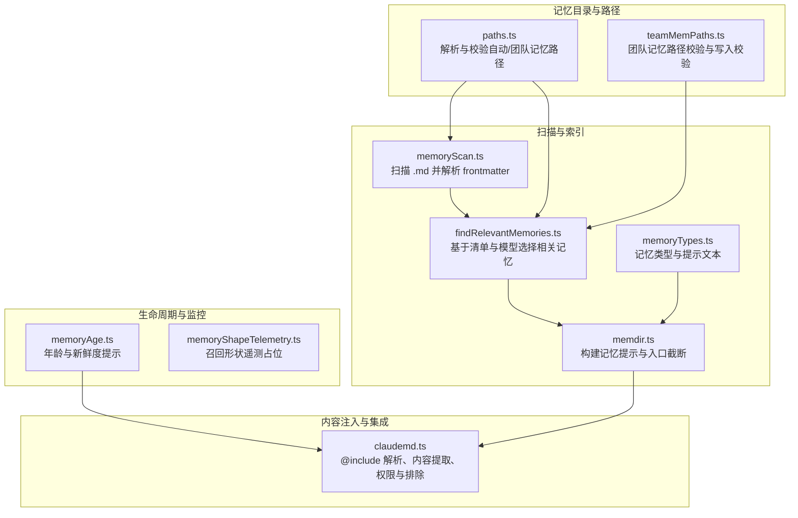
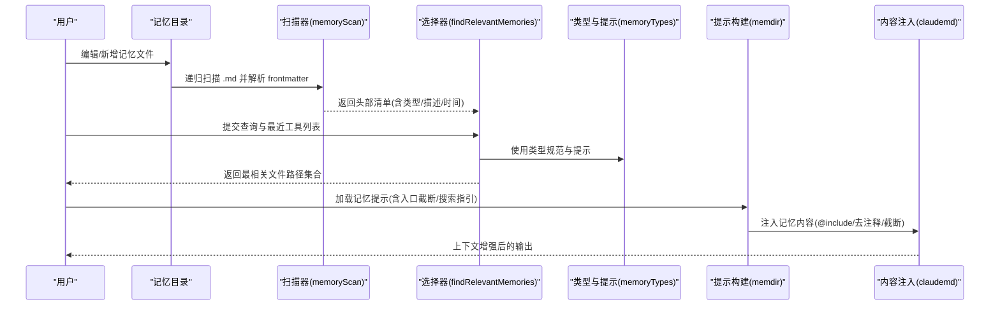
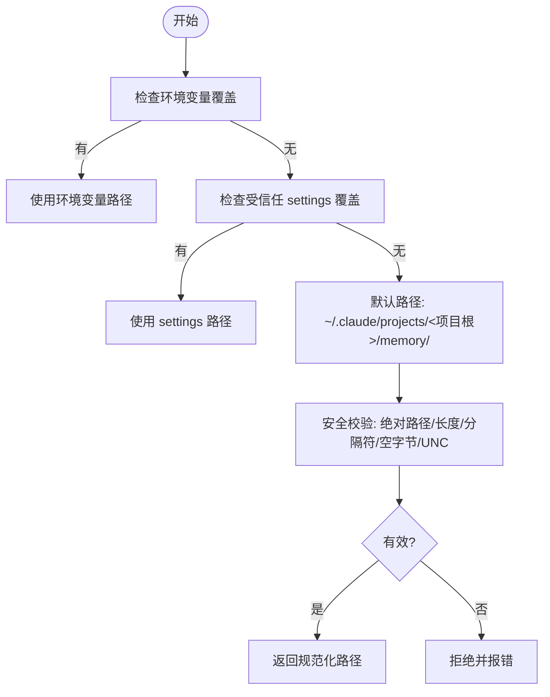
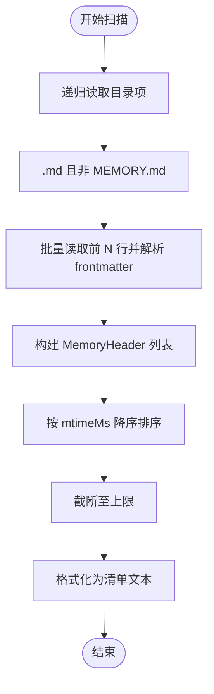
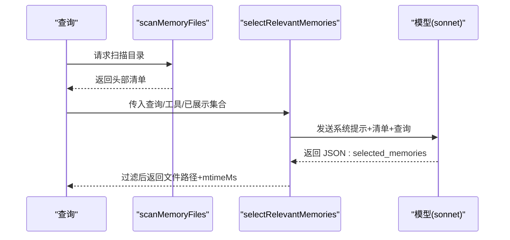
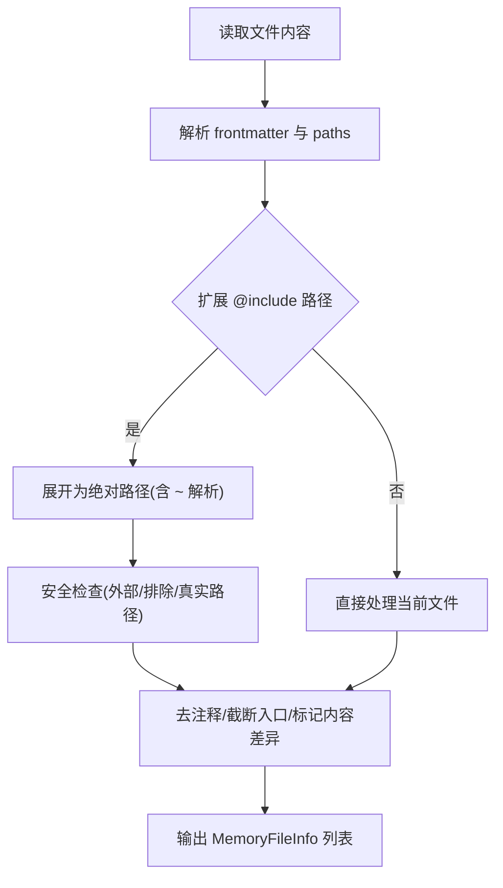
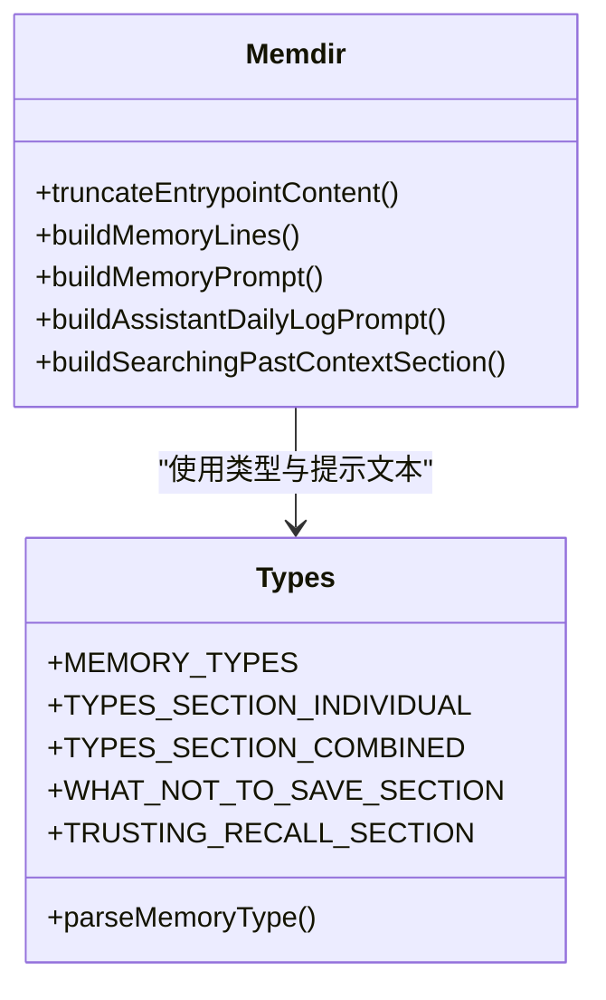
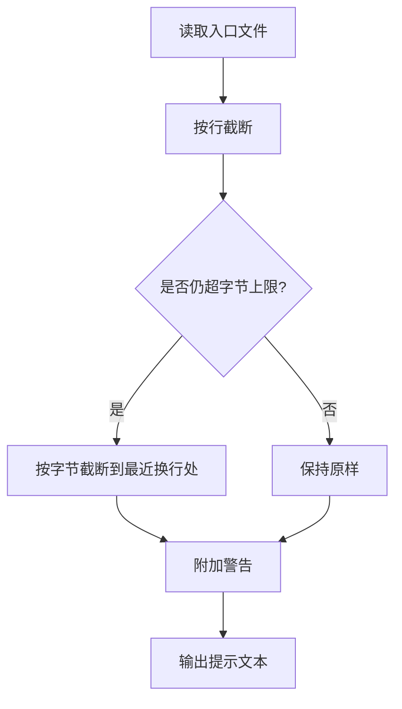
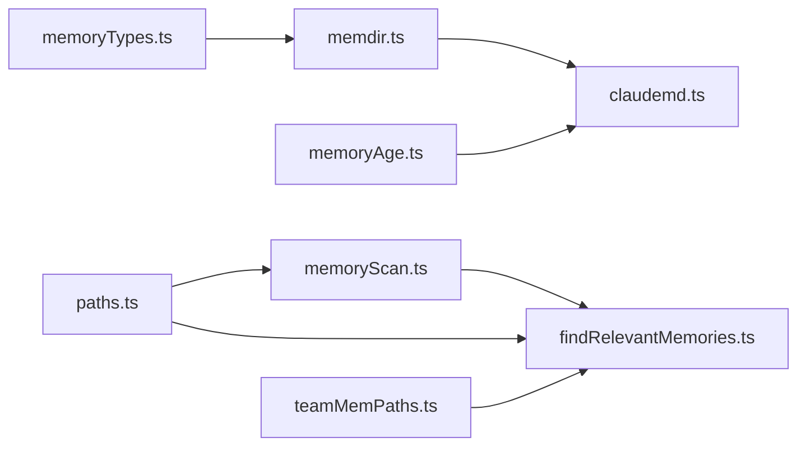

# 记忆管理

<cite>
**本文引用的文件**
- [memdir.ts](file://src/memdir/memdir.ts)
- [findRelevantMemories.ts](file://src/memdir/findRelevantMemories.ts)
- [memoryScan.ts](file://src/memdir/memoryScan.ts)
- [memoryTypes.ts](file://src/memdir/memoryTypes.ts)
- [paths.ts](file://src/memdir/paths.ts)
- [memoryAge.ts](file://src/memdir/memoryAge.ts)
- [teamMemPaths.ts](file://src/memdir/teamMemPaths.ts)
- [teamMemPrompts.ts](file://src/memdir/teamMemPrompts.ts)
- [claudemd.ts](file://src/utils/claudemd.ts)
- [memoryShapeTelemetry.ts](file://src/memdir/memoryShapeTelemetry.ts)
- [project-memory.mdx](file://docs/context/project-memory.mdx)
</cite>

## 目录
1. [简介](#简介)
2. [项目结构](#项目结构)
3. [核心组件](#核心组件)
4. [架构总览](#架构总览)
5. [详细组件分析](#详细组件分析)
6. [依赖关系分析](#依赖关系分析)
7. [性能考量](#性能考量)
8. [故障排查指南](#故障排查指南)
9. [结论](#结论)
10. [附录](#附录)

## 简介
本文件系统性阐述 Claude Code 的“记忆管理系统”，聚焦于记忆文件的发现、扫描与索引、目录结构与文件组织、相关记忆的查找与匹配策略、记忆类型的识别与内容提取、配置与自定义规则、与项目上下文的集成、生命周期与清理策略，以及性能优化与内存管理技巧。目标是帮助开发者与使用者理解并高效使用该系统。

## 项目结构
记忆管理相关的核心代码位于 src/memdir 与 src/utils 下，围绕以下关键模块协同工作：
- 目录与路径解析：确定自动记忆目录、团队记忆目录、入口文件位置与安全校验
- 内容扫描与索引：递归扫描 .md 文件，解析 frontmatter，生成清单
- 相关记忆检索：基于清单与模型选择最相关文件
- 类型与提示：定义记忆类型、保存规范、使用建议与过期提醒
- 内容注入：通过 CLAUDE.md 机制加载记忆文件及其 @include 链接
- 生命周期与清理：按时间与大小限制进行截断与告警

**图表来源**
- [paths.ts:85-279](file://src/memdir/paths.ts#L85-L279)
- [teamMemPaths.ts:109-284](file://src/memdir/teamMemPaths.ts#L109-L284)
- [memoryScan.ts:35-95](file://src/memdir/memoryScan.ts#L35-L95)
- [findRelevantMemories.ts:39-142](file://src/memdir/findRelevantMemories.ts#L39-L142)
- [memoryTypes.ts:14-272](file://src/memdir/memoryTypes.ts#L14-L272)
- [memdir.ts:272-316](file://src/memdir/memdir.ts#L272-L316)
- [claudemd.ts:618-685](file://src/utils/claudemd.ts#L618-L685)
- [memoryAge.ts:6-54](file://src/memdir/memoryAge.ts#L6-L54)
- [memoryShapeTelemetry.ts:1-8](file://src/memdir/memoryShapeTelemetry.ts#L1-L8)

**章节来源**
- [memdir.ts:1-508](file://src/memdir/memdir.ts#L1-L508)
- [memoryScan.ts:1-95](file://src/memdir/memoryScan.ts#L1-L95)
- [findRelevantMemories.ts:1-142](file://src/memdir/findRelevantMemories.ts#L1-L142)
- [memoryTypes.ts:1-272](file://src/memdir/memoryTypes.ts#L1-L272)
- [paths.ts:1-279](file://src/memdir/paths.ts#L1-L279)
- [teamMemPaths.ts:1-293](file://src/memdir/teamMemPaths.ts#L1-L293)
- [claudemd.ts:1-800](file://src/utils/claudemd.ts#L1-L800)
- [memoryAge.ts:1-54](file://src/memdir/memoryAge.ts#L1-L54)
- [memoryShapeTelemetry.ts:1-8](file://src/memdir/memoryShapeTelemetry.ts#L1-L8)

## 核心组件
- 记忆目录与路径解析
  - 自动记忆目录与入口文件定位、安全校验与覆盖优先级
  - 团队记忆目录与写入路径校验，防止路径穿越与符号链接逃逸
- 扫描与索引
  - 递归扫描 .md 文件，限定最大数量，解析 frontmatter，按修改时间排序
  - 将清单格式化为可被模型消费的文本
- 相关记忆检索
  - 基于查询与最近工具列表，调用模型选择最相关文件名
  - 过滤已展示过的候选，避免重复
- 类型与提示
  - 定义四类记忆类型与保存/使用规范
  - 构建记忆提示文本，包含入口文件截断、搜索指引、过期提醒等
- 内容注入与集成
  - 支持 @include 指令，解析相对/绝对/~ 路径，去注释、截断入口文件
  - 排除策略支持 claudeMdExcludes 设置与符号链接真实路径匹配
- 生命周期与监控
  - 入口文件行数与字节上限截断，新鲜度提示，召回形状遥测占位

**章节来源**
- [paths.ts:30-55](file://src/memdir/paths.ts#L30-L55)
- [paths.ts:223-235](file://src/memdir/paths.ts#L223-L235)
- [teamMemPaths.ts:73-78](file://src/memdir/teamMemPaths.ts#L73-L78)
- [teamMemPaths.ts:228-256](file://src/memdir/teamMemPaths.ts#L228-L256)
- [memoryScan.ts:35-77](file://src/memdir/memoryScan.ts#L35-L77)
- [findRelevantMemories.ts:39-75](file://src/memdir/findRelevantMemories.ts#L39-L75)
- [memoryTypes.ts:14-31](file://src/memdir/memoryTypes.ts#L14-L31)
- [memdir.ts:272-316](file://src/memdir/memdir.ts#L272-L316)
- [claudemd.ts:618-685](file://src/utils/claudemd.ts#L618-L685)
- [claudemd.ts:547-573](file://src/utils/claudemd.ts#L547-L573)
- [memoryAge.ts:6-54](file://src/memdir/memoryAge.ts#L6-L54)

## 架构总览
记忆系统由“目录与路径”“扫描与索引”“检索与提示”“内容注入与集成”“生命周期与监控”五层构成，形成从文件发现到上下文注入的闭环。

**图表来源**
- [memoryScan.ts:35-77](file://src/memdir/memoryScan.ts#L35-L77)
- [findRelevantMemories.ts:39-142](file://src/memdir/findRelevantMemories.ts#L39-L142)
- [memoryTypes.ts:14-31](file://src/memdir/memoryTypes.ts#L14-L31)
- [memdir.ts:272-316](file://src/memdir/memdir.ts#L272-L316)
- [claudemd.ts:618-685](file://src/utils/claudemd.ts#L618-L685)

## 详细组件分析

### 组件一：记忆目录与路径解析
- 自动记忆目录解析顺序
  - 环境变量覆盖优先
  - settings.json 受信任来源覆盖
  - 默认路径：~/.claude/projects/<项目根>/memory/
  - 支持 ~/ 展开与安全校验（拒绝相对/根/UNC/空字节等）
- 团队记忆目录
  - 作为自动记忆子目录存在，启用条件为自动记忆开启且功能开关开启
  - 写入路径校验包含字符串级与符号链接解析级双重检查，防止路径穿越与逃逸
- 入口文件
  - 自动/团队目录均以 MEMORY.md 作为索引入口，构建提示时会截断超限内容并附加警告

**图表来源**
- [paths.ts:85-150](file://src/memdir/paths.ts#L85-L150)
- [paths.ts:223-235](file://src/memdir/paths.ts#L223-L235)
- [teamMemPaths.ts:109-171](file://src/memdir/teamMemPaths.ts#L109-L171)

**章节来源**
- [paths.ts:30-55](file://src/memdir/paths.ts#L30-L55)
- [paths.ts:223-235](file://src/memdir/paths.ts#L223-L235)
- [teamMemPaths.ts:73-78](file://src/memdir/teamMemPaths.ts#L73-L78)
- [teamMemPaths.ts:228-256](file://src/memdir/teamMemPaths.ts#L228-L256)

### 组件二：扫描与索引（发现与清单）
- 扫描范围
  - 递归遍历目录，过滤 .md 文件并排除入口文件 MEMORY.md
  - 限制最大文件数，避免大规模 I/O
- 内容读取与 frontmatter 解析
  - 仅读取前若干行以降低开销，并获取 mtimeMs
  - 解析 frontmatter 获取类型与描述
- 排序与截断
  - 按 mtimeMs 降序排序，截断至上限
- 清单格式化
  - 输出为“类型/文件名(时间戳): 描述”的多行文本，供模型选择

**图表来源**
- [memoryScan.ts:35-77](file://src/memdir/memoryScan.ts#L35-L77)
- [memoryScan.ts:84-94](file://src/memdir/memoryScan.ts#L84-L94)

**章节来源**
- [memoryScan.ts:21-22](file://src/memdir/memoryScan.ts#L21-L22)
- [memoryScan.ts:35-77](file://src/memdir/memoryScan.ts#L35-L77)
- [memoryScan.ts:84-94](file://src/memdir/memoryScan.ts#L84-L94)

### 组件三：相关记忆的查找与匹配
- 输入
  - 查询词、记忆目录、AbortSignal、最近使用的工具列表、已展示过的路径集合
- 处理流程
  - 先扫描并过滤已展示路径
  - 生成清单文本，必要时追加最近工具列表
  - 调用侧向查询接口，使用 JSON Schema 输出约束
  - 解析结果，过滤无效文件名，回填 mtimeMs
- 结果
  - 返回最多五个相关文件的绝对路径与修改时间

**图表来源**
- [findRelevantMemories.ts:39-142](file://src/memdir/findRelevantMemories.ts#L39-L142)
- [memoryScan.ts:35-77](file://src/memdir/memoryScan.ts#L35-L77)

**章节来源**
- [findRelevantMemories.ts:39-75](file://src/memdir/findRelevantMemories.ts#L39-L75)
- [findRelevantMemories.ts:77-142](file://src/memdir/findRelevantMemories.ts#L77-L142)

### 组件四：记忆类型识别与内容提取
- 类型识别
  - 仅接受预定义的四类类型，未知值降级为未定义
- 内容提取与注入
  - @include 指令支持相对/绝对/~ 路径，解析为绝对路径集合
  - 去除块级 HTML 注释，截断入口文件，记录是否与磁盘内容不同
  - 支持 claudeMdExcludes 排除规则，含符号链接真实路径匹配
  - 外部 include 控制开关，防止越界访问

**图表来源**
- [claudemd.ts:618-685](file://src/utils/claudemd.ts#L618-L685)
- [claudemd.ts:448-535](file://src/utils/claudemd.ts#L448-L535)
- [claudemd.ts:547-573](file://src/utils/claudemd.ts#L547-L573)
- [claudemd.ts:343-400](file://src/utils/claudemd.ts#L343-L400)

**章节来源**
- [memoryTypes.ts:14-31](file://src/memdir/memoryTypes.ts#L14-L31)
- [claudemd.ts:618-685](file://src/utils/claudemd.ts#L618-L685)
- [claudemd.ts:448-535](file://src/utils/claudemd.ts#L448-L535)
- [claudemd.ts:547-573](file://src/utils/claudemd.ts#L547-L573)
- [claudemd.ts:343-400](file://src/utils/claudemd.ts#L343-L400)

### 组件五：提示构建与项目上下文集成
- 提示构建
  - 自动生成“如何保存记忆”“何时使用”“类型说明”“过期提醒”等段落
  - 入口文件截断：先按行截断，再按字节截断到最近换行处，并附加警告
- 搜索指引
  - 在特定功能开关下，提供针对记忆目录与会话日志的搜索命令建议
- 团队记忆提示
  - 合并私有与团队目录的提示，明确作用域与保存位置

**图表来源**
- [memdir.ts:57-103](file://src/memdir/memdir.ts#L57-L103)
- [memdir.ts:199-266](file://src/memdir/memdir.ts#L199-L266)
- [memdir.ts:272-316](file://src/memdir/memdir.ts#L272-L316)
- [memdir.ts:375-407](file://src/memdir/memdir.ts#L375-L407)
- [memoryTypes.ts:14-31](file://src/memdir/memoryTypes.ts#L14-L31)
- [memoryTypes.ts:113-178](file://src/memdir/memoryTypes.ts#L113-L178)
- [memoryTypes.ts:183-272](file://src/memdir/memoryTypes.ts#L183-L272)

**章节来源**
- [memdir.ts:57-103](file://src/memdir/memdir.ts#L57-L103)
- [memdir.ts:199-266](file://src/memdir/memdir.ts#L199-L266)
- [memdir.ts:272-316](file://src/memdir/memdir.ts#L272-L316)
- [memdir.ts:375-407](file://src/memdir/memdir.ts#L375-L407)
- [memoryTypes.ts:113-178](file://src/memdir/memoryTypes.ts#L113-L178)
- [memoryTypes.ts:183-272](file://src/memdir/memoryTypes.ts#L183-L272)

### 组件六：生命周期管理与清理策略
- 入口文件截断
  - 行数与字节数上限控制，超限时附加警告，避免提示过长
- 新鲜度提示
  - 对超过一天的记忆附加系统提醒，强调“点状观察”与“需验证”
- 团队记忆写入校验
  - 字符串级与符号链接解析级双重校验，防止路径穿越与逃逸
- 遥测占位
  - 召回形状遥测接口预留，便于后续统计与优化

**图表来源**
- [memdir.ts:57-103](file://src/memdir/memdir.ts#L57-L103)
- [memoryAge.ts:33-53](file://src/memdir/memoryAge.ts#L33-L53)
- [teamMemPaths.ts:228-256](file://src/memdir/teamMemPaths.ts#L228-L256)

**章节来源**
- [memdir.ts:57-103](file://src/memdir/memdir.ts#L57-L103)
- [memoryAge.ts:33-53](file://src/memdir/memoryAge.ts#L33-L53)
- [teamMemPaths.ts:228-256](file://src/memdir/teamMemPaths.ts#L228-L256)
- [memoryShapeTelemetry.ts:1-8](file://src/memdir/memoryShapeTelemetry.ts#L1-L8)

## 依赖关系分析
- 组件耦合
  - findRelevantMemories 依赖 memoryScan 的扫描能力与格式化清单
  - memdir 的提示构建依赖 memoryTypes 的类型与规范文本
  - claudemd 的内容注入依赖 memdir 的入口截断逻辑
  - teamMemPaths 与 paths 协同保证团队与自动记忆目录的安全性
- 外部依赖
  - 文件系统 API（读取、遍历、状态）
  - 模型侧向查询接口（用于选择相关记忆）
  - 配置与设置（环境变量、功能开关、排除规则）

**图表来源**
- [memoryScan.ts:35-77](file://src/memdir/memoryScan.ts#L35-L77)
- [findRelevantMemories.ts:39-142](file://src/memdir/findRelevantMemories.ts#L39-L142)
- [memoryTypes.ts:14-31](file://src/memdir/memoryTypes.ts#L14-L31)
- [memdir.ts:272-316](file://src/memdir/memdir.ts#L272-L316)
- [claudemd.ts:618-685](file://src/utils/claudemd.ts#L618-L685)
- [paths.ts:223-235](file://src/memdir/paths.ts#L223-L235)
- [teamMemPaths.ts:228-256](file://src/memdir/teamMemPaths.ts#L228-L256)
- [memoryAge.ts:33-53](file://src/memdir/memoryAge.ts#L33-L53)

**章节来源**
- [memoryScan.ts:1-95](file://src/memdir/memoryScan.ts#L1-L95)
- [findRelevantMemories.ts:1-142](file://src/memdir/findRelevantMemories.ts#L1-L142)
- [memoryTypes.ts:1-272](file://src/memdir/memoryTypes.ts#L1-L272)
- [memdir.ts:1-508](file://src/memdir/memdir.ts#L1-L508)
- [claudemd.ts:1-800](file://src/utils/claudemd.ts#L1-L800)
- [paths.ts:1-279](file://src/memdir/paths.ts#L1-L279)
- [teamMemPaths.ts:1-293](file://src/memdir/teamMemPaths.ts#L1-L293)
- [memoryAge.ts:1-54](file://src/memdir/memoryAge.ts#L1-L54)

## 性能考量
- I/O 优化
  - 单次读取并内嵌 stat，减少双轮 stat；N≤200 时显著降低系统调用
  - 限制最大扫描文件数，避免大规模目录带来的性能问题
- 模型交互
  - 通过 JSON Schema 输出约束，减少模型误格式风险与重试成本
  - 已展示路径过滤，避免模型重复挑选同一文件
- 内容处理
  - 去注释与截断在一次词法遍历中完成，减少多次 I/O
  - 入口文件截断采用“先按行、再按字节”的两阶段策略，兼顾可读性与体积
- 缓存与复用
  - 自动记忆路径计算带缓存键（项目根），避免重复解析设置与路径

**章节来源**
- [memoryScan.ts:30-34](file://src/memdir/memoryScan.ts#L30-L34)
- [findRelevantMemories.ts:46-48](file://src/memdir/findRelevantMemories.ts#L46-L48)
- [claudemd.ts:292-334](file://src/utils/claudemd.ts#L292-L334)
- [paths.ts:223-235](file://src/memdir/paths.ts#L223-L235)

## 故障排查指南
- 记忆未被加载
  - 检查自动记忆是否启用（环境变量/设置）
  - 确认 MEMORY.md 是否存在且未被截断过多
  - 若使用团队记忆，确认团队记忆目录存在且路径校验通过
- 相关记忆未被选择
  - 确认查询关键词与文件描述匹配
  - 检查最近工具列表是否导致模型跳过某些文件
  - 查看是否因“已展示”集合过滤导致候选被剔除
- 内容注入异常
  - 检查 @include 路径是否为相对/绝对/~ 之一
  - 确认 claudeMdExcludes 是否误排除
  - 检查权限错误与符号链接真实路径匹配
- 新鲜度与过期
  - 对超过一天的记忆，遵循“先验证再采纳”的原则
  - 如出现“忽略记忆”的指令，应完全不引用其内容

**章节来源**
- [paths.ts:30-55](file://src/memdir/paths.ts#L30-L55)
- [teamMemPaths.ts:228-256](file://src/memdir/teamMemPaths.ts#L228-L256)
- [findRelevantMemories.ts:131-140](file://src/memdir/findRelevantMemories.ts#L131-L140)
- [claudemd.ts:547-573](file://src/utils/claudemd.ts#L547-L573)
- [memoryAge.ts:33-53](file://src/memdir/memoryAge.ts#L33-L53)

## 结论
该记忆系统通过“安全路径解析 + 高效扫描 + 模型选择 + 内容注入 + 生命周期管理”的闭环设计，在保证安全性的同时实现了对历史上下文的有效利用。其类型规范、入口截断与新鲜度提示进一步提升了可用性与可靠性。建议在实际使用中结合团队协作场景启用团队记忆，并配合 claudeMdExcludes 与 @include 指令实现细粒度的内容组织与注入。

## 附录
- 相关文档
  - 记忆漂移防御与“Before recommending from memory”提示说明参见文档条目

**章节来源**
- [project-memory.mdx:181-213](file://docs/context/project-memory.mdx#L181-L213)