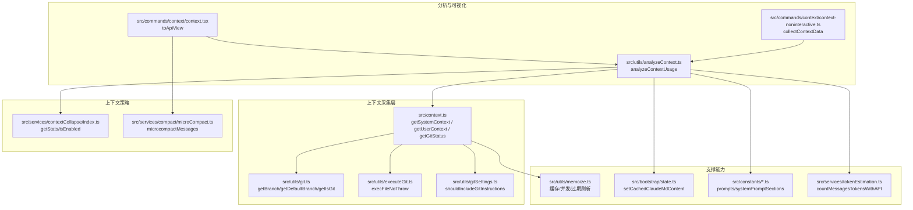
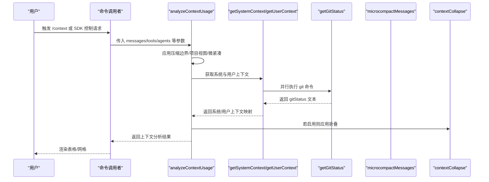
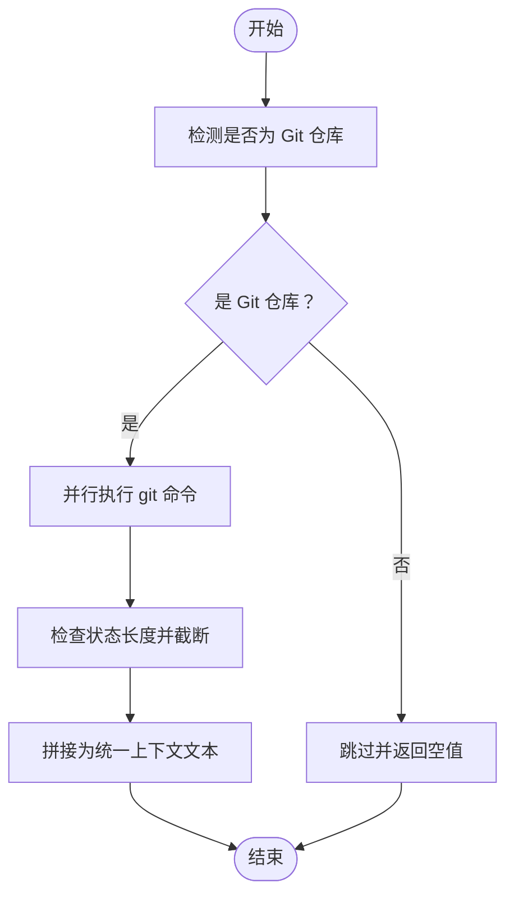
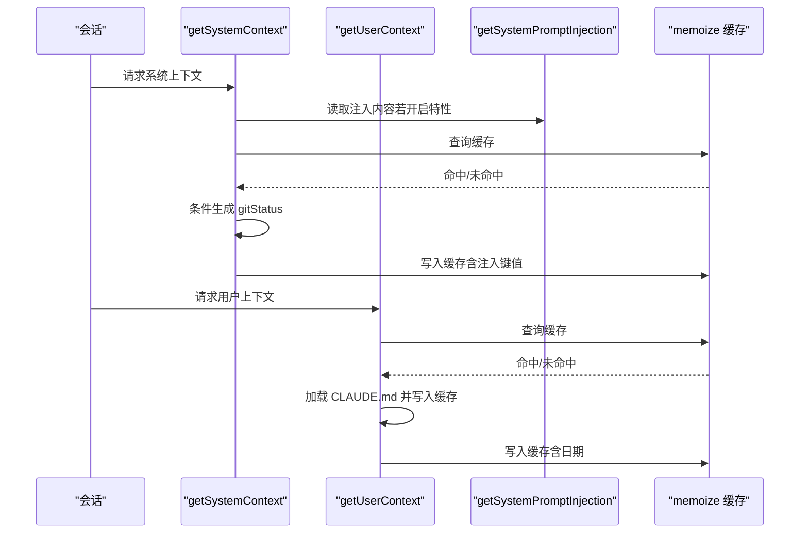
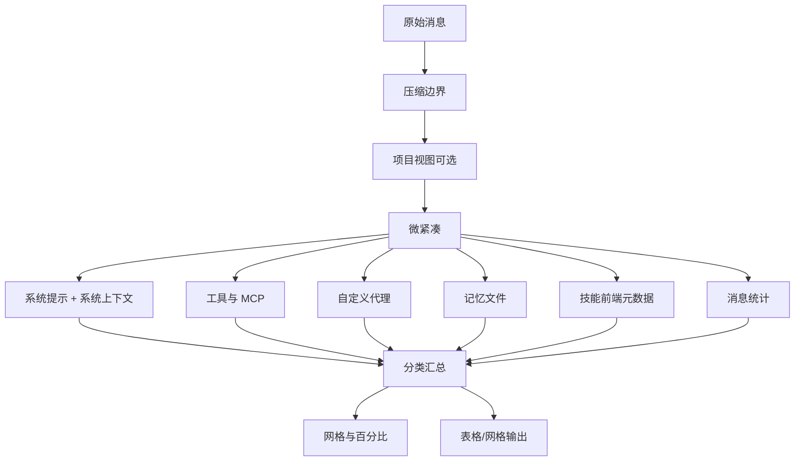
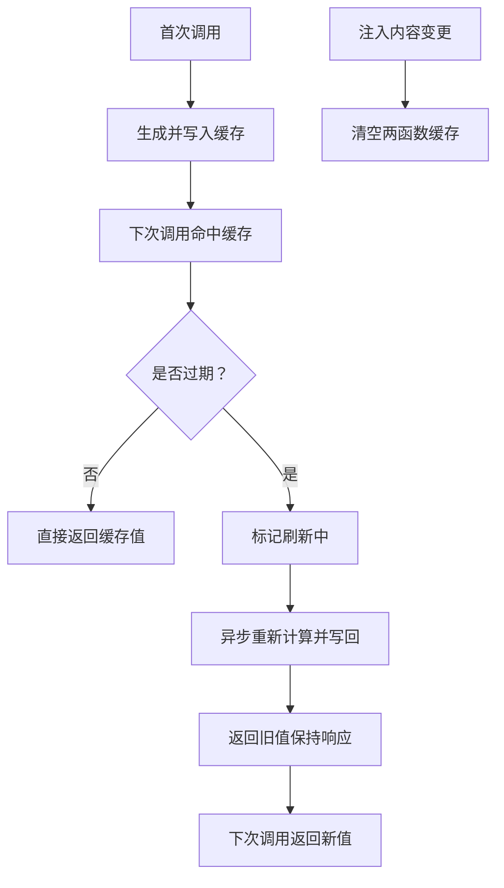
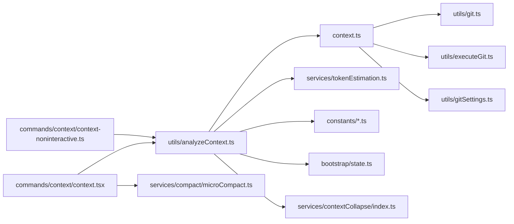

# 项目上下文

<cite>
**本文引用的文件**
- [src/context.ts](file://src/context.ts)
- [src/utils/analyzeContext.ts](file://src/utils/analyzeContext.ts)
- [src/commands/context/context-noninteractive.ts](file://src/commands/context/context-noninteractive.ts)
- [src/commands/context/context.tsx](file://src/commands/context/context.tsx)
- [src/services/contextCollapse/index.ts](file://src/services/contextCollapse/index.ts)
- [src/services/compact/microCompact.ts](file://src/services/compact/microCompact.ts)
- [src/utils/memoize.ts](file://src/utils/memoize.ts)
- [src/utils/executeGit.ts](file://src/utils/executeGit.ts)
- [src/utils/git.ts](file://src/utils/git.ts)
- [src/utils/gitSettings.ts](file://src/utils/gitSettings.ts)
- [src/bootstrap/state.ts](file://src/bootstrap/state.ts)
- [src/constants/systemPromptSections.ts](file://src/constants/systemPromptSections.ts)
- [src/constants/prompts.ts](file://src/constants/prompts.ts)
- [src/services/compact/autoCompact.ts](file://src/services/compact/autoCompact.ts)
- [src/services/tokenEstimation.ts](file://src/services/tokenEstimation.ts)
- [src/utils/systemPrompt.ts](file://src/utils/systemPrompt.ts)
- [src/utils/messages.ts](file://src/utils/messages.ts)
- [src/utils/claudemd.ts](file://src/utils/claudemd.ts)
- [src/utils/envUtils.ts](file://src/utils/envUtils.ts)
- [src/utils/diagLogs.ts](file://src/utils/diagLogs.ts)
- [src/utils/log.ts](file://src/utils/log.ts)
</cite>

## 目录
1. [引言](#引言)
2. [项目结构](#项目结构)
3. [核心组件](#核心组件)
4. [架构总览](#架构总览)
5. [详细组件分析](#详细组件分析)
6. [依赖关系分析](#依赖关系分析)
7. [性能考量](#性能考量)
8. [故障排查指南](#故障排查指南)
9. [结论](#结论)
10. [附录](#附录)

## 引言
本文件系统性阐述 Claude Code 的“项目上下文”体系：如何采集与组织 Git 状态、分支与最近提交、用户记忆文件（CLAUDE.md）以及日期等系统提示信息；如何通过 getSystemContext 与 getUserContext 提供可缓存的上下文片段；如何在对话中注入并影响 AI 的行为；以及上下文可视化工具与缓存失效策略。文档同时覆盖上下文的异步获取、并发去重、过期刷新与性能优化。

## 项目结构
围绕项目上下文的关键模块分布如下：
- 上下文采集与缓存：src/context.ts
- 上下文分析与可视化：src/utils/analyzeContext.ts、src/commands/context/context-noninteractive.ts、src/commands/context/context.tsx
- 上下文折叠与微紧凑：src/services/contextCollapse/index.ts、src/services/compact/microCompact.ts
- 工具与辅助：memoize 缓存、git 执行、环境变量与诊断日志等

**图表来源**
- [src/context.ts:1-190](file://src/context.ts#L1-L190)
- [src/utils/analyzeContext.ts:1-1386](file://src/utils/analyzeContext.ts#L1-L1386)
- [src/commands/context/context-noninteractive.ts:1-326](file://src/commands/context/context-noninteractive.ts#L1-L326)
- [src/commands/context/context.tsx:12-48](file://src/commands/context/context.tsx#L12-L48)
- [src/services/contextCollapse/index.ts:1-67](file://src/services/contextCollapse/index.ts#L1-L67)
- [src/services/compact/microCompact.ts:1-531](file://src/services/compact/microCompact.ts#L1-L531)
- [src/utils/memoize.ts:46-172](file://src/utils/memoize.ts#L46-L172)

**章节来源**
- [src/context.ts:1-190](file://src/context.ts#L1-L190)
- [src/utils/analyzeContext.ts:1-1386](file://src/utils/analyzeContext.ts#L1-L1386)
- [src/commands/context/context-noninteractive.ts:1-326](file://src/commands/context/context-noninteractive.ts#L1-L326)
- [src/commands/context/context.tsx:12-48](file://src/commands/context/context.tsx#L12-L48)
- [src/services/contextCollapse/index.ts:1-67](file://src/services/contextCollapse/index.ts#L1-L67)
- [src/services/compact/microCompact.ts:1-531](file://src/services/compact/microCompact.ts#L1-L531)
- [src/utils/memoize.ts:46-172](file://src/utils/memoize.ts#L46-L172)

## 核心组件
- getGitStatus：异步采集当前仓库的分支、主分支、状态摘要与最近提交，进行字符长度截断，返回固定格式字符串。失败时记录诊断日志并返回空值。
- getSystemContext：会话级缓存的系统上下文，按需包含 gitStatus 与可选的“缓存破坏注入”。当注入内容变化时，立即清空两个函数的缓存以强制刷新。
- getUserContext：会话级缓存的用户上下文，按配置加载 CLAUDE.md 记忆文件，写入缓存供自动模式分类器使用，并附加当前日期。
- analyzeContextUsage：综合统计系统提示、工具、MCP 工具、自定义代理、记忆文件、技能与消息等各部分的 token 占比与可视化网格，支持上下文折叠与微紧凑预处理。
- 上下文可视化命令：非交互式与交互式两种形式，前者输出 Markdown 表格，后者渲染彩色网格。

**章节来源**
- [src/context.ts:36-111](file://src/context.ts#L36-L111)
- [src/context.ts:116-190](file://src/context.ts#L116-L190)
- [src/utils/analyzeContext.ts:921-1386](file://src/utils/analyzeContext.ts#L921-L1386)
- [src/commands/context/context-noninteractive.ts:34-88](file://src/commands/context/context-noninteractive.ts#L34-L88)
- [src/commands/context/context.tsx:18-48](file://src/commands/context/context.tsx#L18-L48)

## 架构总览
项目上下文从“采集—缓存—注入—分析—可视化”的链路运行，关键点包括：
- 采集阶段：getGitStatus 并行执行多条 git 命令，避免阻塞；失败时降级为空值。
- 缓存阶段：getSystemContext 与 getUserContext 使用 memoize 包装，会话内复用；getSystemPromptInjection 变化时触发双向缓存清空。
- 注入阶段：analyzeContextUsage 在构建有效系统提示时合并系统上下文键值，作为模型输入的一部分。
- 分析阶段：上下文折叠与微紧凑在分析前对消息视图进行预处理，确保统计口径与模型实际看到的一致。
- 可视化阶段：命令将分析结果格式化为表格或网格，便于用户理解上下文占用情况。

**图表来源**
- [src/utils/analyzeContext.ts:34-77](file://src/utils/analyzeContext.ts#L34-L77)
- [src/context.ts:116-190](file://src/context.ts#L116-L190)
- [src/services/compact/microCompact.ts:253-293](file://src/services/compact/microCompact.ts#L253-L293)
- [src/services/contextCollapse/index.ts:30-67](file://src/services/contextCollapse/index.ts#L30-L67)

## 详细组件分析

### 组件一：Git 状态采集与注入（getGitStatus）
- 并行执行：分支、主分支、状态、最近提交、用户名等命令，减少等待时间。
- 截断策略：状态文本超过阈值时截断并提示使用 BashTool 查看完整状态。
- 失败处理：捕获异常并记录诊断日志，返回空值以避免中断流程。
- 会话注入：由 getSystemContext 条件注入到系统上下文中，作为模型输入的一部分。

**图表来源**
- [src/context.ts:36-111](file://src/context.ts#L36-L111)

**章节来源**
- [src/context.ts:36-111](file://src/context.ts#L36-L111)

### 组件二：系统上下文与用户上下文（getSystemContext / getUserContext）
- getSystemContext
  - 条件注入：远程模式或禁用 git 指令时跳过 gitStatus。
  - 缓存破坏注入：在特定特性开关下，将注入内容作为独立键值写入，用于缓存失效。
  - 会话级缓存：memoize 包装，整个会话生命周期复用。
- getUserContext
  - 禁用条件：显式禁用或裸模式且未指定额外目录时跳过 CLAUDE.md。
  - 内容加载：过滤注入的记忆文件后读取，写入缓存供自动模式分类器使用。
  - 时间戳：附加本地日期字符串，便于模型感知当前时间。

**图表来源**
- [src/context.ts:116-190](file://src/context.ts#L116-L190)
- [src/utils/memoize.ts:46-172](file://src/utils/memoize.ts#L46-L172)

**章节来源**
- [src/context.ts:116-190](file://src/context.ts#L116-L190)
- [src/utils/memoize.ts:46-172](file://src/utils/memoize.ts#L46-L172)

### 组件三：上下文分析与可视化（analyzeContextUsage）
- 预处理
  - 压缩边界：仅分析边界之后的消息。
  - 项目视图：在启用上下文折叠时应用 projectView。
  - 微紧凑：对消息进行微紧凑，移除或简化工具结果以降低 token 占用。
- 统计维度
  - 系统提示：有效系统提示与系统上下文键值。
  - 工具与 MCP：内置工具与 MCP 工具的 schema 估算与按类型拆分。
  - 自定义代理：按来源统计。
  - 记忆文件：CLAUDE.md 文件列表与 token 分配。
  - 技能：前端元数据估算，避免加载全部内容。
  - 消息：工具调用、结果、附件与文本的细粒度统计。
- 可视化
  - 网格：按模型上下文窗口计算方块数量，区分保留缓冲区与自由空间。
  - 表格：非交互式命令输出 Markdown 表格，包含各类 token 占比与错误统计。

**图表来源**
- [src/utils/analyzeContext.ts:34-77](file://src/utils/analyzeContext.ts#L34-L77)
- [src/services/compact/microCompact.ts:253-293](file://src/services/compact/microCompact.ts#L253-L293)
- [src/services/contextCollapse/index.ts:30-67](file://src/services/contextCollapse/index.ts#L30-L67)

**章节来源**
- [src/utils/analyzeContext.ts:921-1386](file://src/utils/analyzeContext.ts#L921-L1386)
- [src/commands/context/context-noninteractive.ts:34-88](file://src/commands/context/context-noninteractive.ts#L34-L88)
- [src/commands/context/context.tsx:18-48](file://src/commands/context/context.tsx#L18-L48)

### 组件四：缓存机制与失效策略
- 缓存实现
  - 基于 memoize 的通用缓存：支持缓存条目、过期时间、并发去重与后台刷新。
  - 后台刷新：过期但未被刷新时，返回旧值并异步更新，避免阻塞后续请求。
  - 并发去重：同一参数的并发请求共享同一挂起 Promise，避免重复计算。
- 失效策略
  - 注入内容变更：setSystemPromptInjection 调用后，立即清空 getUserContext 与 getSystemContext 的缓存，保证新注入生效。
  - 环境变量与特性开关：远程模式、禁用 git 指令、裸模式等条件影响上下文生成路径。
  - 诊断日志：记录 git 命令耗时、状态长度、失败原因等，便于定位问题。

**图表来源**
- [src/utils/memoize.ts:46-172](file://src/utils/memoize.ts#L46-L172)
- [src/context.ts:25-34](file://src/context.ts#L25-L34)

**章节来源**
- [src/utils/memoize.ts:46-172](file://src/utils/memoize.ts#L46-L172)
- [src/context.ts:25-34](file://src/context.ts#L25-L34)

### 组件五：上下文注入系统与缓存失效
- 注入入口：getSystemPromptInjection/setSystemPromptInjection 提供注入与清空能力。
- 注入用途：在 getSystemContext 中作为独立键值写入，形成“缓存破坏注入”，用于调试或特性切换。
- 失效联动：注入变更时，强制清空两个上下文函数的缓存，确保新注入立即生效。

**章节来源**
- [src/context.ts:25-34](file://src/context.ts#L25-L34)
- [src/context.ts:116-150](file://src/context.ts#L116-L150)

### 组件六：上下文可视化与命令
- 非交互式命令：collectContextData 收集并格式化输出，适合脚本与 SDK 使用。
- 交互式命令：context.tsx 将消息转换为 API 视图，应用微紧凑与折叠，渲染彩色网格。
- 输出内容：表格包含模型、token 总量、类别占比、MCP 工具、系统工具、代理、记忆文件、技能与消息细分；网格直观显示占用与保留缓冲。

**章节来源**
- [src/commands/context/context-noninteractive.ts:34-326](file://src/commands/context/context-noninteractive.ts#L34-L326)
- [src/commands/context/context.tsx:18-48](file://src/commands/context/context.tsx#L18-L48)

## 依赖关系分析
- 上下文采集依赖 git 工具与环境设置，失败时具备降级策略。
- 分析模块依赖 token 估算、系统提示构建、工具与代理定义、消息规范化等。
- 可视化模块依赖分析模块输出的数据结构，同时受上下文折叠与微紧凑影响。

**图表来源**
- [src/context.ts:1-190](file://src/context.ts#L1-L190)
- [src/utils/analyzeContext.ts:1-1386](file://src/utils/analyzeContext.ts#L1-L1386)
- [src/commands/context/context-noninteractive.ts:1-326](file://src/commands/context/context-noninteractive.ts#L1-L326)
- [src/commands/context/context.tsx:12-48](file://src/commands/context/context.tsx#L12-L48)
- [src/services/contextCollapse/index.ts:1-67](file://src/services/contextCollapse/index.ts#L1-L67)
- [src/services/compact/microCompact.ts:1-531](file://src/services/compact/microCompact.ts#L1-L531)

**章节来源**
- [src/context.ts:1-190](file://src/context.ts#L1-L190)
- [src/utils/analyzeContext.ts:1-1386](file://src/utils/analyzeContext.ts#L1-L1386)
- [src/commands/context/context-noninteractive.ts:1-326](file://src/commands/context/context-noninteractive.ts#L1-L326)
- [src/commands/context/context.tsx:12-48](file://src/commands/context/context.tsx#L12-L48)
- [src/services/contextCollapse/index.ts:1-67](file://src/services/contextCollapse/index.ts#L1-L67)
- [src/services/compact/microCompact.ts:1-531](file://src/services/compact/microCompact.ts#L1-L531)

## 性能考量
- 并行执行：git 命令并行，缩短等待时间。
- 缓存命中：会话内复用，避免重复 IO 与计算。
- 后台刷新：过期条目返回旧值，异步更新，提升吞吐。
- 并发去重：同一参数的并发请求共享计算，防止重复开销。
- 预处理一致性：微紧凑与上下文折叠在分析前应用，避免统计口径不一致导致的重复计算。
- 估算与降级：token 估算优先使用 API，失败时回退到近似估算，保证稳定性。

[本节为通用性能讨论，无需具体文件分析]

## 故障排查指南
- git 命令失败
  - 现象：返回空值，诊断日志记录错误。
  - 排查：确认工作区为 Git 仓库、权限与 PATH 正常、网络代理不影响 git。
  - 参考
    - [src/context.ts:104-110](file://src/context.ts#L104-L110)
    - [src/utils/diagLogs.ts:1-200](file://src/utils/diagLogs.ts#L1-L200)
- 缓存未刷新
  - 现象：注入内容变更后仍使用旧上下文。
  - 排查：确认 setSystemPromptInjection 是否调用、缓存清空逻辑是否生效。
  - 参考
    - [src/context.ts:25-34](file://src/context.ts#L25-L34)
    - [src/utils/memoize.ts:101-105](file://src/utils/memoize.ts#L101-L105)
- 上下文折叠/微紧凑异常
  - 现象：统计与模型实际输入不一致。
  - 排查：确认启用的特性开关、消息边界、微紧凑与折叠的应用顺序。
  - 参考
    - [src/utils/analyzeContext.ts:34-77](file://src/utils/analyzeContext.ts#L34-L77)
    - [src/services/compact/microCompact.ts:253-293](file://src/services/compact/microCompact.ts#L253-L293)
    - [src/services/contextCollapse/index.ts:30-67](file://src/services/contextCollapse/index.ts#L30-L67)

**章节来源**
- [src/context.ts:104-110](file://src/context.ts#L104-L110)
- [src/context.ts:25-34](file://src/context.ts#L25-L34)
- [src/utils/memoize.ts:101-105](file://src/utils/memoize.ts#L101-L105)
- [src/utils/analyzeContext.ts:34-77](file://src/utils/analyzeContext.ts#L34-L77)
- [src/services/compact/microCompact.ts:253-293](file://src/services/compact/microCompact.ts#L253-L293)
- [src/services/contextCollapse/index.ts:30-67](file://src/services/contextCollapse/index.ts#L30-L67)

## 结论
项目上下文系统通过“并行采集—会话缓存—条件注入—预处理一致性—可视化反馈”的闭环，既保证了上下文的实时性与准确性，又兼顾了性能与可观测性。getSystemContext 与 getUserContext 的缓存设计与失效策略，使得注入调试与动态特性切换成为可能；analyzeContextUsage 则提供了强大的分析与可视化能力，帮助用户理解与优化上下文占用。

[本节为总结性内容，无需具体文件分析]

## 附录

### 项目上下文配置选项与自定义
- 环境变量
  - CLAUDE_CODE_REMOTE：远程模式时跳过 gitStatus。
  - CLAUDE_CODE_DISABLE_CLAUDE_MDS：完全禁用 CLAUDE.md 自动发现。
  - CLAUDE_CODE_SIMPLE：简单模式下不统计 CLAUDE.md。
  - NODE_ENV：测试模式下 getGitStatus 直接返回空值。
  - CLAUDE_CODE_BARE_MODE：裸模式下仅加载显式添加的目录。
- 特性开关
  - BREAK_CACHE_COMMAND：启用缓存破坏注入功能。
  - CONTEXT_COLLAPSE：启用上下文折叠。
  - REACTIVE_COMPACT：启用响应式紧凑策略。
  - CACHED_MICROCOMPACT：启用缓存编辑型微紧凑。
- 自定义上下文处理器
  - 通过 setSystemPromptInjection 注入键值，配合 getSystemContext 的缓存破坏机制，实现临时性的上下文注入与失效。
  - 通过 getUserContext 的禁用条件与目录配置，控制记忆文件的加载范围。

**章节来源**
- [src/context.ts:124-128](file://src/context.ts#L124-L128)
- [src/context.ts:165-172](file://src/context.ts#L165-L172)
- [src/context.ts:25-34](file://src/context.ts#L25-L34)
- [src/utils/envUtils.ts:1-200](file://src/utils/envUtils.ts#L1-L200)

### 上下文在对话中的应用与影响
- 系统提示注入：gitStatus 与日期等上下文作为系统提示的一部分，影响模型对当前工作状态的理解。
- 工具与代理可见性：工具与代理的 schema 估算计入上下文，影响可用工具与代理的选择与调用。
- 记忆文件与技能：记忆文件与技能的前端元数据估算计入上下文，影响模型对知识库与技能可用性的判断。
- 可视化与建议：通过上下文可视化，用户可识别高占用类别并采取措施（如清理工具结果、调整技能范围），从而间接影响模型行为与成本。

**章节来源**
- [src/utils/analyzeContext.ts:272-318](file://src/utils/analyzeContext.ts#L272-L318)
- [src/utils/analyzeContext.ts:921-1386](file://src/utils/analyzeContext.ts#L921-L1386)
- [src/commands/context/context-noninteractive.ts:90-326](file://src/commands/context/context-noninteractive.ts#L90-L326)