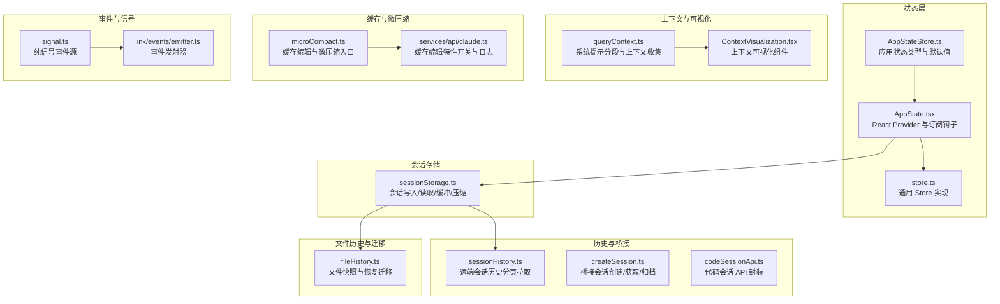
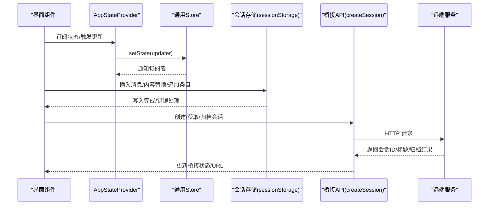
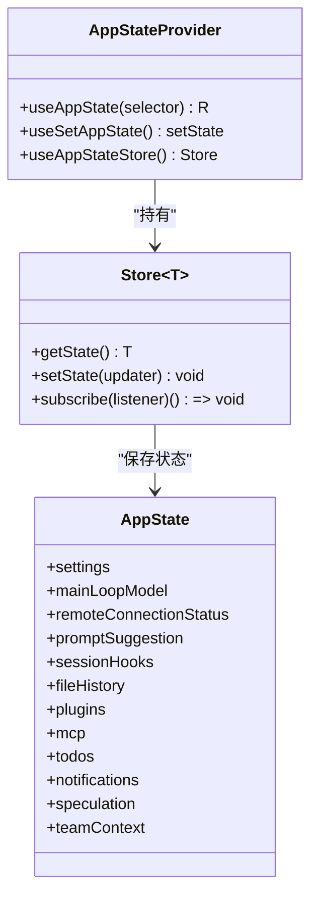
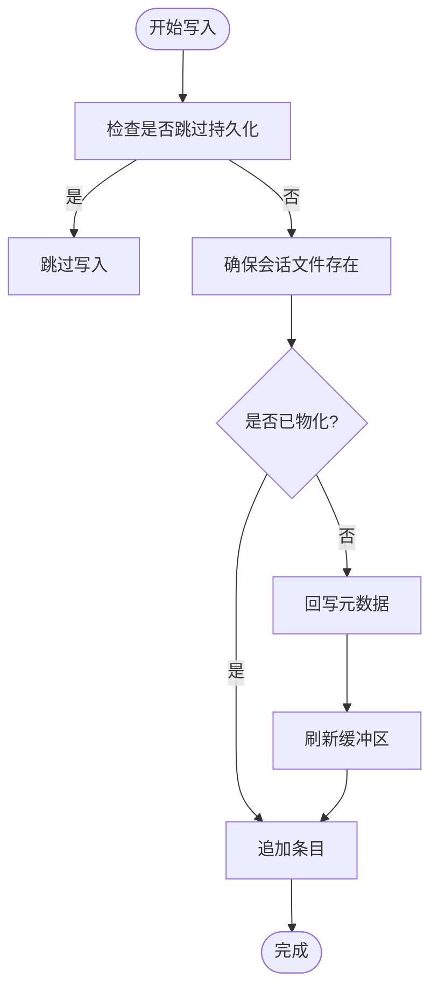
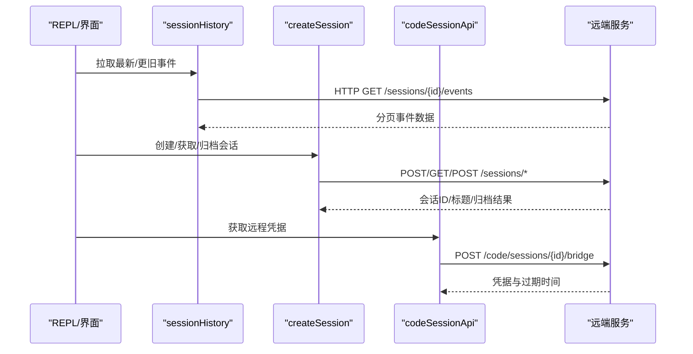
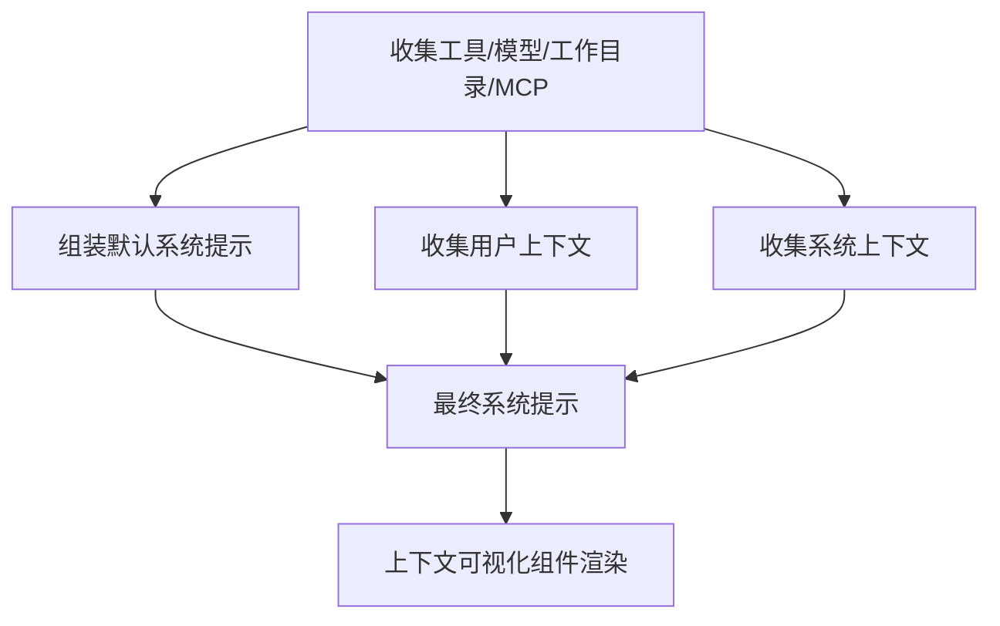
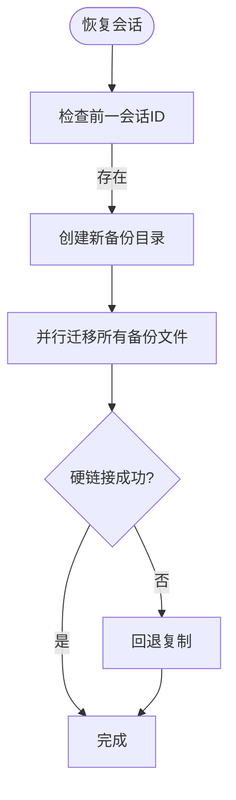
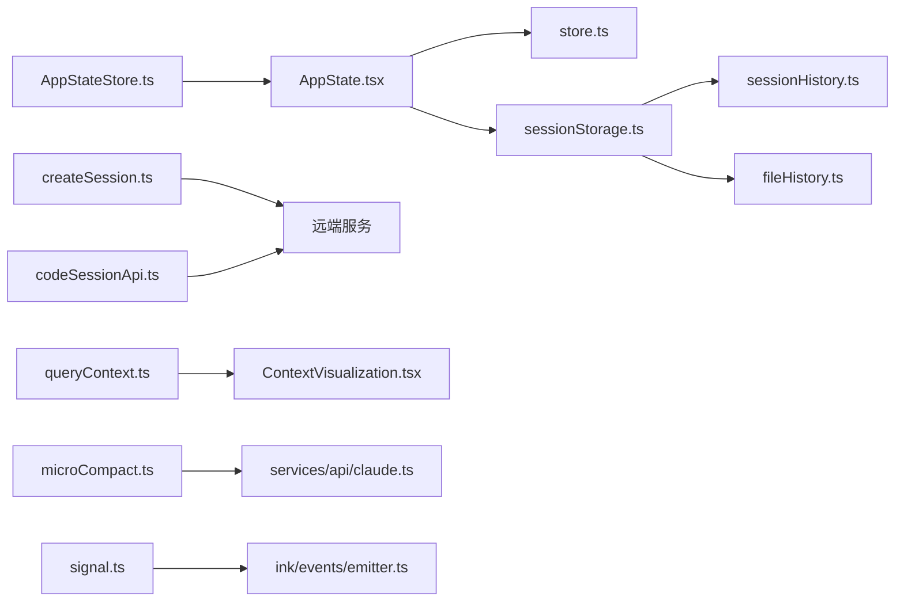

# 会话与状态管理

<cite>
**本文引用的文件**
- [src/state/AppStateStore.ts](file://src/state/AppStateStore.ts)
- [src/state/AppState.tsx](file://src/state/AppState.tsx)
- [src/state/store.ts](file://src/state/store.ts)
- [src/utils/sessionStorage.ts](file://src/utils/sessionStorage.ts)
- [src/assistant/sessionHistory.ts](file://src/assistant/sessionHistory.ts)
- [src/bridge/createSession.ts](file://src/bridge/createSession.ts)
- [src/bridge/codeSessionApi.ts](file://src/bridge/codeSessionApi.ts)
- [src/utils/hooks/sessionHooks.ts](file://src/utils/hooks/sessionHooks.ts)
- [src/utils/queryContext.ts](file://src/utils/queryContext.ts)
- [src/components/ContextVisualization.tsx](file://src/components/ContextVisualization.tsx)
- [src/screens/REPL.tsx](file://src/screens/REPL.tsx)
- [src/utils/fileHistory.ts](file://src/utils/fileHistory.ts)
- [src/services/compact/microCompact.ts](file://src/services/compact/microCompact.ts)
- [src/services/api/claude.ts](file://src/services/api/claude.ts)
- [src/utils/signal.ts](file://src/utils/signal.ts)
- [src/ink/events/emitter.ts](file://src/ink/events/emitter.ts)
</cite>

## 目录
1. [简介](#简介)
2. [项目结构](#项目结构)
3. [核心组件](#核心组件)
4. [架构总览](#架构总览)
5. [详细组件分析](#详细组件分析)
6. [依赖关系分析](#依赖关系分析)
7. [性能考量](#性能考量)
8. [故障排查指南](#故障排查指南)
9. [结论](#结论)
10. [附录](#附录)

## 简介
本文件面向 Claude Code 的“会话与状态管理”主题，系统性梳理会话生命周期、状态持久化与历史记录机制；深入说明上下文管理、项目上下文与系统提示的实现；覆盖会话恢复、跨设备同步与数据迁移；并给出状态存储策略、缓存机制与性能优化建议，展示会话管理 API、事件监听与状态订阅，以及内存管理、垃圾回收与资源清理的最佳实践。

## 项目结构
围绕会话与状态管理的关键目录与文件包括：
- 状态层：应用状态定义与 React Provider、通用 Store 实现
- 会话存储：本地 JSONL 会话文件写入、缓冲、压缩与读取
- 历史与桥接：远端会话历史拉取、桥接会话创建与归档
- 上下文与可视化：系统提示分段、用户/系统上下文、上下文可视化
- 文件历史与迁移：文件快照跟踪、恢复时的备份迁移
- 缓存与微压缩：缓存编辑与微压缩以降低上下文成本
- 事件与信号：事件发射器与纯信号（无状态）事件源

**图表来源**
- [src/state/AppStateStore.ts:89-452](file://src/state/AppStateStore.ts#L89-L452)
- [src/state/AppState.tsx:37-109](file://src/state/AppState.tsx#L37-L109)
- [src/state/store.ts:10-34](file://src/state/store.ts#L10-L34)
- [src/utils/sessionStorage.ts:972-1156](file://src/utils/sessionStorage.ts#L972-L1156)
- [src/assistant/sessionHistory.ts:45-87](file://src/assistant/sessionHistory.ts#L45-L87)
- [src/bridge/createSession.ts:34-180](file://src/bridge/createSession.ts#L34-L180)
- [src/bridge/codeSessionApi.ts:26-80](file://src/bridge/codeSessionApi.ts#L26-L80)
- [src/utils/queryContext.ts:44-74](file://src/utils/queryContext.ts#L44-L74)
- [src/components/ContextVisualization.tsx:105-134](file://src/components/ContextVisualization.tsx#L105-L134)
- [src/utils/fileHistory.ts:970-1010](file://src/utils/fileHistory.ts#L970-L1010)
- [src/services/compact/microCompact.ts:88-118](file://src/services/compact/microCompact.ts#L88-L118)
- [src/services/api/claude.ts:1185-1206](file://src/services/api/claude.ts#L1185-L1206)
- [src/utils/signal.ts:27-43](file://src/utils/signal.ts#L27-L43)
- [src/ink/events/emitter.ts:1-39](file://src/ink/events/emitter.ts#L1-L39)

**章节来源**
- [src/state/AppStateStore.ts:89-452](file://src/state/AppStateStore.ts#L89-L452)
- [src/state/AppState.tsx:37-109](file://src/state/AppState.tsx#L37-L109)
- [src/state/store.ts:10-34](file://src/state/store.ts#L10-L34)
- [src/utils/sessionStorage.ts:972-1156](file://src/utils/sessionStorage.ts#L972-L1156)
- [src/assistant/sessionHistory.ts:45-87](file://src/assistant/sessionHistory.ts#L45-L87)
- [src/bridge/createSession.ts:34-180](file://src/bridge/createSession.ts#L34-L180)
- [src/bridge/codeSessionApi.ts:26-80](file://src/bridge/codeSessionApi.ts#L26-L80)
- [src/utils/queryContext.ts:44-74](file://src/utils/queryContext.ts#L44-L74)
- [src/components/ContextVisualization.tsx:105-134](file://src/components/ContextVisualization.tsx#L105-L134)
- [src/utils/fileHistory.ts:970-1010](file://src/utils/fileHistory.ts#L970-L1010)
- [src/services/compact/microCompact.ts:88-118](file://src/services/compact/microCompact.ts#L88-L118)
- [src/services/api/claude.ts:1185-1206](file://src/services/api/claude.ts#L1185-L1206)
- [src/utils/signal.ts:27-43](file://src/utils/signal.ts#L27-L43)
- [src/ink/events/emitter.ts:1-39](file://src/ink/events/emitter.ts#L1-L39)

## 核心组件
- 应用状态模型与默认值：定义完整的 AppState 结构、字段含义与默认值，涵盖设置、任务、插件、MCP、通知、权限、推测、团队上下文等。
- React Provider 与订阅钩子：提供状态读取、写入与订阅能力，支持按选择器精确订阅，避免不必要重渲染。
- 通用 Store：统一的状态容器，提供 setState、subscribe、onChange 回调，内部通过 Object.is 判断变更以减少监听开销。
- 会话存储：负责会话文件的创建、消息链插入、内容替换、条目追加、元数据回写、消息集合缓存与清理。
- 远端历史与桥接：提供会话历史分页拉取、桥接会话创建/获取/归档、代码会话 API 调用与凭据获取。
- 上下文与可视化：系统提示分段获取、用户/系统上下文收集，并在 UI 中进行可视化展示。
- 文件历史与迁移：在会话恢复时迁移文件备份，确保文件历史在不同会话间延续。
- 缓存与微压缩：通过缓存编辑与微压缩减少上下文占用，提升长对话效率。
- 事件与信号：提供纯事件信号与事件发射器，支持停止冒泡的事件流。

**章节来源**
- [src/state/AppStateStore.ts:89-452](file://src/state/AppStateStore.ts#L89-L452)
- [src/state/AppState.tsx:142-172](file://src/state/AppState.tsx#L142-L172)
- [src/state/store.ts:10-34](file://src/state/store.ts#L10-L34)
- [src/utils/sessionStorage.ts:972-1156](file://src/utils/sessionStorage.ts#L972-L1156)
- [src/assistant/sessionHistory.ts:45-87](file://src/assistant/sessionHistory.ts#L45-L87)
- [src/bridge/createSession.ts:34-180](file://src/bridge/createSession.ts#L34-L180)
- [src/bridge/codeSessionApi.ts:26-80](file://src/bridge/codeSessionApi.ts#L26-L80)
- [src/utils/queryContext.ts:44-74](file://src/utils/queryContext.ts#L44-L74)
- [src/components/ContextVisualization.tsx:105-134](file://src/components/ContextVisualization.tsx#L105-L134)
- [src/utils/fileHistory.ts:970-1010](file://src/utils/fileHistory.ts#L970-L1010)
- [src/services/compact/microCompact.ts:88-118](file://src/services/compact/microCompact.ts#L88-L118)
- [src/utils/signal.ts:27-43](file://src/utils/signal.ts#L27-L43)
- [src/ink/events/emitter.ts:1-39](file://src/ink/events/emitter.ts#L1-L39)

## 架构总览
下图展示了从 UI 到状态、存储与远端服务的整体交互路径，强调会话生命周期中的关键节点：创建、写入、恢复、归档与历史拉取。

**图表来源**
- [src/state/AppState.tsx:142-172](file://src/state/AppState.tsx#L142-L172)
- [src/state/store.ts:10-34](file://src/state/store.ts#L10-L34)
- [src/utils/sessionStorage.ts:972-1156](file://src/utils/sessionStorage.ts#L972-L1156)
- [src/bridge/createSession.ts:34-180](file://src/bridge/createSession.ts#L34-L180)
- [src/assistant/sessionHistory.ts:73-87](file://src/assistant/sessionHistory.ts#L73-L87)

## 详细组件分析

### 应用状态模型与订阅
- AppState 定义了丰富的会话相关字段，如 mainLoopModel、remote* 桥接状态、promptSuggestion、sessionHooks、fileHistory 等。
- AppStateProvider 提供 React 上下文，使用 useSyncExternalStore 订阅状态变化，避免不必要的重渲染。
- Store 实现提供 setState、subscribe 与 onChange 回调，内部通过 Object.is 判断是否真正变更，从而减少监听器触发。

**图表来源**
- [src/state/AppStateStore.ts:89-452](file://src/state/AppStateStore.ts#L89-L452)
- [src/state/store.ts:10-34](file://src/state/store.ts#L10-L34)
- [src/state/AppState.tsx:142-179](file://src/state/AppState.tsx#L142-L179)

**章节来源**
- [src/state/AppStateStore.ts:89-452](file://src/state/AppStateStore.ts#L89-L452)
- [src/state/AppState.tsx:142-179](file://src/state/AppState.tsx#L142-L179)
- [src/state/store.ts:10-34](file://src/state/store.ts#L10-L34)

### 会话存储与持久化
- 条目写入与缓冲：首次用户/助手消息会“物化”会话文件，之前的消息先缓冲，随后批量写入，避免空文件产生。
- 元数据回写：在物化阶段同时回写模式与代理设置等缓存元数据。
- 追加条目：根据当前会话或指定会话决定写入目标，若目标不存在则报错；支持内容替换与消息链插入。
- 缓存与清理：对消息集合进行 memoized 缓存，提供清理接口以在压缩后失效缓存。

**图表来源**
- [src/utils/sessionStorage.ts:972-1156](file://src/utils/sessionStorage.ts#L972-L1156)
- [src/utils/sessionStorage.ts:3843-3857](file://src/utils/sessionStorage.ts#L3843-L3857)

**章节来源**
- [src/utils/sessionStorage.ts:972-1156](file://src/utils/sessionStorage.ts#L972-L1156)
- [src/utils/sessionStorage.ts:3843-3857](file://src/utils/sessionStorage.ts#L3843-L3857)

### 会话恢复与跨设备同步
- 远端历史拉取：通过 OAuth 头与组织 UUID 拉取会话事件，支持“最新页”和“更旧页”的分页查询。
- 桥接会话：创建/获取/归档桥接会话，支持标题更新与兼容会话 ID 转换。
- 代码会话：通过独立 API 获取远程凭据，含 worker_epoch 与过期时间等信息。
- 会话恢复：在 REPL 中保存/恢复模式与成本状态，便于跨设备一致体验。

**图表来源**
- [src/assistant/sessionHistory.ts:73-87](file://src/assistant/sessionHistory.ts#L73-L87)
- [src/bridge/createSession.ts:34-180](file://src/bridge/createSession.ts#L34-L180)
- [src/bridge/codeSessionApi.ts:93-168](file://src/bridge/codeSessionApi.ts#L93-L168)
- [src/screens/REPL.tsx:1898-1914](file://src/screens/REPL.tsx#L1898-L1914)

**章节来源**
- [src/assistant/sessionHistory.ts:45-87](file://src/assistant/sessionHistory.ts#L45-L87)
- [src/bridge/createSession.ts:34-180](file://src/bridge/createSession.ts#L34-L180)
- [src/bridge/codeSessionApi.ts:93-168](file://src/bridge/codeSessionApi.ts#L93-L168)
- [src/screens/REPL.tsx:1898-1914](file://src/screens/REPL.tsx#L1898-L1914)

### 上下文管理、项目上下文与系统提示
- 系统提示分段：从工具、主循环模型、附加工作目录与 MCP 客户端中组装默认系统提示与用户/系统上下文，支持自定义系统提示覆盖。
- 上下文可视化：按来源分组并排序，直观展示各类上下文的 token 占比与组成。
- 会话钩子：临时会话级钩子（命令/提示），仅内存存储并在会话结束时清理，支持函数型钩子与匹配器。

**图表来源**
- [src/utils/queryContext.ts:44-74](file://src/utils/queryContext.ts#L44-L74)
- [src/components/ContextVisualization.tsx:105-134](file://src/components/ContextVisualization.tsx#L105-L134)
- [src/utils/hooks/sessionHooks.ts:68-86](file://src/utils/hooks/sessionHooks.ts#L68-L86)

**章节来源**
- [src/utils/queryContext.ts:44-74](file://src/utils/queryContext.ts#L44-L74)
- [src/components/ContextVisualization.tsx:105-134](file://src/components/ContextVisualization.tsx#L105-L134)
- [src/utils/hooks/sessionHooks.ts:68-86](file://src/utils/hooks/sessionHooks.ts#L68-L86)

### 文件历史与数据迁移
- 快照跟踪：在会话恢复时，将前一会话的备份文件迁移到当前会话目录，优先硬链接，失败则回退复制。
- 首版本查找：在回滚到目标备份点时，定位文件的首个版本备份名称。
- 路径短化/扩展：为减少存储空间，相对路径作为键；必要时扩展为绝对路径。

**图表来源**
- [src/utils/fileHistory.ts:970-1010](file://src/utils/fileHistory.ts#L970-L1010)

**章节来源**
- [src/utils/fileHistory.ts:970-1010](file://src/utils/fileHistory.ts#L970-L1010)

### 缓存机制与性能优化
- 缓存编辑与微压缩：在主线程且模型受支持的情况下启用缓存编辑与微压缩，减少重复计算与上下文体积。
- 特性开关与日志：通过特性门控与日志输出控制缓存编辑的启用与模型支持情况。
- 会话统计批处理：扫描会话文件时采用批次并行处理，提升大目录下的统计性能。

**章节来源**
- [src/services/compact/microCompact.ts:88-118](file://src/services/compact/microCompact.ts#L88-L118)
- [src/services/api/claude.ts:1185-1206](file://src/services/api/claude.ts#L1185-L1206)
- [src/utils/stats.ts:137-166](file://src/utils/stats.ts#L137-L166)

### 事件监听与状态订阅
- 纯信号事件源：用于“发生了什么”而不关心“当前值”的场景，避免状态快照带来的额外开销。
- 事件发射器：基于 Node EventEmitter，尊重 stopImmediatePropagation，适合复杂 UI 事件流。
- 状态订阅：useAppState 支持按选择器订阅，避免返回新对象导致的恒真变更判断。

**章节来源**
- [src/utils/signal.ts:27-43](file://src/utils/signal.ts#L27-L43)
- [src/ink/events/emitter.ts:1-39](file://src/ink/events/emitter.ts#L1-L39)
- [src/state/AppState.tsx:142-172](file://src/state/AppState.tsx#L142-L172)

## 依赖关系分析
- 组件耦合与内聚：状态层与存储层低耦合，通过 Store 抽象连接；会话存储与桥接 API 各自独立，通过会话 ID 关联。
- 外部依赖：HTTP 客户端（axios）、文件系统操作、特性门控（feature）、日志与诊断工具。
- 可能的循环依赖：状态模型与 Provider 之间通过类型导入，避免运行时循环；会话存储与文件历史模块通过工具函数解耦。

**图表来源**
- [src/state/AppStateStore.ts:89-452](file://src/state/AppStateStore.ts#L89-L452)
- [src/state/AppState.tsx:37-109](file://src/state/AppState.tsx#L37-L109)
- [src/state/store.ts:10-34](file://src/state/store.ts#L10-L34)
- [src/utils/sessionStorage.ts:972-1156](file://src/utils/sessionStorage.ts#L972-L1156)
- [src/assistant/sessionHistory.ts:45-87](file://src/assistant/sessionHistory.ts#L45-L87)
- [src/bridge/createSession.ts:34-180](file://src/bridge/createSession.ts#L34-L180)
- [src/bridge/codeSessionApi.ts:26-80](file://src/bridge/codeSessionApi.ts#L26-L80)
- [src/utils/queryContext.ts:44-74](file://src/utils/queryContext.ts#L44-L74)
- [src/components/ContextVisualization.tsx:105-134](file://src/components/ContextVisualization.tsx#L105-L134)
- [src/utils/fileHistory.ts:970-1010](file://src/utils/fileHistory.ts#L970-L1010)
- [src/services/compact/microCompact.ts:88-118](file://src/services/compact/microCompact.ts#L88-L118)
- [src/services/api/claude.ts:1185-1206](file://src/services/api/claude.ts#L1185-L1206)
- [src/utils/signal.ts:27-43](file://src/utils/signal.ts#L27-L43)
- [src/ink/events/emitter.ts:1-39](file://src/ink/events/emitter.ts#L1-L39)

**章节来源**
- [src/state/AppStateStore.ts:89-452](file://src/state/AppStateStore.ts#L89-L452)
- [src/state/AppState.tsx:37-109](file://src/state/AppState.tsx#L37-L109)
- [src/state/store.ts:10-34](file://src/state/store.ts#L10-L34)
- [src/utils/sessionStorage.ts:972-1156](file://src/utils/sessionStorage.ts#L972-L1156)
- [src/assistant/sessionHistory.ts:45-87](file://src/assistant/sessionHistory.ts#L45-L87)
- [src/bridge/createSession.ts:34-180](file://src/bridge/createSession.ts#L34-L180)
- [src/bridge/codeSessionApi.ts:26-80](file://src/bridge/codeSessionApi.ts#L26-L80)
- [src/utils/queryContext.ts:44-74](file://src/utils/queryContext.ts#L44-L74)
- [src/components/ContextVisualization.tsx:105-134](file://src/components/ContextVisualization.tsx#L105-L134)
- [src/utils/fileHistory.ts:970-1010](file://src/utils/fileHistory.ts#L970-L1010)
- [src/services/compact/microCompact.ts:88-118](file://src/services/compact/microCompact.ts#L88-L118)
- [src/services/api/claude.ts:1185-1206](file://src/services/api/claude.ts#L1185-L1206)
- [src/utils/signal.ts:27-43](file://src/utils/signal.ts#L27-L43)
- [src/ink/events/emitter.ts:1-39](file://src/ink/events/emitter.ts#L1-L39)

## 性能考量
- 写入路径优化：首次用户/助手消息物化文件，批量刷新缓冲，避免频繁 IO。
- 并行批处理：扫描会话文件时采用批次并行，降低大目录统计时间。
- 缓存与微压缩：启用缓存编辑与微压缩减少上下文体积，提升长对话吞吐。
- 订阅优化：useAppState 使用选择器与 Object.is 判等，避免不必要重渲染。
- 事件系统：纯信号与事件发射器减少状态快照与监听器数量，降低内存与 CPU 开销。

[本节为通用性能指导，无需特定文件分析]

## 故障排查指南
- 会话创建失败：检查访问令牌、组织 UUID 与请求头；查看错误详情与状态码。
- 会话归档异常：归档为尽力而为，网络错误与 5xx 会抛出；可在调用站点捕获处理。
- 会话历史拉取失败：确认认证上下文与超时设置；检查分页参数与返回结构。
- 文件历史迁移失败：硬链接失败时回退复制；检查源备份是否存在与权限。
- 缓存编辑未生效：确认特性门控开启、模型受支持、且处于主线程来源。

**章节来源**
- [src/bridge/createSession.ts:152-177](file://src/bridge/createSession.ts#L152-L177)
- [src/bridge/createSession.ts:270-317](file://src/bridge/createSession.ts#L270-L317)
- [src/assistant/sessionHistory.ts:45-87](file://src/assistant/sessionHistory.ts#L45-L87)
- [src/utils/fileHistory.ts:978-1010](file://src/utils/fileHistory.ts#L978-L1010)
- [src/services/api/claude.ts:1185-1206](file://src/services/api/claude.ts#L1185-L1206)

## 结论
Claude Code 的会话与状态管理以 AppState 为核心，结合通用 Store 与会话存储实现高内聚、低耦合的架构。通过会话物化、缓冲与批处理优化写入性能；借助远端历史与桥接 API 支持跨设备同步；利用缓存编辑与微压缩降低上下文成本；并通过事件与信号系统提供灵活的异步通知机制。整体设计兼顾易用性与可维护性，适合在多平台与多设备场景下稳定运行。

[本节为总结性内容，无需特定文件分析]

## 附录
- 最佳实践
  - 在首次用户/助手消息时才物化会话文件，避免空文件。
  - 对高频状态更新使用选择器订阅，避免返回新对象。
  - 在会话恢复时迁移文件历史备份，确保一致性。
  - 启用缓存编辑与微压缩以降低上下文成本，但需确保模型与特性支持。
  - 使用纯信号处理“发生”类事件，事件发射器处理复杂 UI 流程。
- 示例参考
  - 会话写入流程参考：[会话存储写入与缓冲:972-1156](file://src/utils/sessionStorage.ts#L972-L1156)
  - 会话历史拉取参考：[历史分页拉取:73-87](file://src/assistant/sessionHistory.ts#L73-L87)
  - 桥接会话管理参考：[创建/获取/归档:34-180](file://src/bridge/createSession.ts#L34-L180)
  - 代码会话凭据参考：[凭据获取:93-168](file://src/bridge/codeSessionApi.ts#L93-L168)
  - 上下文组装与可视化参考：[系统提示分段:44-74](file://src/utils/queryContext.ts#L44-L74)、[可视化组件:105-134](file://src/components/ContextVisualization.tsx#L105-L134)
  - 文件历史迁移参考：[备份迁移:970-1010](file://src/utils/fileHistory.ts#L970-L1010)
  - 缓存编辑与微压缩参考：[消费与固定:88-118](file://src/services/compact/microCompact.ts#L88-L118)、[特性开关:1185-1206](file://src/services/api/claude.ts#L1185-L1206)
  - 事件与信号参考：[纯信号:27-43](file://src/utils/signal.ts#L27-L43)、[事件发射器:1-39](file://src/ink/events/emitter.ts#L1-L39)