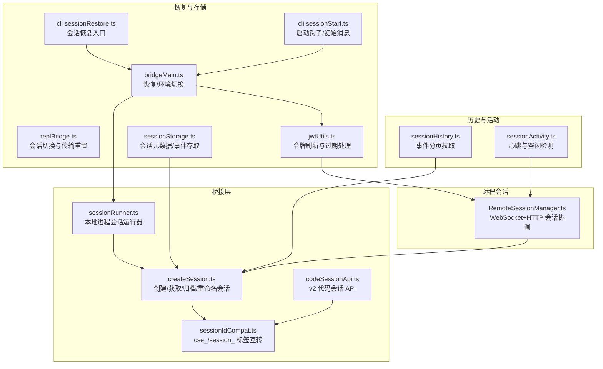
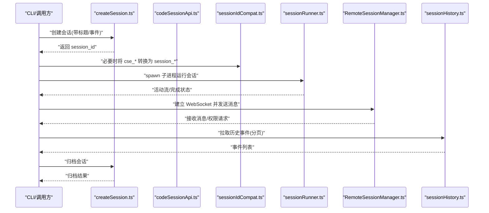
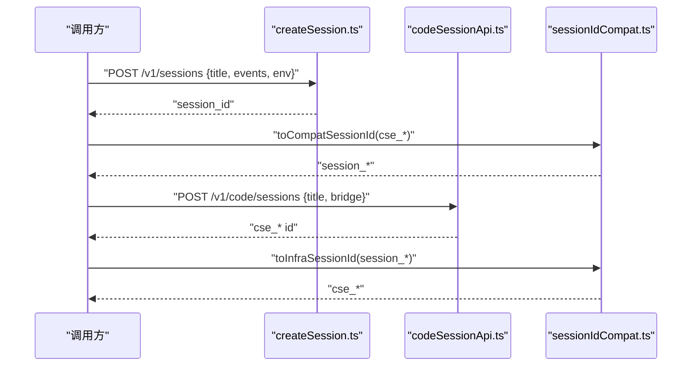
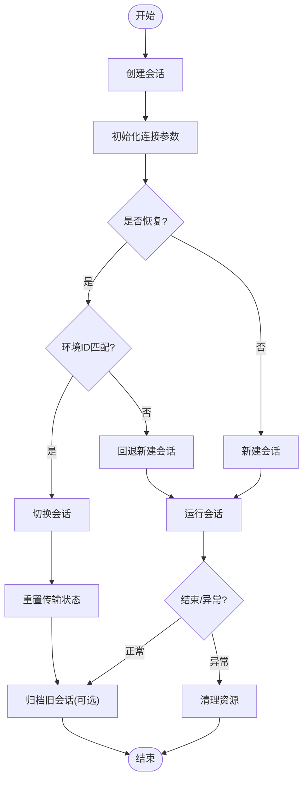
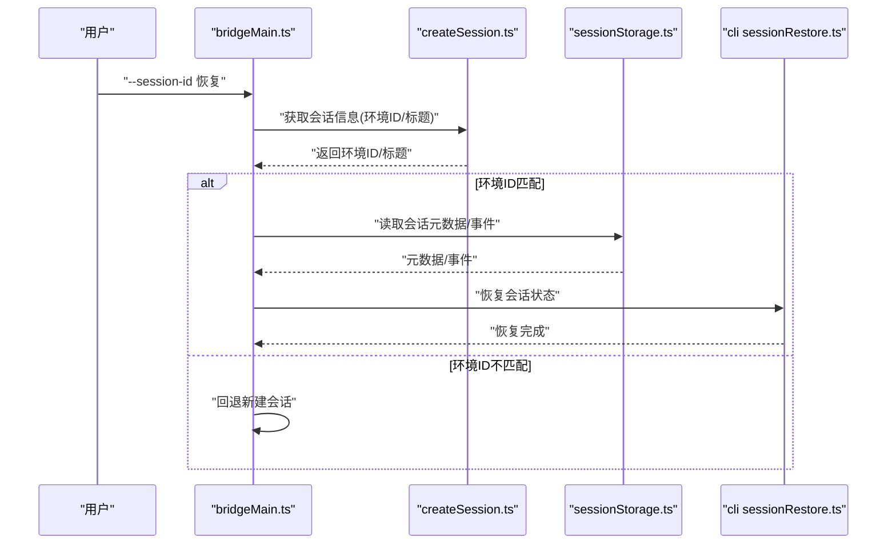
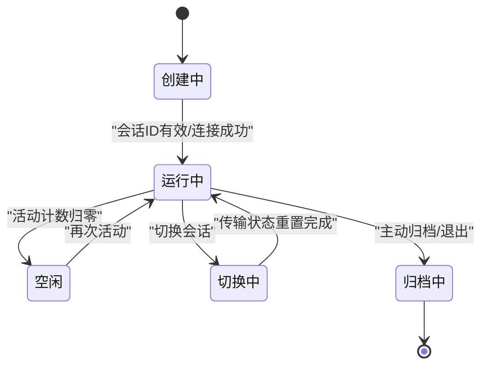
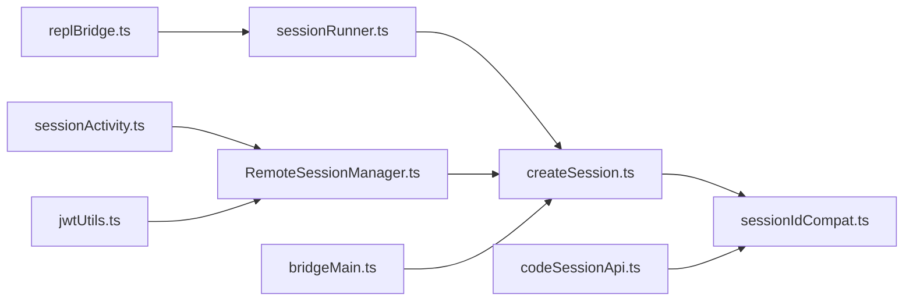

# 会话生命周期管理

<cite>
**本文引用的文件**
- [src/bridge/createSession.ts](file://src/bridge/createSession.ts)
- [src/bridge/codeSessionApi.ts](file://src/bridge/codeSessionApi.ts)
- [src/bridge/sessionIdCompat.ts](file://src/bridge/sessionIdCompat.ts)
- [src/bridge/sessionRunner.ts](file://src/bridge/sessionRunner.ts)
- [src/remote/RemoteSessionManager.ts](file://src/remote/RemoteSessionManager.ts)
- [src/assistant/sessionHistory.ts](file://src/assistant/sessionHistory.ts)
- [src/utils/sessionActivity.ts](file://src/utils/sessionActivity.ts)
- [src/bridge/jwtUtils.ts](file://src/bridge/jwtUtils.ts)
- [src/bridge/replBridge.ts](file://src/bridge/replBridge.ts)
- [src/bridge/bridgeMain.ts](file://src/bridge/bridgeMain.ts)
- [src/bridge/sessionStorage.ts](file://src/bridge/sessionStorage.ts)
- [src/cli/src/utils/sessionRestore.ts](file://src/cli/src/utils/sessionRestore.ts)
- [src/cli/src/utils/sessionStart.ts](file://src/cli/src/utils/sessionStart.ts)
- [src/bridge/sessionDiscovery.ts](file://src/assistant/sessionDiscovery.ts)
- [src/server/sessionManager.ts](file://src/server/sessionManager.ts)
</cite>

## 目录
1. [引言](#引言)
2. [项目结构](#项目结构)
3. [核心组件](#核心组件)
4. [架构总览](#架构总览)
5. [详细组件分析](#详细组件分析)
6. [依赖分析](#依赖分析)
7. [性能考虑](#性能考虑)
8. [故障排查指南](#故障排查指南)
9. [结论](#结论)
10. [附录](#附录)

## 引言
本文件系统性梳理 Claude Code 的会话生命周期管理，覆盖会话创建、激活、切换与销毁的完整流程；解释会话 ID 生成与兼容机制、会话状态初始化与切换逻辑；阐述会话持久化策略、会话恢复与清理流程；给出会话状态转换图与关键状态变更点；并提供会话管理 API 使用示例（如 switchSession、regenerateSessionId 等），说明会话继承关系与父子会话管理，以及会话超时处理、异常恢复与错误处理机制。

## 项目结构
围绕会话生命周期的关键模块分布于桥接层、远程会话管理、历史检索与活动跟踪等子系统中。下图概览主要文件与其职责：

图表来源
- [src/bridge/createSession.ts:1-385](file://src/bridge/createSession.ts#L1-L385)
- [src/bridge/codeSessionApi.ts:1-169](file://src/bridge/codeSessionApi.ts#L1-L169)
- [src/bridge/sessionIdCompat.ts:1-58](file://src/bridge/sessionIdCompat.ts#L1-L58)
- [src/bridge/sessionRunner.ts:1-551](file://src/bridge/sessionRunner.ts#L1-L551)
- [src/remote/RemoteSessionManager.ts:1-345](file://src/remote/RemoteSessionManager.ts#L1-L345)
- [src/assistant/sessionHistory.ts:1-88](file://src/assistant/sessionHistory.ts#L1-L88)
- [src/utils/sessionActivity.ts:1-134](file://src/utils/sessionActivity.ts#L1-L134)
- [src/bridge/jwtUtils.ts:165-183](file://src/bridge/jwtUtils.ts#L165-L183)
- [src/bridge/replBridge.ts:788-809](file://src/bridge/replBridge.ts#L788-L809)
- [src/bridge/bridgeMain.ts:2469-2492](file://src/bridge/bridgeMain.ts#L2469-L2492)
- [src/bridge/sessionStorage.ts:1-12](file://src/bridge/sessionStorage.ts#L1-L12)
- [src/cli/src/utils/sessionRestore.ts:1-4](file://src/cli/src/utils/sessionRestore.ts#L1-L4)
- [src/cli/src/utils/sessionStart.ts:1-5](file://src/cli/src/utils/sessionStart.ts#L1-L5)

章节来源
- [src/bridge/createSession.ts:1-385](file://src/bridge/createSession.ts#L1-L385)
- [src/bridge/codeSessionApi.ts:1-169](file://src/bridge/codeSessionApi.ts#L1-L169)
- [src/bridge/sessionIdCompat.ts:1-58](file://src/bridge/sessionIdCompat.ts#L1-L58)
- [src/bridge/sessionRunner.ts:1-551](file://src/bridge/sessionRunner.ts#L1-L551)
- [src/remote/RemoteSessionManager.ts:1-345](file://src/remote/RemoteSessionManager.ts#L1-L345)
- [src/assistant/sessionHistory.ts:1-88](file://src/assistant/sessionHistory.ts#L1-L88)
- [src/utils/sessionActivity.ts:1-134](file://src/utils/sessionActivity.ts#L1-L134)
- [src/bridge/jwtUtils.ts:165-183](file://src/bridge/jwtUtils.ts#L165-L183)
- [src/bridge/replBridge.ts:788-809](file://src/bridge/replBridge.ts#L788-L809)
- [src/bridge/bridgeMain.ts:2469-2492](file://src/bridge/bridgeMain.ts#L2469-L2492)
- [src/bridge/sessionStorage.ts:1-12](file://src/bridge/sessionStorage.ts#L1-L12)
- [src/cli/src/utils/sessionRestore.ts:1-4](file://src/cli/src/utils/sessionRestore.ts#L1-L4)
- [src/cli/src/utils/sessionStart.ts:1-5](file://src/cli/src/utils/sessionStart.ts#L1-L5)

## 核心组件
- 会话创建与管理：通过桥接层 API 创建、获取、归档与重命名会话，并在不同版本间进行 ID 标签互转。
- 远程会话协调：通过 WebSocket 订阅与 HTTP 发送消息，处理权限请求与中断信号。
- 会话运行器：以子进程形式运行会话，解析 NDJSON 活动流，维护活动计数与心跳。
- 历史检索：按页拉取会话事件，支持“最新”和“更早”两种查询模式。
- 活动跟踪：基于引用计数的心跳与空闲检测，保障远端容器保活。
- 恢复与切换：在桥接主流程中处理恢复/环境切换，确保会话切换后传输状态正确重置。
- 令牌刷新：在会话生命周期内处理访问令牌刷新与过期，避免陈旧定时器导致孤儿计时。

章节来源
- [src/bridge/createSession.ts:34-180](file://src/bridge/createSession.ts#L34-L180)
- [src/bridge/codeSessionApi.ts:26-80](file://src/bridge/codeSessionApi.ts#L26-L80)
- [src/bridge/sessionIdCompat.ts:38-57](file://src/bridge/sessionIdCompat.ts#L38-L57)
- [src/remote/RemoteSessionManager.ts:95-325](file://src/remote/RemoteSessionManager.ts#L95-L325)
- [src/bridge/sessionRunner.ts:248-548](file://src/bridge/sessionRunner.ts#L248-L548)
- [src/assistant/sessionHistory.ts:31-87](file://src/assistant/sessionHistory.ts#L31-L87)
- [src/utils/sessionActivity.ts:60-133](file://src/utils/sessionActivity.ts#L60-L133)
- [src/bridge/jwtUtils.ts:165-183](file://src/bridge/jwtUtils.ts#L165-L183)
- [src/bridge/replBridge.ts:788-809](file://src/bridge/replBridge.ts#L788-L809)
- [src/bridge/bridgeMain.ts:2469-2492](file://src/bridge/bridgeMain.ts#L2469-L2492)

## 架构总览
下图展示从创建到切换再到销毁的端到端流程，以及关键交互点：

图表来源
- [src/bridge/createSession.ts:34-180](file://src/bridge/createSession.ts#L34-L180)
- [src/bridge/codeSessionApi.ts:26-80](file://src/bridge/codeSessionApi.ts#L26-L80)
- [src/bridge/sessionIdCompat.ts:38-57](file://src/bridge/sessionIdCompat.ts#L38-L57)
- [src/bridge/sessionRunner.ts:248-548](file://src/bridge/sessionRunner.ts#L248-L548)
- [src/remote/RemoteSessionManager.ts:108-141](file://src/remote/RemoteSessionManager.ts#L108-L141)
- [src/assistant/sessionHistory.ts:73-87](file://src/assistant/sessionHistory.ts#L73-L87)

## 详细组件分析

### 会话创建与 ID 生成及兼容
- 创建流程
  - 支持两类创建路径：v1 桥接会话与 v2 代码会话。
  - v1：通过 POST /v1/sessions 创建，返回 session_id；可携带初始事件与 Git 上下文。
  - v2：通过 POST /v1/code/sessions 创建，返回 session.id 且必须以 cse_ 开头。
- ID 兼容
  - cse_* 与 session_* 标签互转，确保客户端与服务端兼容层正确路由。
  - 在归档/获取标题等操作前，需将 cse_* 转为 session_*；在底层基础设施调用时再转回 cse_*。
- 权限与组织上下文
  - 所有会话 API 请求均携带访问令牌与组织 UUID 头部，确保鉴权与作用域隔离。

图表来源
- [src/bridge/createSession.ts:34-180](file://src/bridge/createSession.ts#L34-L180)
- [src/bridge/codeSessionApi.ts:26-80](file://src/bridge/codeSessionApi.ts#L26-L80)
- [src/bridge/sessionIdCompat.ts:38-57](file://src/bridge/sessionIdCompat.ts#L38-L57)

章节来源
- [src/bridge/createSession.ts:34-180](file://src/bridge/createSession.ts#L34-L180)
- [src/bridge/codeSessionApi.ts:26-80](file://src/bridge/codeSessionApi.ts#L26-L80)
- [src/bridge/sessionIdCompat.ts:38-57](file://src/bridge/sessionIdCompat.ts#L38-L57)

### 会话状态初始化与会话切换逻辑
- 初始化
  - 会话创建后，桥接主流程根据返回的环境信息与会话 ID 初始化连接参数。
  - 若存在恢复场景，会检查环境 ID 是否匹配，不匹配则回退到新建会话。
- 切换
  - REPL 桥接在切换会话时，立即重置传输状态（如最近入站 UUID 清空、序列号归零）以避免跨会话事件泄漏。
  - 同步更新桥接指针中的会话 ID，确保后续持久化与去重逻辑正确。
- 销毁
  - 关闭前调用归档接口，保证服务器侧状态一致；失败为最佳努力，不阻塞退出。

图表来源
- [src/bridge/bridgeMain.ts:2469-2492](file://src/bridge/bridgeMain.ts#L2469-L2492)
- [src/bridge/replBridge.ts:788-809](file://src/bridge/replBridge.ts#L788-L809)
- [src/bridge/createSession.ts:263-317](file://src/bridge/createSession.ts#L263-L317)

章节来源
- [src/bridge/bridgeMain.ts:2469-2492](file://src/bridge/bridgeMain.ts#L2469-L2492)
- [src/bridge/replBridge.ts:788-809](file://src/bridge/replBridge.ts#L788-L809)
- [src/bridge/createSession.ts:263-317](file://src/bridge/createSession.ts#L263-L317)

### 会话持久化策略与恢复机制
- 持久化
  - 会话事件以 NDJSON 形式写入转录文件，便于事后分析与审计。
  - 会话 ID 与标题等元数据通过桥接 API 同步至服务端，保持一致性。
- 恢复
  - 恢复流程在桥接主流程中执行：若指定 --session-id 且环境未过期，则尝试恢复；否则回退新建。
  - CLI 层提供会话恢复与状态加载工具函数，用于从日志或内部事件重建会话状态。
- 清理
  - 会话关闭时优先归档；若归档失败，继续清理本地资源，避免悬挂状态。

图表来源
- [src/bridge/bridgeMain.ts:2469-2492](file://src/bridge/bridgeMain.ts#L2469-L2492)
- [src/bridge/createSession.ts:190-244](file://src/bridge/createSession.ts#L190-L244)
- [src/bridge/sessionStorage.ts:1-12](file://src/bridge/sessionStorage.ts#L1-L12)
- [src/cli/src/utils/sessionRestore.ts:1-4](file://src/cli/src/utils/sessionRestore.ts#L1-L4)

章节来源
- [src/bridge/bridgeMain.ts:2469-2492](file://src/bridge/bridgeMain.ts#L2469-L2492)
- [src/bridge/createSession.ts:190-244](file://src/bridge/createSession.ts#L190-L244)
- [src/bridge/sessionStorage.ts:1-12](file://src/bridge/sessionStorage.ts#L1-L12)
- [src/cli/src/utils/sessionRestore.ts:1-4](file://src/cli/src/utils/sessionRestore.ts#L1-L4)

### 会话状态转换图与关键状态变更点
- 关键状态
  - 创建中：等待服务器响应，校验返回的会话 ID。
  - 运行中：子进程运行，活动流持续产生；WebSocket 连接建立。
  - 空闲：无活动时触发空闲计时器，记录诊断日志。
  - 切换中：重置传输状态，更新桥接指针，防止事件泄漏。
  - 归档中：调用归档接口，确保服务器侧状态一致。
- 变更点
  - 首条用户消息到达：触发首次用户消息回调，开始会话计时。
  - 权限请求：RemoteSessionManager 接收控制请求，交由上层决策。
  - 令牌刷新：在生成计时器期间若会话被取消/重排，跳过过期刷新，避免孤儿计时。

图表来源
- [src/bridge/sessionRunner.ts:448-480](file://src/bridge/sessionRunner.ts#L448-L480)
- [src/utils/sessionActivity.ts:92-133](file://src/utils/sessionActivity.ts#L92-L133)
- [src/remote/RemoteSessionManager.ts:189-215](file://src/remote/RemoteSessionManager.ts#L189-L215)
- [src/bridge/jwtUtils.ts:165-183](file://src/bridge/jwtUtils.ts#L165-L183)

章节来源
- [src/bridge/sessionRunner.ts:448-480](file://src/bridge/sessionRunner.ts#L448-L480)
- [src/utils/sessionActivity.ts:92-133](file://src/utils/sessionActivity.ts#L92-L133)
- [src/remote/RemoteSessionManager.ts:189-215](file://src/remote/RemoteSessionManager.ts#L189-L215)
- [src/bridge/jwtUtils.ts:165-183](file://src/bridge/jwtUtils.ts#L165-L183)

### 会话管理 API 使用示例
以下为常用会话管理 API 的使用要点与调用路径（不直接展示代码内容）：
- 创建会话
  - v1：调用创建函数，传入环境 ID、标题、初始事件与 Git 上下文，返回会话 ID。
  - v2：调用 v2 代码会话创建函数，返回以 cse_ 开头的会话 ID。
- 获取/归档/重命名
  - 获取会话：查询会话的环境 ID 与标题。
  - 归档会话：在退出或清理时调用，幂等处理已归档状态。
  - 更新标题：在活跃连接中同步标题变更。
- 会话切换
  - 切换会话：在 REPL 桥接中完成新旧会话切换，重置传输状态与桥接指针。
  - 重新生成会话 ID：在兼容层中进行标签互转，确保下游调用正确。
- 权限与中断
  - 权限请求：RemoteSessionManager 接收控制请求并转发给上层，支持允许/拒绝与输入更新。
  - 中断：向远程会话发送中断控制请求，取消当前请求。
- 历史检索
  - 最新事件：按锚定最新事件的方式拉取最近一页事件。
  - 更早事件：使用游标 before_id 拉取更早页面。

章节来源
- [src/bridge/createSession.ts:34-180](file://src/bridge/createSession.ts#L34-L180)
- [src/bridge/codeSessionApi.ts:26-80](file://src/bridge/codeSessionApi.ts#L26-L80)
- [src/bridge/sessionIdCompat.ts:38-57](file://src/bridge/sessionIdCompat.ts#L38-L57)
- [src/remote/RemoteSessionManager.ts:220-298](file://src/remote/RemoteSessionManager.ts#L220-L298)
- [src/assistant/sessionHistory.ts:73-87](file://src/assistant/sessionHistory.ts#L73-L87)
- [src/bridge/replBridge.ts:788-809](file://src/bridge/replBridge.ts#L788-L809)

### 会话继承关系与父子会话管理
- 继承关系
  - 会话 ID 与运行环境绑定，恢复时需校验环境 ID 是否仍然有效。
  - 当环境被回收或过期时，恢复流程自动回退到新建会话，避免跨环境会话绑定。
- 父子会话
  - 通过 Git 上下文与任务分支关联，形成“父-子”会话的协作关系（例如基于同一仓库的不同任务会话）。
  - 事件与标题在父子会话间保持同步，便于跨会话追踪与导航。

章节来源
- [src/bridge/bridgeMain.ts:2469-2492](file://src/bridge/bridgeMain.ts#L2469-L2492)
- [src/bridge/createSession.ts:77-123](file://src/bridge/createSession.ts#L77-L123)
- [src/assistant/sessionHistory.ts:18-23](file://src/assistant/sessionHistory.ts#L18-L23)

## 依赖分析
- 组件耦合
  - createSession.ts 与 sessionIdCompat.ts 强耦合，前者负责创建/归档/重命名，后者负责标签互转。
  - sessionRunner.ts 与 createSession.ts 协作，前者运行会话，后者提供会话 ID 与上下文。
  - RemoteSessionManager.ts 依赖 WebSocket 与 HTTP 发送通道，处理权限与中断。
  - sessionActivity.ts 作为通用保活与空闲检测模块，被远程会话与桥接层共享。
- 外部依赖
  - HTTP 客户端（axios）用于会话 API 调用。
  - 子进程（child_process）用于本地会话运行。
  - WebSocket 客户端用于实时消息订阅。

图表来源
- [src/bridge/createSession.ts:1-385](file://src/bridge/createSession.ts#L1-L385)
- [src/bridge/codeSessionApi.ts:1-169](file://src/bridge/codeSessionApi.ts#L1-L169)
- [src/bridge/sessionIdCompat.ts:1-58](file://src/bridge/sessionIdCompat.ts#L1-L58)
- [src/bridge/sessionRunner.ts:1-551](file://src/bridge/sessionRunner.ts#L1-L551)
- [src/remote/RemoteSessionManager.ts:1-345](file://src/remote/RemoteSessionManager.ts#L1-L345)
- [src/utils/sessionActivity.ts:1-134](file://src/utils/sessionActivity.ts#L1-L134)
- [src/bridge/jwtUtils.ts:165-183](file://src/bridge/jwtUtils.ts#L165-L183)
- [src/bridge/replBridge.ts:788-809](file://src/bridge/replBridge.ts#L788-L809)
- [src/bridge/bridgeMain.ts:2469-2492](file://src/bridge/bridgeMain.ts#L2469-L2492)

章节来源
- [src/bridge/createSession.ts:1-385](file://src/bridge/createSession.ts#L1-L385)
- [src/bridge/codeSessionApi.ts:1-169](file://src/bridge/codeSessionApi.ts#L1-L169)
- [src/bridge/sessionIdCompat.ts:1-58](file://src/bridge/sessionIdCompat.ts#L1-L58)
- [src/bridge/sessionRunner.ts:1-551](file://src/bridge/sessionRunner.ts#L1-L551)
- [src/remote/RemoteSessionManager.ts:1-345](file://src/remote/RemoteSessionManager.ts#L1-L345)
- [src/utils/sessionActivity.ts:1-134](file://src/utils/sessionActivity.ts#L1-L134)
- [src/bridge/jwtUtils.ts:165-183](file://src/bridge/jwtUtils.ts#L165-L183)
- [src/bridge/replBridge.ts:788-809](file://src/bridge/replBridge.ts#L788-L809)
- [src/bridge/bridgeMain.ts:2469-2492](file://src/bridge/bridgeMain.ts#L2469-L2492)

## 性能考虑
- 心跳与空闲检测
  - 基于 30 秒周期的心跳定时器与空闲计时器，减少不必要的保活开销。
  - 仅在启用特定环境变量时发送保活信号，避免对非目标部署造成压力。
- 日志与转录
  - NDJSON 转录文件按行写入，避免大对象序列化带来的内存峰值。
  - 调试文件名安全处理，避免路径遍历风险。
- 连接稳定性
  - WebSocket 断线重连采用指数退避策略，配合“正在重连”回调降低 UI 抖动。
- 令牌刷新
  - 生成计时器前检查会话代数（generation），若已变化则跳过刷新，避免孤儿计时器。

章节来源
- [src/utils/sessionActivity.ts:30-51](file://src/utils/sessionActivity.ts#L30-L51)
- [src/bridge/sessionRunner.ts:24-26](file://src/bridge/sessionRunner.ts#L24-L26)
- [src/remote/RemoteSessionManager.ts:113-131](file://src/remote/RemoteSessionManager.ts#L113-L131)
- [src/bridge/jwtUtils.ts:176-183](file://src/bridge/jwtUtils.ts#L176-L183)

## 故障排查指南
- 无法创建会话
  - 检查访问令牌与组织 UUID 是否正确注入；确认网络可达与状态码。
  - 对于 v2 会话，确认返回的 session.id 以 cse_ 开头。
- 会话恢复失败
  - 若环境 ID 不匹配，会自动回退新建会话；检查日志中的警告信息。
  - 确认桥接指针与会话 ID 已正确更新，避免跨会话事件泄漏。
- WebSocket 断连
  - 查看“正在重连”与“已断开”回调日志；确认网络状况与服务器负载。
  - 如订阅过期，可强制重连以刷新订阅。
- 令牌过期或刷新异常
  - 检查生成计时器是否因会话取消/重排而跳过；确认最新令牌已下发至子进程。
- 归档失败
  - 归档为最佳努力，失败不影响退出；可在退出后重试或手动归档。

章节来源
- [src/bridge/createSession.ts:146-177](file://src/bridge/createSession.ts#L146-L177)
- [src/bridge/codeSessionApi.ts:34-80](file://src/bridge/codeSessionApi.ts#L34-L80)
- [src/bridge/bridgeMain.ts:2469-2492](file://src/bridge/bridgeMain.ts#L2469-L2492)
- [src/remote/RemoteSessionManager.ts:113-131](file://src/remote/RemoteSessionManager.ts#L113-L131)
- [src/bridge/jwtUtils.ts:176-183](file://src/bridge/jwtUtils.ts#L176-L183)
- [src/bridge/createSession.ts:299-317](file://src/bridge/createSession.ts#L299-L317)

## 结论
本文件从代码层面梳理了 Claude Code 的会话生命周期管理：从创建、激活、切换到销毁，结合 ID 兼容、活动跟踪、权限与中断、历史检索与恢复机制，给出了清晰的流程图与 API 使用要点。通过心跳保活、令牌刷新与断线重连等机制，系统在复杂环境中实现了稳健的会话管理能力。

## 附录
- 术语
  - 会话 ID：唯一标识一次会话的字符串，v2 以 cse_ 开头，v1 以 session_ 开头。
  - 会话上下文：包含模型、Git 源与结果输出等环境信息。
  - 传输状态：与 WebSocket/SSE 传输相关的序列号、去重集合等。
- 相关文件
  - 会话发现与助手会话选择：提供会话枚举与选择能力（占位实现，待完善）。
  - 服务器会话管理：占位实现，后续将接入实际会话管理逻辑。

章节来源
- [src/assistant/sessionDiscovery.ts:1-4](file://src/assistant/sessionDiscovery.ts#L1-L4)
- [src/server/sessionManager.ts:1-4](file://src/server/sessionManager.ts#L1-L4)