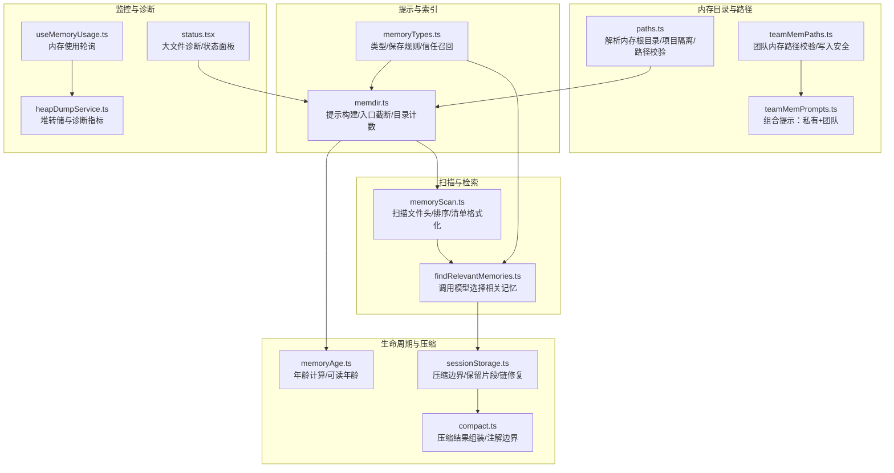
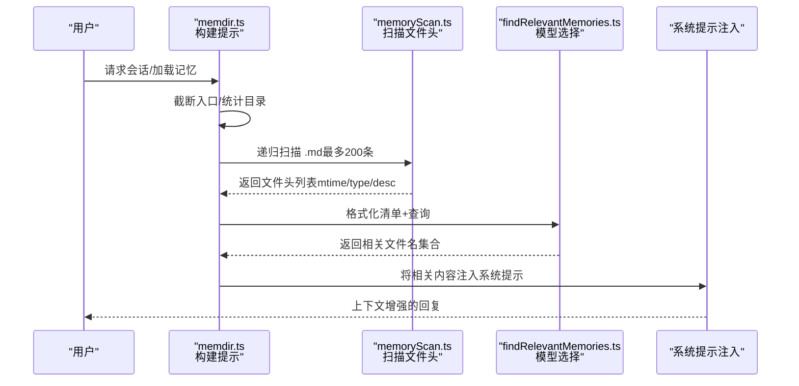
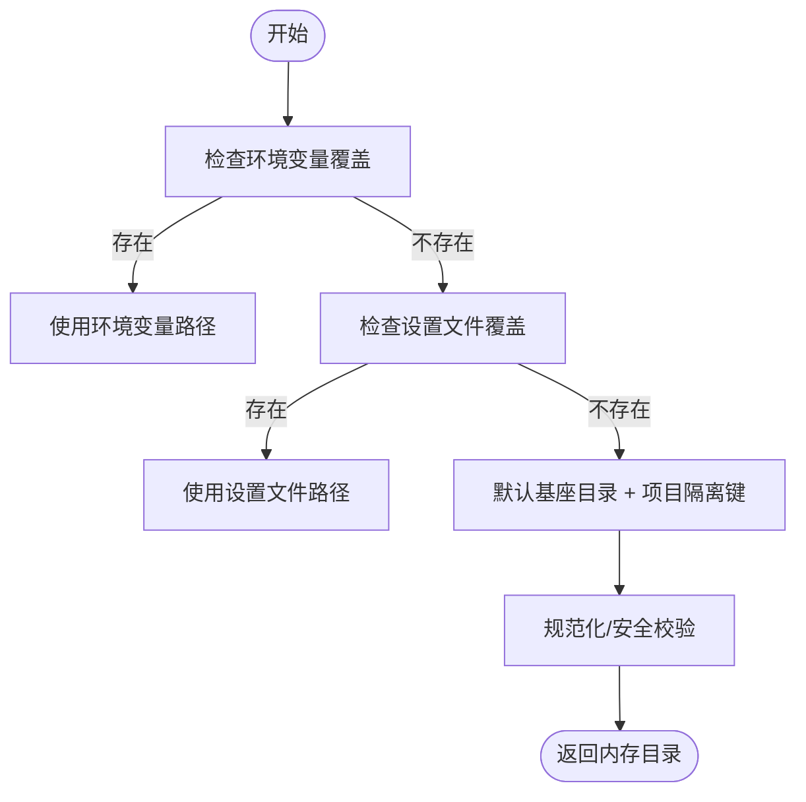
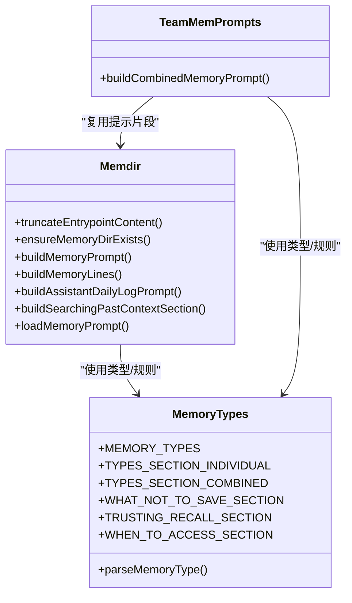
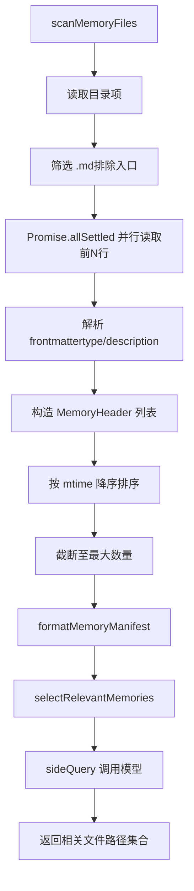
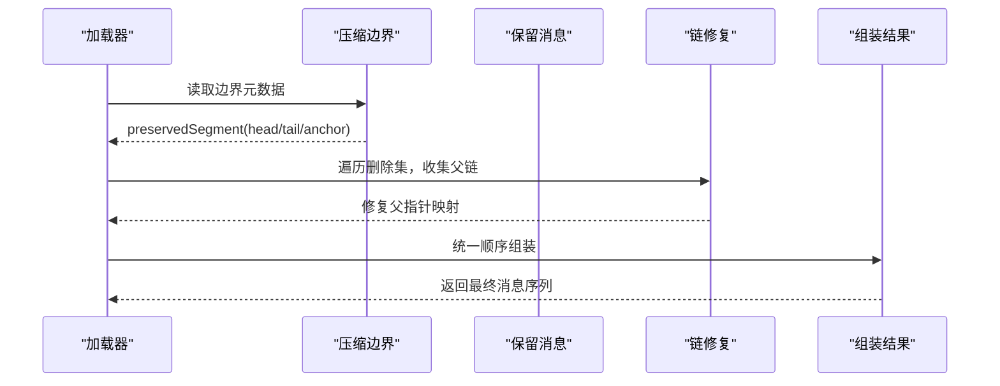
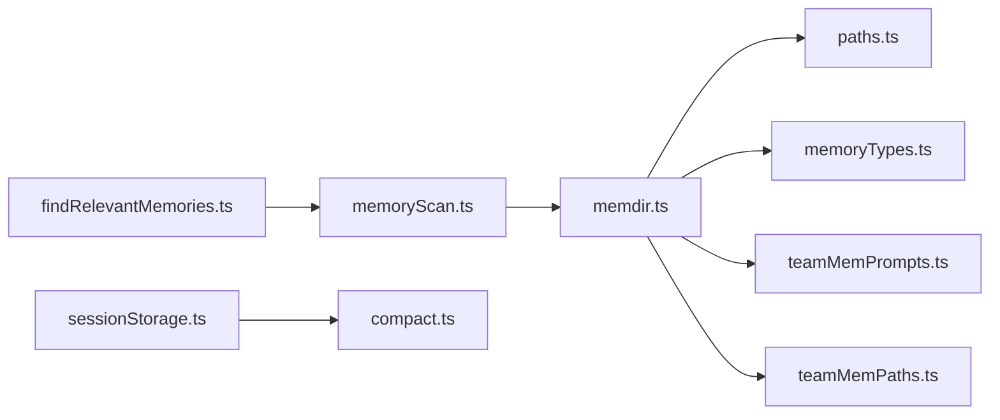

# 内存管理

<cite>
**本文引用的文件**
- [memdir.ts](file://src/memdir/memdir.ts)
- [memoryScan.ts](file://src/memdir/memoryScan.ts)
- [findRelevantMemories.ts](file://src/memdir/findRelevantMemories.ts)
- [memoryTypes.ts](file://src/memdir/memoryTypes.ts)
- [paths.ts](file://src/memdir/paths.ts)
- [teamMemPaths.ts](file://src/memdir/teamMemPaths.ts)
- [teamMemPrompts.ts](file://src/memdir/teamMemPrompts.ts)
- [memoryAge.ts](file://src/memdir/memoryAge.ts)
- [memoryShapeTelemetry.ts](file://src/memdir/memoryShapeTelemetry.ts)
- [status.tsx](file://src/utils/status.tsx)
- [useMemoryUsage.ts](file://src/hooks/useMemoryUsage.ts)
- [heapDumpService.ts](file://src/utils/heapDumpService.ts)
- [sessionStorage.ts](file://src/utils/sessionStorage.ts)
- [compact.ts](file://src/services/compact/compact.ts)
- [cleanup.ts](file://src/utils/cleanup.ts)
- [project-memory.mdx](file://docs/context/project-memory.mdx)
- [compaction.mdx](file://docs/context/compaction.mdx)
</cite>

## 目录
1. [简介](#简介)
2. [项目结构](#项目结构)
3. [核心组件](#核心组件)
4. [架构总览](#架构总览)
5. [详细组件分析](#详细组件分析)
6. [依赖关系分析](#依赖关系分析)
7. [性能考量](#性能考量)
8. [故障排查指南](#故障排查指南)
9. [结论](#结论)
10. [附录](#附录)

## 简介
本文件系统性梳理 Claude Code 的内存管理系统，覆盖内存目录结构、扫描与召回机制、生命周期与索引、查询优化、压缩与清理策略、监控与诊断工具、配置与限制、以及与磁盘存储的协同与缓存策略。文档以代码为依据，配合可视化图示帮助读者快速理解并高效使用该系统。

## 项目结构
内存子系统围绕“文件级持久化”设计，采用纯文本 Markdown 文件与目录组织，避免数据库或向量库的复杂性。核心模块包括：
- 目录与路径解析：确定内存根目录、项目隔离、团队内存子目录等
- 提示构建与注入：生成系统提示，将 MEMORY.md 注入到会话上下文
- 文件扫描与检索：扫描 .md 文件头信息，基于模型选择相关记忆
- 类型与约束：定义记忆类型与保存边界，确保只保存不可从当前项目状态派生的信息
- 压缩与清理：会话压缩、文件清理、大文件诊断
- 监控与诊断：内存使用状态、堆转储与诊断指标

**图表来源**
- [paths.ts:85-279](file://src/memdir/paths.ts#L85-L279)
- [teamMemPaths.ts:84-293](file://src/memdir/teamMemPaths.ts#L84-L293)
- [teamMemPrompts.ts:22-101](file://src/memdir/teamMemPrompts.ts#L22-L101)
- [memdir.ts:199-507](file://src/memdir/memdir.ts#L199-L507)
- [memoryTypes.ts:14-272](file://src/memdir/memoryTypes.ts#L14-L272)
- [memoryScan.ts:35-95](file://src/memdir/memoryScan.ts#L35-L95)
- [findRelevantMemories.ts:39-142](file://src/memdir/findRelevantMemories.ts#L39-L142)
- [memoryAge.ts:6-20](file://src/memdir/memoryAge.ts#L6-L20)
- [sessionStorage.ts:1847-2062](file://src/utils/sessionStorage.ts#L1847-L2062)
- [compact.ts:332-369](file://src/services/compact/compact.ts#L332-L369)
- [status.tsx:116-125](file://src/utils/status.tsx#L116-L125)
- [useMemoryUsage.ts:18-39](file://src/hooks/useMemoryUsage.ts#L18-L39)
- [heapDumpService.ts:88-212](file://src/utils/heapDumpService.ts#L88-L212)

**章节来源**
- [memdir.ts:199-507](file://src/memdir/memdir.ts#L199-L507)
- [memoryScan.ts:35-95](file://src/memdir/memoryScan.ts#L35-L95)
- [findRelevantMemories.ts:39-142](file://src/memdir/findRelevantMemories.ts#L39-L142)
- [memoryTypes.ts:14-272](file://src/memdir/memoryTypes.ts#L14-L272)
- [paths.ts:85-279](file://src/memdir/paths.ts#L85-L279)
- [teamMemPaths.ts:84-293](file://src/memdir/teamMemPaths.ts#L84-L293)
- [teamMemPrompts.ts:22-101](file://src/memdir/teamMemPrompts.ts#L22-L101)
- [memoryAge.ts:6-20](file://src/memdir/memoryAge.ts#L6-L20)
- [status.tsx:116-125](file://src/utils/status.tsx#L116-L125)
- [useMemoryUsage.ts:18-39](file://src/hooks/useMemoryUsage.ts#L18-L39)
- [heapDumpService.ts:88-212](file://src/utils/heapDumpService.ts#L88-L212)
- [sessionStorage.ts:1847-2062](file://src/utils/sessionStorage.ts#L1847-L2062)
- [compact.ts:332-369](file://src/services/compact/compact.ts#L332-L369)

## 核心组件
- 目录与路径解析
  - 解析内存基座目录、项目隔离键、自动内存目录、团队内存目录、入口文件路径
  - 安全校验：路径规范化、拒绝危险模式（相对路径、根路径、UNC、Windows 盘符、空字节、反斜杠等）
- 提示构建与注入
  - 构建系统提示，包含类型说明、保存规则、何时访问、信任召回、搜索过去上下文等
  - 入口文件截断：行数与字节数上限，超限时追加警告
  - 目录计数上报：异步统计文件/子目录数量，用于遥测
- 文件扫描与检索
  - 扫描 .md 文件，读取前若干行提取 frontmatter，构造文件头（含 mtime）
  - 排序与限额：按 mtime 新到旧，最多 200 条
  - 使用模型对候选进行相关性选择，返回绝对路径与 mtime
- 类型与约束
  - 四类记忆类型：user、feedback、project、reference
  - 明确“不可保存”的内容边界，强调记忆可能过期，需回溯验证
- 生命周期与压缩
  - 压缩边界标记与保留片段注解，链式修复父指针，减少消息碎片
  - 压缩结果组装顺序一致化，保证恢复一致性
- 监控与诊断
  - 内存使用轮询（10 秒一次），阈值区分 normal/high/critical
  - 大文件诊断：超过阈值的 MEMORY.md 或主题文件发出性能警告
  - 堆转储服务：采集 V8 堆统计、空间分布、活跃句柄/请求、平台信息等

**章节来源**
- [memdir.ts:57-103](file://src/memdir/memdir.ts#L57-L103)
- [memdir.ts:153-185](file://src/memdir/memdir.ts#L153-L185)
- [memdir.ts:199-316](file://src/memdir/memdir.ts#L199-L316)
- [memoryScan.ts:35-77](file://src/memdir/memoryScan.ts#L35-L77)
- [findRelevantMemories.ts:39-75](file://src/memdir/findRelevantMemories.ts#L39-L75)
- [memoryTypes.ts:14-272](file://src/memdir/memoryTypes.ts#L14-L272)
- [paths.ts:85-279](file://src/memdir/paths.ts#L85-L279)
- [teamMemPaths.ts:84-293](file://src/memdir/teamMemPaths.ts#L84-L293)
- [teamMemPrompts.ts:22-101](file://src/memdir/teamMemPrompts.ts#L22-L101)
- [memoryAge.ts:6-20](file://src/memdir/memoryAge.ts#L6-L20)
- [sessionStorage.ts:1847-2062](file://src/utils/sessionStorage.ts#L1847-L2062)
- [compact.ts:332-369](file://src/services/compact/compact.ts#L332-L369)
- [status.tsx:116-125](file://src/utils/status.tsx#L116-L125)
- [useMemoryUsage.ts:18-39](file://src/hooks/useMemoryUsage.ts#L18-L39)
- [heapDumpService.ts:88-212](file://src/utils/heapDumpService.ts#L88-L212)

## 架构总览
内存系统以“纯文件 + 系统提示注入”为核心，结合模型驱动的检索与压缩，形成闭环：
- 存储层：MEMORY.md 作为索引，各主题文件承载具体内容；团队内存位于独立子目录
- 提示层：根据启用的功能（自动记忆、团队记忆、KAIROS 日志）动态拼装提示
- 检索层：扫描文件头，格式化清单，调用模型选择相关记忆
- 压缩层：在压缩边界处保留片段链，修复父指针，减少冗余
- 监控层：内存使用轮询、大文件诊断、堆转储与指标采集

**图表来源**
- [memdir.ts:272-316](file://src/memdir/memdir.ts#L272-L316)
- [memoryScan.ts:35-77](file://src/memdir/memoryScan.ts#L35-L77)
- [findRelevantMemories.ts:77-142](file://src/memdir/findRelevantMemories.ts#L77-L142)

## 详细组件分析

### 目录与路径解析（paths.ts、teamMemPaths.ts）
- 自动内存目录解析优先级：环境变量覆盖 > 设置文件覆盖 > 默认基座目录 + 项目隔离键
- 安全校验：拒绝相对路径、根路径、UNC、Windows 盘符、空字节、反斜杠等；支持 ~/ 展开（设置文件）
- 团队内存路径：位于自动内存目录下 team 子目录，提供写入路径校验与符号链接防护
- KAIROS 日志：自动记忆在长期会话中采用追加式日志文件，夜间汇总至 MEMORY.md

**图表来源**
- [paths.ts:85-279](file://src/memdir/paths.ts#L85-L279)

**章节来源**
- [paths.ts:85-279](file://src/memdir/paths.ts#L85-L279)
- [teamMemPaths.ts:84-293](file://src/memdir/teamMemPaths.ts#L84-L293)

### 提示构建与索引（memdir.ts、memoryTypes.ts、teamMemPrompts.ts）
- 提示构建：包含目录存在指引、类型说明、保存规则、何时访问、信任召回、与其他持久化机制的区别
- 入口文件截断：同时控制行数与字节数，超限追加警告，避免上下文膨胀
- 目录计数上报：异步读取目录统计，记录文件/子目录数量，便于遥测
- 组合提示：当启用团队记忆时，同时提供私有与团队目录的说明与保存流程

**图表来源**
- [memdir.ts:57-103](file://src/memdir/memdir.ts#L57-L103)
- [memdir.ts:199-316](file://src/memdir/memdir.ts#L199-L316)
- [memoryTypes.ts:14-272](file://src/memdir/memoryTypes.ts#L14-L272)
- [teamMemPrompts.ts:22-101](file://src/memdir/teamMemPrompts.ts#L22-L101)

**章节来源**
- [memdir.ts:57-103](file://src/memdir/memdir.ts#L57-L103)
- [memdir.ts:199-316](file://src/memdir/memdir.ts#L199-L316)
- [memoryTypes.ts:14-272](file://src/memdir/memoryTypes.ts#L14-L272)
- [teamMemPrompts.ts:22-101](file://src/memdir/teamMemPrompts.ts#L22-L101)

### 文件扫描与检索（memoryScan.ts、findRelevantMemories.ts）
- 扫描：递归遍历目录，过滤 .md（排除入口文件），读取前若干行解析 frontmatter，提取 mtime、type、description
- 排序与限额：按 mtime 新到旧排序，最多 200 条，减少后续模型负担
- 清单格式化：输出“类型 文件名(时间戳): 描述”清单供模型选择
- 模型选择：将查询与清单喂给模型，返回相关文件名集合；支持近期工具列表过滤噪声

**图表来源**
- [memoryScan.ts:35-95](file://src/memdir/memoryScan.ts#L35-L95)
- [findRelevantMemories.ts:77-142](file://src/memdir/findRelevantMemories.ts#L77-L142)

**章节来源**
- [memoryScan.ts:35-95](file://src/memdir/memoryScan.ts#L35-L95)
- [findRelevantMemories.ts:39-142](file://src/memdir/findRelevantMemories.ts#L39-L142)

### 类型与约束（memoryTypes.ts）
- 四类记忆类型：user、feedback、project、reference
- 明确“不可保存”的内容边界：代码模式、架构、文件路径、历史、调试方案、CLAUDE.md 已有文档、临时任务细节
- 信任召回指导：建议在推荐前验证文件是否存在、函数/标志是否仍存在、最近状态优先于快照

**章节来源**
- [memoryTypes.ts:14-272](file://src/memdir/memoryTypes.ts#L14-L272)

### 生命周期与压缩（sessionStorage.ts、compact.ts）
- 压缩边界注解：在边界消息中标注 preservedSegment（head/tail/anchor），用于链式修复
- 链修复：遍历删除集，回溯父链，将幸存节点重新链接，减少孤儿与碎片
- 结果组装：统一边界消息、摘要、保留消息、附件、钩子结果的顺序，保证恢复一致性

**图表来源**
- [sessionStorage.ts:1847-2062](file://src/utils/sessionStorage.ts#L1847-L2062)
- [compact.ts:332-369](file://src/services/compact/compact.ts#L332-L369)

**章节来源**
- [sessionStorage.ts:1847-2062](file://src/utils/sessionStorage.ts#L1847-L2062)
- [compact.ts:332-369](file://src/services/compact/compact.ts#L332-L369)

### 监控与诊断（status.tsx、useMemoryUsage.ts、heapDumpService.ts）
- 内存使用轮询：每 10 秒采样一次，阈值区分 normal/high/critical，仅在非 normal 时渲染通知
- 大文件诊断：扫描内存文件，超过阈值发出性能警告
- 堆转储与诊断：采集 V8 堆统计、空间分布、活跃句柄/请求、平台信息、增长速率等，辅助定位泄漏

**章节来源**
- [status.tsx:116-125](file://src/utils/status.tsx#L116-L125)
- [useMemoryUsage.ts:18-39](file://src/hooks/useMemoryUsage.ts#L18-L39)
- [heapDumpService.ts:88-212](file://src/utils/heapDumpService.ts#L88-L212)

## 依赖关系分析
- 模块耦合
  - memdir.ts 依赖 paths.ts、memoryTypes.ts、teamMemPrompts.ts、teamMemPaths.ts（条件加载）
  - memoryScan.ts 与 findRelevantMemories.ts 独立于 memdir.ts，但被其复用
  - sessionStorage.ts 与 compact.ts 为压缩管线核心，与 memdir.ts 无直接依赖
- 外部依赖
  - 文件系统操作通过 fs 实现抽象封装
  - 模型调用通过 sideQuery 接口，输出格式为 JSON Schema

**图表来源**
- [memdir.ts:1-507](file://src/memdir/memdir.ts#L1-L507)
- [memoryScan.ts:1-95](file://src/memdir/memoryScan.ts#L1-L95)
- [findRelevantMemories.ts:1-142](file://src/memdir/findRelevantMemories.ts#L1-L142)
- [paths.ts:1-279](file://src/memdir/paths.ts#L1-L279)
- [teamMemPrompts.ts:1-101](file://src/memdir/teamMemPrompts.ts#L1-L101)
- [teamMemPaths.ts:1-293](file://src/memdir/teamMemPaths.ts#L1-L293)
- [sessionStorage.ts:1847-2062](file://src/utils/sessionStorage.ts#L1847-L2062)
- [compact.ts:332-369](file://src/services/compact/compact.ts#L332-L369)

**章节来源**
- [memdir.ts:1-507](file://src/memdir/memdir.ts#L1-L507)
- [memoryScan.ts:1-95](file://src/memdir/memoryScan.ts#L1-L95)
- [findRelevantMemories.ts:1-142](file://src/memdir/findRelevantMemories.ts#L1-L142)
- [paths.ts:1-279](file://src/memdir/paths.ts#L1-L279)
- [teamMemPrompts.ts:1-101](file://src/memdir/teamMemPrompts.ts#L1-L101)
- [teamMemPaths.ts:1-293](file://src/memdir/teamMemPaths.ts#L1-L293)
- [sessionStorage.ts:1847-2062](file://src/utils/sessionStorage.ts#L1847-L2062)
- [compact.ts:332-369](file://src/services/compact/compact.ts#L332-L369)

## 性能考量
- 扫描与读取
  - 单次扫描使用 Promise.allSettled 并行读取前若干行，减少 stat 往返；N≤200 时避免双轮 stat
  - 入口文件截断：行数与字节上限，防止上下文膨胀
- 检索优化
  - 限额与排序：限制候选规模，按 mtime 优先，降低模型负担
  - 近期工具过滤：避免将正在使用的工具参考文档作为噪声
- 压缩与碎片
  - 压缩边界保留片段链，链修复减少孤儿与碎片
  - 预压缩跳过：在满足条件时提前跳过解析阶段，提升加载性能
- 监控与告警
  - 内存使用轮询与阈值区分，避免高频渲染
  - 大文件诊断与堆转储指标，辅助定位性能瓶颈

[本节为通用性能讨论，无需特定文件来源]

## 故障排查指南
- 大文件影响性能
  - 使用大文件诊断接口扫描内存文件，发现超过阈值的文件并给出警告
- 内存使用异常
  - 使用内存使用轮询钩子观察 heapUsed 状态变化，超过阈值自动弹出提示
- 泄漏与资源泄露
  - 启用堆转储服务，采集 V8 堆统计、活跃句柄/请求、平台信息等，分析潜在泄漏
- 路径安全问题
  - 团队内存写入路径校验与符号链接防护，拒绝路径穿越与逃逸
- 压缩后消息链断裂
  - 检查压缩边界 preservedSegment 是否正确注解，确认链修复逻辑已执行

**章节来源**
- [status.tsx:116-125](file://src/utils/status.tsx#L116-L125)
- [useMemoryUsage.ts:18-39](file://src/hooks/useMemoryUsage.ts#L18-L39)
- [heapDumpService.ts:88-212](file://src/utils/heapDumpService.ts#L88-L212)
- [teamMemPaths.ts:228-256](file://src/memdir/teamMemPaths.ts#L228-L256)
- [sessionStorage.ts:1847-2062](file://src/utils/sessionStorage.ts#L1847-L2062)

## 结论
Claude Code 的内存系统以“纯文件 + 系统提示注入”为核心，结合模型驱动的检索与压缩，形成轻量、可控且可扩展的记忆体系。通过严格的路径安全校验、入口文件截断、类型约束与压缩边界保留，系统在保证上下文质量的同时，有效控制了性能与资源占用。配套的监控与诊断工具进一步提升了可观测性与可维护性。

[本节为总结，无需特定文件来源]

## 附录

### 内存目录结构与生命周期
- 目录布局
  - 自动记忆：~/.claude/projects/<sanitized-git-root>/memory/
  - 团队记忆：在自动记忆目录下 team 子目录
  - 入口索引：MEMORY.md，作为索引而非内容容器
- 生命周期
  - 创建：首次使用时确保目录存在
  - 写入：按类型与范围保存到对应文件
  - 检索：扫描文件头，格式化清单，模型选择相关记忆
  - 压缩：在边界处保留片段链，修复父指针，组装结果
  - 清理：定期清理旧文件与日志，避免目录膨胀

**章节来源**
- [project-memory.mdx:17-28](file://docs/context/project-memory.mdx#L17-L28)
- [memdir.ts:129-147](file://src/memdir/memdir.ts#L129-L147)
- [paths.ts:223-259](file://src/memdir/paths.ts#L223-L259)
- [teamMemPaths.ts:84-94](file://src/memdir/teamMemPaths.ts#L84-L94)

### 内存查询优化与索引
- 查询优化
  - 限额与排序：限制候选规模，按 mtime 优先
  - 近期工具过滤：避免噪声
  - 入口文件截断：控制上下文大小
- 索引结构
  - MEMORY.md 作为索引，每个条目一行，不超过约 200 字符
  - frontmatter 包含 name/description/type 等字段

**章节来源**
- [findRelevantMemories.ts:77-142](file://src/memdir/findRelevantMemories.ts#L77-L142)
- [memdir.ts:57-103](file://src/memdir/memdir.ts#L57-L103)
- [memoryTypes.ts:261-272](file://src/memdir/memoryTypes.ts#L261-L272)

### 内存压缩与去重
- 压缩策略
  - 边界注解：保留 head/tail/anchor，用于链修复
  - 链修复：回溯父链，重新链接幸存节点
  - 结果组装：统一顺序，保证恢复一致性
- 去重与碎片整理
  - 删除集遍历，移除孤儿消息，减少碎片
  - 预压缩跳过：在满足条件时跳过解析阶段

**章节来源**
- [sessionStorage.ts:1847-2062](file://src/utils/sessionStorage.ts#L1847-L2062)
- [compact.ts:332-369](file://src/services/compact/compact.ts#L332-L369)

### 内存监控与统计
- 内存使用轮询：10 秒一次，阈值区分 normal/high/critical
- 大文件诊断：扫描内存文件，超过阈值发出警告
- 堆转储与诊断：采集 V8 堆统计、活跃句柄/请求、平台信息、增长速率等

**章节来源**
- [useMemoryUsage.ts:18-39](file://src/hooks/useMemoryUsage.ts#L18-L39)
- [status.tsx:116-125](file://src/utils/status.tsx#L116-L125)
- [heapDumpService.ts:88-212](file://src/utils/heapDumpService.ts#L88-L212)

### 内存配置参数与限制
- 启用开关
  - CLAUDE_CODE_DISABLE_AUTO_MEMORY：禁用自动记忆
  - CLAUDE_CODE_SIMPLE：简化模式下禁用
  - CCR 无持久化存储：无远程内存目录时禁用
- 路径配置
  - CLAUDE_CODE_REMOTE_MEMORY_DIR：远程内存目录覆盖
  - settings.json 中 autoMemoryDirectory：受信任来源覆盖（不包含项目设置）
- 限制与阈值
  - 入口文件行数上限：200 行
  - 入口文件字节数上限：约 25KB
  - 扫描文件头最大数量：200
  - 内存使用阈值：1.5GB（high）、2.5GB（critical）

**章节来源**
- [paths.ts:30-55](file://src/memdir/paths.ts#L30-L55)
- [memdir.ts:34-47](file://src/memdir/memdir.ts#L34-L47)
- [memoryScan.ts:21-22](file://src/memdir/memoryScan.ts#L21-L22)
- [useMemoryUsage.ts:11-12](file://src/hooks/useMemoryUsage.ts#L11-L12)

### 内存与磁盘存储协调与缓存策略
- 协调机制
  - 自动记忆与团队记忆分别维护独立目录，入口索引统一注入
  - KAIROS 模式下采用追加式日志文件，夜间汇总至 MEMORY.md
- 缓存策略
  - 系统提示中的内存段缓存，避免重复构建
  - 路径解析结果缓存（memoize），减少设置文件解析成本

**章节来源**
- [memdir.ts:420-490](file://src/memdir/memdir.ts#L420-L490)
- [paths.ts:223-235](file://src/memdir/paths.ts#L223-L235)

### 内存泄漏检测与压力处理
- 泄漏检测
  - 堆转储服务采集 V8 堆统计、活跃句柄/请求、平台信息
  - 分析 potentialLeaks 与 recommendation，辅助定位泄漏
- 压力处理
  - 内存使用轮询与阈值告警
  - 压缩与清理策略降低内存占用

**章节来源**
- [heapDumpService.ts:88-212](file://src/utils/heapDumpService.ts#L88-L212)
- [useMemoryUsage.ts:18-39](file://src/hooks/useMemoryUsage.ts#L18-L39)

### 内存管理 API 使用示例与调试技巧
- 提示构建
  - 使用 buildMemoryPrompt/loadMemoryPrompt 获取带 MEMORY.md 的完整提示
- 文件扫描
  - 使用 scanMemoryFiles 获取文件头列表，再用 formatMemoryManifest 生成清单
- 相关性选择
  - 使用 findRelevantMemories 获取相关文件路径集合
- 压缩边界注解
  - 使用 annotateBoundaryWithPreservedSegment 注解边界，保留片段链
- 调试技巧
  - 开启内存使用轮询，观察阈值变化
  - 使用大文件诊断定位性能瓶颈
  - 触发堆转储，分析 V8 堆空间与活跃对象

**章节来源**
- [memdir.ts:272-316](file://src/memdir/memdir.ts#L272-L316)
- [memoryScan.ts:84-94](file://src/memdir/memoryScan.ts#L84-L94)
- [findRelevantMemories.ts:39-75](file://src/memdir/findRelevantMemories.ts#L39-L75)
- [compact.ts:351-369](file://src/services/compact/compact.ts#L351-L369)
- [useMemoryUsage.ts:18-39](file://src/hooks/useMemoryUsage.ts#L18-L39)
- [status.tsx:116-125](file://src/utils/status.tsx#L116-L125)
- [heapDumpService.ts:88-212](file://src/utils/heapDumpService.ts#L88-L212)