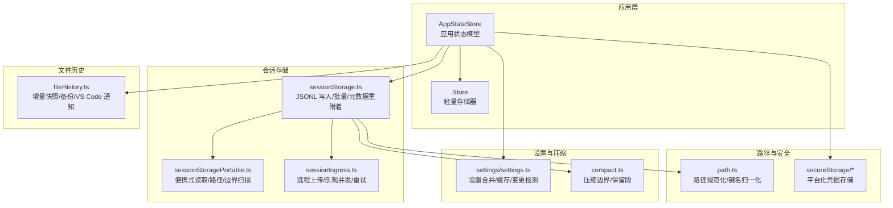
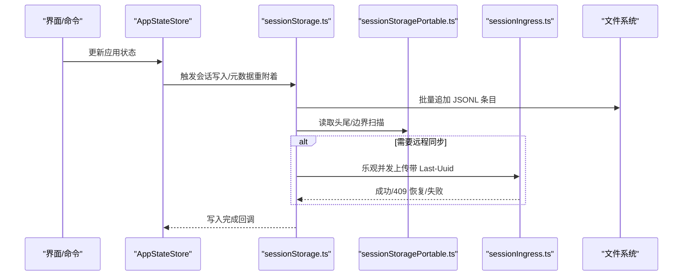
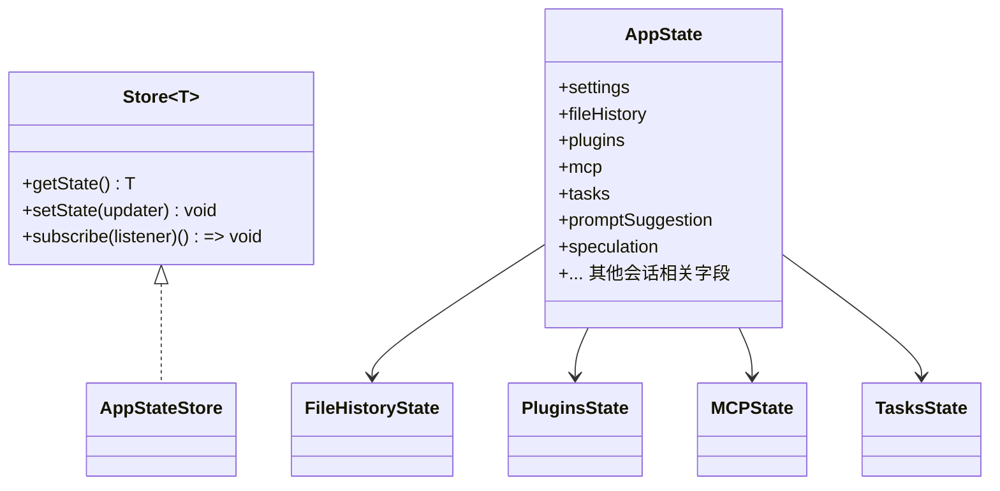
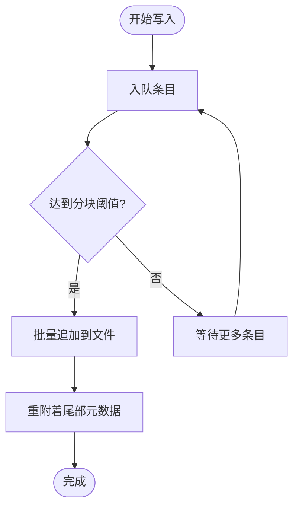
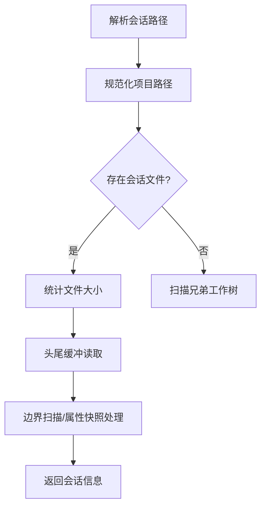
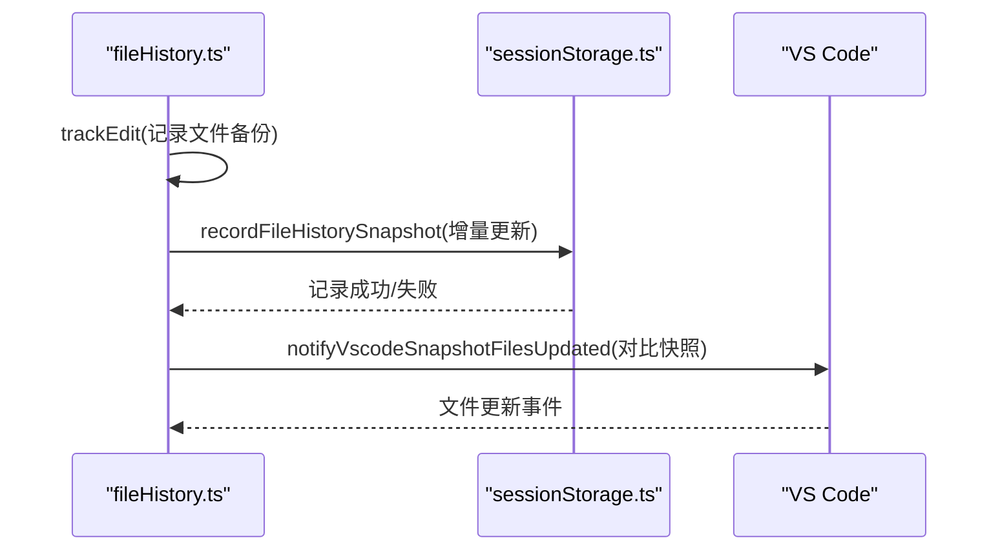
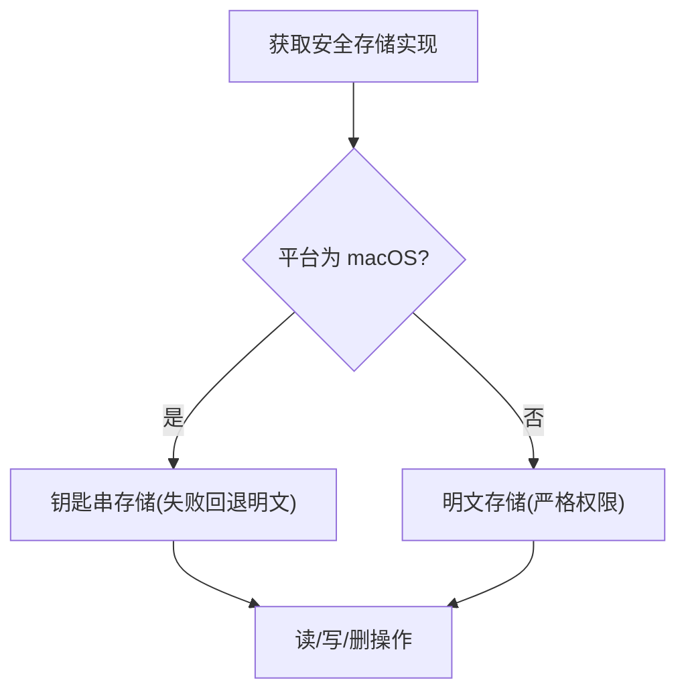
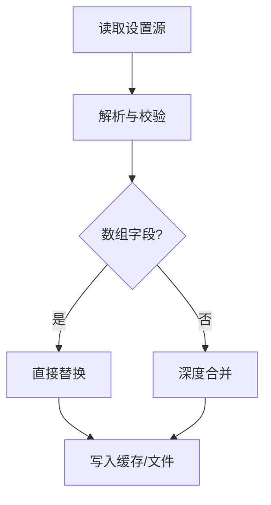
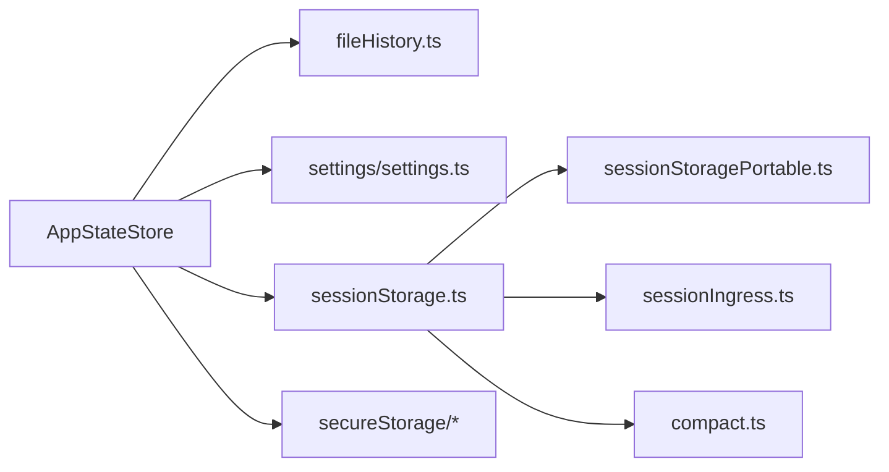

# 状态持久化

<cite>
**本文引用的文件**
- [src/state/AppStateStore.ts](file://src/state/AppStateStore.ts)
- [src/state/store.ts](file://src/state/store.ts)
- [src/utils/sessionStorage.ts](file://src/utils/sessionStorage.ts)
- [src/utils/sessionStoragePortable.ts](file://src/utils/sessionStoragePortable.ts)
- [src/services/api/sessionIngress.ts](file://src/services/api/sessionIngress.ts)
- [src/utils/fileHistory.ts](file://src/utils/fileHistory.ts)
- [src/utils/path.ts](file://src/utils/path.ts)
- [src/utils/secureStorage/index.ts](file://src/utils/secureStorage/index.ts)
- [src/utils/secureStorage/plainTextStorage.ts](file://src/utils/secureStorage/plainTextStorage.ts)
- [src/utils/settings/settings.ts](file://src/utils/settings/settings.ts)
- [src/services/compact/compact.ts](file://src/services/compact/compact.ts)
- [src/utils/sessionStorage.ts](file://src/utils/sessionStorage.ts)
</cite>

## 目录
1. [简介](#简介)
2. [项目结构](#项目结构)
3. [核心组件](#核心组件)
4. [架构总览](#架构总览)
5. [详细组件分析](#详细组件分析)
6. [依赖关系分析](#依赖关系分析)
7. [性能考量](#性能考量)
8. [故障排查指南](#故障排查指南)
9. [结论](#结论)
10. [附录](#附录)

## 简介
本文件系统性阐述 Claude Code 的状态持久化体系，覆盖会话状态的序列化、存储与恢复机制；文件存储格式与路径组织；跨平台兼容与便携式会话管理；状态快照、增量更新与冲突解决；状态迁移与版本兼容；状态同步与分布式一致性；以及状态恢复验证、数据完整性校验与故障恢复流程。同时提供配置项与性能优化建议，帮助开发者在不同运行环境（桌面、VS Code 扩展、CLI）下稳定地使用与扩展该系统。

## 项目结构
围绕状态持久化的关键模块包括：
- 应用状态与存储：应用全局状态模型与轻量级内存存储器
- 会话存储：本地 JSONL 会话日志写入、批量追加、元数据重附着、远程上传与并发控制
- 文件历史与快照：文件变更备份、增量快照、VS Code 同步通知
- 路径与便携性：路径规范化、项目目录发现、工作树回退
- 安全存储：凭据与敏感信息的平台化安全存储
- 设置与迁移：设置合并、缓存与变更检测、压缩边界与保留段

图示来源
- [src/state/AppStateStore.ts:1-570](file://src/state/AppStateStore.ts#L1-L570)
- [src/state/store.ts:1-35](file://src/state/store.ts#L1-L35)
- [src/utils/sessionStorage.ts:1-800](file://src/utils/sessionStorage.ts#L1-L800)
- [src/utils/sessionStoragePortable.ts:1-794](file://src/utils/sessionStoragePortable.ts#L1-L794)
- [src/services/api/sessionIngress.ts:1-200](file://src/services/api/sessionIngress.ts#L1-L200)
- [src/utils/fileHistory.ts:1-200](file://src/utils/fileHistory.ts#L1-L200)
- [src/utils/path.ts:137-155](file://src/utils/path.ts#L137-L155)
- [src/utils/secureStorage/index.ts:1-17](file://src/utils/secureStorage/index.ts#L1-L17)
- [src/utils/settings/settings.ts:1-200](file://src/utils/settings/settings.ts#L1-L200)
- [src/services/compact/compact.ts:327-369](file://src/services/compact/compact.ts#L327-L369)

章节来源
- [src/state/AppStateStore.ts:1-570](file://src/state/AppStateStore.ts#L1-L570)
- [src/state/store.ts:1-35](file://src/state/store.ts#L1-L35)
- [src/utils/sessionStorage.ts:1-800](file://src/utils/sessionStorage.ts#L1-L800)
- [src/utils/sessionStoragePortable.ts:1-794](file://src/utils/sessionStoragePortable.ts#L1-L794)
- [src/services/api/sessionIngress.ts:1-200](file://src/services/api/sessionIngress.ts#L1-L200)
- [src/utils/fileHistory.ts:1-200](file://src/utils/fileHistory.ts#L1-L200)
- [src/utils/path.ts:137-155](file://src/utils/path.ts#L137-L155)
- [src/utils/secureStorage/index.ts:1-17](file://src/utils/secureStorage/index.ts#L1-L17)
- [src/utils/settings/settings.ts:1-200](file://src/utils/settings/settings.ts#L1-L200)
- [src/services/compact/compact.ts:327-369](file://src/services/compact/compact.ts#L327-L369)

## 核心组件
- 应用状态模型与存储
  - 应用状态模型集中定义了会话、插件、MCP、任务、提示建议、推测等状态字段，并通过轻量存储器进行订阅与变更广播。
- 会话存储
  - 以 JSONL 行式记录消息与元数据，支持批量写入、分块追加、尾部元数据重附着、远程上传与乐观并发控制。
- 便携式读取与路径
  - 提供头尾读取、边界扫描、项目目录发现、工作树回退、路径规范化与键名归一化，确保跨平台与长路径兼容。
- 文件历史与快照
  - 增量快照跟踪文件变更，按需备份，支持 VS Code 变更通知与恢复时的硬链接/复制迁移。
- 安全存储
  - 平台化凭据存储（macOS 使用钥匙串，其他平台明文存储），保证最小权限与安全模式降级。
- 设置与迁移
  - 多源设置合并、缓存与变更检测、压缩边界保留段，保障状态迁移与版本演进的稳定性。

章节来源
- [src/state/AppStateStore.ts:89-570](file://src/state/AppStateStore.ts#L89-L570)
- [src/state/store.ts:4-35](file://src/state/store.ts#L4-L35)
- [src/utils/sessionStorage.ts:198-800](file://src/utils/sessionStorage.ts#L198-L800)
- [src/utils/sessionStoragePortable.ts:16-794](file://src/utils/sessionStoragePortable.ts#L16-L794)
- [src/utils/fileHistory.ts:33-193](file://src/utils/fileHistory.ts#L33-L193)
- [src/utils/secureStorage/index.ts:9-17](file://src/utils/secureStorage/index.ts#L9-L17)
- [src/utils/settings/settings.ts:473-826](file://src/utils/settings/settings.ts#L473-L826)
- [src/services/compact/compact.ts:327-369](file://src/services/compact/compact.ts#L327-L369)

## 架构总览
状态持久化由“本地 JSONL 会话日志 + 远程上传 + 文件历史快照 + 应用状态模型”构成，配合便携式读取与路径处理实现跨平台与便携式会话管理。

图示来源
- [src/state/AppStateStore.ts:1-570](file://src/state/AppStateStore.ts#L1-L570)
- [src/utils/sessionStorage.ts:490-530](file://src/utils/sessionStorage.ts#L490-L530)
- [src/utils/sessionStoragePortable.ts:215-282](file://src/utils/sessionStoragePortable.ts#L215-L282)
- [src/services/api/sessionIngress.ts:63-186](file://src/services/api/sessionIngress.ts#L63-L186)

## 详细组件分析

### 组件一：应用状态模型与存储
- 设计要点
  - 应用状态模型集中定义会话、插件、MCP、任务、提示建议、推测等字段，便于统一管理与持久化选择。
  - 轻量存储器提供 setState、subscribe 与 onChange 回调，确保状态变更可追踪与可广播。
- 关键点
  - 默认状态初始化与字段默认值，确保首次启动一致性。
  - 订阅者集合用于响应式更新，避免重复渲染与无效计算。

图示来源
- [src/state/store.ts:4-35](file://src/state/store.ts#L4-L35)
- [src/state/AppStateStore.ts:89-570](file://src/state/AppStateStore.ts#L89-L570)

章节来源
- [src/state/store.ts:4-35](file://src/state/store.ts#L4-L35)
- [src/state/AppStateStore.ts:89-570](file://src/state/AppStateStore.ts#L89-L570)

### 组件二：会话存储（JSONL 写入、批量追加、元数据重附着）
- 存储格式
  - 采用 JSONL（每行一条 JSON）记录消息与元数据，支持用户、助手、附件、系统等类型。
- 写入与批处理
  - 写入队列按文件维度维护，支持批量追加与分块上限控制，避免单次写入过大。
  - 首次消息出现前的元数据暂存，随后一次性重附着到文件尾部，保证尾部窗口可读。
- 并发与冲突
  - 乐观并发控制：每个会话维护 Last-Uuid，远程上传失败时自动恢复服务器最新链头或重试。
  - 顺序化包装：同一会话的写入串行执行，避免竞态。
- 边界与压缩
  - 压缩边界标记用于截断与保留段，确保恢复时能重建链路。

图示来源
- [src/utils/sessionStorage.ts:606-686](file://src/utils/sessionStorage.ts#L606-L686)
- [src/utils/sessionStorage.ts:721-800](file://src/utils/sessionStorage.ts#L721-L800)

章节来源
- [src/utils/sessionStorage.ts:198-800](file://src/utils/sessionStorage.ts#L198-L800)
- [src/services/api/sessionIngress.ts:63-186](file://src/services/api/sessionIngress.ts#L63-L186)
- [src/services/compact/compact.ts:327-369](file://src/services/compact/compact.ts#L327-L369)

### 组件三：便携式读取与路径处理
- 便携式读取
  - 仅读取文件头尾固定大小缓冲区，快速提取首提示、自定义标题、标签等关键元数据。
  - 边界扫描与属性快照处理，支持大文件流式加载与截断。
- 路径与项目目录
  - 项目目录基于配置根目录 + 归一化路径，支持长路径哈希后缀与前缀匹配回退。
  - 工作树回退：当主目录无会话时，在兄弟工作树中查找。
- 键名归一化
  - 路径键名统一使用正斜杠，避免 Windows 反斜杠差异导致的 JSON 键不一致。

图示来源
- [src/utils/sessionStoragePortable.ts:325-466](file://src/utils/sessionStoragePortable.ts#L325-L466)
- [src/utils/path.ts:137-155](file://src/utils/path.ts#L137-L155)

章节来源
- [src/utils/sessionStoragePortable.ts:16-794](file://src/utils/sessionStoragePortable.ts#L16-L794)
- [src/utils/path.ts:137-155](file://src/utils/path.ts#L137-L155)

### 组件四：文件历史与快照（增量更新与 VS Code 同步）
- 快照机制
  - 每个快照记录关联的消息 ID、被跟踪文件的备份版本映射与时间戳。
  - 最多保留固定数量快照，超过上限时递增序列号但不删除旧快照，保持活动信号。
- 增量更新
  - 在编辑/新增文件前创建备份，避免重复备份；后续快照再根据修改时间决定是否重备份。
  - 支持在最邻近快照中追加已跟踪文件的备份，减少磁盘占用。
- VS Code 同步
  - 对比相邻快照，向 VS Code 发送文件更新通知，触发增量刷新。
- 恢复迁移
  - 从上一个会话迁移备份时优先硬链接，失败则复制；记录快照迁移结果并统计失败数。

图示来源
- [src/utils/fileHistory.ts:86-193](file://src/utils/fileHistory.ts#L86-L193)
- [src/utils/fileHistory.ts:970-1046](file://src/utils/fileHistory.ts#L970-L1046)

章节来源
- [src/utils/fileHistory.ts:33-193](file://src/utils/fileHistory.ts#L33-L193)
- [src/utils/fileHistory.ts:970-1046](file://src/utils/fileHistory.ts#L970-L1046)

### 组件五：安全存储（凭据与敏感信息）
- 平台适配
  - macOS：优先钥匙串，失败回退明文存储。
  - 其他平台：明文存储（严格权限限制）。
- 安全策略
  - 存储文件权限严格限制，写入后立即 chmod 0600，删除时忽略不存在错误。

图示来源
- [src/utils/secureStorage/index.ts:9-17](file://src/utils/secureStorage/index.ts#L9-L17)
- [src/utils/secureStorage/plainTextStorage.ts:57-84](file://src/utils/secureStorage/plainTextStorage.ts#L57-L84)

章节来源
- [src/utils/secureStorage/index.ts:1-17](file://src/utils/secureStorage/index.ts#L1-L17)
- [src/utils/secureStorage/plainTextStorage.ts:57-84](file://src/utils/secureStorage/plainTextStorage.ts#L57-L84)

### 组件六：设置与迁移（多源合并、缓存与压缩边界）
- 设置合并
  - 多源设置（用户、项目、本地、策略）按优先级合并，数组类字段直接替换，避免深层合并复杂度。
  - 内部写入标记与缓存失效，确保变更检测与一致性。
- 压缩边界与保留段
  - 压缩边界携带保留段元数据，恢复时通过锚点修复链路，确保前后缀保留与去重跳过的一致性。

图示来源
- [src/utils/settings/settings.ts:473-521](file://src/utils/settings/settings.ts#L473-L521)
- [src/services/compact/compact.ts:351-369](file://src/services/compact/compact.ts#L351-L369)

章节来源
- [src/utils/settings/settings.ts:473-826](file://src/utils/settings/settings.ts#L473-L826)
- [src/services/compact/compact.ts:327-369](file://src/services/compact/compact.ts#L327-L369)

## 依赖关系分析
- 组件耦合
  - 应用状态模型依赖文件历史、设置、MCP、插件等子系统状态。
  - 会话存储依赖便携式读取与远程上传，受路径与项目目录发现影响。
  - 文件历史与会话存储相互协作：前者提供备份与增量，后者负责写入与边界。
- 外部依赖
  - HTTP 客户端用于远程上传，文件系统用于本地读写。
  - 平台库用于钥匙串与权限控制。

图示来源
- [src/state/AppStateStore.ts:1-570](file://src/state/AppStateStore.ts#L1-L570)
- [src/utils/fileHistory.ts:1-200](file://src/utils/fileHistory.ts#L1-L200)
- [src/utils/settings/settings.ts:1-200](file://src/utils/settings/settings.ts#L1-L200)
- [src/utils/sessionStorage.ts:1-800](file://src/utils/sessionStorage.ts#L1-L800)
- [src/utils/sessionStoragePortable.ts:1-794](file://src/utils/sessionStoragePortable.ts#L1-L794)
- [src/services/api/sessionIngress.ts:1-200](file://src/services/api/sessionIngress.ts#L1-L200)
- [src/utils/secureStorage/index.ts:1-17](file://src/utils/secureStorage/index.ts#L1-L17)
- [src/services/compact/compact.ts:327-369](file://src/services/compact/compact.ts#L327-L369)

章节来源
- [src/state/AppStateStore.ts:1-570](file://src/state/AppStateStore.ts#L1-L570)
- [src/utils/sessionStorage.ts:1-800](file://src/utils/sessionStorage.ts#L1-L800)
- [src/utils/sessionStoragePortable.ts:1-794](file://src/utils/sessionStoragePortable.ts#L1-L794)
- [src/services/api/sessionIngress.ts:1-200](file://src/services/api/sessionIngress.ts#L1-L200)
- [src/utils/fileHistory.ts:1-200](file://src/utils/fileHistory.ts#L1-L200)
- [src/utils/secureStorage/index.ts:1-17](file://src/utils/secureStorage/index.ts#L1-L17)
- [src/utils/settings/settings.ts:1-200](file://src/utils/settings/settings.ts#L1-L200)
- [src/services/compact/compact.ts:327-369](file://src/services/compact/compact.ts#L327-L369)

## 性能考量
- I/O 分块与批量
  - 会话写入采用分块追加与批量写入，避免单次写入过大导致阻塞。
- 尾部元数据重附着
  - 在清理阶段将标题、标签等关键元数据重附着到文件尾部，缩短读取窗口，提升加载速度。
- 便携式读取
  - 仅读取头尾固定大小缓冲区，避免全文件扫描；边界扫描与属性快照处理减少内存峰值。
- 缓存与去重
  - 会话消息 UUID 缓存与项目目录缓存，降低重复读取与路径解析成本。
- 并发控制
  - 同一会话串行化写入，减少竞争与冲突；远程上传采用指数退避与乐观并发，提高成功率。

章节来源
- [src/utils/sessionStorage.ts:606-686](file://src/utils/sessionStorage.ts#L606-L686)
- [src/utils/sessionStorage.ts:721-800](file://src/utils/sessionStorage.ts#L721-L800)
- [src/utils/sessionStoragePortable.ts:215-282](file://src/utils/sessionStoragePortable.ts#L215-L282)
- [src/utils/sessionStorage.ts:3839-3868](file://src/utils/sessionStorage.ts#L3839-L3868)

## 故障排查指南
- 远程上传冲突
  - 当收到 409 时，系统会尝试从响应头或重新拉取会话链来恢复服务器最新链头，若仍无法确定则判定并发冲突并记录诊断事件。
- 令牌失效
  - 401 表示令牌失效或无效，停止重试并记录错误。
- 网络与服务端错误
  - 对于 5xx 或 429 等可重试错误，采用指数退避重试，最多若干次。
- 文件历史迁移失败
  - 硬链接失败时回退复制；对缺失备份文件进行错误记录并抛出异常；统计失败快照数量以便告警。
- 设置变更风暴
  - 变更检测集中在一个生产者处重置缓存，避免多个消费者重复读取导致的 N 路抖动。

章节来源
- [src/services/api/sessionIngress.ts:63-186](file://src/services/api/sessionIngress.ts#L63-L186)
- [src/utils/fileHistory.ts:970-1046](file://src/utils/fileHistory.ts#L970-L1046)
- [src/utils/settings/settings.ts:437-450](file://src/utils/settings/settings.ts#L437-L450)

## 结论
该状态持久化系统通过“本地 JSONL + 远程上传 + 文件历史快照 + 应用状态模型”的组合，实现了高可靠、跨平台、可扩展的会话状态管理。其设计兼顾性能与一致性：批量写入、尾部元数据重附着、便携式读取与边界扫描显著降低 I/O 成本；乐观并发与顺序化写入有效规避冲突；文件历史的增量快照与 VS Code 同步进一步增强了开发体验。配合安全存储与设置合并机制，系统在不同运行环境与版本演进中保持稳健与易用。

## 附录
- 状态恢复验证与数据完整性
  - 通过尾部元数据重附着与边界扫描，确保恢复时能正确读取标题、标签等关键信息。
  - 属性快照与保留段在压缩后仍可重建链路，避免消息丢失。
- 分布式状态管理
  - 远程上传采用 Last-Uuid 乐观并发控制，结合顺序化包装与重试策略，降低冲突概率。
- 配置选项与性能优化建议
  - 适当增大分块阈值与批量大小以提升吞吐，但需平衡内存占用。
  - 启用文件历史快照时注意磁盘空间与硬链接可用性，必要时启用复制回退。
  - 对于长路径场景，依赖路径规范化与前缀匹配回退，确保项目目录定位准确。