# Shell 执行命令

<cite>
**本文引用的文件**
- [src/tools/BashTool/BashTool.tsx](file://src/tools/BashTool/BashTool.tsx)
- [src/commands/branch/branch.ts](file://src/commands/branch/branch.ts)
- [src/commands/heapdump/heapdump.ts](file://src/commands/heapdump/heapdump.ts)
- [src/commands/fast/fast.tsx](file://src/commands/fast/fast.tsx)
- [src/utils/shell/shellToolUtils.ts](file://src/utils/shell/shellToolUtils.ts)
- [src/utils/shell/shellProvider.ts](file://src/utils/shell/shellProvider.ts)
- [src/utils/shellConfig.ts](file://src/utils/shellConfig.ts)
- [src/utils/permissions/shellRuleMatching.ts](file://src/utils/permissions/shellRuleMatching.ts)
</cite>

## 目录
1. [简介](#简介)
2. [项目结构](#项目结构)
3. [核心组件](#核心组件)
4. [架构总览](#架构总览)
5. [详细组件分析](#详细组件分析)
6. [依赖关系分析](#依赖关系分析)
7. [性能考量](#性能考量)
8. [故障排除指南](#故障排除指南)
9. [结论](#结论)
10. [附录](#附录)

## 简介
本文件围绕 Shell 执行命令展开，重点覆盖以下与系统交互密切相关的命令与能力：
- branch：会话分支与恢复，间接影响 Shell 执行上下文（会话状态、工作目录、历史记录）。
- break-cache：缓存清理工具（在仓库中存在对应命令入口，具体行为以实现为准）。
- env：环境变量管理与注入，包括 Shell 配置文件别名、路径与环境覆盖。
- fast：快速模式开关，影响模型推理与资源配额，从而间接影响 Shell 命令的并发与响应节奏。
- heapdump：内存堆转储，用于性能分析与问题定位。

文档将从系统架构、进程管理、安全控制、命令注入防护、权限验证、资源限制、调试与性能分析、故障排除等方面进行深入说明，并提供可视化图示与最佳实践建议。

## 项目结构
与 Shell 执行命令直接相关的模块分布如下：
- 工具层：BashTool 提供 Shell 命令执行能力，包含权限校验、输出处理、后台任务、沙箱标注等。
- 命令层：branch、heapdump、fast 分别提供会话分支、堆转储、快速模式切换等命令入口。
- 工具辅助：shellToolUtils、shellProvider、shellConfig 提供 Shell 类型选择、环境覆盖、配置文件管理等支撑。
- 权限规则：shellRuleMatching 提供通配符匹配、前缀匹配与权限建议生成。

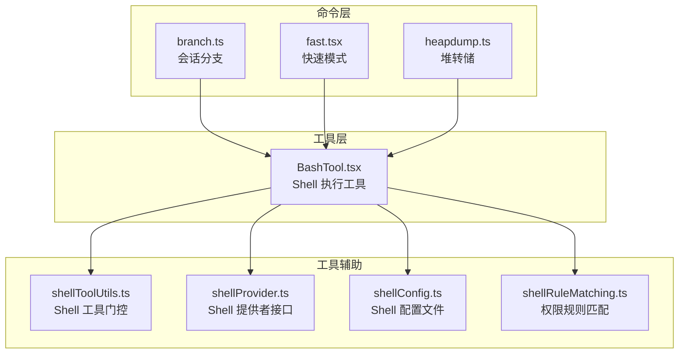

**图表来源**
- [src/commands/branch/branch.ts:1-297](file://src/commands/branch/branch.ts#L1-L297)
- [src/commands/heapdump/heapdump.ts:1-18](file://src/commands/heapdump/heapdump.ts#L1-L18)
- [src/commands/fast/fast.tsx:1-269](file://src/commands/fast/fast.tsx#L1-L269)
- [src/tools/BashTool/BashTool.tsx:1-1144](file://src/tools/BashTool/BashTool.tsx#L1-L1144)
- [src/utils/shell/shellToolUtils.ts:1-23](file://src/utils/shell/shellToolUtils.ts#L1-L23)
- [src/utils/shell/shellProvider.ts:1-34](file://src/utils/shell/shellProvider.ts#L1-L34)
- [src/utils/shellConfig.ts:1-168](file://src/utils/shellConfig.ts#L1-L168)
- [src/utils/permissions/shellRuleMatching.ts:1-229](file://src/utils/permissions/shellRuleMatching.ts#L1-L229)

**章节来源**
- [src/commands/branch/branch.ts:1-297](file://src/commands/branch/branch.ts#L1-L297)
- [src/commands/heapdump/heapdump.ts:1-18](file://src/commands/heapdump/heapdump.ts#L1-L18)
- [src/commands/fast/fast.tsx:1-269](file://src/commands/fast/fast.tsx#L1-L269)
- [src/tools/BashTool/BashTool.tsx:1-1144](file://src/tools/BashTool/BashTool.tsx#L1-L1144)
- [src/utils/shell/shellToolUtils.ts:1-23](file://src/utils/shell/shellToolUtils.ts#L1-L23)
- [src/utils/shell/shellProvider.ts:1-34](file://src/utils/shell/shellProvider.ts#L1-L34)
- [src/utils/shellConfig.ts:1-168](file://src/utils/shellConfig.ts#L1-L168)
- [src/utils/permissions/shellRuleMatching.ts:1-229](file://src/utils/permissions/shellRuleMatching.ts#L1-L229)

## 核心组件
- BashTool：Shell 命令执行的核心工具，负责输入校验、权限检查、命令解析、输出截断与持久化、后台任务调度、沙箱标注与错误语义解释。
- ShellProvider：抽象不同 Shell 的执行参数、环境覆盖与命令构建逻辑，支持 bash 与 powershell。
- shellToolUtils：根据平台与环境变量动态决定 PowerShellTool 是否启用，统一跨路径的门控一致性。
- shellConfig：管理 Shell 配置文件（如 .bashrc、.zshrc），支持查找/过滤 claude 别名、写入/读取行等。
- shellRuleMatching：提供权限规则解析与匹配（精确、前缀、通配符），并生成权限更新建议。
- branch：会话分支与标题生成，影响后续 Shell 执行的上下文与可追溯性。
- heapdump：触发堆转储，便于性能分析与问题诊断。
- fast：快速模式开关，影响模型推理与资源配额，间接影响 Shell 命令的并发与响应节奏。

**章节来源**
- [src/tools/BashTool/BashTool.tsx:1-1144](file://src/tools/BashTool/BashTool.tsx#L1-L1144)
- [src/utils/shell/shellProvider.ts:1-34](file://src/utils/shell/shellProvider.ts#L1-L34)
- [src/utils/shell/shellToolUtils.ts:1-23](file://src/utils/shell/shellToolUtils.ts#L1-L23)
- [src/utils/shellConfig.ts:1-168](file://src/utils/shellConfig.ts#L1-L168)
- [src/utils/permissions/shellRuleMatching.ts:1-229](file://src/utils/permissions/shellRuleMatching.ts#L1-L229)
- [src/commands/branch/branch.ts:1-297](file://src/commands/branch/branch.ts#L1-L297)
- [src/commands/heapdump/heapdump.ts:1-18](file://src/commands/heapdump/heapdump.ts#L1-L18)
- [src/commands/fast/fast.tsx:1-269](file://src/commands/fast/fast.tsx#L1-L269)

## 架构总览
下图展示了从命令入口到 Shell 执行与结果返回的关键流程，以及与权限、环境、沙箱、后台任务的交互关系。

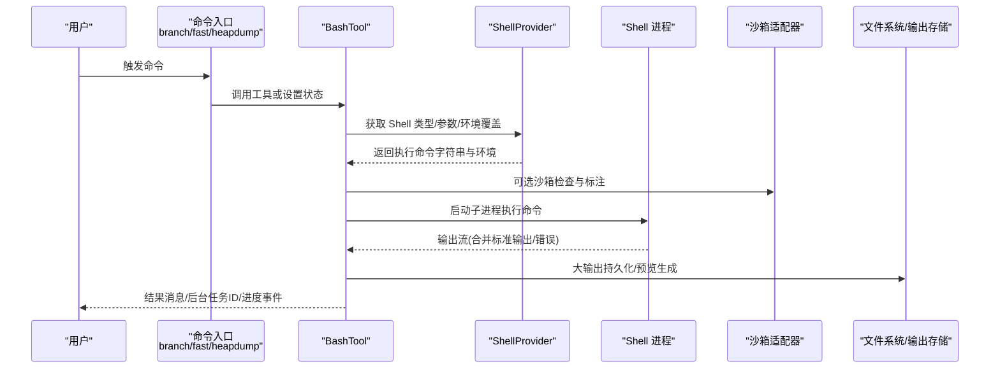

**图表来源**
- [src/tools/BashTool/BashTool.tsx:624-800](file://src/tools/BashTool/BashTool.tsx#L624-L800)
- [src/utils/shell/shellProvider.ts:5-33](file://src/utils/shell/shellProvider.ts#L5-L33)
- [src/utils/shell/shellToolUtils.ts:17-22](file://src/utils/shell/shellToolUtils.ts#L17-L22)
- [src/commands/branch/branch.ts:222-297](file://src/commands/branch/branch.ts#L222-L297)
- [src/commands/heapdump/heapdump.ts:1-18](file://src/commands/heapdump/heapdump.ts#L1-L18)
- [src/commands/fast/fast.tsx:16-40](file://src/commands/fast/fast.tsx#L16-L40)

## 详细组件分析

### BashTool 组件分析
BashTool 是 Shell 命令执行的核心，具备以下关键特性：
- 输入校验与描述：支持超时、描述、后台运行、沙箱覆盖等参数；自动识别 sleep 等阻塞命令并提示使用 Monitor 或后台运行。
- 权限与只读约束：基于 AST 解析与规则匹配，支持精确/前缀/通配符权限规则；对 cd 等命令进行只读约束检查。
- 输出处理：支持图像输出检测与压缩、大输出持久化、预览生成、结构化内容映射。
- 进度与后台任务：通过异步生成器提供实时进度；支持后台任务注册与通知；自动背景化长耗时命令。
- 沙箱标注：将沙箱违规信息标注到 stderr，便于用户感知与排查。
- Git 操作追踪与语义解释：对常见退出码进行语义化解读，记录 Git 锁冲突等事件。

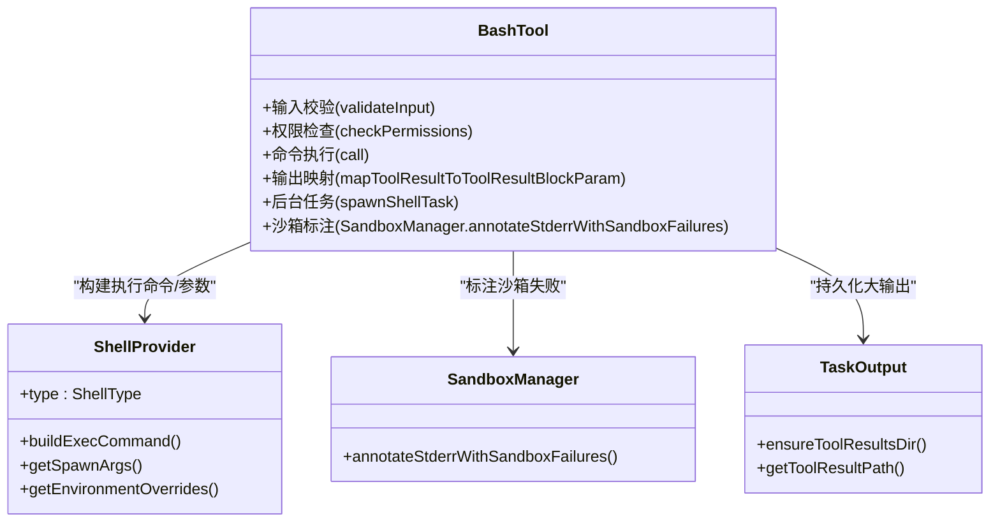

**图表来源**
- [src/tools/BashTool/BashTool.tsx:420-800](file://src/tools/BashTool/BashTool.tsx#L420-L800)
- [src/utils/shell/shellProvider.ts:5-33](file://src/utils/shell/shellProvider.ts#L5-L33)

**章节来源**
- [src/tools/BashTool/BashTool.tsx:420-800](file://src/tools/BashTool/BashTool.tsx#L420-L800)

### ShellProvider 接口与 Shell 类型
ShellProvider 定义了 Shell 类型、命令构建、spawn 参数与环境覆盖的统一接口，确保 bash 与 powershell 在执行细节上的一致性与可扩展性。

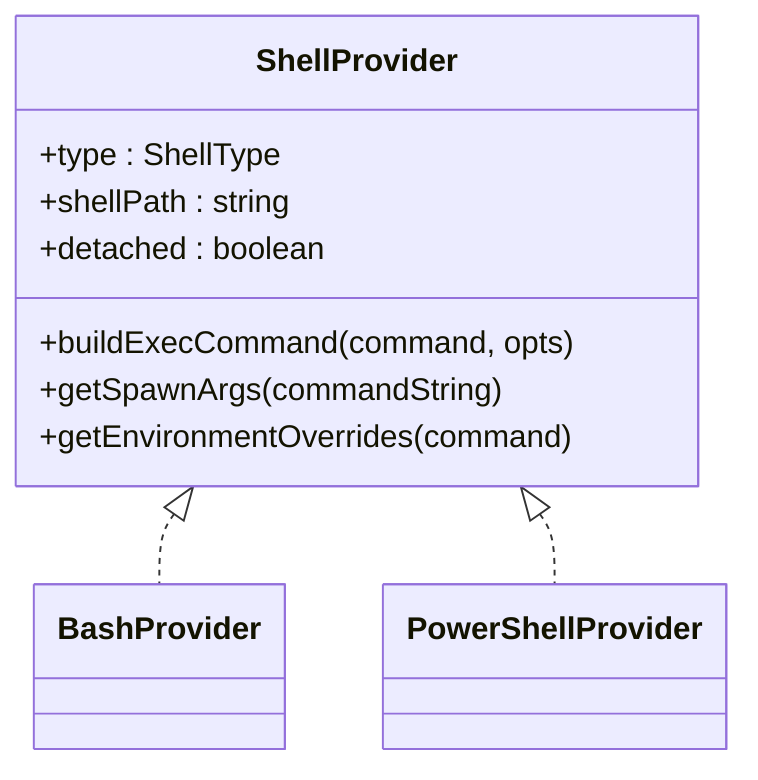

**图表来源**
- [src/utils/shell/shellProvider.ts:1-34](file://src/utils/shell/shellProvider.ts#L1-L34)

**章节来源**
- [src/utils/shell/shellProvider.ts:1-34](file://src/utils/shell/shellProvider.ts#L1-L34)

### PowerShellTool 启用门控
PowerShellTool 的启用受平台与环境变量控制，Ant 内部默认开启（可通过环境变量禁用），外部默认关闭（可通过环境变量启用）。该门控在工具列表可见性、路由与提示中保持一致。

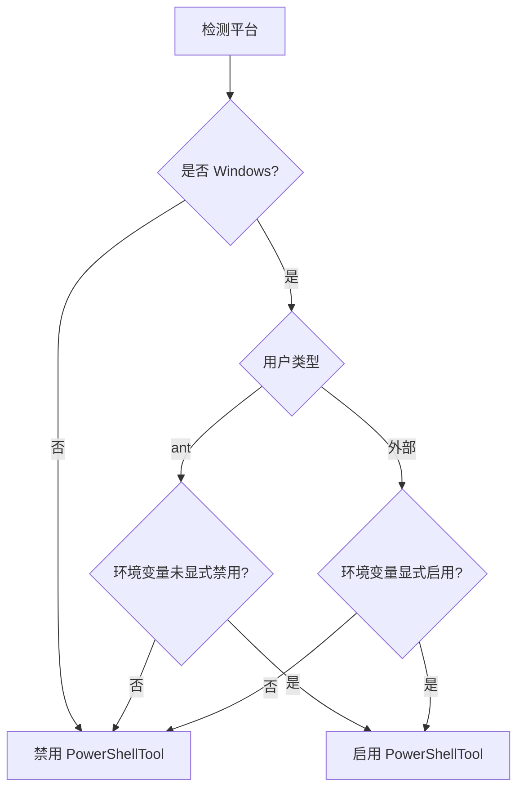

**图表来源**
- [src/utils/shell/shellToolUtils.ts:17-22](file://src/utils/shell/shellToolUtils.ts#L17-L22)

**章节来源**
- [src/utils/shell/shellToolUtils.ts:1-23](file://src/utils/shell/shellToolUtils.ts#L1-L23)

### Shell 配置文件管理
shellConfig 提供对 Shell 配置文件（如 .bashrc、.zshrc、fish config）的读取、过滤与写入能力，支持查找/移除 claude 别名、校验别名有效性等。

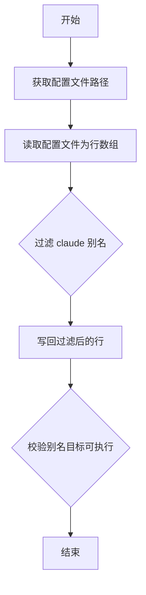

**图表来源**
- [src/utils/shellConfig.ts:26-168](file://src/utils/shellConfig.ts#L26-L168)

**章节来源**
- [src/utils/shellConfig.ts:1-168](file://src/utils/shellConfig.ts#L1-L168)

### 权限规则匹配与建议
shellRuleMatching 提供权限规则解析与匹配（精确、前缀、通配符），并能生成权限更新建议，帮助用户快速授权。

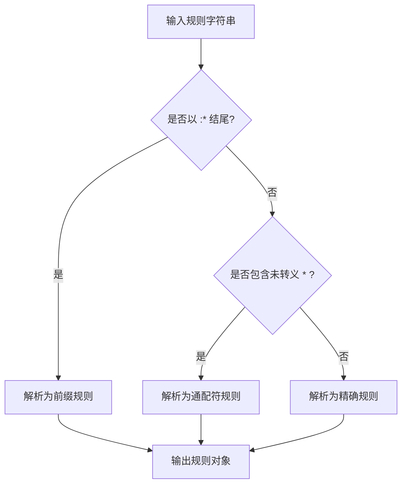

**图表来源**
- [src/utils/permissions/shellRuleMatching.ts:159-184](file://src/utils/permissions/shellRuleMatching.ts#L159-L184)

**章节来源**
- [src/utils/permissions/shellRuleMatching.ts:1-229](file://src/utils/permissions/shellRuleMatching.ts#L1-L229)

### branch 命令：会话分支与恢复
branch 命令用于复制当前对话为新会话，保留元数据并添加分叉溯源信息，便于后续恢复与对比。其流程包括读取当前会话、解析 JSONL、构建分叉条目、写入新会话文件、生成唯一标题与日志项。

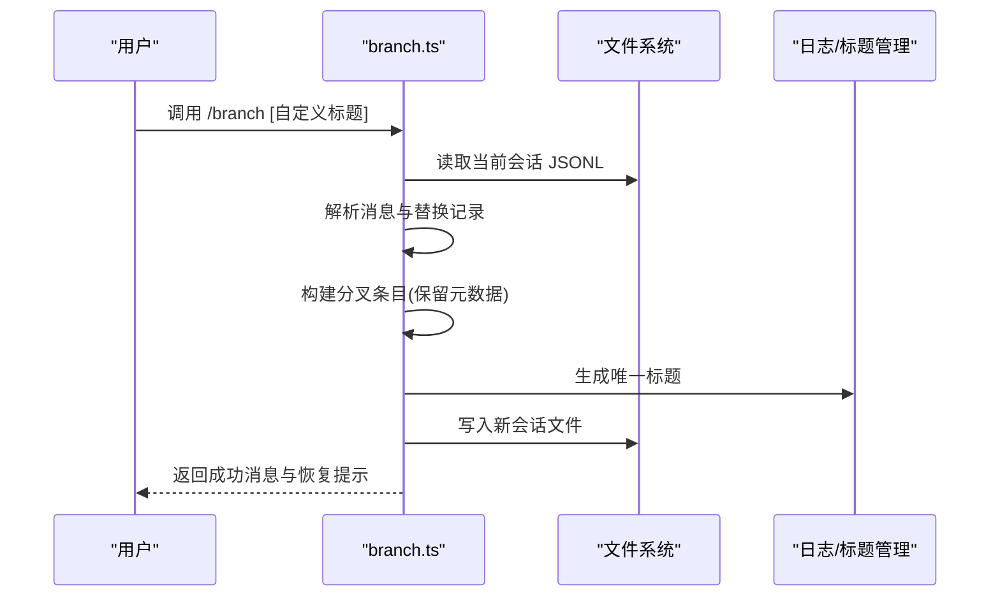

**图表来源**
- [src/commands/branch/branch.ts:61-173](file://src/commands/branch/branch.ts#L61-L173)

**章节来源**
- [src/commands/branch/branch.ts:1-297](file://src/commands/branch/branch.ts#L1-L297)

### heapdump 命令：内存堆转储
heapdump 命令触发堆转储服务，返回堆文件路径与诊断信息，便于性能分析与问题定位。

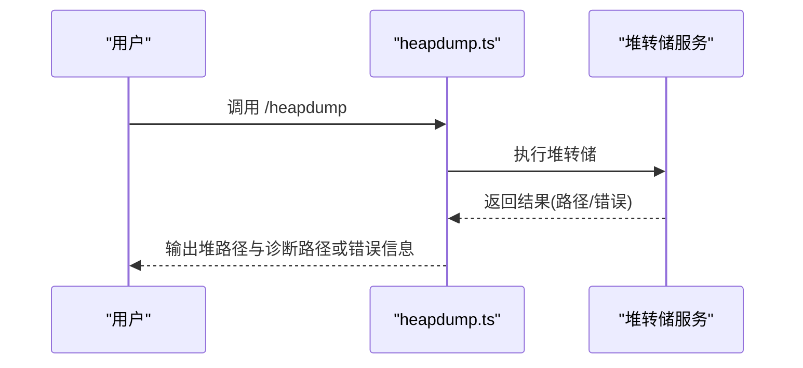

**图表来源**
- [src/commands/heapdump/heapdump.ts:1-18](file://src/commands/heapdump/heapdump.ts#L1-L18)

**章节来源**
- [src/commands/heapdump/heapdump.ts:1-18](file://src/commands/heapdump/heapdump.ts#L1-L18)

### fast 命令：快速模式开关
fast 命令提供快速模式的开启/关闭与状态展示，涉及组织级可用性检查、模型切换与计费提示。

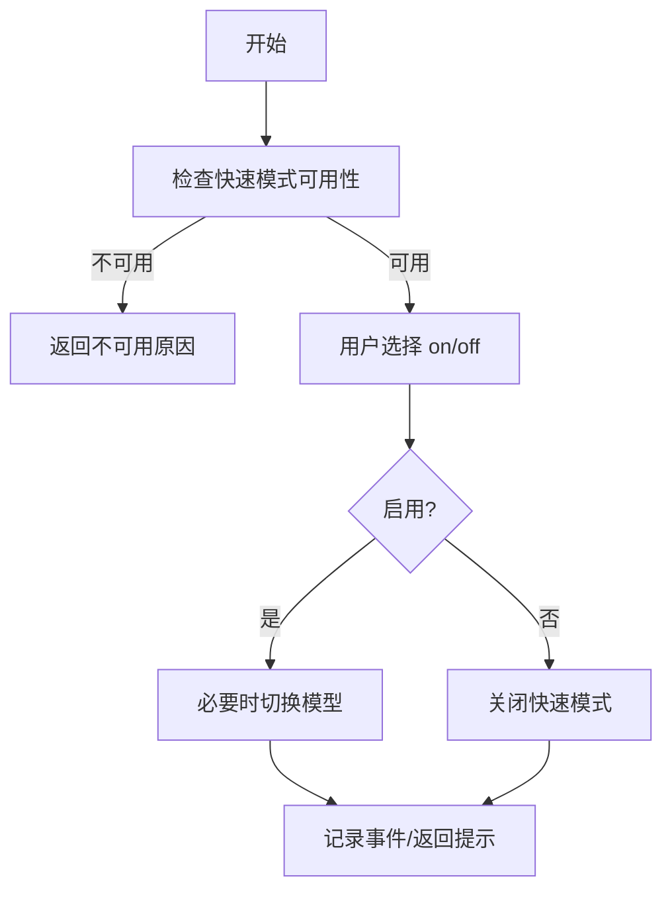

**图表来源**
- [src/commands/fast/fast.tsx:16-40](file://src/commands/fast/fast.tsx#L16-L40)

**章节来源**
- [src/commands/fast/fast.tsx:1-269](file://src/commands/fast/fast.tsx#L1-L269)

## 依赖关系分析
- BashTool 依赖 ShellProvider 提供的执行命令字符串与环境覆盖；依赖沙箱适配器进行违规标注；依赖任务输出工具进行大输出持久化。
- shellToolUtils 与 shellProvider 协同，保证 PowerShellTool 的启用一致性。
- shellConfig 为 Shell 环境注入与别名管理提供基础能力。
- shellRuleMatching 为 BashTool 的权限检查提供规则解析与匹配能力。

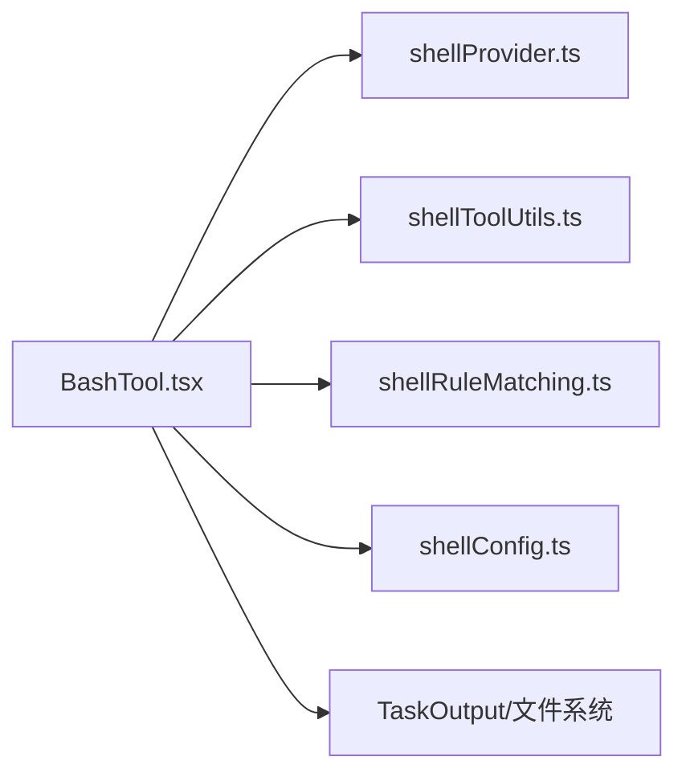

**图表来源**
- [src/tools/BashTool/BashTool.tsx:1-1144](file://src/tools/BashTool/BashTool.tsx#L1-L1144)
- [src/utils/shell/shellProvider.ts:1-34](file://src/utils/shell/shellProvider.ts#L1-L34)
- [src/utils/shell/shellToolUtils.ts:1-23](file://src/utils/shell/shellToolUtils.ts#L1-L23)
- [src/utils/permissions/shellRuleMatching.ts:1-229](file://src/utils/permissions/shellRuleMatching.ts#L1-L229)
- [src/utils/shellConfig.ts:1-168](file://src/utils/shellConfig.ts#L1-L168)

**章节来源**
- [src/tools/BashTool/BashTool.tsx:1-1144](file://src/tools/BashTool/BashTool.tsx#L1-L1144)
- [src/utils/shell/shellProvider.ts:1-34](file://src/utils/shell/shellProvider.ts#L1-L34)
- [src/utils/shell/shellToolUtils.ts:1-23](file://src/utils/shell/shellToolUtils.ts#L1-L23)
- [src/utils/permissions/shellRuleMatching.ts:1-229](file://src/utils/permissions/shellRuleMatching.ts#L1-L229)
- [src/utils/shellConfig.ts:1-168](file://src/utils/shellConfig.ts#L1-L168)

## 性能考量
- 后台任务与自动背景化：对于长时间运行的阻塞命令，BashTool 支持自动背景化并在助手模式下超过预算后转入后台，减少主线程阻塞。
- 大输出持久化：当输出超过阈值时，自动落盘并生成预览，避免内存压力与模型传输开销。
- 图像输出压缩：对图像类输出进行尺寸与大小压缩，降低带宽与渲染成本。
- 快速模式：通过调整模型与配额，提升高频命令的响应速度，但需注意额外计费与限额。

[本节为通用指导，无需列出具体文件来源]

## 故障排除指南
- 命令被阻止（sleep 等阻塞命令）：根据提示改用 Monitor 工具或设置 run_in_background: true；短延迟（<2秒）可保留。
- Git 锁冲突：出现 .git/index.lock 文件存在错误时，先释放锁或等待其他进程完成。
- 沙箱违规：查看 stderr 中的沙箱标注，确认是否因路径越权或权限不足导致；必要时调整规则或关闭沙箱覆盖。
- 输出过大：若出现“已持久化”提示，使用文件读取工具访问完整输出；注意磁盘占用与最大持久化大小限制。
- PowerShellTool 不可用：确认平台为 Windows 且满足环境变量要求；否则使用 Bash 执行。
- 快速模式不可用：检查组织策略与限额；必要时关闭快速模式或等待冷却重试。

**章节来源**
- [src/tools/BashTool/BashTool.tsx:524-538](file://src/tools/BashTool/BashTool.tsx#L524-L538)
- [src/tools/BashTool/BashTool.tsx:692-720](file://src/tools/BashTool/BashTool.tsx#L692-L720)
- [src/utils/shell/shellToolUtils.ts:17-22](file://src/utils/shell/shellToolUtils.ts#L17-L22)
- [src/commands/fast/fast.tsx:226-247](file://src/commands/fast/fast.tsx#L226-L247)

## 结论
本文从架构、执行、安全与运维四个维度梳理了 Shell 执行命令的相关能力与实践。BashTool 作为核心执行器，结合 ShellProvider、权限规则与沙箱标注，提供了安全可控、可观测、可后台化的命令执行体验；branch、heapdump、fast 等命令则分别从会话管理、性能分析与资源配额角度完善了整体链路。建议在生产环境中优先启用权限规则与沙箱，合理使用后台任务与快速模式，并配合堆转储与日志进行持续优化。

[本节为总结性内容，无需列出具体文件来源]

## 附录
- 安全最佳实践
  - 使用精确/前缀/通配符权限规则最小授权，定期审计与更新。
  - 对高风险命令（如文件写入、网络请求）启用沙箱并关注标注信息。
  - 避免在命令中拼接用户输入，优先使用参数化与白名单校验。
  - 合理设置超时与后台任务，防止长时间阻塞。
- 调试与性能分析
  - 使用 /heapdump 生成堆文件，结合诊断路径定位内存热点。
  - 开启后台任务并订阅进度事件，观察吞吐与延迟。
  - 利用 fast 模式加速高频命令，同时关注计费与限额。
- 实际使用场景
  - 代码检索与统计：使用 grep/find/ls 等命令组合，结合只读约束与输出折叠。
  - 会话分支与对比：通过 branch 创建分支，对比不同执行路径的结果。
  - 环境注入与别名管理：通过 shellConfig 管理 claude 别名与 PATH，确保执行环境一致。

[本节为通用指导，无需列出具体文件来源]