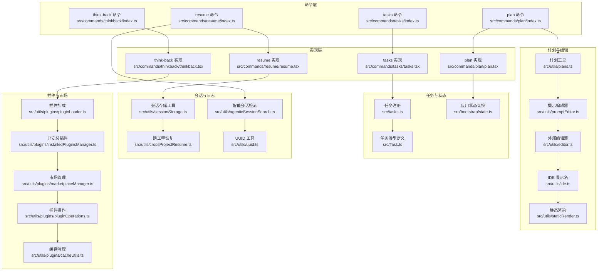
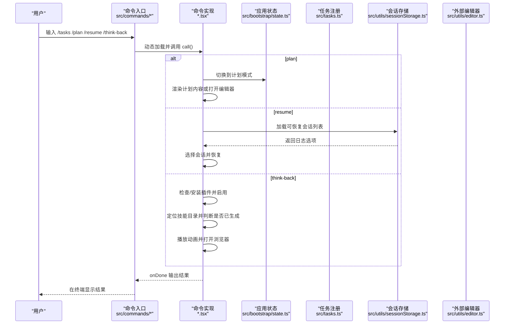
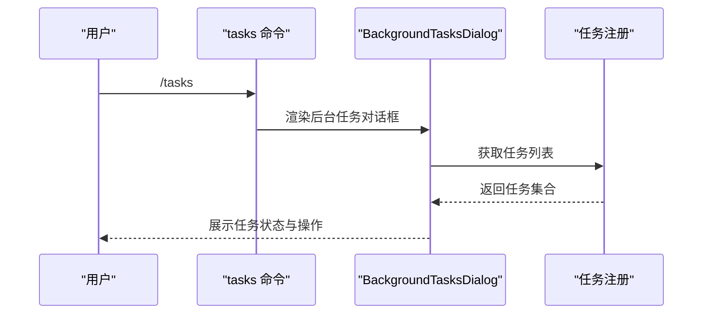
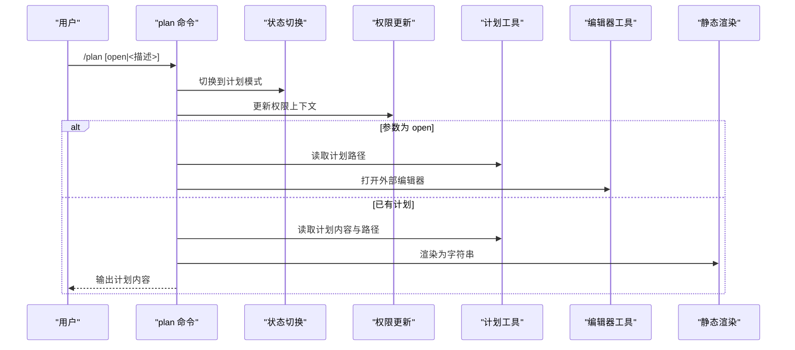
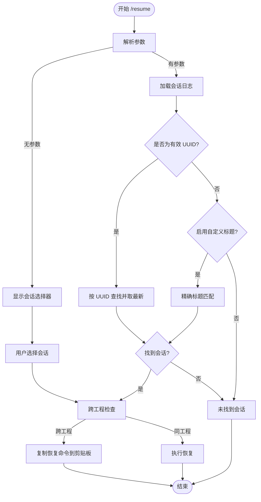
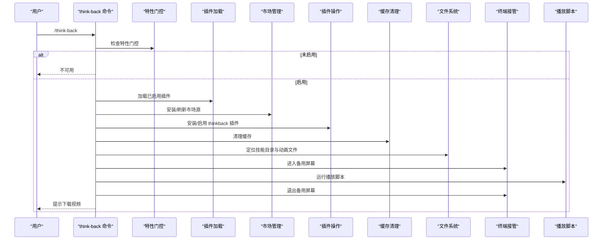
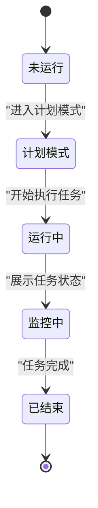
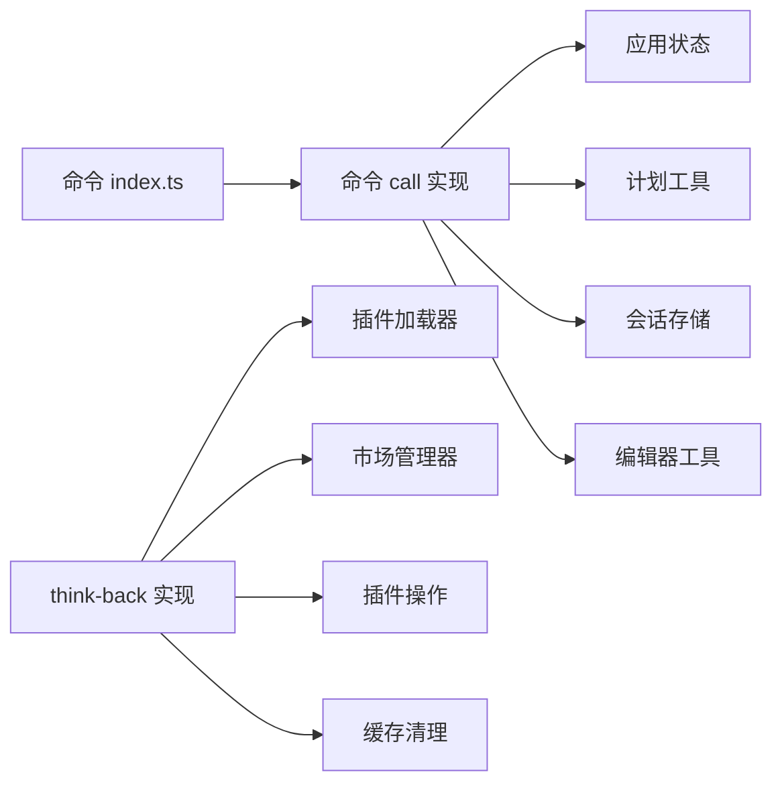

# 任务管理命令

<cite>
**本文引用的文件**
- [src/commands/tasks/index.ts](file://src/commands/tasks/index.ts)
- [src/commands/tasks/tasks.tsx](file://src/commands/tasks/tasks.tsx)
- [src/components/tasks/BackgroundTasksDialog.tsx](file://src/components/tasks/BackgroundTasksDialog.tsx)
- [src/tasks.ts](file://src/tasks.ts)
- [src/Task.ts](file://src/Task.ts)
- [src/commands/plan/index.ts](file://src/commands/plan/index.ts)
- [src/commands/plan/plan.tsx](file://src/commands/plan/plan.tsx)
- [src/bootstrap/state.ts](file://src/bootstrap/state.ts)
- [src/utils/plans.ts](file://src/utils/plans.ts)
- [src/utils/editor.ts](file://src/utils/editor.ts)
- [src/utils/ide.ts](file://src/utils/ide.ts)
- [src/utils/promptEditor.ts](file://src/utils/promptEditor.ts)
- [src/utils/staticRender.ts](file://src/utils/staticRender.ts)
- [src/utils/permissions/permissionSetup.ts](file://src/utils/permissions/permissionSetup.ts)
- [src/utils/permissions/PermissionUpdate.ts](file://src/utils/permissions/PermissionUpdate.ts)
- [src/commands/rewind/index.ts](file://src/commands/rewind/index.ts)
- [src/commands/resume/index.ts](file://src/commands/resume/index.ts)
- [src/commands/resume/resume.tsx](file://src/commands/resume/resume.tsx)
- [src/components/LogSelector.tsx](file://src/components/LogSelector.tsx)
- [src/hooks/useTerminalSize.ts](file://src/hooks/useTerminalSize.ts)
- [src/utils/sessionStorage.ts](file://src/utils/sessionStorage.ts)
- [src/utils/crossProjectResume.ts](file://src/utils/crossProjectResume.ts)
- [src/utils/agenticSessionSearch.ts](file://src/utils/agenticSessionSearch.ts)
- [src/utils/uuid.ts](file://src/utils/uuid.ts)
- [src/commands/thinkback/index.ts](file://src/commands/thinkback/index.ts)
- [src/commands/thinkback/thinkback.tsx](file://src/commands/thinkback/thinkback.tsx)
- [src/services/analytics/growthbook.ts](file://src/services/analytics/growthbook.ts)
- [src/utils/plugins/pluginLoader.ts](file://src/utils/plugins/pluginLoader.ts)
- [src/utils/plugins/installedPluginsManager.ts](file://src/utils/plugins/installedPluginsManager.ts)
- [src/utils/plugins/marketplaceManager.ts](file://src/utils/plugins/marketplaceManager.ts)
- [src/utils/plugins/pluginOperations.ts](file://src/utils/plugins/pluginOperations.ts)
- [src/utils/plugins/cacheUtils.ts](file://src/utils/plugins/cacheUtils.ts)
- [src/utils/execFileNoThrow.ts](file://src/utils/execFileNoThrow.ts)
- [src/utils/platform.ts](file://src/utils/platform.ts)
- [src/ink/instances.ts](file://src/ink/instances.ts)
- [src/ink.ts](file://src/ink.ts)
</cite>

## 目录
1. [简介](#简介)
2. [项目结构](#项目结构)
3. [核心组件](#核心组件)
4. [架构总览](#架构总览)
5. [详细组件分析](#详细组件分析)
6. [依赖分析](#依赖分析)
7. [性能考虑](#性能考虑)
8. [故障排查指南](#故障排查指南)
9. [结论](#结论)
10. [附录](#附录)

## 简介
本文件面向“任务管理命令”的使用与实现，系统性梳理以下命令：tasks、plan、rewind、resume、thinkback。内容涵盖：
- 命令功能与交互流程
- 任务生命周期与状态管理
- 计划制定与编辑机制
- 回溯与状态恢复策略
- 会话检索与跨工程恢复
- 年度回顾动画插件安装与播放流程
- 调度、并发与资源分配建议
- 优先级与依赖处理思路
- 执行监控与可观测性实践

## 项目结构
围绕任务管理命令的相关模块分布如下：
- 命令入口与定义：src/commands/{tasks, plan, rewind, resume, thinkback}/index.ts
- 命令实现：src/commands/{tasks, plan, resume, thinkback}.tsx
- 任务注册与类型：src/tasks.ts、src/Task.ts
- 会话与日志工具：src/utils/sessionStorage.ts、src/utils/crossProjectResume.ts、src/utils/agenticSessionSearch.ts、src/utils/uuid.ts
- 计划与编辑：src/utils/plans.ts、src/utils/promptEditor.ts、src/utils/editor.ts、src/utils/ide.ts、src/utils/staticRender.ts
- 插件与市场：src/utils/plugins/*、src/services/analytics/growthbook.ts
- UI 组件：src/components/tasks/BackgroundTasksDialog.tsx、src/components/LogSelector.tsx、src/hooks/useTerminalSize.ts

图表来源
- [src/commands/tasks/index.ts:1-12](file://src/commands/tasks/index.ts#L1-L12)
- [src/commands/tasks/tasks.tsx:1-8](file://src/commands/tasks/tasks.tsx#L1-L8)
- [src/tasks.ts:1-40](file://src/tasks.ts#L1-L40)
- [src/Task.ts](file://src/Task.ts)
- [src/commands/plan/index.ts:1-12](file://src/commands/plan/index.ts#L1-L12)
- [src/commands/plan/plan.tsx:1-122](file://src/commands/plan/plan.tsx#L1-L122)
- [src/bootstrap/state.ts](file://src/bootstrap/state.ts)
- [src/utils/plans.ts](file://src/utils/plans.ts)
- [src/utils/promptEditor.ts](file://src/utils/promptEditor.ts)
- [src/utils/editor.ts](file://src/utils/editor.ts)
- [src/utils/ide.ts](file://src/utils/ide.ts)
- [src/utils/staticRender.ts](file://src/utils/staticRender.ts)
- [src/commands/resume/index.ts:1-13](file://src/commands/resume/index.ts#L1-L13)
- [src/commands/resume/resume.tsx:1-276](file://src/commands/resume/resume.tsx#L1-L276)
- [src/utils/sessionStorage.ts](file://src/utils/sessionStorage.ts)
- [src/utils/crossProjectResume.ts](file://src/utils/crossProjectResume.ts)
- [src/utils/agenticSessionSearch.ts](file://src/utils/agenticSessionSearch.ts)
- [src/utils/uuid.ts](file://src/utils/uuid.ts)
- [src/commands/thinkback/index.ts:1-14](file://src/commands/thinkback/index.ts#L1-L14)
- [src/commands/thinkback/thinkback.tsx:1-554](file://src/commands/thinkback/thinkback.tsx#L1-L554)
- [src/utils/plugins/pluginLoader.ts](file://src/utils/plugins/pluginLoader.ts)
- [src/utils/plugins/installedPluginsManager.ts](file://src/utils/plugins/installedPluginsManager.ts)
- [src/utils/plugins/marketplaceManager.ts](file://src/utils/plugins/marketplaceManager.ts)
- [src/utils/plugins/pluginOperations.ts](file://src/utils/plugins/pluginOperations.ts)
- [src/utils/plugins/cacheUtils.ts](file://src/utils/plugins/cacheUtils.ts)

章节来源
- [src/commands/tasks/index.ts:1-12](file://src/commands/tasks/index.ts#L1-L12)
- [src/commands/tasks/tasks.tsx:1-8](file://src/commands/tasks/tasks.tsx#L1-L8)
- [src/commands/plan/index.ts:1-12](file://src/commands/plan/index.ts#L1-L12)
- [src/commands/plan/plan.tsx:1-122](file://src/commands/plan/plan.tsx#L1-L122)
- [src/commands/resume/index.ts:1-13](file://src/commands/resume/index.ts#L1-L13)
- [src/commands/resume/resume.tsx:1-276](file://src/commands/resume/resume.tsx#L1-L276)
- [src/commands/thinkback/index.ts:1-14](file://src/commands/thinkback/index.ts#L1-L14)
- [src/commands/thinkback/thinkback.tsx:1-554](file://src/commands/thinkback/thinkback.tsx#L1-L554)

## 核心组件
- 任务列表与管理命令（tasks）
  - 命令定义与别名：tasks 命令通过本地 JSX 类型注册，别名包括 bashes。
  - 交互方式：调用后打开后台任务对话框，用于查看与管理后台任务。
  - 关键实现：命令入口负责动态加载实现；实现文件返回一个 JSX 组件，该组件以工具使用上下文作为参数，并在完成时回调 onDone。

- 计划模式命令（plan）
  - 功能：启用计划模式或查看当前会话计划；支持通过参数描述计划内容，或打开外部编辑器进行编辑。
  - 状态切换：通过应用状态切换函数进入计划模式，并更新权限上下文。
  - 计划读取与编辑：从计划工具中读取计划内容与路径；若参数为 open，则在外部编辑器中打开；否则渲染计划内容并在终端输出。

- 回溯命令（rewind）
  - 功能：将代码与/或对话恢复到先前时间点。
  - 命令特性：描述信息包含别名 checkpoint；支持非交互式能力未启用。

- 会话恢复命令（resume）
  - 功能：恢复之前的对话；支持按会话 ID 或自定义标题搜索；支持跨工程恢复。
  - 检索策略：先尝试 UUID 匹配，再尝试精确自定义标题匹配；若无匹配则报错并提示使用 /resume 选择具体会话。
  - 跨工程处理：检测是否来自不同目录，若是则生成并复制恢复命令到剪贴板，避免直接恢复导致上下文不一致。

- 年度回顾命令（think-back）
  - 功能：年度回顾动画生成与播放；内部封装插件安装、启用与动画播放逻辑。
  - 启用条件：受特性门控控制，仅在特定条件下可用。
  - 安装流程：检查并安装市场源、安装/启用插件、清理缓存；完成后定位技能目录并判断是否已生成动画。
  - 播放流程：进入备用屏幕接管终端，运行播放脚本；结束后尝试在浏览器打开 HTML 文件以便下载视频。

章节来源
- [src/commands/tasks/index.ts:1-12](file://src/commands/tasks/index.ts#L1-L12)
- [src/commands/tasks/tasks.tsx:1-8](file://src/commands/tasks/tasks.tsx#L1-L8)
- [src/commands/plan/index.ts:1-12](file://src/commands/plan/index.ts#L1-L12)
- [src/commands/plan/plan.tsx:64-121](file://src/commands/plan/plan.tsx#L64-L121)
- [src/commands/rewind/index.ts:1-14](file://src/commands/rewind/index.ts#L1-L14)
- [src/commands/resume/index.ts:1-13](file://src/commands/resume/index.ts#L1-L13)
- [src/commands/resume/resume.tsx:195-275](file://src/commands/resume/resume.tsx#L195-L275)
- [src/commands/thinkback/index.ts:1-14](file://src/commands/thinkback/index.ts#L1-L14)
- [src/commands/thinkback/thinkback.tsx:551-554](file://src/commands/thinkback/thinkback.tsx#L551-L554)

## 架构总览
下图展示了任务管理命令的高层交互与数据流：

图表来源
- [src/commands/plan/plan.tsx:64-121](file://src/commands/plan/plan.tsx#L64-L121)
- [src/commands/resume/resume.tsx:195-275](file://src/commands/resume/resume.tsx#L195-L275)
- [src/commands/thinkback/thinkback.tsx:551-554](file://src/commands/thinkback/thinkback.tsx#L551-L554)
- [src/bootstrap/state.ts](file://src/bootstrap/state.ts)
- [src/utils/sessionStorage.ts](file://src/utils/sessionStorage.ts)
- [src/utils/editor.ts](file://src/utils/editor.ts)

## 详细组件分析

### 任务列表与管理（tasks）
- 命令定义：本地 JSX 命令，名称为 tasks，别名为 bashes。
- 交互流程：调用后返回一个 JSX 组件，该组件承载后台任务对话框，允许用户查看与管理后台任务。
- 任务注册：通过统一的任务注册函数获取所有任务类型，便于后续扩展与发现。

图表来源
- [src/commands/tasks/index.ts:1-12](file://src/commands/tasks/index.ts#L1-L12)
- [src/commands/tasks/tasks.tsx:1-8](file://src/commands/tasks/tasks.tsx#L1-L8)
- [src/tasks.ts:22-40](file://src/tasks.ts#L22-L40)

章节来源
- [src/commands/tasks/index.ts:1-12](file://src/commands/tasks/index.ts#L1-L12)
- [src/commands/tasks/tasks.tsx:1-8](file://src/commands/tasks/tasks.tsx#L1-L8)
- [src/tasks.ts:22-40](file://src/tasks.ts#L22-L40)

### 计划模式（plan）
- 功能要点
  - 若不在计划模式，调用状态切换函数进入计划模式，并更新权限上下文。
  - 若已处于计划模式，读取当前计划内容与路径；若参数为 open，则在外部编辑器中打开。
  - 支持将渲染后的计划内容以字符串形式传递给 onDone，便于在终端显示。
- 关键实现路径
  - 状态切换与权限更新：通过应用状态切换与权限更新工具实现。
  - 计划读取与编辑：通过计划工具读取计划内容与路径；通过提示编辑器与外部编辑器工具打开文件。
  - 静态渲染：将 React 组件渲染为字符串，供 onDone 使用。

图表来源
- [src/commands/plan/plan.tsx:64-121](file://src/commands/plan/plan.tsx#L64-L121)
- [src/bootstrap/state.ts](file://src/bootstrap/state.ts)
- [src/utils/plans.ts](file://src/utils/plans.ts)
- [src/utils/promptEditor.ts](file://src/utils/promptEditor.ts)
- [src/utils/editor.ts](file://src/utils/editor.ts)
- [src/utils/ide.ts](file://src/utils/ide.ts)
- [src/utils/staticRender.ts](file://src/utils/staticRender.ts)

章节来源
- [src/commands/plan/index.ts:1-12](file://src/commands/plan/index.ts#L1-L12)
- [src/commands/plan/plan.tsx:64-121](file://src/commands/plan/plan.tsx#L64-L121)

### 会话恢复（resume）
- 功能要点
  - 无参数时打开选择器，列出可恢复会话；支持切换“全部项目”视图。
  - 支持按 UUID 精确匹配；若匹配多个则按修改时间排序取最新。
  - 支持按自定义标题精确匹配；若匹配多个则提示选择；若未匹配则提示找不到。
  - 跨工程恢复：若目标会话来自不同目录，生成并复制恢复命令到剪贴板，避免直接恢复导致上下文不一致。
- 关键实现路径
  - 会话加载：根据当前工作树路径加载同仓库或全部项目的会话日志。
  - 可恢复过滤：排除侧链与当前会话。
  - 交叉工程检查：判断是否同一仓库的不同工作树，决定直接恢复或给出命令。
  - UUID 校验与日志补全：对轻量日志加载完整日志，确保恢复上下文完整。

图表来源
- [src/commands/resume/resume.tsx:195-275](file://src/commands/resume/resume.tsx#L195-L275)
- [src/utils/sessionStorage.ts](file://src/utils/sessionStorage.ts)
- [src/utils/crossProjectResume.ts](file://src/utils/crossProjectResume.ts)
- [src/utils/agenticSessionSearch.ts](file://src/utils/agenticSessionSearch.ts)
- [src/utils/uuid.ts](file://src/utils/uuid.ts)

章节来源
- [src/commands/resume/index.ts:1-13](file://src/commands/resume/index.ts#L1-L13)
- [src/commands/resume/resume.tsx:195-275](file://src/commands/resume/resume.tsx#L195-L275)

### 年度回顾（think-back）
- 功能要点
  - 特性门控：仅在满足特定条件时可用。
  - 安装与启用：自动检查并安装市场源、安装/启用插件、清理缓存。
  - 技能目录：定位 thinkback 技能目录，判断是否已生成动画。
  - 播放与导出：进入备用屏幕接管终端，运行播放脚本；结束后尝试在浏览器打开 HTML 文件以便下载视频。
- 关键实现路径
  - 插件生态：通过插件加载器、已安装插件管理器、市场管理器与插件操作工具协同工作。
  - 缓存与刷新：安装/启用后清理相关缓存，确保新版本生效。
  - 终端接管：通过 Ink 实例进入备用屏幕，播放结束后退出备用屏幕。

图表来源
- [src/commands/thinkback/thinkback.tsx:551-554](file://src/commands/thinkback/thinkback.tsx#L551-L554)
- [src/services/analytics/growthbook.ts](file://src/services/analytics/growthbook.ts)
- [src/utils/plugins/pluginLoader.ts](file://src/utils/plugins/pluginLoader.ts)
- [src/utils/plugins/marketplaceManager.ts](file://src/utils/plugins/marketplaceManager.ts)
- [src/utils/plugins/pluginOperations.ts](file://src/utils/plugins/pluginOperations.ts)
- [src/utils/plugins/cacheUtils.ts](file://src/utils/plugins/cacheUtils.ts)
- [src/ink/instances.ts](file://src/ink/instances.ts)
- [src/utils/execFileNoThrow.ts](file://src/utils/execFileNoThrow.ts)
- [src/utils/platform.ts](file://src/utils/platform.ts)

章节来源
- [src/commands/thinkback/index.ts:1-14](file://src/commands/thinkback/index.ts#L1-L14)
- [src/commands/thinkback/thinkback.tsx:551-554](file://src/commands/thinkback/thinkback.tsx#L551-L554)

### 任务生命周期与状态管理
- 生命周期阶段
  - 创建：通过任务注册函数获取任务类型，初始化任务状态。
  - 运行：由任务类型驱动执行，状态在任务内部维护。
  - 监控：通过后台任务对话框展示任务状态与进度。
  - 结束：任务完成后清理资源并更新状态。
- 状态切换
  - 计划模式：通过应用状态切换进入计划模式，更新权限上下文。
  - 会话恢复：在恢复前进行跨工程检查，确保上下文一致性。

图表来源
- [src/bootstrap/state.ts](file://src/bootstrap/state.ts)
- [src/components/tasks/BackgroundTasksDialog.tsx](file://src/components/tasks/BackgroundTasksDialog.tsx)

章节来源
- [src/tasks.ts:22-40](file://src/tasks.ts#L22-L40)
- [src/commands/plan/plan.tsx:72-92](file://src/commands/plan/plan.tsx#L72-L92)

### 计划制定机制
- 计划内容来源：从计划工具读取当前会话计划。
- 编辑流程：支持在外部编辑器中打开计划文件进行编辑；编辑完成后可重新渲染显示。
- 权限与模式：进入计划模式需要更新权限上下文，确保工具使用权限符合计划模式要求。

章节来源
- [src/commands/plan/plan.tsx:94-121](file://src/commands/plan/plan.tsx#L94-L121)
- [src/utils/plans.ts](file://src/utils/plans.ts)
- [src/utils/promptEditor.ts](file://src/utils/promptEditor.ts)
- [src/utils/editor.ts](file://src/utils/editor.ts)
- [src/utils/ide.ts](file://src/utils/ide.ts)
- [src/utils/staticRender.ts](file://src/utils/staticRender.ts)

### 回溯功能与状态恢复策略
- 回溯命令：rewind 命令用于将代码与/或对话恢复到先前时间点。
- 恢复策略：resume 命令提供多种恢复方式，包括 UUID 精确匹配、自定义标题匹配与跨工程恢复；对轻量日志进行补全以保证上下文完整性。

章节来源
- [src/commands/rewind/index.ts:1-14](file://src/commands/rewind/index.ts#L1-L14)
- [src/commands/resume/resume.tsx:214-275](file://src/commands/resume/resume.tsx#L214-L275)

### 并发控制与资源分配
- 并发模型：命令实现采用异步调用与 React 组件渲染，避免阻塞主线程。
- 资源分配：插件安装与启用过程涉及磁盘读写与网络请求，需注意缓存清理与错误处理。
- UI 渲染：通过静态渲染将 React 组件输出为字符串，减少不必要的重渲染。

章节来源
- [src/commands/thinkback/thinkback.tsx:163-252](file://src/commands/thinkback/thinkback.tsx#L163-L252)
- [src/utils/staticRender.ts](file://src/utils/staticRender.ts)

### 任务优先级管理与依赖处理
- 优先级：当前命令实现未显式暴露优先级字段；可通过任务类型与执行顺序间接影响优先级。
- 依赖：任务依赖于任务注册与类型定义；计划模式依赖于应用状态与权限上下文；恢复命令依赖于会话存储与跨工程检查工具。

章节来源
- [src/tasks.ts:22-40](file://src/tasks.ts#L22-L40)
- [src/Task.ts](file://src/Task.ts)
- [src/bootstrap/state.ts](file://src/bootstrap/state.ts)
- [src/utils/sessionStorage.ts](file://src/utils/sessionStorage.ts)
- [src/utils/crossProjectResume.ts](file://src/utils/crossProjectResume.ts)

### 执行监控与可观测性
- 任务监控：通过后台任务对话框展示任务状态与进度。
- 计划监控：渲染计划内容并在终端输出，便于用户确认计划状态。
- 恢复监控：在恢复过程中显示加载与恢复状态，提升用户体验。

章节来源
- [src/components/tasks/BackgroundTasksDialog.tsx](file://src/components/tasks/BackgroundTasksDialog.tsx)
- [src/commands/plan/plan.tsx:115-121](file://src/commands/plan/plan.tsx#L115-L121)
- [src/commands/resume/resume.tsx:178-190](file://src/commands/resume/resume.tsx#L178-L190)

## 依赖分析
- 命令到实现的依赖：各命令通过 index.ts 定义，call 函数在运行时动态加载实现。
- 实现到工具的依赖：实现文件依赖于应用状态、权限工具、计划工具、会话存储工具、编辑器工具等。
- 插件生态依赖：think-back 命令依赖插件加载器、市场管理器与插件操作工具，形成完整的插件安装与启用闭环。

图表来源
- [src/commands/plan/plan.tsx:64-121](file://src/commands/plan/plan.tsx#L64-L121)
- [src/commands/resume/resume.tsx:195-275](file://src/commands/resume/resume.tsx#L195-L275)
- [src/commands/thinkback/thinkback.tsx:551-554](file://src/commands/thinkback/thinkback.tsx#L551-L554)
- [src/utils/plugins/pluginLoader.ts](file://src/utils/plugins/pluginLoader.ts)
- [src/utils/plugins/marketplaceManager.ts](file://src/utils/plugins/marketplaceManager.ts)
- [src/utils/plugins/pluginOperations.ts](file://src/utils/plugins/pluginOperations.ts)
- [src/utils/plugins/cacheUtils.ts](file://src/utils/plugins/cacheUtils.ts)

章节来源
- [src/commands/plan/plan.tsx:64-121](file://src/commands/plan/plan.tsx#L64-L121)
- [src/commands/resume/resume.tsx:195-275](file://src/commands/resume/resume.tsx#L195-L275)
- [src/commands/thinkback/thinkback.tsx:551-554](file://src/commands/thinkback/thinkback.tsx#L551-L554)

## 性能考虑
- 异步加载与渲染：命令实现采用异步调用与静态渲染，降低阻塞风险。
- 缓存与刷新：插件安装/启用后及时清理缓存，避免陈旧数据影响性能。
- 会话加载优化：对轻量日志进行补全，减少重复 IO 操作。
- 终端接管：仅在播放动画时进入备用屏幕，播放结束后立即退出，减少对用户交互的影响。

## 故障排查指南
- 计划命令
  - 无法打开编辑器：检查外部编辑器配置与 IDE 显示名工具。
  - 计划为空：确认计划文件是否存在且可读。
- 恢复命令
  - 会话未找到：确认 UUID 是否正确，或尝试使用自定义标题匹配。
  - 跨工程恢复失败：检查跨工程恢复检查逻辑，确保命令复制到剪贴板。
- think-back 命令
  - 插件安装失败：检查市场源安装与插件启用状态，清理缓存后重试。
  - 动画播放异常：确认动画数据与播放脚本存在，检查终端接管与平台命令。

章节来源
- [src/commands/plan/plan.tsx:104-112](file://src/commands/plan/plan.tsx#L104-L112)
- [src/commands/resume/resume.tsx:146-172](file://src/commands/resume/resume.tsx#L146-L172)
- [src/commands/thinkback/thinkback.tsx:74-103](file://src/commands/thinkback/thinkback.tsx#L74-L103)

## 结论
本文档系统梳理了任务管理命令（tasks、plan、rewind、resume、thinkback）的功能与实现，覆盖了任务生命周期、计划制定、回溯与恢复、插件生态与动画播放等关键环节。通过命令层、实现层与工具层的清晰分层，配合异步加载、静态渲染与缓存清理等性能优化手段，实现了良好的用户体验与可维护性。建议在实际使用中结合会话检索与跨工程恢复策略，合理规划任务优先级与依赖关系，持续完善可观测性与故障排查流程。

## 附录
- 实际应用场景与工作流程优化建议
  - 任务管理：使用 tasks 命令集中查看与管理后台任务，结合后台任务对话框进行状态监控。
  - 计划制定：在 plan 命令中启用计划模式，编写与编辑计划内容，必要时在外部编辑器中进行深度修改。
  - 会话恢复：优先使用 UUID 或自定义标题进行精确匹配；跨工程恢复时遵循命令提示，避免上下文不一致。
  - 年度回顾：首次运行时完成插件安装与启用，后续可直接播放动画并导出视频。
  - 工作流程优化：将任务分解为可监控的小步骤，结合计划模式与恢复命令，提升迭代效率与可追溯性。