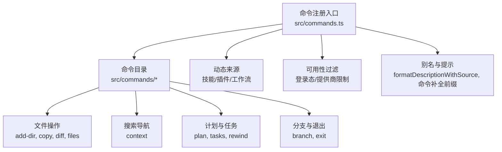
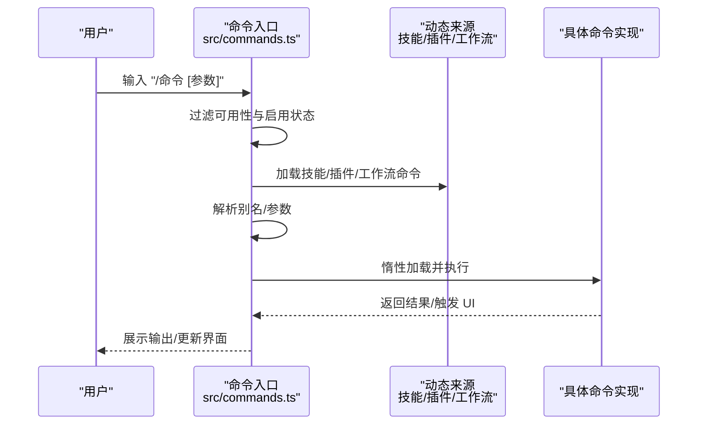
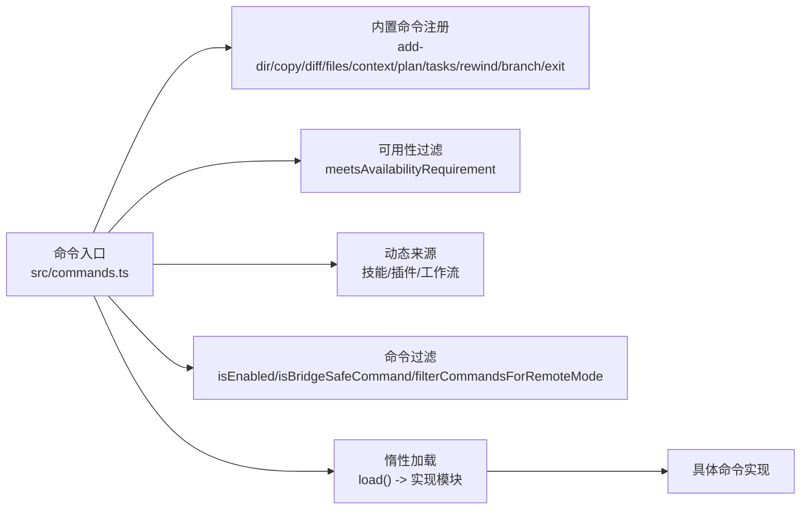

# 内置命令详解

<cite>
**本文引用的文件**
- [commands.ts](file://src/commands.ts)
- [add-dir/index.ts](file://src/commands/add-dir/index.ts)
- [copy/index.ts](file://src/commands/copy/index.ts)
- [diff/index.ts](file://src/commands/diff/index.ts)
- [files/index.ts](file://src/commands/files/index.ts)
- [context/index.ts](file://src/commands/context/index.ts)
- [plan/index.ts](file://src/commands/plan/index.ts)
- [tasks/index.ts](file://src/commands/tasks/index.ts)
- [rewind/index.ts](file://src/commands/rewind/index.ts)
- [branch/index.ts](file://src/commands/branch/index.ts)
- [exit/index.ts](file://src/commands/exit/index.ts)
- [builtinPlugins.ts](file://src/plugins/builtinPlugins.ts)
- [commandSuggestions.ts](file://src/utils/suggestions/commandSuggestions.ts)
- [prefix.ts](file://src/utils/bash/prefix.ts)
</cite>

## 目录
1. [简介](#简介)
2. [项目结构](#项目结构)
3. [核心组件](#核心组件)
4. [架构总览](#架构总览)
5. [详细组件分析](#详细组件分析)
6. [依赖关系分析](#依赖关系分析)
7. [性能考量](#性能考量)
8. [故障排查指南](#故障排查指南)
9. [结论](#结论)
10. [附录](#附录)

## 简介
本文件面向使用者与开发者，系统性梳理内置命令体系：命令注册、发现、过滤与执行流程；按功能域（文件操作、搜索导航、Shell 执行、任务管理等）组织命令清单；解释命令元数据（名称、别名、类型、可用性、非交互支持等），以及输入输出格式、错误处理与边界条件；提供典型使用场景与组合模式建议，并给出性能特性与资源消耗分析。

## 项目结构
内置命令由统一入口集中导出与管理，命令实现以“按功能域分目录”的方式组织，每个命令通过轻量的 index 元信息声明其元数据与加载策略，运行时惰性加载具体实现，降低启动开销。

图表来源
- [commands.ts:256-346](file://src/commands.ts#L256-L346)
- [add-dir/index.ts:1-12](file://src/commands/add-dir/index.ts#L1-L12)
- [copy/index.ts:1-16](file://src/commands/copy/index.ts#L1-L16)
- [diff/index.ts:1-9](file://src/commands/diff/index.ts#L1-L9)
- [files/index.ts:1-13](file://src/commands/files/index.ts#L1-L13)
- [context/index.ts:1-25](file://src/commands/context/index.ts#L1-L25)
- [plan/index.ts:1-12](file://src/commands/plan/index.ts#L1-L12)
- [tasks/index.ts:1-12](file://src/commands/tasks/index.ts#L1-L12)
- [rewind/index.ts:1-14](file://src/commands/rewind/index.ts#L1-L14)
- [branch/index.ts:1-15](file://src/commands/branch/index.ts#L1-L15)
- [exit/index.ts:1-13](file://src/commands/exit/index.ts#L1-L13)

章节来源
- [commands.ts:256-346](file://src/commands.ts#L256-L346)

## 核心组件
- 命令注册与聚合
  - 统一从命令入口导出命令数组，包含内置命令、动态技能、插件技能、工作流命令等。
  - 提供命令可用性过滤（如订阅者/控制台用户/第三方服务限制）与启用状态检查。
- 命令元数据与类型
  - 每个命令包含 name、description、type、aliases、argumentHint、supportsNonInteractive、isEnabled、immediate 等字段。
  - type 区分 prompt、local、local-jsx；local-jsx 用于渲染 Ink UI 的命令。
- 别名与描述格式化
  - 支持 aliases；描述可按来源（builtin/plugin/bundled/mcp/workflow）格式化展示。
- 动态来源
  - 技能目录、插件、工作流命令在运行时动态加载，支持去重与插入顺序控制。

章节来源
- [commands.ts:256-346](file://src/commands.ts#L256-L346)
- [commands.ts:417-443](file://src/commands.ts#L417-L443)
- [commands.ts:547-559](file://src/commands.ts#L547-L559)
- [commands.ts:688-719](file://src/commands.ts#L688-L719)
- [commands.ts:728-754](file://src/commands.ts#L728-L754)

## 架构总览
命令生命周期概览：命令注册 → 可用性与启用过滤 → 动态来源合并 → 惰性加载执行 → 结果返回或 UI 渲染。

图表来源
- [commands.ts:476-517](file://src/commands.ts#L476-L517)
- [commands.ts:563-581](file://src/commands.ts#L563-L581)
- [commands.ts:586-608](file://src/commands.ts#L586-L608)

## 详细组件分析

### 文件操作类命令
- add-dir
  - 类型：local-jsx
  - 参数：路径（argumentHint）
  - 行为：添加新的工作目录，惰性加载实现。
  - 使用场景：在多目录上下文中扩展代码库范围。
  - 边界条件：路径不存在或不可访问时的错误处理由实现负责。
  - 章节来源
    - [add-dir/index.ts:1-12](file://src/commands/add-dir/index.ts#L1-L12)

- copy
  - 类型：local-jsx
  - 参数：可选第 N 条回复（argumentHint）
  - 行为：复制最近或指定序号的回复到剪贴板。
  - 使用场景：快速复用模型输出。
  - 章节来源
    - [copy/index.ts:1-16](file://src/commands/copy/index.ts#L1-L16)

- diff
  - 类型：local-jsx
  - 参数：无
  - 行为：查看未提交变更与按轮次的差异。
  - 使用场景：审阅会话中对文件的修改。
  - 章节来源
    - [diff/index.ts:1-9](file://src/commands/diff/index.ts#L1-L9)

- files
  - 类型：local
  - 参数：无
  - 行为：列出当前上下文中的文件；支持非交互模式。
  - 使用场景：快速确认上下文覆盖范围。
  - 章节来源
    - [files/index.ts:1-13](file://src/commands/files/index.ts#L1-L13)

### 搜索与导航类命令
- context
  - 类型：local-jsx（交互式）/ local（非交互）
  - 参数：无
  - 行为：交互式可视化上下文占用；非交互模式输出文本统计。
  - 使用场景：评估上下文窗口占用与优化策略。
  - 章节来源
    - [context/index.ts:1-25](file://src/commands/context/index.ts#L1-L25)

### 计划与任务类命令
- plan
  - 类型：local-jsx
  - 参数：open 或描述片段（argumentHint）
  - 行为：开启计划模式或查看当前会话计划。
  - 使用场景：制定与跟踪复杂任务分解。
  - 章节来源
    - [plan/index.ts:1-12](file://src/commands/plan/index.ts#L1-L12)

- tasks
  - 类型：local-jsx
  - 别名：bashes
  - 行为：列出与管理后台任务。
  - 使用场景：监控并管理异步执行的任务队列。
  - 章节来源
    - [tasks/index.ts:1-12](file://src/commands/tasks/index.ts#L1-L12)

- rewind
  - 类型：local
  - 别名：checkpoint
  - 行为：将代码与/或对话回退到先前时间点。
  - 使用场景：撤销错误操作或探索不同历史分支。
  - 章节来源
    - [rewind/index.ts:1-14](file://src/commands/rewind/index.ts#L1-L14)

### 分支与退出类命令
- branch
  - 类型：local-jsx
  - 别名：fork（当 /fork 子代理命令不存在时）
  - 参数：可选分支名（argumentHint）
  - 行为：在当前会话点创建分支。
  - 使用场景：并行探索不同假设或方案。
  - 章节来源
    - [branch/index.ts:1-15](file://src/commands/branch/index.ts#L1-L15)

- exit
  - 类型：local-jsx
  - 别名：quit
  - 行为：退出 REPL。
  - 使用场景：结束当前会话。
  - 章节来源
    - [exit/index.ts:1-13](file://src/commands/exit/index.ts#L1-L13)

### Shell 执行相关
- 说明
  - 仓库中未发现名为 bash 的独立命令；Shell 相关能力通常通过工具层（如 BashTool、PowerShellTool 等）提供，而非直接暴露为“/bash”命令。
  - 若需在命令面板中调用 Shell，应优先使用工具层提供的能力或相应技能。
- 章节来源
  - [commands.ts:256-346](file://src/commands.ts#L256-L346)

### 命令别名与快捷方式
- 别名系统
  - 多数命令支持别名（如 tasks 的 bashes、rewind 的 checkpoint、exit 的 quit、branch 的 fork）。
  - 查找逻辑支持按 name、标准名与 aliases 匹配。
- 描述格式化
  - 对于 prompt 型命令，描述可按来源标注（如 plugin、builtin、bundled、workflow）。
- 章节来源
  - [commands.ts:688-719](file://src/commands.ts#L688-L719)
  - [commands.ts:728-754](file://src/commands.ts#L728-L754)

### 命令补全与前缀折叠
- 命令补全
  - 在输入“/”时，根据可见命令生成建议列表，结合最近使用与分类进行排序。
- 前缀折叠
  - 将候选命令前缀按词对齐取最长公共前缀，提升输入效率。
- 章节来源
  - [commandSuggestions.ts:308-342](file://src/utils/suggestions/commandSuggestions.ts#L308-L342)
  - [prefix.ts:155-204](file://src/utils/bash/prefix.ts#L155-L204)

## 依赖关系分析
命令系统的关键依赖链路如下：

图表来源
- [commands.ts:256-346](file://src/commands.ts#L256-L346)
- [commands.ts:417-443](file://src/commands.ts#L417-L443)
- [commands.ts:476-517](file://src/commands.ts#L476-L517)
- [commands.ts:619-686](file://src/commands.ts#L619-L686)
- [commands.ts:688-719](file://src/commands.ts#L688-L719)

章节来源
- [commands.ts:476-517](file://src/commands.ts#L476-L517)
- [commands.ts:619-686](file://src/commands.ts#L619-L686)

## 性能考量
- 启动与内存
  - 命令实现采用惰性加载（load 函数），避免一次性加载全部 UI 组件，显著降低启动时间与内存占用。
  - 命令与技能的加载结果被缓存（memoize），减少重复 I/O 与动态导入成本。
- 动态来源
  - 技能目录、插件与工作流命令在运行时并行加载，随后进行去重与插入排序，保证最终命令集稳定且有序。
- 远程/桥接安全
  - 仅允许明确白名单的本地命令通过远程桥接执行，避免不必要的终端侧副作用。
- 章节来源
  - [commands.ts:449-469](file://src/commands.ts#L449-L469)
  - [commands.ts:523-539](file://src/commands.ts#L523-L539)
  - [commands.ts:619-686](file://src/commands.ts#L619-L686)
  - [commands.ts:651-676](file://src/commands.ts#L651-L676)

## 故障排查指南
- 命令不存在
  - 现象：输入命令后提示未找到。
  - 排查：确认命令名/别名是否正确；检查可用性过滤（如订阅者/第三方服务限制）是否导致隐藏。
  - 章节来源
    - [commands.ts:704-719](file://src/commands.ts#L704-L719)
    - [commands.ts:417-443](file://src/commands.ts#L417-L443)

- 命令不可用
  - 现象：命令存在但不显示或无法执行。
  - 排查：检查 isEnabled 与 meetsAvailabilityRequirement；确认 feature 标志与环境变量设置。
  - 章节来源
    - [commands.ts:476-517](file://src/commands.ts#L476-L517)
    - [commands.ts:417-443](file://src/commands.ts#L417-L443)

- 非交互模式限制
  - 现象：某些命令仅支持交互模式。
  - 排查：确认 supportsNonInteractive 标记；必要时切换到交互模式或改用非交互版本（如 context 的非交互变体）。
  - 章节来源
    - [context/index.ts:12-24](file://src/commands/context/index.ts#L12-L24)
    - [rewind/index.ts:8-11](file://src/commands/rewind/index.ts#L8-L11)

- 远程/桥接执行失败
  - 现象：通过移动端/网页端发起命令无响应。
  - 排查：确认命令类型与是否在 BRIDGE_SAFE_COMMANDS 或为 prompt 型；否则会被阻断。
  - 章节来源
    - [commands.ts:651-676](file://src/commands.ts#L651-L676)

## 结论
内置命令系统通过统一入口、元数据驱动与惰性加载，实现了高扩展性与良好性能。命令按功能域清晰分层，支持别名、来源标注与非交互模式，满足从日常文件操作到复杂任务编排的多样化需求。配合动态来源与可用性过滤，系统可在不同环境与权限下稳定运行。

## 附录

### 命令清单与分类速览
- 文件操作
  - add-dir：添加工作目录
  - copy：复制回复
  - diff：查看变更
  - files：列出上下文文件
- 搜索与导航
  - context：上下文可视化/统计
- 计划与任务
  - plan：计划模式
  - tasks：后台任务管理
  - rewind：回退到历史快照
- 分支与退出
  - branch：会话分支
  - exit：退出 REPL

章节来源
- [add-dir/index.ts:1-12](file://src/commands/add-dir/index.ts#L1-L12)
- [copy/index.ts:1-16](file://src/commands/copy/index.ts#L1-L16)
- [diff/index.ts:1-9](file://src/commands/diff/index.ts#L1-L9)
- [files/index.ts:1-13](file://src/commands/files/index.ts#L1-L13)
- [context/index.ts:1-25](file://src/commands/context/index.ts#L1-L25)
- [plan/index.ts:1-12](file://src/commands/plan/index.ts#L1-L12)
- [tasks/index.ts:1-12](file://src/commands/tasks/index.ts#L1-L12)
- [rewind/index.ts:1-14](file://src/commands/rewind/index.ts#L1-L14)
- [branch/index.ts:1-15](file://src/commands/branch/index.ts#L1-L15)
- [exit/index.ts:1-13](file://src/commands/exit/index.ts#L1-L13)

### 命令来源与集成点
- 内置命令注册与过滤
  - 通过 COMMANDS 数组与 getCommands 聚合与筛选。
- 动态来源
  - 技能目录、插件、工作流命令在运行时加载并插入到内置命令之前。
- 插件与内置插件
  - 内置插件可提供技能命令，参与命令列表构建。
- 章节来源
  - [commands.ts:256-346](file://src/commands.ts#L256-L346)
  - [commands.ts:449-469](file://src/commands.ts#L449-L469)
  - [builtinPlugins.ts:1-39](file://src/plugins/builtinPlugins.ts#L1-L39)