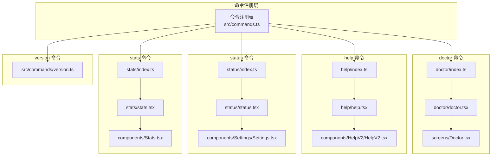
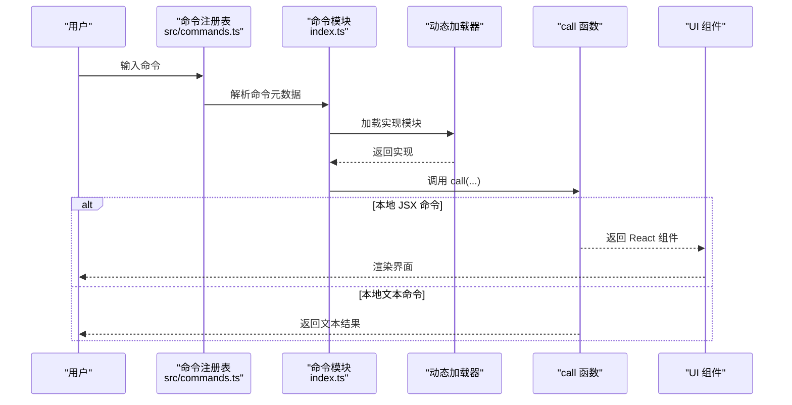
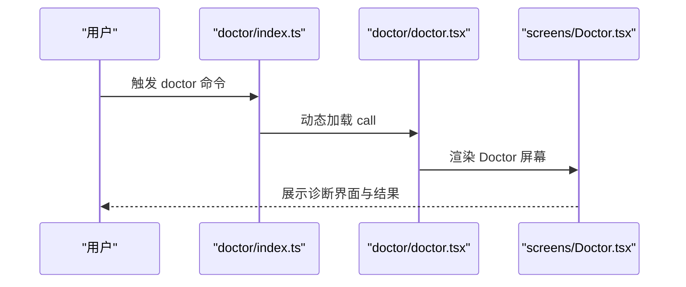
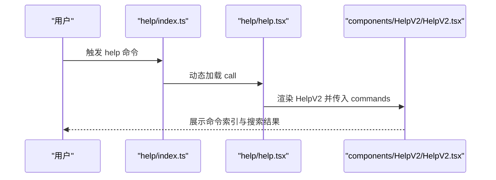
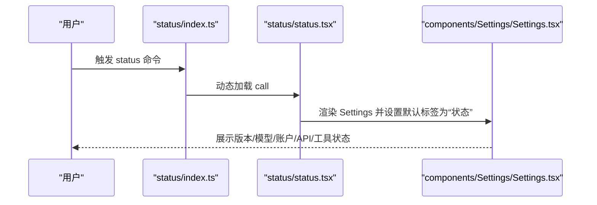
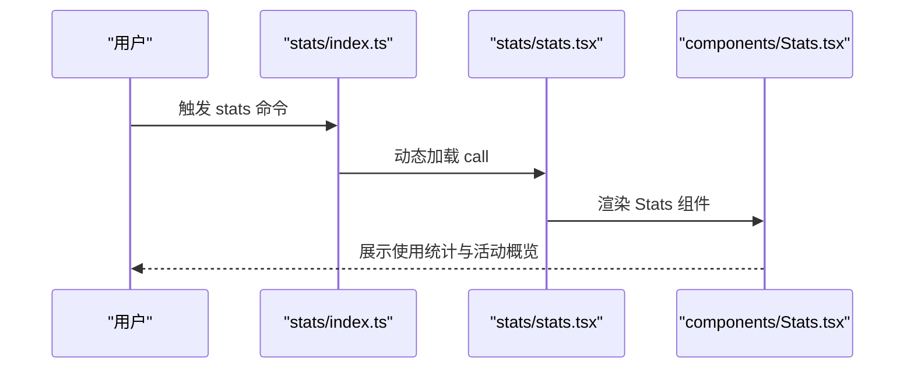
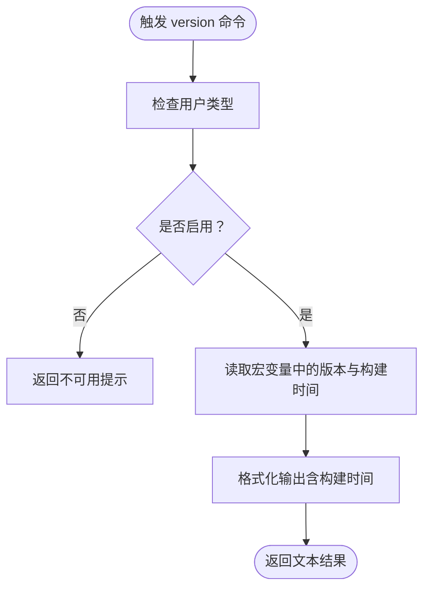
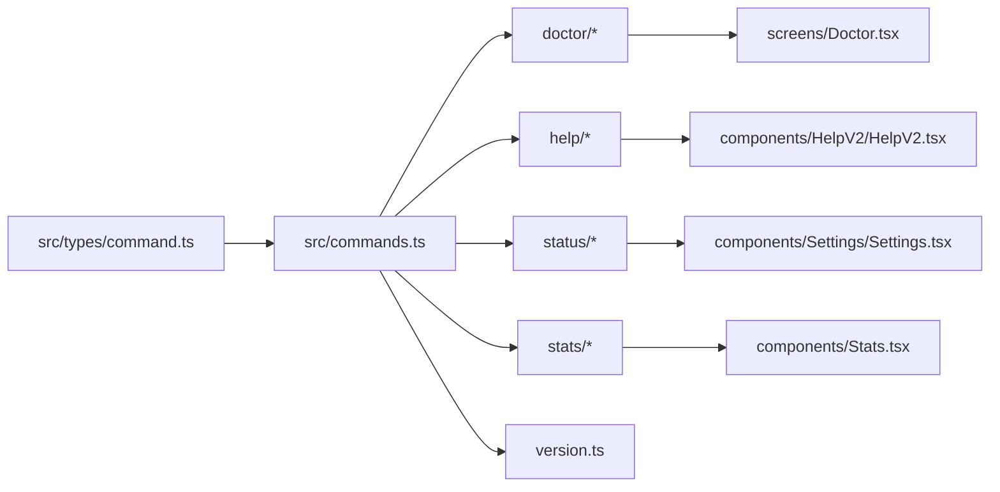
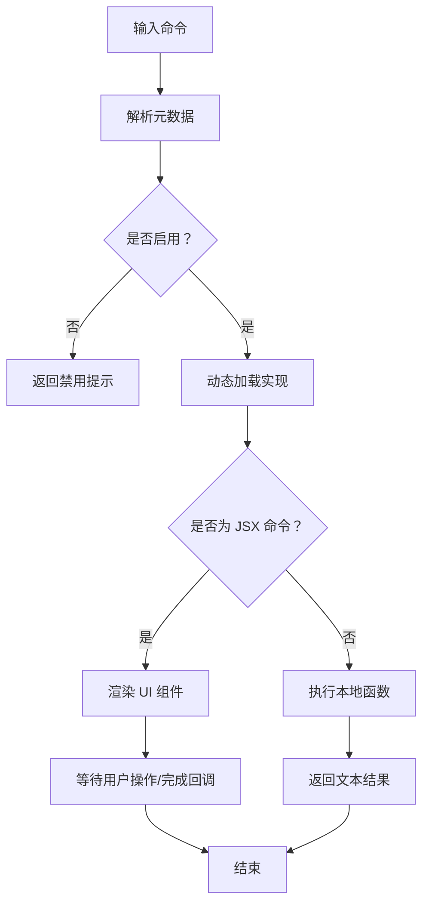

# 实用工具命令

<cite>
**本文引用的文件**
- [src/commands/doctor/index.ts](file://src/commands/doctor/index.ts)
- [src/commands/doctor/doctor.tsx](file://src/commands/doctor/doctor.tsx)
- [src/screens/Doctor.tsx](file://src/screens/Doctor.tsx)
- [src/commands/help/index.ts](file://src/commands/help/index.ts)
- [src/commands/help/help.tsx](file://src/commands/help/help.tsx)
- [src/components/HelpV2/HelpV2.tsx](file://src/components/HelpV2/HelpV2.tsx)
- [src/commands/status/index.ts](file://src/commands/status/index.ts)
- [src/commands/status/status.tsx](file://src/commands/status/status.tsx)
- [src/components/Settings/Settings.tsx](file://src/components/Settings/Settings.tsx)
- [src/commands/stats/index.ts](file://src/commands/stats/index.ts)
- [src/commands/stats/stats.tsx](file://src/commands/stats/stats.tsx)
- [src/components/Stats.tsx](file://src/components/Stats.tsx)
- [src/commands/version.ts](file://src/commands/version.ts)
- [src/types/command.ts](file://src/types/command.ts)
- [src/commands.ts](file://src/commands.ts)
</cite>

## 目录
1. [简介](#简介)
2. [项目结构](#项目结构)
3. [核心组件](#核心组件)
4. [架构总览](#架构总览)
5. [详细组件分析](#详细组件分析)
6. [依赖关系分析](#依赖关系分析)
7. [性能考量](#性能考量)
8. [故障排除指南](#故障排除指南)
9. [结论](#结论)
10. [附录](#附录)

## 简介
本文件面向实用工具命令，系统性介绍 doctor、help、status、stats、version 等辅助工具命令的设计与使用方式。内容涵盖：
- 诊断工具的工作原理与健康检查机制
- 帮助系统架构、命令索引与搜索能力
- 状态监控、性能统计与版本信息展示
- 故障排除流程、性能优化建议与系统维护最佳实践

## 项目结构
这些命令遵循统一的命令注册与调用模式：每个命令在独立目录下通过 index.ts 暴露元数据（名称、描述、类型、加载策略等），并在本地 JSX 命令中通过 call 函数返回对应的 UI 组件实例；非交互式命令则通过本地函数返回文本结果。

图表来源
- [src/commands.ts](file://src/commands.ts)
- [src/commands/doctor/index.ts](file://src/commands/doctor/index.ts)
- [src/commands/doctor/doctor.tsx](file://src/commands/doctor/doctor.tsx)
- [src/screens/Doctor.tsx](file://src/screens/Doctor.tsx)
- [src/commands/help/index.ts](file://src/commands/help/index.ts)
- [src/commands/help/help.tsx](file://src/commands/help/help.tsx)
- [src/components/HelpV2/HelpV2.tsx](file://src/components/HelpV2/HelpV2.tsx)
- [src/commands/status/index.ts](file://src/commands/status/index.ts)
- [src/commands/status/status.tsx](file://src/commands/status/status.tsx)
- [src/components/Settings/Settings.tsx](file://src/components/Settings/Settings.tsx)
- [src/commands/stats/index.ts](file://src/commands/stats/index.ts)
- [src/commands/stats/stats.tsx](file://src/commands/stats/stats.tsx)
- [src/components/Stats.tsx](file://src/components/Stats.tsx)
- [src/commands/version.ts](file://src/commands/version.ts)

章节来源
- [src/commands.ts](file://src/commands.ts)
- [src/commands/doctor/index.ts](file://src/commands/doctor/index.ts)
- [src/commands/doctor/doctor.tsx](file://src/commands/doctor/doctor.tsx)
- [src/commands/help/index.ts](file://src/commands/help/index.ts)
- [src/commands/help/help.tsx](file://src/commands/help/help.tsx)
- [src/commands/status/index.ts](file://src/commands/status/index.ts)
- [src/commands/status/status.tsx](file://src/commands/status/status.tsx)
- [src/commands/stats/index.ts](file://src/commands/stats/index.ts)
- [src/commands/stats/stats.tsx](file://src/commands/stats/stats.tsx)
- [src/commands/version.ts](file://src/commands/version.ts)

## 核心组件
- doctor：诊断安装与设置，基于 Doctor 屏幕组件提供可视化诊断界面。
- help：显示帮助与可用命令，基于 HelpV2 组件提供命令索引与搜索。
- status：显示运行状态（版本、模型、账户、API 连接性、工具状态等），默认立即执行，切换到“状态”标签页。
- stats：展示使用统计与活动概览，基于 Stats 组件。
- version：打印当前会话运行的版本信息（支持宏变量构建时间）。

章节来源
- [src/commands/doctor/index.ts](file://src/commands/doctor/index.ts)
- [src/commands/doctor/doctor.tsx](file://src/commands/doctor/doctor.tsx)
- [src/commands/help/index.ts](file://src/commands/help/index.ts)
- [src/commands/help/help.tsx](file://src/commands/help/help.tsx)
- [src/commands/status/index.ts](file://src/commands/status/index.ts)
- [src/commands/status/status.tsx](file://src/commands/status/status.tsx)
- [src/commands/stats/index.ts](file://src/commands/stats/index.ts)
- [src/commands/stats/stats.tsx](file://src/commands/stats/stats.tsx)
- [src/commands/version.ts](file://src/commands/version.ts)

## 架构总览
命令体系采用“声明式注册 + 动态加载 + JSX 渲染”的统一模式：
- 注册层：commands.ts 聚合各命令元数据，按需启用或禁用。
- 元数据层：各命令的 index.ts 定义 name、description、type、isEnabled、immediate 等。
- 执行层：本地 JSX 命令通过 call 返回 React 组件；非交互命令通过 call 返回文本。
- UI 层：对应组件负责渲染具体界面与交互逻辑。

图表来源
- [src/commands.ts](file://src/commands.ts)
- [src/commands/doctor/index.ts](file://src/commands/doctor/index.ts)
- [src/commands/doctor/doctor.tsx](file://src/commands/doctor/doctor.tsx)
- [src/commands/help/index.ts](file://src/commands/help/index.ts)
- [src/commands/help/help.tsx](file://src/commands/help/help.tsx)
- [src/commands/status/index.ts](file://src/commands/status/index.ts)
- [src/commands/status/status.tsx](file://src/commands/status/status.tsx)
- [src/commands/stats/index.ts](file://src/commands/stats/index.ts)
- [src/commands/stats/stats.tsx](file://src/commands/stats/stats.tsx)
- [src/commands/version.ts](file://src/commands/version.ts)

## 详细组件分析

### doctor 诊断命令
- 设计要点
  - 类型：本地 JSX 命令，用于交互式诊断。
  - 启用条件：可通过环境变量禁用。
  - 执行流程：加载 Doctor 屏幕组件并传入完成回调。
- 诊断工作原理
  - Doctor 屏幕组件负责组织健康检查项（如安装完整性、配置有效性、网络连通性、工具可用性等），以可视化方式呈现诊断结果与修复建议。
- 问题定位方法
  - 依据诊断报告逐项排查；对可自动修复的项提供一键修复入口；对不可自动修复的问题提供引导与日志输出建议。

图表来源
- [src/commands/doctor/index.ts](file://src/commands/doctor/index.ts)
- [src/commands/doctor/doctor.tsx](file://src/commands/doctor/doctor.tsx)
- [src/screens/Doctor.tsx](file://src/screens/Doctor.tsx)

章节来源
- [src/commands/doctor/index.ts](file://src/commands/doctor/index.ts)
- [src/commands/doctor/doctor.tsx](file://src/commands/doctor/doctor.tsx)
- [src/screens/Doctor.tsx](file://src/screens/Doctor.tsx)

### help 帮助命令
- 设计要点
  - 类型：本地 JSX 命令，提供命令索引与搜索。
  - 数据来源：从上下文注入的 commands 列表。
  - 执行流程：加载 HelpV2 组件并传入命令列表与关闭回调。
- 帮助系统架构
  - HelpV2 组件负责命令分类、过滤、搜索与详情展示，支持快速定位所需命令。
- 命令索引与搜索
  - 通过输入关键字对命令名称、描述进行匹配过滤，提升查找效率。

图表来源
- [src/commands/help/index.ts](file://src/commands/help/index.ts)
- [src/commands/help/help.tsx](file://src/commands/help/help.tsx)
- [src/components/HelpV2/HelpV2.tsx](file://src/components/HelpV2/HelpV2.tsx)

章节来源
- [src/commands/help/index.ts](file://src/commands/help/index.ts)
- [src/commands/help/help.tsx](file://src/commands/help/help.tsx)
- [src/components/HelpV2/HelpV2.tsx](file://src/components/HelpV2/HelpV2.tsx)

### status 状态命令
- 设计要点
  - 类型：本地 JSX 命令，立即执行。
  - 默认标签：切换到“状态”标签页，聚焦版本、模型、账户、API 连接性与工具状态。
  - 执行流程：加载 Settings 组件并指定默认标签页。
- 健康检查机制
  - 版本信息：显示当前运行版本与构建时间。
  - 模型与账户：展示当前模型与登录账户状态。
  - API 连接性：检测后端服务可达性与认证状态。
  - 工具状态：列出已安装工具的可用性与最近使用情况。
- 问题定位方法
  - 结合状态面板中的连接指示与错误提示，定位网络、认证或工具异常；必要时导出诊断日志。

图表来源
- [src/commands/status/index.ts](file://src/commands/status/index.ts)
- [src/commands/status/status.tsx](file://src/commands/status/status.tsx)
- [src/components/Settings/Settings.tsx](file://src/components/Settings/Settings.tsx)

章节来源
- [src/commands/status/index.ts](file://src/commands/status/index.ts)
- [src/commands/status/status.tsx](file://src/commands/status/status.tsx)
- [src/components/Settings/Settings.tsx](file://src/components/Settings/Settings.tsx)

### stats 统计命令
- 设计要点
  - 类型：本地 JSX 命令，用于查看使用统计与活动概览。
  - 执行流程：加载 Stats 组件并传入关闭回调。
- 统计内容
  - 使用次数、会话时长、工具调用频次、成功率与失败率等关键指标。
- 性能与行为洞察
  - 基于统计数据识别高频工具与潜在瓶颈，指导优化与资源分配。

图表来源
- [src/commands/stats/index.ts](file://src/commands/stats/index.ts)
- [src/commands/stats/stats.tsx](file://src/commands/stats/stats.tsx)
- [src/components/Stats.tsx](file://src/components/Stats.tsx)

章节来源
- [src/commands/stats/index.ts](file://src/commands/stats/index.ts)
- [src/commands/stats/stats.tsx](file://src/commands/stats/stats.tsx)
- [src/components/Stats.tsx](file://src/components/Stats.tsx)

### version 版本命令
- 设计要点
  - 类型：本地命令，返回文本结果。
  - 条件启用：仅在特定用户类型下可用。
  - 支持非交互：可在脚本或自动化场景中调用。
  - 输出格式：版本号（可带构建时间）。
- 版本管理
  - 通过宏变量注入版本与构建时间，便于追踪发布分支与构建产物。

图表来源
- [src/commands/version.ts](file://src/commands/version.ts)

章节来源
- [src/commands/version.ts](file://src/commands/version.ts)

## 依赖关系分析
- 命令注册与类型约束
  - 命令类型定义位于 src/types/command.ts，确保所有命令遵循统一接口（name、description、type、isEnabled、supportsNonInteractive、load 等）。
- 命令聚合
  - src/commands.ts 负责收集各命令的元数据，形成全局可用的命令表，供 CLI 或 UI 层查询与调用。
- 组件依赖
  - doctor、help、status、stats 均通过本地 JSX 命令调用对应组件；version 为纯文本命令，不依赖 UI 组件。

图表来源
- [src/types/command.ts](file://src/types/command.ts)
- [src/commands.ts](file://src/commands.ts)
- [src/commands/doctor/index.ts](file://src/commands/doctor/index.ts)
- [src/commands/doctor/doctor.tsx](file://src/commands/doctor/doctor.tsx)
- [src/screens/Doctor.tsx](file://src/screens/Doctor.tsx)
- [src/commands/help/index.ts](file://src/commands/help/index.ts)
- [src/commands/help/help.tsx](file://src/commands/help/help.tsx)
- [src/components/HelpV2/HelpV2.tsx](file://src/components/HelpV2/HelpV2.tsx)
- [src/commands/status/index.ts](file://src/commands/status/index.ts)
- [src/commands/status/status.tsx](file://src/commands/status/status.tsx)
- [src/components/Settings/Settings.tsx](file://src/components/Settings/Settings.tsx)
- [src/commands/stats/index.ts](file://src/commands/stats/index.ts)
- [src/commands/stats/stats.tsx](file://src/commands/stats/stats.tsx)
- [src/components/Stats.tsx](file://src/components/Stats.tsx)
- [src/commands/version.ts](file://src/commands/version.ts)

章节来源
- [src/types/command.ts](file://src/types/command.ts)
- [src/commands.ts](file://src/commands.ts)

## 性能考量
- 延迟加载
  - 命令通过动态 import 按需加载，减少启动时内存占用与首屏渲染压力。
- 非交互命令优先
  - version 等命令直接返回文本，避免不必要的 UI 渲染。
- 统计与诊断
  - stats 与 doctor 仅在需要时触发渲染，避免后台持续计算带来的开销。
- 最佳实践
  - 将耗时检查拆分为异步任务，分阶段更新 UI，保证交互流畅。
  - 对频繁访问的统计指标进行缓存，降低重复计算成本。

## 故障排除指南
- doctor 诊断
  - 若诊断结果为空或报错，检查网络连通性与后端服务状态；根据提示导出诊断日志并重试。
  - 对于工具不可用项，确认工具安装路径与权限；必要时重新安装或修复。
- help 搜索
  - 若命令未显示，确认命令已正确注册且未被禁用；尝试刷新命令索引。
- status 状态
  - 当 API 连接失败时，检查代理设置与证书；核对账户令牌有效期；重启相关服务后重试。
  - 版本不一致时，确认当前会话使用的版本与预期一致，必要时更新至最新稳定版。
- stats 统计
  - 若统计缺失，检查数据采集开关与存储路径；清理缓存后重新生成报表。
- version 版本
  - 若返回空值，确认用户类型与启用条件；检查构建宏变量是否正确注入。

## 结论
doctor、help、status、stats、version 等实用工具命令构成了系统的诊断、导航、监控与版本管理核心。通过统一的命令注册与动态加载机制，它们实现了清晰的职责分离与良好的扩展性。结合本文提供的架构图、流程图与排障建议，用户可以高效地定位问题、优化性能并维持系统稳定运行。

## 附录
- 命令生命周期（概念示意）
