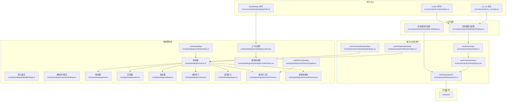
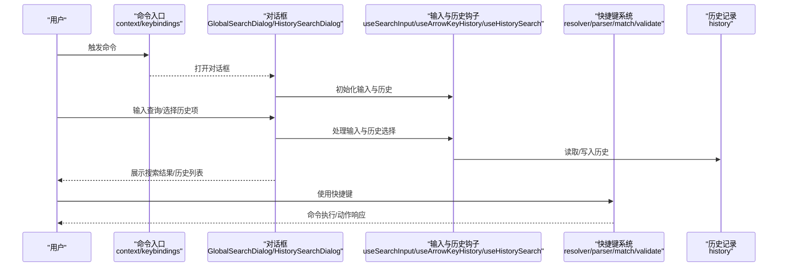
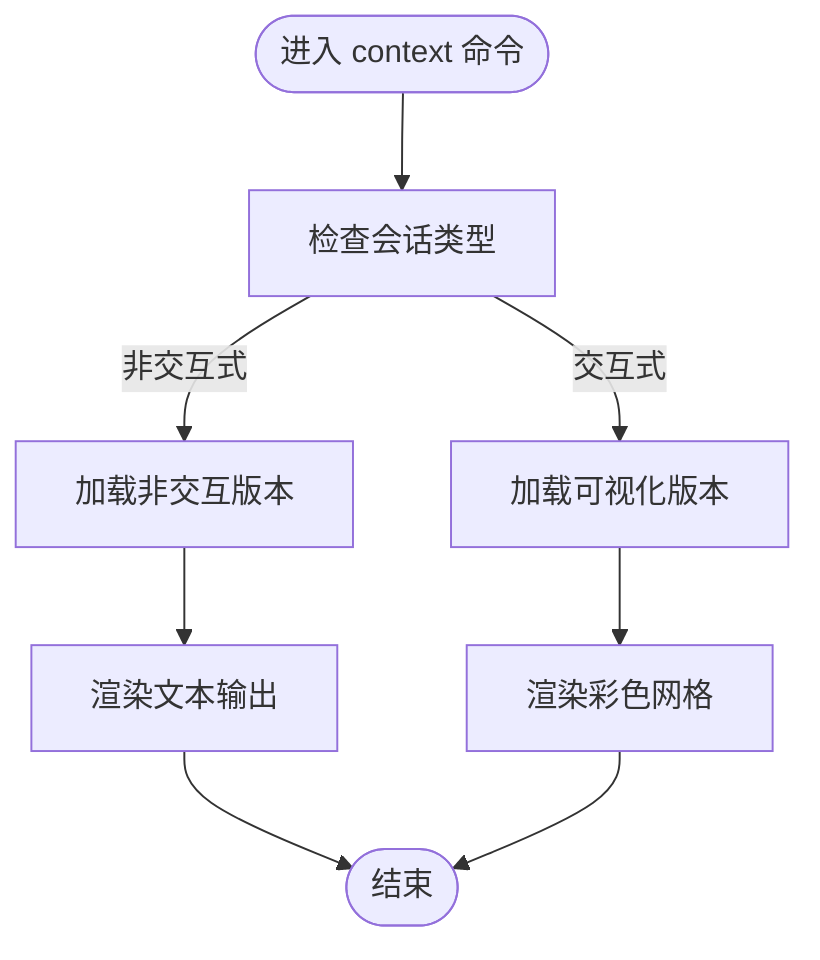
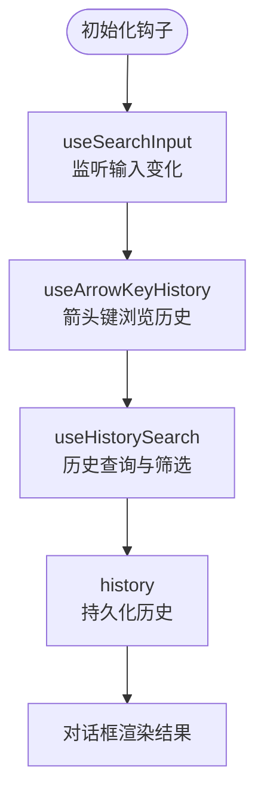
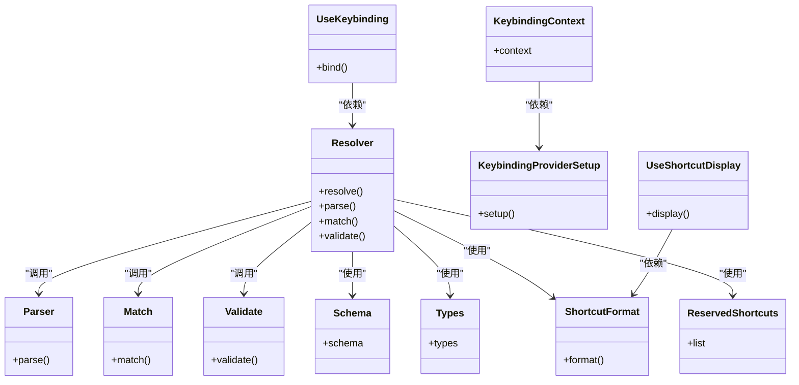
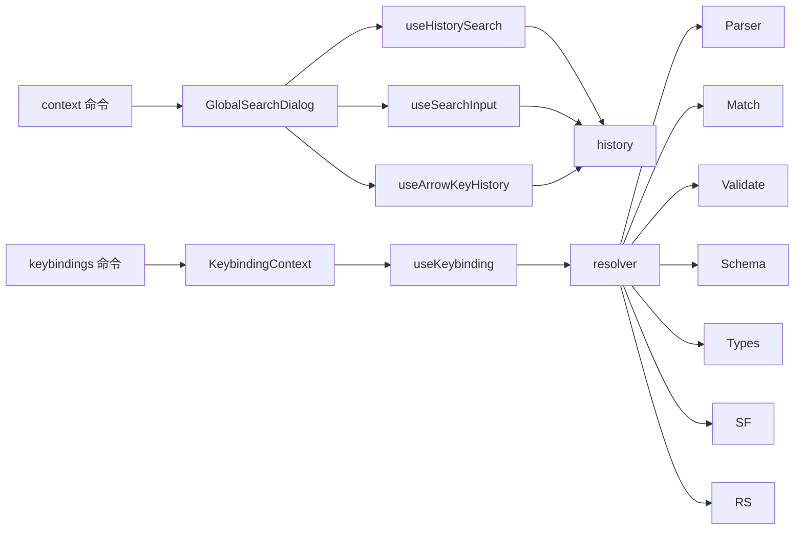

# 搜索与导航命令

<cite>
**本文引用的文件**
- [src/commands/context/index.ts](file://src/commands/context/index.ts)
- [src/commands/context/context.tsx](file://src/commands/context/context.tsx)
- [src/commands/context/context-noninteractive.ts](file://src/commands/context/context-noninteractive.ts)
- [src/commands/ctx_viz/index.js](file://src/commands/ctx_viz/index.js)
- [src/commands/keybindings/index.ts](file://src/commands/keybindings/index.ts)
- [src/components/GlobalSearchDialog.tsx](file://src/components/GlobalSearchDialog.tsx)
- [src/components/HistorySearchDialog.tsx](file://src/components/HistorySearchDialog.tsx)
- [src/hooks/useSearchInput.ts](file://src/hooks/useSearchInput.ts)
- [src/hooks/useArrowKeyHistory.tsx](file://src/hooks/useArrowKeyHistory.tsx)
- [src/hooks/useHistorySearch.ts](file://src/hooks/useHistorySearch.ts)
- [src/hooks/useCommandKeybindings.tsx](file://src/hooks/useCommandKeybindings.tsx)
- [src/hooks/useGlobalKeybindings.tsx](file://src/hooks/useGlobalKeybindings.tsx)
- [src/keybindings/defaultBindings.ts](file://src/keybindings/defaultBindings.ts)
- [src/keybindings/loadUserBindings.ts](file://src/keybindings/loadUserBindings.ts)
- [src/keybindings/resolver.ts](file://src/keybindings/resolver.ts)
- [src/keybindings/parser.ts](file://src/keybindings/parser.ts)
- [src/keybindings/match.ts](file://src/keybindings/match.ts)
- [src/keybindings/validate.ts](file://src/keybindings/validate.ts)
- [src/keybindings/schema.ts](file://src/keybindings/schema.ts)
- [src/keybindings/types.ts](file://src/keybindings/types.ts)
- [src/keybindings/shortcutFormat.ts](file://src/keybindings/shortcutFormat.ts)
- [src/keybindings/reservedShortcuts.ts](file://src/keybindings/reservedShortcuts.ts)
- [src/keybindings/KeybindingContext.tsx](file://src/keybindings/KeybindingContext.tsx)
- [src/keybindings/KeybindingProviderSetup.tsx](file://src/keybindings/KeybindingProviderSetup.tsx)
- [src/keybindings/useKeybinding.ts](file://src/keybindings/useKeybinding.ts)
- [src/keybindings/useShortcutDisplay.ts](file://src/keybindings/useShortcutDisplay.ts)
- [src/history.ts](file://src/history.ts)
</cite>

## 目录
1. [简介](#简介)
2. [项目结构](#项目结构)
3. [核心组件](#核心组件)
4. [架构总览](#架构总览)
5. [详细组件分析](#详细组件分析)
6. [依赖关系分析](#依赖关系分析)
7. [性能考量](#性能考量)
8. [故障排查指南](#故障排查指南)
9. [结论](#结论)
10. [附录](#附录)

## 简介
本文件面向“搜索与导航命令”的使用者与维护者，系统性梳理以下能力与实现：
- 上下文可视化与非交互式上下文查看：context、ctx_viz（占位）
- 全局搜索与历史搜索对话框：global-search（通过全局搜索对话框）、history（通过历史搜索对话框）
- 键盘快捷键配置与解析：keybindings
- 搜索输入处理、历史记录与快捷键钩子：useSearchInput、useArrowKeyHistory、useHistorySearch、useCommandKeybindings、useGlobalKeybindings
- 历史记录管理与持久化：history

目标是帮助读者理解命令入口、UI 对话框、输入处理、历史管理与快捷键解析之间的协作关系，并提供可操作的最佳实践。

## 项目结构
围绕“搜索与导航”主题，相关代码主要分布在如下位置：
- 命令入口与实现：src/commands/*
- UI 对话框：src/components/*
- 输入与历史钩子：src/hooks/*
- 快捷键系统：src/keybindings/*
- 历史记录：src/history.ts

图表来源
- [src/commands/context/index.ts:1-25](file://src/commands/context/index.ts#L1-L25)
- [src/commands/ctx_viz/index.js:1-2](file://src/commands/ctx_viz/index.js#L1-L2)
- [src/commands/keybindings/index.ts:1-14](file://src/commands/keybindings/index.ts#L1-L14)
- [src/components/GlobalSearchDialog.tsx](file://src/components/GlobalSearchDialog.tsx)
- [src/components/HistorySearchDialog.tsx](file://src/components/HistorySearchDialog.tsx)
- [src/hooks/useSearchInput.ts](file://src/hooks/useSearchInput.ts)
- [src/hooks/useArrowKeyHistory.tsx](file://src/hooks/useArrowKeyHistory.tsx)
- [src/hooks/useHistorySearch.ts](file://src/hooks/useHistorySearch.ts)
- [src/hooks/useCommandKeybindings.tsx](file://src/hooks/useCommandKeybindings.tsx)
- [src/hooks/useGlobalKeybindings.tsx](file://src/hooks/useGlobalKeybindings.tsx)
- [src/keybindings/defaultBindings.ts](file://src/keybindings/defaultBindings.ts)
- [src/keybindings/loadUserBindings.ts](file://src/keybindings/loadUserBindings.ts)
- [src/keybindings/resolver.ts](file://src/keybindings/resolver.ts)
- [src/keybindings/parser.ts](file://src/keybindings/parser.ts)
- [src/keybindings/match.ts](file://src/keybindings/match.ts)
- [src/keybindings/validate.ts](file://src/keybindings/validate.ts)
- [src/keybindings/schema.ts](file://src/keybindings/schema.ts)
- [src/keybindings/types.ts](file://src/keybindings/types.ts)
- [src/keybindings/shortcutFormat.ts](file://src/keybindings/shortcutFormat.ts)
- [src/keybindings/reservedShortcuts.ts](file://src/keybindings/reservedShortcuts.ts)
- [src/keybindings/KeybindingContext.tsx](file://src/keybindings/KeybindingContext.tsx)
- [src/keybindings/KeybindingProviderSetup.tsx](file://src/keybindings/KeybindingProviderSetup.tsx)
- [src/keybindings/useKeybinding.ts](file://src/keybindings/useKeybinding.ts)
- [src/keybindings/useShortcutDisplay.ts](file://src/keybindings/useShortcutDisplay.ts)
- [src/history.ts](file://src/history.ts)

章节来源
- [src/commands/context/index.ts:1-25](file://src/commands/context/index.ts#L1-L25)
- [src/commands/ctx_viz/index.js:1-2](file://src/commands/ctx_viz/index.js#L1-L2)
- [src/commands/keybindings/index.ts:1-14](file://src/commands/keybindings/index.ts#L1-L14)
- [src/components/GlobalSearchDialog.tsx](file://src/components/GlobalSearchDialog.tsx)
- [src/components/HistorySearchDialog.tsx](file://src/components/HistorySearchDialog.tsx)
- [src/hooks/useSearchInput.ts](file://src/hooks/useSearchInput.ts)
- [src/hooks/useArrowKeyHistory.tsx](file://src/hooks/useArrowKeyHistory.tsx)
- [src/hooks/useHistorySearch.ts](file://src/hooks/useHistorySearch.ts)
- [src/hooks/useCommandKeybindings.tsx](file://src/hooks/useCommandKeybindings.tsx)
- [src/hooks/useGlobalKeybindings.tsx](file://src/hooks/useGlobalKeybindings.tsx)
- [src/keybindings/defaultBindings.ts](file://src/keybindings/defaultBindings.ts)
- [src/keybindings/loadUserBindings.ts](file://src/keybindings/loadUserBindings.ts)
- [src/keybindings/resolver.ts](file://src/keybindings/resolver.ts)
- [src/keybindings/parser.ts](file://src/keybindings/parser.ts)
- [src/keybindings/match.ts](file://src/keybindings/match.ts)
- [src/keybindings/validate.ts](file://src/keybindings/validate.ts)
- [src/keybindings/schema.ts](file://src/keybindings/schema.ts)
- [src/keybindings/types.ts](file://src/keybindings/types.ts)
- [src/keybindings/shortcutFormat.ts](file://src/keybindings/shortcutFormat.ts)
- [src/keybindings/reservedShortcuts.ts](file://src/keybindings/reservedShortcuts.ts)
- [src/keybindings/KeybindingContext.tsx](file://src/keybindings/KeybindingContext.tsx)
- [src/keybindings/KeybindingProviderSetup.tsx](file://src/keybindings/KeybindingProviderSetup.tsx)
- [src/keybindings/useKeybinding.ts](file://src/keybindings/useKeybinding.ts)
- [src/keybindings/useShortcutDisplay.ts](file://src/keybindings/useShortcutDisplay.ts)
- [src/history.ts](file://src/history.ts)

## 核心组件
- 上下文命令（context）：提供上下文可视化（彩色网格）与非交互式文本输出两种形态；在交互式会话中启用可视化，在非交互式会话中启用文本输出。
- 上下文可视化命令（ctx_viz）：当前为占位实现，返回禁用状态。
- 全局搜索对话框（GlobalSearchDialog）：承载“全局搜索”体验，配合输入钩子与历史管理实现搜索与浏览。
- 历史搜索对话框（HistorySearchDialog）：承载“历史搜索”体验，用于检索历史记录。
- 键盘快捷键命令（keybindings）：打开或创建用户的快捷键配置文件，仅在快捷键自定义功能开启时可用。
- 输入与历史钩子：useSearchInput、useArrowKeyHistory、useHistorySearch 提供搜索输入、箭头键历史选择与历史搜索能力。
- 快捷键系统：defaultBindings、loadUserBindings、resolver、parser、match、validate、schema、types、shortcutFormat、reservedShortcuts、KeybindingContext、KeybindingProviderSetup、useKeybinding、useShortcutDisplay 构成完整的快捷键解析与显示体系。
- 历史记录：history 提供历史数据的管理与持久化接口。

章节来源
- [src/commands/context/index.ts:1-25](file://src/commands/context/index.ts#L1-L25)
- [src/commands/ctx_viz/index.js:1-2](file://src/commands/ctx_viz/index.js#L1-L2)
- [src/commands/keybindings/index.ts:1-14](file://src/commands/keybindings/index.ts#L1-L14)
- [src/components/GlobalSearchDialog.tsx](file://src/components/GlobalSearchDialog.tsx)
- [src/components/HistorySearchDialog.tsx](file://src/components/HistorySearchDialog.tsx)
- [src/hooks/useSearchInput.ts](file://src/hooks/useSearchInput.ts)
- [src/hooks/useArrowKeyHistory.tsx](file://src/hooks/useArrowKeyHistory.tsx)
- [src/hooks/useHistorySearch.ts](file://src/hooks/useHistorySearch.ts)
- [src/keybindings/defaultBindings.ts](file://src/keybindings/defaultBindings.ts)
- [src/keybindings/loadUserBindings.ts](file://src/keybindings/loadUserBindings.ts)
- [src/keybindings/resolver.ts](file://src/keybindings/resolver.ts)
- [src/keybindings/parser.ts](file://src/keybindings/parser.ts)
- [src/keybindings/match.ts](file://src/keybindings/match.ts)
- [src/keybindings/validate.ts](file://src/keybindings/validate.ts)
- [src/keybindings/schema.ts](file://src/keybindings/schema.ts)
- [src/keybindings/types.ts](file://src/keybindings/types.ts)
- [src/keybindings/shortcutFormat.ts](file://src/keybindings/shortcutFormat.ts)
- [src/keybindings/reservedShortcuts.ts](file://src/keybindings/reservedShortcuts.ts)
- [src/keybindings/KeybindingContext.tsx](file://src/keybindings/KeybindingContext.tsx)
- [src/keybindings/KeybindingProviderSetup.tsx](file://src/keybindings/KeybindingProviderSetup.tsx)
- [src/keybindings/useKeybinding.ts](file://src/keybindings/useKeybinding.ts)
- [src/keybindings/useShortcutDisplay.ts](file://src/keybindings/useShortcutDisplay.ts)
- [src/history.ts](file://src/history.ts)

## 架构总览
下图展示了“搜索与导航命令”的端到端流程：命令入口触发 UI 对话框，对话框通过输入钩子处理用户输入，结合历史钩子与历史记录进行搜索与浏览，同时快捷键系统为命令与对话框提供统一的快捷键解析与显示。

图表来源
- [src/commands/context/index.ts:1-25](file://src/commands/context/index.ts#L1-L25)
- [src/commands/keybindings/index.ts:1-14](file://src/commands/keybindings/index.ts#L1-L14)
- [src/components/GlobalSearchDialog.tsx](file://src/components/GlobalSearchDialog.tsx)
- [src/components/HistorySearchDialog.tsx](file://src/components/HistorySearchDialog.tsx)
- [src/hooks/useSearchInput.ts](file://src/hooks/useSearchInput.ts)
- [src/hooks/useArrowKeyHistory.tsx](file://src/hooks/useArrowKeyHistory.tsx)
- [src/hooks/useHistorySearch.ts](file://src/hooks/useHistorySearch.ts)
- [src/keybindings/resolver.ts](file://src/keybindings/resolver.ts)
- [src/keybindings/parser.ts](file://src/keybindings/parser.ts)
- [src/keybindings/match.ts](file://src/keybindings/match.ts)
- [src/keybindings/validate.ts](file://src/keybindings/validate.ts)
- [src/history.ts](file://src/history.ts)

## 详细组件分析

### 上下文命令（context）
- 功能概述
  - 在交互式会话中以彩色网格可视化当前上下文使用情况。
  - 在非交互式会话中以文本形式展示当前上下文使用信息。
- 关键点
  - 启用条件基于会话是否为非交互式。
  - 可视化版本通过 JSX 组件实现，非交互版本通过纯文本输出实现。
- 实现要点
  - 命令注册与动态加载：命令入口负责根据会话类型选择加载可视化或非交互版本。
  - 非交互式命令对非交互会话可见且启用，交互式命令对交互会话可见且启用。

图表来源
- [src/commands/context/index.ts:1-25](file://src/commands/context/index.ts#L1-L25)
- [src/commands/context/context.tsx](file://src/commands/context/context.tsx)
- [src/commands/context/context-noninteractive.ts](file://src/commands/context/context-noninteractive.ts)

章节来源
- [src/commands/context/index.ts:1-25](file://src/commands/context/index.ts#L1-L25)
- [src/commands/context/context.tsx](file://src/commands/context/context.tsx)
- [src/commands/context/context-noninteractive.ts](file://src/commands/context/context-noninteractive.ts)

### 上下文可视化命令（ctx_viz）
- 当前状态
  - 命令为占位实现，返回禁用与隐藏状态，不提供实际功能。
- 影响
  - 用户无法通过该命令直接访问上下文可视化功能，需通过 context 命令或相关 UI 进行访问。

章节来源
- [src/commands/ctx_viz/index.js:1-2](file://src/commands/ctx_viz/index.js#L1-L2)

### 键盘快捷键命令（keybindings）
- 功能概述
  - 打开或创建用户的快捷键配置文件。
  - 仅在快捷键自定义功能启用时可用。
- 关键点
  - 启用条件来自用户绑定加载模块的开关判断。
  - 命令类型为本地命令，不支持非交互模式。

章节来源
- [src/commands/keybindings/index.ts:1-14](file://src/commands/keybindings/index.ts#L1-L14)
- [src/keybindings/loadUserBindings.ts](file://src/keybindings/loadUserBindings.ts)

### 全局搜索对话框（GlobalSearchDialog）
- 职责
  - 提供全局范围内的搜索体验，通常用于快速定位文件、符号、内容等。
- 与输入钩子的关系
  - 通过 useSearchInput 获取输入状态与变更事件。
  - 通过 useArrowKeyHistory 支持箭头键浏览历史输入。
  - 通过 useCommandKeybindings/useGlobalKeybindings 提供快捷键支持。
- 与历史记录的关系
  - 搜索结果与历史输入可能写入历史模块，便于后续快速复用。

章节来源
- [src/components/GlobalSearchDialog.tsx](file://src/components/GlobalSearchDialog.tsx)
- [src/hooks/useSearchInput.ts](file://src/hooks/useSearchInput.ts)
- [src/hooks/useArrowKeyHistory.tsx](file://src/hooks/useArrowKeyHistory.tsx)
- [src/hooks/useCommandKeybindings.tsx](file://src/hooks/useCommandKeybindings.tsx)
- [src/hooks/useGlobalKeybindings.tsx](file://src/hooks/useGlobalKeybindings.tsx)
- [src/history.ts](file://src/history.ts)

### 历史搜索对话框（HistorySearchDialog）
- 职责
  - 提供历史记录的搜索与浏览体验，便于快速回到之前的操作或输入。
- 与历史钩子的关系
  - 通过 useHistorySearch 管理历史状态与查询。
- 与历史记录的关系
  - 依赖 history 模块进行历史数据的读取与更新。

章节来源
- [src/components/HistorySearchDialog.tsx](file://src/components/HistorySearchDialog.tsx)
- [src/hooks/useHistorySearch.ts](file://src/hooks/useHistorySearch.ts)
- [src/history.ts](file://src/history.ts)

### 输入与历史钩子（useSearchInput、useArrowKeyHistory、useHistorySearch）
- useSearchInput
  - 负责管理搜索输入的状态、变更与提交事件。
- useArrowKeyHistory
  - 提供箭头键上下浏览历史输入的能力，提升输入效率。
- useHistorySearch
  - 提供历史搜索的状态管理与查询逻辑，支持从历史记录中筛选与回放。

图表来源
- [src/hooks/useSearchInput.ts](file://src/hooks/useSearchInput.ts)
- [src/hooks/useArrowKeyHistory.tsx](file://src/hooks/useArrowKeyHistory.tsx)
- [src/hooks/useHistorySearch.ts](file://src/hooks/useHistorySearch.ts)
- [src/history.ts](file://src/history.ts)

章节来源
- [src/hooks/useSearchInput.ts](file://src/hooks/useSearchInput.ts)
- [src/hooks/useArrowKeyHistory.tsx](file://src/hooks/useArrowKeyHistory.tsx)
- [src/hooks/useHistorySearch.ts](file://src/hooks/useHistorySearch.ts)
- [src/history.ts](file://src/history.ts)

### 快捷键系统（resolver、parser、match、validate、schema、types、shortcutFormat、reservedShortcuts、KeybindingContext、KeybindingProviderSetup、useKeybinding、useShortcutDisplay）
- 解析链路
  - 解析器（resolver）整合解析器（parser）、匹配器（match）、校验器（validate）、模式（schema）、类型（types）、格式化（shortcutFormat）、保留快捷键（reservedShortcuts）等模块，形成统一的快捷键解析与验证能力。
  - 上下文组件（KeybindingContext）与提供者设置（KeybindingProviderSetup）确保快捷键系统在整个应用中的可用性与一致性。
  - useKeybinding 与 useShortcutDisplay 为组件层提供快捷键绑定与显示能力。
- 关键点
  - 默认绑定（defaultBindings）与用户绑定（loadUserBindings）共同决定最终生效的快捷键映射。
  - 保留快捷键（reservedShortcuts）避免与系统或关键功能冲突。
  - 类型与模式（types、schema）保证快捷键定义的正确性与可扩展性。

图表来源
- [src/keybindings/resolver.ts](file://src/keybindings/resolver.ts)
- [src/keybindings/parser.ts](file://src/keybindings/parser.ts)
- [src/keybindings/match.ts](file://src/keybindings/match.ts)
- [src/keybindings/validate.ts](file://src/keybindings/validate.ts)
- [src/keybindings/schema.ts](file://src/keybindings/schema.ts)
- [src/keybindings/types.ts](file://src/keybindings/types.ts)
- [src/keybindings/shortcutFormat.ts](file://src/keybindings/shortcutFormat.ts)
- [src/keybindings/reservedShortcuts.ts](file://src/keybindings/reservedShortcuts.ts)
- [src/keybindings/KeybindingContext.tsx](file://src/keybindings/KeybindingContext.tsx)
- [src/keybindings/KeybindingProviderSetup.tsx](file://src/keybindings/KeybindingProviderSetup.tsx)
- [src/keybindings/useKeybinding.ts](file://src/keybindings/useKeybinding.ts)
- [src/keybindings/useShortcutDisplay.ts](file://src/keybindings/useShortcutDisplay.ts)

章节来源
- [src/keybindings/resolver.ts](file://src/keybindings/resolver.ts)
- [src/keybindings/parser.ts](file://src/keybindings/parser.ts)
- [src/keybindings/match.ts](file://src/keybindings/match.ts)
- [src/keybindings/validate.ts](file://src/keybindings/validate.ts)
- [src/keybindings/schema.ts](file://src/keybindings/schema.ts)
- [src/keybindings/types.ts](file://src/keybindings/types.ts)
- [src/keybindings/shortcutFormat.ts](file://src/keybindings/shortcutFormat.ts)
- [src/keybindings/reservedShortcuts.ts](file://src/keybindings/reservedShortcuts.ts)
- [src/keybindings/KeybindingContext.tsx](file://src/keybindings/KeybindingContext.tsx)
- [src/keybindings/KeybindingProviderSetup.tsx](file://src/keybindings/KeybindingProviderSetup.tsx)
- [src/keybindings/useKeybinding.ts](file://src/keybindings/useKeybinding.ts)
- [src/keybindings/useShortcutDisplay.ts](file://src/keybindings/useShortcutDisplay.ts)

## 依赖关系分析
- 命令到 UI 的依赖
  - context 命令依赖 GlobalSearchDialog 或上下文可视化组件。
  - keybindings 命令依赖快捷键上下文组件。
- UI 到钩子的依赖
  - GlobalSearchDialog/HistorySearchDialog 依赖 useSearchInput、useArrowKeyHistory、useHistorySearch。
- 钩子到历史记录的依赖
  - useHistorySearch 与 useSearchInput 依赖 history 模块进行历史读写。
- 快捷键系统的内部依赖
  - resolver 作为中枢，聚合 parser、match、validate、schema、types、shortcutFormat、reservedShortcuts。
  - KeybindingContext 与 KeybindingProviderSetup 保障上下文可用性。
  - useKeybinding 与 useShortcutDisplay 为 UI 层提供快捷键能力。

图表来源
- [src/commands/context/index.ts:1-25](file://src/commands/context/index.ts#L1-L25)
- [src/commands/keybindings/index.ts:1-14](file://src/commands/keybindings/index.ts#L1-L14)
- [src/components/GlobalSearchDialog.tsx](file://src/components/GlobalSearchDialog.tsx)
- [src/components/HistorySearchDialog.tsx](file://src/components/HistorySearchDialog.tsx)
- [src/hooks/useSearchInput.ts](file://src/hooks/useSearchInput.ts)
- [src/hooks/useArrowKeyHistory.tsx](file://src/hooks/useArrowKeyHistory.tsx)
- [src/hooks/useHistorySearch.ts](file://src/hooks/useHistorySearch.ts)
- [src/hooks/useKeybinding.ts](file://src/hooks/useKeybinding.ts)
- [src/keybindings/resolver.ts](file://src/keybindings/resolver.ts)
- [src/keybindings/parser.ts](file://src/keybindings/parser.ts)
- [src/keybindings/match.ts](file://src/keybindings/match.ts)
- [src/keybindings/validate.ts](file://src/keybindings/validate.ts)
- [src/keybindings/schema.ts](file://src/keybindings/schema.ts)
- [src/keybindings/types.ts](file://src/keybindings/types.ts)
- [src/keybindings/shortcutFormat.ts](file://src/keybindings/shortcutFormat.ts)
- [src/keybindings/reservedShortcuts.ts](file://src/keybindings/reservedShortcuts.ts)
- [src/history.ts](file://src/history.ts)

章节来源
- [src/commands/context/index.ts:1-25](file://src/commands/context/index.ts#L1-L25)
- [src/commands/keybindings/index.ts:1-14](file://src/commands/keybindings/index.ts#L1-L14)
- [src/components/GlobalSearchDialog.tsx](file://src/components/GlobalSearchDialog.tsx)
- [src/components/HistorySearchDialog.tsx](file://src/components/HistorySearchDialog.tsx)
- [src/hooks/useSearchInput.ts](file://src/hooks/useSearchInput.ts)
- [src/hooks/useArrowKeyHistory.tsx](file://src/hooks/useArrowKeyHistory.tsx)
- [src/hooks/useHistorySearch.ts](file://src/hooks/useHistorySearch.ts)
- [src/hooks/useKeybinding.ts](file://src/hooks/useKeybinding.ts)
- [src/keybindings/resolver.ts](file://src/keybindings/resolver.ts)
- [src/keybindings/parser.ts](file://src/keybindings/parser.ts)
- [src/keybindings/match.ts](file://src/keybindings/match.ts)
- [src/keybindings/validate.ts](file://src/keybindings/validate.ts)
- [src/keybindings/schema.ts](file://src/keybindings/schema.ts)
- [src/keybindings/types.ts](file://src/keybindings/types.ts)
- [src/keybindings/shortcutFormat.ts](file://src/keybindings/shortcutFormat.ts)
- [src/keybindings/reservedShortcuts.ts](file://src/keybindings/reservedShortcuts.ts)
- [src/history.ts](file://src/history.ts)

## 性能考量
- 搜索输入与历史浏览
  - 使用钩子集中管理输入状态与历史，避免重复渲染与状态同步问题。
  - 历史记录的读写应尽量异步化，减少对主线程的影响。
- 快捷键解析
  - 解析器聚合多个模块，建议在解析链路中加入缓存与去抖，降低频繁按键带来的计算压力。
- UI 渲染
  - 对于高频输入的对话框，建议采用虚拟滚动与分页加载，控制单次渲染的数据量。

## 故障排查指南
- 快捷键命令不可用
  - 检查快捷键自定义功能开关是否开启。
  - 确认命令入口的启用条件与运行环境一致。
- 快捷键无效或冲突
  - 检查是否命中保留快捷键列表。
  - 校验快捷键定义是否符合 schema 与 types。
  - 使用校验器确认快捷键格式与组合是否合法。
- 搜索历史无法回显
  - 检查 useHistorySearch 与 useSearchInput 是否正确写入与读取历史模块。
  - 确认历史模块的持久化逻辑是否正常工作。
- 上下文可视化未显示
  - 确认当前会话类型与命令加载分支一致。
  - 检查上下文可视化组件是否正确渲染。

章节来源
- [src/commands/keybindings/index.ts:1-14](file://src/commands/keybindings/index.ts#L1-L14)
- [src/keybindings/loadUserBindings.ts](file://src/keybindings/loadUserBindings.ts)
- [src/keybindings/reservedShortcuts.ts](file://src/keybindings/reservedShortcuts.ts)
- [src/keybindings/validate.ts](file://src/keybindings/validate.ts)
- [src/hooks/useHistorySearch.ts](file://src/hooks/useHistorySearch.ts)
- [src/hooks/useSearchInput.ts](file://src/hooks/useSearchInput.ts)
- [src/history.ts](file://src/history.ts)
- [src/commands/context/index.ts:1-25](file://src/commands/context/index.ts#L1-L25)

## 结论
“搜索与导航命令”通过命令入口、UI 对话框、输入与历史钩子、快捷键系统以及历史记录模块的协同，构建了从输入到结果呈现再到快捷键支持的完整闭环。context 命令提供上下文可视化与文本输出两种形态；GlobalSearchDialog 与 HistorySearchDialog 分别承担全局搜索与历史搜索体验；useSearchInput、useArrowKeyHistory、useHistorySearch 保障输入与历史的高效管理；keybindings 命令与快捷键系统提供统一的快捷键解析与显示能力；history 模块负责历史数据的持久化与读取。整体设计强调模块解耦、职责清晰与可扩展性，适合在复杂场景中持续演进。

## 附录
- 实际使用场景与最佳实践
  - 使用上下文命令快速了解当前会话的上下文占用情况，交互式场景优先使用可视化版本。
  - 使用全局搜索对话框进行跨文件、跨符号的快速定位，结合箭头键历史浏览提高输入效率。
  - 使用历史搜索对话框快速回到之前的搜索或操作，提升重复任务的效率。
  - 通过 keybindings 命令定制个人化的快捷键，结合 useShortcutDisplay 查看当前快捷键映射。
  - 在高频率输入场景中，合理使用去抖与缓存策略，避免性能瓶颈。
  - 对于快捷键冲突，优先调整用户自定义绑定，必要时参考保留快捷键列表进行规避。