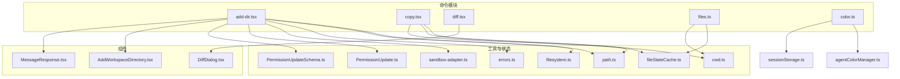
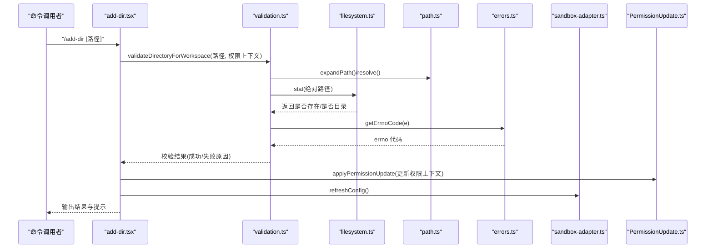
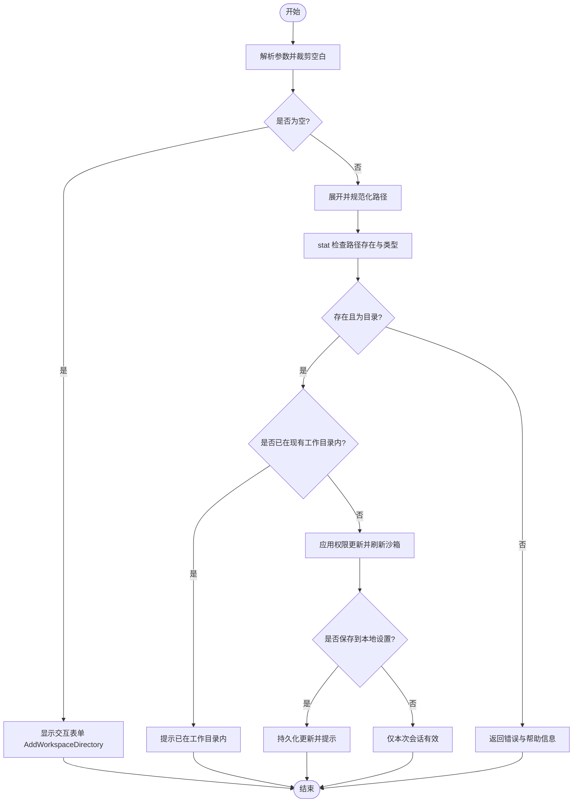
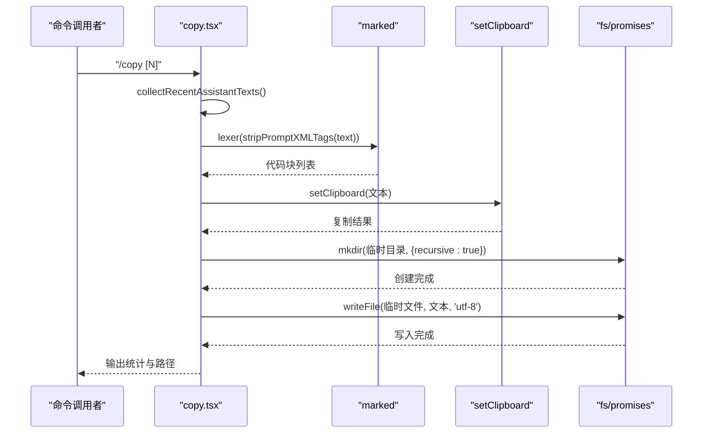
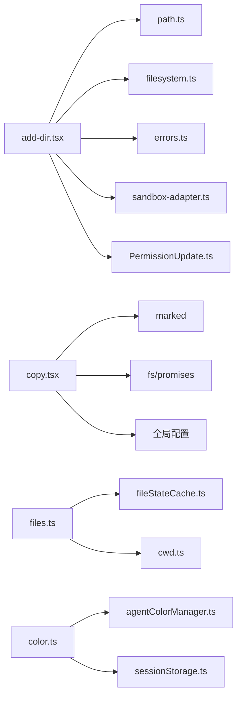

# 文件操作命令

<cite>
**本文引用的文件**
- [add-dir.tsx](file://src/commands/add-dir/add-dir.tsx)
- [validation.ts](file://src/commands/add-dir/validation.ts)
- [copy.tsx](file://src/commands/copy/copy.tsx)
- [diff.tsx](file://src/commands/diff/diff.tsx)
- [files.ts](file://src/commands/files/files.ts)
- [color.ts](file://src/commands/color/color.ts)
- [filesystem.ts](file://src/utils/permissions/filesystem.ts)
- [path.ts](file://src/utils/path.ts)
- [errors.ts](file://src/utils/errors.ts)
- [cwd.ts](file://src/utils/cwd.ts)
- [fileStateCache.ts](file://src/utils/fileStateCache.ts)
- [agentColorManager.ts](file://src/tools/AgentTool/agentColorManager.ts)
- [sessionStorage.ts](file://src/utils/sessionStorage.ts)
- [sandbox-adapter.ts](file://src/utils/sandbox/sandbox-adapter.ts)
- [PermissionUpdate.ts](file://src/utils/permissions/PermissionUpdate.ts)
- [PermissionUpdateSchema.ts](file://src/utils/permissions/PermissionUpdateSchema.ts)
- [AddWorkspaceDirectory.tsx](file://src/components/permissions/rules/AddWorkspaceDirectory.tsx)
- [MessageResponse.tsx](file://src/components/MessageResponse.tsx)
- [DiffDialog.tsx](file://src/components/diff/DiffDialog.tsx)
</cite>

## 目录
1. [简介](#简介)
2. [项目结构](#项目结构)
3. [核心组件](#核心组件)
4. [架构总览](#架构总览)
5. [详细组件分析](#详细组件分析)
6. [依赖关系分析](#依赖关系分析)
7. [性能考量](#性能考量)
8. [故障排查指南](#故障排查指南)
9. [结论](#结论)
10. [附录](#附录)

## 简介
本文件聚焦于文件操作相关命令的实现与使用，涵盖以下命令：
- add-dir：将工作目录添加到会话或持久化配置，支持路径校验、权限更新与沙箱刷新
- copy：从最近的助手消息中提取文本与代码块，支持复制到剪贴板与写入临时文件，以及交互式选择
- diff：打开对话差异视图，用于可视化对比消息变化
- files：列出当前上下文中已读取文件的相对路径
- color：为会话设置代理颜色，支持重置为默认色

文档将从输入输出、路径处理、权限与错误处理、性能优化与资源消耗等方面进行系统阐述，并提供流程图与序列图帮助理解。

## 项目结构
围绕文件操作命令的相关文件组织如下：
- 命令入口与实现：位于 src/commands 下的各子目录
- 路径与权限工具：位于 src/utils 与 src/components/permissions/rules
- 组件与状态：位于 src/components 与 src/bootstrap/state

图表来源
- [add-dir.tsx:1-126](file://src/commands/add-dir/add-dir.tsx#L1-L126)
- [validation.ts:1-111](file://src/commands/add-dir/validation.ts#L1-L111)
- [copy.tsx:1-371](file://src/commands/copy/copy.tsx#L1-L371)
- [diff.tsx:1-9](file://src/commands/diff/diff.tsx#L1-L9)
- [files.ts:1-20](file://src/commands/files/files.ts#L1-L20)
- [color.ts:1-94](file://src/commands/color/color.ts#L1-L94)
- [filesystem.ts](file://src/utils/permissions/filesystem.ts)
- [path.ts](file://src/utils/path.ts)
- [errors.ts](file://src/utils/errors.ts)
- [cwd.ts](file://src/utils/cwd.ts)
- [fileStateCache.ts](file://src/utils/fileStateCache.ts)
- [sandbox-adapter.ts](file://src/utils/sandbox/sandbox-adapter.ts)
- [PermissionUpdate.ts](file://src/utils/permissions/PermissionUpdate.ts)
- [PermissionUpdateSchema.ts](file://src/utils/permissions/PermissionUpdateSchema.ts)
- [AddWorkspaceDirectory.tsx](file://src/components/permissions/rules/AddWorkspaceDirectory.tsx)
- [MessageResponse.tsx](file://src/components/MessageResponse.tsx)
- [DiffDialog.tsx](file://src/components/diff/DiffDialog.tsx)

章节来源
- [add-dir.tsx:1-126](file://src/commands/add-dir/add-dir.tsx#L1-L126)
- [validation.ts:1-111](file://src/commands/add-dir/validation.ts#L1-L111)
- [copy.tsx:1-371](file://src/commands/copy/copy.tsx#L1-L371)
- [diff.tsx:1-9](file://src/commands/diff/diff.tsx#L1-L9)
- [files.ts:1-20](file://src/commands/files/files.ts#L1-L20)
- [color.ts:1-94](file://src/commands/color/color.ts#L1-L94)

## 核心组件
- add-dir：负责工作目录的添加与校验，更新权限上下文与沙箱配置，支持“本次会话”或“本地设置”两种持久化方式
- copy：从最近助手消息中提取文本与代码块，优先复制到剪贴板，同时写入临时目录作为回退；支持交互式选择与快捷键
- diff：打开差异视图，用于可视化消息变化
- files：列出当前上下文中已读取文件的相对路径
- color：设置/重置代理颜色，持久化到会话存储并在应用状态中即时生效

章节来源
- [add-dir.tsx:65-126](file://src/commands/add-dir/add-dir.tsx#L65-L126)
- [validation.ts:31-93](file://src/commands/add-dir/validation.ts#L31-L93)
- [copy.tsx:334-371](file://src/commands/copy/copy.tsx#L334-L371)
- [diff.tsx:3-8](file://src/commands/diff/diff.tsx#L3-L8)
- [files.ts:7-19](file://src/commands/files/files.ts#L7-L19)
- [color.ts:20-93](file://src/commands/color/color.ts#L20-L93)

## 架构总览
下图展示了 add-dir 与 copy 的关键调用链与依赖关系：

图表来源
- [add-dir.tsx:65-126](file://src/commands/add-dir/add-dir.tsx#L65-L126)
- [validation.ts:31-93](file://src/commands/add-dir/validation.ts#L31-L93)
- [filesystem.ts](file://src/utils/permissions/filesystem.ts)
- [path.ts](file://src/utils/path.ts)
- [errors.ts](file://src/utils/errors.ts)
- [sandbox-adapter.ts](file://src/utils/sandbox/sandbox-adapter.ts)
- [PermissionUpdate.ts](file://src/utils/permissions/PermissionUpdate.ts)

## 详细组件分析

### add-dir 命令
- 功能概述
  - 添加工作目录至当前会话或本地设置
  - 路径合法性校验（存在性、类型、是否已在现有工作目录内）
  - 更新权限上下文与沙箱配置，保证后续命令可访问新增目录
- 输入输出
  - 输入：可选路径参数；若省略则弹出交互表单
  - 输出：成功/失败提示；失败时附带帮助信息与使用提示
- 路径处理
  - 使用路径展开与规范化，避免尾部斜杠差异导致的重复
  - 统一转为绝对路径后进行目录检测
- 权限与错误处理
  - 对不存在、非目录、权限不足等情况进行分类处理
  - 使用 errno 代码映射统一错误语义，避免崩溃
  - 成功后应用权限更新并刷新沙箱配置
- 性能与资源
  - 单次系统调用检测路径是否存在与类型
  - 仅在需要时持久化到本地设置，减少 IO

图表来源
- [add-dir.tsx:65-126](file://src/commands/add-dir/add-dir.tsx#L65-L126)
- [validation.ts:31-93](file://src/commands/add-dir/validation.ts#L31-L93)

章节来源
- [add-dir.tsx:65-126](file://src/commands/add-dir/add-dir.tsx#L65-L126)
- [validation.ts:31-93](file://src/commands/add-dir/validation.ts#L31-L93)

### copy 命令
- 功能概述
  - 从最近助手消息中提取文本与代码块
  - 优先复制到剪贴板，同时写入临时目录作为回退
  - 支持交互式选择、快捷键写入文件、全局配置“总是复制全文”
- 输入输出
  - 输入：可选参数 N（回溯第 N 个消息，1 为最新）
  - 输出：复制/写入结果与统计（字符数、行数）
- 文本与代码块提取
  - 使用标记解析器提取代码块，语言标识用于生成文件扩展名
- 路径与文件落盘
  - 临时目录固定为系统临时目录下的 claude 子目录
  - 写入 UTF-8 文本，递归创建目录
- 错误处理
  - 写入失败时仅提示，不影响剪贴板复制
  - 参数非法或可用消息不足时给出明确提示
- 性能与资源
  - 仅在需要时写入临时文件，避免不必要的 IO
  - 通过全局配置减少交互开销

图表来源
- [copy.tsx:334-371](file://src/commands/copy/copy.tsx#L334-L371)
- [copy.tsx:30-43](file://src/commands/copy/copy.tsx#L30-L43)
- [copy.tsx:73-94](file://src/commands/copy/copy.tsx#L73-L94)

章节来源
- [copy.tsx:334-371](file://src/commands/copy/copy.tsx#L334-L371)
- [copy.tsx:30-43](file://src/commands/copy/copy.tsx#L30-L43)
- [copy.tsx:73-94](file://src/commands/copy/copy.tsx#L73-L94)

### diff 命令
- 功能概述
  - 打开差异视图，用于可视化消息变化
- 输入输出
  - 输入：无参数
  - 输出：渲染差异对话框组件
- 实现要点
  - 动态导入差异对话框组件并传入消息上下文

章节来源
- [diff.tsx:3-8](file://src/commands/diff/diff.tsx#L3-L8)

### files 命令
- 功能概述
  - 列出当前上下文中已读取文件的相对路径
- 输入输出
  - 输入：无参数
  - 输出：文本列表（若无文件则提示）
- 实现要点
  - 从读取状态缓存中获取键集合，结合当前工作目录生成相对路径

章节来源
- [files.ts:7-19](file://src/commands/files/files.ts#L7-L19)

### color 命令
- 功能概述
  - 设置/重置代理颜色，支持别名重置为默认色
- 输入输出
  - 输入：颜色名称或别名
  - 输出：设置结果与提示
- 实现要点
  - 校验颜色是否在允许列表
  - 支持别名重置，使用特定哨兵值以保持跨会话重置效果
  - 持久化到会话存储并立即更新应用状态

章节来源
- [color.ts:20-93](file://src/commands/color/color.ts#L20-L93)
- [agentColorManager.ts](file://src/tools/AgentTool/agentColorManager.ts)
- [sessionStorage.ts](file://src/utils/sessionStorage.ts)

## 依赖关系分析
- add-dir 依赖
  - 路径工具：展开与规范化
  - 权限工具：工作目录集合与包含关系判断
  - 错误工具：errno 代码映射
  - 沙箱适配器：刷新配置以使新目录生效
  - 权限更新：应用并持久化权限变更
- copy 依赖
  - 消息解析：提取文本内容
  - 标记解析：提取代码块
  - 终端剪贴板：OSC 52 写入
  - 文件系统：临时目录写入
- files 依赖
  - 读取状态缓存：获取已读取文件键
  - 当前工作目录：生成相对路径
- color 依赖
  - 代理颜色管理：颜色枚举与校验
  - 会话存储：持久化颜色
  - 应用状态：即时更新 UI

图表来源
- [add-dir.tsx:1-126](file://src/commands/add-dir/add-dir.tsx#L1-L126)
- [validation.ts:1-111](file://src/commands/add-dir/validation.ts#L1-L111)
- [copy.tsx:1-371](file://src/commands/copy/copy.tsx#L1-L371)
- [files.ts:1-20](file://src/commands/files/files.ts#L1-L20)
- [color.ts:1-94](file://src/commands/color/color.ts#L1-L94)
- [filesystem.ts](file://src/utils/permissions/filesystem.ts)
- [path.ts](file://src/utils/path.ts)
- [errors.ts](file://src/utils/errors.ts)
- [sandbox-adapter.ts](file://src/utils/sandbox/sandbox-adapter.ts)
- [PermissionUpdate.ts](file://src/utils/permissions/PermissionUpdate.ts)
- [fileStateCache.ts](file://src/utils/fileStateCache.ts)
- [cwd.ts](file://src/utils/cwd.ts)
- [agentColorManager.ts](file://src/tools/AgentTool/agentColorManager.ts)
- [sessionStorage.ts](file://src/utils/sessionStorage.ts)

## 性能考量
- add-dir
  - 单次 stat 系统调用，避免重复 IO
  - 仅在需要时持久化，降低写入频率
- copy
  - 优先剪贴板复制，避免写入临时文件
  - 临时文件写入采用递归创建，减少失败重试
  - 通过全局配置减少交互轮次
- files
  - 仅遍历缓存键集合，时间复杂度 O(n)，n 为已读取文件数量
- color
  - 仅在必要时写入会话存储，避免频繁 IO

[本节为通用性能讨论，不直接分析具体文件，故无章节来源]

## 故障排查指南
- add-dir
  - 路径不存在/权限不足：根据 errno 代码返回“未找到/不可访问”，建议检查路径与权限
  - 非目录：提示是否应添加其父目录
  - 已在工作目录内：无需重复添加
- copy
  - 无可用助手消息：提示无可复制的消息
  - 参数非法：提示正确用法与取值范围
  - 写入失败：提示写入失败但仍可使用剪贴板
- files
  - 无文件：提示上下文中无文件
- color
  - 颜色无效：列出可用颜色与默认别名
  - 会话为协同成员：禁止自行设置颜色

章节来源
- [validation.ts:95-111](file://src/commands/add-dir/validation.ts#L95-L111)
- [copy.tsx:334-371](file://src/commands/copy/copy.tsx#L334-L371)
- [files.ts:13-18](file://src/commands/files/files.ts#L13-L18)
- [color.ts:25-32](file://src/commands/color/color.ts#L25-L32)
- [color.ts:66-73](file://src/commands/color/color.ts#L66-L73)

## 结论
上述文件操作命令围绕路径校验、权限更新、剪贴板与文件落盘、上下文文件列表与颜色管理构建了完整的本地文件交互能力。通过最小化系统调用、优先剪贴板复制、缓存键遍历与别名重置等策略，既保证了易用性，又兼顾了性能与稳定性。建议在大规模批量处理时结合 files 命令与 copy 命令，配合全局配置减少交互成本；在需要跨平台一致性时，注意路径规范化与行尾处理策略。

[本节为总结性内容，不直接分析具体文件，故无章节来源]

## 附录
- 常见使用场景
  - 批量文件处理：先用 files 列出上下文文件，再用 copy 选择性复制或写入
  - 路径解析：add-dir 自动展开与规范化路径，避免斜杠差异导致的重复
  - 权限管理：add-dir 成功后刷新沙箱配置，确保后续命令可访问新目录
  - 跨平台兼容：copy 在写入临时文件时使用 UTF-8，避免编码问题
- 性能优化建议
  - 使用全局配置“总是复制全文”减少交互轮次
  - 在高并发场景下避免频繁刷新沙箱配置，合并操作批次
  - 控制一次性复制/写入的数据量，避免内存峰值过高

[本节为概念性内容，不直接分析具体文件，故无章节来源]