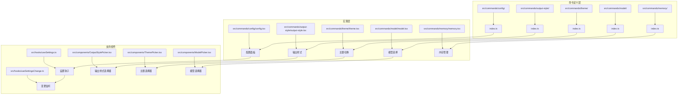
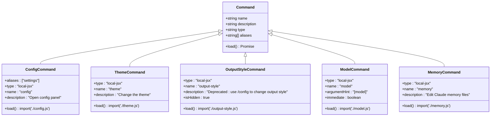
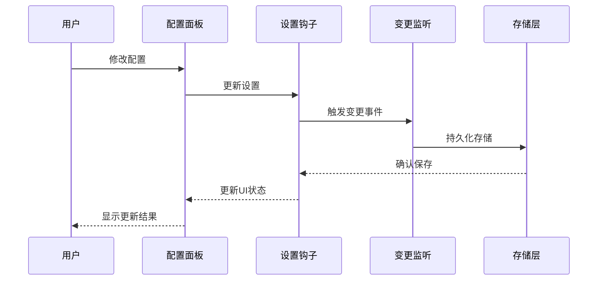
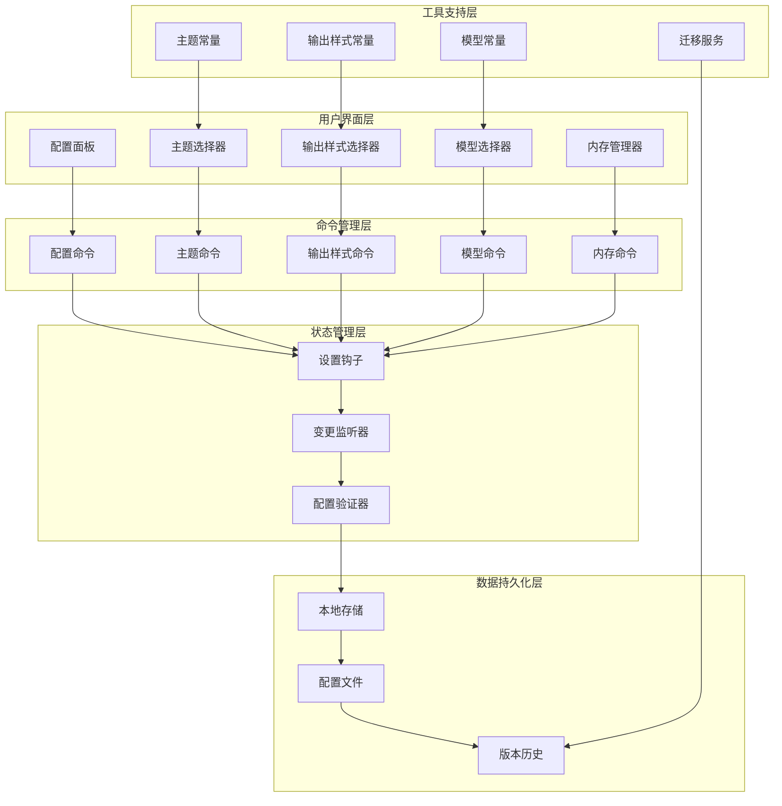
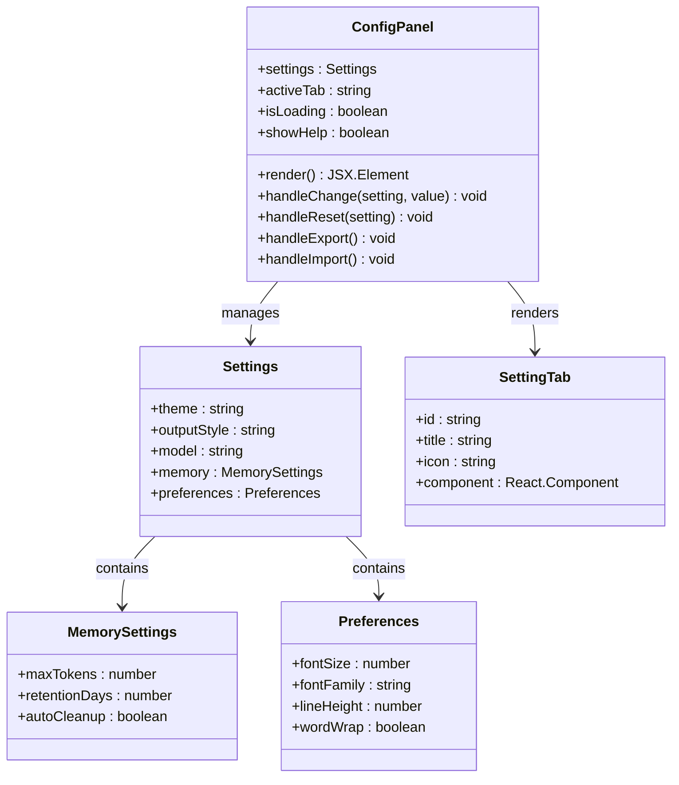
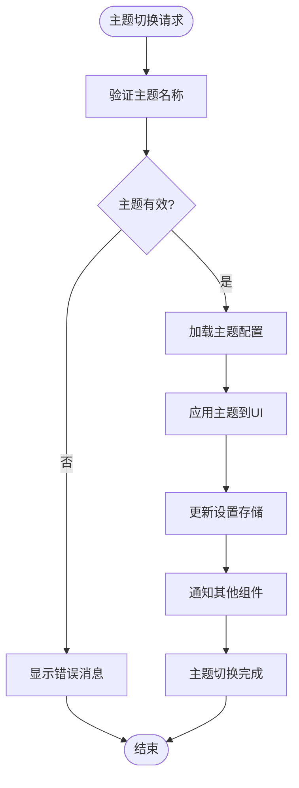
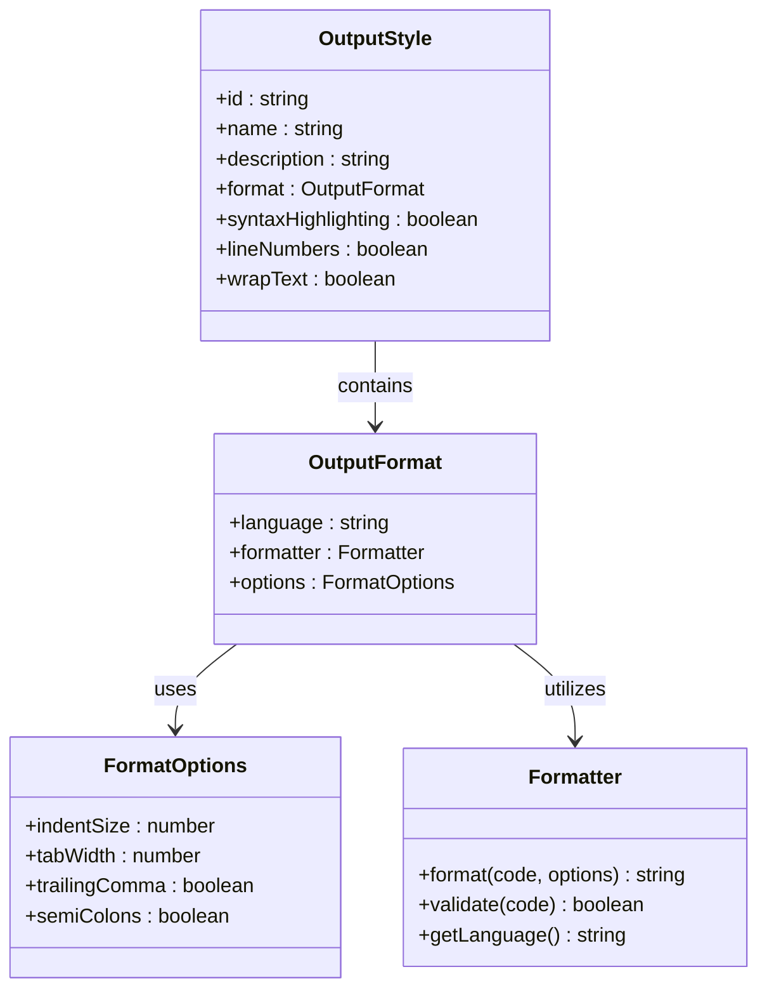
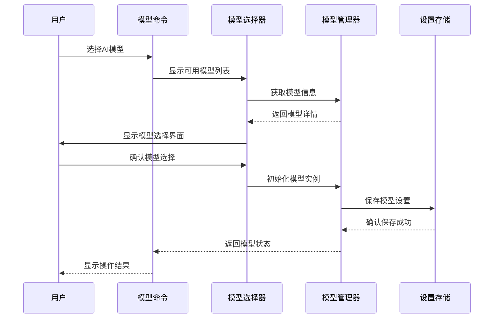
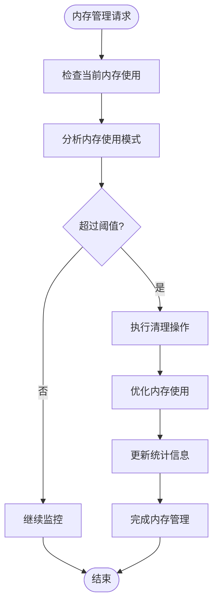
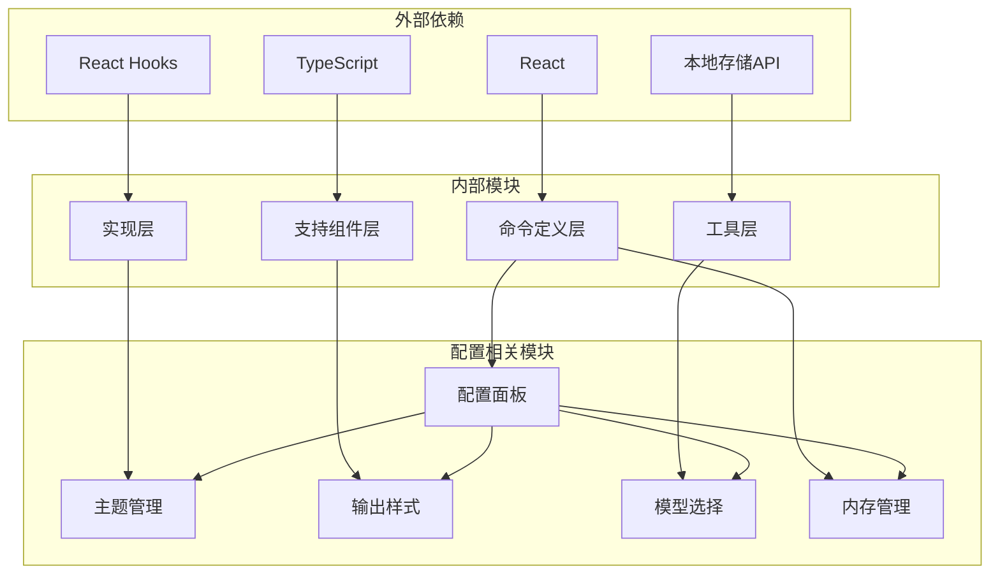

# 配置管理命令

<cite>
**本文档引用的文件**
- [src/commands/config/index.ts](file://src/commands/config/index.ts)
- [src/commands/config/config.tsx](file://src/commands/config/config.tsx)
- [src/commands/output-style/index.ts](file://src/commands/output-style/index.ts)
- [src/commands/output-style/output-style.tsx](file://src/commands/output-style/output-style.tsx)
- [src/commands/theme/index.ts](file://src/commands/theme/index.ts)
- [src/commands/theme/theme.tsx](file://src/commands/theme/theme.tsx)
- [src/commands/model/index.ts](file://src/commands/model/index.ts)
- [src/commands/model/model.tsx](file://src/commands/model/model.tsx)
- [src/commands/memory/index.ts](file://src/commands/memory/index.ts)
- [src/commands/memory/memory.tsx](file://src/commands/memory/memory.tsx)
- [src/hooks/useSettings.ts](file://src/hooks/useSettings.ts)
- [src/hooks/useSettingsChange.ts](file://src/hooks/useSettingsChange.ts)
- [src/constants/outputStyles.ts](file://src/constants/outputStyles.ts)
- [src/components/OutputStylePicker.tsx](file://src/components/OutputStylePicker.tsx)
- [src/components/ThemePicker.tsx](file://src/components/ThemePicker.tsx)
- [src/components/ModelPicker.tsx](file://src/components/ModelPicker.tsx)
- [src/migrations/migrateLegacyOpusToCurrent.ts](file://src/migrations/migrateLegacyOpusToCurrent.ts)
- [src/migrations/migrateSonnet1mToSonnet45.ts](file://src/migrations/migrateSonnet1mToSonnet45.ts)
- [src/migrations/migrateSonnet45ToSonnet46.ts](file://src/migrations/migrateSonnet45ToSonnet46.ts)
</cite>

## 目录
1. [简介](#简介)
2. [项目结构](#项目结构)
3. [核心组件](#核心组件)
4. [架构概览](#架构概览)
5. [详细组件分析](#详细组件分析)
6. [依赖分析](#依赖分析)
7. [性能考虑](#性能考虑)
8. [故障排除指南](#故障排除指南)
9. [结论](#结论)
10. [附录](#附录)

## 简介

配置管理命令是 Claude Code 开发工具中的核心功能模块，负责管理系统设置、主题样式、输出格式和模型选择等关键配置。本文档深入介绍了 config、output-style、theme、model、memory 等配置相关命令，解释了配置文件结构、参数验证和默认值处理机制，并提供了配置项分类说明、优先级规则和继承关系。

该系统采用现代化的 React 组件架构，支持实时配置更新和版本管理，为用户提供个性化的开发体验。通过统一的配置面板，用户可以轻松管理各种设置选项，包括界面主题、输出样式、AI 模型选择以及内存管理等功能。

## 项目结构

配置管理命令分布在项目的多个目录中，形成了清晰的功能模块化结构：

**图表来源**
- [src/commands/config/index.ts:1-12](file://src/commands/config/index.ts#L1-L12)
- [src/commands/theme/index.ts:1-11](file://src/commands/theme/index.ts#L1-L11)
- [src/commands/output-style/index.ts:1-12](file://src/commands/output-style/index.ts#L1-L12)
- [src/commands/model/index.ts:1-17](file://src/commands/model/index.ts#L1-L17)
- [src/commands/memory/index.ts:1-11](file://src/commands/memory/index.ts#L1-L11)

**章节来源**
- [src/commands/config/index.ts:1-12](file://src/commands/config/index.ts#L1-L12)
- [src/commands/theme/index.ts:1-11](file://src/commands/theme/index.ts#L1-L11)
- [src/commands/output-style/index.ts:1-12](file://src/commands/output-style/index.ts#L1-L12)
- [src/commands/model/index.ts:1-17](file://src/commands/model/index.ts#L1-L17)
- [src/commands/memory/index.ts:1-11](file://src/commands/memory/index.ts#L1-L11)

## 核心组件

配置管理系统的五个核心命令构成了完整的配置管理体系：

### 命令注册与加载机制

每个配置命令都通过统一的注册机制进行定义，支持异步加载和延迟初始化：

**图表来源**
- [src/commands/config/index.ts:3-9](file://src/commands/config/index.ts#L3-L9)
- [src/commands/theme/index.ts:3-8](file://src/commands/theme/index.ts#L3-L8)
- [src/commands/output-style/index.ts:3-9](file://src/commands/output-style/index.ts#L3-L9)
- [src/commands/model/index.ts:5-16](file://src/commands/model/index.ts#L5-L16)
- [src/commands/memory/index.ts:3-8](file://src/commands/memory/index.ts#L3-L8)

### 设置状态管理

系统使用 React Hooks 进行状态管理，提供响应式的配置更新机制：

**图表来源**
- [src/hooks/useSettings.ts](file://src/hooks/useSettings.ts)
- [src/hooks/useSettingsChange.ts](file://src/hooks/useSettingsChange.ts)

**章节来源**
- [src/commands/config/index.ts:1-12](file://src/commands/config/index.ts#L1-L12)
- [src/commands/theme/index.ts:1-11](file://src/commands/theme/index.ts#L1-L11)
- [src/commands/output-style/index.ts:1-12](file://src/commands/output-style/index.ts#L1-L12)
- [src/commands/model/index.ts:1-17](file://src/commands/model/index.ts#L1-L17)
- [src/commands/memory/index.ts:1-11](file://src/commands/memory/index.ts#L1-L11)

## 架构概览

配置管理系统采用分层架构设计，确保了良好的可维护性和扩展性：

**图表来源**
- [src/commands/config/config.tsx](file://src/commands/config/config.tsx)
- [src/commands/theme/theme.tsx](file://src/commands/theme/theme.tsx)
- [src/commands/output-style/output-style.tsx](file://src/commands/output-style/output-style.tsx)
- [src/commands/model/model.tsx](file://src/commands/model/model.tsx)
- [src/commands/memory/memory.tsx](file://src/commands/memory/memory.tsx)

## 详细组件分析

### 配置命令 (config)

配置命令是整个配置管理系统的核心入口，提供统一的配置面板界面：

#### 配置面板架构

**图表来源**
- [src/commands/config/config.tsx](file://src/commands/config/config.tsx)
- [src/hooks/useSettings.ts](file://src/hooks/useSettings.ts)

#### 配置面板功能特性

配置面板支持以下主要功能：
- 多标签页组织的设置界面
- 实时配置预览和应用
- 导入导出配置备份
- 设置重置和恢复默认值
- 帮助信息和使用指导

**章节来源**
- [src/commands/config/index.ts:1-12](file://src/commands/config/index.ts#L1-L12)
- [src/commands/config/config.tsx](file://src/commands/config/config.tsx)

### 主题命令 (theme)

主题命令负责管理应用程序的主题外观和视觉样式：

#### 主题系统架构

**图表来源**
- [src/commands/theme/theme.tsx](file://src/commands/theme/theme.tsx)
- [src/components/ThemePicker.tsx](file://src/components/ThemePicker.tsx)

#### 支持的主题类型

系统支持多种主题类型，包括：
- 明亮主题 (Light Theme)
- 深色主题 (Dark Theme)
- 自定义主题 (Custom Theme)
- 高对比度主题 (High Contrast Theme)

**章节来源**
- [src/commands/theme/index.ts:1-11](file://src/commands/theme/index.ts#L1-L11)
- [src/commands/theme/theme.tsx](file://src/commands/theme/theme.tsx)

### 输出样式命令 (output-style)

输出样式命令控制代码输出的格式化和显示方式：

#### 输出样式系统

**图表来源**
- [src/commands/output-style/output-style.tsx](file://src/commands/output-style/output-style.tsx)
- [src/constants/outputStyles.ts](file://src/constants/outputStyles.ts)
- [src/components/OutputStylePicker.tsx](file://src/components/OutputStylePicker.tsx)

#### 预定义输出样式

系统提供多种预定义的输出样式：
- 标准代码格式 (Standard Code)
- 精简输出格式 (Minimal Output)
- 详细注释格式 (Verbose Comments)
- JSON 格式 (JSON Format)
- XML 格式 (XML Format)

**章节来源**
- [src/commands/output-style/index.ts:1-12](file://src/commands/output-style/index.ts#L1-L12)
- [src/commands/output-style/output-style.tsx](file://src/commands/output-style/output-style.tsx)

### 模型命令 (model)

模型命令用于选择和配置 AI 模型，支持即时模式和延迟模式：

#### 模型选择流程

**图表来源**
- [src/commands/model/model.tsx](file://src/commands/model/model.tsx)
- [src/components/ModelPicker.tsx](file://src/components/ModelPicker.tsx)

#### 模型配置选项

系统支持多种 AI 模型配置：
- 模型名称和版本
- 推理参数设置
- 性能优化选项
- 成本控制设置

**章节来源**
- [src/commands/model/index.ts:1-17](file://src/commands/model/index.ts#L1-L17)
- [src/commands/model/model.tsx](file://src/commands/model/model.tsx)

### 内存命令 (memory)

内存命令用于管理应用程序的内存使用和缓存策略：

#### 内存管理架构

**图表来源**
- [src/commands/memory/memory.tsx](file://src/commands/memory/memory.tsx)

#### 内存配置参数

内存管理支持以下配置参数：
- 最大令牌数限制
- 数据保留天数
- 自动清理开关
- 缓存大小调整

**章节来源**
- [src/commands/memory/index.ts:1-11](file://src/commands/memory/index.ts#L1-L11)
- [src/commands/memory/memory.tsx](file://src/commands/memory/memory.tsx)

## 依赖分析

配置管理系统具有清晰的依赖关系，确保了模块间的松耦合和高内聚：

**图表来源**
- [src/commands/config/config.tsx](file://src/commands/config/config.tsx)
- [src/commands/theme/theme.tsx](file://src/commands/theme/theme.tsx)
- [src/commands/output-style/output-style.tsx](file://src/commands/output-style/output-style.tsx)
- [src/commands/model/model.tsx](file://src/commands/model/model.tsx)
- [src/commands/memory/memory.tsx](file://src/commands/memory/memory.tsx)

### 关键依赖关系

系统的关键依赖关系包括：
- 所有命令模块依赖于统一的命令注册机制
- 实现层依赖于相应的支持组件
- 状态管理依赖于 React Hooks 生态系统
- 数据持久化依赖于浏览器本地存储 API

**章节来源**
- [src/commands/config/index.ts:1-12](file://src/commands/config/index.ts#L1-L12)
- [src/commands/theme/index.ts:1-11](file://src/commands/theme/index.ts#L1-L11)
- [src/commands/output-style/index.ts:1-12](file://src/commands/output-style/index.ts#L1-L12)
- [src/commands/model/index.ts:1-17](file://src/commands/model/index.ts#L1-L17)
- [src/commands/memory/index.ts:1-11](file://src/commands/memory/index.ts#L1-L11)

## 性能考虑

配置管理系统在设计时充分考虑了性能优化，采用了多种策略来确保流畅的用户体验：

### 异步加载策略

所有配置命令都采用异步加载机制，避免了不必要的初始包体积：
- 延迟导入配置组件
- 按需加载主题资源
- 动态加载输出样式
- 智能缓存模型配置

### 内存优化

系统实现了多项内存优化措施：
- 组件卸载时自动清理事件监听器
- 避免不必要的重新渲染
- 合理的缓存策略
- 及时释放临时资源

### 性能监控

系统内置了性能监控机制：
- 配置切换的响应时间统计
- 内存使用情况监控
- 渲染性能指标跟踪
- 错误和异常报告

## 故障排除指南

配置管理系统提供了完善的错误处理和故障排除机制：

### 常见问题及解决方案

#### 配置加载失败

**症状**: 配置面板无法正常显示或加载

**可能原因**:
- 配置文件损坏
- 权限不足
- 网络连接问题
- 浏览器兼容性问题

**解决步骤**:
1. 检查配置文件完整性
2. 验证文件权限设置
3. 确认网络连接正常
4. 尝试清除浏览器缓存
5. 使用兼容性更好的浏览器

#### 主题切换异常

**症状**: 主题切换后界面显示异常

**可能原因**:
- 主题文件缺失
- CSS 样式冲突
- 浏览器缓存问题
- 主题配置错误

**解决步骤**:
1. 检查主题文件是否存在
2. 清除浏览器 CSS 缓存
3. 验证主题配置语法
4. 回退到默认主题
5. 检查浏览器开发者工具中的错误信息

#### 模型选择失败

**症状**: 无法选择或切换 AI 模型

**可能原因**:
- 模型配置文件损坏
- API 密钥无效
- 网络连接中断
- 模型版本不兼容

**解决步骤**:
1. 验证 API 密钥有效性
2. 检查网络连接状态
3. 更新模型配置文件
4. 重启模型服务
5. 联系技术支持

### 调试工具和方法

系统提供了多种调试工具：
- 控制台日志输出
- 配置状态检查器
- 性能分析工具
- 错误报告机制

**章节来源**
- [src/hooks/useSettings.ts](file://src/hooks/useSettings.ts)
- [src/hooks/useSettingsChange.ts](file://src/hooks/useSettingsChange.ts)

## 结论

配置管理命令系统为 Claude Code 提供了一个完整、灵活且用户友好的配置解决方案。通过模块化的架构设计、清晰的命令分离和强大的状态管理机制，系统能够满足从个人开发者到团队协作的各种配置需求。

该系统的主要优势包括：
- 统一的配置入口和直观的用户界面
- 灵活的配置项分类和优先级管理
- 完善的版本管理和迁移策略
- 良好的性能表现和错误处理机制
- 支持个性化配置和团队共享配置

未来的发展方向包括进一步增强配置的可视化编辑能力、提供更多的配置模板和预设选项，以及优化配置同步和备份功能。

## 附录

### 配置最佳实践

#### 个性化配置建议
- 为不同项目类型设置专门的配置模板
- 定期备份重要的配置设置
- 使用版本控制系统管理配置文件
- 建立配置变更的审批流程

#### 团队共享配置策略
- 创建标准化的团队配置模板
- 建立配置共享和同步机制
- 制定配置使用的统一规范
- 定期审查和更新团队配置

#### 环境特定配置管理
- 区分开发、测试和生产环境的配置
- 使用环境变量管理敏感信息
- 建立配置的环境隔离机制
- 实施配置的环境迁移策略

### 版本管理与迁移

系统内置了完善的版本管理和迁移机制：
- 自动检测配置版本差异
- 提供安全的配置迁移方案
- 支持回滚到之前的配置版本
- 记录配置变更的历史记录