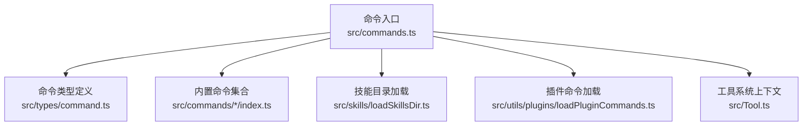
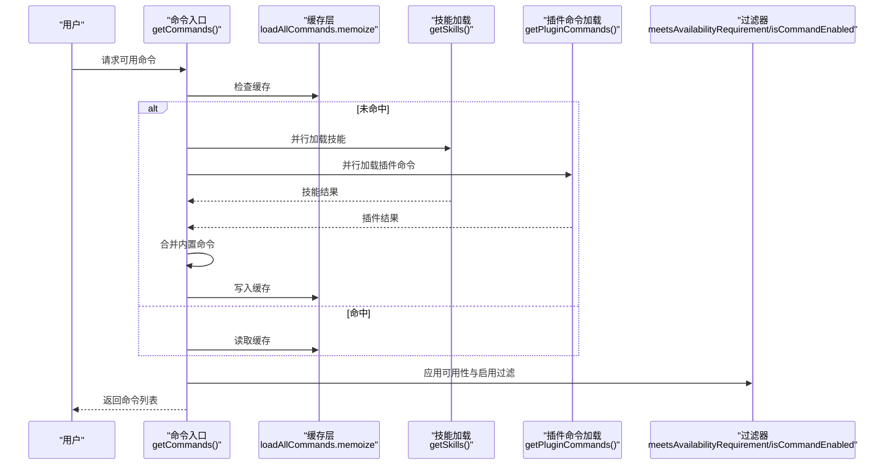
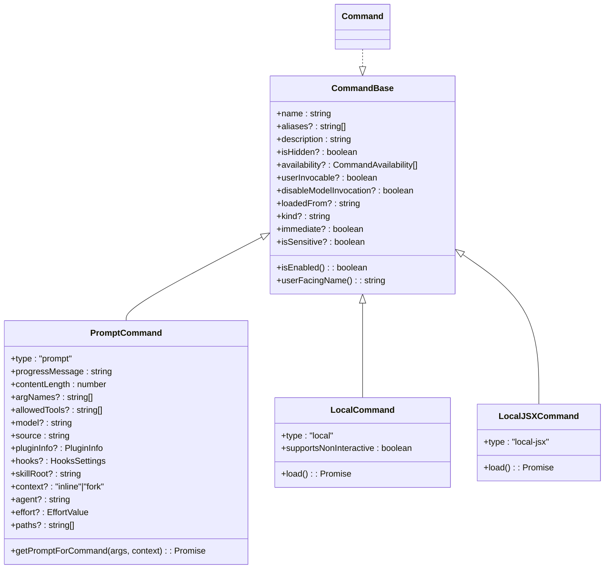
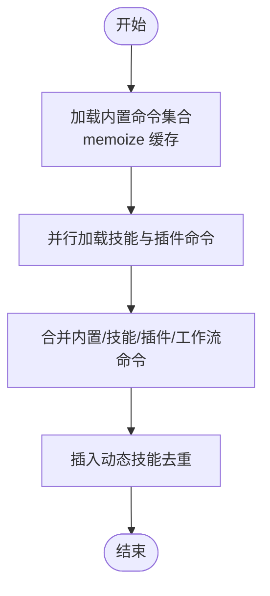
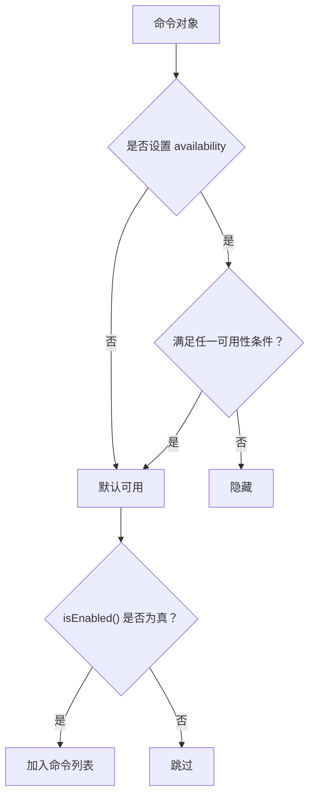
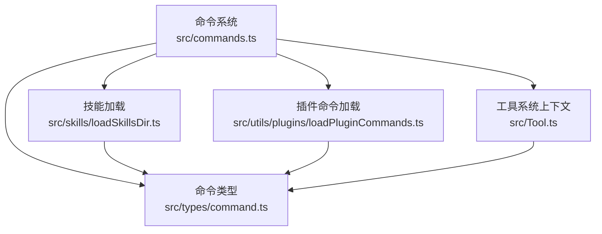

# 命令架构设计

<cite>
**本文档引用的文件**
- [src/commands.ts](file://src/commands.ts)
- [src/types/command.ts](file://src/types/command.ts)
- [src/commands/init.ts](file://src/commands/init.ts)
- [src/commands/init-verifiers.ts](file://src/commands/init-verifiers.ts)
- [src/Tool.ts](file://src/Tool.ts)
- [src/utils/plugins/loadPluginCommands.ts](file://src/utils/plugins/loadPluginCommands.ts)
- [src/skills/loadSkillsDir.ts](file://src/skills/loadSkillsDir.ts)
</cite>

## 目录
1. [引言](#引言)
2. [项目结构](#项目结构)
3. [核心组件](#核心组件)
4. [架构总览](#架构总览)
5. [详细组件分析](#详细组件分析)
6. [依赖关系分析](#依赖关系分析)
7. [性能考量](#性能考量)
8. [故障排查指南](#故障排查指南)
9. [结论](#结论)
10. [附录](#附录)

## 引言
本文件系统化阐述命令系统的整体架构与实现细节，覆盖命令类型与生命周期、命令注册与发现机制、可用性检查与启用状态控制、命令分类体系（prompt、local、local-jsx）、命令优先级与冲突处理、命令缓存策略与动态加载、内存优化、核心接口与扩展点，以及与会话状态、权限系统、工具系统的集成关系。文档同时提供流程图与时序图帮助理解，并给出最佳实践建议。

## 项目结构
命令系统位于 src/commands 目录，核心入口在 src/commands.ts，命令类型定义在 src/types/command.ts。技能与插件命令通过独立模块动态加载，工具系统在 src/Tool.ts 中提供上下文与权限集成能力。

图表来源
- [src/commands.ts:1-755](file://src/commands.ts#L1-L755)
- [src/types/command.ts:1-217](file://src/types/command.ts#L1-L217)
- [src/skills/loadSkillsDir.ts:1-800](file://src/skills/loadSkillsDir.ts#L1-L800)
- [src/utils/plugins/loadPluginCommands.ts:1-800](file://src/utils/plugins/loadPluginCommands.ts#L1-L800)
- [src/Tool.ts:1-793](file://src/Tool.ts#L1-L793)

章节来源
- [src/commands.ts:1-755](file://src/commands.ts#L1-L755)
- [src/types/command.ts:1-217](file://src/types/command.ts#L1-L217)

## 核心组件
- 命令类型与接口：统一的 Command 接口，支持 prompt、local、local-jsx 三类命令；提供命令元数据（名称、别名、描述、来源、是否启用、是否隐藏、是否可被模型调用等）。
- 命令注册与聚合：集中导出所有内置命令，按需懒加载与条件导入，结合技能与插件命令进行合并。
- 可用性与启用控制：通过 availability（认证/提供商要求）与 isEnabled（功能开关/环境检测）双重过滤；运行时重新评估以响应登录态变化。
- 动态加载与缓存：memoize 缓存命令列表与技能索引，按工作目录缓存，避免重复磁盘 I/O 与动态导入开销。
- 远程安全与桥接：提供远程模式与桥接通道的安全命令白名单，区分 prompt 命令与 local 命令的执行范围。
- 与工具系统集成：命令在 ToolUseContext 下运行，具备权限校验、进度回调、消息注入、会话状态更新等能力。

章节来源
- [src/commands.ts:256-517](file://src/commands.ts#L256-L517)
- [src/types/command.ts:175-217](file://src/types/command.ts#L175-L217)
- [src/Tool.ts:158-300](file://src/Tool.ts#L158-L300)

## 架构总览
命令系统采用“集中注册 + 动态聚合 + 条件过滤”的架构。启动时构建内置命令集合，随后异步加载技能与插件命令，再根据可用性与启用状态进行过滤，最终输出可用于当前用户的命令集。

图表来源
- [src/commands.ts:449-517](file://src/commands.ts#L449-L517)
- [src/skills/loadSkillsDir.ts:638-800](file://src/skills/loadSkillsDir.ts#L638-L800)
- [src/utils/plugins/loadPluginCommands.ts:414-677](file://src/utils/plugins/loadPluginCommands.ts#L414-L677)

## 详细组件分析

### 命令类型与生命周期
- 类型定义
  - PromptCommand：面向模型的提示型命令，支持内容长度估算、工具限制、上下文分叉、代理类型、努力值、路径过滤等。
  - LocalCommand：本地命令，延迟加载实现模块，返回文本或紧凑结果。
  - LocalJSXCommand：本地 JSX 命令，延迟加载 UI 组件，用于 REPL 界面交互。
- 生命周期
  - 注册阶段：在 src/commands.ts 中集中导出并 memoize。
  - 运行阶段：通过 ToolUseContext 提供的上下文（消息、权限、工具、会话状态等）执行。
  - 完成阶段：通过 LocalJSXCommandOnDone 回调控制结果展示与后续输入。

图表来源
- [src/types/command.ts:16-217](file://src/types/command.ts#L16-L217)

章节来源
- [src/types/command.ts:16-217](file://src/types/command.ts#L16-L217)

### 命令注册与发现机制
- 内置命令：在 src/commands.ts 中集中导入与导出，使用 memoize 缓存以避免重复初始化。
- 条件导入：基于 feature 标志与环境变量选择性加载特定命令（如 pro-active、assistant、bridge 等）。
- 技能与插件：通过 getSkills() 并行加载技能目录、插件技能与插件命令，统一纳入命令集合。
- 工作流命令：按特性标志动态加载工作流命令生成器。
- 合并与去重：动态技能插入到插件技能之后、内置命令之前，避免重复命名。

图表来源
- [src/commands.ts:256-517](file://src/commands.ts#L256-L517)
- [src/skills/loadSkillsDir.ts:638-800](file://src/skills/loadSkillsDir.ts#L638-L800)
- [src/utils/plugins/loadPluginCommands.ts:414-677](file://src/utils/plugins/loadPluginCommands.ts#L414-L677)

章节来源
- [src/commands.ts:256-517](file://src/commands.ts#L256-L517)

### 可用性检查与启用状态控制
- 可用性（availability）：按认证/提供商维度过滤（如 claude.ai 订阅者、Console 直连用户），在 meetsAvailabilityRequirement 中判定。
- 启用状态（isEnabled）：按功能开关、环境变量、平台策略等动态判断，缺省为启用。
- 运行时刷新：每次 getCommands 调用都会重新评估，确保登录态变化后即时生效。

图表来源
- [src/commands.ts:417-443](file://src/commands.ts#L417-L443)
- [src/types/command.ts:175-217](file://src/types/command.ts#L175-L217)

章节来源
- [src/commands.ts:417-443](file://src/commands.ts#L417-L443)
- [src/types/command.ts:175-217](file://src/types/command.ts#L175-L217)

### 命令分类体系（prompt、local、local-jsx）
- prompt：面向模型的提示型命令，支持工具限制、上下文分叉、路径过滤、努力值等，适合由模型直接调用或用户通过 / 前缀触发。
- local：本地命令，延迟加载实现模块，返回文本或紧凑结果，适合无需 UI 的纯文本操作。
- local-jsx：本地 JSX 命令，延迟加载 UI 组件，适合需要复杂界面交互的命令（如安装向导、配置面板等）。

章节来源
- [src/types/command.ts:25-152](file://src/types/command.ts#L25-L152)

### 命令优先级与冲突处理
- 优先级顺序：内置命令 > 插件命令 > 技能命令 > 动态技能（按位置插入）。
- 冲突处理：动态技能与内置/插件命令同名时去重，保留首次出现的版本；对同一文件的不同路径访问通过 realpath 去重，避免重复加载。

章节来源
- [src/commands.ts:491-516](file://src/commands.ts#L491-L516)
- [src/skills/loadSkillsDir.ts:742-763](file://src/skills/loadSkillsDir.ts#L742-L763)

### 命令缓存策略与动态加载
- memoize 缓存：内置命令集合、技能命令、插件命令、命令列表、技能索引均使用 memoize 缓存，键为工作目录或参数。
- 懒加载：prompt 命令支持 getPromptForCommand 的动态导入；local-jsx 命令支持 load() 延迟加载 UI 模块。
- 清理策略：提供 clearCommandMemoizationCaches、clearCommandsCache 等清理函数，用于动态技能变更后的缓存失效。

章节来源
- [src/commands.ts:256-539](file://src/commands.ts#L256-L539)
- [src/skills/loadSkillsDir.ts:638-800](file://src/skills/loadSkillsDir.ts#L638-L800)
- [src/utils/plugins/loadPluginCommands.ts:414-677](file://src/utils/plugins/loadPluginCommands.ts#L414-L677)

### 与会话状态、权限系统、工具系统的集成
- 会话状态：命令在 ToolUseContext 中运行，可读写消息、更新会话状态、注入系统消息、记录工具决策等。
- 权限系统：命令通过 ToolUseContext 获取权限上下文，结合工具权限规则进行授权与拒绝决策。
- 工具系统：命令可调用工具，工具提供进度回调、结果渲染、错误处理、超时控制等能力。

章节来源
- [src/Tool.ts:158-300](file://src/Tool.ts#L158-L300)
- [src/commands.ts:476-517](file://src/commands.ts#L476-L517)

### 典型命令示例与最佳实践
- 初始化命令（/init）：根据特性标志与环境变量决定行为，动态生成提示内容，适合引导用户建立 CLAUDE.md 与技能。
- 验证器初始化（/init-verifiers）：自动探测项目类型与验证工具，生成相应验证器技能，适合自动化质量保障流程。

章节来源
- [src/commands/init.ts:226-257](file://src/commands/init.ts#L226-L257)
- [src/commands/init-verifiers.ts:3-263](file://src/commands/init-verifiers.ts#L3-L263)

## 依赖关系分析
命令系统与工具系统、权限系统、技能与插件加载模块存在强耦合关系，通过 ToolUseContext 串联各模块。

图表来源
- [src/commands.ts:1-755](file://src/commands.ts#L1-L755)
- [src/types/command.ts:1-217](file://src/types/command.ts#L1-L217)
- [src/skills/loadSkillsDir.ts:1-800](file://src/skills/loadSkillsDir.ts#L1-L800)
- [src/utils/plugins/loadPluginCommands.ts:1-800](file://src/utils/plugins/loadPluginCommands.ts#L1-L800)
- [src/Tool.ts:1-793](file://src/Tool.ts#L1-L793)

章节来源
- [src/commands.ts:1-755](file://src/commands.ts#L1-L755)
- [src/Tool.ts:1-793](file://src/Tool.ts#L1-L793)

## 性能考量
- 动态导入与懒加载：减少初始包体积与冷启动时间，仅在命令实际调用时加载实现模块。
- memoize 缓存：避免重复磁盘扫描与网络请求，显著降低命令列表构建与技能索引生成的开销。
- 并行加载：技能与插件命令并行加载，缩短等待时间。
- 去重与最小化：对重复文件与重复命令进行去重，减少冗余计算与存储占用。

## 故障排查指南
- 命令不可见
  - 检查 availability 与 isEnabled 是否导致过滤；确认登录态变化后是否重新评估。
  - 使用 formatDescriptionWithSource 查看命令来源与标注。
- 命令不执行
  - 检查权限上下文与工具权限规则；确认工具可用性与只读/破坏性标记。
  - 对于 prompt 命令，确认 allowed-tools 与模型配置正确。
- 性能问题
  - 清理缓存：调用 clearCommandMemoizationCaches 或 clearCommandsCache。
  - 检查是否频繁切换工作目录导致缓存未命中。

章节来源
- [src/commands.ts:728-754](file://src/commands.ts#L728-L754)
- [src/commands.ts:523-539](file://src/commands.ts#L523-L539)
- [src/Tool.ts:123-148](file://src/Tool.ts#L123-L148)

## 结论
命令系统通过清晰的类型抽象、严格的可用性与启用控制、完善的动态加载与缓存策略，实现了高扩展性与高性能的命令生态。其与工具系统、权限系统、会话状态的深度集成，使得命令既能满足用户交互需求，又能保证安全性与一致性。建议在扩展新命令时遵循现有接口与缓存策略，确保性能与稳定性。

## 附录
- 关键接口与扩展点
  - CommandBase：命令元数据与通用属性。
  - PromptCommand：提示型命令的完整能力集。
  - LocalCommand/LocalJSXCommand：本地命令的两种实现形态。
  - ToolUseContext：命令运行时上下文，承载消息、权限、工具、会话状态等。
- 最佳实践
  - 为 prompt 命令提供明确的 description 与 whenToUse，便于模型理解与用户检索。
  - 合理设置 allowed-tools 与 effort，平衡执行效率与安全性。
  - 使用 memoize 缓存昂贵的资源加载逻辑，避免重复初始化。
  - 在动态技能场景下，注意去重与命名冲突，确保命令列表稳定。