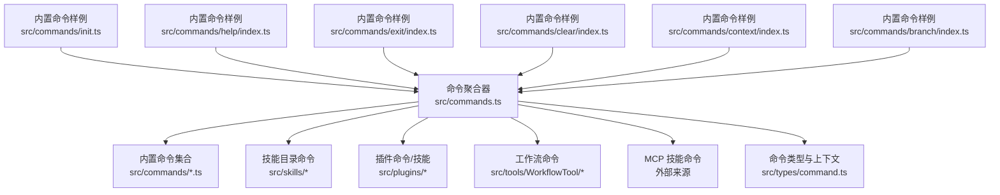
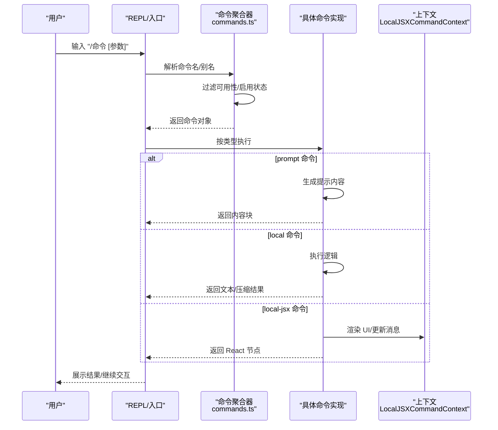
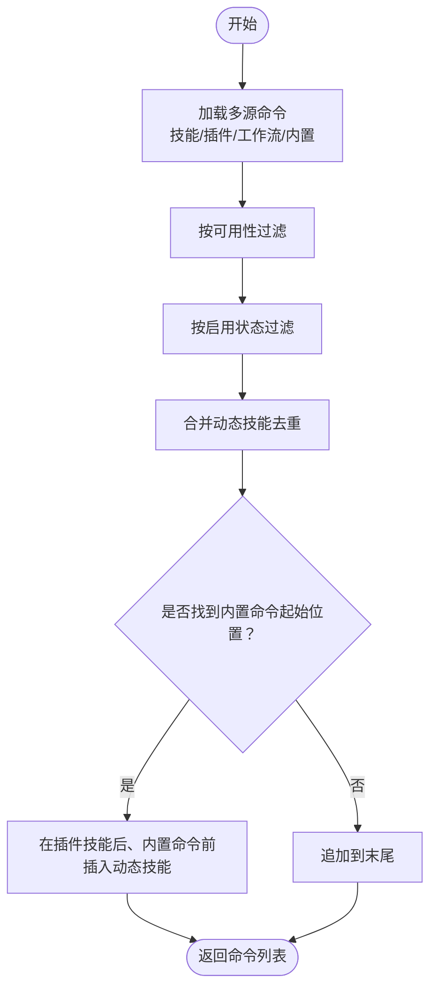
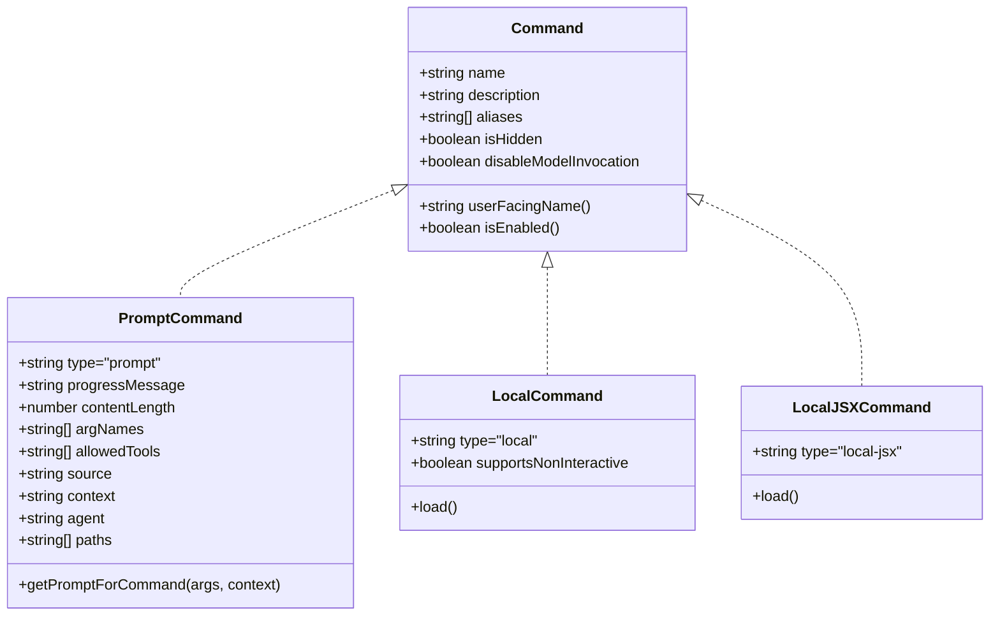
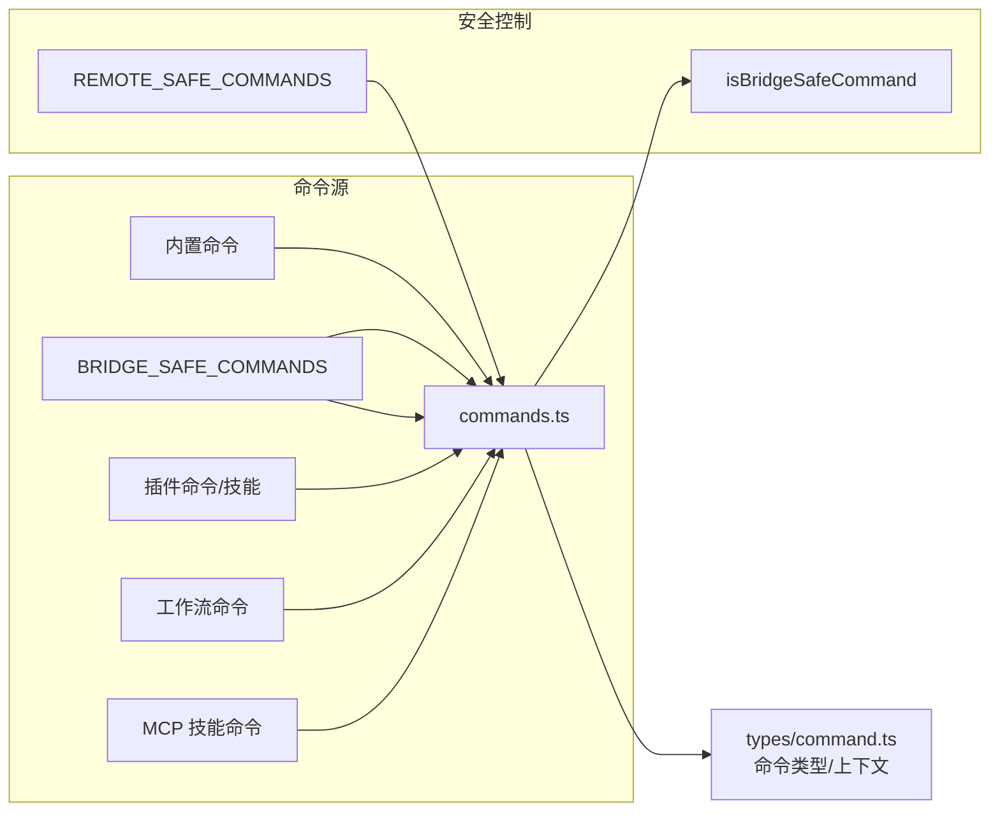

# 命令系统

<cite>
**本文引用的文件**
- [src/commands.ts](file://src/commands.ts)
- [src/types/command.ts](file://src/types/command.ts)
- [src/commands/init.ts](file://src/commands/init.ts)
- [src/commands/help/index.ts](file://src/commands/help/index.ts)
- [src/commands/exit/index.ts](file://src/commands/exit/index.ts)
- [src/commands/clear/index.ts](file://src/commands/clear/index.ts)
- [src/commands/context/index.ts](file://src/commands/context/index.ts)
- [src/commands/branch/index.ts](file://src/commands/branch/index.ts)
</cite>

## 目录
1. [简介](#简介)
2. [项目结构](#项目结构)
3. [核心组件](#核心组件)
4. [架构总览](#架构总览)
5. [详细组件分析](#详细组件分析)
6. [依赖分析](#依赖分析)
7. [性能考虑](#性能考虑)
8. [故障排查指南](#故障排查指南)
9. [结论](#结论)
10. [附录](#附录)

## 简介
本文件系统性阐述 Claude Code 的命令系统：包括架构设计、命令注册机制、可用性与启用控制、动态技能与插件整合、执行流程、优先级与冲突处理策略，以及如何开发自定义命令（定义、参数解析、错误处理）、命令绑定与快捷键配置、用户体验优化建议，并给出与工具系统的集成与扩展机制说明。目标是帮助开发者快速理解命令系统的工作原理并高效扩展。

## 项目结构
命令系统由“命令清单聚合器”“命令类型与上下文”“内置命令实现”三部分组成：
- 命令清单聚合器：统一加载内置命令、技能目录命令、插件命令、工作流命令等，负责去重、排序、可用性过滤与缓存。
- 命令类型与上下文：定义命令的三种类型（prompt、local、local-jsx）及上下文接口，支撑命令在 TUI、模型调用、远程桥接等场景下的执行。
- 内置命令实现：以模块化目录组织，每个命令提供最小元数据与延迟加载实现，减少启动时的 I/O 和内存开销。

图表来源
- [src/commands.ts:258-346](file://src/commands.ts#L258-L346)
- [src/types/command.ts:16-217](file://src/types/command.ts#L16-L217)
- [src/commands/init.ts:226-254](file://src/commands/init.ts#L226-L254)
- [src/commands/help/index.ts:3-8](file://src/commands/help/index.ts#L3-L8)
- [src/commands/exit/index.ts:3-10](file://src/commands/exit/index.ts#L3-L10)
- [src/commands/clear/index.ts:10-17](file://src/commands/clear/index.ts#L10-L17)
- [src/commands/context/index.ts:4-24](file://src/commands/context/index.ts#L4-L24)
- [src/commands/branch/index.ts:4-12](file://src/commands/branch/index.ts#L4-L12)

章节来源
- [src/commands.ts:258-346](file://src/commands.ts#L258-L346)
- [src/types/command.ts:16-217](file://src/types/command.ts#L16-L217)

## 核心组件
- 命令聚合与导出
  - 统一导出命令列表、名称集合、可用性过滤、动态技能插入、远程安全命令集、桥接安全命令集等能力。
  - 关键函数：getCommands、getSkillToolCommands、getSlashCommandToolSkills、findCommand、getCommand、formatDescriptionWithSource、filterCommandsForRemoteMode、isBridgeSafeCommand。
- 命令类型与上下文
  - PromptCommand：面向模型调用的提示型命令，支持内容长度估算、进度消息、路径过滤、上下文模式（内联/分叉）等。
  - LocalCommand：本地命令，延迟加载实现，支持非交互式标志。
  - LocalJSXCommand：本地 JSX 命令，延迟加载 UI 组件，用于 TUI 场景。
  - 上下文接口：LocalJSXCommandContext 提供消息更新、主题、IDE 安装状态、动态 MCP 配置等能力。
- 内置命令示例
  - init：根据特性开关选择新旧初始化流程，生成 CLAUDE.md 及可选技能/钩子。
  - help：显示帮助与可用命令。
  - exit：退出 REPL，支持立即执行。
  - clear：清理会话缓存与对话历史。
  - context/contextNonInteractive：可视化或显示当前上下文占用情况。
  - branch：在当前会话点创建分支（可带别名 fork）。

章节来源
- [src/commands.ts:476-517](file://src/commands.ts#L476-L517)
- [src/commands.ts:619-686](file://src/commands.ts#L619-L686)
- [src/commands.ts:688-754](file://src/commands.ts#L688-L754)
- [src/types/command.ts:25-57](file://src/types/command.ts#L25-L57)
- [src/types/command.ts:74-78](file://src/types/command.ts#L74-L78)
- [src/types/command.ts:144-152](file://src/types/command.ts#L144-L152)
- [src/types/command.ts:175-203](file://src/types/command.ts#L175-L203)
- [src/commands/init.ts:226-254](file://src/commands/init.ts#L226-L254)
- [src/commands/help/index.ts:3-8](file://src/commands/help/index.ts#L3-L8)
- [src/commands/exit/index.ts:3-10](file://src/commands/exit/index.ts#L3-L10)
- [src/commands/clear/index.ts:10-17](file://src/commands/clear/index.ts#L10-L17)
- [src/commands/context/index.ts:4-24](file://src/commands/context/index.ts#L4-L24)
- [src/commands/branch/index.ts:4-12](file://src/commands/branch/index.ts#L4-L12)

## 架构总览
命令系统采用“集中式聚合 + 多源加载 + 动态注入”的架构：
- 聚合层：commands.ts 统一收集所有命令来源，进行去重、排序、可用性与启用检查。
- 类型层：types/command.ts 定义命令形态与上下文契约，确保不同命令在模型、TUI、远程桥接等环境的一致行为。
- 执行层：命令在被调用时按类型执行；prompt 命令展开为模型输入；local 命令在本地执行；local-jsx 命令渲染 UI 并与上下文交互。
- 安全层：提供 REMOTE_SAFE_COMMANDS 与 BRIDGE_SAFE_COMMANDS，限制远程/移动端可执行命令范围。

图表来源
- [src/commands.ts:476-517](file://src/commands.ts#L476-L517)
- [src/types/command.ts:25-57](file://src/types/command.ts#L25-L57)
- [src/types/command.ts:74-78](file://src/types/command.ts#L74-L78)
- [src/types/command.ts:144-152](file://src/types/command.ts#L144-L152)

## 详细组件分析

### 命令聚合与发现
- 加载顺序与去重
  - 先加载技能目录命令、插件技能、内置插件技能、工作流命令，再合并内置命令，最后插入动态技能（去重后插入到插件技能之后、内置命令之前）。
- 可用性与启用
  - meetsAvailabilityRequirement：基于命令声明的 availability（如 claude-ai、console）与当前认证状态判断是否可见。
  - isCommandEnabled：基于命令的 isEnabled 回调（默认总是启用）判断是否启用。
- 缓存与性能
  - loadAllCommands 与 getSkillToolCommands 等使用 memoize，按 cwd 缓存，避免重复磁盘 I/O 与动态导入。
- 远程/桥接安全
  - REMOTE_SAFE_COMMANDS：仅限远程模式使用的命令集合。
  - BRIDGE_SAFE_COMMANDS：通过远程桥接允许执行的本地命令集合。
  - isBridgeSafeCommand：综合命令类型与白名单判定是否允许从移动端/网页端触发。

图表来源
- [src/commands.ts:449-517](file://src/commands.ts#L449-L517)

章节来源
- [src/commands.ts:449-517](file://src/commands.ts#L449-L517)
- [src/commands.ts:417-443](file://src/commands.ts#L417-L443)
- [src/commands.ts:619-686](file://src/commands.ts#L619-L686)
- [src/commands.ts:672-676](file://src/commands.ts#L672-L676)

### 命令类型与上下文
- PromptCommand
  - 用途：模型可调用的提示型命令，适合技能与工作流。
  - 关键字段：progressMessage、contentLength、allowedTools、context（inline/fork）、agent、paths、hooks、disableModelInvocation 等。
- LocalCommand
  - 用途：本地执行命令，延迟加载实现，适合无需 UI 的纯逻辑操作。
  - 关键字段：supportsNonInteractive、load。
- LocalJSXCommand
  - 用途：需要渲染 UI 的命令，延迟加载组件，适合 TUI 交互。
  - 关键字段：load。
- 上下文接口
  - LocalJSXCommandContext：提供消息更新、主题、IDE 安装状态、动态 MCP 配置变更回调、恢复会话等能力。

图表来源
- [src/types/command.ts:25-57](file://src/types/command.ts#L25-L57)
- [src/types/command.ts:74-78](file://src/types/command.ts#L74-L78)
- [src/types/command.ts:144-152](file://src/types/command.ts#L144-L152)
- [src/types/command.ts:175-203](file://src/types/command.ts#L175-L203)

章节来源
- [src/types/command.ts:16-217](file://src/types/command.ts#L16-L217)

### 内置命令功能与使用要点

#### init 初始化命令
- 功能：生成/更新 CLAUDE.md，可选生成个人 CLAUDE.local.md、技能与钩子。
- 特性开关：NEW_INIT、ANT 用户或特定环境变量控制新旧流程。
- 执行方式：prompt 命令，返回文本提示内容，引导后续步骤。
- 使用建议：首次进入新仓库时运行，结合 AskUserQuestion 逐步完善团队与个人指引。

章节来源
- [src/commands/init.ts:226-254](file://src/commands/init.ts#L226-L254)

#### help 帮助命令
- 功能：显示帮助与可用命令列表。
- 实现：local-jsx 命令，延迟加载 UI 组件。
- 使用建议：在命令面板或输入框中输入 /help 查看。

章节来源
- [src/commands/help/index.ts:3-8](file://src/commands/help/index.ts#L3-L8)

#### exit 退出命令
- 功能：退出 REPL。
- 特性：immediate=true，表示立即执行，不等待停止点。
- 使用建议：在终端或 TUI 中输入 /exit 或 /quit。

章节来源
- [src/commands/exit/index.ts:3-10](file://src/commands/exit/index.ts#L3-L10)

#### clear 清理命令
- 功能：清理会话缓存与对话历史。
- 实现：local 命令，延迟加载实现，减少启动时开销。
- 使用建议：在长时间会话后清理上下文，释放内存。

章节来源
- [src/commands/clear/index.ts:10-17](file://src/commands/clear/index.ts#L10-L17)

#### context 与 contextNonInteractive 上下文可视化
- 功能：可视化当前上下文占用（彩色网格），或在非交互式会话中显示上下文使用情况。
- 实现：context 为 local-jsx 命令；contextNonInteractive 为 local 命令，受非交互式会话状态控制。
- 使用建议：在长会话中定期查看，避免超出上下文上限。

章节来源
- [src/commands/context/index.ts:4-24](file://src/commands/context/index.ts#L4-L24)

#### branch 分支命令
- 功能：在当前会话点创建分支（可带别名 fork）。
- 实现：local-jsx 命令，延迟加载实现。
- 使用建议：在需要对比不同方案或实验性修改时使用。

章节来源
- [src/commands/branch/index.ts:4-12](file://src/commands/branch/index.ts#L4-L12)

## 依赖分析
- 命令聚合器对各命令源的依赖
  - 内置命令：commands.ts 直接导入各命令模块。
  - 技能目录命令：通过 getSkillDirCommands 获取，失败时记录日志并回退为空数组。
  - 插件命令/技能：通过 getPluginCommands 与 getPluginSkills 获取。
  - 工作流命令：通过 WORKFLOW_SCRIPTS 特性开关加载。
  - MCP 技能：通过 getMcpSkillCommands 过滤 prompt 且非禁用模型调用的命令。
- 类型与上下文
  - 命令类型定义集中在 types/command.ts，为所有命令提供统一契约。
- 安全与远程
  - REMOTE_SAFE_COMMANDS 与 BRIDGE_SAFE_COMMANDS 作为白名单，isBridgeSafeCommand 综合类型与白名单判定。

图表来源
- [src/commands.ts:449-517](file://src/commands.ts#L449-L517)
- [src/commands.ts:547-559](file://src/commands.ts#L547-L559)
- [src/commands.ts:619-686](file://src/commands.ts#L619-L686)
- [src/commands.ts:672-676](file://src/commands.ts#L672-L676)
- [src/types/command.ts:16-217](file://src/types/command.ts#L16-L217)

章节来源
- [src/commands.ts:449-517](file://src/commands.ts#L449-L517)
- [src/commands.ts:547-559](file://src/commands.ts#L547-L559)
- [src/commands.ts:619-686](file://src/commands.ts#L619-L686)
- [src/commands.ts:672-676](file://src/commands.ts#L672-L676)
- [src/types/command.ts:16-217](file://src/types/command.ts#L16-L217)

## 性能考虑
- 延迟加载：local 与 local-jsx 命令通过 load() 延迟加载实现，降低启动时的 I/O 与内存占用。
- 缓存策略：loadAllCommands、getSkillToolCommands、getSlashCommandToolSkills 等使用 memoize，按 cwd 缓存，避免重复计算。
- 动态技能插入：仅在未与内置/插件命令重名时插入，减少冗余与查找成本。
- 远程预过滤：filterCommandsForRemoteMode 在渲染 REPL 前剔除本地命令，避免短暂暴露与竞态。

章节来源
- [src/commands.ts:449-517](file://src/commands.ts#L449-L517)
- [src/commands.ts:684-686](file://src/commands.ts#L684-L686)

## 故障排查指南
- 命令未出现
  - 检查 availability 是否与当前认证状态匹配；检查 isEnabled 是否返回 true；检查是否被动态技能去重。
- 命令不可执行
  - 确认命令类型：local-jsx 命令在远程/移动端默认不允许；prompt 命令需模型可调用；local 命令需在本地执行。
- 命令报错
  - 查看日志输出与错误信息；确认命令实现中的异常处理；对于技能/插件命令，注意捕获加载失败并回退空数组。
- 性能问题
  - 检查是否频繁重建命令列表；确认缓存是否命中；避免在命令执行中做重型同步 I/O。

章节来源
- [src/commands.ts:417-443](file://src/commands.ts#L417-L443)
- [src/commands.ts:672-676](file://src/commands.ts#L672-L676)
- [src/commands.ts:353-398](file://src/commands.ts#L353-L398)

## 结论
命令系统通过“集中聚合 + 多源加载 + 动态注入 + 安全白名单”的设计，在保证灵活性的同时兼顾了性能与安全性。开发者可以基于 types/command.ts 的类型契约快速实现新命令，并通过 commands.ts 的聚合机制无缝接入内置、技能、插件与工作流生态。配合延迟加载与缓存策略，命令系统能够在大型项目中保持良好的响应速度与稳定性。

## 附录

### 命令分类体系与优先级管理
- 分类
  - prompt：模型可调用的技能型命令。
  - local：本地执行命令，适合无 UI 的逻辑操作。
  - local-jsx：需要渲染 UI 的命令，适合 TUI 交互。
- 优先级与插入顺序
  - 技能目录命令 → 工作流命令 → 插件命令/技能 → 内置命令。
  - 动态技能在插件技能之后、内置命令之前插入，避免覆盖内置命令。

章节来源
- [src/commands.ts:460-468](file://src/commands.ts#L460-L468)
- [src/commands.ts:504-516](file://src/commands.ts#L504-L516)

### 冲突处理
- 命令名与别名冲突
  - 通过 builtInCommandNames 与 findCommand/getCommand 进行唯一性校验与定位。
- 动态技能与内置/插件命令冲突
  - 去重策略：若动态技能名称已存在则跳过；仅插入未重复的动态技能。

章节来源
- [src/commands.ts:348-351](file://src/commands.ts#L348-L351)
- [src/commands.ts:491-498](file://src/commands.ts#L491-L498)

### 自定义命令开发指南
- 命令定义
  - 选择类型：prompt/local/local-jsx，依据是否需要模型调用、本地执行、UI 交互。
  - 设置元数据：name、description、aliases、argumentHint、whenToUse、version、loadedFrom、kind、immediate、isSensitive、userFacingName、isEnabled、isHidden、availability。
- 参数解析
  - prompt 命令通过 getPromptForCommand(args, context) 解析参数并生成内容块。
  - local/local-jsx 命令通过 load() 返回的 call 函数接收 args 与上下文进行处理。
- 错误处理
  - 对于技能/插件加载失败，使用 try/catch 并记录日志，返回空数组或降级结果。
- 与工具系统的集成
  - 通过 allowedTools、hooks、skillRoot、context/agent、paths 等字段与工具链协同。
- 最佳实践
  - 使用延迟加载提升启动性能；合理设置 availability 与 isEnabled；为 prompt 命令提供清晰 whenToUse；必要时设置 disableModelInvocation 限制调用方。

章节来源
- [src/types/command.ts:25-57](file://src/types/command.ts#L25-L57)
- [src/types/command.ts:74-78](file://src/types/command.ts#L74-L78)
- [src/types/command.ts:144-152](file://src/types/command.ts#L144-L152)
- [src/types/command.ts:175-203](file://src/types/command.ts#L175-L203)
- [src/commands.ts:353-398](file://src/commands.ts#L353-L398)

### 命令绑定、快捷键配置与用户体验优化
- 命令绑定
  - 命令通过 name 与 aliases 暴露给用户输入；getCommandName 支持 userFacingName 覆盖显示名称。
- 快捷键配置
  - 建议在 UI 中为常用命令提供快捷键映射；结合 useCommandKeybindings 与 KeybindingProviderSetup 实现全局/上下文快捷键。
- 用户体验优化
  - 为 prompt 命令提供 progressMessage 与 contentLength，便于估算耗时与令牌预算。
  - 对敏感参数设置 isSensitive，避免历史泄露。
  - 对 local-jsx 命令提供 argumentHint，改善输入提示。

章节来源
- [src/types/command.ts:208-211](file://src/types/command.ts#L208-L211)
- [src/types/command.ts:186-203](file://src/types/command.ts#L186-L203)