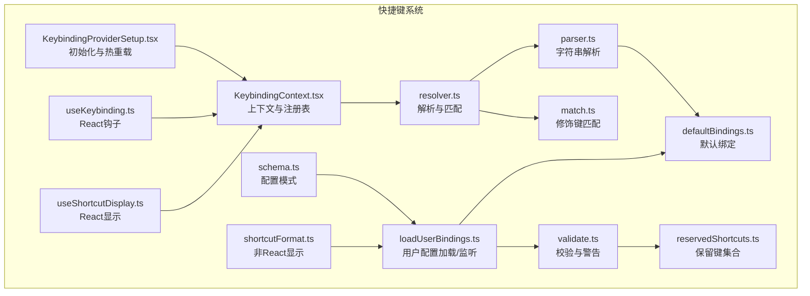
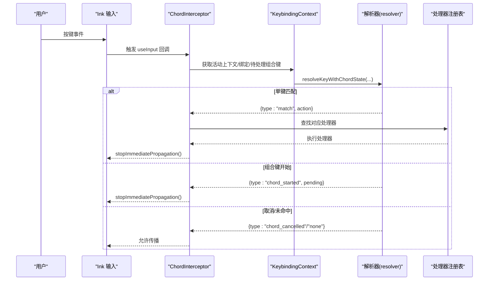
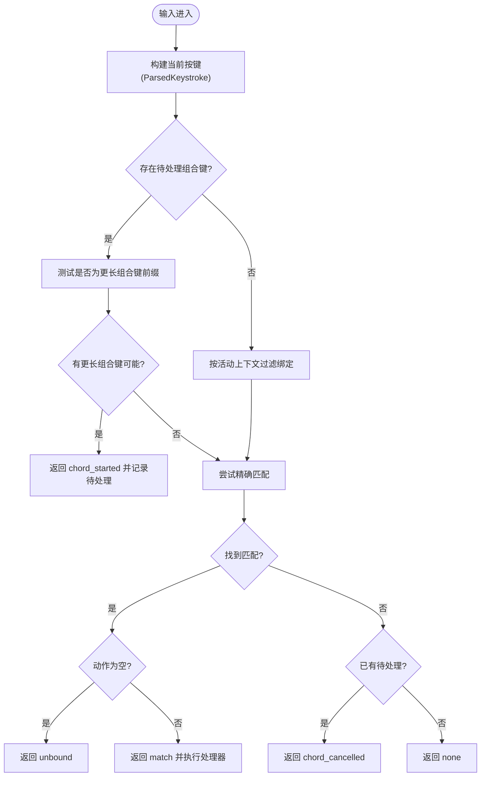
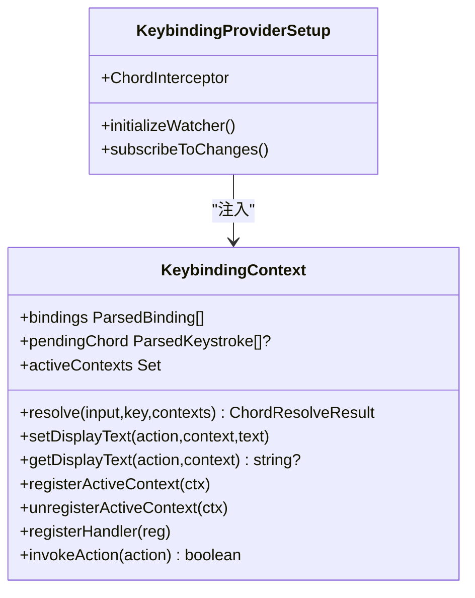
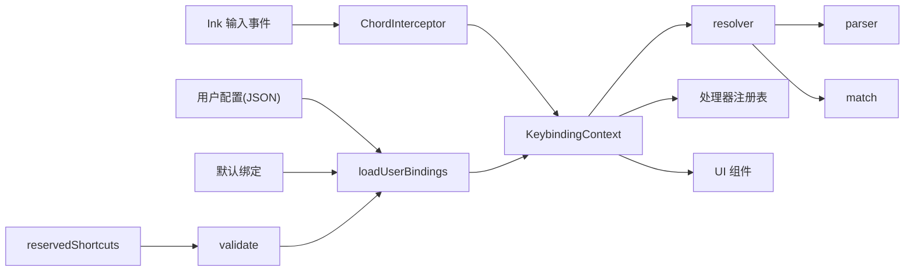

# 快捷键系统

<cite>
**本文引用的文件**
- [defaultBindings.ts](file://src/keybindings/defaultBindings.ts)
- [parser.ts](file://src/keybindings/parser.ts)
- [resolver.ts](file://src/keybindings/resolver.ts)
- [match.ts](file://src/keybindings/match.ts)
- [schema.ts](file://src/keybindings/schema.ts)
- [loadUserBindings.ts](file://src/keybindings/loadUserBindings.ts)
- [validate.ts](file://src/keybindings/validate.ts)
- [reservedShortcuts.ts](file://src/keybindings/reservedShortcuts.ts)
- [shortcutFormat.ts](file://src/keybindings/shortcutFormat.ts)
- [useShortcutDisplay.ts](file://src/keybindings/useShortcutDisplay.ts)
- [KeybindingContext.tsx](file://src/keybindings/KeybindingContext.tsx)
- [KeybindingProviderSetup.tsx](file://src/keybindings/KeybindingProviderSetup.tsx)
- [useKeybinding.ts](file://src/keybindings/useKeybinding.ts)
</cite>

## 目录
1. [简介](#简介)
2. [项目结构](#项目结构)
3. [核心组件](#核心组件)
4. [架构总览](#架构总览)
5. [详细组件分析](#详细组件分析)
6. [依赖关系分析](#依赖关系分析)
7. [性能考量](#性能考量)
8. [故障排除指南](#故障排除指南)
9. [结论](#结论)
10. [附录](#附录)

## 简介
本文件系统化阐述 Claude Code 的快捷键系统，覆盖架构设计、按键绑定机制、事件处理流程、默认配置与用户自定义、冲突与保留键处理、解析规则与组合键支持、平台兼容性、与命令系统的集成、动态绑定与运行时修改、配置导入导出与团队共享、典型使用场景与效率技巧，以及调试与故障排除方法。目标是帮助开发者与高级用户高效理解并扩展该系统。

## 项目结构
快捷键系统主要位于 src/keybindings 目录，围绕“解析器 + 上下文 + 提供者 + 配置加载/校验”四层构建，配合 Ink 输入事件与 React 生命周期完成从输入到动作执行的闭环。

图表来源
- [KeybindingProviderSetup.tsx:119-209](file://src/keybindings/KeybindingProviderSetup.tsx#L119-L209)
- [KeybindingContext.tsx:59-182](file://src/keybindings/KeybindingContext.tsx#L59-L182)
- [resolver.ts:32-61](file://src/keybindings/resolver.ts#L32-L61)
- [parser.ts:13-75](file://src/keybindings/parser.ts#L13-L75)
- [match.ts:29-47](file://src/keybindings/match.ts#L29-L47)
- [defaultBindings.ts:32-341](file://src/keybindings/defaultBindings.ts#L32-L341)
- [loadUserBindings.ts:133-237](file://src/keybindings/loadUserBindings.ts#L133-L237)
- [validate.ts:425-451](file://src/keybindings/validate.ts#L425-L451)
- [reservedShortcuts.ts:73-83](file://src/keybindings/reservedShortcuts.ts#L73-L83)
- [schema.ts:177-229](file://src/keybindings/schema.ts#L177-L229)
- [useKeybinding.ts:33-97](file://src/keybindings/useKeybinding.ts#L33-L97)
- [shortcutFormat.ts:38-63](file://src/keybindings/shortcutFormat.ts#L38-L63)
- [useShortcutDisplay.ts:29-59](file://src/keybindings/useShortcutDisplay.ts#L29-L59)

章节来源
- [KeybindingProviderSetup.tsx:119-209](file://src/keybindings/KeybindingProviderSetup.tsx#L119-L209)
- [KeybindingContext.tsx:59-182](file://src/keybindings/KeybindingContext.tsx#L59-L182)
- [resolver.ts:32-61](file://src/keybindings/resolver.ts#L32-L61)
- [parser.ts:13-75](file://src/keybindings/parser.ts#L13-L75)
- [match.ts:29-47](file://src/keybindings/match.ts#L29-L47)
- [defaultBindings.ts:32-341](file://src/keybindings/defaultBindings.ts#L32-L341)
- [loadUserBindings.ts:133-237](file://src/keybindings/loadUserBindings.ts#L133-L237)
- [validate.ts:425-451](file://src/keybindings/validate.ts#L425-L451)
- [reservedShortcuts.ts:73-83](file://src/keybindings/reservedShortcuts.ts#L73-L83)
- [schema.ts:177-229](file://src/keybindings/schema.ts#L177-L229)
- [useKeybinding.ts:33-97](file://src/keybindings/useKeybinding.ts#L33-L97)
- [shortcutFormat.ts:38-63](file://src/keybindings/shortcutFormat.ts#L38-L63)
- [useShortcutDisplay.ts:29-59](file://src/keybindings/useShortcutDisplay.ts#L29-L59)

## 核心组件
- 解析与匹配
  - 解析器：将字符串（如 "ctrl+shift+k" 或 "ctrl+k ctrl+s"）解析为内部结构，支持别名与显示转换。
  - 匹配器：将 Ink 的 Key 对象与解析后的按键进行逻辑匹配，处理历史差异（如 escape 的 meta 标记）。
  - 解析结果：单键匹配、未命中、显式解绑、组合键开始/取消/完成等状态。
- 上下文与提供者
  - 上下文：维护活动上下文集合、待处理组合键、处理器注册表、绑定列表等。
  - 提供者：在应用根部注入上下文，拦截输入，驱动解析与动作分发。
- 配置加载与校验
  - 默认绑定：内置在代码中，按平台特性动态调整。
  - 用户绑定：从用户目录读取 JSON，支持热重载；合并优先级为“默认先、用户后”。
  - 校验：重复键、保留键、无效上下文/动作、命令绑定位置等。
- React 集成
  - useKeybinding/useKeybindings：声明式注册动作处理器，自动管理组合键状态与事件冒泡。
  - 显示钩子：在 UI 中展示当前配置的快捷键显示文本。

章节来源
- [parser.ts:13-75](file://src/keybindings/parser.ts#L13-L75)
- [match.ts:29-47](file://src/keybindings/match.ts#L29-L47)
- [resolver.ts:32-61](file://src/keybindings/resolver.ts#L32-L61)
- [KeybindingContext.tsx:59-182](file://src/keybindings/KeybindingContext.tsx#L59-L182)
- [KeybindingProviderSetup.tsx:119-209](file://src/keybindings/KeybindingProviderSetup.tsx#L119-L209)
- [loadUserBindings.ts:133-237](file://src/keybindings/loadUserBindings.ts#L133-L237)
- [validate.ts:425-451](file://src/keybindings/validate.ts#L425-L451)
- [useKeybinding.ts:33-97](file://src/keybindings/useKeybinding.ts#L33-L97)
- [useShortcutDisplay.ts:29-59](file://src/keybindings/useShortcutDisplay.ts#L29-L59)
- [shortcutFormat.ts:38-63](file://src/keybindings/shortcutFormat.ts#L38-L63)

## 架构总览
快捷键系统采用“输入拦截 -> 组合键状态管理 -> 上下文优先级解析 -> 动作执行”的流水线。ChordInterceptor 在最外层 useInput 中拦截所有输入，确保组合键序列不被子组件截获；KeybindingProvider 负责维护上下文与处理器注册表；解析器根据当前上下文与绑定集进行匹配；最终由注册的处理器消费事件或交由后续处理器。

图表来源
- [KeybindingProviderSetup.tsx:226-307](file://src/keybindings/KeybindingProviderSetup.tsx#L226-L307)
- [KeybindingContext.tsx:136-142](file://src/keybindings/KeybindingContext.tsx#L136-L142)
- [resolver.ts:166-244](file://src/keybindings/resolver.ts#L166-L244)
- [useKeybinding.ts:47-96](file://src/keybindings/useKeybinding.ts#L47-L96)

## 详细组件分析

### 解析与匹配（parser/match/resolver）
- 字符串解析
  - 支持修饰键别名（ctrl/control、alt/opt/option/meta、cmd/command/super/win），以及方向键、空格、回车等特殊键名映射。
  - 组合键通过空白分割，单个空格字符表示“空格键”而非分隔符。
  - 显示名称转换：将内部键名映射为可读符号（如 ↑/↓），并按平台选择 opt/alt、cmd/super。
- 修饰键匹配
  - 历史差异处理：终端将 alt/meta 合并为 meta，解析时统一视为同一逻辑修饰。
  - 特例：escape 的 meta 标记需忽略，避免误判。
- 解析流程
  - 单键阶段：仅考虑长度为 1 的组合，按上下文过滤后匹配。
  - 组合键阶段：若当前输入能作为更长组合键的前缀，则等待；否则尝试精确匹配；超时或 ESC 取消。
  - 结果类型：match/unbound/none，以及 chord_started/chord_cancelled。

图表来源
- [resolver.ts:166-244](file://src/keybindings/resolver.ts#L166-L244)
- [match.ts:86-105](file://src/keybindings/match.ts#L86-L105)
- [parser.ts:77-84](file://src/keybindings/parser.ts#L77-L84)

章节来源
- [parser.ts:13-75](file://src/keybindings/parser.ts#L13-L75)
- [parser.ts:157-186](file://src/keybindings/parser.ts#L157-L186)
- [match.ts:29-47](file://src/keybindings/match.ts#L29-L47)
- [match.ts:86-105](file://src/keybindings/match.ts#L86-L105)
- [resolver.ts:166-244](file://src/keybindings/resolver.ts#L166-L244)

### 上下文与提供者（KeybindingContext/KeybindingProviderSetup）
- 上下文职责
  - 维护 activeContexts（组件挂载期间注册）、pendingChord（ref+state双份以兼顾同步与渲染）、bindings 列表。
  - 注册/注销处理器，按上下文优先级调用。
- 提供者设置
  - 初始化默认绑定与用户绑定（热重载），显示配置警告通知。
  - 使用 ChordInterceptor 在顶层拦截输入，确保组合键正确处理。
  - 管理组合键超时（默认 1000ms），超时则取消。
- 处理器注册
  - useKeybinding/useKeybindings 将动作处理器注册到注册表，支持多动作与返回 false 的“未消费”语义。

图表来源
- [KeybindingContext.tsx:13-43](file://src/keybindings/KeybindingContext.tsx#L13-L43)
- [KeybindingProviderSetup.tsx:119-209](file://src/keybindings/KeybindingProviderSetup.tsx#L119-L209)

章节来源
- [KeybindingContext.tsx:59-182](file://src/keybindings/KeybindingContext.tsx#L59-L182)
- [KeybindingProviderSetup.tsx:119-209](file://src/keybindings/KeybindingProviderSetup.tsx#L119-L209)

### 默认绑定与平台适配（defaultBindings）
- 默认绑定按上下文组织，覆盖全局、聊天、自动补全、确认、设置、标签页、转录、历史搜索、任务、主题选择器、滚动、帮助、附件、底部指示器、消息选择器、差异对话框、模型选择器、选择组件、插件等。
- 平台适配：
  - 图片粘贴键：Windows 使用 alt+v，其他平台使用 ctrl+v。
  - 模式循环键：支持 shift+tab；在 Windows 且不支持 VT 模式时改用 meta+m。
  - 终端 VT 模式检测：基于 Node/Bun 版本判断，影响某些组合键可用性。
- 特性开关：部分绑定受功能门控（如 QUICK_SEARCH、TERMINAL_PANEL、VOICE_MODE 等）控制。

章节来源
- [defaultBindings.ts:12-31](file://src/keybindings/defaultBindings.ts#L12-L31)
- [defaultBindings.ts:32-341](file://src/keybindings/defaultBindings.ts#L32-L341)

### 用户绑定加载与热重载（loadUserBindings）
- 文件路径：~/.claude/keybindings.json（对象包装数组格式）。
- 加载策略：
  - 同步加载用于初始渲染；异步加载用于热重载。
  - 合并顺序：默认绑定在前，用户绑定在后，后者覆盖前者。
- 权限与可见性：当前仅对特定用户类型开放自定义（通过特性门控检查）。
- 监听与清理：使用 chokidar 监听文件变更，稳定阈值与轮询间隔优化写入稳定性；删除文件时回退默认。
- 警告收集：解析错误、结构非法、重复键、保留键冲突等。

章节来源
- [loadUserBindings.ts:115-131](file://src/keybindings/loadUserBindings.ts#L115-L131)
- [loadUserBindings.ts:133-237](file://src/keybindings/loadUserBindings.ts#L133-L237)
- [loadUserBindings.ts:259-344](file://src/keybindings/loadUserBindings.ts#L259-L344)
- [loadUserBindings.ts:353-404](file://src/keybindings/loadUserBindings.ts#L353-L404)
- [loadUserBindings.ts:424-448](file://src/keybindings/loadUserBindings.ts#L424-L448)

### 配置校验与保留键（validate/reservedShortcuts/schema）
- 校验范围
  - 结构校验：bindings 数组、块字段、键语法、动作类型与格式。
  - 内容校验：重复键（同一上下文内）、保留键冲突（不可重新绑定或易被系统拦截）、命令绑定上下文限制、语音激活键建议。
  - JSON 重复键检测：利用原始字符串扫描，避免 JSON.parse 的静默覆盖。
- 保留键
  - 不可重新绑定：ctrl+c、ctrl+d、ctrl+m（与 Enter 等价）。
  - 终端保留：ctrl+z、ctrl+\（不同平台严重程度不同）。
  - macOS 系统保留：cmd+c/v/x/q/w/tab/space 等。
- 模式与类型
  - 使用 Zod 定义上下文、动作枚举与配置结构，生成 JSON Schema 与 TS 类型。

章节来源
- [validate.ts:88-125](file://src/keybindings/validate.ts#L88-L125)
- [validate.ts:130-247](file://src/keybindings/validate.ts#L130-L247)
- [validate.ts:258-307](file://src/keybindings/validate.ts#L258-L307)
- [validate.ts:373-399](file://src/keybindings/validate.ts#L373-L399)
- [reservedShortcuts.ts:16-33](file://src/keybindings/reservedShortcuts.ts#L16-L33)
- [reservedShortcuts.ts:43-54](file://src/keybindings/reservedShortcuts.ts#L43-L54)
- [reservedShortcuts.ts:59-67](file://src/keybindings/reservedShortcuts.ts#L59-L67)
- [schema.ts:177-229](file://src/keybindings/schema.ts#L177-L229)

### React 集成与显示（useKeybinding/shortcutFormat/useShortcutDisplay）
- useKeybinding/useKeybindings
  - 声明式注册动作处理器，自动管理 pendingChord 状态与 stopImmediatePropagation。
  - 支持返回 false 让事件继续传播给后续处理器（用于滚动/导航等场景的“让路”）。
- 显示钩子
  - useShortcutDisplay：在 React 中获取显示文本，若无法解析则回退并记录事件。
  - getShortcutDisplay：非 React 场景下的等效实现，避免引入 React。

章节来源
- [useKeybinding.ts:33-97](file://src/keybindings/useKeybinding.ts#L33-L97)
- [useKeybinding.ts:113-196](file://src/keybindings/useKeybinding.ts#L113-L196)
- [useShortcutDisplay.ts:29-59](file://src/keybindings/useShortcutDisplay.ts#L29-L59)
- [shortcutFormat.ts:38-63](file://src/keybindings/shortcutFormat.ts#L38-L63)

## 依赖关系分析
- 模块耦合
  - 解析器依赖匹配器与解析器工具函数；解析器与匹配器共同依赖 Ink 的 Key 结构。
  - 上下文与提供者依赖解析器与处理器注册表；提供者依赖配置加载模块。
  - 校验模块依赖解析器工具与保留键集合；保留键依赖平台信息。
- 关键依赖链
  - 输入事件 -> ChordInterceptor -> 解析器 -> 处理器注册表 -> 动作执行。
  - 配置加载 -> 解析 -> 合并 -> 上下文注入 -> UI 展示。

图表来源
- [KeybindingProviderSetup.tsx:226-307](file://src/keybindings/KeybindingProviderSetup.tsx#L226-L307)
- [resolver.ts:32-61](file://src/keybindings/resolver.ts#L32-L61)
- [parser.ts:191-203](file://src/keybindings/parser.ts#L191-L203)
- [match.ts:29-47](file://src/keybindings/match.ts#L29-L47)
- [loadUserBindings.ts:133-237](file://src/keybindings/loadUserBindings.ts#L133-L237)
- [validate.ts:425-451](file://src/keybindings/validate.ts#L425-L451)
- [reservedShortcuts.ts:73-83](file://src/keybindings/reservedShortcuts.ts#L73-L83)

章节来源
- [KeybindingProviderSetup.tsx:226-307](file://src/keybindings/KeybindingProviderSetup.tsx#L226-L307)
- [resolver.ts:32-61](file://src/keybindings/resolver.ts#L32-L61)
- [parser.ts:191-203](file://src/keybindings/parser.ts#L191-L203)
- [match.ts:29-47](file://src/keybindings/match.ts#L29-L47)
- [loadUserBindings.ts:133-237](file://src/keybindings/loadUserBindings.ts#L133-L237)
- [validate.ts:425-451](file://src/keybindings/validate.ts#L425-L451)
- [reservedShortcuts.ts:73-83](file://src/keybindings/reservedShortcuts.ts#L73-L83)

## 性能考量
- 解析复杂度
  - 单键匹配：按上下文过滤后线性扫描，时间复杂度 O(N)；上下文集合使用 Set 降低查找成本。
  - 组合键匹配：前缀匹配与精确匹配均遍历绑定，但通过“更长组合键优先”减少不必要的精确匹配。
- 内存与缓存
  - 默认绑定解析结果缓存，避免重复解析。
  - 用户绑定加载采用同步/异步双路径，初始渲染走同步，后续变更走异步热重载。
- I/O 与监听
  - chokidar 监听文件变更，awaitWriteFinish 防抖写入抖动；原子写入与轮询参数平衡稳定性与资源消耗。
- 渲染与状态
  - pendingChord 使用 ref+state 双存储，ref 保证解析即时可见，state 触发 UI 更新；组合键超时清理避免内存泄漏。

[本节为通用性能讨论，无需列出具体文件来源]

## 故障排除指南
- 常见问题与定位
  - 无响应或事件穿透：检查是否在 useKeybinding 返回 false 导致事件继续传播；确认 ChordInterceptor 是否正确拦截。
  - 组合键无效：确认未触发超时（默认 1000ms）；检查是否存在更长组合键前缀导致“等待”。
  - 保留键冲突：查看保留键列表与严重级别；必要时更换为非保留键。
  - 用户配置错误：查看通知中的警告摘要，或使用 /doctor 查看详细日志。
- 调试步骤
  - 启用调试日志，观察“KeybindingSetup initialized/reloaded”、“Chord timeout - cancelling”等关键日志。
  - 使用 getShortcutDisplay/useShortcutDisplay 获取当前显示文本，验证解析是否命中。
  - 临时禁用用户配置，仅使用默认绑定，排除用户配置干扰。
- 常见修复
  - 更换冲突键位（如将 ctrl+c 替换为 ctrl+shift+c）。
  - 将命令绑定移动到 Chat 上下文。
  - 修复 JSON 语法与重复键，确保对象包装数组格式。

章节来源
- [KeybindingProviderSetup.tsx:176-180](file://src/keybindings/KeybindingProviderSetup.tsx#L176-L180)
- [validate.ts:456-498](file://src/keybindings/validate.ts#L456-L498)
- [reservedShortcuts.ts:73-83](file://src/keybindings/reservedShortcuts.ts#L73-L83)
- [shortcutFormat.ts:45-60](file://src/keybindings/shortcutFormat.ts#L45-L60)
- [useShortcutDisplay.ts:42-56](file://src/keybindings/useShortcutDisplay.ts#L42-L56)

## 结论
该快捷键系统以清晰的分层设计实现了高可扩展性与强健性：解析层抽象了字符串与修饰键的复杂性；上下文层提供了灵活的优先级与组合键状态管理；配置层支持默认与用户自定义的无缝合并与热重载；校验层保障了安全性与一致性。通过 React 钩子与显示工具，系统既易于集成又便于调试与维护。

[本节为总结性内容，无需列出具体文件来源]

## 附录

### 快捷键配置导入导出与团队共享
- 当前实现
  - 用户配置文件位于用户主目录下的固定路径，采用对象包装数组格式，支持热重载。
  - 配置加载与校验由专用模块负责，具备重复键检测与保留键冲突提示。
- 推荐实践
  - 将配置文件纳入版本控制或私有仓库，便于团队共享与审计。
  - 使用脚本在团队成员间同步配置，注意保留键与平台差异。
  - 通过特性门控控制自定义权限，避免外部用户误用。

章节来源
- [loadUserBindings.ts:115-131](file://src/keybindings/loadUserBindings.ts#L115-L131)
- [schema.ts:214-229](file://src/keybindings/schema.ts#L214-L229)
- [validate.ts:258-307](file://src/keybindings/validate.ts#L258-L307)

### 实际使用场景与效率技巧
- 高效切换模式：使用平台适配的模式循环键快速在不同模式间切换。
- 快速搜索与打开：启用特性开关后，使用组合键快速打开全局搜索与快速打开面板。
- 语音激活：在支持的场景下使用空格或修饰键组合进行语音激活，避免输入干扰。
- 组合键让路：在滚动/导航场景中，处理器返回 false 可让事件传递给子组件，提升交互流畅度。

章节来源
- [defaultBindings.ts:52-59](file://src/keybindings/defaultBindings.ts#L52-L59)
- [defaultBindings.ts:88-96](file://src/keybindings/defaultBindings.ts#L88-L96)
- [useKeybinding.ts:113-196](file://src/keybindings/useKeybinding.ts#L113-L196)