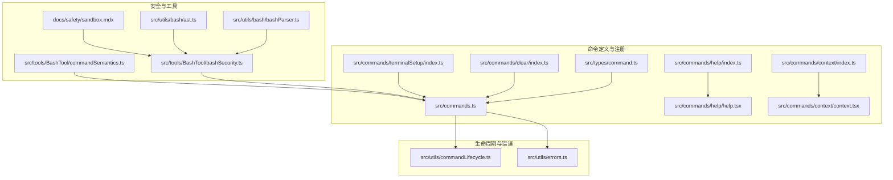
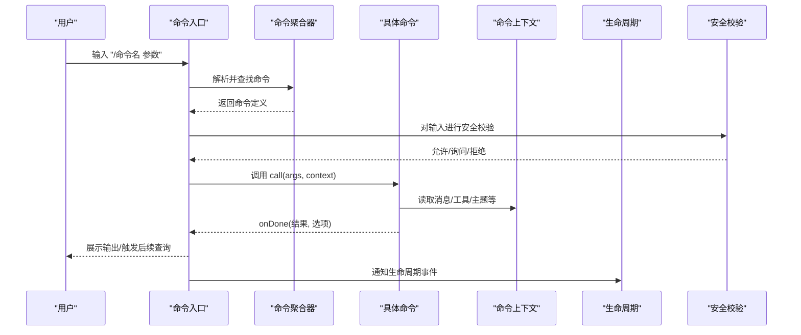
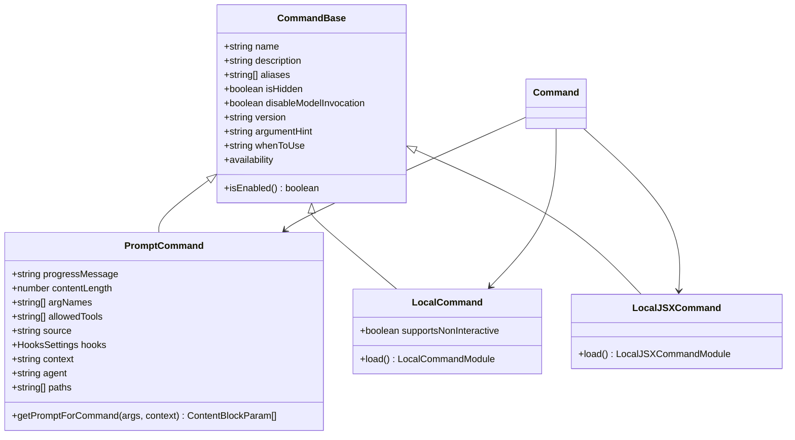
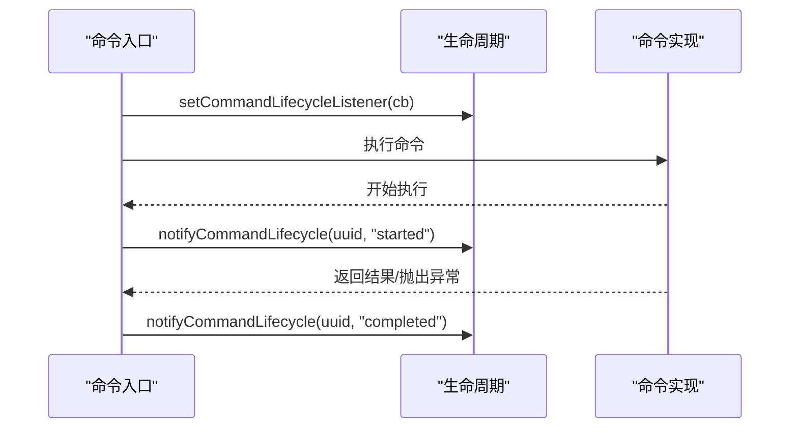
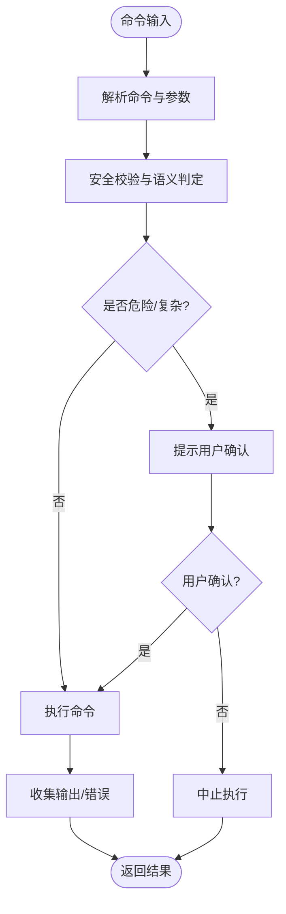
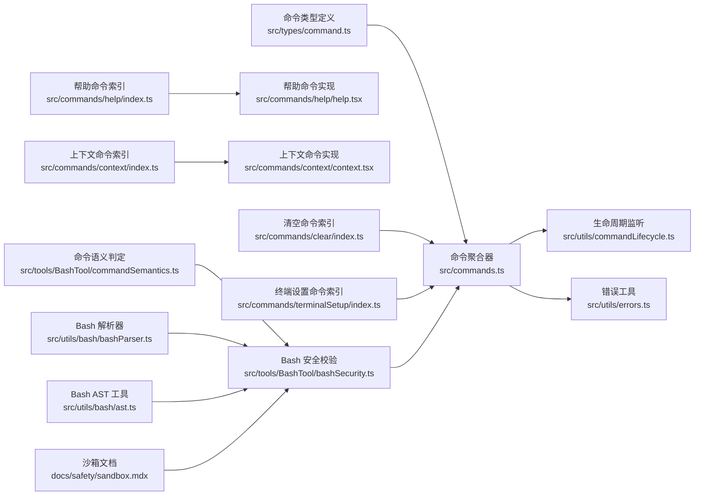

# 自定义命令开发

<cite>
**本文引用的文件**
- [src/types/command.ts](file://src/types/command.ts)
- [src/commands.ts](file://src/commands.ts)
- [src/commands/help/index.ts](file://src/commands/help/index.ts)
- [src/commands/help/help.tsx](file://src/commands/help/help.tsx)
- [src/commands/context/index.ts](file://src/commands/context/index.ts)
- [src/commands/context/context.tsx](file://src/commands/context/context.tsx)
- [src/commands/clear/index.ts](file://src/commands/clear/index.ts)
- [src/commands/terminalSetup/index.ts](file://src/commands/terminalSetup/index.ts)
- [src/utils/commandLifecycle.ts](file://src/utils/commandLifecycle.ts)
- [src/utils/errors.ts](file://src/utils/errors.ts)
- [src/tools/BashTool/bashSecurity.ts](file://src/tools/BashTool/bashSecurity.ts)
- [src/tools/BashTool/commandSemantics.ts](file://src/tools/BashTool/commandSemantics.ts)
- [src/utils/bash/bashParser.ts](file://src/utils/bash/bashParser.ts)
- [src/utils/bash/ast.ts](file://src/utils/bash/ast.ts)
- [docs/safety/sandbox.mdx](file://docs/safety/sandbox.mdx)
</cite>

## 目录
1. [简介](#简介)
2. [项目结构](#项目结构)
3. [核心组件](#核心组件)
4. [架构总览](#架构总览)
5. [详细组件分析](#详细组件分析)
6. [依赖关系分析](#依赖关系分析)
7. [性能考量](#性能考量)
8. [故障排查指南](#故障排查指南)
9. [结论](#结论)
10. [附录](#附录)

## 简介
本指南面向希望在该系统中开发“自定义命令”的开发者，覆盖命令定义规范、参数解析与返回值处理、生命周期钩子、错误处理与状态管理、与工具系统的集成、权限控制与安全考虑、测试策略、调试技巧、性能优化、打包分发与版本管理，以及常见问题与最佳实践。文档以仓库现有命令与类型系统为基础，结合安全与工具链实现，给出可落地的开发步骤与参考路径。

## 项目结构
命令系统由“命令注册与发现”“命令类型与上下文”“命令生命周期”“安全与权限校验”“工具系统集成”等模块构成。命令以“模块化目录 + 统一导出”的方式组织，类型定义集中于统一的类型文件，运行时通过命令聚合器进行加载与过滤。

**图示来源**
- [src/commands.ts:256-346](file://src/commands.ts#L256-L346)
- [src/types/command.ts:16-206](file://src/types/command.ts#L16-L206)
- [src/commands/help/index.ts:1-11](file://src/commands/help/index.ts#L1-L11)
- [src/commands/help/help.tsx:1-11](file://src/commands/help/help.tsx#L1-L11)
- [src/commands/context/index.ts:1-25](file://src/commands/context/index.ts#L1-L25)
- [src/commands/context/context.tsx:1-64](file://src/commands/context/context.tsx#L1-L64)
- [src/commands/clear/index.ts:1-20](file://src/commands/clear/index.ts#L1-L20)
- [src/commands/terminalSetup/index.ts:1-24](file://src/commands/terminalSetup/index.ts#L1-L24)
- [src/utils/commandLifecycle.ts:1-22](file://src/utils/commandLifecycle.ts#L1-L22)
- [src/utils/errors.ts:1-239](file://src/utils/errors.ts#L1-L239)
- [src/tools/BashTool/bashSecurity.ts:214-2592](file://src/tools/BashTool/bashSecurity.ts#L214-L2592)
- [src/tools/BashTool/commandSemantics.ts:50-99](file://src/tools/BashTool/commandSemantics.ts#L50-L99)
- [src/utils/bash/bashParser.ts:1081-1116](file://src/utils/bash/bashParser.ts#L1081-L1116)
- [src/utils/bash/ast.ts:176-218](file://src/utils/bash/ast.ts#L176-L218)
- [docs/safety/sandbox.mdx:57-69](file://docs/safety/sandbox.mdx#L57-L69)

**章节来源**
- [src/commands.ts:256-346](file://src/commands.ts#L256-L346)
- [src/types/command.ts:16-206](file://src/types/command.ts#L16-L206)

## 核心组件
- 命令类型与上下文
  - 统一的命令接口与结果类型定义，涵盖 prompt/local/local-jsx 三类命令形态，以及参数提示、可用性条件、是否对模型可见等元信息。
  - 上下文对象承载消息、工具、主题、IDE 状态、动态 MCP 配置等，供命令在执行时使用。
- 命令聚合与发现
  - 聚合内置命令、技能、插件、工作流等来源，按可用性与启用状态过滤，并支持动态技能注入与去重。
- 生命周期与错误
  - 提供命令生命周期监听器；统一错误类型与错误分类工具，便于在命令执行中进行一致的错误处理与日志记录。
- 安全与权限
  - Bash 安全校验与语义判定，结合沙箱配置与解析器/AST 工具，确保命令输入的安全性与可控性。

**章节来源**
- [src/types/command.ts:16-206](file://src/types/command.ts#L16-L206)
- [src/commands.ts:449-517](file://src/commands.ts#L449-L517)
- [src/utils/commandLifecycle.ts:1-22](file://src/utils/commandLifecycle.ts#L1-L22)
- [src/utils/errors.ts:1-239](file://src/utils/errors.ts#L1-L239)
- [src/tools/BashTool/bashSecurity.ts:214-2592](file://src/tools/BashTool/bashSecurity.ts#L214-L2592)

## 架构总览
命令从“定义—注册—发现—执行—反馈—生命周期—安全校验”的闭环流程运行。命令定义位于各功能目录，统一在命令聚合器中注册；执行时根据命令类型选择调用路径；本地命令通过 onDone 回调返回文本或紧凑结果；JSX 命令渲染 UI 并通过 onDone 关闭。

**图示来源**
- [src/commands.ts:476-517](file://src/commands.ts#L476-L517)
- [src/types/command.ts:53-135](file://src/types/command.ts#L53-L135)
- [src/utils/commandLifecycle.ts:10-21](file://src/utils/commandLifecycle.ts#L10-L21)
- [src/tools/BashTool/bashSecurity.ts:214-2592](file://src/tools/BashTool/bashSecurity.ts#L214-L2592)

## 详细组件分析

### 命令类型与定义规范
- 类型定义
  - Prompt 命令：面向模型调用，需提供内容生成函数与进度提示；可声明允许使用的工具、上下文策略、路径过滤等。
  - Local 命令：纯本地执行，返回文本或紧凑结果；支持非交互模式。
  - Local JSX 命令：渲染 UI，返回 React 节点并通过 onDone 关闭。
- 关键字段
  - 可用性与启用：availability/isEnabled/isHidden 控制展示与可用范围。
  - 元信息：description/aliases/version/whenToUse/argumentHint 等。
  - 加载策略：type 为 local/local-jsx 时通过 load() 延迟加载，降低启动开销。
- 结果与显示
  - Local 结果支持 text/compact/skip；JSX 命令通过 onDone 的 display/shouldQuery/metaMessages 等控制展示与后续交互。

**图示来源**
- [src/types/command.ts:16-206](file://src/types/command.ts#L16-L206)

**章节来源**
- [src/types/command.ts:16-206](file://src/types/command.ts#L16-L206)

### 命令生命周期钩子
- 生命周期监听
  - 提供设置监听器与通知接口，用于记录命令开始/完成事件，便于可观测性与审计。
- 在命令执行中的使用
  - 建议在命令入口处触发“started”，在 onDone 或异常处理后触发“completed”。

**图示来源**
- [src/utils/commandLifecycle.ts:1-22](file://src/utils/commandLifecycle.ts#L1-L22)

**章节来源**
- [src/utils/commandLifecycle.ts:1-22](file://src/utils/commandLifecycle.ts#L1-L22)

### 参数解析与返回值处理
- 参数解析
  - 命令实现接收 args 字符串与上下文；可根据需要自行解析或委托给工具/服务。
  - 对于 Bash 等外部命令，应结合安全校验与语义判定，避免危险输入。
- 返回值处理
  - 文本结果：直接传入 onDone。
  - 紧凑结果：用于减少上下文占用，适合长输出场景。
  - JSX 命令：渲染 UI 并通过 onDone 关闭，可设置 shouldQuery 以在完成后继续对话。

**章节来源**
- [src/types/command.ts:16-135](file://src/types/command.ts#L16-L135)
- [src/commands/context/context.tsx:30-63](file://src/commands/context/context.tsx#L30-L63)

### 错误处理与状态管理
- 错误类型
  - 提供多种错误类型（如 AbortError、ShellError、ConfigParseError、TelemetrySafeError 等），并提供 isAbortError、toError、errorMessage、classifyAxiosError 等工具函数。
- 状态管理
  - 命令执行中应区分“正常完成”“被中断”“网络/权限错误”等状态，合理设置 onDone 的 display/shouldQuery/metaMessages，避免污染对话历史或引发不必要的追问。

**章节来源**
- [src/utils/errors.ts:1-239](file://src/utils/errors.ts#L1-L239)
- [src/types/command.ts:117-126](file://src/types/command.ts#L117-L126)

### 与工具系统的集成
- 工具与上下文
  - 命令上下文包含工具集合、主题、IDE 状态、动态 MCP 配置等；可在命令中按需使用。
- Bash 工具链
  - 使用 bash 安全校验与语义判定，结合解析器与 AST 工具，识别潜在危险节点与复杂语法，必要时要求用户确认。
- 沙箱与配置
  - 沙箱配置支持精确匹配、前缀匹配与通配符匹配，复合命令会被拆分并迭代剥离环境变量与包装命令，防止绕过。

**图示来源**
- [src/tools/BashTool/bashSecurity.ts:214-2592](file://src/tools/BashTool/bashSecurity.ts#L214-L2592)
- [src/tools/BashTool/commandSemantics.ts:50-99](file://src/tools/BashTool/commandSemantics.ts#L50-L99)
- [src/utils/bash/bashParser.ts:1081-1116](file://src/utils/bash/bashParser.ts#L1081-L1116)
- [src/utils/bash/ast.ts:176-218](file://src/utils/bash/ast.ts#L176-L218)
- [docs/safety/sandbox.mdx:57-69](file://docs/safety/sandbox.mdx#L57-L69)

**章节来源**
- [src/commands.ts:449-517](file://src/commands.ts#L449-L517)
- [src/tools/BashTool/bashSecurity.ts:214-2592](file://src/tools/BashTool/bashSecurity.ts#L214-L2592)
- [docs/safety/sandbox.mdx:57-69](file://docs/safety/sandbox.mdx#L57-L69)

### 权限控制与安全考虑
- 命令可用性
  - 通过 availability 限制命令对特定认证/提供商环境的可见性；通过 isEnabled 动态启用/禁用。
- 输入安全
  - Bash 安全校验覆盖不完整命令、特殊字符、危险构造等；结合语义判定与解析器/AST，识别高危节点。
- 沙箱策略
  - 支持精确/前缀/通配符匹配，复合命令拆分与包装剥离，防止绕过。

**章节来源**
- [src/commands.ts:417-443](file://src/commands.ts#L417-L443)
- [src/tools/BashTool/bashSecurity.ts:214-2592](file://src/tools/BashTool/bashSecurity.ts#L214-L2592)
- [docs/safety/sandbox.mdx:57-69](file://docs/safety/sandbox.mdx#L57-L69)

### 开发示例

#### 示例一：简单文本命令（Local）
- 目标：实现一个清空会话缓存的命令，返回文本提示。
- 步骤
  - 在命令目录新建索引导出文件，声明 type: 'local'、supportsNonInteractive、description、load。
  - 实现 call(args, context)，在其中调用相关清理逻辑，最后 onDone("清理完成")。
  - 如需非交互模式，设置 supportsNonInteractive 为 true。
- 参考路径
  - [src/commands/clear/index.ts:1-20](file://src/commands/clear/index.ts#L1-L20)

**章节来源**
- [src/commands/clear/index.ts:1-20](file://src/commands/clear/index.ts#L1-L20)

#### 示例二：交互式命令（Local JSX）
- 目标：实现一个帮助命令，打开帮助界面并在关闭时回调 onDone。
- 步骤
  - 在命令目录新建索引导出文件，声明 type: 'local-jsx'、description、load。
  - 实现 call(onDone, context)，渲染帮助 UI，onDone 关闭。
- 参考路径
  - [src/commands/help/index.ts:1-11](file://src/commands/help/index.ts#L1-L11)
  - [src/commands/help/help.tsx:1-11](file://src/commands/help/help.tsx#L1-L11)

**章节来源**
- [src/commands/help/index.ts:1-11](file://src/commands/help/index.ts#L1-L11)
- [src/commands/help/help.tsx:1-11](file://src/commands/help/help.tsx#L1-L11)

#### 示例三：上下文可视化命令（Local JSX）
- 目标：在交互模式下可视化当前上下文使用情况。
- 步骤
  - 在命令目录新建索引导出文件，声明 type: 'local-jsx'、isEnabled/isHidden 等。
  - 实现 call(onDone, context)，计算上下文数据并渲染可视化，最终 onDone 输出。
- 参考路径
  - [src/commands/context/index.ts:1-25](file://src/commands/context/index.ts#L1-L25)
  - [src/commands/context/context.tsx:1-64](file://src/commands/context/context.tsx#L1-L64)

**章节来源**
- [src/commands/context/index.ts:1-25](file://src/commands/context/index.ts#L1-L25)
- [src/commands/context/context.tsx:1-64](file://src/commands/context/context.tsx#L1-L64)

#### 示例四：终端快捷键安装命令（Local JSX）
- 目标：根据终端类型提示安装快捷键绑定。
- 步骤
  - 在命令目录新建索引导出文件，声明 type: 'local-jsx'、isHidden 等。
  - 实现 call(onDone, context)，根据环境变量决定描述与隐藏策略。
- 参考路径
  - [src/commands/terminalSetup/index.ts:1-24](file://src/commands/terminalSetup/index.ts#L1-L24)

**章节来源**
- [src/commands/terminalSetup/index.ts:1-24](file://src/commands/terminalSetup/index.ts#L1-L24)

### 测试策略与调试技巧
- 单元测试
  - 对命令的参数解析、返回值格式、错误分支进行断言；对 JSX 命令模拟上下文与 onDone 行为。
- 集成测试
  - 模拟命令执行流程，验证生命周期通知、安全校验与沙箱策略。
- 调试技巧
  - 使用短栈错误输出与错误分类工具，快速定位网络/权限/解析失败等问题。
  - 在本地命令中打印关键中间状态，避免泄露敏感信息。

**章节来源**
- [src/utils/errors.ts:155-171](file://src/utils/errors.ts#L155-L171)
- [src/utils/errors.ts:204-238](file://src/utils/errors.ts#L204-L238)

### 性能优化
- 延迟加载
  - 将重型实现放入 load()，仅在命令实际调用时加载，降低启动时间。
- 缓存与去重
  - 命令聚合器对技能、插件、工作流等来源进行 memoization，动态技能去重插入。
- 输出压缩
  - 使用紧凑结果减少上下文占用，提升模型效率。

**章节来源**
- [src/commands.ts:256-346](file://src/commands.ts#L256-L346)
- [src/commands.ts:449-517](file://src/commands.ts#L449-L517)
- [src/types/command.ts:18-23](file://src/types/command.ts#L18-L23)

### 打包、分发与版本管理
- 版本与元信息
  - 在命令定义中设置 version 与 description，便于用户识别与更新。
- 插件与技能
  - 通过插件与技能目录扩展命令集；注意用户指定描述与 whenToUse 的标注，影响模型可见性。
- 分发策略
  - 内置命令与插件命令通过聚合器统一注册；MCP 技能可通过专用接口筛选。

**章节来源**
- [src/types/command.ts:175-203](file://src/types/command.ts#L175-L203)
- [src/commands.ts:547-559](file://src/commands.ts#L547-L559)
- [src/commands.ts:563-608](file://src/commands.ts#L563-L608)

## 依赖关系分析

**图示来源**
- [src/commands.ts:256-346](file://src/commands.ts#L256-L346)
- [src/types/command.ts:16-206](file://src/types/command.ts#L16-L206)
- [src/commands/help/index.ts:1-11](file://src/commands/help/index.ts#L1-L11)
- [src/commands/help/help.tsx:1-11](file://src/commands/help/help.tsx#L1-L11)
- [src/commands/context/index.ts:1-25](file://src/commands/context/index.ts#L1-L25)
- [src/commands/context/context.tsx:1-64](file://src/commands/context/context.tsx#L1-L64)
- [src/commands/clear/index.ts:1-20](file://src/commands/clear/index.ts#L1-L20)
- [src/commands/terminalSetup/index.ts:1-24](file://src/commands/terminalSetup/index.ts#L1-L24)
- [src/utils/commandLifecycle.ts:1-22](file://src/utils/commandLifecycle.ts#L1-L22)
- [src/utils/errors.ts:1-239](file://src/utils/errors.ts#L1-L239)
- [src/tools/BashTool/bashSecurity.ts:214-2592](file://src/tools/BashTool/bashSecurity.ts#L214-L2592)
- [src/tools/BashTool/commandSemantics.ts:50-99](file://src/tools/BashTool/commandSemantics.ts#L50-L99)
- [src/utils/bash/bashParser.ts:1081-1116](file://src/utils/bash/bashParser.ts#L1081-L1116)
- [src/utils/bash/ast.ts:176-218](file://src/utils/bash/ast.ts#L176-L218)
- [docs/safety/sandbox.mdx:57-69](file://docs/safety/sandbox.mdx#L57-L69)

**章节来源**
- [src/commands.ts:256-346](file://src/commands.ts#L256-L346)
- [src/types/command.ts:16-206](file://src/types/command.ts#L16-L206)

## 性能考量
- 启动性能
  - 使用 load() 延迟加载重型实现，减少冷启动时间。
- 运行性能
  - 对长输出使用紧凑结果；对频繁调用的命令进行缓存与去重。
- 安全前置
  - 在执行前完成安全校验与语义判定，避免无效执行消耗资源。

[本节为通用指导，无需列出章节来源]

## 故障排查指南
- 常见错误
  - 中断/超时/权限错误：使用 isAbortError、classifyAxiosError 快速判断。
  - 文件系统错误：区分预期的“不存在/无权限/不可达”与意外错误。
  - Shell 失败：捕获 stdout/stderr/code/interrupted，结合语义判定输出友好信息。
- 日志与可观测性
  - 使用生命周期监听记录命令开始/完成；对敏感信息进行脱敏处理。

**章节来源**
- [src/utils/errors.ts:19-33](file://src/utils/errors.ts#L19-L33)
- [src/utils/errors.ts:204-238](file://src/utils/errors.ts#L204-L238)
- [src/utils/errors.ts:173-195](file://src/utils/errors.ts#L173-L195)
- [src/utils/errors.ts:51-61](file://src/utils/errors.ts#L51-L61)
- [src/utils/commandLifecycle.ts:1-22](file://src/utils/commandLifecycle.ts#L1-L22)

## 结论
通过统一的命令类型定义、灵活的命令形态与上下文、完善的生命周期与错误处理、严格的安全与权限校验，以及与工具系统的深度集成，开发者可以高效地构建从简单文本命令到复杂交互式命令的完整能力。遵循本文档的规范与最佳实践，可显著提升命令的稳定性、安全性与用户体验。

[本节为总结性内容，无需列出章节来源]

## 附录
- 命令可用性与启用
  - availability 与 isEnabled 的组合使用，确保命令在正确环境与状态下可见与可用。
- 模型可见性
  - 对 prompt 命令，可通过 hasUserSpecifiedDescription/whenToUse 等字段增强模型侧的可见性与使用指导。

**章节来源**
- [src/commands.ts:417-443](file://src/commands.ts#L417-L443)
- [src/commands.ts:563-608](file://src/commands.ts#L563-L608)
- [src/types/command.ts:175-203](file://src/types/command.ts#L175-L203)