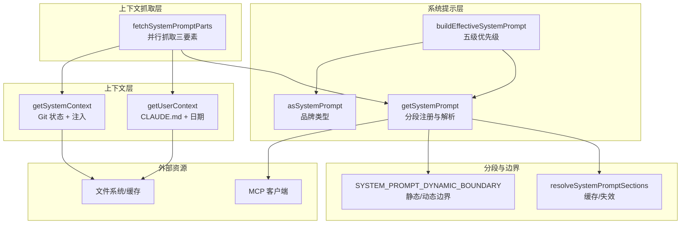
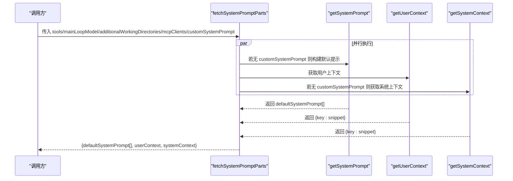
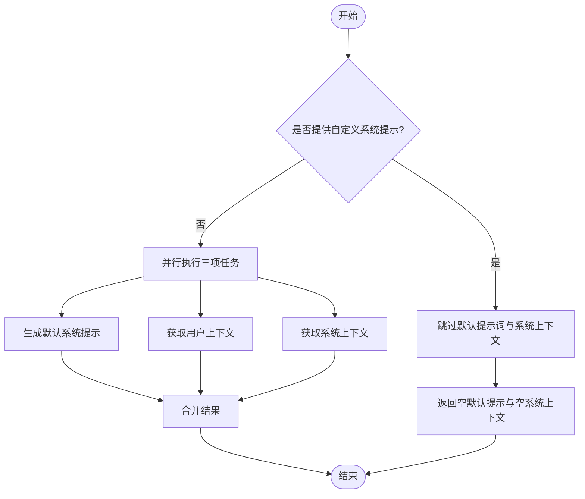
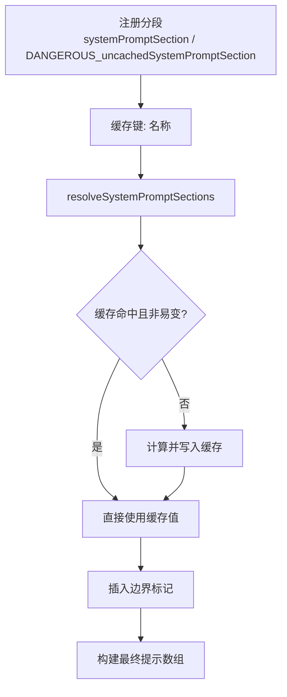
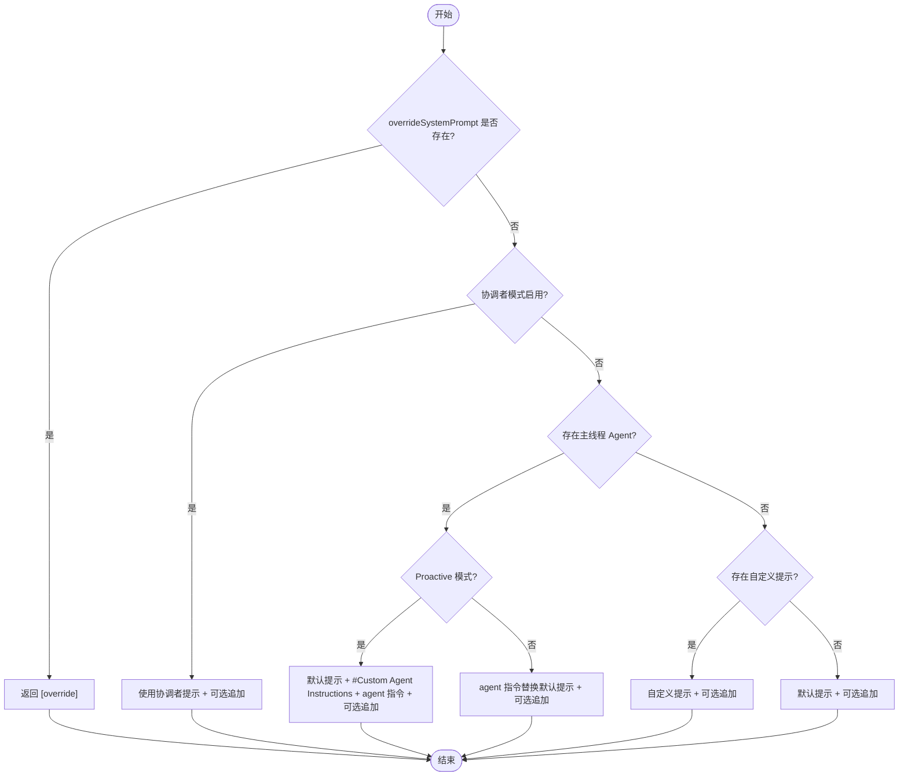
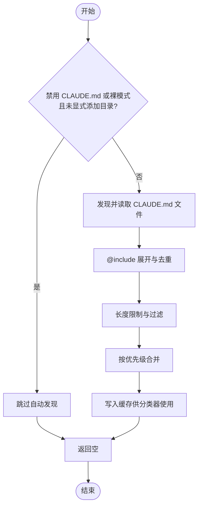
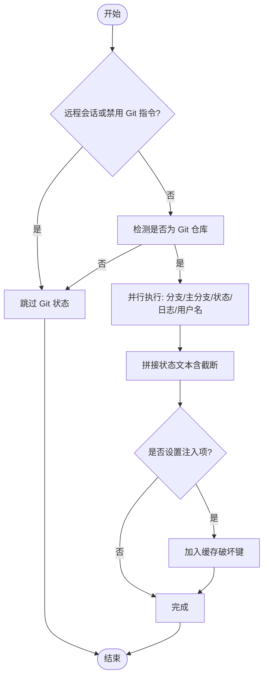
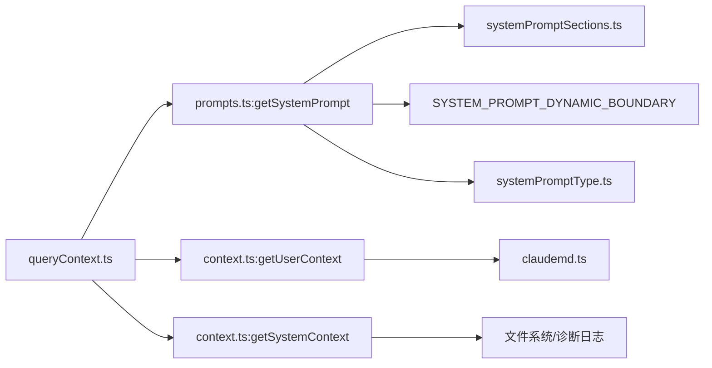

# 上下文管理

<cite>
**本文引用的文件**
- [src/utils/queryContext.ts](file://src/utils/queryContext.ts)
- [src/context.ts](file://src/context.ts)
- [src/utils/systemPrompt.ts](file://src/utils/systemPrompt.ts)
- [src/constants/systemPromptSections.ts](file://src/constants/systemPromptSections.ts)
- [src/constants/prompts.ts](file://src/constants/prompts.ts)
- [src/utils/systemPromptType.ts](file://src/utils/systemPromptType.ts)
- [src/utils/context.ts](file://src/utils/context.ts)
- [src/utils/claudemd.ts](file://src/utils/claudemd.ts)
- [src/utils/memoize.ts](file://src/utils/memoize.ts)
- [docs/context/system-prompt.mdx](file://docs/context/system-prompt.mdx)
</cite>

## 目录
1. [简介](#简介)
2. [项目结构](#项目结构)
3. [核心组件](#核心组件)
4. [架构总览](#架构总览)
5. [详细组件分析](#详细组件分析)
6. [依赖关系分析](#依赖关系分析)
7. [性能考量与内存管理](#性能考量与内存管理)
8. [故障排查指南](#故障排查指南)
9. [结论](#结论)
10. [附录：扩展方法与最佳实践](#附录扩展方法与最佳实践)

## 简介
本文件系统性阐述 Claude Code 代码库中的“上下文管理系统”，重点覆盖以下方面：
- 系统提示构建：分段管理、边界标记、动态/静态内容分离、多级优先级与追加策略
- 用户上下文注入：CLAUDE.md 自动记忆、日期注入、可选缓存与失效机制
- 项目上下文管理：工作树隔离、附加工作目录、MCP 指令注入、Git 状态快照
- fetchSystemPromptParts 的工作机制：并行抓取三类上下文前缀、自定义提示处理、侧问回退参数重建
- 缓存与内存：系统提示分段缓存、边界标记、缓存失效与并发刷新、文件状态缓存
- 性能优化与内存策略：并发 I/O、懒加载、缓存穿透保护、增量编辑与固定块重发
- 扩展方法与最佳实践：新增系统提示段、自定义规则、安全与合规注意事项

## 项目结构
围绕上下文管理的关键模块分布如下：
- 上下文抓取与组装：queryContext.ts
- 用户/系统上下文生成：context.ts
- 系统提示构建与优先级：systemPrompt.ts、prompts.ts、systemPromptType.ts
- 分段缓存与边界：systemPromptSections.ts、docs/context/system-prompt.mdx
- 记忆与 CLAUDE.md：claudemd.ts
- 通用缓存与并发刷新：memoize.ts
- 上下文窗口与令牌上限：context.ts

图表来源
- [src/utils/queryContext.ts:44-74](file://src/utils/queryContext.ts#L44-L74)
- [src/utils/systemPrompt.ts:41-123](file://src/utils/systemPrompt.ts#L41-L123)
- [src/constants/prompts.ts:444-577](file://src/constants/prompts.ts#L444-L577)
- [src/constants/systemPromptSections.ts:43-58](file://src/constants/systemPromptSections.ts#L43-L58)
- [src/context.ts:116-190](file://src/context.ts#L116-L190)

章节来源
- [src/utils/queryContext.ts:30-74](file://src/utils/queryContext.ts#L30-L74)
- [src/context.ts:116-190](file://src/context.ts#L116-L190)
- [src/utils/systemPrompt.ts:28-123](file://src/utils/systemPrompt.ts#L28-L123)
- [src/constants/systemPromptSections.ts:16-68](file://src/constants/systemPromptSections.ts#L16-L68)
- [src/constants/prompts.ts:444-577](file://src/constants/prompts.ts#L444-L577)

## 核心组件
- fetchSystemPromptParts：并行抓取 defaultSystemPrompt、userContext、systemContext，支持 customSystemPrompt 覆盖默认提示词，避免对 systemContext 的无效拼接
- getUserContext：聚合 CLAUDE.md（含自动记忆）、当前日期，写入缓存供分类器使用
- getSystemContext：聚合 Git 状态快照、可选注入项，作为系统级上下文
- getSystemPrompt：注册并解析系统提示分段，插入边界标记，按优先级组合最终提示数组
- buildEffectiveSystemPrompt：五级优先级（Override > Coordinator > Agent > Custom > Default），支持 appendSystemPrompt 追加
- 分段缓存与边界：systemPromptSections 提供缓存/失效控制，SYSTEM_PROMPT_DYNAMIC_BOUNDARY 划分静态/动态内容
- 缓存与并发刷新：memoize 实现带过期与并发刷新的缓存，避免缓存击穿
- 记忆与 CLAUDE.md：claudemd 提供文件发现、@include 展开、大小限制与过滤

章节来源
- [src/utils/queryContext.ts:44-74](file://src/utils/queryContext.ts#L44-L74)
- [src/context.ts:116-190](file://src/context.ts#L116-L190)
- [src/utils/systemPrompt.ts:41-123](file://src/utils/systemPrompt.ts#L41-L123)
- [src/constants/systemPromptSections.ts:43-58](file://src/constants/systemPromptSections.ts#L43-L58)
- [src/utils/claudemd.ts:1-200](file://src/utils/claudemd.ts#L1-L200)

## 架构总览
系统提示构建与上下文注入的整体流程如下：

图表来源
- [src/utils/queryContext.ts:44-74](file://src/utils/queryContext.ts#L44-L74)
- [src/constants/prompts.ts:444-577](file://src/constants/prompts.ts#L444-L577)
- [src/context.ts:116-190](file://src/context.ts#L116-L190)

## 详细组件分析

### 组件一：fetchSystemPromptParts 的工作机制
- 输入参数：工具集、主循环模型、附加工作目录、MCP 客户端、可选自定义系统提示
- 并行策略：defaultSystemPrompt、userContext、systemContext 三路并行，提升冷启动性能
- 自定义提示处理：若提供 customSystemPrompt，则跳过默认 getSystemPrompt 与 getSystemContext，避免对不存在的默认提示拼接 systemContext
- 输出：defaultSystemPrompt（字符串数组）、userContext（键值对）、systemContext（键值对）

图表来源
- [src/utils/queryContext.ts:44-74](file://src/utils/queryContext.ts#L44-L74)

章节来源
- [src/utils/queryContext.ts:30-74](file://src/utils/queryContext.ts#L30-L74)

### 组件二：系统提示分段管理与边界
- 分段注册：通过 systemPromptSection/DANGEROUS_uncachedSystemPromptSection 注册静态/易变分段
- 解析与缓存：resolveSystemPromptSections 从缓存读取或计算后写入缓存，支持 /clear 与 /compact 清理
- 边界标记：SYSTEM_PROMPT_DYNAMIC_BOUNDARY 将静态内容与动态内容分隔，确保缓存键稳定
- 动态内容：如 MCP 指令、会话特定指导等，使用易变分段以触发缓存失效

图表来源
- [src/constants/systemPromptSections.ts:16-58](file://src/constants/systemPromptSections.ts#L16-L58)
- [src/constants/prompts.ts:513-555](file://src/constants/prompts.ts#L513-L555)
- [src/constants/prompts.ts:572-576](file://src/constants/prompts.ts#L572-L576)

章节来源
- [src/constants/systemPromptSections.ts:16-68](file://src/constants/systemPromptSections.ts#L16-L68)
- [src/constants/prompts.ts:444-577](file://src/constants/prompts.ts#L444-L577)

### 组件三：系统提示的五级优先级与追加
- 优先级顺序：Override > Coordinator > Agent > Custom > Default
- Coordinator：在特定特性与环境变量开启时，使用协调者专用提示
- Agent：Proactive 模式下将代理指令追加至默认提示尾部；否则替换默认提示
- Append：除 Override 外，始终追加 appendSystemPrompt

图表来源
- [src/utils/systemPrompt.ts:41-123](file://src/utils/systemPrompt.ts#L41-L123)

章节来源
- [src/utils/systemPrompt.ts:28-123](file://src/utils/systemPrompt.ts#L28-L123)

### 组件四：用户上下文注入与 CLAUDE.md
- 用户上下文包含：CLAUDE.md（含自动记忆）聚合、当前日期
- CLAUDE.md 加载：按全局/用户/项目/本地层级发现与合并，支持 @include 展开、大小限制、过滤
- 缓存：写入缓存供分类器使用，减少重复 I/O

图表来源
- [src/context.ts:155-189](file://src/context.ts#L155-L189)
- [src/utils/claudemd.ts:1-200](file://src/utils/claudemd.ts#L1-L200)

章节来源
- [src/context.ts:155-189](file://src/context.ts#L155-L189)
- [src/utils/claudemd.ts:1-200](file://src/utils/claudemd.ts#L1-L200)

### 组件五：系统上下文与 Git 状态快照
- 系统上下文包含：Git 当前分支、主分支、最近提交、状态摘要（截断）、可选用户名
- 截断策略：超过最大字符数时截断并提示使用 BashTool 查看完整信息
- 注入项：可选注入用于缓存破坏调试（仅限特定特性）

图表来源
- [src/context.ts:116-150](file://src/context.ts#L116-L150)

章节来源
- [src/context.ts:116-150](file://src/context.ts#L116-L150)

### 组件六：品牌类型与类型安全
- asSystemPrompt：将字符串数组转换为品牌类型 SystemPrompt，避免误用
- 类型独立：systemPromptType 无依赖，便于任意位置导入

章节来源
- [src/utils/systemPromptType.ts:8-15](file://src/utils/systemPromptType.ts#L8-L15)

## 依赖关系分析
- fetchSystemPromptParts 依赖：getSystemPrompt、getUserContext、getSystemContext
- getSystemPrompt 依赖：分段注册与解析、边界标记、MCP 客户端、环境信息
- buildEffectiveSystemPrompt 依赖：五级优先级逻辑、品牌类型
- 分段缓存依赖：bootstrap/state 中的缓存存储与清理
- CLAUDE.md 依赖：文件系统、include 展开、大小限制、过滤

图表来源
- [src/utils/queryContext.ts:44-74](file://src/utils/queryContext.ts#L44-L74)
- [src/constants/prompts.ts:444-577](file://src/constants/prompts.ts#L444-L577)
- [src/constants/systemPromptSections.ts:43-58](file://src/constants/systemPromptSections.ts#L43-L58)
- [src/context.ts:116-190](file://src/context.ts#L116-L190)
- [src/utils/systemPromptType.ts:8-15](file://src/utils/systemPromptType.ts#L8-L15)
- [src/utils/claudemd.ts:1-200](file://src/utils/claudemd.ts#L1-L200)

章节来源
- [src/utils/queryContext.ts:44-74](file://src/utils/queryContext.ts#L44-L74)
- [src/constants/prompts.ts:444-577](file://src/constants/prompts.ts#L444-L577)
- [src/constants/systemPromptSections.ts:43-58](file://src/constants/systemPromptSections.ts#L43-L58)
- [src/context.ts:116-190](file://src/context.ts#L116-L190)
- [src/utils/systemPromptType.ts:8-15](file://src/utils/systemPromptType.ts#L8-L15)
- [src/utils/claudemd.ts:1-200](file://src/utils/claudemd.ts#L1-L200)

## 性能考量与内存管理
- 并行抓取：fetchSystemPromptParts 对默认提示、用户上下文、系统上下文采用 Promise.all 并行，降低冷启动延迟
- 分段缓存：resolveSystemPromptSections 对静态分段进行缓存，减少重复计算；易变分段通过 cacheBreak 触发缓存失效
- 边界标记：SYSTEM_PROMPT_DYNAMIC_BOUNDARY 将静态前缀与动态内容分离，最大化缓存命中率
- 并发刷新与过期：memoize 实现带过期时间的缓存，命中过期条目立即返回旧值并异步刷新，避免缓存击穿
- 文件状态缓存：claudemd 与 fileStateCache 结合，减少频繁 I/O
- 上下文窗口与令牌上限：context.ts 提供模型上下文窗口与输出上限的计算，配合 cap 与 escalate 机制优化槽位预留与扩容

章节来源
- [src/utils/queryContext.ts:61-73](file://src/utils/queryContext.ts#L61-L73)
- [src/constants/systemPromptSections.ts:43-58](file://src/constants/systemPromptSections.ts#L43-L58)
- [src/utils/memoize.ts:46-215](file://src/utils/memoize.ts#L46-L215)
- [src/utils/context.ts:51-98](file://src/utils/context.ts#L51-L98)
- [src/utils/context.ts:146-222](file://src/utils/context.ts#L146-L222)

## 故障排查指南
- 自定义提示未生效
  - 检查 customSystemPrompt 是否被正确传入，确认 fetchSystemPromptParts 跳过了默认提示与系统上下文
  - 确认 buildEffectiveSystemPrompt 的优先级顺序，确保未被 Override 或 Coordinator 覆盖
- 缓存命中异常
  - 若使用易变分段（如 MCP 指令），确认 DANGEROUS_uncachedSystemPromptSection 的使用与理由说明
  - 使用 /clear 或 /compact 清理分段缓存，验证边界标记位置是否正确
- Git 状态缺失
  - 检查远程会话或禁用 Git 指令的环境变量设置
  - 确认仓库检测与命令执行权限
- CLAUDE.md 不生效
  - 检查禁用标志与裸模式配置
  - 确认文件发现路径、@include 展开与大小限制
- 缓存破坏调试
  - 使用系统提示注入项（特定特性）触发缓存破坏，观察 userContext/systemContext 的变化

章节来源
- [src/utils/queryContext.ts:30-43](file://src/utils/queryContext.ts#L30-L43)
- [src/utils/systemPrompt.ts:41-123](file://src/utils/systemPrompt.ts#L41-L123)
- [src/constants/systemPromptSections.ts:32-38](file://src/constants/systemPromptSections.ts#L32-L38)
- [src/context.ts:124-128](file://src/context.ts#L124-L128)
- [src/utils/claudemd.ts:1-200](file://src/utils/claudemd.ts#L1-L200)

## 结论
该上下文管理系统通过“分段注册 + 边界标记 + 并行抓取 + 品牌类型”的设计，在保证缓存命中率的同时，提供了灵活的提示词优先级与动态内容注入能力。用户上下文与系统上下文分别从 CLAUDE.md 与 Git 状态快照中提取，并通过缓存与并发刷新机制保障性能与一致性。自定义提示与易变分段的引入进一步增强了系统的可扩展性与可控性。

## 附录：扩展方法与最佳实践
- 新增系统提示分段
  - 使用 systemPromptSection 注册静态分段；若需每轮重新计算，请使用 DANGEROUS_uncachedSystemPromptSection 并提供破坏缓存的理由
  - 在 resolveSystemPromptSections 中解析，确保边界标记位于静态与动态内容之间
- 自定义系统提示
  - 通过 customSystemPrompt 覆盖默认提示；注意 fetchSystemPromptParts 会跳过默认系统上下文的拼接
  - 使用 buildEffectiveSystemPrompt 的 Override/Custom/Default 优先级策略
- 上下文扩展
  - 用户上下文：在 getUserContext 中增加新的键值对；注意长度与敏感信息
  - 系统上下文：在 getSystemContext 中增加新的键值对；必要时使用注入项触发缓存破坏
- 性能优化建议
  - 将稳定内容放入静态分段，动态内容放入易变分段
  - 使用并行抓取与缓存，避免重复 I/O
  - 控制提示词长度，合理使用边界标记
- 安全与合规
  - underCover 模式下避免泄露模型名称/ID
  - 注意 MCP 指令的连接时机与 delta 注入策略
  - 遵循 CLAUDE.md 的 include 与大小限制

章节来源
- [src/constants/systemPromptSections.ts:16-68](file://src/constants/systemPromptSections.ts#L16-L68)
- [src/utils/queryContext.ts:30-74](file://src/utils/queryContext.ts#L30-L74)
- [src/utils/systemPrompt.ts:41-123](file://src/utils/systemPrompt.ts#L41-L123)
- [src/context.ts:155-190](file://src/context.ts#L155-L190)
- [src/constants/prompts.ts:572-576](file://src/constants/prompts.ts#L572-L576)
- [src/utils/claudemd.ts:1-200](file://src/utils/claudemd.ts#L1-L200)