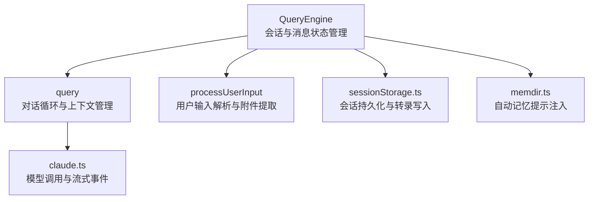
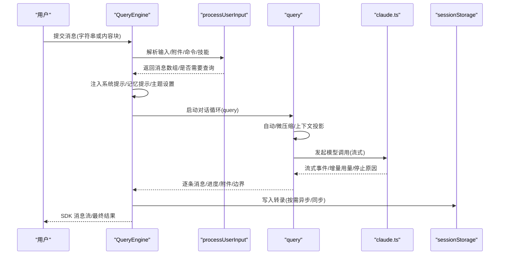
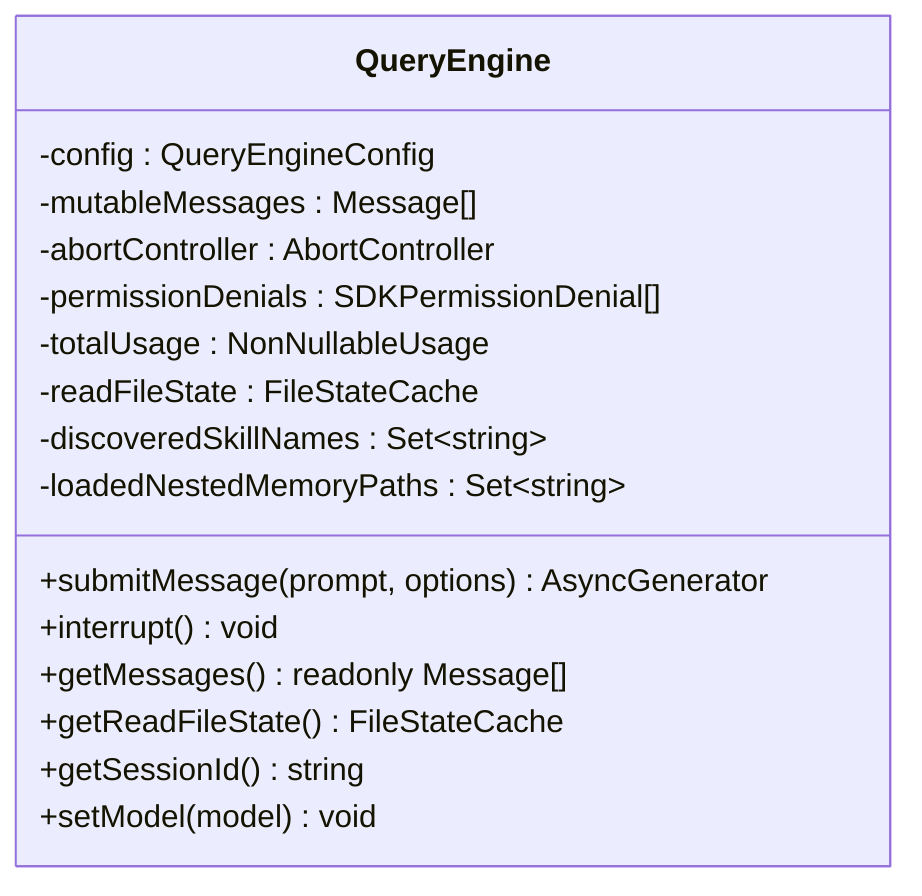
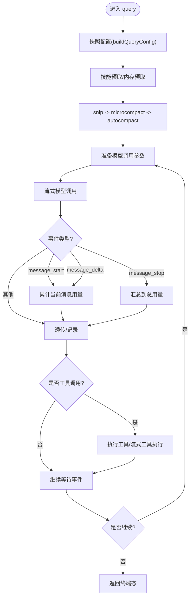
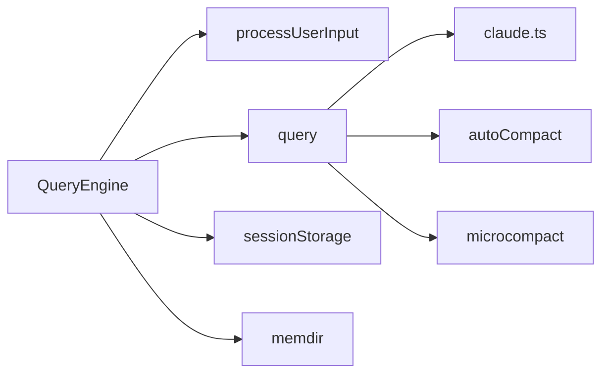

# 对话引擎

<cite>
**本文引用的文件**
- [QueryEngine.ts](file://src/QueryEngine.ts)
- [query.ts](file://src/query.ts)
- [processUserInput.ts](file://src/utils/processUserInput/processUserInput.ts)
- [claude.ts](file://src/services/api/claude.ts)
- [config.ts](file://src/query/config.ts)
- [deps.ts](file://src/query/deps.ts)
- [sessionStorage.ts](file://src/utils/sessionStorage.ts)
- [memdir.ts](file://src/memdir/memdir.ts)
</cite>

## 目录
1. [简介](#简介)
2. [项目结构](#项目结构)
3. [核心组件](#核心组件)
4. [架构总览](#架构总览)
5. [详细组件分析](#详细组件分析)
6. [依赖关系分析](#依赖关系分析)
7. [性能考量](#性能考量)
8. [故障排查指南](#故障排查指南)
9. [结论](#结论)
10. [附录](#附录)

## 简介
本文件面向 Claude Code 的对话引擎，聚焦 QueryEngine 的设计与实现，系统阐述其查询处理流程、会话管理机制、上下文与记忆系统、状态持久化、对话循环工作原理、性能优化策略与错误处理机制，并给出扩展与自定义的实践建议。读者无需深入源码即可理解其运行方式，同时可借助“章节来源”定位到具体实现位置。

## 项目结构
对话引擎由三层协作构成：
- 引擎层：QueryEngine 负责一次会话的生命周期与消息状态管理，封装提交消息、权限追踪、用量统计、结果归并等。
- 查询层：query 实现对话循环（多轮、工具调用、自动压缩、流式事件）与上下文管理。
- 输入处理层：processUserInput 将用户输入解析为消息、附件、命令与技能发现，产出标准化消息数组。

图示来源
- [QueryEngine.ts:186-210](file://src/QueryEngine.ts#L186-L210)
- [query.ts:219-239](file://src/query.ts#L219-L239)
- [processUserInput.ts:85-140](file://src/utils/processUserInput/processUserInput.ts#L85-L140)
- [claude.ts:677-708](file://src/services/api/claude.ts#L677-L708)
- [sessionStorage.ts:532-720](file://src/utils/sessionStorage.ts#L532-L720)
- [memdir.ts:419-507](file://src/memdir/memdir.ts#L419-L507)

章节来源
- [QueryEngine.ts:186-210](file://src/QueryEngine.ts#L186-L210)
- [query.ts:219-239](file://src/query.ts#L219-L239)
- [processUserInput.ts:85-140](file://src/utils/processUserInput/processUserInput.ts#L85-L140)
- [claude.ts:677-708](file://src/services/api/claude.ts#L677-L708)
- [sessionStorage.ts:532-720](file://src/utils/sessionStorage.ts#L532-L720)
- [memdir.ts:419-507](file://src/memdir/memdir.ts#L419-L507)

## 核心组件
- QueryEngine：单次对话的生命周期与状态持有者，负责消息累积、权限记录、用量统计、转录持久化、结果聚合与中断控制。
- query：对话循环与上下文管理，负责自动压缩、微压缩、技能预取、模型调用、流式事件分发与停止钩子。
- processUserInput：输入解析器，支持斜杠命令、附件提取、图像处理、钩子扩展、元消息与结果文本输出。
- claude.ts：模型调用适配层，负责请求参数组装、缓存控制、重试与回退、流式事件规范化。
- sessionStorage：会话存储与转录写入，提供写队列、批处理、尾部元数据重追加、远程事件写入器注册。
- memdir：自动记忆系统提示构建与加载，按需注入 MEMORY.md 内容与使用指引。

章节来源
- [QueryEngine.ts:186-210](file://src/QueryEngine.ts#L186-L210)
- [query.ts:219-239](file://src/query.ts#L219-L239)
- [processUserInput.ts:85-140](file://src/utils/processUserInput/processUserInput.ts#L85-L140)
- [claude.ts:677-708](file://src/services/api/claude.ts#L677-L708)
- [sessionStorage.ts:532-720](file://src/utils/sessionStorage.ts#L532-L720)
- [memdir.ts:419-507](file://src/memdir/memdir.ts#L419-L507)

## 架构总览
下图展示了从用户输入到模型响应、再到 SDK 输出与会话持久化的端到端流程。

图示来源
- [QueryEngine.ts:211-238](file://src/QueryEngine.ts#L211-L238)
- [processUserInput.ts:85-140](file://src/utils/processUserInput/processUserInput.ts#L85-L140)
- [query.ts:241-251](file://src/query.ts#L241-L251)
- [claude.ts:753-781](file://src/services/api/claude.ts#L753-L781)
- [sessionStorage.ts:645-686](file://src/utils/sessionStorage.ts#L645-L686)

## 详细组件分析

### QueryEngine：会话生命周期与消息状态
- 角色与职责
  - 维护会话级消息列表、用量累计、权限拒绝记录、文件读取缓存与发现技能集合。
  - 包装 canUseTool 以收集权限拒绝信息；在提交消息前注入系统提示与记忆提示。
  - 在每轮开始与结束时进行转录持久化与快照记录；支持中断与查询结果聚合。
- 关键流程
  - 输入处理：调用 processUserInput 生成消息数组与查询开关；根据结果更新工具权限上下文。
  - 系统提示构建：合并默认/自定义/附加系统提示，按需注入自动记忆提示。
  - 查询启动：通过 query 生成器驱动对话循环，逐条产出消息、进度、附件与边界。
  - 结果归并：统计耗时、用量、权限拒绝、结构化输出等，产出最终结果消息。
- 状态与持久化
  - 使用 sessionStorage 记录转录；在关键节点（如紧凑边界、最大轮次/预算触发）进行刷新。
  - 支持历史压缩（feature 分支）与会话元数据重追加，保证 --resume 可靠性。

图示来源
- [QueryEngine.ts:186-210](file://src/QueryEngine.ts#L186-L210)
- [QueryEngine.ts:132-175](file://src/QueryEngine.ts#L132-L175)

章节来源
- [QueryEngine.ts:186-210](file://src/QueryEngine.ts#L186-L210)
- [QueryEngine.ts:211-238](file://src/QueryEngine.ts#L211-L238)
- [QueryEngine.ts:433-466](file://src/QueryEngine.ts#L433-L466)
- [QueryEngine.ts:679-756](file://src/QueryEngine.ts#L679-L756)
- [QueryEngine.ts:800-844](file://src/QueryEngine.ts#L800-L844)
- [QueryEngine.ts:845-913](file://src/QueryEngine.ts#L845-L913)
- [QueryEngine.ts:914-994](file://src/QueryEngine.ts#L914-L994)
- [QueryEngine.ts:996-1074](file://src/QueryEngine.ts#L996-L1074)
- [QueryEngine.ts:1107-1181](file://src/QueryEngine.ts#L1107-L1181)

### query：对话循环与上下文管理
- 角色与职责
  - 驱动对话循环，按轮次执行自动压缩、微压缩、上下文投影、模型调用与工具执行。
  - 管理状态（消息、工具上下文、令牌预算、停止钩子、转录计数等），在迭代间传递。
  - 处理流式事件（message_start/delta/stop）、错误恢复（提示过长、输出超限、媒体恢复）与回退模型。
- 关键机制
  - 配置快照：buildQueryConfig 捕获一次性运行时门禁与会话 ID。
  - 依赖注入：productionDeps 将模型调用、微压缩、自动压缩与 UUID 工具注入。
  - 技能预取：Turn 级别的技能发现预取，隐藏在模型流式期间。
  - 压缩链路：先 snip（可选），再 microcompact，再 autocompact，必要时产出紧凑边界消息。
  - 任务预算：API 侧 task_budget 与本地累计结合，跨紧凑边界保持一致性。

图示来源
- [query.ts:295-305](file://src/query.ts#L295-L305)
- [query.ts:401-410](file://src/query.ts#L401-L410)
- [query.ts:414-426](file://src/query.ts#L414-L426)
- [query.ts:441-447](file://src/query.ts#L441-L447)
- [query.ts:454-543](file://src/query.ts#L454-L543)
- [query.ts:659-741](file://src/query.ts#L659-L741)

章节来源
- [query.ts:219-239](file://src/query.ts#L219-L239)
- [query.ts:241-251](file://src/query.ts#L241-L251)
- [query.ts:295-305](file://src/query.ts#L295-L305)
- [query.ts:401-410](file://src/query.ts#L401-L410)
- [query.ts:414-426](file://src/query.ts#L414-L426)
- [query.ts:441-447](file://src/query.ts#L441-L447)
- [query.ts:454-543](file://src/query.ts#L454-L543)
- [query.ts:659-741](file://src/query.ts#L659-L741)

### processUserInput：用户输入处理与附件提取
- 功能要点
  - 解析字符串或内容块输入，支持图像尺寸调整、元消息注入、粘贴内容处理。
  - 斜杠命令路由、桥接安全命令、超计划关键词替换、钩子扩展与阻断。
  - 附件提取（文件/IDE 选择/代理提及）、结果文本输出、下一步输入预填。
- 设计特色
  - 将“钩子”扩展点前置，允许在继续查询前插入额外上下文或阻断。
  - 对 isMeta 消息（如图像元数据）进行透明注入，不影响可见转录。

章节来源
- [processUserInput.ts:85-140](file://src/utils/processUserInput/processUserInput.ts#L85-L140)
- [processUserInput.ts:281-299](file://src/utils/processUserInput/processUserInput.ts#L281-L299)
- [processUserInput.ts:422-453](file://src/utils/processUserInput/processUserInput.ts#L422-L453)
- [processUserInput.ts:495-514](file://src/utils/processUserInput/processUserInput.ts#L495-L514)
- [processUserInput.ts:531-551](file://src/utils/processUserInput/processUserInput.ts#L531-L551)
- [processUserInput.ts:576-588](file://src/utils/processUserInput/processUserInput.ts#L576-L588)
- [processUserInput.ts:591-605](file://src/utils/processUserInput/processUserInput.ts#L591-L605)

### claude.ts：模型交互与流式事件
- 职责边界
  - 统一模型调用入口，封装工具模式、思考配置、缓存控制、头信息与实验特性。
  - 流式事件规范化，增量用量累计，停止原因延迟到 message_delta 后确认。
  - 回退模型与孤儿消息墓碑处理，确保 UI 与转录一致性。
- 关键参数
  - 工具模式、思考配置、输出格式、任务预算、快速模式、顾问模型、通知回调等。

章节来源
- [claude.ts:677-708](file://src/services/api/claude.ts#L677-L708)
- [claude.ts:753-781](file://src/services/api/claude.ts#L753-L781)
- [claude.ts:800-844](file://src/services/api/claude.ts#L800-L844)

### sessionStorage：会话持久化与转录写入
- 特性
  - 写队列与批处理：按固定阈值批量写入，避免频繁 IO。
  - 元数据重追加：在紧凑边界与退出时将标题、标签、最后提示等追加至尾部，便于快速读取。
  - 远程事件写入器：支持 CCR v2 内部事件写入，提升远端会话恢复能力。
  - 安全与健壮：失败重试、目录懒创建、异常捕获与诊断日志。

章节来源
- [sessionStorage.ts:532-720](file://src/utils/sessionStorage.ts#L532-L720)
- [sessionStorage.ts:645-686](file://src/utils/sessionStorage.ts#L645-L686)
- [sessionStorage.ts:721-800](file://src/utils/sessionStorage.ts#L721-L800)

### memdir：自动记忆系统与提示注入
- 能力
  - 构建 typed-memory 行为说明与搜索指引，按需加载 MEMORY.md 内容并截断警告。
  - 支持个人与团队记忆目录，KAIROS 日志模式下的追加式日志写入。
  - 在系统提示中注入记忆使用规则与工具调用指引，确保模型正确使用记忆目录。

章节来源
- [memdir.ts:419-507](file://src/memdir/memdir.ts#L419-L507)
- [memdir.ts:268-316](file://src/memdir/memdir.ts#L268-L316)
- [memdir.ts:327-370](file://src/memdir/memdir.ts#L327-L370)

## 依赖关系分析
- QueryEngine 依赖
  - processUserInput：输入解析与消息生成。
  - query：对话循环与上下文管理。
  - claude.ts：模型调用与流式事件。
  - sessionStorage：转录写入与会话持久化。
  - memdir：自动记忆提示构建。
- query 依赖
  - claude.ts：模型调用。
  - autoCompact/microCompact：上下文压缩。
  - 技能预取与上下文折叠（可选）。
- 依赖注入
  - productionDeps 将模型调用、压缩与 UUID 工具注入 query，便于测试替换。

图示来源
- [deps.ts:33-40](file://src/query/deps.ts#L33-L40)
- [config.ts:29-46](file://src/query/config.ts#L29-L46)

章节来源
- [deps.ts:33-40](file://src/query/deps.ts#L33-L40)
- [config.ts:29-46](file://src/query/config.ts#L29-L46)

## 性能考量
- 写入路径优化
  - 写队列与批处理：降低磁盘写入次数，避免抖动。
  - 条件刷新：在历史压缩边界与预算/轮次限制处统一刷新，减少碎片写。
- 上下文压缩
  - snip/microcompact/autocompact 三段式压缩，优先释放冗余上下文，降低令牌占用。
  - 任务预算与紧凑边界一致性：确保模型侧预算感知与本地累计一致。
- 流式与回退
  - 流式工具执行与回退模型切换，减少首字节延迟与失败重试成本。
  - 墓碑消息清理：在流式回退时移除不完整消息，避免后续校验失败。
- 缓存与提示
  - 提示缓存控制与 TTL 策略，结合用户身份与来源门禁，平衡命中率与新鲜度。
- I/O 与内存
  - 写队列定时器与最大块大小限制，防止 OOM 与长时间阻塞。
  - 会话元数据尾部重追加，避免全量扫描，提升 --resume 速度。

章节来源
- [sessionStorage.ts:645-686](file://src/utils/sessionStorage.ts#L645-L686)
- [query.ts:401-410](file://src/query.ts#L401-L410)
- [query.ts:414-426](file://src/query.ts#L414-L426)
- [query.ts:454-543](file://src/query.ts#L454-L543)
- [claude.ts:753-781](file://src/services/api/claude.ts#L753-L781)
- [claude.ts:800-844](file://src/services/api/claude.ts#L800-L844)

## 故障排查指南
- 无结果或空白输出
  - 检查 isResultSuccessful 判定与错误诊断前缀，关注 result 类型、最后内容类型与 stop_reason。
  - 查看内存错误水印（turn-scoped）与错误日志，定位工具执行失败或外部错误。
- 最大轮次/预算限制
  - 当达到 maxTurns 或 maxBudgetUsd 时，QueryEngine 会提前返回错误结果，包含错误列表与用量统计。
- 流式事件缺失
  - 确认 includePartialMessages 开关与 message_delta 中 stop_reason 延迟确认逻辑。
- 权限与拒绝
  - QueryEngine 会收集权限拒绝列表并在结果中返回，便于 SDK 层展示与审计。
- 会话恢复问题
  - 确保在关键边界后执行 flushSessionStorage；检查转录文件是否存在、尾部元数据是否重追加。

章节来源
- [QueryEngine.ts:1107-1143](file://src/QueryEngine.ts#L1107-L1143)
- [QueryEngine.ts:861-893](file://src/QueryEngine.ts#L861-L893)
- [QueryEngine.ts:996-1027](file://src/QueryEngine.ts#L996-L1027)
- [QueryEngine.ts:833-842](file://src/QueryEngine.ts#L833-L842)
- [sessionStorage.ts:721-800](file://src/utils/sessionStorage.ts#L721-L800)

## 结论
QueryEngine 将输入处理、对话循环、模型交互与会话持久化整合为统一的异步生成器接口，既满足 SDK 非交互场景，也为 REPL/桌面端提供一致的体验。通过上下文压缩、流式事件与回退机制、权限与用量追踪、以及健壮的转录持久化，系统在复杂任务与长会话场景下仍能保持稳定与高效。扩展点包括自定义系统提示、记忆注入、钩子与插件、以及新的 AI 模型适配。

## 附录
- 扩展与自定义建议
  - 自定义系统提示：通过 customSystemPrompt 与 appendSystemPrompt 注入领域知识；结合 memoryMechanicsPrompt 注入自动记忆使用规则。
  - 钩子与插件：利用 processUserInput 的钩子扩展点在查询前注入上下文或阻断；通过插件缓存仅加载策略减少启动开销。
  - 新模型接入：在 claude.ts 中扩展模型调用参数与头信息，确保与现有流式事件与用量统计兼容。
  - 诊断与调试：启用 includePartialMessages 获取中间事件；使用 headlessProfilerCheckpoint 与 queryProfiler 定位瓶颈；查看转录文件与尾部元数据辅助恢复。

章节来源
- [QueryEngine.ts:324-328](file://src/QueryEngine.ts#L324-L328)
- [QueryEngine.ts:537-541](file://src/QueryEngine.ts#L537-L541)
- [claude.ts:677-708](file://src/services/api/claude.ts#L677-L708)
- [sessionStorage.ts:721-800](file://src/utils/sessionStorage.ts#L721-L800)