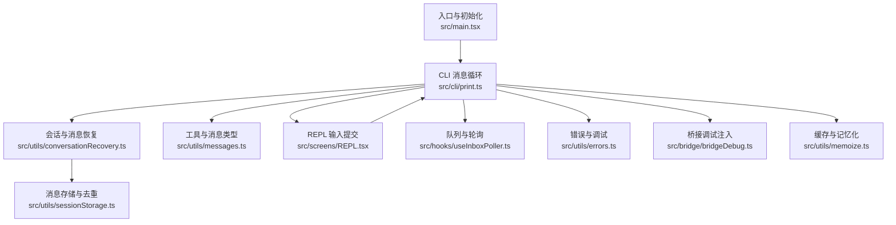
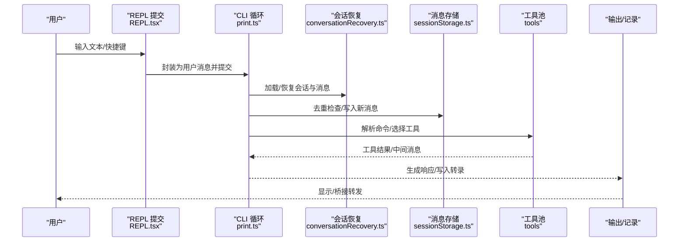
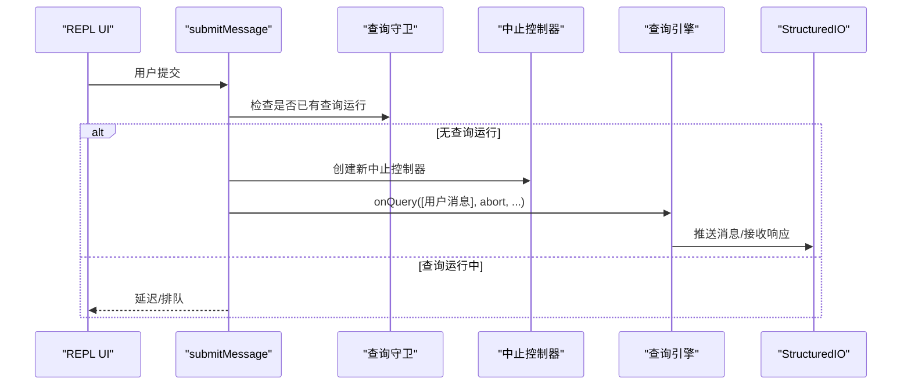
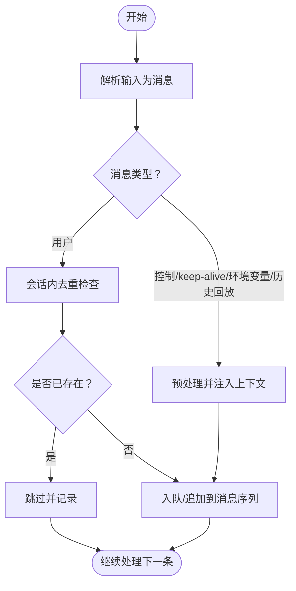
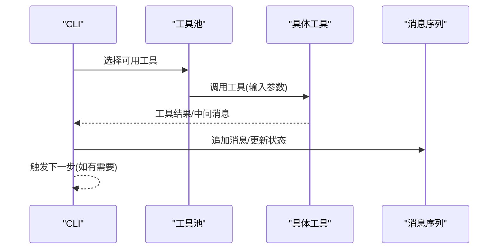
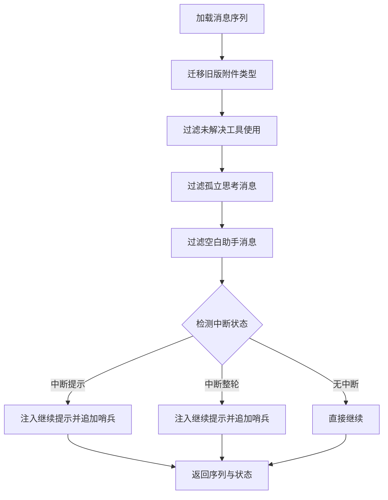
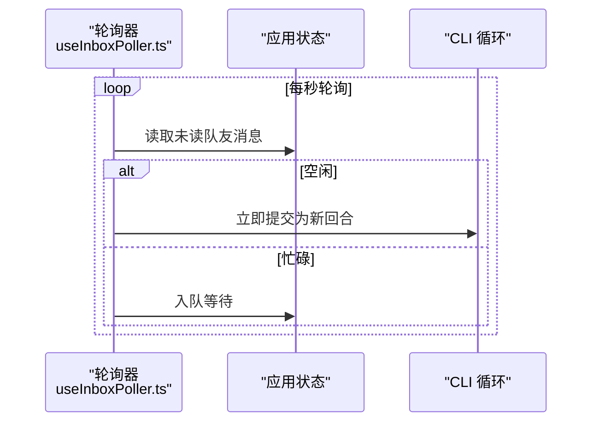
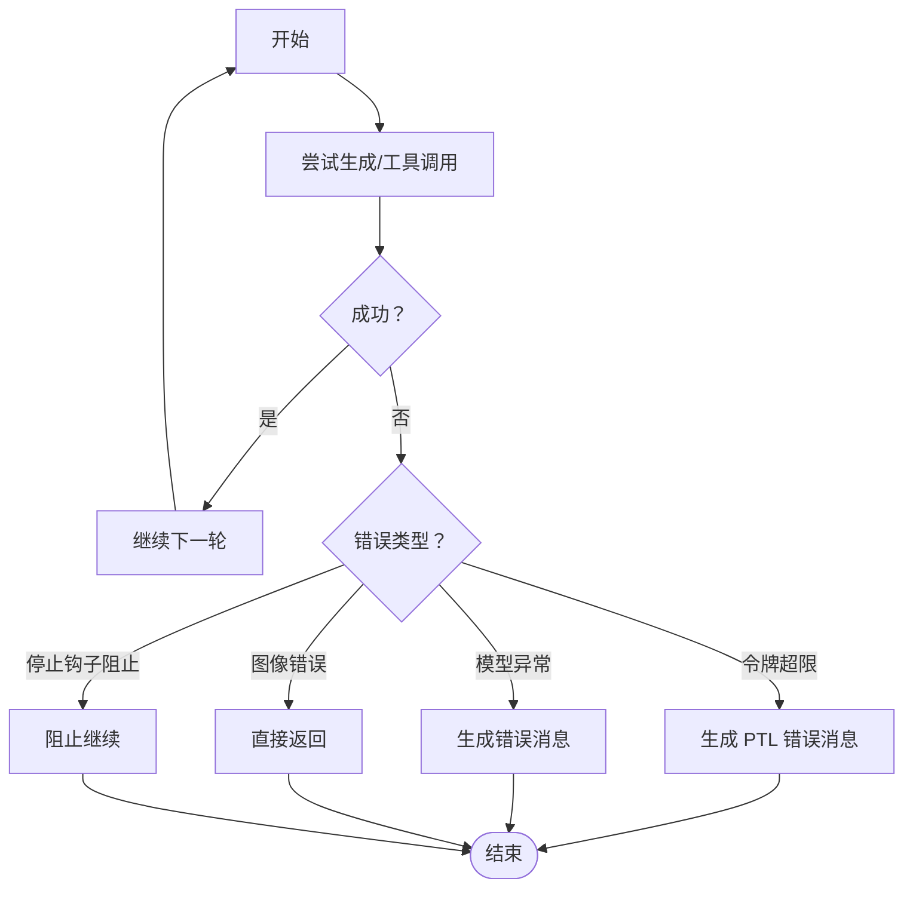
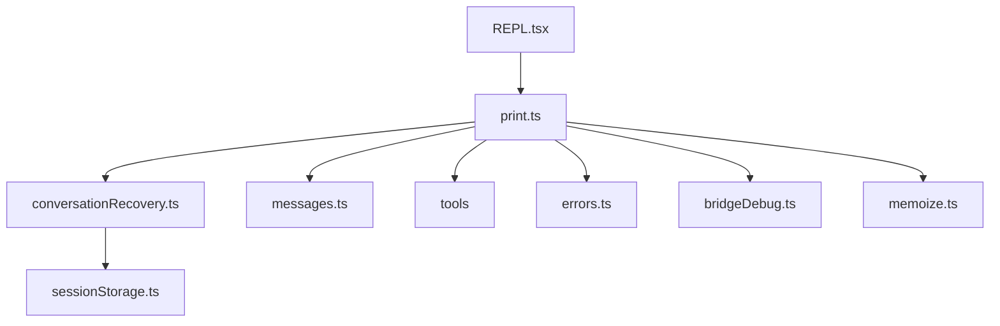

# 对话循环机制

<cite>
**本文引用的文件**
- [src/main.tsx](file://src/main.tsx)
- [src/cli/print.ts](file://src/cli/print.ts)
- [src/utils/conversationRecovery.ts](file://src/utils/conversationRecovery.ts)
- [src/utils/sessionStorage.ts](file://src/utils/sessionStorage.ts)
- [src/utils/messages.ts](file://src/utils/messages.ts)
- [src/hooks/useInboxPoller.ts](file://src/hooks/useInboxPoller.ts)
- [src/screens/REPL.tsx](file://src/screens/REPL.tsx)
- [src/utils/errors.ts](file://src/utils/errors.ts)
- [src/bridge/bridgeDebug.ts](file://src/bridge/bridgeDebug.ts)
- [src/utils/memoize.ts](file://src/utils/memoize.ts)
- [docs/conversation/the-loop.mdx](file://docs/conversation/the-loop.mdx)
</cite>

## 目录
1. [引言](#引言)
2. [项目结构](#项目结构)
3. [核心组件](#核心组件)
4. [架构总览](#架构总览)
5. [详细组件分析](#详细组件分析)
6. [依赖关系分析](#依赖关系分析)
7. [性能考量](#性能考量)
8. [故障排除指南](#故障排除指南)
9. [结论](#结论)
10. [附录](#附录)

## 引言
本文件系统化阐述“对话循环机制”，聚焦于 submitMessage 的完整执行流程、异步生成器与消息处理管道、用户输入处理、命令解析、工具调用与响应生成的全链路。文档覆盖对话状态管理、消息序列控制、错误处理与边界条件，并提供调试技巧、性能监控与故障排除方法，同时给出可扩展点与自定义处理逻辑的实践建议。

## 项目结构
对话循环贯穿 CLI、REPL、工具与消息持久化等模块，关键路径包括：
- 入口与初始化：main.tsx 负责环境准备、特性开关与入口分派
- CLI 消息循环：print.ts 提供结构化输入流与并发处理
- 会话与消息：conversationRecovery.ts、sessionStorage.ts 管理会话加载、消息去重与中断检测
- 工具与消息：tools 与 utils/messages.ts 定义消息类型与构造
- 队列与轮询：useInboxPoller.ts 与 print.ts 的队列/轮询机制
- 错误与调试：errors.ts、bridgeDebug.ts 提供错误短栈与注入式故障模拟

图表来源
- [src/main.tsx:585-800](file://src/main.tsx#L585-L800)
- [src/cli/print.ts:2473-2824](file://src/cli/print.ts#L2473-L2824)
- [src/utils/conversationRecovery.ts:459-601](file://src/utils/conversationRecovery.ts#L459-L601)
- [src/utils/sessionStorage.ts:3839-3868](file://src/utils/sessionStorage.ts#L3839-L3868)
- [src/utils/messages.ts:4555-4594](file://src/utils/messages.ts#L4555-L4594)
- [src/screens/REPL.tsx:3139-4023](file://src/screens/REPL.tsx#L3139-L4023)
- [src/hooks/useInboxPoller.ts:107-145](file://src/hooks/useInboxPoller.ts#L107-L145)
- [src/utils/errors.ts:143-171](file://src/utils/errors.ts#L143-L171)
- [src/bridge/bridgeDebug.ts:77-110](file://src/bridge/bridgeDebug.ts#L77-L110)
- [src/utils/memoize.ts:217-269](file://src/utils/memoize.ts#L217-L269)

章节来源
- [src/main.tsx:585-800](file://src/main.tsx#L585-L800)
- [src/cli/print.ts:2473-2824](file://src/cli/print.ts#L2473-L2824)

## 核心组件
- CLI 消息循环与并发处理：print.ts 通过结构化输入流与并行任务实现“读取输入→入队→处理→生成”的流水线，支持控制事件、keep-alive、环境变量注入与历史回放。
- 会话恢复与消息去重：conversationRecovery.ts 负责从日志重建消息序列、检测中断、过滤无效消息并注入“继续”提示；sessionStorage.ts 提供基于 UUID 的消息存在性检查与缓存。
- 输入提交与状态推进：REPL.tsx 的 onSubmit 流程将用户输入封装为消息并触发查询；当无查询运行时，直接提交；否则延迟至空闲。
- 队列与轮询：useInboxPoller.ts 周期轮询队友消息，空闲时立即提交，忙碌时入队并在回合结束时交付。
- 工具与消息类型：messages.ts 提供系统/本地命令、紧凑边界等消息构造器；工具通过统一接口参与对话循环。
- 错误与调试：errors.ts 提供短栈与路径提取；bridgeDebug.ts 注入故障以模拟网络/致命错误。

章节来源
- [src/cli/print.ts:2803-2824](file://src/cli/print.ts#L2803-L2824)
- [src/utils/conversationRecovery.ts:154-252](file://src/utils/conversationRecovery.ts#L154-L252)
- [src/utils/sessionStorage.ts:3862-3868](file://src/utils/sessionStorage.ts#L3862-L3868)
- [src/screens/REPL.tsx:3146-4023](file://src/screens/REPL.tsx#L3146-L4023)
- [src/hooks/useInboxPoller.ts:107-145](file://src/hooks/useInboxPoller.ts#L107-L145)
- [src/utils/messages.ts:4555-4594](file://src/utils/messages.ts#L4555-L4594)
- [src/utils/errors.ts:143-171](file://src/utils/errors.ts#L143-L171)
- [src/bridge/bridgeDebug.ts:77-110](file://src/bridge/bridgeDebug.ts#L77-L110)

## 架构总览
对话循环由“输入→解析→调度→执行→响应→记录”构成闭环。CLI 层负责并发与队列，REPL 层负责交互与状态推进，工具层负责能力扩展，消息层负责一致性与恢复。

图表来源
- [src/screens/REPL.tsx:3146-4023](file://src/screens/REPL.tsx#L3146-L4023)
- [src/cli/print.ts:2473-2824](file://src/cli/print.ts#L2473-L2824)
- [src/utils/conversationRecovery.ts:459-601](file://src/utils/conversationRecovery.ts#L459-L601)
- [src/utils/sessionStorage.ts:3839-3868](file://src/utils/sessionStorage.ts#L3839-L3868)

## 详细组件分析

### submitMessage 执行流程与异步生成器
submitMessage 在 REPL 中由用户提交触发，其核心要点：
- 状态推进：提交前重置滚动、恢复主动模式；若已有查询运行则延迟；否则创建新的中止控制器并提交。
- 消息封装：使用消息构造器创建用户消息，携带 isMeta 标记用于系统提示。
- 查询触发：调用 onQuery 并传入模型与工具上下文，形成“输入→生成→记录”的异步流水线。
- 并发与队列：CLI 层通过结构化输入流与并行任务实现“读取→入队→处理→生成”的解耦，避免阻塞。

图表来源
- [src/screens/REPL.tsx:3146-4023](file://src/screens/REPL.tsx#L3146-L4023)
- [src/cli/print.ts:2803-2824](file://src/cli/print.ts#L2803-L2824)

章节来源
- [src/screens/REPL.tsx:3146-4023](file://src/screens/REPL.tsx#L3146-L4023)
- [src/cli/print.ts:2803-2824](file://src/cli/print.ts#L2803-L2824)

### 用户输入处理、命令解析与消息序列控制
- 输入处理：REPL 将输入封装为用户消息，支持 isMeta 标记与结构化内容；CLI 层对控制事件、keep-alive、环境变量注入与历史回放进行前置处理。
- 命令解析：print.ts 通过结构化输入流逐条消费消息，区分用户消息与其他事件；对非用户事件在同 tick 内完成生命周期通知。
- 序列控制：conversationRecovery.ts 在恢复时过滤未解决工具使用、孤立思考消息与空白助手消息，并在必要时注入“继续”提示与合成助手哨兵，确保 API 合法性。
- 去重与一致性：sessionStorage.ts 使用 memoized 缓存与 UUID 集合快速判断消息是否已存在，避免重复处理。

图表来源
- [src/cli/print.ts:1498-4064](file://src/cli/print.ts#L1498-L4064)
- [src/utils/conversationRecovery.ts:154-252](file://src/utils/conversationRecovery.ts#L154-L252)
- [src/utils/sessionStorage.ts:3862-3868](file://src/utils/sessionStorage.ts#L3862-L3868)

章节来源
- [src/cli/print.ts:1498-4064](file://src/cli/print.ts#L1498-L4064)
- [src/utils/conversationRecovery.ts:154-252](file://src/utils/conversationRecovery.ts#L154-L252)
- [src/utils/sessionStorage.ts:3862-3868](file://src/utils/sessionStorage.ts#L3862-L3868)

### 工具调用与响应生成
- 工具选择：CLI 层根据消息内容与上下文选择工具池，结合权限与策略过滤；工具输出以消息形式回写到对话序列。
- 响应生成：工具执行可能产生中间消息（如思考/进度），最终生成助手消息；若发生中断，conversationRecovery.ts 会注入“继续”提示以恢复自然对话。
- 消息类型：messages.ts 提供系统本地命令、紧凑边界等消息类型，便于在不同阶段插入元信息与控制信号。

图表来源
- [src/cli/print.ts:2473-2824](file://src/cli/print.ts#L2473-L2824)
- [src/utils/messages.ts:4555-4594](file://src/utils/messages.ts#L4555-L4594)

章节来源
- [src/cli/print.ts:2473-2824](file://src/cli/print.ts#L2473-L2824)
- [src/utils/messages.ts:4555-4594](file://src/utils/messages.ts#L4555-L4594)

### 对话状态管理、消息序列与中断检测
- 状态管理：conversationRecovery.ts 检测“中断提示/中断整轮/无中断”三种状态，必要时注入“继续”提示并追加合成助手哨兵，保证后续生成合法。
- 消息序列：按时间戳与父子关系构建链路，过滤系统/进度等书签类消息，保留用户与附件等关键上下文。
- 中断检测：通过最后一条“相关消息”类型判断是否处于中断状态，避免将错误助手消息误判为完成回合。

图表来源
- [src/utils/conversationRecovery.ts:154-333](file://src/utils/conversationRecovery.ts#L154-L333)

章节来源
- [src/utils/conversationRecovery.ts:154-333](file://src/utils/conversationRecovery.ts#L154-L333)

### 队列与轮询机制
- 队列：print.ts 通过结构化输入流与并行任务实现“读取→入队→处理→生成”的流水线；对非用户事件在同 tick 内完成生命周期通知。
- 轮询：useInboxPoller.ts 周期轮询队友消息，空闲时立即提交，忙碌时入队并在回合结束时交付，避免打断用户当前工作。

图表来源
- [src/hooks/useInboxPoller.ts:107-145](file://src/hooks/useInboxPoller.ts#L107-L145)
- [src/cli/print.ts:2473-2508](file://src/cli/print.ts#L2473-L2508)

章节来源
- [src/hooks/useInboxPoller.ts:107-145](file://src/hooks/useInboxPoller.ts#L107-L145)
- [src/cli/print.ts:2473-2508](file://src/cli/print.ts#L2473-L2508)

### 错误处理与边界条件
- 错误短栈：errors.ts 提供短栈提取，仅保留关键帧，减少上下文浪费。
- 故障注入：bridgeDebug.ts 可在桥接 API 调用前检查故障队列，按配置注入致命/瞬时错误，辅助测试与诊断。
- 终止与继续条件：docs/conversation/the-loop.mdx 总结了多种终止与恢复路径，包括 token 超限、模型错误、图像错误、停止钩子阻止等。

图表来源
- [src/utils/errors.ts:143-171](file://src/utils/errors.ts#L143-L171)
- [src/bridge/bridgeDebug.ts:77-110](file://src/bridge/bridgeDebug.ts#L77-L110)
- [docs/conversation/the-loop.mdx:68-87](file://docs/conversation/the-loop.mdx#L68-L87)

章节来源
- [src/utils/errors.ts:143-171](file://src/utils/errors.ts#L143-L171)
- [src/bridge/bridgeDebug.ts:77-110](file://src/bridge/bridgeDebug.ts#L77-L110)
- [docs/conversation/the-loop.mdx:68-87](file://docs/conversation/the-loop.mdx#L68-L87)

## 依赖关系分析
- CLI 与 REPL：REPL 负责交互与状态推进，CLI 负责并发与消息循环；二者通过 onQuery 与消息序列耦合。
- 会话与存储：conversationRecovery.ts 依赖 sessionStorage.ts 的日志加载与一致性校验；sessionStorage.ts 使用 memoize 缓存提升性能。
- 工具与消息：工具输出以消息形式回写，messages.ts 提供统一的消息构造器与类型定义。
- 调试与错误：errors.ts 与 bridgeDebug.ts 为调试与故障注入提供支撑。

图表来源
- [src/screens/REPL.tsx:3146-4023](file://src/screens/REPL.tsx#L3146-L4023)
- [src/cli/print.ts:2473-2824](file://src/cli/print.ts#L2473-L2824)
- [src/utils/conversationRecovery.ts:459-601](file://src/utils/conversationRecovery.ts#L459-L601)
- [src/utils/sessionStorage.ts:3839-3868](file://src/utils/sessionStorage.ts#L3839-L3868)
- [src/utils/messages.ts:4555-4594](file://src/utils/messages.ts#L4555-L4594)
- [src/utils/errors.ts:143-171](file://src/utils/errors.ts#L143-L171)
- [src/bridge/bridgeDebug.ts:77-110](file://src/bridge/bridgeDebug.ts#L77-L110)
- [src/utils/memoize.ts:217-269](file://src/utils/memoize.ts#L217-L269)

章节来源
- [src/screens/REPL.tsx:3146-4023](file://src/screens/REPL.tsx#L3146-L4023)
- [src/cli/print.ts:2473-2824](file://src/cli/print.ts#L2473-L2824)
- [src/utils/conversationRecovery.ts:459-601](file://src/utils/conversationRecovery.ts#L459-L601)
- [src/utils/sessionStorage.ts:3839-3868](file://src/utils/sessionStorage.ts#L3839-L3868)
- [src/utils/messages.ts:4555-4594](file://src/utils/messages.ts#L4555-L4594)
- [src/utils/errors.ts:143-171](file://src/utils/errors.ts#L143-L171)
- [src/bridge/bridgeDebug.ts:77-110](file://src/bridge/bridgeDebug.ts#L77-L110)
- [src/utils/memoize.ts:217-269](file://src/utils/memoize.ts#L217-L269)

## 性能考量
- 缓存与记忆化：memoizeWithLRU 限制缓存大小，避免内存增长；sessionStorage 的 memoized 获取会话消息集合，减少重复 IO。
- 并发与流水线：CLI 通过结构化输入流与并行任务实现“读取→入队→处理→生成”的解耦，降低主线程阻塞。
- 日志与增量记录：useLogMessages 仅记录新增尾部消息，避免 O(n) 扫描，显著降低写入成本。
- 事件循环与卡顿检测：deferred prefetches 与事件循环卡顿检测有助于启动性能优化。

章节来源
- [src/utils/memoize.ts:217-269](file://src/utils/memoize.ts#L217-L269)
- [src/utils/sessionStorage.ts:3839-3868](file://src/utils/sessionStorage.ts#L3839-L3868)
- [src/hooks/useLogMessages.ts:19-38](file://src/hooks/useLogMessages.ts#L19-L38)
- [src/main.tsx:388-431](file://src/main.tsx#L388-L431)

## 故障排除指南
- 快速定位错误：使用 shortErrorStack 提取关键栈帧，减少无关信息干扰。
- 注入式故障：通过 bridgeDebug.wrapApiForFaultInjection 注入致命/瞬时错误，验证错误路径与恢复逻辑。
- 终止与恢复：参考 docs/conversation/the-loop.mdx 的终止/恢复条件，核对当前状态与错误类型，确认是否进入预期恢复路径。
- 会话一致性：若出现“中断提示/中断整轮”，检查 conversationRecovery 的中断检测逻辑与“继续”提示注入是否正确。

章节来源
- [src/utils/errors.ts:143-171](file://src/utils/errors.ts#L143-L171)
- [src/bridge/bridgeDebug.ts:77-110](file://src/bridge/bridgeDebug.ts#L77-L110)
- [docs/conversation/the-loop.mdx:68-87](file://docs/conversation/the-loop.mdx#L68-L87)
- [src/utils/conversationRecovery.ts:272-333](file://src/utils/conversationRecovery.ts#L272-L333)

## 结论
对话循环机制通过“输入→解析→调度→执行→响应→记录”的闭环，结合 CLI 并发流水线、REPL 状态推进、工具扩展与消息恢复能力，实现了稳定、可观测且可扩展的对话体验。借助去重、中断检测、错误短栈与故障注入等手段，系统在复杂场景下仍能保持一致性与可维护性。

## 附录
- 实践建议
  - 自定义消息类型：通过 messages.ts 的构造器扩展消息类型，确保与现有过滤/恢复逻辑兼容。
  - 扩展工具：遵循工具接口规范，确保工具结果以消息形式回写，避免破坏消息序列。
  - 调试技巧：利用 shortErrorStack 与 bridgeDebug 注入故障，结合会话恢复日志定位问题。
  - 性能优化：优先使用 memoize 缓存与增量记录，避免全量扫描；合理设置轮询间隔与并发度。