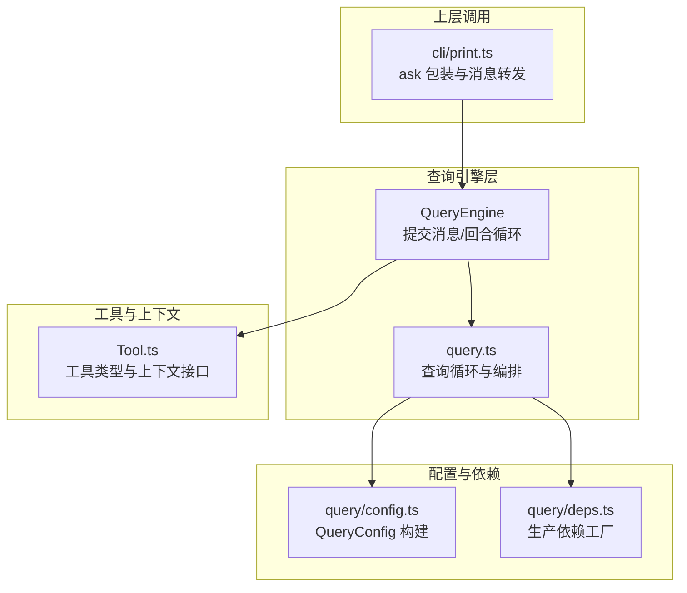
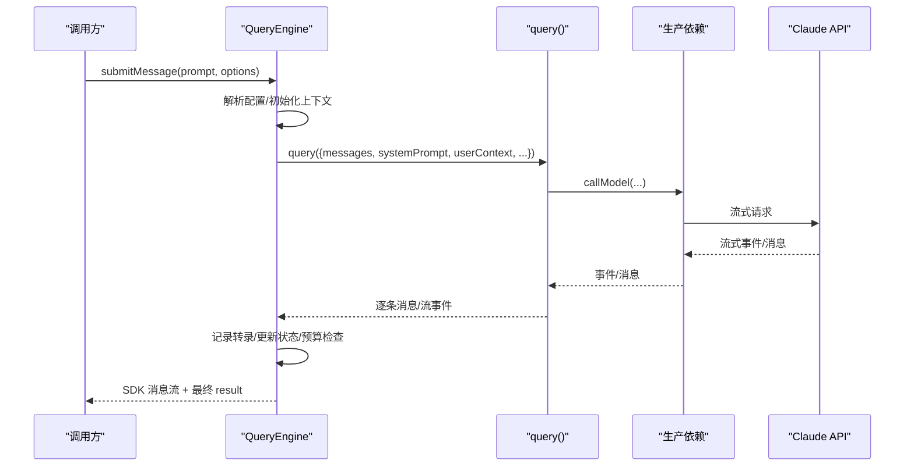

# 查询引擎架构

<cite>
**本文引用的文件**
- [src/QueryEngine.ts](file://src/QueryEngine.ts)
- [src/query.ts](file://src/query.ts)
- [src/query/config.ts](file://src/query/config.ts)
- [src/query/deps.ts](file://src/query/deps.ts)
- [src/Tool.ts](file://src/Tool.ts)
- [src/cli/print.ts](file://src/cli/print.ts)
</cite>

## 目录
1. [简介](#简介)
2. [项目结构](#项目结构)
3. [核心组件](#核心组件)
4. [架构总览](#架构总览)
5. [详细组件分析](#详细组件分析)
6. [依赖关系分析](#依赖关系分析)
7. [性能考量](#性能考量)
8. [故障排查指南](#故障排查指南)
9. [结论](#结论)
10. [附录：使用示例与最佳实践](#附录使用示例与最佳实践)

## 简介
本文件面向 QueryEngine 类的架构文档，系统阐述其核心设计理念、类结构设计、初始化流程、内部状态管理与生命周期控制；详解 QueryEngineConfig 接口的字段语义、作用机制与最佳实践；说明查询引擎如何管理会话状态、消息存储与资源清理；并给出扩展点、自定义配置与性能优化策略。同时提供基于仓库源码路径的示例，帮助读者正确实例化与使用 QueryEngine。

## 项目结构
QueryEngine 位于 src/QueryEngine.ts，是 headless/SDK 路径的核心执行器，负责将 ask() 中抽取的查询循环逻辑封装为可复用的类，并通过 submitMessage() 驱动一次对话回合（turn）。其上层调用者包括 CLI 打印模块（src/cli/print.ts）等。



图示来源
- [src/QueryEngine.ts:1211-1320](file://src/QueryEngine.ts#L1211-L1320)
- [src/query.ts:219-239](file://src/query.ts#L219-L239)
- [src/query/config.ts:29-46](file://src/query/config.ts#L29-L46)
- [src/query/deps.ts:33-40](file://src/query/deps.ts#L33-L40)
- [src/Tool.ts:158-300](file://src/Tool.ts#L158-L300)
- [src/cli/print.ts:2145-2244](file://src/cli/print.ts#L2145-L2244)

章节来源
- [src/QueryEngine.ts:1211-1320](file://src/QueryEngine.ts#L1211-L1320)
- [src/query.ts:219-239](file://src/query.ts#L219-L239)
- [src/query/config.ts:29-46](file://src/query/config.ts#L29-L46)
- [src/query/deps.ts:33-40](file://src/query/deps.ts#L33-L40)
- [src/Tool.ts:158-300](file://src/Tool.ts#L158-L300)
- [src/cli/print.ts:2145-2244](file://src/cli/print.ts#L2145-L2244)

## 核心组件
- QueryEngine：封装单次对话回合的生命周期与状态，负责消息构建、权限包装、系统提示拼接、转录记录、预算与配额检查、流式事件处理、压缩边界处理与最终结果产出。
- QueryEngineConfig：构造函数参数集合，承载工作目录、工具集、命令集、MCP 客户端、代理定义、权限决策回调、应用状态读写、初始消息、文件缓存、系统提示定制、模型选择、思考配置、预算限制、JSON Schema 结构化输出约束、日志与回放选项、SDK 状态回调、中断控制器、孤儿权限处理、历史截断（HISTORY_SNIP）注入等。
- query()：查询主循环，负责消息预处理、自动压缩（微压缩/自动压缩）、模型调用、工具执行、停止钩子、流事件归并、预算与配额检查、错误恢复与重试、最终结果收敛。
- QueryConfig/productionDeps：运行时门禁与 I/O 依赖注入，确保测试与生产环境解耦。

章节来源
- [src/QueryEngine.ts:132-175](file://src/QueryEngine.ts#L132-L175)
- [src/QueryEngine.ts:186-209](file://src/QueryEngine.ts#L186-L209)
- [src/query.ts:181-199](file://src/query.ts#L181-L199)
- [src/query/config.ts:15-27](file://src/query/config.ts#L15-L27)
- [src/query/deps.ts:21-31](file://src/query/deps.ts#L21-L31)

## 架构总览
QueryEngine 将“一次性提问”抽象为可复用的回合式对话引擎，围绕 submitMessage() 展开：解析输入、构建系统提示、装配 ToolUseContext、调用 query() 进行多轮交互、在 SDK 模式下按需回放用户消息、记录转录、产出最终结果或错误诊断。



图示来源
- [src/QueryEngine.ts:211-1181](file://src/QueryEngine.ts#L211-L1181)
- [src/query.ts:219-790](file://src/query.ts#L219-L790)
- [src/query/deps.ts:33-40](file://src/query/deps.ts#L33-L40)

## 详细组件分析

### QueryEngine 类设计与生命周期
- 设计理念
  - 单会话一引擎：每个 QueryEngine 对应一次会话，submitMessage() 启动一个回合，消息、文件缓存、用量等状态在回合间持久。
  - 分离关注点：将 ask() 的核心逻辑抽取到 QueryEngine，query() 专注循环与编排，二者通过清晰的参数契约协作。
- 关键字段与职责
  - config：构造时注入的 QueryEngineConfig，贯穿整个回合。
  - mutableMessages：当前回合累积的消息列表，供 query() 读取与追加。
  - abortController：统一的中断信号，支持外部中断与流式回退清理。
  - permissionDenials：记录权限拒绝事件，用于 SDK 报告。
  - totalUsage：累计用量，随 message_delta 累积。
  - readFileState：文件读取缓存，回合结束时回写。
  - discoveredSkillNames/loadedNestedMemoryPaths：回合内技能发现与嵌套记忆加载去重。
- 生命周期阶段
  - 初始化：构造函数设置初始状态。
  - 提交消息：submitMessage() 解析配置、构建系统提示、装配 ToolUseContext、调用 query()。
  - 流式处理：逐条处理 assistant/user/progress/attachment/system/stream_event 等消息，维护 turnCount、用量、错误水印等。
  - 结果收敛：根据最终消息类型与 stop_reason 判定成功与否，产出 result 或错误诊断。
  - 清理与回写：必要时刷新会话存储，回写文件缓存。

章节来源
- [src/QueryEngine.ts:186-209](file://src/QueryEngine.ts#L186-L209)
- [src/QueryEngine.ts:211-1181](file://src/QueryEngine.ts#L211-L1181)

### QueryEngineConfig 接口详解
- 字段清单与语义
  - cwd：工作目录，影响工具行为与文件访问。
  - tools：可用工具集，决定模型可选工具与权限校验范围。
  - commands：命令集，支持 / 前缀指令与本地命令输出。
  - mcpClients：MCP 服务器连接集合，驱动外部工具生态。
  - agents：代理定义，支持多智能体协同。
  - canUseTool：权限决策回调，包装以追踪拒绝。
  - getAppState/setAppState：应用状态读写，用于权限模式、主题、快照等。
  - initialMessages：初始消息，支持从历史恢复。
  - readFileCache：文件读取缓存，跨回合共享。
  - customSystemPrompt/appendSystemPrompt：自定义与附加系统提示，影响模型行为。
  - userSpecifiedModel/fallbackModel：模型选择与回退策略。
  - thinkingConfig：思考配置（自适应/禁用），影响模型输出风格。
  - maxTurns/maxBudgetUsd/taskBudget：回合数与预算上限，防止无限增长与超支。
  - jsonSchema：结构化输出约束，配合 StructuredOutput 工具。
  - verbose/replayUserMessages/includePartialMessages：调试与回放选项。
  - handleElicitation：MCP URL elicit 触发时的处理器。
  - setSDKStatus：SDK 状态上报。
  - abortController：中断控制器。
  - orphanedPermission：孤儿权限处理。
  - snipReplay：历史截断边界处理（HISTORY_SNIP 特性注入）。
- 作用机制与最佳实践
  - 权限与安全：通过 canUseTool 包装收集 permissionDenials，便于 SDK 报告；结合 AppState 的 ToolPermissionContext 控制工具可用性。
  - 系统提示：优先使用 fetchSystemPromptParts 动态生成默认系统提示，再叠加 customSystemPrompt 与 appendSystemPrompt；当存在内存机制覆盖时注入内存提示。
  - 预算与配额：maxBudgetUsd 与 taskBudget 在 query() 循环中持续检查；USD 超支与结构化输出重试次数超过阈值时提前终止并返回错误 result。
  - 历史截断：HISTORY_SNIP 下，snipReplay 在边界处触发压缩，减少内存占用；SDK 模式下仅保留必要片段，避免 UI 回滚压力。
  - 文件缓存：cloneFileStateCache 传入，回合结束后 setReadFileCache 回写，保证状态一致性。

章节来源
- [src/QueryEngine.ts:132-175](file://src/QueryEngine.ts#L132-L175)
- [src/QueryEngine.ts:246-274](file://src/QueryEngine.ts#L246-L274)
- [src/QueryEngine.ts:295-328](file://src/QueryEngine.ts#L295-L328)
- [src/QueryEngine.ts:537-541](file://src/QueryEngine.ts#L537-L541)
- [src/QueryEngine.ts:996-1027](file://src/QueryEngine.ts#L996-L1027)
- [src/QueryEngine.ts:1030-1073](file://src/QueryEngine.ts#L1030-L1073)

### 内部状态管理与资源清理
- 状态字段
  - mutableMessages：消息累积与回放。
  - permissionDenials：权限拒绝统计。
  - totalUsage：累计用量，随 message_delta 累积。
  - readFileState：文件缓存，回合结束回写。
  - discoveredSkillNames/loadedNestedMemoryPaths：回合内去重与发现跟踪。
- 资源清理
  - 中断：interrupt() 统一触发 abortController.abort()。
  - 转录：recordTranscript 在关键节点写入，必要时 flushSessionStorage 强制落盘。
  - 压缩边界：compact_boundary 触发后清空历史片段，释放 GC。
  - 流式回退：onStreamingFallback 时 tombstone 清理无效消息，重建执行器避免残留结果。

章节来源
- [src/QueryEngine.ts:1183-1201](file://src/QueryEngine.ts#L1183-L1201)
- [src/QueryEngine.ts:449-466](file://src/QueryEngine.ts#L449-L466)
- [src/QueryEngine.ts:706-720](file://src/QueryEngine.ts#L706-L720)
- [src/query.ts:708-741](file://src/query.ts#L708-L741)

### 查询循环与消息处理
- query() 主循环
  - 预处理：applyToolResultBudget、snip、microcompact、contextCollapse、autocompact。
  - 模型调用：prependUserContext + 系统提示，流式返回事件与消息。
  - 工具执行：StreamingToolExecutor 支持流式工具执行；失败时回退并清理孤儿消息。
  - 停止钩子：handleStopHooks 产出进度/附件消息，query() 内部已 push 至 messages。
  - 预算与配额：maxBudgetUsd、taskBudget、结构化输出重试限制。
- QueryEngine 消息分派
  - assistant/user/progress/attachment/system/stream_event：分别处理用量累加、转录记录、边界压缩、错误诊断与结果收敛。
  - compact_boundary：触发截断与消息修剪，释放内存。
  - api_error：转换为 api_retry 系统消息，携带重试信息。
  - result：根据 isResultSuccessful 判定成功与否，产出文本结果、用量、权限拒绝、结构化输出等。

章节来源
- [src/query.ts:241-790](file://src/query.ts#L241-L790)
- [src/QueryEngine.ts:679-1181](file://src/QueryEngine.ts#L679-L1181)

### 类关系与依赖
```mermaid
classDiagram
class QueryEngine {
-config : QueryEngineConfig
-mutableMessages : Message[]
-abortController : AbortController
-permissionDenials : SDKPermissionDenial[]
-totalUsage : NonNullableUsage
-readFileState : FileStateCache
+constructor(config)
+submitMessage(prompt, options) AsyncGenerator
+interrupt() void
+getMessages() Message[]
+getReadFileState() FileStateCache
+getSessionId() string
+setModel(model) void
}
class ToolUseContext {
+options
+abortController
+readFileState
+getAppState()
+setAppState()
+handleElicitation()
+updateFileHistoryState()
+updateAttributionState()
+setSDKStatus()
+messages
}
class QueryParams {
+messages
+systemPrompt
+userContext
+systemContext
+canUseTool
+toolUseContext
+fallbackModel
+querySource
+maxTurns
+taskBudget
+deps
}
QueryEngine --> ToolUseContext : "构建/传递"
QueryEngine --> QueryParams : "委托 query()"
ToolUseContext --> "Tools" : "使用"
```

图示来源
- [src/QueryEngine.ts:186-209](file://src/QueryEngine.ts#L186-L209)
- [src/Tool.ts:158-300](file://src/Tool.ts#L158-L300)
- [src/query.ts:181-199](file://src/query.ts#L181-L199)

## 依赖关系分析
- QueryEngine 依赖
  - 工具与上下文：Tool.ts 定义工具与 ToolUseContext，QueryEngine 通过 canUseTool 包装与 AppState 协作。
  - 查询循环：query.ts 提供主循环与编排，QueryEngine 作为回合执行器调用。
  - 配置与依赖：query/config.ts 构建 QueryConfig（运行时门禁），query/deps.ts 提供生产依赖（模型调用、压缩、UUID）。
- 外部集成
  - CLI：cli/print.ts 通过 ask() 包装 QueryEngine，转发消息至桥接层，处理背景任务与建议提示。
  - MCP：MCP 客户端通过 mcpClients 注入，支持 URL elicit 与资源发现。
  - 文件历史：fileHistoryEnabled 时对用户消息做快照，保障长会话可回溯。

章节来源
- [src/QueryEngine.ts:132-175](file://src/QueryEngine.ts#L132-L175)
- [src/query.ts:102-104](file://src/query.ts#L102-L104)
- [src/query/config.ts:29-46](file://src/query/config.ts#L29-L46)
- [src/query/deps.ts:33-40](file://src/query/deps.ts#L33-L40)
- [src/cli/print.ts:2145-2244](file://src/cli/print.ts#L2145-L2244)

## 性能考量
- 内存与历史管理
  - HISTORY_SNIP：在边界处进行压缩，减少长期会话内存占用；SDK 模式下截断历史，避免 UI 回滚压力。
  - compact_boundary：修剪历史片段，释放 GC。
- I/O 与转录
  - recordTranscript 在关键节点写入；--bare 模式下采用 fire-and-forget，避免阻塞；必要时 flushSessionStorage 强制落盘。
- 流式与回退
  - 流式工具执行（StreamingToolExecutor）提升响应性；发生回退时 tombstone 清理无效消息，重建执行器避免残留。
- 预算与配额
  - maxBudgetUsd、taskBudget、结构化输出重试限制，防止无界增长与资源浪费。
- 模型与思考
  - thinkingConfig 自适应/禁用，平衡推理成本与质量；fastModeEnabled 受 QueryConfig.gates 控制。

章节来源
- [src/QueryEngine.ts:917-981](file://src/QueryEngine.ts#L917-L981)
- [src/QueryEngine.ts:449-466](file://src/QueryEngine.ts#L449-L466)
- [src/query.ts:400-410](file://src/query.ts#L400-L410)
- [src/query.ts:659-741](file://src/query.ts#L659-L741)
- [src/query/config.ts:29-46](file://src/query/config.ts#L29-L46)

## 故障排查指南
- 无结果或空白输出
  - 检查 isResultSuccessful 判定条件：assistant 文本内容或 user 的 tool_result；若不满足，QueryEngine 返回 error_during_execution，其中包含诊断前缀与错误水印之后的日志。
- 超预算/超回合
  - maxBudgetUsd 达到时返回 error_max_budget_usd；结构化输出重试超过阈值返回 error_max_structured_output_retries；达到 maxTurns 返回 error_max_turns。
- API 错误与重试
  - api_error 转换为 api_retry 系统消息，携带尝试次数、最大重试与延迟；配合 categorizeRetryableAPIError 分类。
- 流式回退
  - onStreamingFallback 时 tombstone 清理无效消息，重建执行器，避免残留工具结果。
- 转录丢失
  - 确保在关键节点调用 recordTranscript；--bare 模式下注意 fire-and-forget 与 flushSessionStorage 的时机。

章节来源
- [src/QueryEngine.ts:1107-1143](file://src/QueryEngine.ts#L1107-L1143)
- [src/QueryEngine.ts:861-893](file://src/QueryEngine.ts#L861-L893)
- [src/QueryEngine.ts:1030-1073](file://src/QueryEngine.ts#L1030-L1073)
- [src/QueryEngine.ts:965-978](file://src/QueryEngine.ts#L965-L978)
- [src/query.ts:708-741](file://src/query.ts#L708-L741)

## 结论
QueryEngine 将“一次性提问”抽象为回合式对话引擎，通过清晰的配置契约、严格的权限包装、完善的预算与配额控制、以及针对长会话的历史截断与转录策略，实现了在 headless/SDK 场景下的稳定与高性能。其与 query() 的解耦设计使得测试与扩展更为便利，同时保留了与 CLI/桥接层的无缝集成能力。

## 附录：使用示例与最佳实践
- 正确实例化与使用
  - 通过 ask() 包装创建 QueryEngine 并提交消息，示例路径：
    - [src/QueryEngine.ts:1274-1320](file://src/QueryEngine.ts#L1274-L1320)
    - [src/cli/print.ts:2145-2244](file://src/cli/print.ts#L2145-L2244)
- 配置最佳实践
  - 明确 budget 与 turns：maxBudgetUsd、taskBudget、maxTurns 三者组合控制成本与时长。
  - 自定义系统提示：customSystemPrompt 与 appendSystemPrompt 分别用于替换与追加；当启用内存机制覆盖时注入内存提示。
  - 结构化输出：jsonSchema 与 StructuredOutput 工具配合，合理设置 MAX_STRUCTURED_OUTPUT_RETRIES。
  - 历史截断：在长会话场景启用 HISTORY_SNIP，结合 snipReplay 减少内存占用。
  - 权限与孤儿权限：通过 canUseTool 包装收集 permissionDenials；必要时使用 orphanedPermission 处理。
  - 中断与回写：使用 interrupt() 中断；回合结束回写 setReadFileCache，确保状态一致。

章节来源
- [src/QueryEngine.ts:1274-1320](file://src/QueryEngine.ts#L1274-L1320)
- [src/cli/print.ts:2145-2244](file://src/cli/print.ts#L2145-L2244)
- [src/QueryEngine.ts:132-175](file://src/QueryEngine.ts#L132-L175)