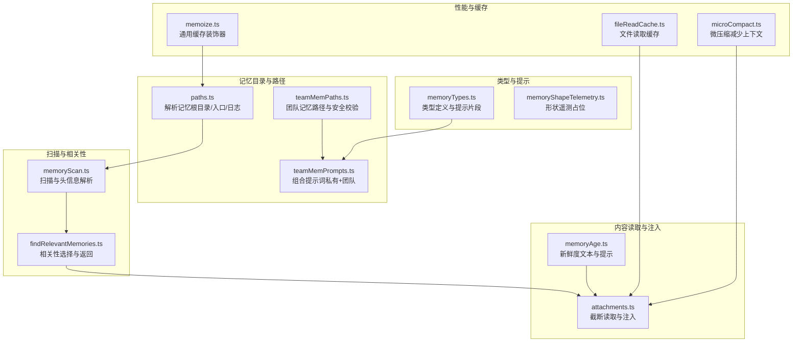
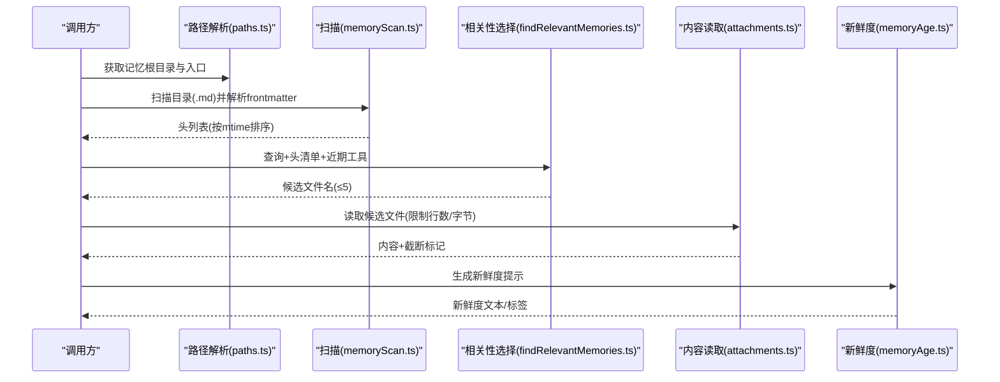
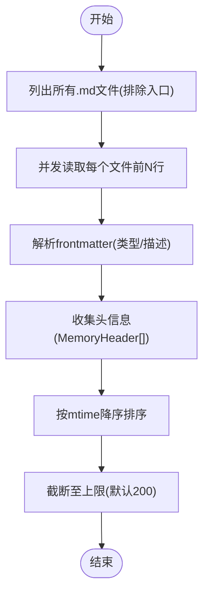
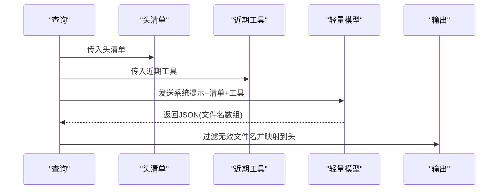
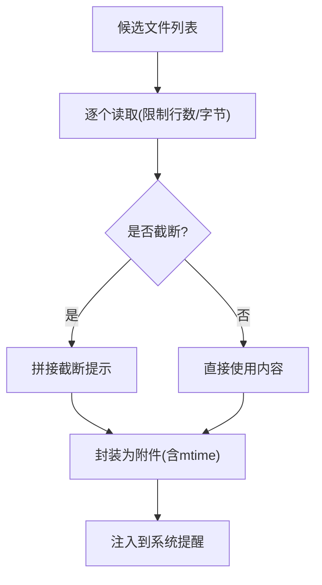
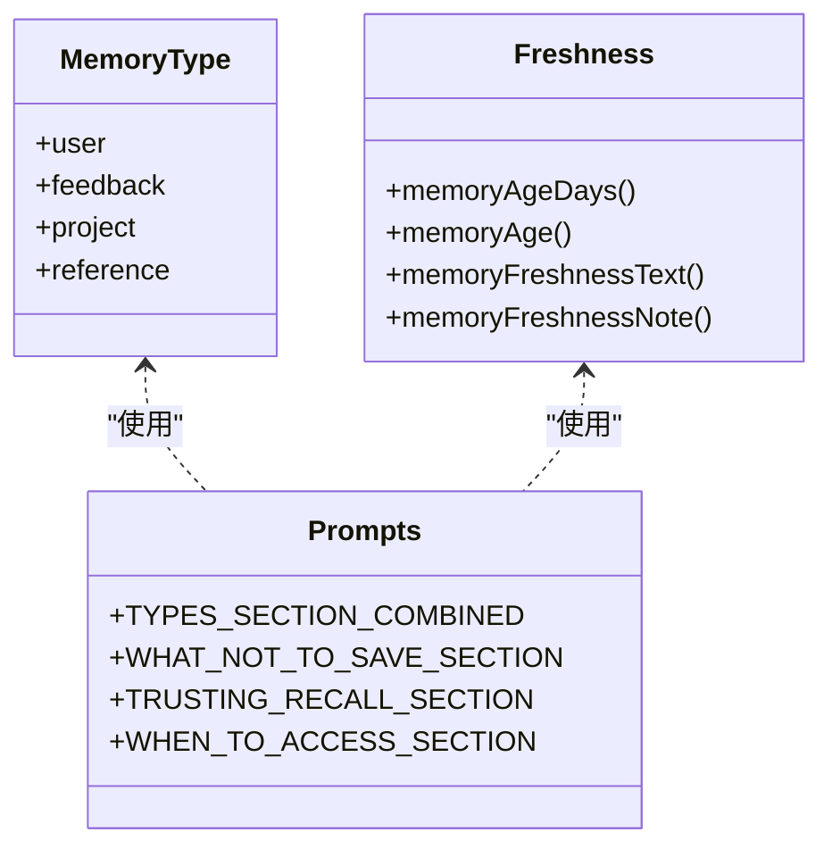
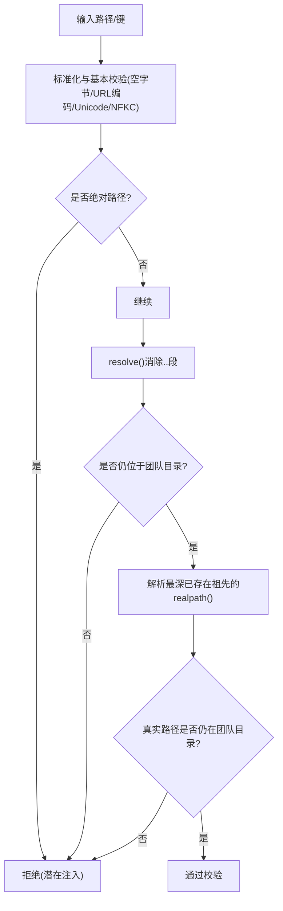
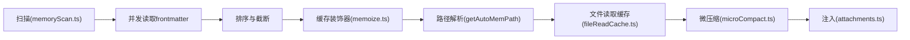
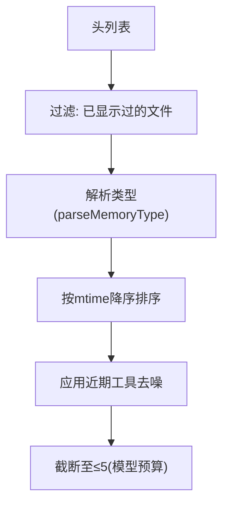
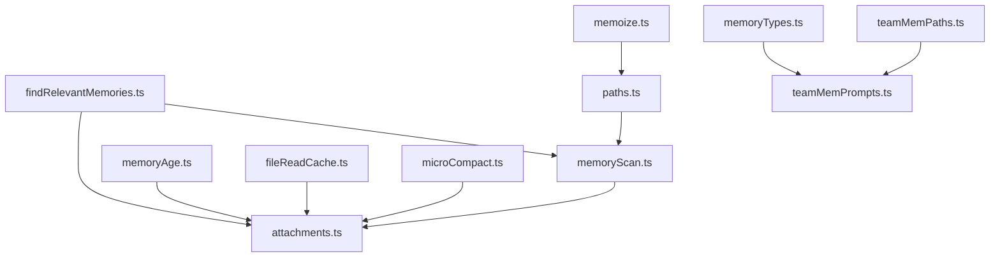

# 记忆系统

<cite>
**本文引用的文件**
- [findRelevantMemories.ts](file://src/memdir/findRelevantMemories.ts)
- [memoryScan.ts](file://src/memdir/memoryScan.ts)
- [memoryTypes.ts](file://src/memdir/memoryTypes.ts)
- [paths.ts](file://src/memdir/paths.ts)
- [teamMemPaths.ts](file://src/memdir/teamMemPaths.ts)
- [teamMemPrompts.ts](file://src/memdir/teamMemPrompts.ts)
- [memoryAge.ts](file://src/memdir/memoryAge.ts)
- [memoryShapeTelemetry.ts](file://src/memdir/memoryShapeTelemetry.ts)
- [attachments.ts](file://src/utils/attachments.ts)
- [memoize.ts](file://src/utils/memoize.ts)
- [fileReadCache.ts](file://src/utils/fileReadCache.ts)
- [microCompact.ts](file://src/services/compact/microCompact.ts)
- [project-memory.mdx](file://docs/context/project-memory.mdx)
</cite>

## 目录
1. [简介](#简介)
2. [项目结构](#项目结构)
3. [核心组件](#核心组件)
4. [架构总览](#架构总览)
5. [详细组件分析](#详细组件分析)
6. [依赖关系分析](#依赖关系分析)
7. [性能考量](#性能考量)
8. [故障排查指南](#故障排查指南)
9. [结论](#结论)
10. [附录](#附录)

## 简介
本文件系统性阐述 Claude Code 记忆系统的实现与使用方式，覆盖以下主题：
- 记忆文件扫描机制：如何在内存目录中高效发现并解析记忆文件头信息
- 相关记忆的查找算法：如何通过轻量级模型选择最相关的记忆
- 团队记忆的管理策略：目录结构、安全校验、提示词构建与同步
- 记忆目录结构、文件格式与索引机制：frontmatter 字段、入口索引、日志模式
- 加载流程、缓存策略与性能优化：并发扫描、结果缓存、内容截断与新鲜度提示
- 分类、过滤与排序算法：类型解析、时间排序、近期工具去噪
- 扩展方法与自定义策略：如何接入自定义存储与检索
- 实际代码示例路径：如何集成与使用记忆功能，以及处理大规模记忆数据

## 项目结构
记忆系统主要由以下模块组成：
- 目录与路径解析：确定记忆根目录、入口文件、日志子目录与团队记忆目录
- 扫描与解析：遍历 .md 文件、提取 frontmatter、按时间排序
- 相关性选择：将清单交给轻量模型进行候选选择
- 内容读取与注入：限制行数与字节数，截断时保留前缀上下文
- 类型与提示：记忆类型分类、提示词模板、新鲜度提示
- 安全与合规：路径校验、符号链接检测、写入验证
- 性能与缓存：通用缓存装饰器、文件读取缓存、微压缩减少上下文

**图表来源**
- [paths.ts:223-235](file://src/memdir/paths.ts#L223-L235)
- [teamMemPaths.ts:84-94](file://src/memdir/teamMemPaths.ts#L84-L94)
- [teamMemPrompts.ts:22-101](file://src/memdir/teamMemPrompts.ts#L22-L101)
- [memoryScan.ts:35-77](file://src/memdir/memoryScan.ts#L35-L77)
- [findRelevantMemories.ts:39-75](file://src/memdir/findRelevantMemories.ts#L39-L75)
- [attachments.ts:2280-2306](file://src/utils/attachments.ts#L2280-L2306)
- [memoryTypes.ts:14-31](file://src/memdir/memoryTypes.ts#L14-L31)
- [memoryAge.ts:6-20](file://src/memdir/memoryAge.ts#L6-L20)
- [memoize.ts:46-107](file://src/utils/memoize.ts#L46-L107)
- [fileReadCache.ts:46-96](file://src/utils/fileReadCache.ts#L46-L96)
- [microCompact.ts:253-293](file://src/services/compact/microCompact.ts#L253-L293)

**章节来源**
- [project-memory.mdx:9-28](file://docs/context/project-memory.mdx#L9-L28)
- [paths.ts:85-90](file://src/memdir/paths.ts#L85-L90)
- [memoryScan.ts:35-77](file://src/memdir/memoryScan.ts#L35-L77)
- [findRelevantMemories.ts:39-75](file://src/memdir/findRelevantMemories.ts#L39-L75)
- [teamMemPaths.ts:84-94](file://src/memdir/teamMemPaths.ts#L84-L94)
- [teamMemPrompts.ts:22-101](file://src/memdir/teamMemPrompts.ts#L22-L101)
- [memoryTypes.ts:14-31](file://src/memdir/memoryTypes.ts#L14-L31)
- [memoryAge.ts:6-20](file://src/memdir/memoryAge.ts#L6-L20)
- [attachments.ts:2280-2306](file://src/utils/attachments.ts#L2280-L2306)
- [memoize.ts:46-107](file://src/utils/memoize.ts#L46-L107)
- [fileReadCache.ts:46-96](file://src/utils/fileReadCache.ts#L46-L96)
- [microCompact.ts:253-293](file://src/services/compact/microCompact.ts#L253-L293)

## 核心组件
- 记忆扫描与头解析：扫描目录中的 .md 文件，解析 frontmatter，提取类型与描述，并按 mtime 排序
- 相关性选择：将清单交给轻量模型，返回最多 5 个最相关的文件名
- 内容读取与注入：按最大行数与字节限制读取内容，必要时截断并附加提示
- 类型与提示：定义记忆类型、提示词片段与新鲜度提示
- 路径与安全：解析记忆根目录、团队记忆目录；对写入路径进行严格校验
- 缓存与性能：通用缓存装饰器、文件读取缓存、微压缩减少上下文

**章节来源**
- [memoryScan.ts:35-77](file://src/memdir/memoryScan.ts#L35-L77)
- [findRelevantMemories.ts:39-75](file://src/memdir/findRelevantMemories.ts#L39-L75)
- [attachments.ts:2280-2306](file://src/utils/attachments.ts#L2280-L2306)
- [memoryTypes.ts:14-31](file://src/memdir/memoryTypes.ts#L14-L31)
- [paths.ts:223-235](file://src/memdir/paths.ts#L223-L235)
- [teamMemPaths.ts:228-256](file://src/memdir/teamMemPaths.ts#L228-L256)
- [memoize.ts:46-107](file://src/utils/memoize.ts#L46-L107)
- [fileReadCache.ts:46-96](file://src/utils/fileReadCache.ts#L46-L96)
- [microCompact.ts:253-293](file://src/services/compact/microCompact.ts#L253-L293)

## 架构总览
记忆系统采用“文件即数据库”的纯文件架构，无外部依赖。其核心流程如下：
- 路径解析：确定记忆根目录与入口文件位置
- 扫描阶段：并发读取 frontmatter，生成头列表并按时间排序
- 相关性阶段：将清单与查询、近期工具列表一起送入轻量模型，得到候选文件名
- 注入阶段：按限制读取内容并注入到系统提醒中，同时附加新鲜度提示

**图表来源**
- [paths.ts:223-235](file://src/memdir/paths.ts#L223-L235)
- [memoryScan.ts:35-77](file://src/memdir/memoryScan.ts#L35-L77)
- [findRelevantMemories.ts:39-75](file://src/memdir/findRelevantMemories.ts#L39-L75)
- [attachments.ts:2280-2306](file://src/utils/attachments.ts#L2280-L2306)
- [memoryAge.ts:6-20](file://src/memdir/memoryAge.ts#L6-L20)

## 详细组件分析

### 组件A：记忆扫描与头解析
- 扫描范围：递归遍历目录，排除入口文件，限定最大文件数量
- 解析策略：仅读取前若干行以提取 frontmatter，避免全量读取
- 排序规则：按 mtime 降序，截断至上限
- 错误处理：异常时返回空列表，保证健壮性

**图表来源**
- [memoryScan.ts:35-77](file://src/memdir/memoryScan.ts#L35-L77)

**章节来源**
- [memoryScan.ts:35-77](file://src/memdir/memoryScan.ts#L35-L77)

### 组件B：相关记忆选择算法
- 输入：查询语句、头列表、近期工具列表
- 输出：最多 5 个文件名
- 去噪策略：当用户正在使用某工具时，避免选择该工具的参考文档
- 容错机制：失败时返回空列表，不中断主流程

**图表来源**
- [findRelevantMemories.ts:77-141](file://src/memdir/findRelevantMemories.ts#L77-L141)

**章节来源**
- [findRelevantMemories.ts:39-75](file://src/memdir/findRelevantMemories.ts#L39-L75)
- [findRelevantMemories.ts:77-141](file://src/memdir/findRelevantMemories.ts#L77-L141)

### 组件C：内容读取与注入
- 限制策略：最大行数与最大字节数，支持按字节截断
- 截断行为：超过限制时保留前缀内容并追加截断提示
- 注入形式：包裹为系统提醒附件，便于模型识别

**图表来源**
- [attachments.ts:2280-2306](file://src/utils/attachments.ts#L2280-L2306)

**章节来源**
- [attachments.ts:2280-2306](file://src/utils/attachments.ts#L2280-L2306)

### 组件D：类型与提示词
- 类型定义：user、feedback、project、reference 四类
- 提示词片段：类型说明、何时保存、如何使用、结构建议等
- 新鲜度提示：对超过一天的记忆附加提醒文本或标签

**图表来源**
- [memoryTypes.ts:14-31](file://src/memdir/memoryTypes.ts#L14-L31)
- [memoryTypes.ts:37-106](file://src/memdir/memoryTypes.ts#L37-L106)
- [memoryTypes.ts:183-222](file://src/memdir/memoryTypes.ts#L183-L222)
- [memoryAge.ts:6-20](file://src/memdir/memoryAge.ts#L6-L20)

**章节来源**
- [memoryTypes.ts:14-31](file://src/memdir/memoryTypes.ts#L14-L31)
- [memoryTypes.ts:37-106](file://src/memdir/memoryTypes.ts#L37-L106)
- [memoryTypes.ts:183-222](file://src/memdir/memoryTypes.ts#L183-L222)
- [memoryAge.ts:6-20](file://src/memdir/memoryAge.ts#L6-L20)

### 组件E：路径与团队记忆安全
- 私有记忆：基于项目根的稳定路径，支持环境变量与设置覆盖
- 团队记忆：作为私有记忆目录的子目录，具备严格的路径校验
- 写入安全：解析相对键、消除 .. 段、解析符号链接、确保真实路径仍在目录内

**图表来源**
- [teamMemPaths.ts:22-64](file://src/memdir/teamMemPaths.ts#L22-L64)
- [teamMemPaths.ts:228-256](file://src/memdir/teamMemPaths.ts#L228-L256)

**章节来源**
- [paths.ts:223-235](file://src/memdir/paths.ts#L223-L235)
- [teamMemPaths.ts:84-94](file://src/memdir/teamMemPaths.ts#L84-L94)
- [teamMemPaths.ts:228-256](file://src/memdir/teamMemPaths.ts#L228-L256)

### 组件F：加载流程、缓存策略与性能优化
- 并发扫描：Promise.allSettled 并发读取，减少 I/O 时间
- 结果缓存：路径解析结果缓存，避免重复计算
- 文件读取缓存：LRU 式缓存，淘汰最旧条目
- 微压缩：基于时间阈值清理工具结果，减少上下文占用
- 形状遥测：可选的召回形状记录（占位）

**图表来源**
- [memoryScan.ts:45-77](file://src/memdir/memoryScan.ts#L45-L77)
- [memoize.ts:46-107](file://src/utils/memoize.ts#L46-L107)
- [fileReadCache.ts:46-96](file://src/utils/fileReadCache.ts#L46-L96)
- [microCompact.ts:253-293](file://src/services/compact/microCompact.ts#L253-L293)
- [attachments.ts:2280-2306](file://src/utils/attachments.ts#L2280-L2306)

**章节来源**
- [memoryScan.ts:45-77](file://src/memdir/memoryScan.ts#L45-L77)
- [memoize.ts:46-107](file://src/utils/memoize.ts#L46-L107)
- [fileReadCache.ts:46-96](file://src/utils/fileReadCache.ts#L46-L96)
- [microCompact.ts:253-293](file://src/services/compact/microCompact.ts#L253-L293)
- [memoryShapeTelemetry.ts:1-8](file://src/memdir/memoryShapeTelemetry.ts#L1-L8)

### 组件G：分类、过滤与排序算法
- 分类：根据 frontmatter.type 解析为内部类型枚举
- 过滤：排除已显示过的文件，避免重复
- 排序：按 mtime 降序，优先新近文件
- 去噪：近期工具列表用于过滤参考文档类记忆

**图表来源**
- [findRelevantMemories.ts:46-75](file://src/memdir/findRelevantMemories.ts#L46-L75)
- [memoryTypes.ts:28-31](file://src/memdir/memoryTypes.ts#L28-L31)

**章节来源**
- [findRelevantMemories.ts:46-75](file://src/memdir/findRelevantMemories.ts#L46-L75)
- [memoryTypes.ts:28-31](file://src/memdir/memoryTypes.ts#L28-L31)

### 组件H：扩展方法与自定义策略
- 自定义存储：通过环境变量或设置覆盖记忆根目录，实现多工作树共享同一存储
- 自定义检索：替换相关性选择的系统提示或模型，或引入外部检索服务
- 自定义注入：调整截断参数与注入格式，适配不同任务场景

**章节来源**
- [paths.ts:85-90](file://src/memdir/paths.ts#L85-L90)
- [paths.ts:223-235](file://src/memdir/paths.ts#L223-L235)
- [findRelevantMemories.ts:18-24](file://src/memdir/findRelevantMemories.ts#L18-L24)
- [attachments.ts:2280-2306](file://src/utils/attachments.ts#L2280-L2306)

### 组件I：实际代码示例路径（如何集成与使用）
- 获取记忆根目录与入口文件：[getAutoMemPath/getAutoMemEntrypoint:223-235](file://src/memdir/paths.ts#L223-L235)
- 扫描并解析记忆头：[scanMemoryFiles/formatMemoryManifest:35-77](file://src/memdir/memoryScan.ts#L35-L77)
- 选择相关记忆：[findRelevantMemories/selectRelevantMemories:39-75](file://src/memdir/findRelevantMemories.ts#L39-L75)
- 读取并注入内容：[readMemoriesForSurfacing:2280-2306](file://src/utils/attachments.ts#L2280-L2306)
- 团队记忆路径与安全校验：[getTeamMemPath/getTeamMemEntrypoint/validateTeamMemWritePath:84-94](file://src/memdir/teamMemPaths.ts#L84-L94)
- 团队记忆提示词构建：[buildCombinedMemoryPrompt:22-101](file://src/memdir/teamMemPrompts.ts#L22-L101)
- 新鲜度提示：[memoryFreshnessNote:49-53](file://src/memdir/memoryAge.ts#L49-L53)

**章节来源**
- [paths.ts:223-235](file://src/memdir/paths.ts#L223-L235)
- [memoryScan.ts:35-77](file://src/memdir/memoryScan.ts#L35-L77)
- [findRelevantMemories.ts:39-75](file://src/memdir/findRelevantMemories.ts#L39-L75)
- [attachments.ts:2280-2306](file://src/utils/attachments.ts#L2280-L2306)
- [teamMemPaths.ts:84-94](file://src/memdir/teamMemPaths.ts#L84-L94)
- [teamMemPrompts.ts:22-101](file://src/memdir/teamMemPrompts.ts#L22-L101)
- [memoryAge.ts:49-53](file://src/memdir/memoryAge.ts#L49-L53)

## 依赖关系分析
- 组件耦合
  - 扫描依赖文件系统与 frontmatter 解析
  - 相关性选择依赖扫描结果与轻量模型
  - 注入依赖读取限制与新鲜度提示
  - 路径解析与团队记忆安全相互独立但共同决定存储位置
- 外部依赖
  - 轻量模型用于相关性选择（sideQuery）
  - 文件系统 API 用于读取与统计
- 潜在循环依赖
  - 扫描模块与提取模块解耦，避免循环导入

**图表来源**
- [memoryScan.ts:35-77](file://src/memdir/memoryScan.ts#L35-L77)
- [findRelevantMemories.ts:39-75](file://src/memdir/findRelevantMemories.ts#L39-L75)
- [attachments.ts:2280-2306](file://src/utils/attachments.ts#L2280-L2306)
- [paths.ts:223-235](file://src/memdir/paths.ts#L223-L235)
- [teamMemPaths.ts:84-94](file://src/memdir/teamMemPaths.ts#L84-L94)
- [teamMemPrompts.ts:22-101](file://src/memdir/teamMemPrompts.ts#L22-L101)
- [memoryTypes.ts:14-31](file://src/memdir/memoryTypes.ts#L14-L31)
- [memoryAge.ts:6-20](file://src/memdir/memoryAge.ts#L6-L20)
- [memoize.ts:46-107](file://src/utils/memoize.ts#L46-L107)
- [fileReadCache.ts:46-96](file://src/utils/fileReadCache.ts#L46-L96)
- [microCompact.ts:253-293](file://src/services/compact/microCompact.ts#L253-L293)

**章节来源**
- [memoryScan.ts:35-77](file://src/memdir/memoryScan.ts#L35-L77)
- [findRelevantMemories.ts:39-75](file://src/memdir/findRelevantMemories.ts#L39-L75)
- [attachments.ts:2280-2306](file://src/utils/attachments.ts#L2280-L2306)
- [paths.ts:223-235](file://src/memdir/paths.ts#L223-L235)
- [teamMemPaths.ts:84-94](file://src/memdir/teamMemPaths.ts#L84-L94)
- [teamMemPrompts.ts:22-101](file://src/memdir/teamMemPrompts.ts#L22-L101)
- [memoryTypes.ts:14-31](file://src/memdir/memoryTypes.ts#L14-L31)
- [memoryAge.ts:6-20](file://src/memdir/memoryAge.ts#L6-L20)
- [memoize.ts:46-107](file://src/utils/memoize.ts#L46-L107)
- [fileReadCache.ts:46-96](file://src/utils/fileReadCache.ts#L46-L96)
- [microCompact.ts:253-293](file://src/services/compact/microCompact.ts#L253-L293)

## 性能考量
- I/O 优化
  - 单次扫描：先统计再读取，避免二次 stat
  - 并发读取：Promise.allSettled 并行解析 frontmatter
  - 截断读取：限制最大行数与字节数，防止大文件拖慢
- 缓存策略
  - 路径解析缓存：避免重复计算
  - 文件读取缓存：LRU 淘汰，降低磁盘访问
- 上下文控制
  - 微压缩：基于时间阈值清理工具结果，减少 token 使用
- 复杂度分析
  - 扫描复杂度：O(N) 遍历 + O(N log N) 排序，N 为 .md 文件数
  - 相关性选择：O(N) 清单 + 轻量模型一次推理
  - 注入复杂度：O(K) 读取 K 个候选文件

[本节为通用性能讨论，无需具体文件分析]

## 故障排查指南
- 扫描失败
  - 现象：返回空列表
  - 排查：检查目录权限、信号中断、文件编码
  - 参考：[memoryScan.ts:74-76](file://src/memdir/memoryScan.ts#L74-L76)
- 相关性选择失败
  - 现象：返回空列表
  - 排查：确认模型可用、系统提示正确、JSON 解析成功
  - 参考：[findRelevantMemories.ts:131-140](file://src/memdir/findRelevantMemories.ts#L131-L140)
- 路径校验失败（团队记忆）
  - 现象：抛出路径穿越错误
  - 排查：检查键中是否包含 ..、\、null 字节、URL 编码遍历
  - 参考：[teamMemPaths.ts:22-64](file://src/memdir/teamMemPaths.ts#L22-L64)
- 内容截断
  - 现象：注入内容被截断
  - 排查：检查最大行数与最大字节限制
  - 参考：[attachments.ts:2280-2306](file://src/utils/attachments.ts#L2280-L2306)
- 新鲜度风险
  - 现象：过旧记忆可能误导
  - 排查：查看新鲜度提示，必要时重新验证
  - 参考：[memoryAge.ts:33-53](file://src/memdir/memoryAge.ts#L33-L53)

**章节来源**
- [memoryScan.ts:74-76](file://src/memdir/memoryScan.ts#L74-L76)
- [findRelevantMemories.ts:131-140](file://src/memdir/findRelevantMemories.ts#L131-L140)
- [teamMemPaths.ts:22-64](file://src/memdir/teamMemPaths.ts#L22-L64)
- [attachments.ts:2280-2306](file://src/utils/attachments.ts#L2280-L2306)
- [memoryAge.ts:33-53](file://src/memdir/memoryAge.ts#L33-L53)

## 结论
本记忆系统以“文件即数据库”为核心理念，结合高效的扫描与并发读取、轻量模型的相关性选择、严格的路径安全校验与灵活的注入策略，实现了可扩展、可维护且高性能的记忆能力。通过合理的缓存与微压缩策略，系统能够在大规模记忆数据场景下保持良好的响应与稳定性。

[本节为总结性内容，无需具体文件分析]

## 附录
- 目录与入口
  - 私有记忆根目录与入口文件：[getAutoMemPath/getAutoMemEntrypoint:223-235](file://src/memdir/paths.ts#L223-L235)
  - 日志文件路径（KAIROS 模式）：[getAutoMemDailyLogPath:246-251](file://src/memdir/paths.ts#L246-L251)
  - 团队记忆目录与入口：[getTeamMemPath/getTeamMemEntrypoint:84-94](file://src/memdir/teamMemPaths.ts#L84-L94)
- 类型与提示
  - 类型定义与解析：[MEMORY_TYPES/parseMemoryType:14-31](file://src/memdir/memoryTypes.ts#L14-L31)
  - 提示词片段：[TYPES_SECTION_COMBINED/WHEN_TO_ACCESS_SECTION:37-106](file://src/memdir/memoryTypes.ts#L37-L106)
  - 新鲜度提示：[memoryFreshnessNote:49-53](file://src/memdir/memoryAge.ts#L49-L53)
- 相关性与注入
  - 相关性选择：[findRelevantMemories/selectRelevantMemories:39-75](file://src/memdir/findRelevantMemories.ts#L39-L75)
  - 内容读取与注入：[readMemoriesForSurfacing:2280-2306](file://src/utils/attachments.ts#L2280-L2306)
- 性能与缓存
  - 路径解析缓存：[getAutoMemPath:223-235](file://src/memdir/paths.ts#L223-L235)
  - 通用缓存装饰器：[memoize:46-107](file://src/utils/memoize.ts#L46-L107)
  - 文件读取缓存：[fileReadCache:46-96](file://src/utils/fileReadCache.ts#L46-L96)
  - 微压缩：[microcompactMessages:253-293](file://src/services/compact/microCompact.ts#L253-L293)

**章节来源**
- [paths.ts:223-235](file://src/memdir/paths.ts#L223-L235)
- [paths.ts:246-251](file://src/memdir/paths.ts#L246-L251)
- [teamMemPaths.ts:84-94](file://src/memdir/teamMemPaths.ts#L84-L94)
- [memoryTypes.ts:14-31](file://src/memdir/memoryTypes.ts#L14-L31)
- [memoryTypes.ts:37-106](file://src/memdir/memoryTypes.ts#L37-L106)
- [memoryAge.ts:49-53](file://src/memdir/memoryAge.ts#L49-L53)
- [findRelevantMemories.ts:39-75](file://src/memdir/findRelevantMemories.ts#L39-L75)
- [attachments.ts:2280-2306](file://src/utils/attachments.ts#L2280-L2306)
- [memoize.ts:46-107](file://src/utils/memoize.ts#L46-L107)
- [fileReadCache.ts:46-96](file://src/utils/fileReadCache.ts#L46-L96)
- [microCompact.ts:253-293](file://src/services/compact/microCompact.ts#L253-L293)