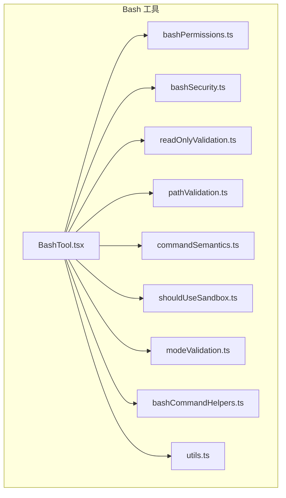
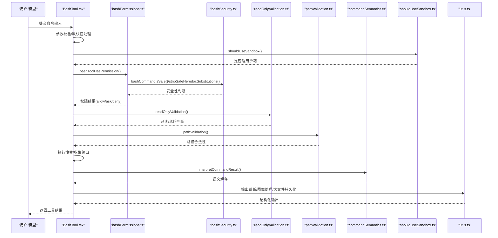
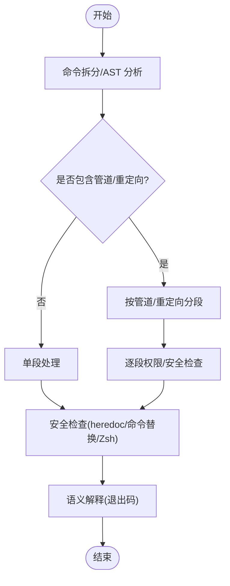
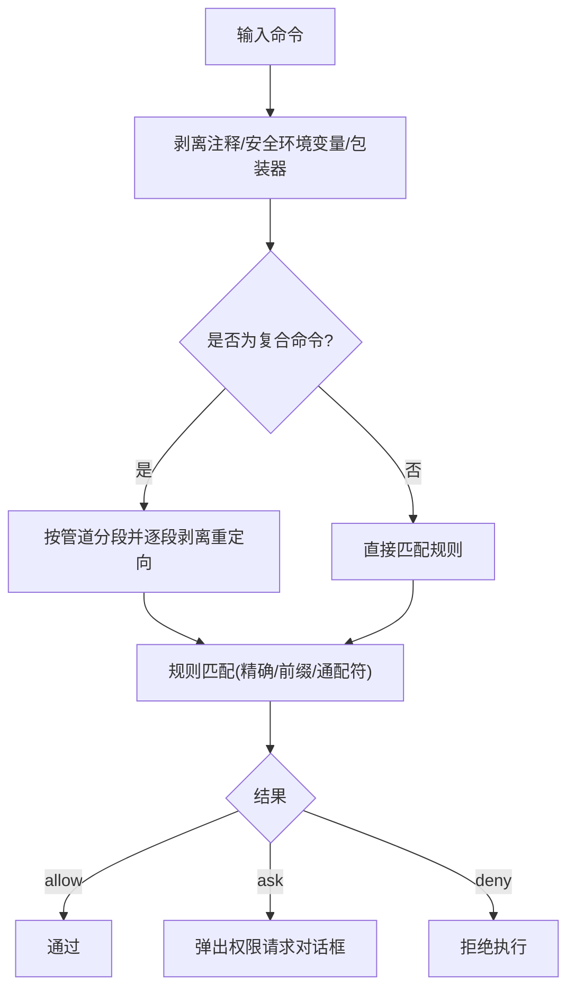
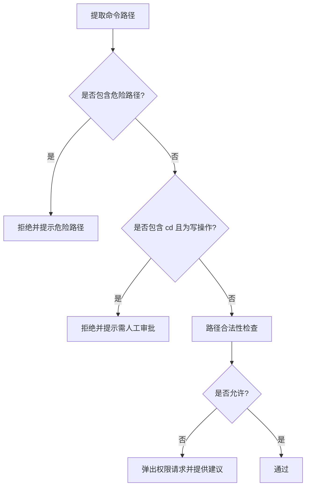
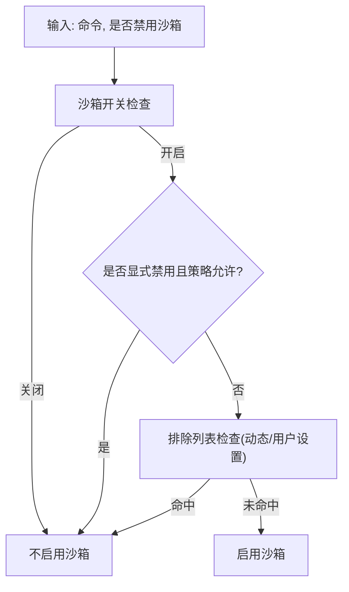
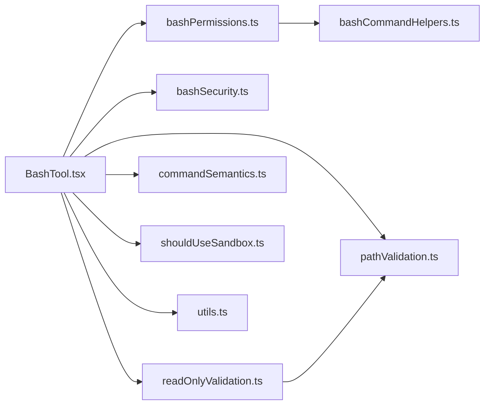

# Bash 工具

<cite>
**本文档引用的文件**
- [BashTool.tsx](file://src/tools/BashTool/BashTool.tsx)
- [utils.ts](file://src/tools/BashTool/utils.ts)
- [bashPermissions.ts](file://src/tools/BashTool/bashPermissions.ts)
- [bashSecurity.ts](file://src/tools/BashTool/bashSecurity.ts)
- [commandSemantics.ts](file://src/tools/BashTool/commandSemantics.ts)
- [pathValidation.ts](file://src/tools/BashTool/pathValidation.ts)
- [readOnlyValidation.ts](file://src/tools/BashTool/readOnlyValidation.ts)
- [shouldUseSandbox.ts](file://src/tools/BashTool/shouldUseSandbox.ts)
- [modeValidation.ts](file://src/tools/BashTool/modeValidation.ts)
- [bashCommandHelpers.ts](file://src/tools/BashTool/bashCommandHelpers.ts)
</cite>

## 目录
1. [简介](#简介)
2. [项目结构](#项目结构)
3. [核心组件](#核心组件)
4. [架构总览](#架构总览)
5. [详细组件分析](#详细组件分析)
6. [依赖关系分析](#依赖关系分析)
7. [性能考虑](#性能考虑)
8. [故障排除指南](#故障排除指南)
9. [结论](#结论)
10. [附录](#附录)

## 简介
本文件为 Bash 工具的详细技术文档，面向需要理解并正确使用 Bash 工具的工程师与高级用户。文档覆盖命令执行机制、安全限制与输出处理，深入解释命令语义分析、路径验证、破坏性命令警告、只读模式验证、沙箱使用决策与权限控制机制，并提供命令解析器工作原理、输出限制与错误处理策略的实际使用示例与故障排除方法。

## 项目结构
Bash 工具位于 `src/tools/BashTool` 目录下，采用模块化设计，围绕“输入校验 → 权限判定 → 命令解析 → 安全检查 → 执行与输出处理”的流水线组织代码。关键模块职责如下：
- BashTool.tsx：工具入口与调用流程，负责参数解析、进度回调、输出格式化与错误映射。
- bashPermissions.ts：权限规则匹配、前缀提取、包装器剥离、分类器集成与建议生成。
- bashSecurity.ts：危险模式检测（命令替换、heredoc 替换、Zsh 特殊命令等）与早期放行逻辑。
- readOnlyValidation.ts：只读命令白名单与标志位安全校验，结合外部共享只读命令配置。
- pathValidation.ts：路径提取、路径合法性校验、危险路径阻断与建议生成。
- commandSemantics.ts：基于命令语义的退出码解释（如 grep/rg 返回 1 视为无匹配而非错误）。
- shouldUseSandbox.ts：沙箱启用决策（动态配置、用户设置、排除列表与包装器剥离）。
- modeValidation.ts：模式驱动的自动放行（如 Accept Edits 模式对文件系统操作的自动允许）。
- bashCommandHelpers.ts：管道/复合命令的分段权限检查、重定向剥离与跨段安全校验。
- utils.ts：输出截断、图像输出处理、CWD 重置与内容摘要生成。

**图表来源**
- [BashTool.tsx](file://src/tools/BashTool/BashTool.tsx)
- [bashPermissions.ts](file://src/tools/BashTool/bashPermissions.ts)
- [bashSecurity.ts](file://src/tools/BashTool/bashSecurity.ts)
- [readOnlyValidation.ts](file://src/tools/BashTool/readOnlyValidation.ts)
- [pathValidation.ts](file://src/tools/BashTool/pathValidation.ts)
- [commandSemantics.ts](file://src/tools/BashTool/commandSemantics.ts)
- [shouldUseSandbox.ts](file://src/tools/BashTool/shouldUseSandbox.ts)
- [modeValidation.ts](file://src/tools/BashTool/modeValidation.ts)
- [bashCommandHelpers.ts](file://src/tools/BashTool/bashCommandHelpers.ts)
- [utils.ts](file://src/tools/BashTool/utils.ts)

**章节来源**
- [BashTool.tsx](file://src/tools/BashTool/BashTool.tsx)
- [utils.ts](file://src/tools/BashTool/utils.ts)

## 核心组件
- 命令解析与语义分析
  - 使用命令拆分与管道分段，结合 AST 分析与树视图分析，识别基础命令、重定向与操作符，支持语义解释（如 grep/rg 的 1 代表“未匹配”）。
- 权限控制与规则匹配
  - 支持精确匹配、前缀匹配与通配符匹配；剥离安全环境变量与包装器后进行规则匹配；提供建议生成以降低维护成本。
- 路径验证与破坏性命令警告
  - 对 rm/rmdir 等危险路径进行严格阻断；对 cd+写操作组合进行阻断；对 sed/jq 等潜在危险命令进行标志位与上下文校验。
- 只读模式验证
  - 在 Accept Edits 模式下对文件系统操作自动放行，减少交互成本。
- 沙箱使用决策
  - 综合动态配置、用户设置与排除列表，结合包装器剥离与候选集闭包，决定是否启用沙箱。
- 输出处理与限制
  - 截断超长输出、图像数据 URI 处理、大文件持久化与预览、错误信息合并与 UI 友好展示。

**章节来源**
- [BashTool.tsx](file://src/tools/BashTool/BashTool.tsx)
- [bashPermissions.ts](file://src/tools/BashTool/bashPermissions.ts)
- [bashSecurity.ts](file://src/tools/BashTool/bashSecurity.ts)
- [readOnlyValidation.ts](file://src/tools/BashTool/readOnlyValidation.ts)
- [pathValidation.ts](file://src/tools/BashTool/pathValidation.ts)
- [commandSemantics.ts](file://src/tools/BashTool/commandSemantics.ts)
- [shouldUseSandbox.ts](file://src/tools/BashTool/shouldUseSandbox.ts)
- [modeValidation.ts](file://src/tools/BashTool/modeValidation.ts)
- [bashCommandHelpers.ts](file://src/tools/BashTool/bashCommandHelpers.ts)
- [utils.ts](file://src/tools/BashTool/utils.ts)

## 架构总览
Bash 工具的执行流程从输入校验开始，经过权限判定与安全检查，最终进入执行阶段并返回结构化结果。以下序列图展示了典型调用链：

**图表来源**
- [BashTool.tsx](file://src/tools/BashTool/BashTool.tsx)
- [bashPermissions.ts](file://src/tools/BashTool/bashPermissions.ts)
- [bashSecurity.ts](file://src/tools/BashTool/bashSecurity.ts)
- [readOnlyValidation.ts](file://src/tools/BashTool/readOnlyValidation.ts)
- [pathValidation.ts](file://src/tools/BashTool/pathValidation.ts)
- [commandSemantics.ts](file://src/tools/BashTool/commandSemantics.ts)
- [shouldUseSandbox.ts](file://src/tools/BashTool/shouldUseSandbox.ts)
- [utils.ts](file://src/tools/BashTool/utils.ts)

## 详细组件分析

### 命令解析器与语义分析
- 解析器能力
  - 支持管道分段、重定向剥离、操作符识别与子命令拆分，确保权限检查与安全校验能逐段处理。
  - 通过 AST 与树视图分析，识别不安全的复合结构（如子壳、命令组），必要时要求人工审批。
- 语义解释
  - 针对 grep/rg/find/diff/test 等命令，根据退出码赋予特定语义，避免误报为错误。
  - 对 sed/jq 等命令，结合标志位与上下文进行更细粒度的安全评估。

**图表来源**
- [bashCommandHelpers.ts](file://src/tools/BashTool/bashCommandHelpers.ts)
- [bashSecurity.ts](file://src/tools/BashTool/bashSecurity.ts)
- [commandSemantics.ts](file://src/tools/BashTool/commandSemantics.ts)

**章节来源**
- [bashCommandHelpers.ts](file://src/tools/BashTool/bashCommandHelpers.ts)
- [commandSemantics.ts](file://src/tools/BashTool/commandSemantics.ts)

### 权限控制与规则匹配
- 规则类型
  - 精确匹配、前缀匹配、通配符匹配；支持从命令中提取稳定前缀或首词作为规则模板。
- 包装器与环境变量剥离
  - 安全剥离 timeout/time/nice/nohup、环境变量赋值与注释，避免绕过规则匹配。
- 分类器与建议
  - 集成分类器行为描述，提供“允许/询问/拒绝”的理由与建议，便于用户快速添加规则。
- 复合命令与跨段检查
  - 对包含 cd+git 或多 cd 的复合命令进行跨段检测，防止裸仓库攻击与路径绕过。

**图表来源**
- [bashPermissions.ts](file://src/tools/BashTool/bashPermissions.ts)
- [bashCommandHelpers.ts](file://src/tools/BashTool/bashCommandHelpers.ts)

**章节来源**
- [bashPermissions.ts](file://src/tools/BashTool/bashPermissions.ts)
- [bashCommandHelpers.ts](file://src/tools/BashTool/bashCommandHelpers.ts)

### 路径验证与破坏性命令警告
- 路径提取与合法性
  - 针对不同命令（cd/ls/find/mkdir/touch/rm/rmdir/mv/cp/cat/head/tail/grep/rg/sed/jq/git 等）实现专用路径提取器，处理 POSIX `--` 结束选项、路径标志与递归场景。
- 危险路径阻断
  - 对 rm/rmdir 检测危险路径（如根目录、系统关键目录），强制人工审批。
- 写操作与 cd 组合阻断
  - 在复合命令中，若包含 cd 且后续为写操作，则要求人工审批，防止路径解析绕过。
- 建议生成
  - 对于读操作，建议添加目录读权限；对于写/创建操作，建议开启接受编辑模式并添加目录。

**图表来源**
- [pathValidation.ts](file://src/tools/BashTool/pathValidation.ts)

**章节来源**
- [pathValidation.ts](file://src/tools/BashTool/pathValidation.ts)

### 只读模式验证
- Accept Edits 模式
  - 在该模式下，针对 mkdir/touch/rm/rmdir/mv/cp/sed 等文件系统命令自动放行，减少交互成本。
- 其他模式
  - bypassPermissions 与 dontAsk 模式由主流程统一处理，此处仅做跳过与回退。

**章节来源**
- [modeValidation.ts](file://src/tools/BashTool/modeValidation.ts)

### 沙箱使用决策
- 决策因素
  - 沙箱全局开关、用户显式禁用沙箱的策略、动态配置的禁用命令/子串、用户设置的沙箱排除列表。
- 候选集闭包
  - 对命令进行迭代剥离（环境变量赋值、包装器），生成候选集合，逐一匹配规则，确保复合命令无法通过首段匹配绕过。
- 排除列表优先级
  - 用户排除列表不构成安全边界，但可作为用户体验优化。

**图表来源**
- [shouldUseSandbox.ts](file://src/tools/BashTool/shouldUseSandbox.ts)

**章节来源**
- [shouldUseSandbox.ts](file://src/tools/BashTool/shouldUseSandbox.ts)

### 输出处理与限制
- 输出截断
  - 超长输出按最大长度截断，并统计剩余行数，提示“已截断若干行”。
- 图像输出处理
  - 识别 data URI 图像输出，进行尺寸与分辨率压缩，避免大体积图像导致 API 拒收或内存溢出。
- 大文件持久化
  - 当输出超过阈值时，复制到工具结果目录并生成预览，UI 层通过预览与大小信息提示。
- 错误处理
  - 合并 stderr 与 stdout，附加中断标记与错误信息；对 git index.lock 等常见问题进行专门标注。

**章节来源**
- [utils.ts](file://src/tools/BashTool/utils.ts)

## 依赖关系分析
- 模块耦合
  - BashTool.tsx 作为中枢，依赖权限、安全、路径、语义、沙箱与输出处理模块；各模块相对独立，通过清晰的接口交互。
- 外部依赖
  - 与 Shell 执行器、任务通道、沙箱管理器、文件系统 API、终端输出限制器等存在集成点。
- 循环依赖
  - 通过导出类型与延迟导入避免循环；工具结果映射与 UI 渲染分离，降低耦合。

**图表来源**
- [BashTool.tsx](file://src/tools/BashTool/BashTool.tsx)
- [bashPermissions.ts](file://src/tools/BashTool/bashPermissions.ts)
- [bashSecurity.ts](file://src/tools/BashTool/bashSecurity.ts)
- [readOnlyValidation.ts](file://src/tools/BashTool/readOnlyValidation.ts)
- [pathValidation.ts](file://src/tools/BashTool/pathValidation.ts)
- [commandSemantics.ts](file://src/tools/BashTool/commandSemantics.ts)
- [shouldUseSandbox.ts](file://src/tools/BashTool/shouldUseSandbox.ts)
- [utils.ts](file://src/tools/BashTool/utils.ts)
- [bashCommandHelpers.ts](file://src/tools/BashTool/bashCommandHelpers.ts)

**章节来源**
- [BashTool.tsx](file://src/tools/BashTool/BashTool.tsx)
- [bashPermissions.ts](file://src/tools/BashTool/bashPermissions.ts)
- [bashSecurity.ts](file://src/tools/BashTool/bashSecurity.ts)
- [readOnlyValidation.ts](file://src/tools/BashTool/readOnlyValidation.ts)
- [pathValidation.ts](file://src/tools/BashTool/pathValidation.ts)
- [commandSemantics.ts](file://src/tools/BashTool/commandSemantics.ts)
- [shouldUseSandbox.ts](file://src/tools/BashTool/shouldUseSandbox.ts)
- [utils.ts](file://src/tools/BashTool/utils.ts)
- [bashCommandHelpers.ts](file://src/tools/BashTool/bashCommandHelpers.ts)

## 性能考虑
- 解析与验证的复杂度
  - 复合命令拆分与 AST 分析在宽管道/重定向场景可能带来开销，应避免极端宽分支命令。
- 输出处理
  - 大文件持久化与图像压缩涉及磁盘 IO 与编码，建议在后台任务中执行并合理设置阈值。
- 并发与前台/后台
  - 长时间阻塞命令在助手模式下会自动后台化，减少主线程阻塞；用户也可手动后台运行。

[本节为通用指导，无需具体文件分析]

## 故障排除指南
- 常见问题与定位
  - 命令被拒绝：查看权限请求消息与建议，确认是否需要添加规则或调整模式。
  - 输出过大：关注“已持久化至工具结果目录”的提示，使用预览与大小信息定位。
  - git index.lock 错误：工具会记录事件，提示锁定文件存在，建议稍后再试。
  - 图像显示异常：确认 data URI 格式与大小，必要时降低分辨率或改用文本输出。
- 调试步骤
  - 开启详细日志与分析事件，核对命令拆分、规则匹配与安全检查路径。
  - 使用 run_in_background 控制前台阻塞，避免长时间占用主线程。

**章节来源**
- [BashTool.tsx](file://src/tools/BashTool/BashTool.tsx)
- [utils.ts](file://src/tools/BashTool/utils.ts)

## 结论
Bash 工具通过“解析-权限-安全-执行-输出”的完整闭环，实现了高安全性与良好用户体验的平衡。其模块化设计便于扩展与维护，同时提供了丰富的安全检查与输出处理能力，适合在受限环境中安全地执行各类 Shell 命令。

[本节为总结，无需具体文件分析]

## 附录

### 实际使用示例
- 基本命令执行
  - 输入：`ls -la`
  - 流程：权限检查（只读）、路径验证（当前目录）、执行、输出截断与 UI 渲染。
- 搜索命令
  - 输入：`grep -r "error" .`
  - 流程：权限检查（只读）、路径提取（递归）、安全检查（正则/标志位）、执行、语义解释（无匹配视为成功）。
- 文件写入命令
  - 输入：`sed -i 's/foo/bar/g' file.txt`
  - 流程：权限检查（写操作）、路径验证（目标文件）、sed 标志位与上下文校验、执行、输出处理。
- 复合命令
  - 输入：`cd project && git status`
  - 流程：管道分段、逐段权限检查、cd+git 跨段检测、路径有效性校验、执行。
- 沙箱绕过
  - 输入：`timeout 300 npm run build`
  - 流程：沙箱决策（包装器剥离候选集闭包匹配）、排除列表检查、是否启用沙箱。

**章节来源**
- [BashTool.tsx](file://src/tools/BashTool/BashTool.tsx)
- [bashCommandHelpers.ts](file://src/tools/BashTool/bashCommandHelpers.ts)
- [shouldUseSandbox.ts](file://src/tools/BashTool/shouldUseSandbox.ts)
- [pathValidation.ts](file://src/tools/BashTool/pathValidation.ts)
- [commandSemantics.ts](file://src/tools/BashTool/commandSemantics.ts)