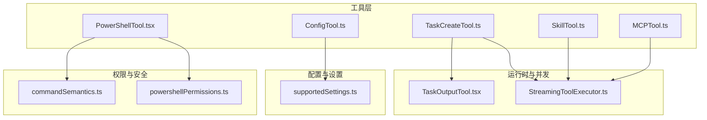
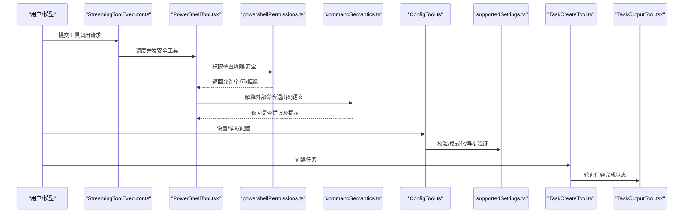
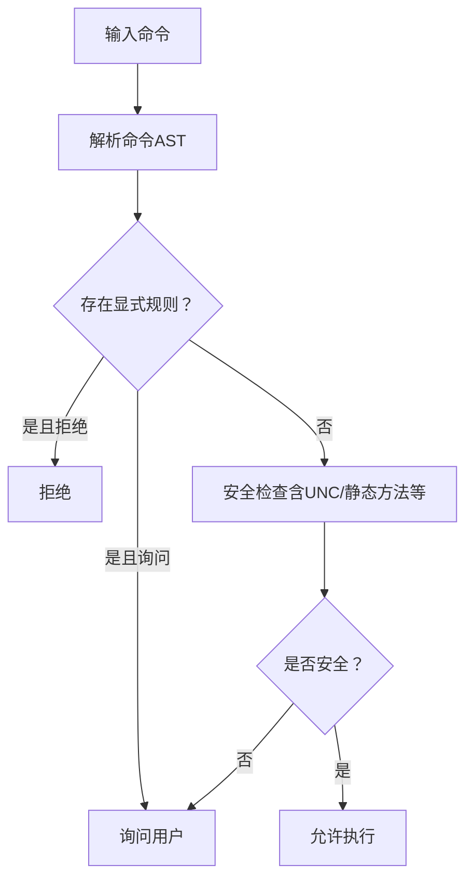
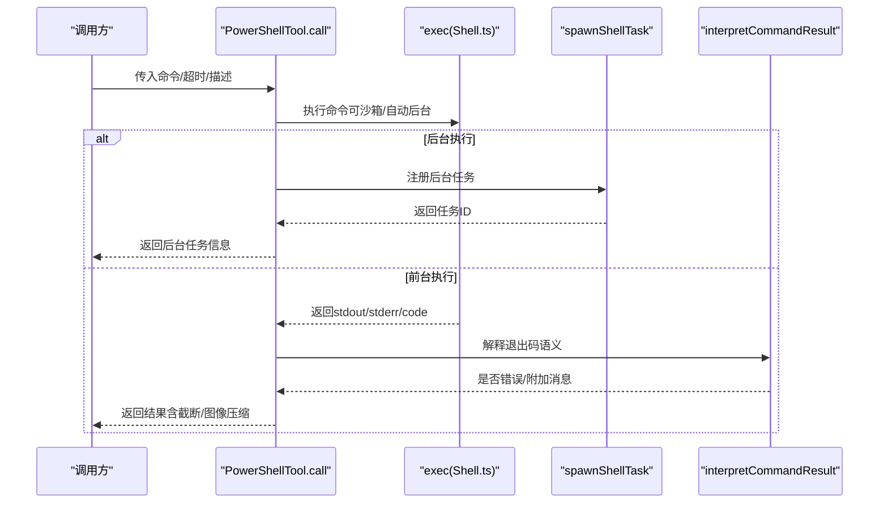
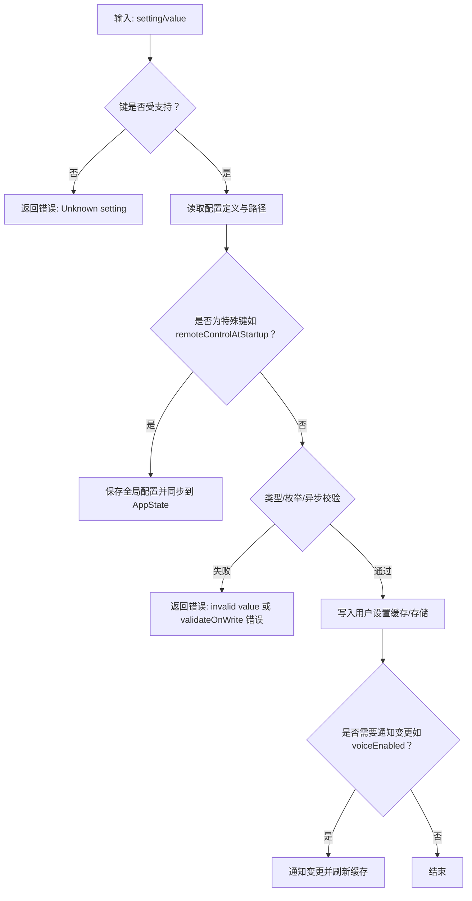
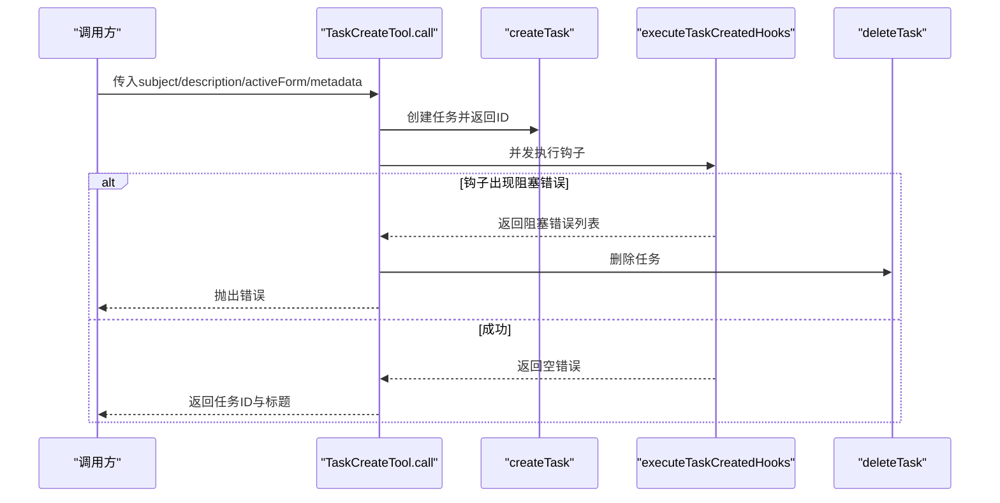
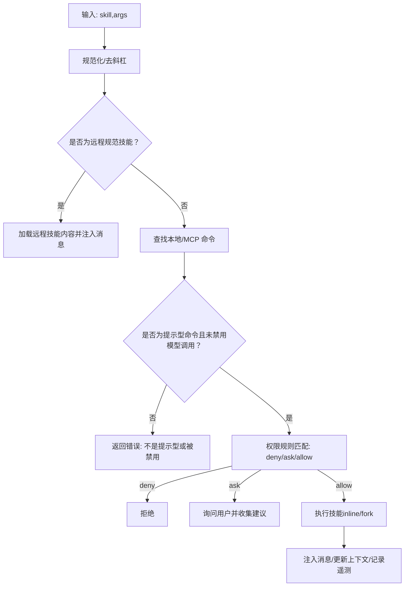
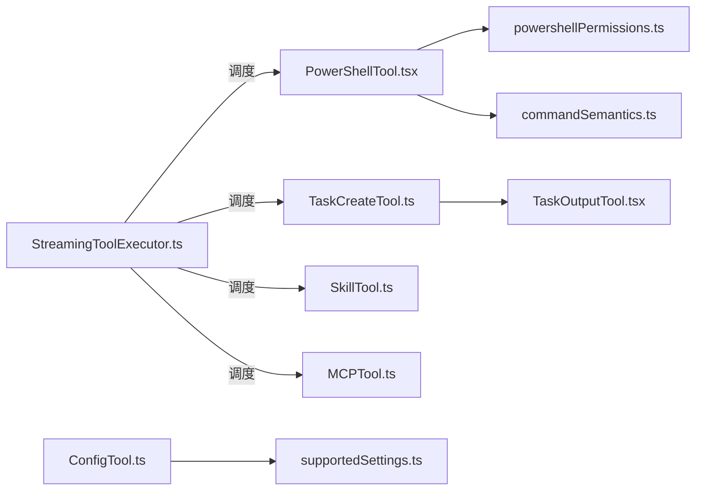

# 其他内置工具

<cite>
**本文引用的文件**
- [PowerShellTool.tsx](file://src/tools/PowerShellTool/PowerShellTool.tsx)
- [powershellPermissions.ts](file://src/tools/PowerShellTool/powershellPermissions.ts)
- [commandSemantics.ts](file://src/tools/PowerShellTool/commandSemantics.ts)
- [prompt.ts](file://src/tools/PowerShellTool/prompt.ts)
- [ConfigTool.ts](file://src/tools/ConfigTool/ConfigTool.ts)
- [supportedSettings.ts](file://src/tools/ConfigTool/supportedSettings.ts)
- [TaskCreateTool.ts](file://src/tools/TaskCreateTool/TaskCreateTool.ts)
- [SkillTool.ts](file://src/tools/SkillTool/SkillTool.ts)
- [MCPTool.ts](file://src/tools/MCPTool/MCPTool.ts)
- [StreamingToolExecutor.ts](file://src/services/tools/StreamingToolExecutor.ts)
- [TaskOutputTool.tsx](file://src/tools/TaskOutputTool/TaskOutputTool.tsx)
</cite>

## 目录
1. [简介](#简介)
2. [项目结构](#项目结构)
3. [核心组件](#核心组件)
4. [架构总览](#架构总览)
5. [详细组件分析](#详细组件分析)
6. [依赖关系分析](#依赖关系分析)
7. [性能考量](#性能考量)
8. [故障排查指南](#故障排查指南)
9. [结论](#结论)

## 简介
本文件面向“其他内置工具”的综合技术文档，围绕以下五个工具展开：PowerShellTool（Windows PowerShell 集成与安全）、ConfigTool（配置管理与同步）、TaskCreateTool（任务创建与依赖）、SkillTool（技能系统与学习）、MCPTool（MCP 协议支持）。内容涵盖功能特性、数据流、处理逻辑、权限与安全控制、并发与队列策略、错误处理与性能优化，并提供使用场景与集成方式说明。

## 项目结构
这些工具均位于 src/tools 下，采用“按工具分目录”的组织方式；同时，部分通用能力由 src/utils 与 src/services 提供支撑（如权限规则、并发执行器、任务输出轮询等）。

图示来源
- [PowerShellTool.tsx:272-662](file://src/tools/PowerShellTool/PowerShellTool.tsx#L272-L662)
- [powershellPermissions.ts:639-780](file://src/tools/PowerShellTool/powershellPermissions.ts#L639-L780)
- [commandSemantics.ts:130-143](file://src/tools/PowerShellTool/commandSemantics.ts#L130-L143)
- [ConfigTool.ts:67-434](file://src/tools/ConfigTool/ConfigTool.ts#L67-L434)
- [supportedSettings.ts:29-212](file://src/tools/ConfigTool/supportedSettings.ts#L29-L212)
- [TaskCreateTool.ts:48-139](file://src/tools/TaskCreateTool/TaskCreateTool.ts#L48-L139)
- [StreamingToolExecutor.ts:123-151](file://src/services/tools/StreamingToolExecutor.ts#L123-L151)
- [TaskOutputTool.tsx:117-138](file://src/tools/TaskOutputTool/TaskOutputTool.tsx#L117-L138)

章节来源
- [PowerShellTool.tsx:272-662](file://src/tools/PowerShellTool/PowerShellTool.tsx#L272-L662)
- [ConfigTool.ts:67-434](file://src/tools/ConfigTool/ConfigTool.ts#L67-L434)
- [TaskCreateTool.ts:48-139](file://src/tools/TaskCreateTool/TaskCreateTool.ts#L48-L139)
- [SkillTool.ts:332-800](file://src/tools/SkillTool/SkillTool.ts#L332-L800)
- [MCPTool.ts:27-78](file://src/tools/MCPTool/MCPTool.ts#L27-L78)

## 核心组件
- PowerShellTool：在 Windows 上通过 PowerShell 执行命令，具备安全检查、只读判定、后台执行、进度上报、结果截断与图像输出压缩等能力。
- ConfigTool：统一读取/设置用户与全局配置项，支持类型校验、可选值限制、异步写入校验、语音模式前置检查、即时同步到 AppState。
- TaskCreateTool：创建任务并触发任务创建钩子，若钩子产生阻塞错误则回滚删除任务，同时自动展开任务视图。
- SkillTool：以“技能”形式调用本地或 MCP 源的提示型命令，支持 fork 子代理执行、权限规则匹配、遥测与消息注入。
- MCPTool：作为 MCP 工具的占位入口，实际名称与行为由运行时动态覆盖，提供统一的权限与 UI 接口。

章节来源
- [PowerShellTool.tsx:272-662](file://src/tools/PowerShellTool/PowerShellTool.tsx#L272-L662)
- [ConfigTool.ts:67-434](file://src/tools/ConfigTool/ConfigTool.ts#L67-L434)
- [TaskCreateTool.ts:48-139](file://src/tools/TaskCreateTool/TaskCreateTool.ts#L48-L139)
- [SkillTool.ts:332-800](file://src/tools/SkillTool/SkillTool.ts#L332-L800)
- [MCPTool.ts:27-78](file://src/tools/MCPTool/MCPTool.ts#L27-L78)

## 架构总览
下图展示工具调用链与关键依赖：

图示来源
- [StreamingToolExecutor.ts:123-151](file://src/services/tools/StreamingToolExecutor.ts#L123-L151)
- [PowerShellTool.tsx:437-658](file://src/tools/PowerShellTool/PowerShellTool.tsx#L437-L658)
- [powershellPermissions.ts:639-780](file://src/tools/PowerShellTool/powershellPermissions.ts#L639-L780)
- [commandSemantics.ts:130-143](file://src/tools/PowerShellTool/commandSemantics.ts#L130-L143)
- [ConfigTool.ts:111-411](file://src/tools/ConfigTool/ConfigTool.ts#L111-L411)
- [supportedSettings.ts:29-212](file://src/tools/ConfigTool/supportedSettings.ts#L29-L212)
- [TaskCreateTool.ts:80-129](file://src/tools/TaskCreateTool/TaskCreateTool.ts#L80-L129)
- [TaskOutputTool.tsx:117-138](file://src/tools/TaskOutputTool/TaskOutputTool.tsx#L117-L138)

## 详细组件分析

### PowerShellTool：Windows PowerShell 集成、命令执行与安全控制
- 功能要点
  - 命令解析与安全检查：基于 AST 的子命令提取、规则匹配（精确/前缀/通配符）、UNC 路径与危险模式检测、模块限定名兼容。
  - 只读判定：同步安全启发式（正则）+ 异步 AST 判定；对搜索/读取类 cmdlet 进行 UI 折叠判断。
  - 后台执行与自动挂起：根据平台与命令特征决定是否自动后台化；Windows 上企业策略可能禁止无沙箱执行。
  - 退出码语义解释：针对 grep/ripgrep/findstr/robocopy 等外部程序提供非零即错的语义修正。
  - 输出处理：大输出落盘与预览、图像输出压缩、提示协议清理、工作目录重置提示拼接。
- 关键流程（权限检查）

图示来源
- [powershellPermissions.ts:639-780](file://src/tools/PowerShellTool/powershellPermissions.ts#L639-L780)
- [PowerShellTool.tsx:352-377](file://src/tools/PowerShellTool/PowerShellTool.tsx#L352-L377)

- 关键流程（命令执行）

图示来源
- [PowerShellTool.tsx:437-658](file://src/tools/PowerShellTool/PowerShellTool.tsx#L437-L658)
- [commandSemantics.ts:130-143](file://src/tools/PowerShellTool/commandSemantics.ts#L130-L143)

- 安全控制与并发
  - 并发安全：只读命令视为并发安全；非只读命令串行执行。
  - Windows 沙箱策略：当企业策略要求沙箱而平台不支持时，直接拒绝执行。
  - 交互与阻塞：禁止交互式命令；对长睡眠进行阻断并建议后台化。

- 配置选项（节选）
  - 命令参数：command（必填）、timeout（毫秒）、description（简述）、run_in_background（后台执行）、dangerouslyDisableSandbox（危险地禁用沙箱）。
  - 输出字段：stdout/stderr/interrupted/returnCodeInterpretation/isImage/persistedOutputPath/persistedOutputSize/backgroundTaskId/backgroundedByUser/assistantAutoBackgrounded。

- 使用场景
  - 在 Windows 上执行 PowerShell 命令、查询系统信息、文件/进程操作、网络探测等。
  - 对需要长时间运行的任务使用后台执行，避免阻塞对话。

- 集成方式
  - 通过工具调用接口提交命令；在助手模式下自动应用阻塞预算与后台策略。

章节来源
- [PowerShellTool.tsx:207-316](file://src/tools/PowerShellTool/PowerShellTool.tsx#L207-L316)
- [PowerShellTool.tsx:352-377](file://src/tools/PowerShellTool/PowerShellTool.tsx#L352-L377)
- [PowerShellTool.tsx:437-658](file://src/tools/PowerShellTool/PowerShellTool.tsx#L437-L658)
- [powershellPermissions.ts:639-780](file://src/tools/PowerShellTool/powershellPermissions.ts#L639-L780)
- [commandSemantics.ts:130-143](file://src/tools/PowerShellTool/commandSemantics.ts#L130-L143)
- [prompt.ts:73-145](file://src/tools/PowerShellTool/prompt.ts#L73-L145)

### ConfigTool：配置管理、设置验证与同步机制
- 功能要点
  - 支持读取/设置：未知键返回错误；读取时可格式化显示；设置时进行类型/枚举/异步校验。
  - 语音模式前置检查：麦克风可用性、依赖工具、登录状态等。
  - 即时同步：部分设置写入后同步到 AppState，确保 UI 立即生效。
  - 特性开关：根据功能门控暴露不同设置项（如远程控制、语音、Kairos 推送等）。
- 关键流程（设置写入）

图示来源
- [ConfigTool.ts:111-411](file://src/tools/ConfigTool/ConfigTool.ts#L111-L411)
- [supportedSettings.ts:29-212](file://src/tools/ConfigTool/supportedSettings.ts#L29-L212)

- 配置选项（节选）
  - theme/editorMode/verbose/preferredNotifChannel/autoCompactEnabled/autoMemoryEnabled/autoDreamEnabled/fileCheckpointingEnabled/showTurnDuration/terminalProgressBarEnabled/todoFeatureEnabled/model/alwaysThinkingEnabled/permissions.defaultMode/language/teammateMode/classifierPermissionsEnabled/voiceEnabled/remoteControlAtStartup/taskCompleteNotifEnabled/inputNeededNotifEnabled/agentPushNotifEnabled 等。

- 使用场景
  - 快速切换主题、模型、权限默认模式、通知渠道等；在语音模式开启前进行环境检查。

- 集成方式
  - 通过工具调用设置键值；内部自动进行格式化与校验，必要时触发 UI 同步。

章节来源
- [ConfigTool.ts:67-434](file://src/tools/ConfigTool/ConfigTool.ts#L67-L434)
- [supportedSettings.ts:29-212](file://src/tools/ConfigTool/supportedSettings.ts#L29-L212)

### TaskCreateTool：任务创建、依赖管理与状态跟踪
- 功能要点
  - 创建任务：填充 subject/description/activeForm/status/metadata 等字段。
  - 钩子执行：创建后执行任务创建钩子，收集阻塞错误并回滚删除任务。
  - 视图联动：自动展开任务视图以便用户查看。
- 关键流程（创建与钩子）

图示来源
- [TaskCreateTool.ts:80-129](file://src/tools/TaskCreateTool/TaskCreateTool.ts#L80-L129)

- 依赖管理
  - 任务间依赖通过 blocks/blockedBy 字段表达；创建时清空初始依赖。
  - 任务状态从 pending 开始，后续由钩子或外部流程推进。

- 状态跟踪
  - 通过轮询任务输出工具等待完成；支持超时与中断信号。

- 使用场景
  - 自动化流程中创建待办任务，确保前置条件满足后再继续。

- 集成方式
  - 通过工具调用创建任务；在助手模式下可结合后台执行与通知。

章节来源
- [TaskCreateTool.ts:48-139](file://src/tools/TaskCreateTool/TaskCreateTool.ts#L48-L139)
- [TaskOutputTool.tsx:117-138](file://src/tools/TaskOutputTool/TaskOutputTool.tsx#L117-L138)

### SkillTool：技能系统集成、技能调用与学习机制
- 功能要点
  - 技能发现：聚合本地与 MCP 技能源，去重合并。
  - 权限控制：基于规则（exact/prefix/wildcard）匹配，支持 deny/ask/allow 与自动建议。
  - 执行模式：内联（inline）与 fork 子代理两种；fork 模式用于隔离与独立 token 预算。
  - 消息注入：将技能生成的消息注入会话，支持进度事件透传。
  - 遥测与追踪：记录调用来源、插件市场、技能来源、深度等指标。
- 关键流程（权限与执行）

图示来源
- [SkillTool.ts:355-431](file://src/tools/SkillTool/SkillTool.ts#L355-L431)
- [SkillTool.ts:433-579](file://src/tools/SkillTool/SkillTool.ts#L433-L579)
- [SkillTool.ts:581-800](file://src/tools/SkillTool/SkillTool.ts#L581-L800)

- 学习机制
  - 记录技能使用频率，用于排序与推荐；支持技能改进流程（通过改进提示与文件编辑）。

- 使用场景
  - 一键执行评审、提交、PDF 处理等常见任务；在复杂流程中以子代理模式隔离执行。

- 集成方式
  - 通过工具调用技能名与参数；内部自动处理消息注入与上下文修改。

章节来源
- [SkillTool.ts:332-800](file://src/tools/SkillTool/SkillTool.ts#L332-L800)

### MCPTool：MCP 协议支持、资源管理与认证
- 功能要点
  - 占位入口：实际名称与行为由运行时覆盖（如 mcpClient.ts），提供统一的权限与 UI 接口。
  - 权限策略：默认 passthrough，具体服务器与工具的权限由运行时决定。
  - 结果处理：统一映射为文本块，支持截断检测。
- 使用场景
  - 通过 MCP 服务器提供资源读取、工具调用与认证；与 SkillTool/Monitor 等工具配合使用。

- 集成方式
  - 在 MCP 客户端初始化时动态注册工具名称与行为；权限与 UI 由客户端接管。

章节来源
- [MCPTool.ts:27-78](file://src/tools/MCPTool/MCPTool.ts#L27-L78)

## 依赖关系分析
- 并发与队列
  - StreamingToolExecutor 维护工具队列，仅在无并发冲突时启动下一个工具；非并发安全工具需串行执行。
- 任务输出轮询
  - TaskOutputTool 提供轮询等待与中断控制，避免忙等与资源浪费。
- 权限与安全
  - PowerShellTool 的权限检查贯穿输入校验与调用阶段，确保在所有调用路径上都得到保护。
- 配置与设置
  - ConfigTool 与 supportedSettings 协作，提供类型/枚举/异步校验与即时同步。

图示来源
- [StreamingToolExecutor.ts:123-151](file://src/services/tools/StreamingToolExecutor.ts#L123-L151)
- [PowerShellTool.tsx:437-658](file://src/tools/PowerShellTool/PowerShellTool.tsx#L437-L658)
- [TaskCreateTool.ts:80-129](file://src/tools/TaskCreateTool/TaskCreateTool.ts#L80-L129)
- [SkillTool.ts:581-800](file://src/tools/SkillTool/SkillTool.ts#L581-L800)
- [MCPTool.ts:27-78](file://src/tools/MCPTool/MCPTool.ts#L27-L78)
- [powershellPermissions.ts:639-780](file://src/tools/PowerShellTool/powershellPermissions.ts#L639-L780)
- [commandSemantics.ts:130-143](file://src/tools/PowerShellTool/commandSemantics.ts#L130-L143)
- [ConfigTool.ts:111-411](file://src/tools/ConfigTool/ConfigTool.ts#L111-L411)
- [supportedSettings.ts:29-212](file://src/tools/ConfigTool/supportedSettings.ts#L29-L212)
- [TaskOutputTool.tsx:117-138](file://src/tools/TaskOutputTool/TaskOutputTool.tsx#L117-L138)

章节来源
- [StreamingToolExecutor.ts:123-151](file://src/services/tools/StreamingToolExecutor.ts#L123-L151)
- [TaskOutputTool.tsx:117-138](file://src/tools/TaskOutputTool/TaskOutputTool.tsx#L117-L138)

## 性能考量
- PowerShellTool
  - 大输出落盘与预览、图像压缩、进度上报与超时控制，避免内存与 I/O 峰值。
  - 自动后台化策略减少阻塞，提升响应性。
- ConfigTool
  - 写入后即时同步到 AppState，降低 UI 刷新延迟。
- TaskCreateTool
  - 钩子并发执行，阻塞错误快速回滚，避免无效任务占用资源。
- SkillTool
  - fork 模式隔离执行，避免主流程阻塞；inline 模式轻量注入消息。
- MCPTool
  - 通过运行时覆盖工具行为，减少不必要的中间层开销。

## 故障排查指南
- PowerShellTool
  - Windows 沙箱策略拒绝：检查企业策略与平台支持情况。
  - 长睡眠阻塞：改为后台执行或使用 Monitor 工具轮询。
  - 退出码误判：确认外部程序语义，必要时调整命令或使用解释器。
- ConfigTool
  - 未知设置键：确认键名与特性开关；参考 supportedSettings。
  - 语音模式不可用：检查麦克风权限、依赖工具与登录状态。
- TaskCreateTool
  - 钩子阻塞：查看阻塞错误列表并修复前置条件。
- SkillTool
  - 权限被拒：检查规则匹配与建议；使用 exact/prefix 规则放宽。
  - 远程技能未发现：先使用 DiscoverSkills 发现并加载。
- MCPTool
  - 权限提示：确认 MCP 服务器授权与工具可用性。

章节来源
- [PowerShellTool.tsx:207-316](file://src/tools/PowerShellTool/PowerShellTool.tsx#L207-L316)
- [PowerShellTool.tsx:352-377](file://src/tools/PowerShellTool/PowerShellTool.tsx#L352-L377)
- [ConfigTool.ts:232-308](file://src/tools/ConfigTool/ConfigTool.ts#L232-L308)
- [TaskCreateTool.ts:92-113](file://src/tools/TaskCreateTool/TaskCreateTool.ts#L92-L113)
- [SkillTool.ts:355-431](file://src/tools/SkillTool/SkillTool.ts#L355-L431)
- [MCPTool.ts:56-61](file://src/tools/MCPTool/MCPTool.ts#L56-L61)

## 结论
上述工具围绕“安全、并发、可观测与易用”构建：PowerShellTool 提供 Windows 平台下的强大命令执行与严格安全控制；ConfigTool 实现配置的统一管理与即时同步；TaskCreateTool 将任务生命周期与钩子机制结合；SkillTool 将技能系统与权限、遥测、fork 执行整合；MCPTool 为 MCP 生态提供统一入口。通过并发执行器与轮询工具，系统在保证安全的前提下提升了响应性与可扩展性。