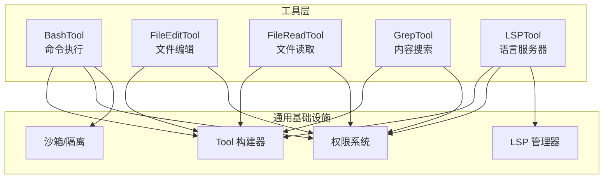
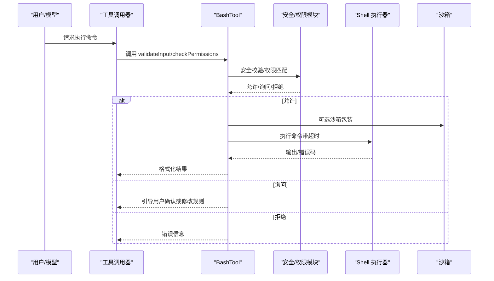
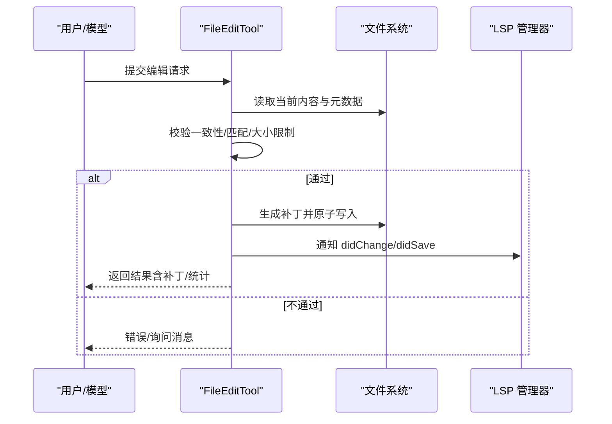
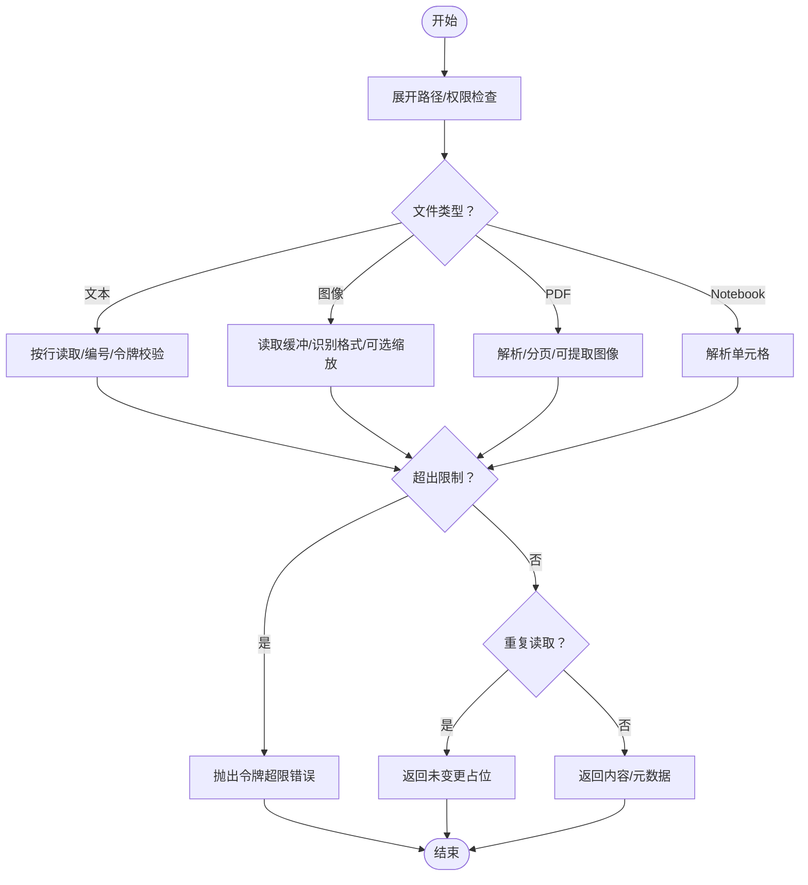
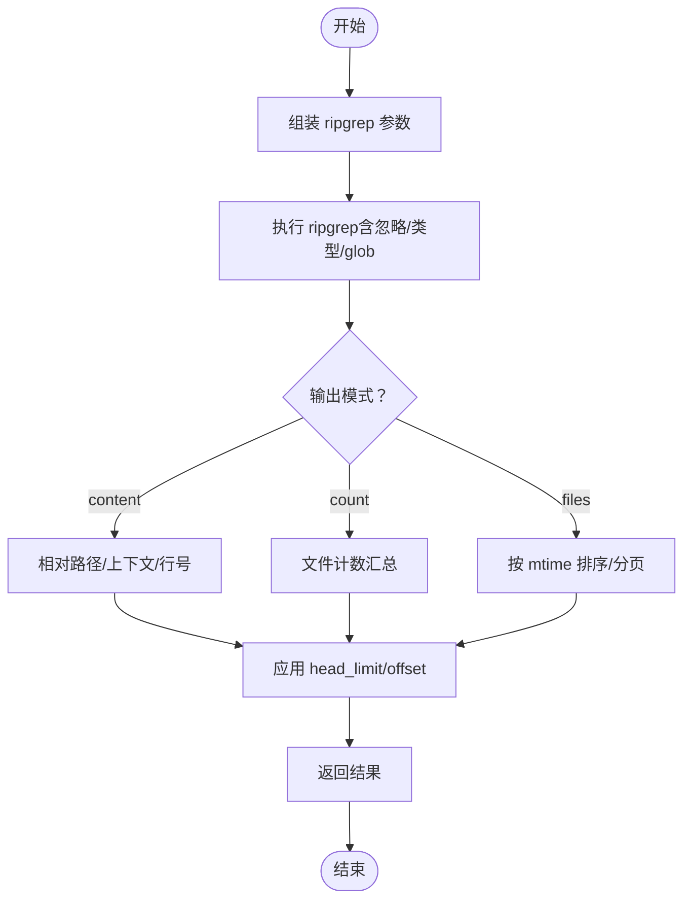
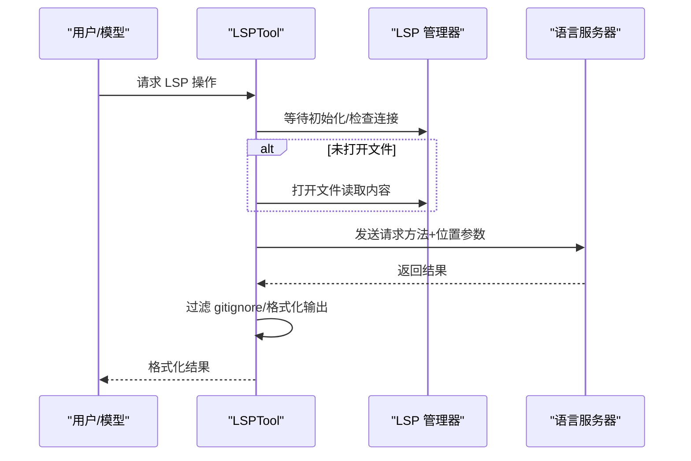
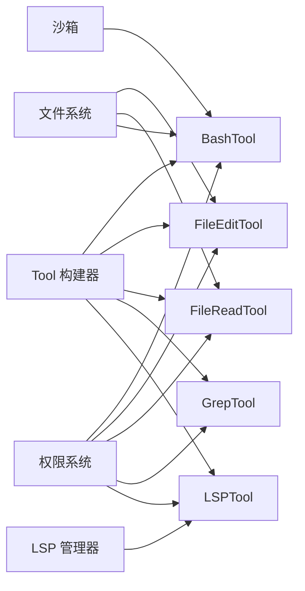

# 内置工具详解

<cite>
**本文档引用的文件**
- [BashTool.tsx](file://src/tools/BashTool/BashTool.tsx)
- [bashSecurity.ts](file://src/tools/BashTool/bashSecurity.ts)
- [bashPermissions.ts](file://src/tools/BashTool/bashPermissions.ts)
- [FileEditTool.ts](file://src/tools/FileEditTool/FileEditTool.ts)
- [FileReadTool.ts](file://src/tools/FileReadTool/FileReadTool.ts)
- [GrepTool.ts](file://src/tools/GrepTool/GrepTool.ts)
- [LSPTool.ts](file://src/tools/LSPTool/LSPTool.ts)
</cite>

## 目录
1. [简介](#简介)
2. [项目结构](#项目结构)
3. [核心组件](#核心组件)
4. [架构总览](#架构总览)
5. [详细组件分析](#详细组件分析)
6. [依赖关系分析](#依赖关系分析)
7. [性能考量](#性能考量)
8. [故障排查指南](#故障排查指南)
9. [结论](#结论)

## 简介
本文件面向 Claude Code 的内置工具系统，聚焦以下工具：BashTool（命令执行）、FileEditTool（文件编辑）、FileReadTool（文件读取）、GrepTool（内容搜索）与 LSPTool（语言服务器）。文档从架构、数据流、处理逻辑、安全限制与错误处理等维度进行深入解析，并提供配置选项、参数校验与最佳实践建议。

## 项目结构
内置工具均遵循统一的工具定义模式：通过通用构建器创建 ToolDef，定义输入/输出模式、权限检查、只读性、并发安全、UI 渲染与调用流程。各工具在自身目录下组织核心实现与辅助模块（如 BashTool 的安全与权限模块）。

图示来源
- [BashTool.tsx:420-800](file://src/tools/BashTool/BashTool.tsx#L420-L800)
- [FileEditTool.ts:86-595](file://src/tools/FileEditTool/FileEditTool.ts#L86-L595)
- [FileReadTool.ts:337-718](file://src/tools/FileReadTool/FileReadTool.ts#L337-L718)
- [GrepTool.ts:160-577](file://src/tools/GrepTool/GrepTool.ts#L160-L577)
- [LSPTool.ts:127-422](file://src/tools/LSPTool/LSPTool.ts#L127-L422)

章节来源
- [BashTool.tsx:420-800](file://src/tools/BashTool/BashTool.tsx#L420-L800)
- [FileEditTool.ts:86-595](file://src/tools/FileEditTool/FileEditTool.ts#L86-L595)
- [FileReadTool.ts:337-718](file://src/tools/FileReadTool/FileReadTool.ts#L337-L718)
- [GrepTool.ts:160-577](file://src/tools/GrepTool/GrepTool.ts#L160-L577)
- [LSPTool.ts:127-422](file://src/tools/LSPTool/LSPTool.ts#L127-L422)

## 核心组件
- BashTool：提供安全的 shell 命令执行，内置多层安全校验、权限匹配、只读约束、沙箱与超时控制、背景任务与进度反馈。
- FileEditTool：在读取一致性校验基础上进行原子写入，支持差异生成、LSP 通知、历史备份与变更统计。
- FileReadTool：支持文本、图片、PDF、Jupyter Notebook 等多种类型读取，具备大小与令牌上限控制、设备路径阻断、重复读取去重与会话记忆新鲜度提示。
- GrepTool：基于 ripgrep 的内容搜索，支持正则、上下文、大小写不敏感、类型过滤、忽略模式、分页与排序。
- LSPTool：封装 LSP 操作（定义、引用、悬停、符号、调用层次），自动打开文件、过滤 gitignore 结果并格式化输出。

章节来源
- [BashTool.tsx:420-800](file://src/tools/BashTool/BashTool.tsx#L420-L800)
- [FileEditTool.ts:86-595](file://src/tools/FileEditTool/FileEditTool.ts#L86-L595)
- [FileReadTool.ts:337-718](file://src/tools/FileReadTool/FileReadTool.ts#L337-L718)
- [GrepTool.ts:160-577](file://src/tools/GrepTool/GrepTool.ts#L160-L577)
- [LSPTool.ts:127-422](file://src/tools/LSPTool/LSPTool.ts#L127-L422)

## 架构总览
工具系统以 ToolDef 为核心契约，统一输入/输出模式、权限与只读语义、并发安全与 UI 表达。BashTool 在执行前进行严格的安全与权限校验；FileEditTool 强制“先读再写”的一致性；FileReadTool 提供多格式读取与去重；GrepTool 使用 ripgrep 并应用忽略规则；LSPTool 通过 LSP 管理器与服务器交互。

图示来源
- [BashTool.tsx:524-723](file://src/tools/BashTool/BashTool.tsx#L524-L723)
- [bashSecurity.ts:585-610](file://src/tools/BashTool/bashSecurity.ts#L585-L610)
- [bashPermissions.ts:778-800](file://src/tools/BashTool/bashPermissions.ts#L778-L800)

## 详细组件分析

### BashTool：命令执行机制、安全限制与输出处理
- 输入/输出模式
  - 输入包含命令字符串、可选超时、描述、后台运行标志与沙箱覆盖标志；输出包含标准输出、标准错误、是否中断、图像标记、背景任务标识、结构化内容与大输出持久化路径等。
- 只读性与并发安全
  - 通过只读约束检测命令是否仅读取/列出操作，从而允许并发安全；并发安全判定依赖 isReadOnly 的返回值。
- 权限与安全
  - 预检：阻断长时间 sleep（助手模式）与被挂起的阻塞命令；对命令片段、不完整命令、危险模式（命令替换、heredoc、git commit 消息注入等）进行早期拦截或要求确认。
  - 权限匹配：支持精确/前缀规则匹配，剥离安全包装（如 timeout、nice、stdbuf、nohup）与安全环境变量，避免绕过；同时提供 deny/ask 规则匹配与建议生成。
  - 沙箱：根据策略决定是否启用沙箱，支持覆盖开关；输出中可标注沙箱违规。
- 执行与输出
  - 支持前台/后台执行，自动背景化长耗时命令；输出过大时落盘并提供预览；支持图像输出压缩与尺寸调整；提供进度回调与中断处理。
- 参数与配置
  - 超时上限受全局配置限制；可设置描述以改善可读性；后台运行需显式开启；沙箱覆盖仅用于调试。

图示来源
- [BashTool.tsx:524-723](file://src/tools/BashTool/BashTool.tsx#L524-L723)
- [bashSecurity.ts:244-286](file://src/tools/BashTool/bashSecurity.ts#L244-L286)
- [bashPermissions.ts:778-800](file://src/tools/BashTool/bashPermissions.ts#L778-L800)

章节来源
- [BashTool.tsx:227-296](file://src/tools/BashTool/BashTool.tsx#L227-L296)
- [BashTool.tsx:420-800](file://src/tools/BashTool/BashTool.tsx#L420-L800)
- [bashSecurity.ts:585-610](file://src/tools/BashTool/bashSecurity.ts#L585-L610)
- [bashPermissions.ts:778-800](file://src/tools/BashTool/bashPermissions.ts#L778-L800)

### FileEditTool：文件编辑、差异与冲突处理
- 功能要点
  - 读取一致性：必须先读取文件，且自上次读取后未被外部修改（或内容一致）才允许写入，防止竞态与覆盖。
  - 编辑策略：支持单次替换与全部替换；自动推断引号风格以保持原文件排版；生成结构化补丁并记录行数变化。
  - LSP 集成：写入后通知 LSP 服务器进行 didChange/didSave，触发诊断刷新。
  - 历史与备份：可记录文件历史快照，支持撤销与回滚。
  - 设置文件保护：对特定设置文件进行额外输入校验，避免引入敏感内容。
- 输出与 UI
  - 返回包含文件路径、旧/新字符串、原始内容、结构化补丁、用户是否修改以及是否全部替换等字段；UI 层据此生成结果消息。
- 参数与限制
  - 文件大小上限约 1GiB；禁止直接编辑 Jupyter Notebook（需使用专用工具）；UNC 路径跳过文件系统操作以避免凭据泄露。

图示来源
- [FileEditTool.ts:387-574](file://src/tools/FileEditTool/FileEditTool.ts#L387-L574)

章节来源
- [FileEditTool.ts:86-595](file://src/tools/FileEditTool/FileEditTool.ts#L86-L595)

### FileReadTool：文件读取、大小限制与格式支持
- 多格式支持
  - 文本：按行编号输出，支持偏移与范围读取；可附带内存文件新鲜度提示。
  - 图像：自动识别并返回 base64 数据与尺寸信息，必要时进行缩放与压缩。
  - PDF：支持页面范围提取与分页输出；可返回页面图像集合。
  - Jupyter Notebook：解析单元格并映射为工具结果。
- 令牌与大小限制
  - 通过估算与 API 计数双重校验输出令牌量，超过阈值抛出异常；默认最大读取大小与令牌上限可配置。
- 安全与去重
  - 设备路径阻断（/dev/zero、/proc/self/fd/0-2 等）；macOS 截图路径兼容（空格与窄空格）；重复读取去重（同范围且未变更时返回占位）。
- 参数与行为
  - 支持 offset/limit 与 pages（PDF）参数；自动发现技能目录并激活条件技能；可选择性渲染 UI 标签。

图示来源
- [FileReadTool.ts:496-718](file://src/tools/FileReadTool/FileReadTool.ts#L496-L718)

章节来源
- [FileReadTool.ts:337-718](file://src/tools/FileReadTool/FileReadTool.ts#L337-L718)

### GrepTool：搜索功能、正则与结果展示
- 搜索能力
  - 正则表达式、大小写不敏感、多行模式、上下文（前后/对称）、行号、类型过滤（如 js/py/rust 等）。
  - 支持 glob 过滤与忽略模式（来自权限配置与插件缓存排除）。
- 排序与分页
  - files_with_matches 模式按最后修改时间降序；content/count 模式支持 head_limit 与 offset 分页。
- 输出格式
  - content：相对路径 + 匹配行；count：文件名与计数；files_with_matches：文件列表与统计摘要。
- 性能与安全
  - 限制单行最大宽度；WSL 场景下由 ripgrep 自身超时控制；对 UNC 路径跳过文件系统检查。

图示来源
- [GrepTool.ts:310-576](file://src/tools/GrepTool/GrepTool.ts#L310-L576)

章节来源
- [GrepTool.ts:160-577](file://src/tools/GrepTool/GrepTool.ts#L160-L577)

### LSPTool：语言服务器集成、代码补全与诊断
- 支持操作
  - goToDefinition、findReferences、hover、documentSymbol、workspaceSymbol、goToImplementation、prepareCallHierarchy、incomingCalls、outgoingCalls。
- 文件与大小限制
  - 若文件未在 LSP 中打开，会尝试读取并 open；对大于 10MB 的文件给出明确提示。
- 结果处理
  - 统一格式化输出；对位置型结果过滤 gitignore；对调用层次采用两步流程（先 prepare 再请求）。
- 连接与可用性
  - 延迟等待初始化完成；无服务器可用时返回友好提示；错误统一记录日志。

图示来源
- [LSPTool.ts:224-414](file://src/tools/LSPTool/LSPTool.ts#L224-L414)

章节来源
- [LSPTool.ts:127-422](file://src/tools/LSPTool/LSPTool.ts#L127-L422)

## 依赖关系分析
- 工具共同依赖
  - Tool 构建器：统一输入/输出模式、只读/并发安全、UI 渲染与摘要。
  - 权限系统：统一的规则匹配、建议生成与 deny/ask 行为。
  - 沙箱/隔离：BashTool 的可选沙箱包装与违规标注。
  - LSP 管理器：LSPTool 的服务器交互与状态管理。
- 工具间耦合
  - FileEditTool 与 LSPTool：写入后通知 LSP 刷新诊断。
  - FileReadTool 与技能系统：读取时发现并加载技能目录。
  - GrepTool 与 ripgrep：底层搜索引擎与忽略规则整合。

图示来源
- [BashTool.tsx:420-800](file://src/tools/BashTool/BashTool.tsx#L420-L800)
- [FileEditTool.ts:86-595](file://src/tools/FileEditTool/FileEditTool.ts#L86-L595)
- [FileReadTool.ts:337-718](file://src/tools/FileReadTool/FileReadTool.ts#L337-L718)
- [GrepTool.ts:160-577](file://src/tools/GrepTool/GrepTool.ts#L160-L577)
- [LSPTool.ts:127-422](file://src/tools/LSPTool/LSPTool.ts#L127-L422)

章节来源
- [BashTool.tsx:420-800](file://src/tools/BashTool/BashTool.tsx#L420-L800)
- [FileEditTool.ts:86-595](file://src/tools/FileEditTool/FileEditTool.ts#L86-L595)
- [FileReadTool.ts:337-718](file://src/tools/FileReadTool/FileReadTool.ts#L337-L718)
- [GrepTool.ts:160-577](file://src/tools/GrepTool/GrepTool.ts#L160-L577)
- [LSPTool.ts:127-422](file://src/tools/LSPTool/LSPTool.ts#L127-L422)

## 性能考量
- BashTool
  - 大输出落盘与预览，避免内存溢出；后台任务与超时控制降低阻塞风险。
- FileReadTool
  - 重复读取去重减少网络/磁盘往返；图像缩放与 PDF 分页控制输出体积。
- GrepTool
  - head_limit/offset 与 mtime 排序减少上下文污染；忽略模式与 VCS 排除降低噪声。
- LSPTool
  - 未打开文件时惰性打开并读取；过滤 gitignore 结果避免无关跳转。

## 故障排查指南
- BashTool
  - 常见问题：命令被阻断（sleep/挂起）、权限不足、沙箱违规、超时中断。检查预检与权限建议、沙箱覆盖标志与超时设置。
  - 日志：错误码与事件埋点可用于定位失败原因。
- FileEditTool
  - 常见问题：文件未读取、被外部修改、大小超限、目标为 Notebook。确保先读取、内容未变、文件大小在限制内、使用专用工具编辑 Notebook。
- FileReadTool
  - 常见问题：令牌超限、设备路径阻断、路径不存在。检查读取限制、路径合法性与替代路径建议。
- GrepTool
  - 常见问题：结果过多/慢、忽略规则未生效。调整 head_limit/offset、检查忽略模式与 glob。
- LSPTool
  - 常见问题：无服务器可用、结果为空、gitignore 过滤导致缺失。等待初始化、确认文件类型支持、检查工作区配置。

章节来源
- [BashTool.tsx:524-723](file://src/tools/BashTool/BashTool.tsx#L524-L723)
- [FileEditTool.ts:137-361](file://src/tools/FileEditTool/FileEditTool.ts#L137-L361)
- [FileReadTool.ts:418-650](file://src/tools/FileReadTool/FileReadTool.ts#L418-L650)
- [GrepTool.ts:201-232](file://src/tools/GrepTool/GrepTool.ts#L201-L232)
- [LSPTool.ts:224-414](file://src/tools/LSPTool/LSPTool.ts#L224-L414)

## 结论
内置工具体系通过统一的 ToolDef 契约、严格的权限与安全校验、多样化的输出与 UI 表达，实现了从命令执行、文件读写、内容搜索到语言智能的全链路能力。BashTool 注重安全与可控，FileEditTool 强调一致性与可观测性，FileReadTool 关注多格式与性能，GrepTool 提供高效检索，LSPTool 实现与编辑器生态的深度集成。结合配置选项与最佳实践，可在保证安全的前提下最大化开发效率。