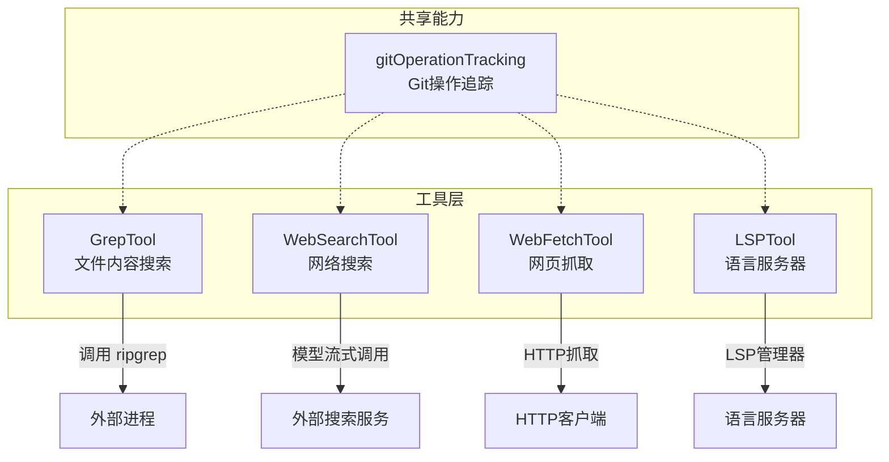
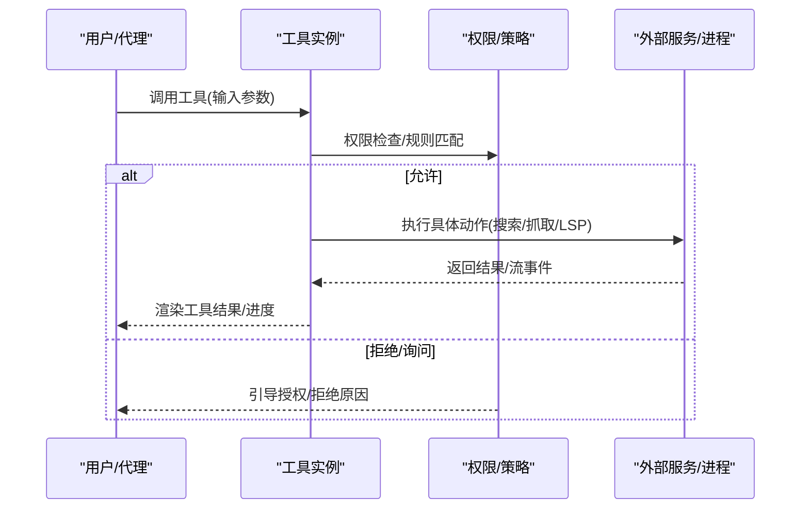
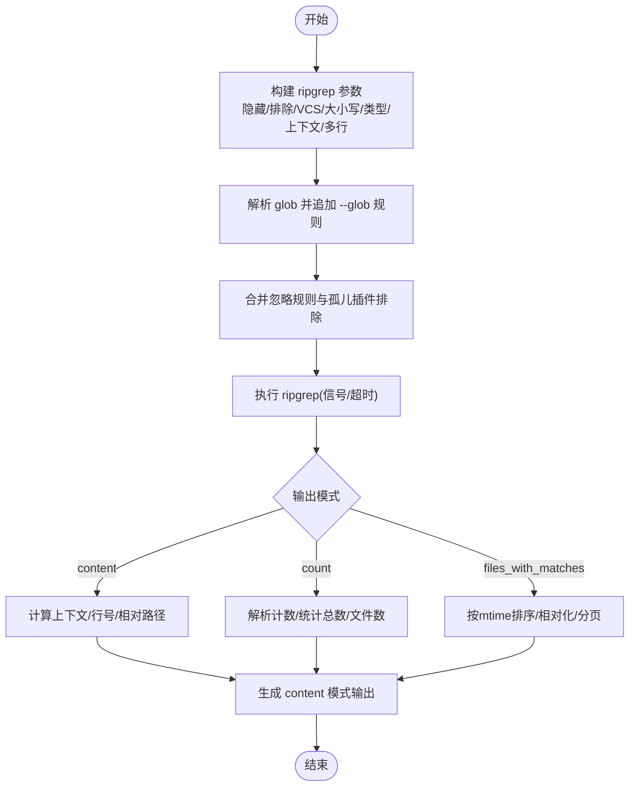
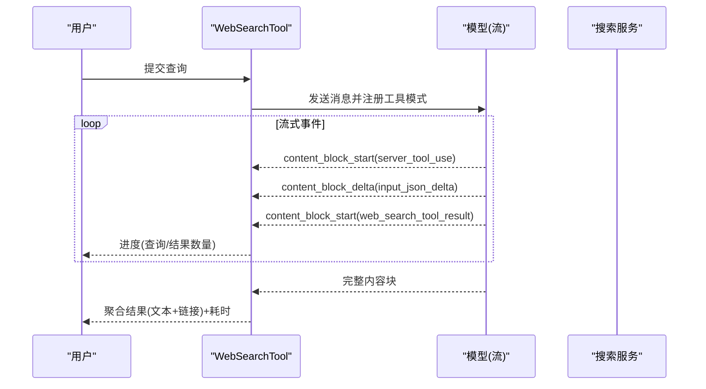
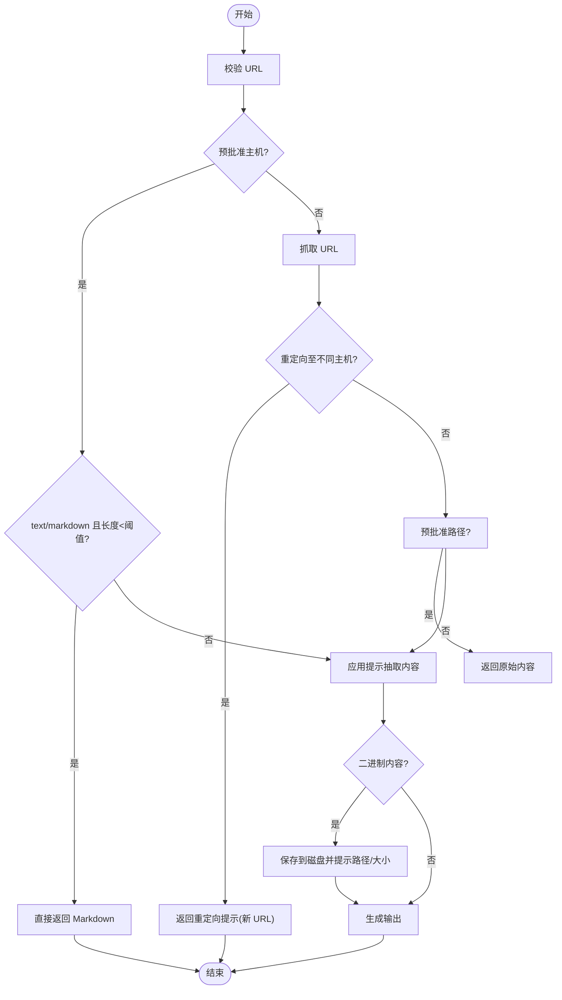
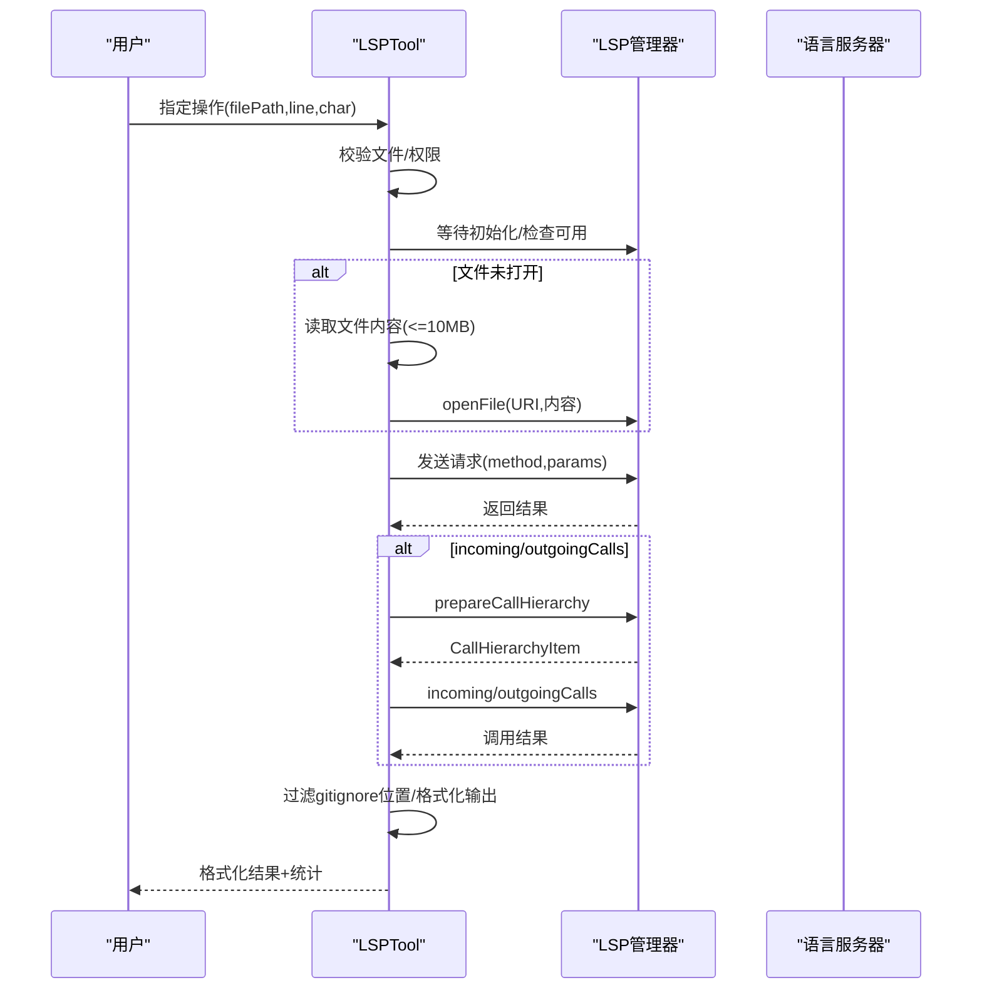
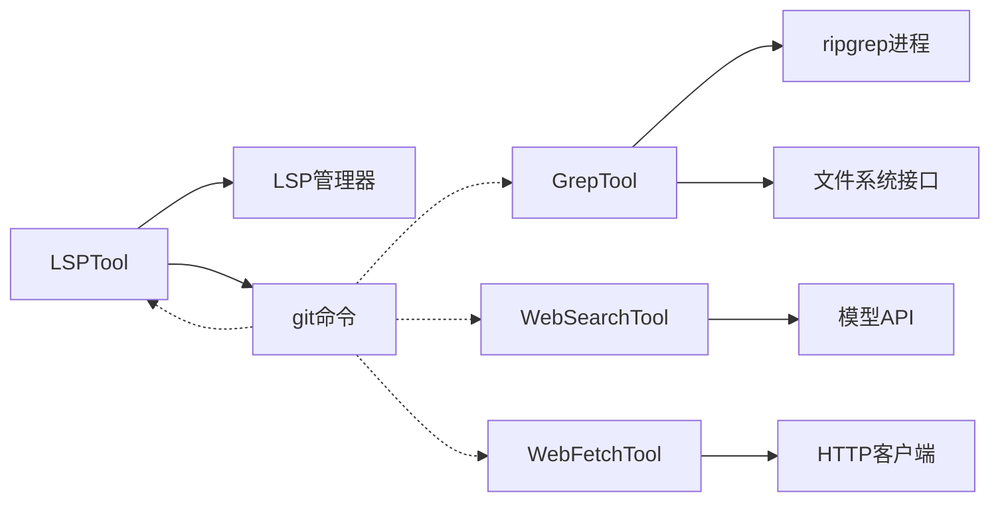

# 搜索工具

<cite>
**本文引用的文件**
- [GrepTool.ts](file://src/tools/GrepTool/GrepTool.ts)
- [WebSearchTool.ts](file://src/tools/WebSearchTool/WebSearchTool.ts)
- [WebFetchTool.ts](file://src/tools/WebFetchTool/WebFetchTool.ts)
- [LSPTool.ts](file://src/tools/LSPTool/LSPTool.ts)
- [gitOperationTracking.ts](file://src/tools/shared/gitOperationTracking.ts)
</cite>

## 目录
1. [简介](#简介)
2. [项目结构](#项目结构)
3. [核心组件](#核心组件)
4. [架构总览](#架构总览)
5. [详细组件分析](#详细组件分析)
6. [依赖关系分析](#依赖关系分析)
7. [性能考量](#性能考量)
8. [故障排查指南](#故障排查指南)
9. [结论](#结论)
10. [附录：使用示例与最佳实践](#附录使用示例与最佳实践)

## 简介
本文件系统性梳理搜索工具系列在代码中的实现与使用方式，覆盖以下能力：
- 文本搜索：GrepTool 基于 ripgrep 的文件内容检索、正则表达式、上下文与计数模式、结果分页与限制。
- 网络搜索：WebSearchTool 通过模型驱动的工具调用执行网络搜索，支持域名白/黑名单、进度回调与结果聚合。
- 网页抓取：WebFetchTool 抓取网页内容并按提示进行抽取或直接返回 Markdown，内置预批准主机与权限控制。
- 语言服务器：LSPTool 集成 LSP 能力，提供跳转定义、引用查找、悬停信息、符号浏览与调用层级等。

同时，文档给出搜索范围配置、过滤规则、性能优化建议，并提供多种实际使用场景与最佳实践。

## 项目结构
搜索工具位于 src/tools 下，每个工具以独立目录组织，包含输入输出模式、UI 渲染、权限校验与调用实现等模块化文件。共享能力如 Git 操作追踪位于 shared 目录中，用于统计与会话关联。

**图表来源**
- [GrepTool.ts](file://src/tools/GrepTool/GrepTool.ts)
- [WebSearchTool.ts](file://src/tools/WebSearchTool/WebSearchTool.ts)
- [WebFetchTool.ts](file://src/tools/WebFetchTool/WebFetchTool.ts)
- [LSPTool.ts](file://src/tools/LSPTool/LSPTool.ts)
- [gitOperationTracking.ts](file://src/tools/shared/gitOperationTracking.ts)

**章节来源**
- [GrepTool.ts](file://src/tools/GrepTool/GrepTool.ts)
- [WebSearchTool.ts](file://src/tools/WebSearchTool/WebSearchTool.ts)
- [WebFetchTool.ts](file://src/tools/WebFetchTool/WebFetchTool.ts)
- [LSPTool.ts](file://src/tools/LSPTool/LSPTool.ts)
- [gitOperationTracking.ts](file://src/tools/shared/gitOperationTracking.ts)

## 核心组件
- GrepTool：基于 ripgrep 的文件内容搜索，支持正则、大小写不敏感、多行模式、上下文行数、类型过滤、glob 排除、忽略模式、默认头限制与偏移分页。
- WebSearchTool：通过模型流式调用触发外部 web_search 工具，支持域名白/黑名单、最大使用次数限制、进度事件与结果拼接。
- WebFetchTool：抓取指定 URL 内容，应用提示进行抽取，支持预批准主机、重定向检测、二进制内容落盘提示。
- LSPTool：封装 LSP 请求（定义、引用、悬停、文档/工作区符号、调用层级），自动打开大文件、过滤 gitignore 结果、格式化输出。

**章节来源**
- [GrepTool.ts](file://src/tools/GrepTool/GrepTool.ts)
- [WebSearchTool.ts](file://src/tools/WebSearchTool/WebSearchTool.ts)
- [WebFetchTool.ts](file://src/tools/WebFetchTool/WebFetchTool.ts)
- [LSPTool.ts](file://src/tools/LSPTool/LSPTool.ts)

## 架构总览
四个工具均遵循统一的工具抽象：输入/输出模式、权限检查、描述与渲染、只读与并发安全声明、调用流程与结果映射。WebSearchTool 与 WebFetchTool 支持延迟执行（shouldDefer）与进度回调；LSPTool 依赖 LSP 管理器并在必要时打开文件。

**图表来源**
- [GrepTool.ts](file://src/tools/GrepTool/GrepTool.ts)
- [WebSearchTool.ts](file://src/tools/WebSearchTool/WebSearchTool.ts)
- [WebFetchTool.ts](file://src/tools/WebFetchTool/WebFetchTool.ts)
- [LSPTool.ts](file://src/tools/LSPTool/LSPTool.ts)

## 详细组件分析

### GrepTool 文本搜索
- 功能要点
  - 正则表达式：支持任意 ripgrep 支持的正则语法，必要时使用 -e 明确模式。
  - 输出模式：content（显示匹配行，可带上下文与行号）、files_with_matches（仅文件名列表）、count（每文件匹配数汇总）。
  - 上下文与行号：-B/-A/-C 或 context 控制前后行数；仅 content 模式下有效。
  - 大小写不敏感：-i 开关。
  - 类型过滤：--type 限定标准文件类型，更高效。
  - 多行模式：-U 与 --multiline-dotall 启用跨行匹配。
  - glob 过滤：支持逗号/花括号组合，拆分为多个 --glob 规则。
  - 忽略与排除：合并工具忽略规则与插件缓存孤儿版本目录排除。
  - 限制与分页：head_limit 默认 250，offset 偏移，0 表示无上限。
  - 安全与路径：UNC 路径跳过 FS 检查；相对路径转绝对路径；相对化输出节省 token。
  - 性能：WSL 文件读取有显著性能惩罚，超时由 ripgrep 自身处理，避免中断主循环。
- 关键流程

**图表来源**
- [GrepTool.ts](file://src/tools/GrepTool/GrepTool.ts)

**章节来源**
- [GrepTool.ts](file://src/tools/GrepTool/GrepTool.ts)

### WebSearchTool 网络搜索
- 功能要点
  - 输入：query、allowed_domains、blocked_domains（二者互斥）。
  - 工具模式：web_search_20250305，最大使用次数 8。
  - 可用性：根据提供商与模型判断是否启用（firstParty/Vertex/Foudry）。
  - 流式响应：监听 server_tool_use 与 web_search_tool_result，动态更新进度（查询更新、结果到达）。
  - 结果聚合：将文本与搜索命中合并为统一输出结构，包含查询、结果数组与耗时。
  - 权限：需要本地设置授权规则。
- 关键流程

**图表来源**
- [WebSearchTool.ts](file://src/tools/WebSearchTool/WebSearchTool.ts)

**章节来源**
- [WebSearchTool.ts](file://src/tools/WebSearchTool/WebSearchTool.ts)

### WebFetchTool 网页抓取
- 功能要点
  - 输入：url、prompt（对抓取内容进行抽取）。
  - 权限：预批准主机直接放行；否则按规则 deny/ask/allow 分支处理。
  - 抓取：获取 Markdown 内容，支持重定向检测（不同主机时提示重新调用）。
  - 预批准路径：当为预批准主机且内容为 text/markdown 且长度小于阈值时，直接返回原文。
  - 其他：二进制内容保存到磁盘并提示路径与大小。
  - 输出：字节数、状态码/文本、处理后结果、耗时、原始 URL。
- 关键流程

**图表来源**
- [WebFetchTool.ts](file://src/tools/WebFetchTool/WebFetchTool.ts)

**章节来源**
- [WebFetchTool.ts](file://src/tools/WebFetchTool/WebFetchTool.ts)

### LSPTool 语言服务器
- 功能要点
  - 操作集合：goToDefinition、findReferences、hover、documentSymbol、workspaceSymbol、goToImplementation、prepareCallHierarchy、incomingCalls、outgoingCalls。
  - 文件约束：校验文件存在且为常规文件；支持 UNC 跳过 FS 检查；大文件（>10MB）拒绝分析。
  - 初始化：等待 LSP 初始化完成；若未初始化则返回提示。
  - 文件打开：若文件未在 LSP 中打开，先读取内容并 open，避免重复 I/O。
  - 结果过滤：对位置类结果（定义/引用/实现/工作区符号）过滤 gitignore 文件。
  - 结果格式化：按操作类型格式化为可读字符串，统计结果数与文件数。
- 关键流程

**图表来源**
- [LSPTool.ts](file://src/tools/LSPTool/LSPTool.ts)

**章节来源**
- [LSPTool.ts](file://src/tools/LSPTool/LSPTool.ts)

## 依赖关系分析
- 组件耦合
  - GrepTool 依赖 ripgrep 外部进程与文件系统接口，内部通过参数拼装与结果解析实现。
  - WebSearchTool 依赖模型流式 API 与工具模式，通过流事件推进进度。
  - WebFetchTool 依赖 HTTP 抓取与内容处理，结合预批准与权限规则。
  - LSPTool 依赖 LSP 管理器与 VSCode LSP 类型，涉及文件打开与 gitignore 过滤。
- 外部依赖
  - ripgrep：文本搜索核心。
  - 模型 API：WebSearchTool 的工具调用与流式响应。
  - LSP 管理器：LSPTool 的请求发送与结果格式化。
  - Git：LSPTool 对 gitignore 的批量过滤。
- 循环依赖
  - 工具间无直接循环依赖；共享模块仅提供统计与会话关联，不反向依赖工具。

**图表来源**
- [GrepTool.ts](file://src/tools/GrepTool/GrepTool.ts)
- [WebSearchTool.ts](file://src/tools/WebSearchTool/WebSearchTool.ts)
- [WebFetchTool.ts](file://src/tools/WebFetchTool/WebFetchTool.ts)
- [LSPTool.ts](file://src/tools/LSPTool/LSPTool.ts)
- [gitOperationTracking.ts](file://src/tools/shared/gitOperationTracking.ts)

**章节来源**
- [GrepTool.ts](file://src/tools/GrepTool/GrepTool.ts)
- [WebSearchTool.ts](file://src/tools/WebSearchTool/WebSearchTool.ts)
- [WebFetchTool.ts](file://src/tools/WebFetchTool/WebFetchTool.ts)
- [LSPTool.ts](file://src/tools/LSPTool/LSPTool.ts)
- [gitOperationTracking.ts](file://src/tools/shared/gitOperationTracking.ts)

## 性能考量
- GrepTool
  - head_limit 默认 250，避免大结果集占用上下文；offset 实现分页。
  - glob 与忽略规则提前加入 ripgrep 参数，减少扫描与 I/O。
  - WSL 文件读取性能差，超时由 ripgrep 处理，避免中断主循环。
- WebSearchTool
  - 使用流式事件逐步反馈进度，降低等待时间感知。
  - 最大使用次数限制防止滥用。
- WebFetchTool
  - 预批准路径直接返回 Markdown，避免额外处理。
  - 二进制内容落盘，避免内存膨胀。
- LSPTool
  - 大文件（>10MB）直接拒绝，避免 LSP 占用过多内存。
  - 批量 git check-ignore 过滤忽略文件，减少无效结果。

[本节为通用性能讨论，无需列出具体文件来源]

## 故障排查指南
- GrepTool
  - 路径不存在：提供相对路径建议；UNC 路径跳过 FS 检查。
  - 结果为空：检查 glob/忽略规则/类型过滤；确认 head_limit 是否截断。
  - 超时：ripgrep 超时会抛出特定错误，提示搜索未完成。
- WebSearchTool
  - 权限未授予：根据提示添加本地设置规则。
  - 域名冲突：allowed_domains 与 blocked_domains 不能同时指定。
  - 模型不可用：根据提供商与模型判断启用条件。
- WebFetchTool
  - 预授权失败：检查规则内容与主机名匹配。
  - 重定向：不同主机时需使用新 URL 重新调用。
  - 认证页面：提示不要对需要认证的 URL 使用该工具。
- LSPTool
  - 服务器未初始化：等待初始化完成或检查连接状态。
  - 文件过大：超过 10MB 直接拒绝分析。
  - 结果为空：确认 LSP 服务器是否支持该文件类型。

**章节来源**
- [GrepTool.ts](file://src/tools/GrepTool/GrepTool.ts)
- [WebSearchTool.ts](file://src/tools/WebSearchTool/WebSearchTool.ts)
- [WebFetchTool.ts](file://src/tools/WebFetchTool/WebFetchTool.ts)
- [LSPTool.ts](file://src/tools/LSPTool/LSPTool.ts)

## 结论
搜索工具系列在统一抽象之上，分别覆盖了本地文件内容检索、网络搜索、网页抓取与语言服务器集成。通过严格的权限控制、合理的默认限制与进度反馈，既保证了易用性也兼顾了安全性与性能。建议在复杂场景中结合多种工具协同使用，并遵循各工具的最佳实践以获得稳定体验。

[本节为总结性内容，无需列出具体文件来源]

## 附录：使用示例与最佳实践
- GrepTool
  - 场景：查找函数定义与调用
    - 使用 type: js/py/rust 等限定类型，提升效率。
    - 使用 -C 3 展示上下文，便于理解调用背景。
    - 使用 head_limit 与 offset 实现分页浏览。
  - 场景：统计出现次数
    - output_mode: count，快速得到总次数与文件数。
  - 场景：正则匹配特殊格式
    - 使用 multiline 启用跨行匹配；注意性能影响。
- WebSearchTool
  - 场景：限定来源站点
    - allowed_domains 仅保留可信域，减少噪声。
  - 场景：避免敏感域
    - blocked_domains 排除内部/私有域。
  - 场景：长链路问答
    - 利用流式进度了解搜索节奏，必要时调整 query。
- WebFetchTool
  - 场景：技术文档抽取
    - 使用 prompt 指令抽取关键段落，避免全文返回。
  - 场景：二进制资料
    - PDF 等二进制内容会落盘，查看提示路径进行后续处理。
  - 场景：认证页面
    - 不要对需要登录的 URL 使用该工具；寻找具备认证能力的 MCP 工具。
- LSPTool
  - 场景：快速定位定义
    - goToDefinition + hover 获取上下文与签名。
  - 场景：分析调用链
    - prepareCallHierarchy -> incomingCalls / outgoingCalls。
  - 场景：全局符号浏览
    - workspaceSymbol + documentSymbol 查看命名空间与结构。
- 搜索范围与过滤
  - glob 与忽略规则优先：在 GrepTool 中通过 --glob 与忽略规则缩小范围。
  - gitignore 过滤：LSPTool 对位置类结果自动过滤。
  - 域名白/黑名单：WebSearchTool 与 WebFetchTool 的权限规则可按主机维度控制。
- 性能优化
  - 优先使用类型过滤与 glob，减少扫描范围。
  - 合理设置 head_limit 与 offset，避免一次性返回大量数据。
  - 对大文件与二进制内容谨慎处理，必要时分批或降采样。

[本节为实践建议，无需列出具体文件来源]