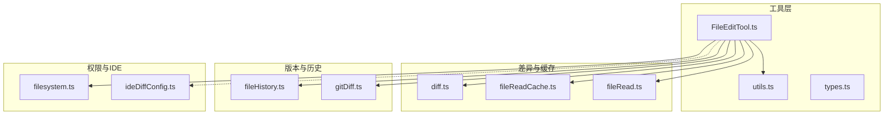
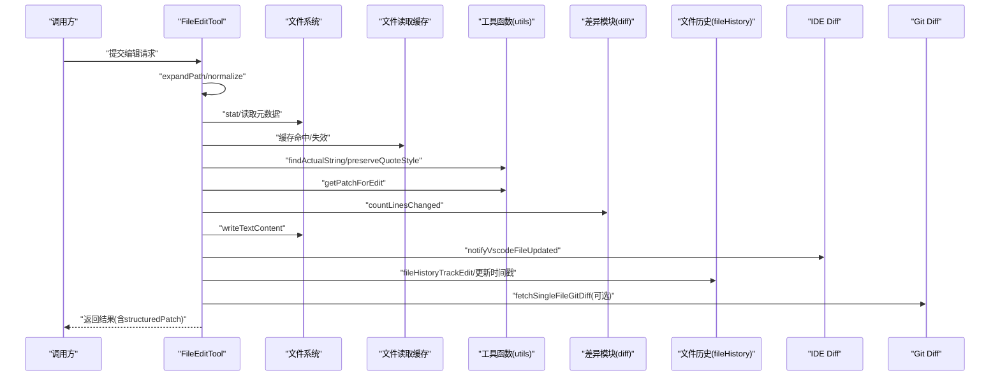
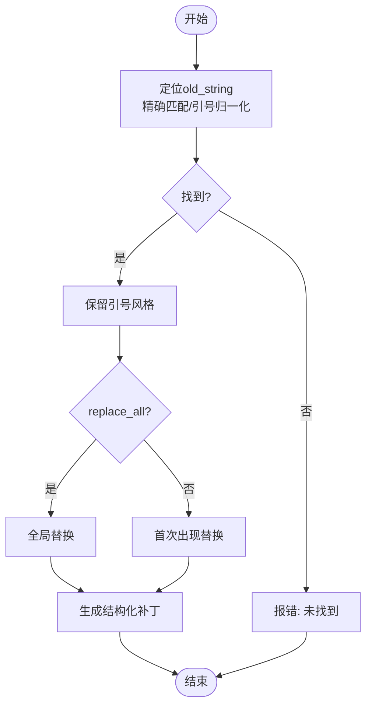
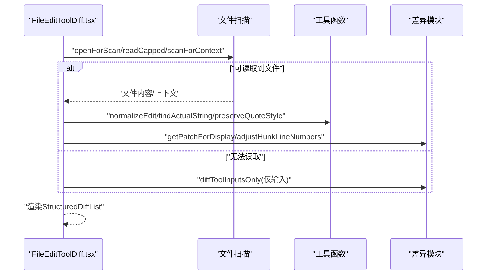
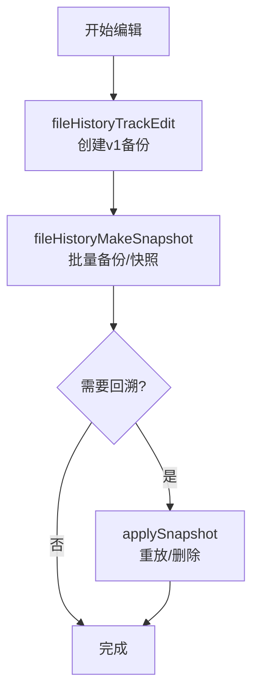
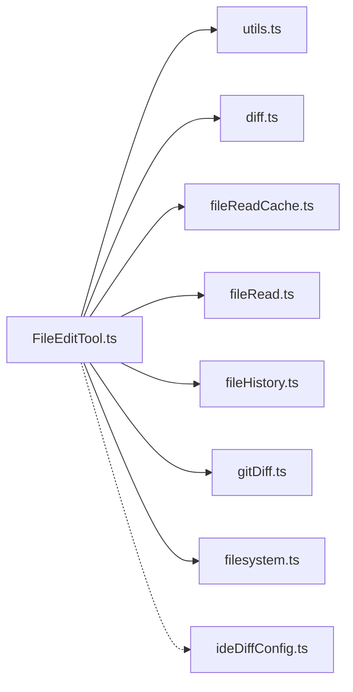

# 文件编辑工具

<cite>
**本文引用的文件**
- [FileEditTool.ts](file://src/tools/FileEditTool/FileEditTool.ts)
- [FileEditToolDiff.tsx](file://src/components/FileEditToolDiff.tsx)
- [fileHistory.ts](file://src/utils/fileHistory.ts)
- [fileReadCache.ts](file://src/utils/fileReadCache.ts)
- [diff.ts](file://src/utils/diff.ts)
- [utils.ts](file://src/tools/FileEditTool/utils.ts)
- [fileRead.ts](file://src/utils/fileRead.ts)
- [types.ts](file://src/tools/FileEditTool/types.ts)
- [ideDiffConfig.ts](file://src/components/permissions/FilePermissionDialog/ideDiffConfig.ts)
- [filesystem.ts](file://src/utils/permissions/filesystem.ts)
- [gitDiff.ts](file://src/utils/gitDiff.ts)
</cite>

## 目录
1. [简介](#简介)
2. [项目结构](#项目结构)
3. [核心组件](#核心组件)
4. [架构总览](#架构总览)
5. [组件详解](#组件详解)
6. [依赖关系分析](#依赖关系分析)
7. [性能考量](#性能考量)
8. [故障排查指南](#故障排查指南)
9. [结论](#结论)
10. [附录：使用示例与最佳实践](#附录使用示例与最佳实践)

## 简介
本文件面向“文件编辑工具（FileEditTool）”的使用者与维护者，系统性阐述其文件编辑能力、差异显示与冲突解决机制、文件修改算法、变更追踪与版本控制集成、权限管理与IDE集成方式，并给出大文件优化策略与最佳实践。

## 项目结构
FileEditTool位于工具层，围绕输入校验、变更生成、写盘落盘、差异展示与版本控制联动展开；同时通过权限系统、文件历史备份、差异计算与IDE Diff集成实现安全、可观测与可协作的编辑体验。

图示来源
- [FileEditTool.ts:1-626](file://src/tools/FileEditTool/FileEditTool.ts#L1-L626)
- [utils.ts:1-776](file://src/tools/FileEditTool/utils.ts#L1-L776)
- [diff.ts:1-178](file://src/utils/diff.ts#L1-L178)
- [fileReadCache.ts:1-97](file://src/utils/fileReadCache.ts#L1-L97)
- [fileRead.ts:1-103](file://src/utils/fileRead.ts#L1-L103)
- [fileHistory.ts:1-800](file://src/utils/fileHistory.ts#L1-L800)
- [gitDiff.ts:1-200](file://src/utils/gitDiff.ts#L1-L200)
- [filesystem.ts:1-200](file://src/utils/permissions/filesystem.ts#L1-L200)
- [ideDiffConfig.ts:1-42](file://src/components/permissions/FilePermissionDialog/ideDiffConfig.ts#L1-L42)

章节来源
- [FileEditTool.ts:1-626](file://src/tools/FileEditTool/FileEditTool.ts#L1-L626)
- [utils.ts:1-776](file://src/tools/FileEditTool/utils.ts#L1-L776)
- [diff.ts:1-178](file://src/utils/diff.ts#L1-L178)
- [fileReadCache.ts:1-97](file://src/utils/fileReadCache.ts#L1-L97)
- [fileRead.ts:1-103](file://src/utils/fileRead.ts#L1-L103)
- [fileHistory.ts:1-800](file://src/utils/fileHistory.ts#L1-L800)
- [gitDiff.ts:1-200](file://src/utils/gitDiff.ts#L1-L200)
- [filesystem.ts:1-200](file://src/utils/permissions/filesystem.ts#L1-L200)
- [ideDiffConfig.ts:1-42](file://src/components/permissions/FilePermissionDialog/ideDiffConfig.ts#L1-L42)

## 核心组件
- 工具定义与调用链：FileEditTool 提供输入校验、权限检查、变更生成、写盘落盘、差异统计与事件上报。
- 变更生成与差异：utils.ts 负责替换算法、补丁生成、片段提取；diff.ts 负责结构化补丁与行数统计。
- 缓存与读取：fileReadCache.ts 提供基于mtime的内存缓存；fileRead.ts 提供编码与行尾检测。
- 版本与历史：fileHistory.ts 提供文件备份、快照、回溯与差异统计。
- 权限与IDE：filesystem.ts 提供路径归一化、危险目录/文件保护、规则匹配；ideDiffConfig.ts 提供IDE Diff配置与变更应用。
- Git 集成：gitDiff.ts 提供工作区与HEAD的差异统计与按需加载。

章节来源
- [FileEditTool.ts:86-595](file://src/tools/FileEditTool/FileEditTool.ts#L86-L595)
- [utils.ts:234-350](file://src/tools/FileEditTool/utils.ts#L234-L350)
- [diff.ts:49-177](file://src/utils/diff.ts#L49-L177)
- [fileReadCache.ts:14-97](file://src/utils/fileReadCache.ts#L14-L97)
- [fileRead.ts:75-103](file://src/utils/fileRead.ts#L75-L103)
- [fileHistory.ts:86-397](file://src/utils/fileHistory.ts#L86-L397)
- [filesystem.ts:53-199](file://src/utils/permissions/filesystem.ts#L53-L199)
- [ideDiffConfig.ts:25-42](file://src/components/permissions/FilePermissionDialog/ideDiffConfig.ts#L25-L42)
- [gitDiff.ts:49-135](file://src/utils/gitDiff.ts#L49-L135)

## 架构总览
FileEditTool在执行流程中串联“输入校验→权限检查→文件状态确认→变更生成→写盘→通知→记录→统计”的闭环，并在需要时联动IDE Diff与Git统计。

图示来源
- [FileEditTool.ts:387-574](file://src/tools/FileEditTool/FileEditTool.ts#L387-L574)
- [utils.ts:234-350](file://src/tools/FileEditTool/utils.ts#L234-L350)
- [diff.ts:49-79](file://src/utils/diff.ts#L49-L79)
- [fileHistory.ts:86-193](file://src/utils/fileHistory.ts#L86-L193)
- [gitDiff.ts:546-558](file://src/utils/gitDiff.ts#L546-L558)

## 组件详解

### 文件编辑算法与变更生成
- 字符串定位与规范化：先尝试精确匹配，若失败则对引号进行归一化后查找，确保跨平台引号风格兼容。
- 替换策略：支持单次替换与全部替换；对空字符串替换有特殊处理，避免误判为新建文件场景。
- 补丁生成：直接基于“原内容→新内容”的结构化补丁，减少重复转换开销；同时提供片段提取用于附件展示。
- 引号风格保持：根据文件中已存在的引号类型（单/双）自动调整新字符串的引号风格，保持排版一致性。

图示来源
- [utils.ts:73-93](file://src/tools/FileEditTool/utils.ts#L73-L93)
- [utils.ts:104-136](file://src/tools/FileEditTool/utils.ts#L104-L136)
- [utils.ts:206-228](file://src/tools/FileEditTool/utils.ts#L206-L228)
- [utils.ts:234-350](file://src/tools/FileEditTool/utils.ts#L234-L350)

章节来源
- [utils.ts:73-93](file://src/tools/FileEditTool/utils.ts#L73-L93)
- [utils.ts:104-136](file://src/tools/FileEditTool/utils.ts#L104-L136)
- [utils.ts:206-228](file://src/tools/FileEditTool/utils.ts#L206-L228)
- [utils.ts:234-350](file://src/tools/FileEditTool/utils.ts#L234-L350)

### 输入校验与权限控制
- 路径归一化：统一使用expandPath，避免Windows路径分隔符导致的查找不一致。
- 秘密防护：禁止对团队记忆文件引入敏感信息。
- 大小限制：超过1GiB的文件拒绝编辑，防止OOM。
- 存在性与完整性：不存在文件仅允许空old_string（新建）；已存在文件不允许空old_string（避免覆盖风险）。
- 时间戳一致性：若上次读取为完整读且内容未变，则允许编辑；否则提示重新读取。
- 笔记本文件拦截：.ipynb文件交由Notebook编辑工具处理。
- 权限规则：基于工具权限上下文匹配规则，deny优先；UNC路径跳过文件系统操作，交由权限检查处理。

章节来源
- [FileEditTool.ts:137-362](file://src/tools/FileEditTool/FileEditTool.ts#L137-L362)
- [filesystem.ts:53-199](file://src/utils/permissions/filesystem.ts#L53-L199)

### 写盘与一致性保障
- 原子性与一致性：在写入前确保父目录存在；在写入前后进行时间戳与内容一致性检查，避免竞态。
- 编码与行尾：读取时检测编码与行尾风格，写回时复用，保证跨平台一致性。
- LSP通知：编辑后通知LSP didChange/didSave，触发诊断与保存动作。
- VSCode通知：向VSCode推送文件更新，便于IDE侧差异视图刷新。

章节来源
- [FileEditTool.ts:427-525](file://src/tools/FileEditTool/FileEditTool.ts#L427-L525)
- [fileRead.ts:75-98](file://src/utils/fileRead.ts#L75-L98)

### 差异显示与IDE集成
- 差异生成：优先从磁盘读取上下文片段，若不可用或过大则退回到仅基于输入生成补丁；支持多编辑合并显示。
- 行号调整：当读取的是文件片段时，对补丁行号进行偏移修正，确保定位准确。
- IDE Diff：通过配置接口生成IDE侧Diff参数，支持单/多编辑模式；用户可在IDE中直接审阅与微调。

图示来源
- [FileEditToolDiff.tsx:106-160](file://src/components/FileEditToolDiff.tsx#L106-L160)
- [utils.ts:172-180](file://src/tools/FileEditTool/utils.ts#L172-L180)
- [diff.ts:17-27](file://src/utils/diff.ts#L17-L27)

章节来源
- [FileEditToolDiff.tsx:106-160](file://src/components/FileEditToolDiff.tsx#L106-L160)
- [ideDiffConfig.ts:25-42](file://src/components/permissions/FilePermissionDialog/ideDiffConfig.ts#L25-L42)

### 版本控制与变更追踪
- 文件历史：在编辑前创建v1备份，后续快照按需生成；支持删除文件标记、权限恢复与统计。
- 回溯与重放：按消息ID定位快照，比较源文件与备份差异，决定是否需要重写或删除。
- Git集成：在远程模式下可按需获取单文件Git Diff，用于可视化与审计。

图示来源
- [fileHistory.ts:86-193](file://src/utils/fileHistory.ts#L86-L193)
- [fileHistory.ts:198-342](file://src/utils/fileHistory.ts#L198-L342)
- [fileHistory.ts:347-397](file://src/utils/fileHistory.ts#L347-L397)
- [gitDiff.ts:546-558](file://src/utils/gitDiff.ts#L546-L558)

章节来源
- [fileHistory.ts:86-193](file://src/utils/fileHistory.ts#L86-L193)
- [fileHistory.ts:198-342](file://src/utils/fileHistory.ts#L198-L342)
- [fileHistory.ts:347-397](file://src/utils/fileHistory.ts#L347-L397)
- [gitDiff.ts:546-558](file://src/utils/gitDiff.ts#L546-L558)

### 并发与锁机制
- 进程级锁：配置文件写入采用锁文件策略，检测并发写入与过长等待，降低竞争风险。
- 版本锁：用于特定版本路径的锁管理，支持查询与清理，避免多实例互相干扰。

章节来源
- [config.ts:1162-1211](file://src/utils/config.ts#L1162-L1211)
- [pidLock.ts:330-347](file://src/utils/nativeInstaller/pidLock.ts#L330-L347)

## 依赖关系分析
- 工具层依赖差异与缓存模块，确保高效、稳定的补丁生成与读取。
- 版本控制与Git模块在远程模式下按需启用，避免不必要的I/O。
- 权限模块贯穿输入校验与路径处理，确保安全边界。
- IDE Diff配置抽象了不同工具的差异参数，便于扩展。

图示来源
- [FileEditTool.ts:1-626](file://src/tools/FileEditTool/FileEditTool.ts#L1-L626)
- [utils.ts:1-776](file://src/tools/FileEditTool/utils.ts#L1-L776)
- [diff.ts:1-178](file://src/utils/diff.ts#L1-L178)
- [fileReadCache.ts:1-97](file://src/utils/fileReadCache.ts#L1-L97)
- [fileRead.ts:1-103](file://src/utils/fileRead.ts#L1-L103)
- [fileHistory.ts:1-800](file://src/utils/fileHistory.ts#L1-L800)
- [gitDiff.ts:1-200](file://src/utils/gitDiff.ts#L1-L200)
- [filesystem.ts:1-200](file://src/utils/permissions/filesystem.ts#L1-L200)
- [ideDiffConfig.ts:1-42](file://src/components/permissions/FilePermissionDialog/ideDiffConfig.ts#L1-L42)

## 性能考量
- 大文件限制：编辑上限1GiB，防止超大文件导致内存溢出。
- 读取缓存：基于mtime的内存缓存，减少重复读取；满容量时淘汰最旧条目。
- 结构化补丁：直接以“原→新”生成补丁，避免重复转换；差异统计与行数计数在生成阶段完成。
- 懒加载与按需：Git Diff按需拉取，IDE Diff仅在可用时启用，避免无谓开销。
- 编码与行尾：一次读取同时检测编码与行尾，写回时复用，减少二次I/O。

章节来源
- [FileEditTool.ts:84](file://src/tools/FileEditTool/FileEditTool.ts#L84)
- [fileReadCache.ts:14-97](file://src/utils/fileReadCache.ts#L14-L97)
- [diff.ts:49-79](file://src/utils/diff.ts#L49-L79)
- [gitDiff.ts:49-135](file://src/utils/gitDiff.ts#L49-L135)

## 故障排查指南
- “文件已被修改”：检查上次读取是否为完整读且内容未变；必要时重新读取文件。
- “未找到要替换的字符串”：确认old_string是否与文件中的引号风格一致；工具会进行引号归一化后再查找。
- “多处匹配但replace_all为false”：明确是否需要全部替换；否则提供更具体的上下文以唯一定位。
- “文件过大”：超过1GiB的文件将被拒绝编辑，请拆分或改用其他工具。
- “UNC路径”：Windows UNC路径不会直接进行文件系统操作，交由权限检查处理。
- “笔记本文件”：.ipynb文件请使用专用编辑工具。

章节来源
- [FileEditTool.ts:289-343](file://src/tools/FileEditTool/FileEditTool.ts#L289-L343)
- [utils.ts:73-93](file://src/tools/FileEditTool/utils.ts#L73-L93)
- [FileEditTool.ts:176-181](file://src/tools/FileEditTool/FileEditTool.ts#L176-L181)
- [FileEditTool.ts:266-273](file://src/tools/FileEditTool/FileEditTool.ts#L266-L273)

## 结论
FileEditTool通过严谨的输入校验、安全的权限控制、高效的差异生成与写盘一致性保障，以及与IDE和Git的深度集成，构建了可靠、可观测、可协作的文件编辑能力。配合文件历史与版本快照，进一步增强了可追溯性与回滚能力。

## 附录：使用示例与最佳实践

### 使用示例
- 单次替换：提供file_path、old_string、new_string，replace_all留空或false。
- 全局替换：设置replace_all为true，确保一次性替换所有匹配项。
- 多编辑合并：在UI中选择“多编辑模式”，逐条审阅与微调。
- 在IDE中审阅：开启IDE Diff，直接在编辑器中查看差异并进行交互式修改。

章节来源
- [types.ts:6-19](file://src/tools/FileEditTool/types.ts#L6-L19)
- [ideDiffConfig.ts:25-42](file://src/components/permissions/FilePermissionDialog/ideDiffConfig.ts#L25-L42)

### 最佳实践
- 提供足够的上下文：当old_string可能出现在多处时，尽量增加上下文以唯一定位。
- 注意引号风格：工具会自动保持文件中的引号风格，避免破坏排版。
- 控制文件规模：优先处理小于1GiB的文件；超大文件建议拆分或采用流式处理。
- 审阅差异：在IDE中预览差异，确认无误后再执行编辑。
- 启用版本控制：在Git仓库中使用，结合Git Diff与文件历史，提升可追溯性。