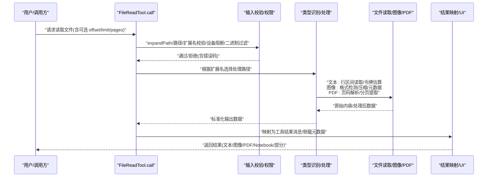
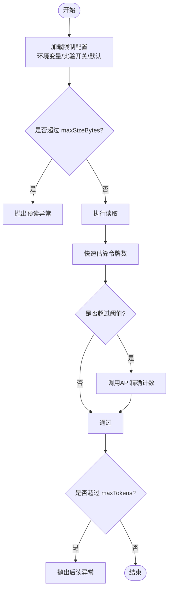
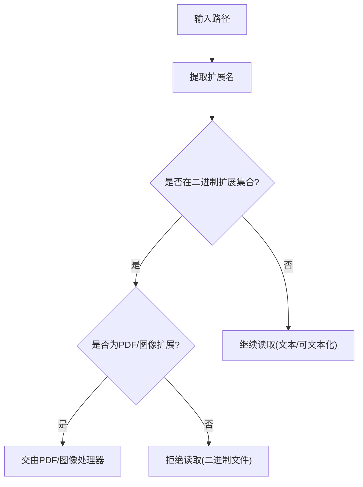
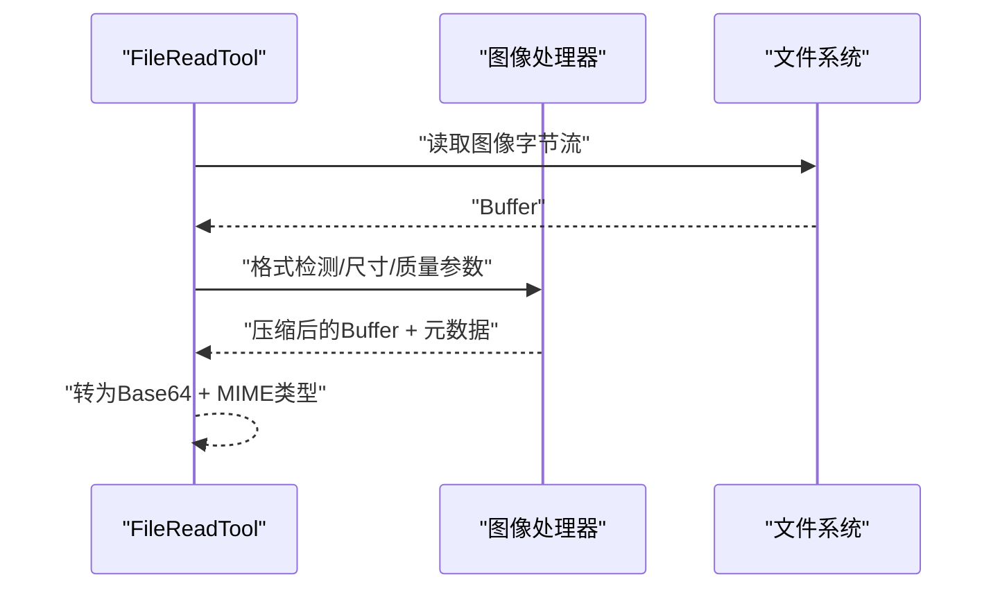
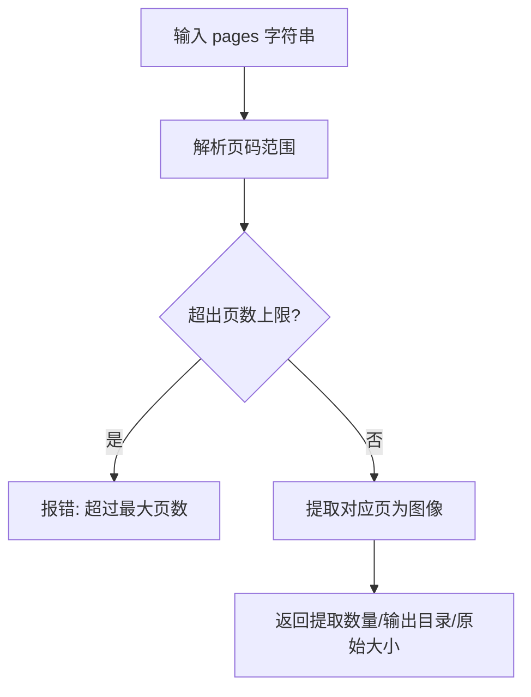
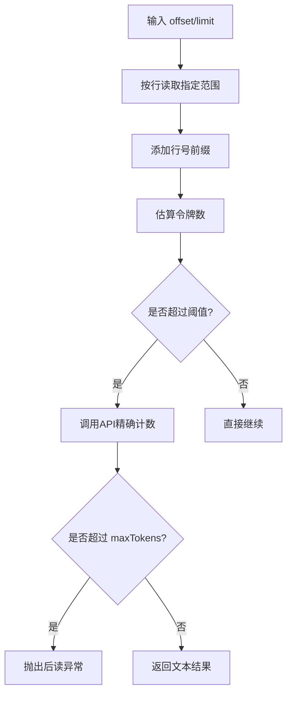
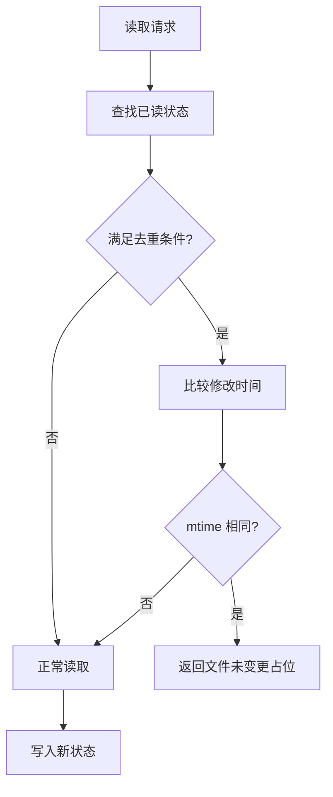
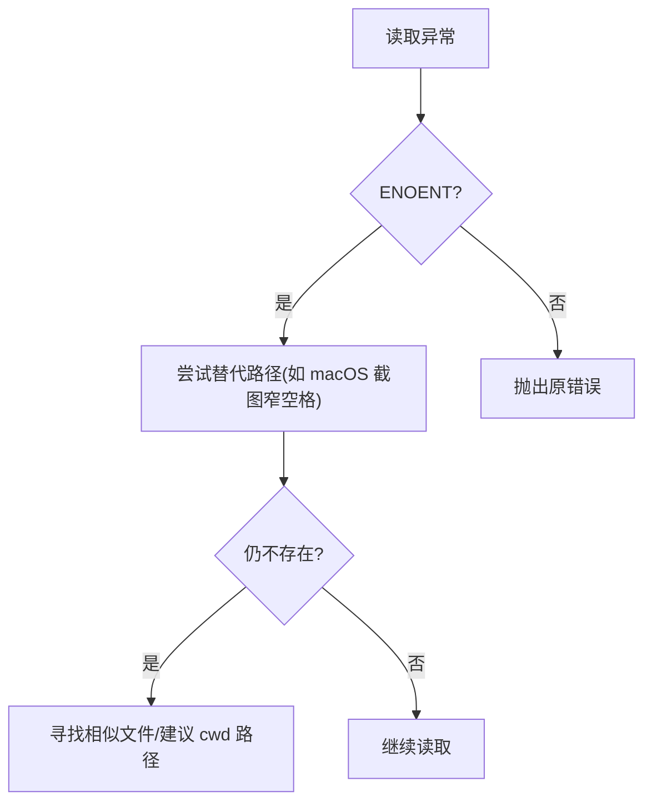
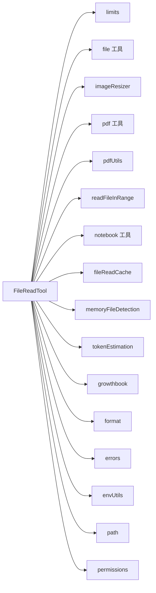

# 文件读取工具

<cite>
**本文引用的文件**
- [src/tools/FileReadTool/FileReadTool.ts](file://src/tools/FileReadTool/FileReadTool.ts)
- [src/tools/FileReadTool/limits.ts](file://src/tools/FileReadTool/limits.ts)
- [src/constants/files.ts](file://src/constants/files.ts)
- [src/utils/file.ts](file://src/utils/file.ts)
- [src/utils/imageResizer.ts](file://src/utils/imageResizer.ts)
- [src/utils/pdf.ts](file://src/utils/pdf.ts)
- [src/utils/pdfUtils.ts](file://src/utils/pdfUtils.ts)
- [src/utils/readFileInRange.ts](file://src/utils/readFileInRange.ts)
- [src/utils/notebook.ts](file://src/utils/notebook.ts)
- [src/utils/fileReadCache.ts](file://src/utils/fileReadCache.ts)
- [src/utils/memoryFileDetection.ts](file://src/utils/memoryFileDetection.ts)
- [src/memdir/memoryAge.ts](file://src/memdir/memoryAge.ts)
- [src/services/analytics/growthbook.js](file://src/services/analytics/growthbook.js)
- [src/services/tokenEstimation.js](file://src/services/tokenEstimation.js)
- [src/utils/format.js](file://src/utils/format.js)
- [src/utils/errors.js](file://src/utils/errors.js)
- [src/utils/envUtils.js](file://src/utils/envUtils.js)
- [src/utils/cwd.js](file://src/utils/cwd.js)
- [src/utils/path.js](file://src/utils/path.js)
- [src/utils/permissions/filesystem.js](file://src/utils/permissions/filesystem.js)
- [src/utils/permissions/shellRuleMatching.js](file://src/utils/permissions/shellRuleMatching.js)
- [src/utils/model/model.js](file://src/utils/model/model.js)
- [src/tools/FileReadTool/prompt.js](file://src/tools/FileReadTool/prompt.js)
- [src/tools/FileReadTool/UI.js](file://src/tools/FileReadTool/UI.js)
</cite>

## 目录
1. [简介](#简介)
2. [项目结构](#项目结构)
3. [核心组件](#核心组件)
4. [架构总览](#架构总览)
5. [详细组件分析](#详细组件分析)
6. [依赖关系分析](#依赖关系分析)
7. [性能考量](#性能考量)
8. [故障排查指南](#故障排查指南)
9. [结论](#结论)
10. [附录](#附录)

## 简介
本文件面向“文件读取工具”（FileReadTool）的使用者与维护者，系统性阐述其文件读取能力、大小限制与格式支持；深入解析图像处理器实现、文件类型检测与内容预览流程；阐明读取限制机制、内存管理与性能优化策略；覆盖支持的文件格式、编码处理与二进制文件处理；提供实际使用示例与与缓存系统的集成说明，并解释错误处理机制。

## 项目结构
FileReadTool 位于工具层，围绕输入校验、权限检查、类型识别、内容读取、结果映射与 UI 呈现等模块协作完成统一的文件读取体验。关键目录与文件如下：
- 工具定义与调用：src/tools/FileReadTool/FileReadTool.ts
- 读取限制配置：src/tools/FileReadTool/limits.ts
- 文件类型与二进制判定：src/constants/files.ts
- 路径与文件辅助：src/utils/file.ts
- 图像处理与尺寸调整：src/utils/imageResizer.ts
- PDF 解析与页码范围：src/utils/pdf.ts、src/utils/pdfUtils.ts
- 按行区间读取：src/utils/readFileInRange.ts
- Notebook 解析：src/utils/notebook.ts
- 缓存与去重：src/utils/fileReadCache.ts
- 内存文件与新鲜度：src/utils/memoryFileDetection.ts、src/memdir/memoryAge.ts
- 分析与实验开关：src/services/analytics/growthbook.js
- 令牌估算与格式提示：src/services/tokenEstimation.js、src/utils/format.js
- 错误与环境工具：src/utils/errors.js、src/utils/envUtils.js、src/utils/cwd.js、src/utils/path.js
- 权限匹配：src/utils/permissions/filesystem.js、src/utils/permissions/shellRuleMatching.js
- 模型与 UI：src/utils/model/model.js、src/tools/FileReadTool/prompt.js、src/tools/FileReadTool/UI.js

```mermaid
graph TB
subgraph "工具层"
FR["FileReadTool<br/>src/tools/FileReadTool/FileReadTool.ts"]
LIM["读取限制<br/>src/tools/FileReadTool/limits.ts"]
PROMPT["提示模板<br/>src/tools/FileReadTool/prompt.js"]
UI["UI 显示<br/>src/tools/FileReadTool/UI.js"]
end
subgraph "通用工具"
FILEUTIL["文件工具<br/>src/utils/file.ts"]
IMGRES["图像处理器<br/>src/utils/imageResizer.ts"]
PDF["PDF 工具<br/>src/utils/pdf.ts"]
PDFUTIL["PDF 工具集<br/>src/utils/pdfUtils.ts"]
RANGE["按行读取<br/>src/utils/readFileInRange.ts"]
NB["Notebook 工具<br/>src/utils/notebook.ts"]
CACHE["读取缓存<br/>src/utils/fileReadCache.ts"]
MEMDET["内存文件检测<br/>src/utils/memoryFileDetection.ts"]
MEMAGE["记忆新鲜度<br/>src/memdir/memoryAge.ts"]
TOK["令牌估算<br/>src/services/tokenEstimation.js"]
GB["实验开关<br/>src/services/analytics/growthbook.js"]
ERR["错误工具<br/>src/utils/errors.js"]
ENV["环境工具<br/>src/utils/envUtils.js"]
PATH["路径工具<br/>src/utils/path.js"]
PERM["权限工具<br/>src/utils/permissions/filesystem.js"]
end
FR --> LIM
FR --> FILEUTIL
FR --> IMGRES
FR --> PDF
FR --> PDFUTIL
FR --> RANGE
FR --> NB
FR --> CACHE
FR --> MEMDET
FR --> MEMAGE
FR --> TOK
FR --> GB
FR --> ERR
FR --> ENV
FR --> PATH
FR --> PERM
FR --> PROMPT
FR --> UI
```

图示来源
- [src/tools/FileReadTool/FileReadTool.ts:1-1184](file://src/tools/FileReadTool/FileReadTool.ts#L1-L1184)
- [src/tools/FileReadTool/limits.ts:1-93](file://src/tools/FileReadTool/limits.ts#L1-L93)
- [src/utils/file.ts:1-585](file://src/utils/file.ts#L1-L585)
- [src/utils/imageResizer.ts](file://src/utils/imageResizer.ts)
- [src/utils/pdf.ts](file://src/utils/pdf.ts)
- [src/utils/pdfUtils.ts](file://src/utils/pdfUtils.ts)
- [src/utils/readFileInRange.ts](file://src/utils/readFileInRange.ts)
- [src/utils/notebook.ts](file://src/utils/notebook.ts)
- [src/utils/fileReadCache.ts](file://src/utils/fileReadCache.ts)
- [src/utils/memoryFileDetection.ts](file://src/utils/memoryFileDetection.ts)
- [src/memdir/memoryAge.ts](file://src/memdir/memoryAge.ts)
- [src/services/analytics/growthbook.js](file://src/services/analytics/growthbook.js)
- [src/services/tokenEstimation.js](file://src/services/tokenEstimation.js)
- [src/utils/format.js](file://src/utils/format.js)
- [src/utils/errors.js](file://src/utils/errors.js)
- [src/utils/envUtils.js](file://src/utils/envUtils.js)
- [src/utils/path.js](file://src/utils/path.js)
- [src/utils/permissions/filesystem.js](file://src/utils/permissions/filesystem.js)

章节来源
- [src/tools/FileReadTool/FileReadTool.ts:1-1184](file://src/tools/FileReadTool/FileReadTool.ts#L1-L1184)
- [src/tools/FileReadTool/limits.ts:1-93](file://src/tools/FileReadTool/limits.ts#L1-L93)
- [src/utils/file.ts:1-585](file://src/utils/file.ts#L1-L585)

## 核心组件
- 工具定义与调用：封装输入模式、输出模式、权限校验、调用流程与结果映射，支持文本、图像、PDF、Notebook、部分提取等多形态输出。
- 读取限制：提供最大字节与最大令牌数的双重限制，支持环境变量与实验开关覆盖。
- 文件类型与二进制判定：基于扩展名集合与缓冲区探测判断二进制文件，避免对大体积或不可文本化的二进制进行无意义读取。
- 图像处理器：负责图像格式检测、尺寸与质量控制、压缩与元数据生成。
- PDF 处理：支持页码范围解析、页数上限控制、分页提取与元数据返回。
- 按行区间读取：在大文件场景下通过 offset/limit 实现局部读取，降低内存与令牌消耗。
- 缓存与去重：针对未变更文本内容进行去重，减少重复传输与成本。
- 错误与路径建议：对不存在文件提供相似文件与当前工作目录建议，提升可用性。

章节来源
- [src/tools/FileReadTool/FileReadTool.ts:227-495](file://src/tools/FileReadTool/FileReadTool.ts#L227-L495)
- [src/tools/FileReadTool/limits.ts:35-92](file://src/tools/FileReadTool/limits.ts#L35-L92)
- [src/constants/files.ts:5-156](file://src/constants/files.ts#L5-L156)
- [src/utils/imageResizer.ts](file://src/utils/imageResizer.ts)
- [src/utils/pdf.ts](file://src/utils/pdf.ts)
- [src/utils/pdfUtils.ts](file://src/utils/pdfUtils.ts)
- [src/utils/readFileInRange.ts](file://src/utils/readFileInRange.ts)
- [src/utils/fileReadCache.ts](file://src/utils/fileReadCache.ts)

## 架构总览
FileReadTool 的调用链从输入校验开始，经过权限与安全检查、类型识别与处理、内容读取与令牌校验，最终映射为统一的工具结果消息。期间穿插缓存去重、设备路径阻断、二进制文件过滤、PDF 页码范围控制、图像压缩与元数据生成等策略。

图示来源
- [src/tools/FileReadTool/FileReadTool.ts:496-718](file://src/tools/FileReadTool/FileReadTool.ts#L496-L718)
- [src/utils/imageResizer.ts](file://src/utils/imageResizer.ts)
- [src/utils/pdf.ts](file://src/utils/pdf.ts)
- [src/utils/pdfUtils.ts](file://src/utils/pdfUtils.ts)
- [src/utils/readFileInRange.ts](file://src/utils/readFileInRange.ts)

## 详细组件分析

### 读取限制与令牌估算
- 双重限制：maxSizeBytes（总文件大小上限）、maxTokens（输出令牌上限），前者在进入读取前抛错，后者在读取后通过估算与真实计数对比决定是否抛错。
- 优先级：环境变量 > 实验开关值 > 默认值；默认 maxTokens 为固定常量。
- 估算策略：先用快速估算阈值判断是否需要真实计数；若超过阈值再调用 API 进行精确计数，避免不必要的开销。
- UI 提示：根据开关决定是否在提示中加入大小限制说明与目标化范围建议。

图示来源
- [src/tools/FileReadTool/limits.ts:53-92](file://src/tools/FileReadTool/limits.ts#L53-L92)
- [src/tools/FileReadTool/FileReadTool.ts:755-772](file://src/tools/FileReadTool/FileReadTool.ts#L755-L772)
- [src/services/tokenEstimation.js](file://src/services/tokenEstimation.js)
- [src/utils/format.js](file://src/utils/format.js)

章节来源
- [src/tools/FileReadTool/limits.ts:18-92](file://src/tools/FileReadTool/limits.ts#L18-L92)
- [src/tools/FileReadTool/FileReadTool.ts:755-772](file://src/tools/FileReadTool/FileReadTool.ts#L755-L772)

### 文件类型检测与二进制处理
- 扩展名黑名单：包含图片、视频、音频、归档、可执行、文档、字体、字节码、数据库、设计/3D、Flash、锁/分析数据等常见二进制扩展，避免对大文件进行无意义读取。
- 缓冲区探测：对小范围缓冲区统计不可打印字符比例与空字节存在性，作为二进制判定依据。
- PDF 与图像例外：PDF 与常见图像扩展由专用处理器处理，不在黑名单内。

图示来源
- [src/constants/files.ts:5-156](file://src/constants/files.ts#L5-L156)
- [src/tools/FileReadTool/FileReadTool.ts:469-482](file://src/tools/FileReadTool/FileReadTool.ts#L469-L482)

章节来源
- [src/constants/files.ts:5-156](file://src/constants/files.ts#L5-L156)
- [src/tools/FileReadTool/FileReadTool.ts:469-482](file://src/tools/FileReadTool/FileReadTool.ts#L469-L482)

### 图像处理器实现与内容预览
- 支持格式：JPEG、PNG、GIF、WebP。
- 处理流程：检测图像格式 → 尺寸与质量控制 → 可选压缩 → 生成元数据（原尺寸、显示尺寸等）→ 返回 Base64 数据与媒体类型。
- 预览能力：通过尺寸与质量控制，确保在满足模型理解的前提下尽量降低体积与令牌成本。

图示来源
- [src/tools/FileReadTool/FileReadTool.ts:44-50](file://src/tools/FileReadTool/FileReadTool.ts#L44-L50)
- [src/utils/imageResizer.ts](file://src/utils/imageResizer.ts)

章节来源
- [src/tools/FileReadTool/FileReadTool.ts:44-50](file://src/tools/FileReadTool/FileReadTool.ts#L44-L50)
- [src/utils/imageResizer.ts](file://src/utils/imageResizer.ts)

### PDF 处理与页码范围控制
- 页码范围解析：支持单页、连续范围与不连续范围组合，严格校验页数上限。
- 分页提取：将指定页拆分为独立图像，返回提取数量与输出目录。
- 元数据返回：对于整份 PDF，返回原始大小与路径，内容以补充块形式传递。

图示来源
- [src/tools/FileReadTool/FileReadTool.ts:418-440](file://src/tools/FileReadTool/FileReadTool.ts#L418-L440)
- [src/utils/pdfUtils.ts](file://src/utils/pdfUtils.ts)
- [src/utils/pdf.ts](file://src/utils/pdf.ts)

章节来源
- [src/tools/FileReadTool/FileReadTool.ts:418-440](file://src/tools/FileReadTool/FileReadTool.ts#L418-L440)
- [src/utils/pdfUtils.ts](file://src/utils/pdfUtils.ts)
- [src/utils/pdf.ts](file://src/utils/pdf.ts)

### 文本读取与行区间处理
- 行区间读取：通过偏移与限制参数仅读取目标范围，显著降低内存占用与令牌消耗。
- 行号前缀：可选紧凑或带填充的行号前缀，便于模型定位与上下文阅读。
- 令牌估算：在读取后进行估算与真实计数对比，确保不超过 maxTokens。

图示来源
- [src/tools/FileReadTool/FileReadTool.ts:724-772](file://src/tools/FileReadTool/FileReadTool.ts#L724-L772)
- [src/utils/readFileInRange.ts](file://src/utils/readFileInRange.ts)
- [src/utils/file.ts:287-319](file://src/utils/file.ts#L287-L319)

章节来源
- [src/tools/FileReadTool/FileReadTool.ts:724-772](file://src/tools/FileReadTool/FileReadTool.ts#L724-L772)
- [src/utils/readFileInRange.ts](file://src/utils/readFileInRange.ts)
- [src/utils/file.ts:287-319](file://src/utils/file.ts#L287-L319)

### 缓存系统集成与去重
- 去重触发条件：同一文件、完整视图（非部分视图）、偏移与限制完全一致、且文件修改时间未变化。
- 去重命中：返回“文件未变更”占位结果，避免重复传输。
- 抑制开关：可通过实验开关关闭去重逻辑，保障稳定性。

图示来源
- [src/tools/FileReadTool/FileReadTool.ts:523-573](file://src/tools/FileReadTool/FileReadTool.ts#L523-L573)
- [src/utils/fileReadCache.ts](file://src/utils/fileReadCache.ts)
- [src/utils/file.ts:77-82](file://src/utils/file.ts#L77-L82)

章节来源
- [src/tools/FileReadTool/FileReadTool.ts:523-573](file://src/tools/FileReadTool/FileReadTool.ts#L523-L573)
- [src/utils/fileReadCache.ts](file://src/utils/fileReadCache.ts)
- [src/utils/file.ts:77-82](file://src/utils/file.ts#L77-L82)

### 错误处理与路径建议
- 设备路径阻断：对无限输出或阻塞输入的设备文件进行路径级阻断，避免进程挂起。
- 文件不存在：提供相似文件名建议与当前工作目录提示；macOS 截图路径兼容（常规空格与窄空格）。
- 权限与规则：基于通配符规则匹配与拒绝列表进行读取权限控制。

图示来源
- [src/tools/FileReadTool/FileReadTool.ts:593-650](file://src/tools/FileReadTool/FileReadTool.ts#L593-L650)
- [src/utils/errors.js](file://src/utils/errors.js)
- [src/utils/file.ts:178-267](file://src/utils/file.ts#L178-L267)

章节来源
- [src/tools/FileReadTool/FileReadTool.ts:593-650](file://src/tools/FileReadTool/FileReadTool.ts#L593-L650)
- [src/utils/errors.js](file://src/utils/errors.js)
- [src/utils/file.ts:178-267](file://src/utils/file.ts#L178-L267)

## 依赖关系分析
- 工具层依赖：FileReadTool 依赖 limits、file 工具、imageResizer、pdf 工具、readFileInRange、notebook 工具、fileReadCache、memoryFileDetection、tokenEstimation、growthbook、format、errors、envUtils、path、permissions 等。
- 低耦合高内聚：各处理模块职责清晰，通过统一的输出模式与映射函数对接 UI 与消息层。
- 安全与性能：在入口处进行路径与规则校验、设备阻断与二进制过滤，在读取后进行令牌估算与去重，兼顾安全性与性能。

图示来源
- [src/tools/FileReadTool/FileReadTool.ts:1-1184](file://src/tools/FileReadTool/FileReadTool.ts#L1-L1184)
- [src/tools/FileReadTool/limits.ts:1-93](file://src/tools/FileReadTool/limits.ts#L1-L93)
- [src/utils/file.ts:1-585](file://src/utils/file.ts#L1-L585)
- [src/utils/imageResizer.ts](file://src/utils/imageResizer.ts)
- [src/utils/pdf.ts](file://src/utils/pdf.ts)
- [src/utils/pdfUtils.ts](file://src/utils/pdfUtils.ts)
- [src/utils/readFileInRange.ts](file://src/utils/readFileInRange.ts)
- [src/utils/notebook.ts](file://src/utils/notebook.ts)
- [src/utils/fileReadCache.ts](file://src/utils/fileReadCache.ts)
- [src/utils/memoryFileDetection.ts](file://src/utils/memoryFileDetection.ts)
- [src/services/tokenEstimation.js](file://src/services/tokenEstimation.js)
- [src/services/analytics/growthbook.js](file://src/services/analytics/growthbook.js)
- [src/utils/format.js](file://src/utils/format.js)
- [src/utils/errors.js](file://src/utils/errors.js)
- [src/utils/envUtils.js](file://src/utils/envUtils.js)
- [src/utils/path.js](file://src/utils/path.js)
- [src/utils/permissions/filesystem.js](file://src/utils/permissions/filesystem.js)

## 性能考量
- 令牌估算与真实计数：先快速估算，超过阈值再精确计数，避免不必要的 API 调用。
- 去重与缓存：对未变更文本内容进行去重，显著降低重复传输与成本。
- 行区间读取：通过 offset/limit 仅读取必要范围，降低内存与令牌消耗。
- 图像压缩：在满足理解的前提下进行压缩与尺寸控制，减少体积与令牌成本。
- 同步/异步：修改时间查询采用异步版本，避免在慢盘上触发慢操作告警。

章节来源
- [src/tools/FileReadTool/FileReadTool.ts:755-772](file://src/tools/FileReadTool/FileReadTool.ts#L755-L772)
- [src/tools/FileReadTool/FileReadTool.ts:523-573](file://src/tools/FileReadTool/FileReadTool.ts#L523-L573)
- [src/utils/file.ts:77-82](file://src/utils/file.ts#L77-L82)
- [src/utils/imageResizer.ts](file://src/utils/imageResizer.ts)

## 故障排查指南
- 超过最大令牌数：使用 offset/limit 或分段读取；确认是否启用了实验开关导致上限变化。
- 文件过大：使用 offset/limit 或分段读取；确认是否被 maxSizeBytes 限制。
- 二进制文件：该工具不支持直接读取二进制文件，请使用专门工具或转换后再读取。
- 设备文件：路径被阻断（如 /dev/zero），请更换目标文件。
- 文件不存在：检查路径拼写、当前工作目录与相似文件建议；macOS 截图可能使用窄空格。
- 权限被拒：检查工具权限设置与通配符规则匹配结果。

章节来源
- [src/tools/FileReadTool/limits.ts:53-92](file://src/tools/FileReadTool/limits.ts#L53-L92)
- [src/tools/FileReadTool/FileReadTool.ts:469-492](file://src/tools/FileReadTool/FileReadTool.ts#L469-L492)
- [src/utils/errors.js](file://src/utils/errors.js)
- [src/utils/file.ts:178-267](file://src/utils/file.ts#L178-L267)
- [src/utils/permissions/filesystem.js](file://src/utils/permissions/filesystem.js)

## 结论
FileReadTool 在保证安全与合规的前提下，提供了灵活、高效且可扩展的文件读取能力。通过严格的输入校验、权限控制、类型识别与处理、令牌估算与去重策略，以及对图像与 PDF 的专项支持，能够在复杂场景下稳定地满足用户需求。建议在读取大文件时优先使用 offset/limit 与分段策略，并结合实验开关与环境变量进行灵活配置。

## 附录

### 支持的文件格式与处理
- 文本类：所有可文本化的文件（含 Notebook）。
- 图像类：JPEG、PNG、GIF、WebP。
- PDF 类：支持页码范围解析与分页提取。
- 二进制类：默认排除，除非明确为 PDF/图像扩展。

章节来源
- [src/constants/files.ts:5-156](file://src/constants/files.ts#L5-L156)
- [src/tools/FileReadTool/FileReadTool.ts:44-50](file://src/tools/FileReadTool/FileReadTool.ts#L44-L50)
- [src/utils/pdfUtils.ts](file://src/utils/pdfUtils.ts)

### 编码处理与行尾处理
- 编码检测：对已解析路径进行编码检测，失败时回退到 UTF-8。
- 行尾检测：对小范围缓冲区进行行尾类型检测，用于写入时的规范化。
- 行号前缀：支持紧凑与填充两种格式，可通过开关控制。

章节来源
- [src/utils/file.ts:100-135](file://src/utils/file.ts#L100-L135)
- [src/utils/file.ts:287-319](file://src/utils/file.ts#L287-L319)

### 实际使用示例（步骤说明）
- 读取文本文件（大文件）：提供 offset 与 limit，分段读取；若需全文，先估算令牌数再决定是否一次性读取。
- 读取图像文件：无需额外参数，自动检测格式并返回压缩后的 Base64 与元数据。
- 读取 PDF 文件：提供 pages 参数（如 "1-5"），工具会解析并限制最大页数；也可提取为图像并返回输出目录。
- Notebook 文件：自动解析为 cells 数组，便于后续分析。
- 文件未变更：当同一范围多次读取且文件未变，工具返回“文件未变更”占位，避免重复传输。

章节来源
- [src/tools/FileReadTool/FileReadTool.ts:496-718](file://src/tools/FileReadTool/FileReadTool.ts#L496-L718)
- [src/utils/notebook.ts](file://src/utils/notebook.ts)