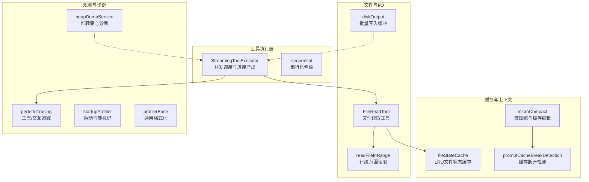
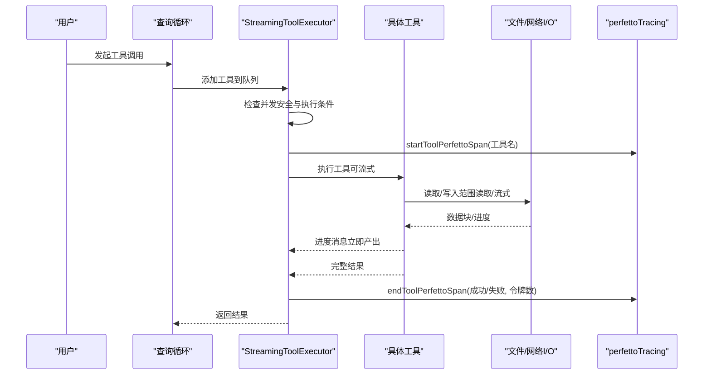
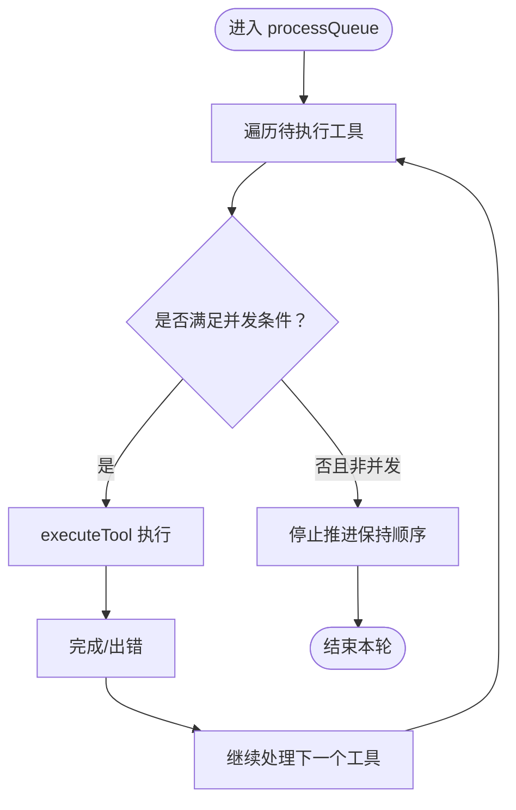
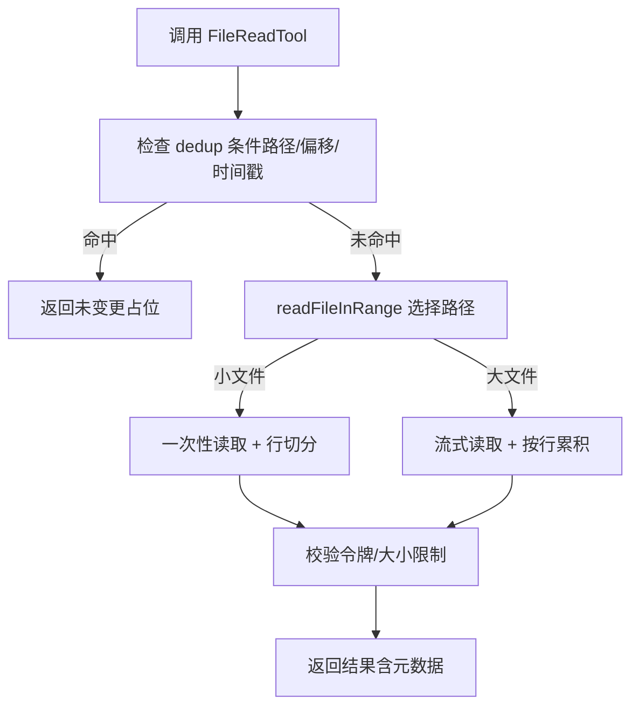
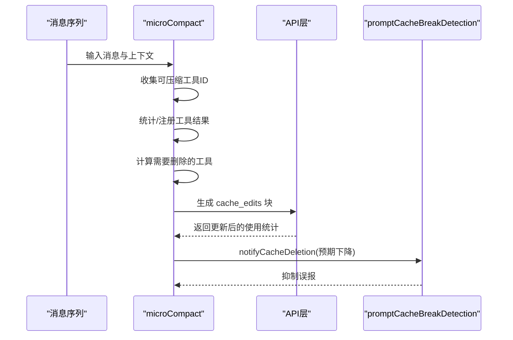
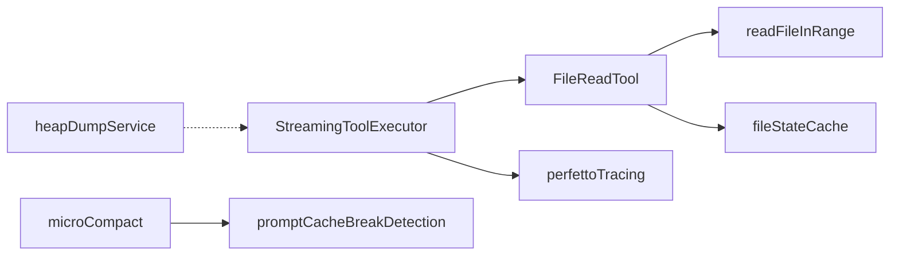

# 工具性能优化

<cite>
**本文引用的文件**
- [StreamingToolExecutor.ts](file://src/services/tools/StreamingToolExecutor.ts)
- [fileStateCache.ts](file://src/utils/fileStateCache.ts)
- [readFileInRange.ts](file://src/utils/readFileInRange.ts)
- [FileReadTool.ts](file://src/tools/FileReadTool/FileReadTool.ts)
- [microCompact.ts](file://src/services/compact/microCompact.ts)
- [promptCacheBreakDetection.ts](file://src/services/api/promptCacheBreakDetection.ts)
- [sequential.ts](file://src/utils/sequential.ts)
- [diskOutput.ts](file://src/utils/task/diskOutput.ts)
- [toolLimits.ts](file://src/constants/toolLimits.ts)
- [perfettoTracing.ts](file://src/utils/telemetry/perfettoTracing.ts)
- [startupProfiler.ts](file://src/utils/startupProfiler.ts)
- [profilerBase.ts](file://src/utils/profilerBase.ts)
- [heapDumpService.ts](file://src/utils/heapDumpService.ts)
- [index.ts](file://src/commands/heapdump/index.ts)
- [main.tsx](file://src/main.tsx)
- [stats.tsx](file://src/context/stats.tsx)
</cite>

## 目录
1. [简介](#简介)
2. [项目结构](#项目结构)
3. [核心组件](#核心组件)
4. [架构总览](#架构总览)
5. [详细组件分析](#详细组件分析)
6. [依赖关系分析](#依赖关系分析)
7. [性能考量](#性能考量)
8. [故障排查指南](#故障排查指南)
9. [结论](#结论)
10. [附录](#附录)

## 简介
本文件面向 Claude Code 的工具性能优化，系统性梳理并解释以下主题：
- 工具执行的性能监控与分析方法
- 工具缓存机制（文件状态缓存、结果缓存、查询缓存）
- 并发执行优化（并发安全检查、资源竞争规避、瓶颈识别）
- 内存管理最佳实践（大文件处理、流式处理、内存泄漏防护）
- 执行时间优化技巧（预加载、延迟加载、批量处理）
- 结果大小控制（字符数限制、文件持久化、分页显示）
- 性能测试方法与工具
- 高负载稳定性与可靠性保障

## 项目结构
围绕工具性能优化的关键模块分布如下：
- 工具执行与并发控制：StreamingToolExecutor
- 文件读取与流式处理：readFileInRange、FileReadTool
- 缓存与上下文压缩：fileStateCache、microCompact、promptCacheBreakDetection
- 并发安全与串行化：sequential
- 输出写入与内存缓冲：diskOutput
- 结果大小限制：toolLimits
- 性能观测与追踪：perfettoTracing、startupProfiler、profilerBase、stats
- 堆转储与内存诊断：heapDumpService、commands/heapdump
- 启动与预取策略：main.tsx

图示来源
- [StreamingToolExecutor.ts:40-531](file://src/services/tools/StreamingToolExecutor.ts#L40-L531)
- [readFileInRange.ts:73-122](file://src/utils/readFileInRange.ts#L73-L122)
- [FileReadTool.ts:496-718](file://src/tools/FileReadTool/FileReadTool.ts#L496-L718)
- [fileStateCache.ts:30-93](file://src/utils/fileStateCache.ts#L30-L93)
- [microCompact.ts:253-293](file://src/services/compact/microCompact.ts#L253-L293)
- [promptCacheBreakDetection.ts:646-682](file://src/services/api/promptCacheBreakDetection.ts#L646-L682)
- [sequential.ts:19-56](file://src/utils/sequential.ts#L19-L56)
- [diskOutput.ts:174-205](file://src/utils/task/diskOutput.ts#L174-L205)
- [perfettoTracing.ts:687-763](file://src/utils/telemetry/perfettoTracing.ts#L687-L763)
- [startupProfiler.ts:68-128](file://src/utils/startupProfiler.ts#L68-L128)
- [profilerBase.ts:14-46](file://src/utils/profilerBase.ts#L14-L46)
- [heapDumpService.ts:221-278](file://src/utils/heapDumpService.ts#L221-L278)

章节来源
- [StreamingToolExecutor.ts:40-531](file://src/services/tools/StreamingToolExecutor.ts#L40-L531)
- [readFileInRange.ts:73-122](file://src/utils/readFileInRange.ts#L73-L122)
- [FileReadTool.ts:496-718](file://src/tools/FileReadTool/FileReadTool.ts#L496-L718)
- [fileStateCache.ts:30-93](file://src/utils/fileStateCache.ts#L30-L93)
- [microCompact.ts:253-293](file://src/services/compact/microCompact.ts#L253-L293)
- [promptCacheBreakDetection.ts:646-682](file://src/services/api/promptCacheBreakDetection.ts#L646-L682)
- [sequential.ts:19-56](file://src/utils/sequential.ts#L19-L56)
- [diskOutput.ts:174-205](file://src/utils/task/diskOutput.ts#L174-L205)
- [perfettoTracing.ts:687-763](file://src/utils/telemetry/perfettoTracing.ts#L687-L763)
- [startupProfiler.ts:68-128](file://src/utils/startupProfiler.ts#L68-L128)
- [profilerBase.ts:14-46](file://src/utils/profilerBase.ts#L14-L46)
- [heapDumpService.ts:221-278](file://src/utils/heapDumpService.ts#L221-L278)

## 核心组件
- 并发执行器 StreamingToolExecutor：支持并发安全工具并行、非并发工具串行、进度消息即时产出、错误传播与取消。
- 文件状态缓存 fileStateCache：基于 LRU 的文件内容缓存，带字节大小上限，防止内存膨胀。
- 流式读取 readFileInRange：小文件走快速路径（一次性读取），大文件走流式路径（按行扫描、按需丢弃）。
- 微压缩 microCompact：通过缓存编辑 API 删除旧工具结果，减少上下文占用；或基于时间阈值进行内容清理。
- 缓存断开检测 promptCacheBreakDetection：检测服务端缓存命中下降并记录差异，辅助定位异常。
- 串行化 sequential：对可能产生竞态的操作（如文件写入）进行队列化串行执行。
- 输出缓冲 diskOutput：批量缓冲输出块，避免内存持续增长。
- 结果大小限制 toolLimits：统一的字符数与令牌上限，超过则落盘。
- 性能追踪 perfettoTracing：工具执行、交互等待等关键阶段的时序事件采集。
- 启动性能 startupProfiler：关键启动节点打点与报告生成。
- 堆转储 heapDumpService：在内存异常时捕获堆快照与诊断信息。

章节来源
- [StreamingToolExecutor.ts:40-531](file://src/services/tools/StreamingToolExecutor.ts#L40-L531)
- [fileStateCache.ts:30-93](file://src/utils/fileStateCache.ts#L30-L93)
- [readFileInRange.ts:73-122](file://src/utils/readFileInRange.ts#L73-L122)
- [microCompact.ts:253-293](file://src/services/compact/microCompact.ts#L253-L293)
- [promptCacheBreakDetection.ts:646-682](file://src/services/api/promptCacheBreakDetection.ts#L646-L682)
- [sequential.ts:19-56](file://src/utils/sequential.ts#L19-L56)
- [diskOutput.ts:174-205](file://src/utils/task/diskOutput.ts#L174-L205)
- [toolLimits.ts:13-33](file://src/constants/toolLimits.ts#L13-L33)
- [perfettoTracing.ts:687-763](file://src/utils/telemetry/perfettoTracing.ts#L687-L763)
- [startupProfiler.ts:68-128](file://src/utils/startupProfiler.ts#L68-L128)
- [heapDumpService.ts:221-278](file://src/utils/heapDumpService.ts#L221-L278)

## 架构总览
工具性能优化贯穿“输入/读取—执行—输出—观测”全链路，关键优化点包括：
- 读取阶段：按需范围读取、流式处理、缓存去重
- 执行阶段：并发安全控制、进度优先产出、错误短路
- 上下文阶段：缓存编辑与时间触发清理，降低上下文开销
- 观测阶段：细粒度事件追踪、启动性能打点、堆转储诊断

图示来源
- [StreamingToolExecutor.ts:265-405](file://src/services/tools/StreamingToolExecutor.ts#L265-L405)
- [perfettoTracing.ts:687-763](file://src/utils/telemetry/perfettoTracing.ts#L687-L763)
- [readFileInRange.ts:73-122](file://src/utils/readFileInRange.ts#L73-L122)

## 详细组件分析

### 并发执行与进度产出（StreamingToolExecutor）
- 并发安全判定：根据工具定义的 isConcurrencySafe 与当前正在执行的工具集合决定是否允许并行。
- 队列推进：当满足条件时立即执行，否则保持排队；非并发工具会阻塞后续工具。
- 进度优先：进度消息先于最终结果产出，提升感知响应。
- 错误传播：兄弟工具中若出现致命错误（如 Bash 失败），会通过子 AbortController 向同组传播，避免无效执行。
- 取消与中断：支持用户中断、兄弟错误、回退降级等场景的合成错误消息。

图示来源
- [StreamingToolExecutor.ts:140-151](file://src/services/tools/StreamingToolExecutor.ts#L140-L151)
- [StreamingToolExecutor.ts:265-405](file://src/services/tools/StreamingToolExecutor.ts#L265-L405)

章节来源
- [StreamingToolExecutor.ts:40-531](file://src/services/tools/StreamingToolExecutor.ts#L40-L531)

### 文件状态缓存与读取优化（fileStateCache + readFileInRange + FileReadTool）
- 文件状态缓存（LRU）：以标准化路径为键，按内容字节计算大小，限制最大条目与总字节数，避免大文件导致内存膨胀。
- 范围读取（readFileInRange）：小文件（<10MB）一次性读取并按行切分；大文件使用流式读取，仅累积目标范围内的行，其余丢弃，避免 RSS 波动。
- 读取去重（FileReadTool）：对同一文件、相同偏移范围且未变更的读取，返回“未变更”占位，避免重复发送完整内容，节省 token 与带宽。
- 令牌估算与上限：对文本内容进行粗略令牌估算，必要时再精确计数，超限抛出错误提示。

图示来源
- [FileReadTool.ts:523-573](file://src/tools/FileReadTool/FileReadTool.ts#L523-L573)
- [readFileInRange.ts:73-122](file://src/utils/readFileInRange.ts#L73-L122)
- [fileStateCache.ts:30-93](file://src/utils/fileStateCache.ts#L30-L93)

章节来源
- [fileStateCache.ts:30-93](file://src/utils/fileStateCache.ts#L30-L93)
- [readFileInRange.ts:73-122](file://src/utils/readFileInRange.ts#L73-L122)
- [FileReadTool.ts:523-573](file://src/tools/FileReadTool/FileReadTool.ts#L523-L573)

### 缓存与上下文压缩（microCompact + promptCacheBreakDetection）
- 缓存编辑（cached microcompact）：在支持的模型与环境下，通过 cache_edits 动态删除旧工具结果，不破坏前缀缓存，显著降低上下文占用。
- 时间触发清理：当自上次助手回复以来的时间间隔超过阈值，直接对工具结果进行内容清理，避免过期上下文污染。
- 缓存断开检测：当缓存命中下降时记录差异文件，辅助定位异常；同时在缓存编辑发生时抑制误报。

图示来源
- [microCompact.ts:305-399](file://src/services/compact/microCompact.ts#L305-L399)
- [promptCacheBreakDetection.ts:646-682](file://src/services/api/promptCacheBreakDetection.ts#L646-L682)

章节来源
- [microCompact.ts:253-293](file://src/services/compact/microCompact.ts#L253-L293)
- [microCompact.ts:305-399](file://src/services/compact/microCompact.ts#L305-L399)
- [promptCacheBreakDetection.ts:646-682](file://src/services/api/promptCacheBreakDetection.ts#L646-L682)

### 并发安全与资源竞争规避（sequential）
- 对易产生竞态的异步操作（如文件写入）提供串行化包装，确保队列化执行，避免冲突与状态不一致。

章节来源
- [sequential.ts:19-56](file://src/utils/sequential.ts#L19-L56)

### 内存管理与大文件处理（diskOutput + readFileInRange）
- 输出缓冲：diskOutput 将队列中的字符串拼接为单个 Buffer 后一次性写入，避免队列持续增长；通过 splice 原地截断数组，促使 GC 尽快回收中间对象。
- 流式读取：readFileInRange 在流式路径中仅累积目标范围内的行，外部行被丢弃，避免单次内存峰值过高。

章节来源
- [diskOutput.ts:174-205](file://src/utils/task/diskOutput.ts#L174-L205)
- [readFileInRange.ts:344-383](file://src/utils/readFileInRange.ts#L344-L383)

### 执行时间优化（预加载、延迟加载、批量处理）
- 延迟加载与预取：启动完成后才进行部分后台预取，避免抢占首屏渲染与首次交互的事件循环资源。
- 批量处理：输出缓冲采用批量写入策略，减少频繁 I/O 调用次数。

章节来源
- [main.tsx:388-401](file://src/main.tsx#L388-L401)
- [diskOutput.ts:174-205](file://src/utils/task/diskOutput.ts#L174-L205)

### 结果大小控制（字符数限制、文件持久化、分页显示）
- 字符数与令牌上限：统一的最大结果字符数与令牌上限，超出后触发落盘策略，避免上下文溢出。
- 分页显示：PDF 提取等场景返回目录与页数，UI 层按需加载，避免一次性传输大量内容。

章节来源
- [toolLimits.ts:13-33](file://src/constants/toolLimits.ts#L13-L33)
- [FileReadTool.ts:679-717](file://src/tools/FileReadTool/FileReadTool.ts#L679-L717)

### 性能观测与追踪（perfettoTracing + startupProfiler + profilerBase + stats）
- 工具/交互追踪：为工具执行与用户等待阶段生成开始/结束事件，包含耗时、结果令牌数等参数，便于定位瓶颈。
- 启动性能：在关键节点打点，支持详细内存快照，生成格式化报告。
- 指标聚合：提供直方图与集合类指标收集，支持 p50/p95 等统计。
- 采样与保留：直方图采用水库采样，避免无限增长。

章节来源
- [perfettoTracing.ts:687-763](file://src/utils/telemetry/perfettoTracing.ts#L687-L763)
- [startupProfiler.ts:68-128](file://src/utils/startupProfiler.ts#L68-L128)
- [profilerBase.ts:14-46](file://src/utils/profilerBase.ts#L14-L46)
- [stats.tsx:38-88](file://src/context/stats.tsx#L38-L88)

### 内存诊断与泄漏防护（heapDumpService + 命令入口）
- 堆转储：在内存异常或手动触发时捕获堆快照与诊断信息（内存用量、V8 堆空间、活跃句柄/请求、平台信息等），并优先写入诊断文件，避免快照过程崩溃丢失信息。
- 命令入口：提供 /heapdump 命令，便于快速触发诊断。

章节来源
- [heapDumpService.ts:221-278](file://src/utils/heapDumpService.ts#L221-L278)
- [index.ts:1-13](file://src/commands/heapdump/index.ts#L1-L13)

## 依赖关系分析
- StreamingToolExecutor 依赖工具定义与权限校验，内部通过 AbortController 实现跨工具的取消传播。
- FileReadTool 依赖 readFileInRange 与 fileStateCache，并在读取前后进行权限与类型校验。
- microCompact 依赖缓存编辑模块与断开检测模块，用于动态清理工具结果。
- perfettoTracing 作为全局可观测基础设施，被各执行路径调用。
- heapDumpService 作为诊断工具，独立于业务流程，仅在需要时调用。

图示来源
- [StreamingToolExecutor.ts:40-531](file://src/services/tools/StreamingToolExecutor.ts#L40-L531)
- [FileReadTool.ts:496-718](file://src/tools/FileReadTool/FileReadTool.ts#L496-L718)
- [readFileInRange.ts:73-122](file://src/utils/readFileInRange.ts#L73-L122)
- [fileStateCache.ts:30-93](file://src/utils/fileStateCache.ts#L30-L93)
- [microCompact.ts:253-293](file://src/services/compact/microCompact.ts#L253-L293)
- [promptCacheBreakDetection.ts:646-682](file://src/services/api/promptCacheBreakDetection.ts#L646-L682)
- [perfettoTracing.ts:687-763](file://src/utils/telemetry/perfettoTracing.ts#L687-L763)
- [heapDumpService.ts:221-278](file://src/utils/heapDumpService.ts#L221-L278)

章节来源
- [StreamingToolExecutor.ts:40-531](file://src/services/tools/StreamingToolExecutor.ts#L40-L531)
- [FileReadTool.ts:496-718](file://src/tools/FileReadTool/FileReadTool.ts#L496-L718)
- [microCompact.ts:253-293](file://src/services/compact/microCompact.ts#L253-L293)

## 性能考量
- 并发策略：优先保证并发安全，非并发工具串行，避免共享资源争用；对 I/O 密集型工具（如 Bash）采用子 AbortController 级联取消，缩短无效等待。
- I/O 优化：范围读取与流式处理结合，既保证小文件的低开销，又避免大文件的内存峰值；输出缓冲批量写入，减少系统调用。
- 上下文压缩：利用缓存编辑与时间触发清理，降低工具结果对上下文的影响，提升长对话稳定性。
- 观测与采样：通过细粒度事件与直方图采样，持续发现热点与异常，指导进一步优化。
- 启动与预取：延迟非关键预取，避免影响首屏与首交互体验。

## 故障排查指南
- 工具执行卡顿或错误：
  - 使用 perfettoTracing 查看工具开始/结束时间与错误参数，定位耗时与失败原因。
  - 若为 Bash 工具失败引发的级联取消，检查兄弟工具的错误传播链路。
- 上下文过大或命中率下降：
  - 检查 microCompact 的日志与断开检测告警，确认是否触发了缓存编辑或时间清理。
- 内存异常或泄漏：
  - 使用 /heapdump 命令生成堆快照与诊断文件，结合诊断信息中的活跃句柄/请求与 V8 堆空间统计判断泄漏类型。
- 启动慢或首帧延迟：
  - 使用 startupProfiler 报告查看关键节点耗时与内存变化，评估是否需要调整预取策略。

章节来源
- [perfettoTracing.ts:687-763](file://src/utils/telemetry/perfettoTracing.ts#L687-L763)
- [microCompact.ts:305-399](file://src/services/compact/microCompact.ts#L305-L399)
- [promptCacheBreakDetection.ts:646-682](file://src/services/api/promptCacheBreakDetection.ts#L646-L682)
- [heapDumpService.ts:221-278](file://src/utils/heapDumpService.ts#L221-L278)
- [startupProfiler.ts:68-128](file://src/utils/startupProfiler.ts#L68-L128)

## 结论
通过并发安全控制、流式与范围读取、缓存编辑与时间清理、细粒度观测与诊断，Claude Code 在工具层面实现了从“可运行”到“高性能”的系统性优化。建议在新工具开发中遵循：
- 明确并发安全属性，优先使用并发安全工具
- 采用范围/流式读取，避免一次性加载大文件
- 利用缓存与微压缩减少上下文负担
- 引入 perfettoTracing 与直方图采样，持续监控与回归
- 在内存异常时及时使用堆转储与诊断，快速定位问题

## 附录
- 性能测试方法
  - 使用 perfettoTracing 为关键路径打点，对比不同配置/版本的耗时差异
  - 通过 stats.tsx 的直方图统计观察尾部延迟与抖动
  - 启动性能：使用 startupProfiler 生成报告，关注关键 mark 之间的增量
- 高负载稳定性
  - 控制并发工具数量，避免共享资源争用
  - 对写入类操作使用 sequential 包装，确保串行化
  - 合理设置工具结果大小上限，必要时启用落盘策略