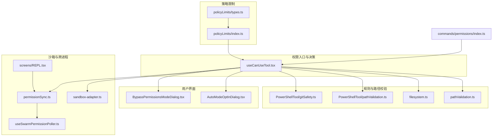
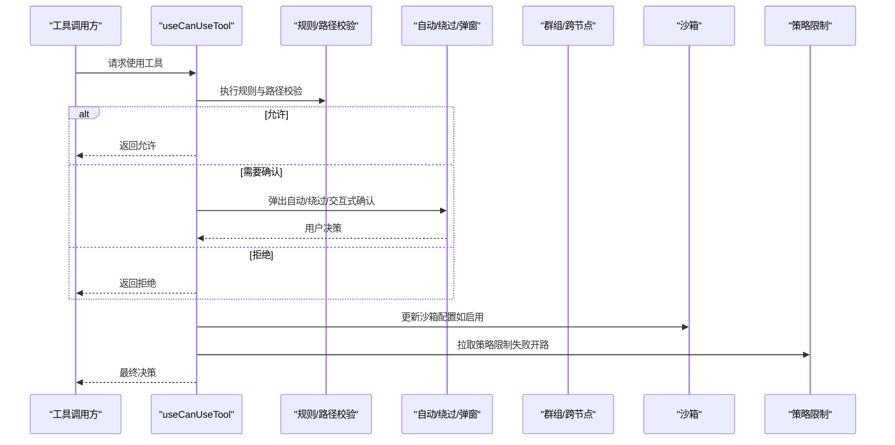
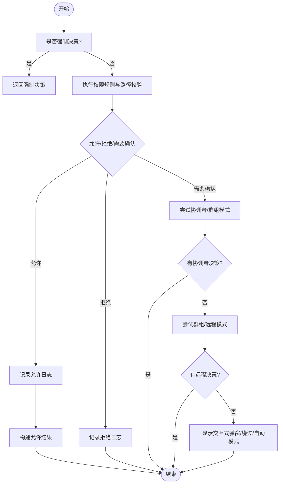
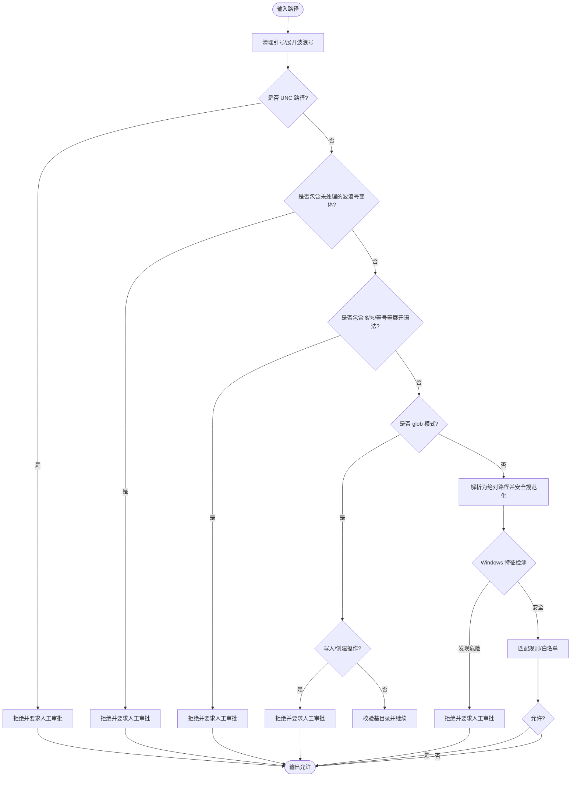
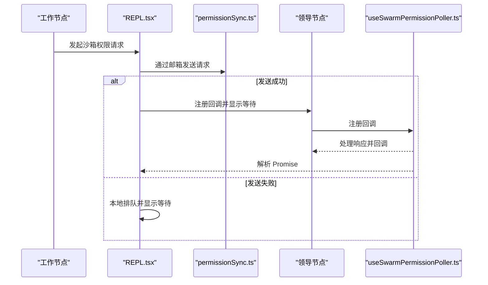
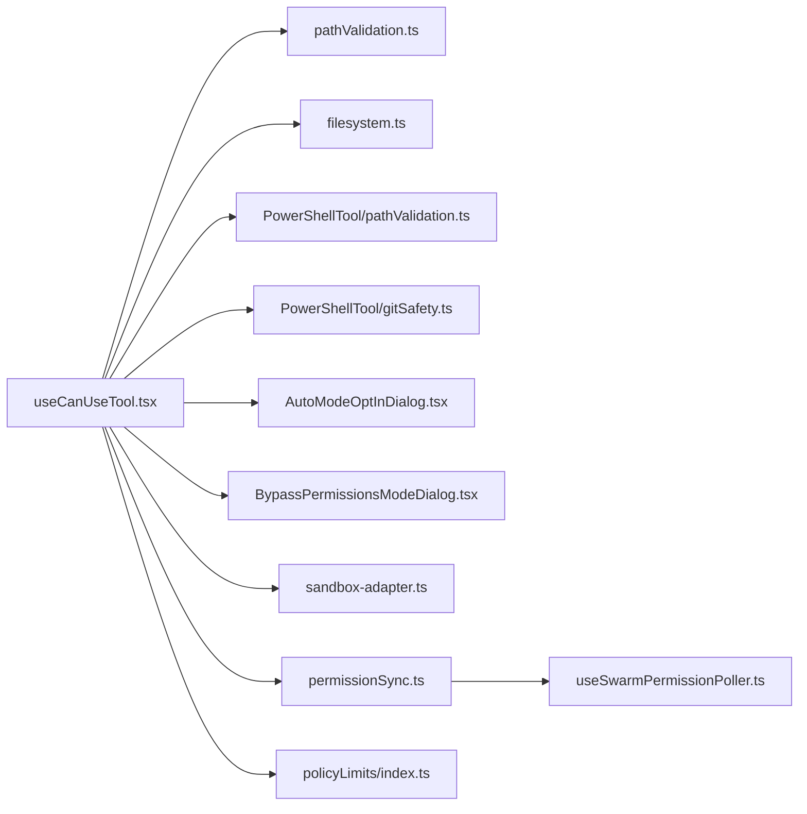

# 工具权限控制

<cite>
**本文引用的文件**
- [useCanUseTool.tsx](file://src/hooks/useCanUseTool.tsx)
- [BypassPermissionsModeDialog.tsx](file://src/components/BypassPermissionsModeDialog.tsx)
- [AutoModeOptInDialog.tsx](file://src/components/AutoModeOptInDialog.tsx)
- [index.ts](file://src/commands/permissions/index.ts)
- [pathValidation.ts](file://src/utils/permissions/pathValidation.ts)
- [filesystem.ts](file://src/utils/permissions/filesystem.ts)
- [gitSafety.ts](file://src/tools/PowerShellTool/gitSafety.ts)
- [pathValidation.ts（PowerShell）](file://src/tools/PowerShellTool/pathValidation.ts)
- [permissionSync.ts](file://src/utils/swarm/permissionSync.ts)
- [useSwarmPermissionPoller.ts](file://src/hooks/useSwarmPermissionPoller.ts)
- [REPL.tsx](file://src/screens/REPL.tsx)
- [sandbox-adapter.ts](file://src/utils/sandbox/sandbox-adapter.ts)
- [index.ts（policyLimits）](file://src/services/policyLimits/index.ts)
- [types.ts（policyLimits）](file://src/services/policyLimits/types.ts)
- [permissions.js](file://src/commands/permissions/permissions.js)
</cite>

## 目录
1. [简介](#简介)
2. [项目结构](#项目结构)
3. [核心组件](#核心组件)
4. [架构总览](#架构总览)
5. [详细组件分析](#详细组件分析)
6. [依赖关系分析](#依赖关系分析)
7. [性能考量](#性能考量)
8. [故障排查指南](#故障排查指南)
9. [结论](#结论)
10. [附录](#附录)

## 简介
本文件系统性梳理 Claude Code 的工具权限控制系统，覆盖权限模型设计理念与安全架构、自动模式与绕过权限模式的工作机制、沙箱控制与文件系统保护、权限规则定义与匹配执行、工具权限检查实现细节、用户界面与交互流程、日志与审计、策略限制与配额管理、最佳实践与扩展机制等。目标是帮助开发者与安全人员快速理解并正确使用与扩展该权限体系。

## 项目结构
权限控制相关代码主要分布在以下模块：
- 权限入口与决策：hooks/useCanUseTool.tsx 负责统一的权限决策入口，协调自动模式、交互式弹窗、协调者与群组模式。
- 用户界面：components 下的 AutoModeOptInDialog.tsx 与 BypassPermissionsModeDialog.tsx 提供自动模式与绕过权限模式的交互。
- 规则与路径校验：utils/permissions 下的 pathValidation.ts 与 filesystem.ts 实现路径合法性、危险路径检测与规则匹配；PowerShellTool 的 pathValidation.ts 与 gitSafety.ts 针对 PowerShell 场景做额外安全加固。
- 沙箱与跨进程权限：utils/sandbox/sandbox-adapter.ts 管理沙箱初始化与动态配置更新；screens/REPL.tsx 与 utils/swarm/permissionSync.ts、hooks/useSwarmPermissionPoller.ts 协同实现跨节点的沙箱权限请求与响应。
- 策略限制：services/policyLimits 提供组织级策略拉取与缓存，支持按策略键禁用功能。
- 命令入口：commands/permissions/index.ts 与命令实现 permissions.js 提供本地规则管理入口。

**图表来源**
- [useCanUseTool.tsx:28-204](file://src/hooks/useCanUseTool.tsx#L28-L204)
- [pathValidation.ts:374-486](file://src/utils/permissions/pathValidation.ts#L374-L486)
- [filesystem.ts:490-887](file://src/utils/permissions/filesystem.ts#L490-L887)
- [pathValidation.ts（PowerShell）:1028-1824](file://src/tools/PowerShellTool/pathValidation.ts#L1028-L1824)
- [gitSafety.ts:91-114](file://src/tools/PowerShellTool/gitSafety.ts#L91-L114)
- [sandbox-adapter.ts:769-803](file://src/utils/sandbox/sandbox-adapter.ts#L769-L803)
- [REPL.tsx:2225-2269](file://src/screens/REPL.tsx#L2225-L2269)
- [permissionSync.ts:758-794](file://src/utils/swarm/permissionSync.ts#L758-L794)
- [useSwarmPermissionPoller.ts:162-257](file://src/hooks/useSwarmPermissionPoller.ts#L162-L257)
- [index.ts（policyLimits）:1-361](file://src/services/policyLimits/index.ts#L1-L361)
- [types.ts（policyLimits）:1-27](file://src/services/policyLimits/types.ts#L1-L27)
- [index.ts:1-12](file://src/commands/permissions/index.ts#L1-L12)

**章节来源**
- [useCanUseTool.tsx:28-204](file://src/hooks/useCanUseTool.tsx#L28-L204)
- [index.ts:1-12](file://src/commands/permissions/index.ts#L1-L12)

## 核心组件
- 权限决策钩子：useCanUseTool 统一入口，根据工具、输入、上下文与消息生成权限决策，支持自动模式、分类器提示规则、协调者与群组模式、交互式弹窗与桥接通道回调。
- 自动模式与绕过模式对话框：AutoModeOptInDialog 与 BypassPermissionsModeDialog 提供用户选择与风险提示。
- 路径与文件系统安全：pathValidation 与 filesystem 提供路径规范化、危险模式识别、UNC/tilde/glob 等限制、Windows 特征检测与拒绝；PowerShellTool 的 pathValidation 与 gitSafety 进一步针对 PowerShell 场景做加固。
- 沙箱与跨进程：sandbox-adapter 动态刷新沙箱配置；REPL 与 permissionSync、useSwarmPermissionPoller 实现跨节点请求与响应。
- 策略限制：policyLimits 拉取组织级策略，按需禁用功能，失败时“开”（不阻断）。
- 规则管理命令：permissions 命令入口，加载本地规则管理实现。

**章节来源**
- [useCanUseTool.tsx:28-204](file://src/hooks/useCanUseTool.tsx#L28-L204)
- [AutoModeOptInDialog.tsx:1-142](file://src/components/AutoModeOptInDialog.tsx#L1-L142)
- [BypassPermissionsModeDialog.tsx:1-87](file://src/components/BypassPermissionsModeDialog.tsx#L1-L87)
- [pathValidation.ts:374-486](file://src/utils/permissions/pathValidation.ts#L374-L486)
- [filesystem.ts:490-887](file://src/utils/permissions/filesystem.ts#L490-L887)
- [pathValidation.ts（PowerShell）:1028-1824](file://src/tools/PowerShellTool/pathValidation.ts#L1028-L1824)
- [gitSafety.ts:91-114](file://src/tools/PowerShellTool/gitSafety.ts#L91-L114)
- [sandbox-adapter.ts:769-803](file://src/utils/sandbox/sandbox-adapter.ts#L769-L803)
- [REPL.tsx:2225-2269](file://src/screens/REPL.tsx#L2225-L2269)
- [permissionSync.ts:758-794](file://src/utils/swarm/permissionSync.ts#L758-L794)
- [useSwarmPermissionPoller.ts:162-257](file://src/hooks/useSwarmPermissionPoller.ts#L162-L257)
- [index.ts（policyLimits）:1-361](file://src/services/policyLimits/index.ts#L1-L361)
- [types.ts（policyLimits）:1-27](file://src/services/policyLimits/types.ts#L1-L27)
- [index.ts:1-12](file://src/commands/permissions/index.ts#L1-L12)

## 架构总览
权限系统采用“集中决策 + 多层防护 + 可插拔交互”的架构：
- 决策层：useCanUseTool 聚合规则与自动化检查，决定允许、拒绝或需要人工确认。
- 安全层：路径与文件系统安全检查在工具调用前执行，阻断高危路径与模式。
- 交互层：自动模式、绕过模式、协调者/群组模式、本地弹窗、远程桥接通道回调。
- 沙箱层：动态配置沙箱运行时，隔离潜在危险操作。
- 策略层：从远端拉取策略限制，按需禁用功能，失败开路。

**图表来源**
- [useCanUseTool.tsx:32-170](file://src/hooks/useCanUseTool.tsx#L32-L170)
- [pathValidation.ts:374-486](file://src/utils/permissions/pathValidation.ts#L374-L486)
- [AutoModeOptInDialog.tsx:1-142](file://src/components/AutoModeOptInDialog.tsx#L1-L142)
- [BypassPermissionsModeDialog.tsx:1-87](file://src/components/BypassPermissionsModeDialog.tsx#L1-L87)
- [sandbox-adapter.ts:769-803](file://src/utils/sandbox/sandbox-adapter.ts#L769-L803)
- [index.ts（policyLimits）:1-361](file://src/services/policyLimits/index.ts#L1-L361)

## 详细组件分析

### 权限决策与交互流程
- 决策来源：优先使用已有的权限决策结果；若需要人工确认，则依次尝试协调者/群组模式、本地弹窗、远程桥接通道回调。
- 自动模式：当分类器判定为“自动模式”且满足条件时，可直接放行并记录日志。
- 分类器竞速：对 Bash 工具在特定条件下进行竞速判断，命中高置信规则时可直接放行。
- 日志与审计：记录决策来源（配置/分类器/人工）、拒绝原因与通知。

**图表来源**
- [useCanUseTool.tsx:32-170](file://src/hooks/useCanUseTool.tsx#L32-L170)

**章节来源**
- [useCanUseTool.tsx:28-204](file://src/hooks/useCanUseTool.tsx#L28-L204)

### 路径验证与文件系统保护
- 路径规范化与危险模式识别：
  - UNC 网络路径、波浪号扩展变体、shell 变量/等号展开、反引号转义、glob 模式（写入场景禁止）等均被严格限制。
  - 对 Windows 的 ADS、短名、长路径前缀、尾部空格/点、DOS 设备名、连续多个点等特征进行检测，一律要求人工审批。
- 路径解析与规则匹配：
  - 使用安全解析函数获取规范路径，结合规则来源（根目录/相对路径）进行匹配。
  - PowerShell 工具额外处理提供器路径、路径穿越、反引号逃逸等复杂场景，必要时回退到“询问”。
- Git 安全：
  - 针对裸仓库 HEAD 攻击，通过将“归一化后可能逃逸的路径”在实际工作目录下解析，再判断是否回到工作目录内，作为唯一防护。

**图表来源**
- [pathValidation.ts:374-486](file://src/utils/permissions/pathValidation.ts#L374-L486)
- [filesystem.ts:490-887](file://src/utils/permissions/filesystem.ts#L490-L887)
- [pathValidation.ts（PowerShell）:1028-1824](file://src/tools/PowerShellTool/pathValidation.ts#L1028-L1824)
- [gitSafety.ts:91-114](file://src/tools/PowerShellTool/gitSafety.ts#L91-L114)

**章节来源**
- [pathValidation.ts:374-486](file://src/utils/permissions/pathValidation.ts#L374-L486)
- [filesystem.ts:490-887](file://src/utils/permissions/filesystem.ts#L490-L887)
- [pathValidation.ts（PowerShell）:1028-1824](file://src/tools/PowerShellTool/pathValidation.ts#L1028-L1824)
- [gitSafety.ts:91-114](file://src/tools/PowerShellTool/gitSafety.ts#L91-L114)

### 沙箱控制与跨节点权限
- 沙箱初始化与动态更新：从设置中读取运行时配置，初始化沙箱管理器；监听设置变化以动态更新配置。
- 跨节点请求：REPL 中发起沙箱权限请求，优先通过邮箱系统发送给领导节点；若不可用则本地排队并更新状态；领导节点注册回调并处理响应，最终回调解析 Promise。
- 回调注册与处理：使用 Map 注册请求 ID 与回调，收到响应后移除并调用，确保幂等与一致性。

**图表来源**
- [REPL.tsx:2225-2269](file://src/screens/REPL.tsx#L2225-L2269)
- [permissionSync.ts:758-794](file://src/utils/swarm/permissionSync.ts#L758-L794)
- [useSwarmPermissionPoller.ts:162-257](file://src/hooks/useSwarmPermissionPoller.ts#L162-L257)
- [sandbox-adapter.ts:769-803](file://src/utils/sandbox/sandbox-adapter.ts#L769-L803)

**章节来源**
- [sandbox-adapter.ts:769-803](file://src/utils/sandbox/sandbox-adapter.ts#L769-L803)
- [REPL.tsx:2225-2269](file://src/screens/REPL.tsx#L2225-L2269)
- [permissionSync.ts:758-794](file://src/utils/swarm/permissionSync.ts#L758-L794)
- [useSwarmPermissionPoller.ts:162-257](file://src/hooks/useSwarmPermissionPoller.ts#L162-L257)

### 权限规则定义、匹配与执行
- 规则来源与归一化：支持以根目录/相对路径形式定义规则，对 POSIX/Windows 路径差异进行转换与归一化。
- 模式匹配：对 glob、提供器路径、路径穿越等复杂场景进行静态分析，无法静态验证的路径一律要求人工审批。
- 拒绝优先：若命中拒绝规则，直接拒绝并给出建议（如改为编辑模式）。
- 执行阶段：在工具执行前完成所有规则与路径检查，确保“零信任”。

**章节来源**
- [filesystem.ts:800-887](file://src/utils/permissions/filesystem.ts#L800-L887)
- [pathValidation.ts（PowerShell）:1028-1824](file://src/tools/PowerShellTool/pathValidation.ts#L1028-L1824)

### 权限请求的用户界面与交互
- 自动模式：首次启用时弹出 AutoModeOptInDialog，说明风险与成本，支持设为默认模式。
- 绕过权限模式：BypassPermissionsModeDialog 提醒仅在沙箱容器/VM 中使用，否则承担全部责任。
- 交互式弹窗：在需要人工确认时，根据当前模式与环境选择合适的 UI 与通道（本地/远程桥接/频道）。

**章节来源**
- [AutoModeOptInDialog.tsx:1-142](file://src/components/AutoModeOptInDialog.tsx#L1-L142)
- [BypassPermissionsModeDialog.tsx:1-87](file://src/components/BypassPermissionsModeDialog.tsx#L1-L87)
- [useCanUseTool.tsx:160-167](file://src/hooks/useCanUseTool.tsx#L160-L167)

### 权限决策的日志与审计
- 记录维度：决策来源（配置/分类器/人工）、拒绝原因、分类器匹配描述、自动模式拒绝通知。
- 事件埋点：弹窗展示与接受/拒绝事件进行埋点，便于统计与审计。

**章节来源**
- [useCanUseTool.tsx:67-91](file://src/hooks/useCanUseTool.tsx#L67-L91)
- [useCanUseTool.tsx:143-155](file://src/hooks/useCanUseTool.tsx#L143-L155)

### 策略限制系统与配额管理
- 组织级策略：从远端拉取策略限制，仅包含被阻止的策略键；未出现的键视为允许。
- 缓存与重试：遵循“失败开路”，支持 ETag 缓存、304 不变更、404 无限制等语义。
- 配额与使用量：策略限制服务负责拉取与应用，具体配额逻辑由上层业务结合策略键进行控制。

**章节来源**
- [index.ts（policyLimits）:1-361](file://src/services/policyLimits/index.ts#L1-L361)
- [types.ts（policyLimits）:1-27](file://src/services/policyLimits/types.ts#L1-L27)

### 权限配置命令与本地管理
- 命令入口：permissions 命令提供本地规则管理能力，加载对应实现模块。
- 使用场景：在本地会话中增删改查工具权限规则，配合全局设置生效。

**章节来源**
- [index.ts:1-12](file://src/commands/permissions/index.ts#L1-L12)
- [permissions.js](file://src/commands/permissions/permissions.js)

## 依赖关系分析
- 决策入口依赖规则与路径校验模块，同时与 UI、沙箱、策略限制与群组权限系统耦合。
- 路径校验模块内部依赖平台特性与文件系统抽象，PowerShell 工具模块进一步增强。
- 沙箱与群组权限通过邮箱系统与回调注册解耦，降低跨进程耦合度。

**图表来源**
- [useCanUseTool.tsx:28-204](file://src/hooks/useCanUseTool.tsx#L28-L204)
- [pathValidation.ts:374-486](file://src/utils/permissions/pathValidation.ts#L374-L486)
- [filesystem.ts:490-887](file://src/utils/permissions/filesystem.ts#L490-L887)
- [pathValidation.ts（PowerShell）:1028-1824](file://src/tools/PowerShellTool/pathValidation.ts#L1028-L1824)
- [gitSafety.ts:91-114](file://src/tools/PowerShellTool/gitSafety.ts#L91-L114)
- [sandbox-adapter.ts:769-803](file://src/utils/sandbox/sandbox-adapter.ts#L769-L803)
- [permissionSync.ts:758-794](file://src/utils/swarm/permissionSync.ts#L758-L794)
- [useSwarmPermissionPoller.ts:162-257](file://src/hooks/useSwarmPermissionPoller.ts#L162-L257)
- [index.ts（policyLimits）:1-361](file://src/services/policyLimits/index.ts#L1-L361)

## 性能考量
- 路径解析与规则匹配：尽量在内存中完成，避免频繁 IO；对 Windows 特征检测与 glob 归一化采用预编译正则与缓存策略。
- 自动模式与分类器竞速：对 Bash 工具的提示规则进行竞速，命中高置信规则时直接放行，减少 UI 交互延迟。
- 沙箱配置更新：监听设置变化后异步更新，避免阻塞主流程。
- 策略限制：远端拉取采用 ETag 缓存与 304 复用，降低网络与解析开销。

## 故障排查指南
- 路径被拒绝：
  - 检查是否包含 UNC、波浪号变体、shell 展开语法、glob 模式（写入场景）、Windows 危险特征等。
  - 在 PowerShell 工具中注意提供器路径与反引号逃逸问题。
- 自动模式误判：
  - 查看分类器日志与拒绝通知，必要时调整规则或切换到手动模式。
- 沙箱权限请求无响应：
  - 确认邮箱系统可用性与领导节点回调注册；检查请求 ID 是否正确传递与处理。
- 策略限制未生效：
  - 检查远端拉取状态、ETag 缓存与错误日志；确认策略键是否存在于 restrictions 中。

**章节来源**
- [pathValidation.ts:374-486](file://src/utils/permissions/pathValidation.ts#L374-L486)
- [pathValidation.ts（PowerShell）:1028-1824](file://src/tools/PowerShellTool/pathValidation.ts#L1028-L1824)
- [useSwarmPermissionPoller.ts:162-257](file://src/hooks/useSwarmPermissionPoller.ts#L162-L257)
- [index.ts（policyLimits）:332-361](file://src/services/policyLimits/index.ts#L332-L361)

## 结论
该权限控制系统以“零信任”为核心，通过集中决策、多层安全检查、可插拔交互与动态沙箱，实现了对工具使用的精细化控制。路径与文件系统安全检查覆盖广泛攻击面，自动模式与绕过模式满足不同场景需求，策略限制提供组织级治理能力。整体设计兼顾安全性与可用性，适合在生产环境中部署与扩展。

## 附录

### 最佳实践与安全建议
- 默认启用自动模式并配合严格的规则集，仅在受控沙箱环境中启用绕过权限模式。
- 对路径输入进行严格限制，避免 UNC、波浪号变体、shell 展开语法与 glob 模式（写入场景）。
- 定期审查策略限制与规则集，结合日志与审计事件进行持续优化。
- 在群组/跨节点场景中，确保邮箱系统与回调注册稳定可靠。

### 扩展机制与自定义策略
- 新增工具权限规则：在规则归一化与匹配逻辑中扩展支持新的规则类型与来源。
- 自定义路径校验：在现有路径校验框架中增加新场景的检测与建议。
- 自定义交互流程：通过 UI 组件与回调扩展，接入新的通道（如远程桥接、频道）。
- 策略扩展：在策略限制服务中新增策略键与解析逻辑，结合业务进行配额与使用量控制。