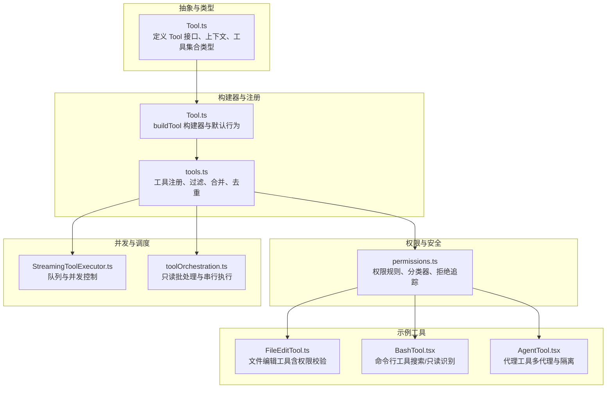
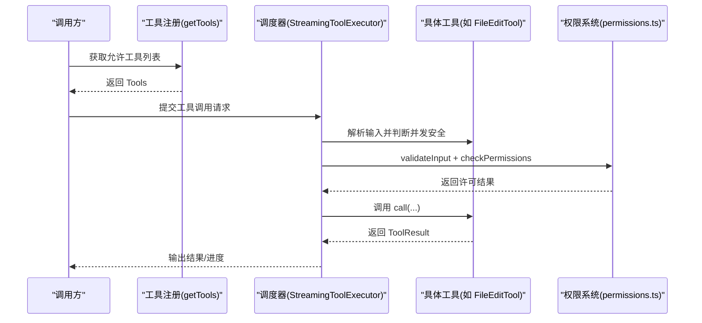
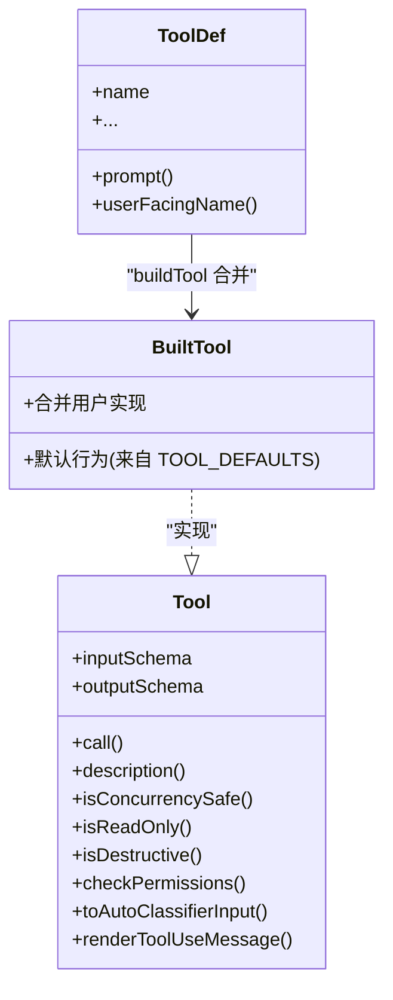
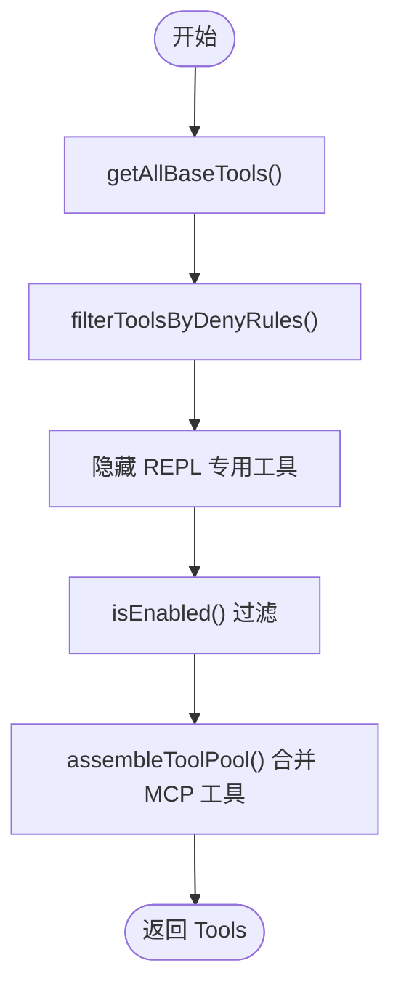
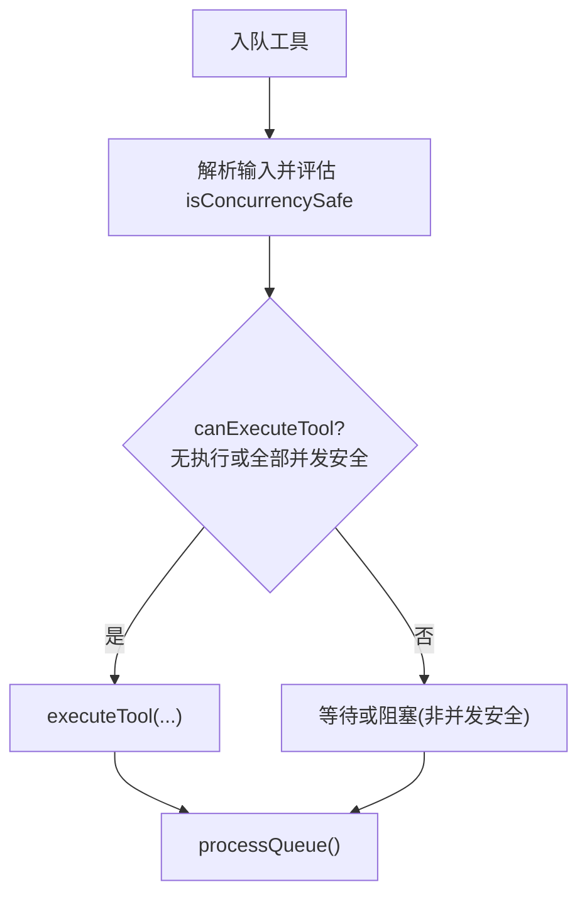
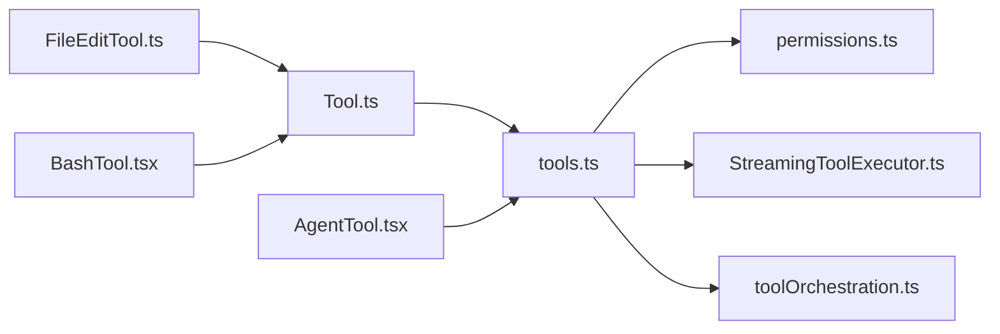

# 工具架构设计

<cite>
**本文引用的文件**
- [Tool.ts](file://src/Tool.ts)
- [tools.ts](file://src/tools.ts)
- [FileEditTool.ts](file://src/tools/FileEditTool/FileEditTool.ts)
- [BashTool.tsx](file://src/tools/BashTool/BashTool.tsx)
- [permissions.ts](file://src/utils/permissions/permissions.ts)
- [StreamingToolExecutor.ts](file://src/services/tools/StreamingToolExecutor.ts)
- [toolOrchestration.ts](file://src/services/tools/toolOrchestration.ts)
- [AgentTool.tsx](file://src/tools/AgentTool/AgentTool.tsx)
- [gitOperationTracking.ts](file://src/tools/shared/gitOperationTracking.ts)
- [toolTypes.ts](file://src/entrypoints/sdk/toolTypes.ts)
</cite>

## 目录
1. [简介](#简介)
2. [项目结构](#项目结构)
3. [核心组件](#核心组件)
4. [架构总览](#架构总览)
5. [详细组件分析](#详细组件分析)
6. [依赖关系分析](#依赖关系分析)
7. [性能考量](#性能考量)
8. [故障排查指南](#故障排查指南)
9. [结论](#结论)
10. [附录](#附录)

## 简介
本文件系统化梳理 Claude Code 的工具架构设计，围绕 Tool 基类的设计理念、核心接口与生命周期、工具注册与集合管理、工具查找算法、默认行为与安全控制、并发安全与只读/破坏性标记、构建器模式与最佳实践，以及扩展点与自定义工具开发框架进行深入说明。目标是帮助开发者在理解现有工具体系的同时，快速上手并安全地扩展工具生态。

## 项目结构
工具系统由“抽象基类 + 构建器 + 注册聚合 + 权限与安全 + 并发调度”五大部分组成：
- 抽象基类与类型：定义工具接口、上下文、进度、结果等核心契约
- 工具构建器：统一填充默认行为，确保一致性与安全性
- 工具注册与集合管理：按环境/特性动态装配工具集，支持内置与 MCP 工具合并
- 权限与安全：规则解析、分类器、拒绝追踪、沙箱等多层防护
- 并发与调度：串行/并行执行策略、只读批处理、中断行为控制

图表来源
- [Tool.ts:362-792](file://src/Tool.ts#L362-L792)
- [tools.ts:191-387](file://src/tools.ts#L191-L387)
- [permissions.ts:1-200](file://src/utils/permissions/permissions.ts#L1-L200)
- [StreamingToolExecutor.ts:73-151](file://src/services/tools/StreamingToolExecutor.ts#L73-L151)
- [toolOrchestration.ts:84-124](file://src/services/tools/toolOrchestration.ts#L84-L124)
- [FileEditTool.ts:86-200](file://src/tools/FileEditTool/FileEditTool.ts#L86-L200)
- [BashTool.tsx:83-172](file://src/tools/BashTool/BashTool.tsx#L83-L172)
- [AgentTool.tsx:196-200](file://src/tools/AgentTool/AgentTool.tsx#L196-L200)

章节来源
- [Tool.ts:362-792](file://src/Tool.ts#L362-L792)
- [tools.ts:191-387](file://src/tools.ts#L191-L387)

## 核心组件
- Tool 接口与上下文
  - 定义 call、description、inputSchema、outputSchema、isConcurrencySafe、isReadOnly、isDestructive、interruptBehavior、isSearchOrReadCommand、toAutoClassifierInput、renderToolUseMessage 等方法与属性
  - 提供 ToolUseContext、ToolPermissionContext、ToolResult、ToolProgress 等运行时上下文与结果封装
- 工具构建器 buildTool
  - 统一填充默认行为：isEnabled、isConcurrencySafe、isReadOnly、isDestructive、checkPermissions、toAutoClassifierInput、userFacingName
  - 通过类型级合并保证调用方始终获得完整能力
- 工具注册与集合管理
  - getAllBaseTools 汇总内置工具，按特性/环境条件裁剪
  - getTools 过滤禁止规则与 REPL 专用工具
  - assembleToolPool 合并内置与 MCP 工具，保持提示缓存稳定
  - 提供工具查找与匹配工具名/别名的辅助函数
- 权限与安全
  - 规则解析、分类器决策、拒绝追踪、沙箱开关、工作目录限制、只读约束等
- 并发与调度
  - StreamingToolExecutor 队列与并发控制
  - toolOrchestration 只读批处理与串行执行

章节来源
- [Tool.ts:362-792](file://src/Tool.ts#L362-L792)
- [tools.ts:191-387](file://src/tools.ts#L191-L387)
- [permissions.ts:1-200](file://src/utils/permissions/permissions.ts#L1-L200)
- [StreamingToolExecutor.ts:73-151](file://src/services/tools/StreamingToolExecutor.ts#L73-L151)
- [toolOrchestration.ts:84-124](file://src/services/tools/toolOrchestration.ts#L84-L124)

## 架构总览
工具系统以 Tool 基类为核心，通过 buildTool 统一注入默认行为；tools.ts 负责按环境/特性组装工具池，并与权限系统协作过滤；运行时由调度器根据并发策略与只读批处理策略执行工具；权限系统贯穿输入校验、权限决策与安全防护。

图表来源
- [tools.ts:269-325](file://src/tools.ts#L269-L325)
- [StreamingToolExecutor.ts:73-151](file://src/services/tools/StreamingToolExecutor.ts#L73-L151)
- [permissions.ts:1-200](file://src/utils/permissions/permissions.ts#L1-L200)
- [FileEditTool.ts:86-200](file://src/tools/FileEditTool/FileEditTool.ts#L86-L200)

## 详细组件分析

### Tool 基类与接口规范
- 核心接口
  - call(args, context, canUseTool, parentMessage, onProgress?): Promise<ToolResult<Output>>
  - description(input, options): Promise<string>
  - inputSchema: Zod 类型；inputJSONSchema?: JSON Schema 兼容
  - outputSchema?: Zod 类型
  - isConcurrencySafe(input): boolean
  - isReadOnly(input): boolean
  - isDestructive?(input): boolean
  - interruptBehavior?(): 'cancel' | 'block'
  - isSearchOrReadCommand?(input): { isSearch, isRead, isList? }
  - isOpenWorld?(input): boolean
  - requiresUserInteraction?(): boolean
  - isMcp?: boolean, isLsp?: boolean
  - shouldDefer?: boolean, alwaysLoad?: boolean
  - mcpInfo?: { serverName, toolName }
  - name: string
  - maxResultSizeChars: number
  - strict?: boolean
  - backfillObservableInput?(input: Record<string, unknown>)
  - validateInput?(input, context): Promise<ValidationResult>
  - checkPermissions(input, context): Promise<PermissionResult>
  - getPath?(input): string
  - preparePermissionMatcher?(input): Promise<(pattern: string) => boolean>
  - prompt(options): Promise<string>
  - userFacingName(input?: Partial): string
  - userFacingNameBackgroundColor?(input?: Partial): ThemeKey
  - isTransparentWrapper?(): boolean
  - getToolUseSummary?(input?: Partial): string | null
  - getActivityDescription?(input?: Partial): string | null
  - toAutoClassifierInput(input): unknown
  - mapToolResultToToolResultBlockParam(content, toolUseID)
  - renderToolResultMessage?(content, progressMessages, options)
  - extractSearchText?(out): string
  - renderToolUseMessage(input, options)
  - isResultTruncated?(output): boolean
  - renderToolUseTag?(input): ReactNode
  - renderToolUseProgressMessage?(progressMessages, options)
  - renderToolUseQueuedMessage?()
  - renderToolUseRejectedMessage?(input, options)
  - renderToolUseErrorMessage?(result, options)
  - renderGroupedToolUse?(toolUses, options)
- 生命周期与职责
  - 输入校验与权限决策在 call 前执行，失败时返回拒绝 UI 或错误消息
  - 进度回调 onProgress 支持实时 UI 更新
  - 结果渲染与摘要提取用于转录与检索
  - 只读/破坏性标记与并发安全决定执行策略

章节来源
- [Tool.ts:362-792](file://src/Tool.ts#L362-L792)

### 工具构建器模式与默认行为
- 构建器 buildTool
  - 将 ToolDef 与默认值合并，保证调用方无需实现可选默认方法
  - 默认行为（闭关策略）
    - isEnabled: true
    - isConcurrencySafe: false（保守并发安全）
    - isReadOnly: false（假设写入）
    - isDestructive: false
    - checkPermissions: 直接放行（交由通用权限系统）
    - toAutoClassifierInput: ''（跳过分类器）
    - userFacingName: 使用 name
- 最佳实践
  - 所有工具导出必须经 buildTool 包装
  - 明确覆盖 isConcurrencySafe、isReadOnly、isDestructive
  - 实现 validateInput 与 checkPermissions，确保安全边界
  - 提供 userFacingName 与 getToolUseSummary，提升用户体验

图表来源
- [Tool.ts:716-792](file://src/Tool.ts#L716-L792)

章节来源
- [Tool.ts:716-792](file://src/Tool.ts#L716-L792)

### 工具注册机制与集合管理
- 工具注册
  - getAllBaseTools：按特性/环境拼装内置工具清单
  - getTools：应用禁止规则、REPL 专用工具隐藏、isEnabled 过滤
  - assembleToolPool：内置与 MCP 工具合并，保持名称排序与去重
  - getMergedTools：返回完整工具集（包含 MCP）
- 工具查找
  - toolMatchesName：支持主名与别名匹配
  - findToolByName：从工具集合中查找

图表来源
- [tools.ts:191-387](file://src/tools.ts#L191-L387)

章节来源
- [tools.ts:191-387](file://src/tools.ts#L191-L387)

### 工具查找算法
- 名称匹配
  - toolMatchesName：比较主名与别名数组
  - findToolByName：线性遍历工具集合
- 复杂度
  - 单次查找 O(n)，工具数量有限，满足交互需求
- 建议
  - 在高频场景下可引入 Map 缓存（name -> Tool），避免重复遍历

章节来源
- [Tool.ts:345-361](file://src/Tool.ts#L345-L361)
- [tools.ts:358-367](file://src/tools.ts#L358-L367)

### 默认行为实现与安全控制策略
- 默认行为
  - 并发安全默认不安全（isConcurrencySafe: false）
  - 只读默认否（isReadOnly: false）
  - 破坏性默认否（isDestructive: false）
  - 权限默认放行（checkPermissions: 直接允许）
  - 分类器输入默认空字符串（toAutoClassifierInput: ''）
- 安全控制
  - validateInput：输入合法性与边界检查（如文件大小、路径合法性）
  - checkPermissions：结合规则、分类器、钩子与拒绝追踪综合决策
  - 沙箱与工作目录限制：Bash/PowerShell 工具使用沙箱与只读约束
  - 只读批处理：多个只读工具可连续执行，非只读串行执行

章节来源
- [Tool.ts:757-769](file://src/Tool.ts#L757-L769)
- [permissions.ts:1-200](file://src/utils/permissions/permissions.ts#L1-L200)
- [BashTool.tsx:83-172](file://src/tools/BashTool/BashTool.tsx#L83-L172)

### 并发安全性、只读属性与破坏性操作标记
- 并发安全
  - isConcurrencySafe：工具声明自身是否可与其他工具并发执行
  - StreamingToolExecutor：维护执行队列，仅当当前无执行或新工具并发安全且全部已执行工具并发安全时才执行
- 只读属性
  - isReadOnly：声明工具是否仅读取，可用于批处理优化
  - toolOrchestration：将连续只读工具归为同一批次，提升吞吐
- 破坏性操作
  - isDestructive：标记不可逆操作（删除、覆盖、发送等），用于 UI 与安全策略提示

图表来源
- [StreamingToolExecutor.ts:129-151](file://src/services/tools/StreamingToolExecutor.ts#L129-L151)
- [toolOrchestration.ts:84-124](file://src/services/tools/toolOrchestration.ts#L84-L124)

章节来源
- [StreamingToolExecutor.ts:73-151](file://src/services/tools/StreamingToolExecutor.ts#L73-L151)
- [toolOrchestration.ts:84-124](file://src/services/tools/toolOrchestration.ts#L84-L124)

### 工具构建器模式实现细节与最佳实践
- 实现要点
  - 通过类型级合并 BuiltTool<D>，确保默认键被覆盖或保留
  - 用户实现优先于默认值，保持灵活性
- 最佳实践
  - 必须覆盖 isConcurrencySafe、isReadOnly、isDestructive
  - 提供 validateInput 与 checkPermissions，明确安全边界
  - 提供 userFacingName 与 getToolUseSummary，改善 UX
  - 对 MCP 工具设置 mcpInfo，便于权限与 UI 展示

章节来源
- [Tool.ts:716-792](file://src/Tool.ts#L716-L792)

### 自定义工具开发框架与扩展点
- 开发步骤
  - 定义输入/输出 Zod 模式（或 JSON Schema）
  - 实现 call、description、prompt、render 系列方法
  - 声明 isConcurrencySafe、isReadOnly、isDestructive、interruptBehavior
  - 实现 validateInput 与 checkPermissions
  - 使用 buildTool 包装导出
- 扩展点
  - 渲染扩展：renderToolUseMessage、renderToolResultMessage、renderToolUseProgressMessage
  - 摘要与分类：getToolUseSummary、toAutoClassifierInput
  - 权限扩展：preparePermissionMatcher、getPath
  - MCP 集成：设置 isMcp、mcpInfo，配合 assembleToolPool 合并

章节来源
- [Tool.ts:362-792](file://src/Tool.ts#L362-L792)
- [tools.ts:343-365](file://src/tools.ts#L343-L365)

## 依赖关系分析

图表来源
- [Tool.ts:362-792](file://src/Tool.ts#L362-L792)
- [tools.ts:191-387](file://src/tools.ts#L191-L387)
- [permissions.ts:1-200](file://src/utils/permissions/permissions.ts#L1-L200)
- [StreamingToolExecutor.ts:73-151](file://src/services/tools/StreamingToolExecutor.ts#L73-L151)
- [toolOrchestration.ts:84-124](file://src/services/tools/toolOrchestration.ts#L84-L124)
- [FileEditTool.ts:86-200](file://src/tools/FileEditTool/FileEditTool.ts#L86-L200)
- [BashTool.tsx:83-172](file://src/tools/BashTool/BashTool.tsx#L83-L172)
- [AgentTool.tsx:196-200](file://src/tools/AgentTool/AgentTool.tsx#L196-L200)

章节来源
- [tools.ts:191-387](file://src/tools.ts#L191-L387)

## 性能考量
- 工具集合规模有限，工具查找采用线性扫描即可满足交互延迟
- 只读批处理显著提升吞吐，建议在工具实现中明确 isReadOnly
- 并发安全策略避免资源竞争，但会降低并发度；应根据工具特性合理标注
- 渲染与索引文本提取需平衡性能与可检索性，避免过度渲染

## 故障排查指南
- 工具未出现
  - 检查 getTools 是否被禁止规则过滤（filterToolsByDenyRules）
  - 检查 REPL 模式下是否被隐藏（REPL_ONLY_TOOLS）
  - 检查 isEnabled() 返回值
- 权限被拒
  - 查看 validateInput 与 checkPermissions 的返回值与错误码
  - 检查分类器与钩子决策原因（createPermissionRequestMessage）
  - 关注拒绝追踪阈值与回退提示
- 并发问题
  - 确认 isConcurrencySafe 与 isReadOnly 标记正确
  - 检查 StreamingToolExecutor 的队列状态与 canExecuteTool 判定
- 渲染异常
  - 检查 renderToolUseMessage 与 renderToolResultMessage 的输入完整性
  - 确认 extractSearchText 返回的文本与实际渲染一致

章节来源
- [tools.ts:269-325](file://src/tools.ts#L269-L325)
- [permissions.ts:137-200](file://src/utils/permissions/permissions.ts#L137-L200)
- [StreamingToolExecutor.ts:129-151](file://src/services/tools/StreamingToolExecutor.ts#L129-L151)

## 结论
该工具架构以 Tool 基类为核心，通过构建器统一默认行为，结合权限与安全系统、并发调度策略与渲染扩展点，形成高内聚、低耦合、可扩展的工具生态。开发者遵循默认行为与安全边界、正确标注并发与只读属性、实现必要的输入校验与权限检查，即可快速、安全地扩展工具体系。

## 附录
- 工具接口规范速查
  - 必备：call、inputSchema、outputSchema、isConcurrencySafe、isReadOnly、checkPermissions
  - 建议：validateInput、toAutoClassifierInput、renderToolUseMessage、getToolUseSummary
  - MCP：isMcp、mcpInfo
- SDK 工具类型
  - SdkToolDefinition：name、description、inputSchema 等字段

章节来源
- [Tool.ts:362-792](file://src/Tool.ts#L362-L792)
- [toolTypes.ts:1-9](file://src/entrypoints/sdk/toolTypes.ts#L1-L9)