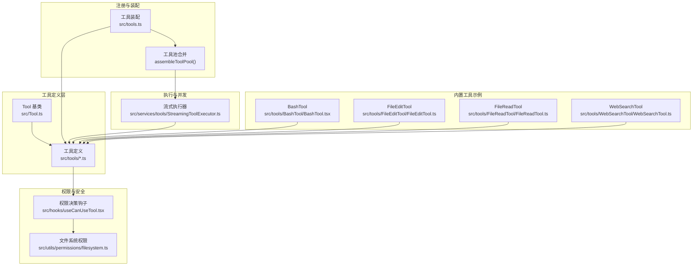
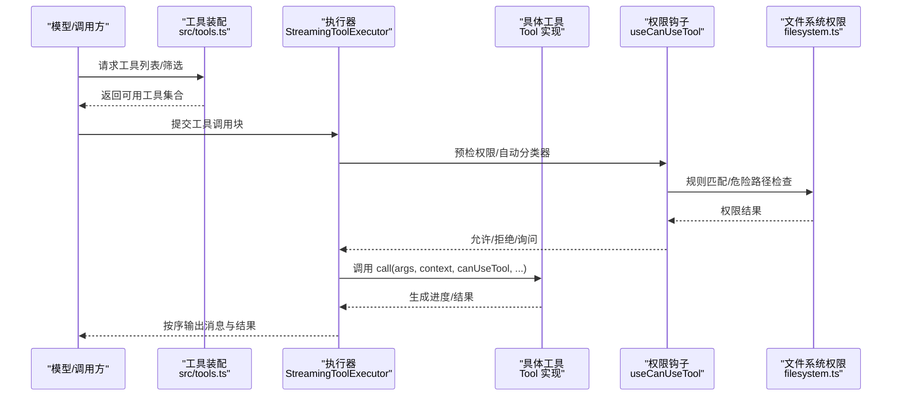
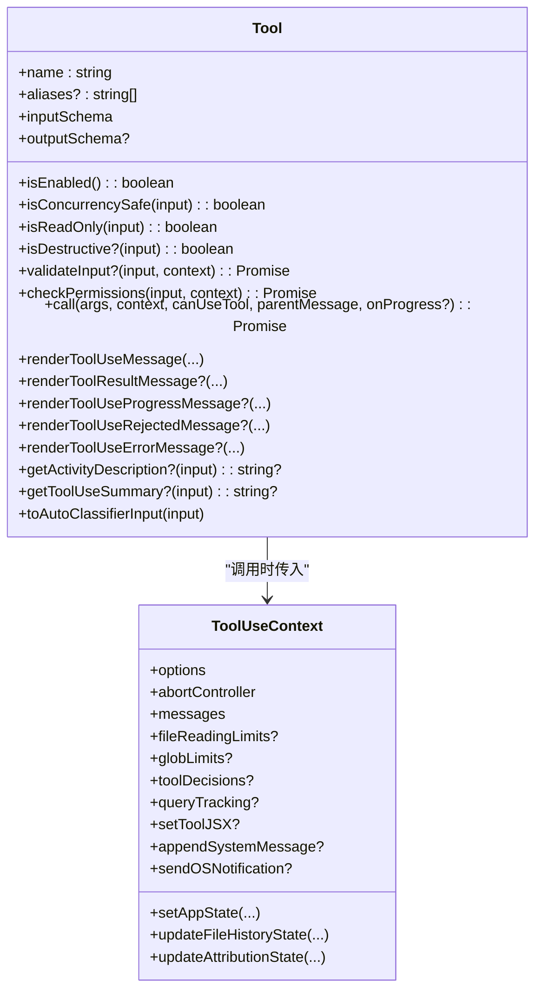
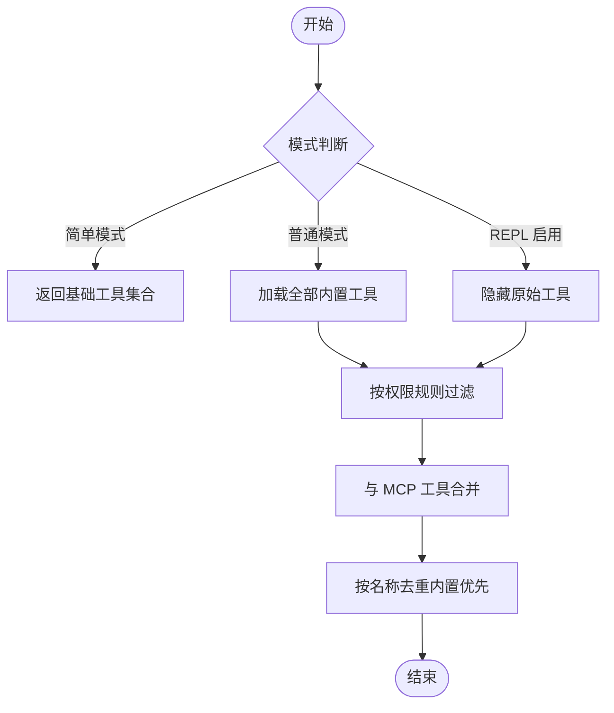
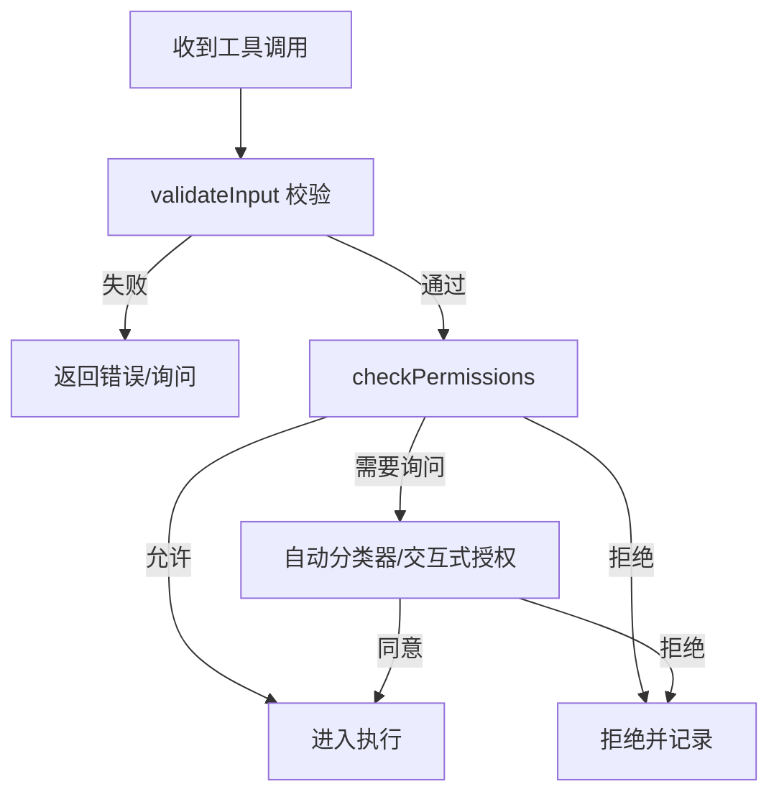
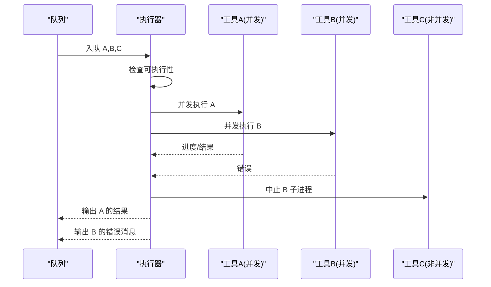
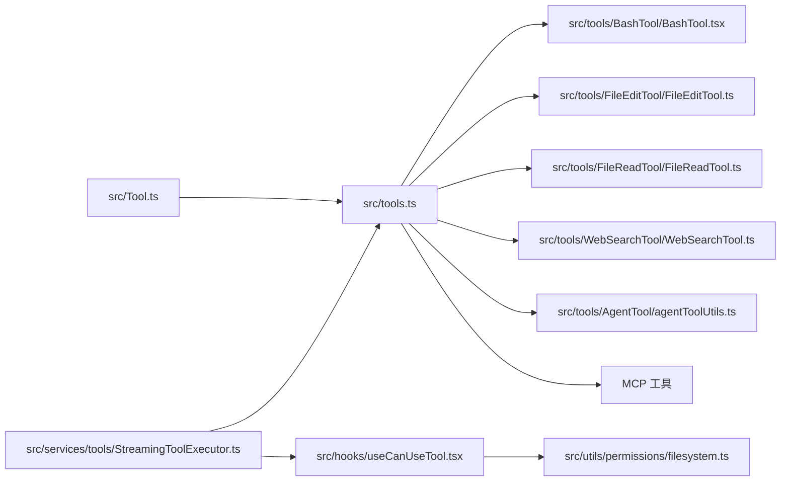

# 工具系统

<cite>
**本文引用的文件**
- [src/Tool.ts](file://src/Tool.ts)
- [src/tools.ts](file://src/tools.ts)
- [src/tools/BashTool/BashTool.tsx](file://src/tools/BashTool/BashTool.tsx)
- [src/tools/FileEditTool/FileEditTool.ts](file://src/tools/FileEditTool/FileEditTool.ts)
- [src/tools/FileReadTool/FileReadTool.ts](file://src/tools/FileReadTool/FileReadTool.ts)
- [src/tools/WebSearchTool/WebSearchTool.ts](file://src/tools/WebSearchTool/WebSearchTool.ts)
- [src/utils/permissions/filesystem.ts](file://src/utils/permissions/filesystem.ts)
- [src/hooks/useCanUseTool.tsx](file://src/hooks/useCanUseTool.tsx)
- [src/services/tools/StreamingToolExecutor.ts](file://src/services/tools/StreamingToolExecutor.ts)
- [src/tools/AgentTool/agentToolUtils.ts](file://src/tools/AgentTool/agentToolUtils.ts)
- [src/components/agents/ToolSelector.tsx](file://src/components/agents/ToolSelector.tsx)
</cite>

## 目录
1. [简介](#简介)
2. [项目结构](#项目结构)
3. [核心组件](#核心组件)
4. [架构总览](#架构总览)
5. [详细组件分析](#详细组件分析)
6. [依赖关系分析](#依赖关系分析)
7. [性能考量](#性能考量)
8. [故障排查指南](#故障排查指南)
9. [结论](#结论)
10. [附录](#附录)

## 简介
本文件系统性阐述 Claude Code 的工具系统：从 Tool 基类的设计理念、工具注册与生命周期管理，到内置工具的功能特性、权限控制与安全检查、资源管理；并提供自定义工具开发指南、工具链组合与并行执行、结果聚合策略，以及扩展机制、插件集成与性能优化建议。目标是帮助开发者快速理解并高效使用与扩展工具系统。

## 项目结构
工具系统围绕“统一的 Tool 接口 + 动态工具池 + 权限与安全框架 + 并发执行器”构建。关键模块如下：
- Tool 基类与类型系统：定义工具契约、输入输出模式、权限与 UI 渲染钩子、并发与只读等语义。
- 工具注册与装配：集中导出与筛选工具集合，支持内置工具与 MCP 工具合并。
- 内置工具：如 Bash、文件读写、搜索、浏览器等，覆盖常见开发任务。
- 权限与安全：路径规则匹配、危险目录/文件保护、自动模式分类器、交互式授权对话。
- 执行与并发：流式工具执行器，按并发安全策略调度与聚合结果。
- UI 与交互：工具使用消息渲染、进度消息、拒绝/错误 UI、摘要与活动描述。

图表来源
- [src/Tool.ts:362-695](file://src/Tool.ts#L362-L695)
- [src/tools.ts:191-387](file://src/tools.ts#L191-L387)
- [src/services/tools/StreamingToolExecutor.ts:40-151](file://src/services/tools/StreamingToolExecutor.ts#L40-L151)
- [src/hooks/useCanUseTool.tsx:28-191](file://src/hooks/useCanUseTool.tsx#L28-L191)
- [src/utils/permissions/filesystem.ts:1-200](file://src/utils/permissions/filesystem.ts#L1-L200)

章节来源
- [src/Tool.ts:1-793](file://src/Tool.ts#L1-L793)
- [src/tools.ts:1-388](file://src/tools.ts#L1-L388)

## 核心组件
- Tool 基类与类型系统
  - 定义工具契约：名称、别名、输入/输出模式（Zod）、描述、权限检查、并发安全、是否破坏性操作、是否只读、是否延迟加载、是否始终加载、UI 渲染钩子、摘要与活动描述、自动分类器输入、结果映射等。
  - 提供 buildTool 辅助函数，统一填充默认行为（如默认启用、非并发安全、非只读、非破坏性、默认权限放行、默认自动分类器输入为空）。
  - 提供工具上下文 ToolUseContext，承载命令集、调试开关、模型、工具集、MCP 客户端与资源、会话状态、通知、文件历史、内容替换预算、查询追踪等。
- 工具注册与装配
  - getAllBaseTools：汇总所有内置工具，按环境变量与特性开关动态启用/禁用。
  - getTools：根据权限上下文过滤工具，支持简单模式、REPL 模式隐藏原始工具等。
  - assembleToolPool：将内置工具与 MCP 工具合并，去重并保持提示缓存稳定排序。
  - getMergedTools：返回内置与 MCP 工具的完整列表（不进行去重）。
- 权限与安全
  - useCanUseTool：统一的权限决策入口，支持自动模式分类器、协调者/工人/交互式授权流程。
  - filesystem.ts：提供危险文件/目录白名单、路径归一化、相对路径计算、POSIX 转换、规则匹配与建议等。
- 执行与并发
  - StreamingToolExecutor：按并发安全策略排队执行工具，维护进度消息与结果顺序，支持兄弟进程在错误时快速中止。

章节来源
- [src/Tool.ts:362-792](file://src/Tool.ts#L362-L792)
- [src/tools.ts:191-387](file://src/tools.ts#L191-L387)
- [src/hooks/useCanUseTool.tsx:28-191](file://src/hooks/useCanUseTool.tsx#L28-L191)
- [src/utils/permissions/filesystem.ts:1-200](file://src/utils/permissions/filesystem.ts#L1-L200)
- [src/services/tools/StreamingToolExecutor.ts:40-151](file://src/services/tools/StreamingToolExecutor.ts#L40-L151)

## 架构总览
工具系统采用“声明式工具 + 运行时装配 + 权限前置 + 流式执行”的分层设计。调用链路概览：

图表来源
- [src/tools.ts:269-325](file://src/tools.ts#L269-L325)
- [src/services/tools/StreamingToolExecutor.ts:76-124](file://src/services/tools/StreamingToolExecutor.ts#L76-L124)
- [src/hooks/useCanUseTool.tsx:32-168](file://src/hooks/useCanUseTool.tsx#L32-L168)
- [src/utils/permissions/filesystem.ts:53-157](file://src/utils/permissions/filesystem.ts#L53-L157)

## 详细组件分析

### Tool 基类与生命周期
- 设计理念
  - 将工具抽象为“可声明、可校验、可渲染、可权限化、可并发控制”的统一实体，通过 buildTool 统一注入默认行为，降低重复代码与遗漏风险。
  - 输入/输出均以 Zod 模式声明，确保运行前严格校验与运行后安全消费。
  - 通过 ToolUseContext 注入丰富的运行期上下文（命令、MCP、文件状态、通知、系统提示、内容替换预算等），支撑复杂交互与跨组件协作。
- 生命周期阶段
  - 装配阶段：getAllBaseTools/getTools/assembleToolPool 合理筛选与合并工具。
  - 预检阶段：validateInput → checkPermissions → 自动分类器/人工确认。
  - 执行阶段：call → 进度回调 onProgress → 结果渲染。
  - 清理阶段：根据工具语义决定是否阻断新消息、是否持久化结果、是否更新文件历史等。

图表来源
- [src/Tool.ts:362-695](file://src/Tool.ts#L362-L695)
- [src/Tool.ts:158-300](file://src/Tool.ts#L158-L300)

章节来源
- [src/Tool.ts:362-792](file://src/Tool.ts#L362-L792)

### 工具注册机制与工具池装配
- 工具装配策略
  - 环境与特性开关：通过 process.env 与 feature() 控制工具可用性（如 REPL、PowerShell、WebBrowser、Workflows 等）。
  - 简单模式：仅暴露 Bash、FileRead、FileEdit 等基础工具，并在协调者模式下加入 AgentTool/TaskStopTool 等。
  - REPL 模式：隐藏原始工具，仅允许 REPL 包裹的工具直接使用。
  - MCP 工具：与内置工具合并，按名称去重，内置优先，保证提示缓存稳定性。
- 关键函数
  - getAllBaseTools：收集所有内置工具清单。
  - getTools：按权限上下文过滤内置工具。
  - assembleToolPool：合并内置与 MCP 工具并去重。
  - getMergedTools：返回完整工具列表（不强制去重）。

图表来源
- [src/tools.ts:269-365](file://src/tools.ts#L269-L365)

章节来源
- [src/tools.ts:191-387](file://src/tools.ts#L191-L387)

### 权限控制与安全检查
- 权限决策流程
  - 预检：validateInput 对输入进行业务与安全约束校验。
  - 权限：checkPermissions 委托通用权限系统，结合工具特定规则与匹配器（如通配符匹配）。
  - 自动模式：自动分类器对敏感操作进行快速判定，必要时弹出交互式授权。
  - 危险路径：filesystem.ts 提供危险文件/目录白名单、大小写归一化、POSIX 路径转换、相对路径计算等。
- 关键点
  - 文件编辑工具对团队内存文件写入进行秘密检测。
  - Bash 工具对命令进行解析与只读/破坏性检查，必要时启用沙箱。
  - 工具可通过 preparePermissionMatcher 为权限规则提供高效匹配闭包。

图表来源
- [src/hooks/useCanUseTool.tsx:32-168](file://src/hooks/useCanUseTool.tsx#L32-L168)
- [src/utils/permissions/filesystem.ts:53-157](file://src/utils/permissions/filesystem.ts#L53-L157)
- [src/tools/FileEditTool/FileEditTool.ts:137-200](file://src/tools/FileEditTool/FileEditTool.ts#L137-L200)

章节来源
- [src/hooks/useCanUseTool.tsx:28-191](file://src/hooks/useCanUseTool.tsx#L28-L191)
- [src/utils/permissions/filesystem.ts:1-200](file://src/utils/permissions/filesystem.ts#L1-L200)
- [src/tools/FileEditTool/FileEditTool.ts:137-200](file://src/tools/FileEditTool/FileEditTool.ts#L137-L200)

### 并发执行与结果聚合
- 并发策略
  - 非并发工具串行执行，避免共享资源冲突。
  - 并发安全工具可与其他并发安全工具并行执行。
  - 兄弟进程在同一工具调用中出现错误时，通过子级 AbortController 快速中止其他子进程，避免资源浪费。
- 结果聚合
  - 保持工具到达顺序，按序产出消息与进度。
  - 支持丢弃（discard）在流式回退时丢弃未完成工具的结果，避免污染后续回合。

图表来源
- [src/services/tools/StreamingToolExecutor.ts:129-151](file://src/services/tools/StreamingToolExecutor.ts#L129-L151)
- [src/services/tools/StreamingToolExecutor.ts:153-200](file://src/services/tools/StreamingToolExecutor.ts#L153-L200)

章节来源
- [src/services/tools/StreamingToolExecutor.ts:40-200](file://src/services/tools/StreamingToolExecutor.ts#L40-L200)

### 内置工具功能与实现要点

#### BashTool
- 功能特性
  - 解析命令语义，识别搜索/读取/列出命令，用于 UI 折叠与摘要。
  - 只读/破坏性命令校验，必要时启用沙箱。
  - 大量命令族支持（find/grep/rg/locate/which/whereis 等）。
  - 进度显示阈值、静默命令识别、图像输出处理等。
- 安全与资源
  - 使用 SandboxManager 与只读/破坏性检查，限制潜在危险。
  - 对兄弟进程错误进行快速中止，避免资源浪费。

章节来源
- [src/tools/BashTool/BashTool.tsx:95-200](file://src/tools/BashTool/BashTool.tsx#L95-L200)
- [src/tools/BashTool/BashTool.tsx:178-200](file://src/tools/BashTool/BashTool.tsx#L178-L200)

#### FileEditTool
- 功能特性
  - 支持多种替换策略（精确字符串、正则、首尾缀等），并进行等价性比较。
  - 对团队内存文件写入进行秘密检测。
  - 路径展开与权限匹配，防止绕过。
  - 大文件保护（最大 1GiB），避免 OOM。
- 安全与资源
  - 危险文件/目录白名单，UNC 路径安全处理。
  - 更新文件历史与 LSP 诊断清理。

章节来源
- [src/tools/FileEditTool/FileEditTool.ts:137-200](file://src/tools/FileEditTool/FileEditTool.ts#L137-L200)
- [src/utils/permissions/filesystem.ts:53-79](file://src/utils/permissions/filesystem.ts#L53-L79)

#### FileReadTool
- 功能特性
  - 支持文本、图片、PDF、Jupyter Notebook 等多格式读取。
  - 令牌上限与偏移/范围读取，避免一次性读取超大文件。
  - 设备路径阻断（/dev/zero、/proc/self/fd/0 等）。
- 安全与资源
  - 会话相关文件类型检测，用于分析日志。
  - 图像缩放与尺寸限制，PDF 分页与页数上限。

章节来源
- [src/tools/FileReadTool/FileReadTool.ts:117-128](file://src/tools/FileReadTool/FileReadTool.ts#L117-L128)
- [src/tools/FileReadTool/FileReadTool.ts:175-185](file://src/tools/FileReadTool/FileReadTool.ts#L175-L185)

#### WebSearchTool
- 功能特性
  - 基于模型能力的网络搜索工具，支持域名白/黑名单。
  - 输出包含搜索命中与模型注释，便于后续处理。
  - 最大使用次数限制（硬编码 8 次）。
- 启用条件
  - 根据提供商与模型能力动态启用（firstParty/Vertex/Foudry）。

章节来源
- [src/tools/WebSearchTool/WebSearchTool.ts:152-200](file://src/tools/WebSearchTool/WebSearchTool.ts#L152-L200)
- [src/tools/WebSearchTool/WebSearchTool.ts:168-193](file://src/tools/WebSearchTool/WebSearchTool.ts#L168-L193)

### 工具链组合与并行执行
- 组合方式
  - 通过工具池合并（assembleToolPool）将内置与 MCP 工具统一管理，保持提示缓存稳定。
  - 在 UI 层（ToolSelector）按类别组织工具（执行类、编辑类、MCP 类等），便于用户选择。
- 并行策略
  - StreamingToolExecutor 依据 isConcurrencySafe 决定是否与其他工具并行。
  - 非并发工具串行，避免资源竞争；并发工具可并行提升吞吐。
- 结果聚合
  - 保持工具到达顺序，逐个产出消息与进度，支持丢弃策略应对流式回退。

章节来源
- [src/tools.ts:343-365](file://src/tools.ts#L343-L365)
- [src/components/agents/ToolSelector.tsx:54-74](file://src/components/agents/ToolSelector.tsx#L54-L74)
- [src/services/tools/StreamingToolExecutor.ts:129-151](file://src/services/tools/StreamingToolExecutor.ts#L129-L151)

### 自定义工具开发指南
- 接口实现
  - 使用 buildTool 定义工具，至少提供 name、inputSchema、call、renderToolUseMessage 等。
  - 如需 UI 渲染，实现 renderToolResultMessage/renderToolUseProgressMessage 等钩子。
  - 若存在破坏性/只读/并发安全语义，实现相应方法（isDestructive/isReadOnly/isConcurrencySafe）。
- 参数验证
  - 在 validateInput 中进行业务与安全校验，必要时返回 ask 行为触发授权。
- 权限控制
  - 在 checkPermissions 中结合工具特定规则与 preparePermissionMatcher 提供高效匹配。
  - 对文件路径类工具，使用 expandPath 与权限匹配函数，避免路径绕过。
- 错误处理
  - 在 renderToolUseErrorMessage 中提供用户友好的错误 UI。
  - 对并发工具，注意兄弟进程错误传播与快速中止。
- 示例参考
  - BashTool：命令解析、只读/破坏性检查、沙箱与进度。
  - FileEditTool：路径展开、权限匹配、秘密检测、大文件保护。
  - WebSearchTool：模型能力启用、输出结构化结果。

章节来源
- [src/Tool.ts:783-792](file://src/Tool.ts#L783-L792)
- [src/tools/BashTool/BashTool.tsx:95-200](file://src/tools/BashTool/BashTool.tsx#L95-L200)
- [src/tools/FileEditTool/FileEditTool.ts:137-200](file://src/tools/FileEditTool/FileEditTool.ts#L137-L200)
- [src/tools/WebSearchTool/WebSearchTool.ts:152-200](file://src/tools/WebSearchTool/WebSearchTool.ts#L152-L200)

### 扩展机制与插件集成
- MCP 工具集成
  - 通过 assembleToolPool 将 MCP 工具与内置工具合并，按名称去重，内置优先。
  - 支持工具延迟加载（shouldDefer）与始终加载（alwaysLoad）策略。
- Agent 工具
  - AgentTool 支持工具白名单解析与解析后的工具集生成，便于代理按需使用工具。
- 插件与技能
  - 技能目录发现与动态加载，配合工具使用时的路径感知与条件技能激活。

章节来源
- [src/tools.ts:343-365](file://src/tools.ts#L343-L365)
- [src/tools/AgentTool/agentToolUtils.ts:162-188](file://src/tools/AgentTool/agentToolUtils.ts#L162-L188)

## 依赖关系分析

图表来源
- [src/Tool.ts:1-20](file://src/Tool.ts#L1-L20)
- [src/tools.ts:1-100](file://src/tools.ts#L1-L100)
- [src/hooks/useCanUseTool.tsx:10-27](file://src/hooks/useCanUseTool.tsx#L10-L27)
- [src/utils/permissions/filesystem.ts:1-50](file://src/utils/permissions/filesystem.ts#L1-L50)
- [src/services/tools/StreamingToolExecutor.ts:1-20](file://src/services/tools/StreamingToolExecutor.ts#L1-L20)

章节来源
- [src/Tool.ts:1-793](file://src/Tool.ts#L1-L793)
- [src/tools.ts:1-388](file://src/tools.ts#L1-L388)

## 性能考量
- 并发安全
  - 优先将并发安全工具并行化，减少整体等待时间。
  - 非并发工具串行，避免锁争用与资源冲突。
- 输入/输出体积控制
  - 工具定义中设置 maxResultSizeChars，避免超大结果直接回传。
  - 文件读取使用偏移/范围读取与令牌上限，避免一次性读取超大文件。
- 缓存与排序
  - 工具池合并时按名称排序并去重，保持提示缓存稳定，减少缓存失效。
- 执行器优化
  - 兄弟进程错误快速中止，避免无效等待。
  - 流式回退时丢弃未完成结果，避免污染后续回合。

章节来源
- [src/Tool.ts:466-467](file://src/Tool.ts#L466-L467)
- [src/tools/FileReadTool/FileReadTool.ts:175-185](file://src/tools/FileReadTool/FileReadTool.ts#L175-L185)
- [src/services/tools/StreamingToolExecutor.ts:129-151](file://src/services/tools/StreamingToolExecutor.ts#L129-L151)

## 故障排查指南
- 工具不可用
  - 检查工具是否被 deny 规则过滤（filterToolsByDenyRules）。
  - 确认环境变量与特性开关是否启用对应工具。
- 权限拒绝
  - 查看权限决策日志与自动分类器原因，必要时调整规则或手动授权。
  - 对文件路径类工具，确认 expandPath 与权限匹配逻辑。
- 并发问题
  - 确认工具是否标记为并发安全；非并发工具应串行执行。
  - 兄弟进程错误时，检查子级 AbortController 是否正确传播。
- 结果异常
  - 检查工具是否设置了 maxResultSizeChars 导致结果落盘。
  - 确认 UI 渲染钩子是否正确返回内容。

章节来源
- [src/tools.ts:260-267](file://src/tools.ts#L260-L267)
- [src/hooks/useCanUseTool.tsx:64-92](file://src/hooks/useCanUseTool.tsx#L64-L92)
- [src/services/tools/StreamingToolExecutor.ts:153-200](file://src/services/tools/StreamingToolExecutor.ts#L153-L200)

## 结论
Claude Code 的工具系统以 Tool 基类为核心，通过严格的类型约束、统一的权限与安全框架、灵活的并发执行器与工具池装配，实现了高可扩展性与安全性。开发者可以基于 buildTool 快速实现自定义工具，并通过权限钩子与安全检查保障系统稳定运行。配合 MCP 工具与 Agent 工具，系统能够满足从本地开发到云端服务的多样化需求。

## 附录
- 最佳实践
  - 明确工具语义：并发安全、只读、破坏性，有助于并发调度与安全评估。
  - 严格输入校验：在 validateInput 中覆盖边界与危险输入。
  - 合理设置 maxResultSizeChars：避免超大结果直接回传。
  - 使用 expandPath 与权限匹配：防止路径绕过与越权访问。
  - 利用自动分类器与交互式授权：在安全与效率间取得平衡。