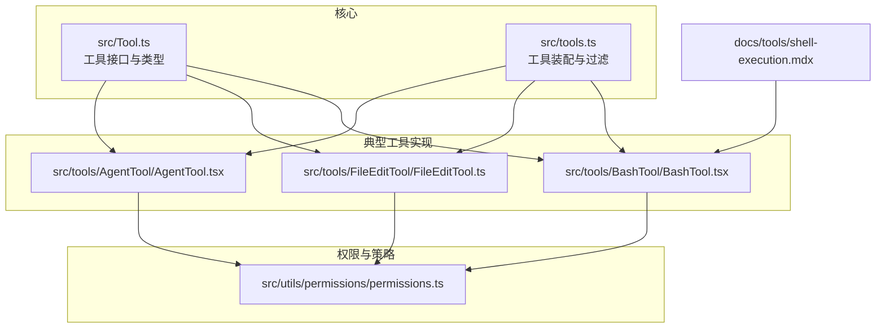
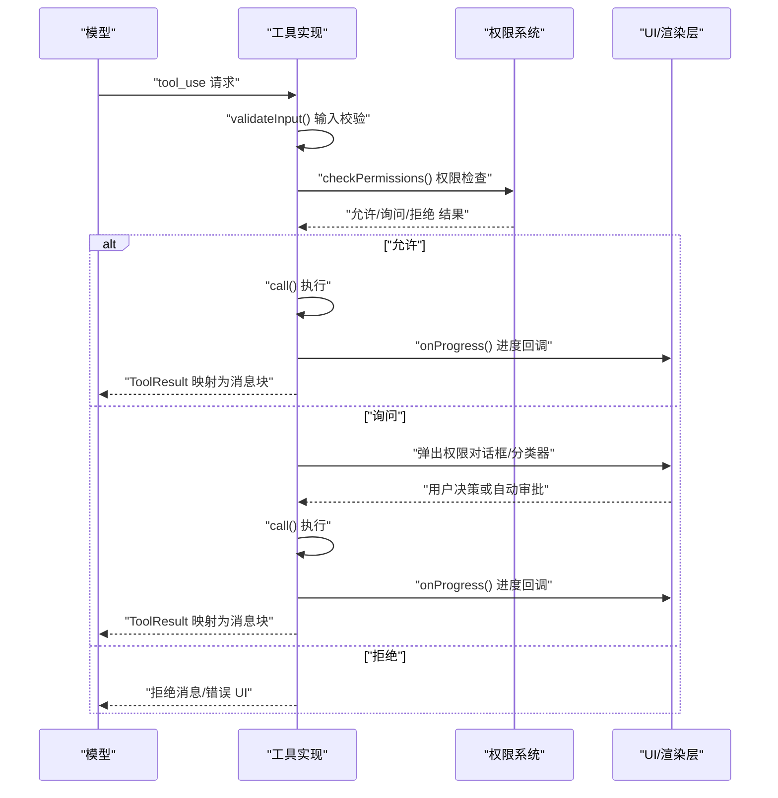
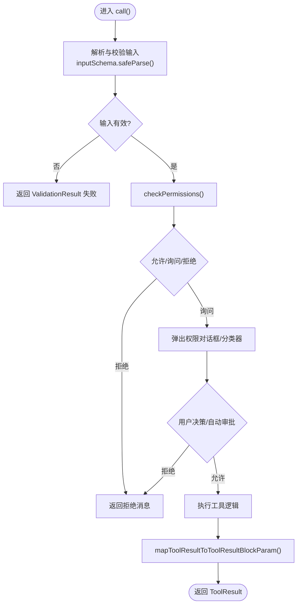
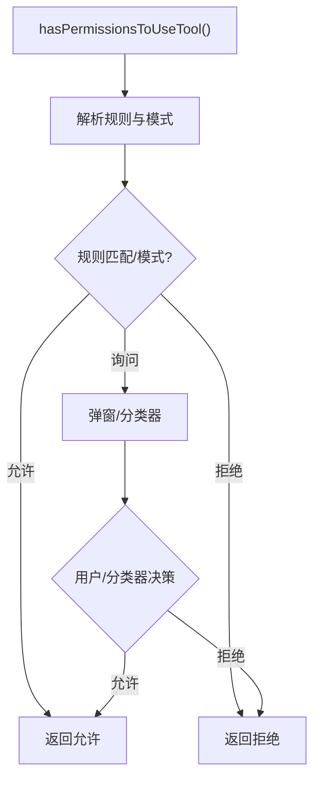
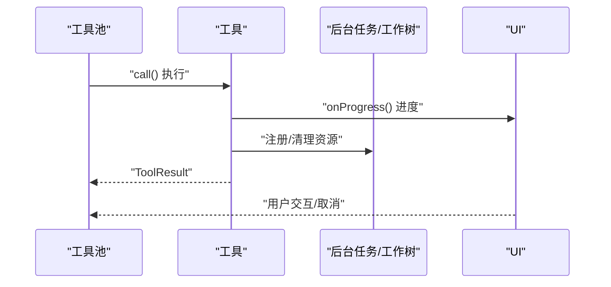
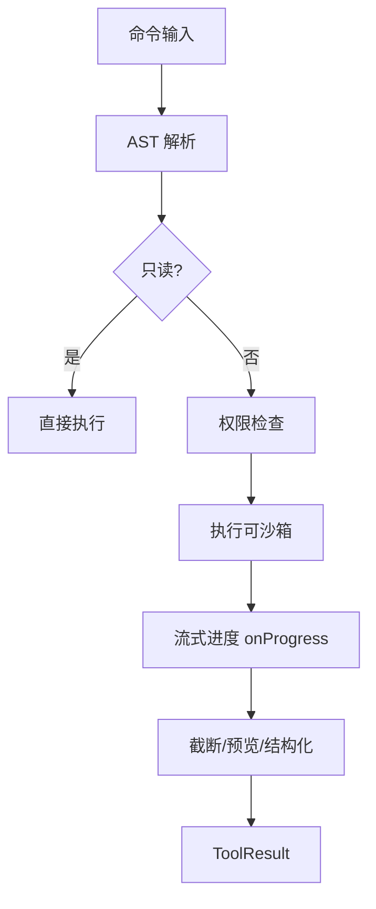
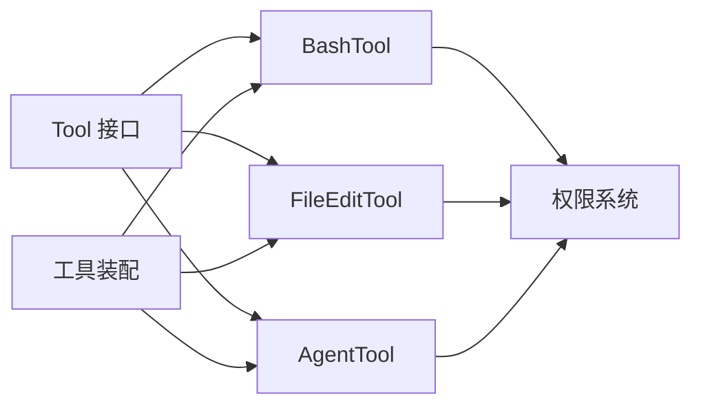

# 自定义工具开发

<cite>
**本文引用的文件**
- [src/Tool.ts](file://src/Tool.ts)
- [src/tools.ts](file://src/tools.ts)
- [src/tools/BashTool/BashTool.tsx](file://src/tools/BashTool/BashTool.tsx)
- [src/tools/FileEditTool/FileEditTool.ts](file://src/tools/FileEditTool/FileEditTool.ts)
- [src/tools/AgentTool/AgentTool.tsx](file://src/tools/AgentTool/AgentTool.tsx)
- [src/utils/permissions/permissions.ts](file://src/utils/permissions/permissions.ts)
- [docs/tools/shell-execution.mdx](file://docs/tools/shell-execution.mdx)
</cite>

## 目录
1. [简介](#简介)
2. [项目结构](#项目结构)
3. [核心组件](#核心组件)
4. [架构总览](#架构总览)
5. [详细组件分析](#详细组件分析)
6. [依赖关系分析](#依赖关系分析)
7. [性能考虑](#性能考虑)
8. [故障排查指南](#故障排查指南)
9. [结论](#结论)
10. [附录](#附录)

## 简介
本指南面向希望在 Claude Code 中开发“自定义工具”的工程师与高级用户。内容覆盖从工具设计、接口实现、输入输出模式、权限控制、生命周期管理、测试与调试，到性能优化与最佳实践的全流程。文档以仓库中的现有工具实现为依据，结合类型定义与权限体系，给出可落地的开发步骤与参考模板。

## 项目结构
- 工具接口与类型定义集中在核心类型文件中，统一约束工具的输入、输出、权限、生命周期回调等能力。
- 工具清单与装配逻辑位于工具聚合入口，负责按权限上下文过滤、合并内置与 MCP 工具，并保证提示词缓存稳定性。
- 典型工具实现（如 BashTool、FileEditTool、AgentTool）展示了权限检查、输入校验、进度上报、结果渲染与错误处理的完整链路。
- 权限系统提供规则匹配、分类器自动审批、拒绝追踪与 UI 提示等能力，贯穿工具调用的前置与运行期。

**图表来源**
- [src/Tool.ts:1-793](file://src/Tool.ts#L1-L793)
- [src/tools.ts:191-387](file://src/tools.ts#L191-L387)
- [src/tools/BashTool/BashTool.tsx:1-800](file://src/tools/BashTool/BashTool.tsx#L1-L800)
- [src/tools/FileEditTool/FileEditTool.ts:1-626](file://src/tools/FileEditTool/FileEditTool.ts#L1-L626)
- [src/tools/AgentTool/AgentTool.tsx:1-800](file://src/tools/AgentTool/AgentTool.tsx#L1-L800)
- [src/utils/permissions/permissions.ts:1-800](file://src/utils/permissions/permissions.ts#L1-L800)
- [docs/tools/shell-execution.mdx:1-169](file://docs/tools/shell-execution.mdx#L1-L169)

**章节来源**
- [src/Tool.ts:1-793](file://src/Tool.ts#L1-L793)
- [src/tools.ts:191-387](file://src/tools.ts#L191-L387)
- [docs/tools/shell-execution.mdx:1-169](file://docs/tools/shell-execution.mdx#L1-L169)

## 核心组件
- 工具接口与类型
  - 工具类型统一定义了输入/输出模式、权限检查、并发安全、只读/破坏性标记、中断行为、搜索/读取识别、用户交互需求、MCP 标识、延迟加载与始终加载、名称与别名、最大结果长度、严格模式、观察输入回填、输入校验、UI 渲染钩子、进度渲染钩子、分组渲染等。
  - 通过构建器函数统一填充默认实现，降低重复样板代码。
- 工具装配与过滤
  - 工具池装配负责合并内置与 MCP 工具，按权限上下文过滤，去重并保持稳定排序，确保提示词缓存命中率。
  - 支持“简单模式”“REPL 模式”“协调者模式”等场景下的差异化工具集。
- 典型工具实现
  - BashTool：展示只读命令判定、AST 安全解析、自动后台化、超时与输出截断、结构化输出映射、进度流式上报等。
  - FileEditTool：展示输入校验（路径存在性、大小限制、内容一致性、替换策略）、写入原子性、历史备份、LSP 通知、VS Code 差异提示、结果映射与 UI 渲染。
  - AgentTool：展示多代理启动、隔离工作树、远程隔离、异步生命周期、进度与通知、系统提示注入与工具池独立装配。

**章节来源**
- [src/Tool.ts:362-695](file://src/Tool.ts#L362-L695)
- [src/tools.ts:269-387](file://src/tools.ts#L269-L387)
- [src/tools/BashTool/BashTool.tsx:420-800](file://src/tools/BashTool/BashTool.tsx#L420-L800)
- [src/tools/FileEditTool/FileEditTool.ts:86-626](file://src/tools/FileEditTool/FileEditTool.ts#L86-L626)
- [src/tools/AgentTool/AgentTool.tsx:196-800](file://src/tools/AgentTool/AgentTool.tsx#L196-L800)

## 架构总览
下图展示了工具从“请求到执行”的整体流程，以及权限系统与 UI 渲染的关键节点。

**图表来源**
- [src/Tool.ts:379-503](file://src/Tool.ts#L379-L503)
- [src/utils/permissions/permissions.ts:473-800](file://src/utils/permissions/permissions.ts#L473-L800)
- [src/tools/BashTool/BashTool.tsx:624-800](file://src/tools/BashTool/BashTool.tsx#L624-L800)

## 详细组件分析

### 工具接口与实现要求
- 必需方法
  - call(args, context, canUseTool, parentMessage, onProgress?): Promise<ToolResult<Output>>
  - description(input, options): Promise<string>
  - inputSchema: Zod 类型（或 inputJSONSchema: JSON Schema）
  - isEnabled(): boolean
  - checkPermissions(input, context): Promise<PermissionResult>
- 可选扩展方法
  - outputSchema?: Zod 类型
  - inputsEquivalent?(a,b): 比较输入等价性，用于去重与缓存
  - isConcurrencySafe(input): 并发安全判定
  - isReadOnly(input): 只读判定
  - isDestructive?(input): 是否破坏性操作
  - interruptBehavior?(): 'cancel' | 'block'
  - isSearchOrReadCommand?(input): 搜索/读取识别，影响 UI 折叠
  - isOpenWorld?(input): 开放世界操作（如网络访问）
  - requiresUserInteraction?(): 是否需要用户交互
  - isMcp?: boolean / isLsp?: boolean
  - shouldDefer?: boolean / alwaysLoad?: boolean
  - mcpInfo?: { serverName, toolName }
  - strict?: boolean
  - backfillObservableInput?(input): 观察输入回填
  - validateInput?(input, context): 输入校验
  - getPath?(input): 获取路径（文件类工具）
  - preparePermissionMatcher?(input): 权限规则匹配器
  - prompt(options): 动态系统提示
  - userFacingName(input): 用户可见名称
  - userFacingNameBackgroundColor?(input): 名称背景色
  - isTransparentWrapper?(): 透明包装器
  - getToolUseSummary?(input): 简要摘要
  - getActivityDescription?(input): 活动描述（旋转器）
  - toAutoClassifierInput(input): 自动分类器输入
  - mapToolResultToToolResultBlockParam(content, toolUseID): 结果消息块映射
  - renderToolResultMessage?(content, progress, options): 结果消息渲染
  - extractSearchText?(out): 文本索引提取
  - renderToolUseMessage(input, options): 使用消息渲染
  - isResultTruncated?(output): 是否截断
  - renderToolUseTag?(input): 使用标签渲染
  - renderToolUseProgressMessage?(progress, options): 进度消息渲染
  - renderToolUseQueuedMessage?(): 排队消息渲染
  - renderToolUseRejectedMessage?(input, options): 拒绝消息渲染
  - renderToolUseErrorMessage?(result, options): 错误消息渲染
  - renderGroupedToolUse?(toolUses, options): 分组渲染
- 设计要点
  - 使用 buildTool 统一填充默认实现，减少样板代码。
  - inputSchema 与 outputSchema 采用 Zod，支持严格模式与类型推断；也可提供 inputJSONSchema 以兼容 JSON Schema。
  - 并发安全与只读判定对 UI 并行与安全至关重要。
  - 权限检查与输入校验分离，前者关注“是否允许”，后者关注“输入是否有效”。

**章节来源**
- [src/Tool.ts:362-695](file://src/Tool.ts#L362-L695)
- [src/Tool.ts:783-792](file://src/Tool.ts#L783-L792)

### 输入输出模式与参数验证
- 输入模式
  - Zod 模式：通过 inputSchema 定义，支持语义化数字/布尔字段（semanticNumber/semanticBoolean）与延迟求值（lazySchema）。
  - JSON Schema：部分 MCP 工具可直接提供 inputJSONSchema，避免 Zod 转换。
- 输出模式
  - outputSchema 定义结构化输出，便于 UI 渲染与后续处理。
  - mapToolResultToToolResultBlockParam 将内部输出映射为 Claude API 的 tool_result 消息块。
- 参数验证
  - validateInput：进行业务规则校验（如路径存在性、大小限制、字符串匹配、替换策略等）。
  - validateInput 与 checkPermissions 的组合确保“输入有效且已获授权”。

**图表来源**
- [src/Tool.ts:394-503](file://src/Tool.ts#L394-L503)
- [src/tools/FileEditTool/FileEditTool.ts:137-362](file://src/tools/FileEditTool/FileEditTool.ts#L137-L362)
- [src/tools/BashTool/BashTool.tsx:524-541](file://src/tools/BashTool/BashTool.tsx#L524-L541)

**章节来源**
- [src/tools/FileEditTool/FileEditTool.ts:103-132](file://src/tools/FileEditTool/FileEditTool.ts#L103-L132)
- [src/tools/BashTool/BashTool.tsx:227-296](file://src/tools/BashTool/BashTool.tsx#L227-L296)

### 权限控制实现
- 权限上下文
  - ToolPermissionContext 包含权限模式、附加工作目录、允许/拒绝/询问规则、是否可绕过权限等。
- 规则匹配
  - 支持工具级、MCP 服务器级规则；内置 deny/allow/ask 规则解析与匹配。
- 自动审批与拒绝追踪
  - auto 模式下使用分类器自动审批；拒绝追踪阈值触发 UI 提示。
- 工具侧权限逻辑
  - checkPermissions(input, context)：工具特定的权限判定（如 BashTool 的只读判定、FileEditTool 的写权限）。
  - preparePermissionMatcher(input)：为 Hook/规则匹配提供子命令解析（BashTool 使用 AST）。

**图表来源**
- [src/utils/permissions/permissions.ts:473-800](file://src/utils/permissions/permissions.ts#L473-L800)
- [src/tools/BashTool/BashTool.tsx:437-468](file://src/tools/BashTool/BashTool.tsx#L437-L468)
- [src/tools/FileEditTool/FileEditTool.ts:125-132](file://src/tools/FileEditTool/FileEditTool.ts#L125-L132)

**章节来源**
- [src/utils/permissions/permissions.ts:233-391](file://src/utils/permissions/permissions.ts#L233-L391)
- [src/tools/BashTool/BashTool.tsx:437-468](file://src/tools/BashTool/BashTool.tsx#L437-L468)
- [src/tools/FileEditTool/FileEditTool.ts:125-132](file://src/tools/FileEditTool/FileEditTool.ts#L125-L132)

### 生命周期管理
- 初始化
  - 工具装配：getTools()/assembleToolPool() 按权限上下文与 REPL/协调者模式组装工具池。
- 执行
  - validateInput → checkPermissions → call() → onProgress → mapToolResultToToolResultBlockParam。
- 进度报告
  - onProgress 回调用于 UI 流式展示（BashTool 的 generator 与进度事件）。
- 清理
  - AgentTool 的工作树隔离清理、后台任务注册与通知、VS Code/LSP 通知等。

**图表来源**
- [src/tools.ts:269-387](file://src/tools.ts#L269-L387)
- [src/tools/AgentTool/AgentTool.tsx:686-765](file://src/tools/AgentTool/AgentTool.tsx#L686-L765)
- [src/tools/BashTool/BashTool.tsx:624-724](file://src/tools/BashTool/BashTool.tsx#L624-L724)

**章节来源**
- [src/tools.ts:269-387](file://src/tools.ts#L269-L387)
- [src/tools/AgentTool/AgentTool.tsx:686-765](file://src/tools/AgentTool/AgentTool.tsx#L686-L765)
- [src/tools/BashTool/BashTool.tsx:624-724](file://src/tools/BashTool/BashTool.tsx#L624-L724)

### 典型工具实现剖析

#### BashTool：只读判定、自动后台化与输出截断
- 只读判定
  - 基于命令集合与 AST 解析，复合命令需全部满足只读条件。
- 自动后台化
  - 主线程有阻塞预算，超时自动后台化并通知。
- 输出截断与结构化
  - 大输出持久化与预览、图像输出处理、结构化内容优先。
- 进度流式上报
  - generator + resolveProgress 机制，UI 实时更新。

**图表来源**
- [docs/tools/shell-execution.mdx:1-169](file://docs/tools/shell-execution.mdx#L1-L169)
- [src/tools/BashTool/BashTool.tsx:95-172](file://src/tools/BashTool/BashTool.tsx#L95-L172)
- [src/tools/BashTool/BashTool.tsx:624-800](file://src/tools/BashTool/BashTool.tsx#L624-L800)

**章节来源**
- [docs/tools/shell-execution.mdx:1-169](file://docs/tools/shell-execution.mdx#L1-L169)
- [src/tools/BashTool/BashTool.tsx:95-172](file://src/tools/BashTool/BashTool.tsx#L95-L172)
- [src/tools/BashTool/BashTool.tsx:624-800](file://src/tools/BashTool/BashTool.tsx#L624-L800)

#### FileEditTool：原子写入、历史备份与 LSP/VS Code 通知
- 输入校验
  - 路径存在性、大小限制、内容一致性、替换策略、设置文件校验。
- 原子写入
  - 读取-校验-写入-通知-时间戳更新，保证并发安全。
- 历史备份与 UI 通知
  - 文件历史记录、LSP didChange/didSave、VS Code 差异视图。
- 结果映射与 UI 渲染
  - 结构化输出、diff 概要、用户修改提示。

**章节来源**
- [src/tools/FileEditTool/FileEditTool.ts:137-362](file://src/tools/FileEditTool/FileEditTool.ts#L137-L362)
- [src/tools/FileEditTool/FileEditTool.ts:387-595](file://src/tools/FileEditTool/FileEditTool.ts#L387-L595)

#### AgentTool：多代理、隔离与异步生命周期
- 多代理与团队
  - 支持团队成员、名称路由、权限模式继承。
- 隔离与远程
  - 工作树隔离、远程隔离、工作树变更检测与清理。
- 异步生命周期
  - 注册后台任务、进度跟踪、通知、摘要与元数据持久化。
- 工具池独立装配
  - 子代理独立权限上下文与工具池，避免父级限制。

**章节来源**
- [src/tools/AgentTool/AgentTool.tsx:196-800](file://src/tools/AgentTool/AgentTool.tsx#L196-L800)

## 依赖关系分析
- 工具接口与实现
  - 所有工具实现均遵循 Tool 接口，通过 buildTool 统一注入默认行为。
- 工具装配
  - getTools()/assembleToolPool() 统一装配内置与 MCP 工具，按权限上下文过滤与去重。
- 权限系统
  - 权限规则解析、自动审批、拒绝追踪与 UI 提示贯穿工具调用链。
- 典型工具依赖
  - BashTool 依赖安全解析、自动后台化、输出截断与沙箱。
  - FileEditTool 依赖文件系统、历史备份、LSP 与 VS Code 通知。
  - AgentTool 依赖任务系统、工作树与远程隔离。

**图表来源**
- [src/Tool.ts:362-695](file://src/Tool.ts#L362-L695)
- [src/tools.ts:269-387](file://src/tools.ts#L269-L387)
- [src/utils/permissions/permissions.ts:473-800](file://src/utils/permissions/permissions.ts#L473-L800)

**章节来源**
- [src/Tool.ts:362-695](file://src/Tool.ts#L362-L695)
- [src/tools.ts:269-387](file://src/tools.ts#L269-L387)
- [src/utils/permissions/permissions.ts:473-800](file://src/utils/permissions/permissions.ts#L473-L800)

## 性能考虑
- 输入/输出模式
  - 使用 lazySchema 减少模块加载时的计算开销；Zod 严格模式提升参数校验准确性。
- 并发与只读
  - isConcurrencySafe 与 isReadOnly 使只读工具可并行执行，避免阻塞主循环。
- 输出截断与预览
  - 大输出持久化与预览、进度轮询截断，避免上下文窗口溢出。
- 自动后台化
  - 长耗时命令自动后台化，保持主循环响应性。
- 缓存与提示词稳定性
  - 工具池去重与稳定排序，确保提示词缓存命中。

**章节来源**
- [src/tools/BashTool/BashTool.tsx:227-296](file://src/tools/BashTool/BashTool.tsx#L227-L296)
- [src/tools/BashTool/BashTool.tsx:624-800](file://src/tools/BashTool/BashTool.tsx#L624-L800)
- [src/tools.ts:343-365](file://src/tools.ts#L343-L365)

## 故障排查指南
- 权限相关
  - 检查权限规则匹配与模式（auto/dontAsk/acceptEdits/plan），查看拒绝追踪与分类器审批状态。
  - 对于 BashTool，确认只读命令判定与 AST 解析是否正确。
- 输入校验
  - FileEditTool：路径不存在、文件过大、内容不一致、替换策略冲突等问题。
  - BashTool：超时、阻塞预算、后台化策略。
- 输出与 UI
  - 输出截断导致信息缺失时，检查预览与持久化路径；确认 UI 渲染钩子是否正确实现。
- 调试技巧
  - 使用 onProgress 逐步定位卡顿点；启用严格模式与 Zod 校验快速暴露参数问题。
  - 查看工具结果映射是否符合预期，必要时添加日志与诊断事件。

**章节来源**
- [src/utils/permissions/permissions.ts:473-800](file://src/utils/permissions/permissions.ts#L473-L800)
- [src/tools/FileEditTool/FileEditTool.ts:137-362](file://src/tools/FileEditTool/FileEditTool.ts#L137-L362)
- [src/tools/BashTool/BashTool.tsx:524-541](file://src/tools/BashTool/BashTool.tsx#L524-L541)

## 结论
通过统一的工具接口、严格的输入输出模式、完善的权限体系与生命周期管理，Claude Code 为自定义工具开发提供了清晰的框架。建议在实现时优先完成输入/输出模式定义、权限检查与输入校验，再实现执行逻辑与 UI 渲染，并结合进度流式上报与输出截断策略提升用户体验与性能。

## 附录
- 开发模板与步骤
  - 定义输入/输出 Zod 模式，实现 buildTool 定义的核心方法。
  - 实现 validateInput 与 checkPermissions，确保输入有效且已获授权。
  - 实现 call() 执行逻辑，使用 onProgress 上报进度，mapToolResultToToolResultBlockParam 映射结果。
  - 实现 UI 渲染钩子（renderToolUseMessage、renderToolResultMessage、renderToolUseProgressMessage 等）。
  - 如涉及文件路径，实现 getPath() 与 preparePermissionMatcher()。
  - 在工具装配入口注册工具，确保权限过滤与去重生效。
- 参考实现
  - BashTool：只读判定、自动后台化、输出截断与进度流式上报。
  - FileEditTool：原子写入、历史备份、LSP/VS Code 通知与结构化输出。
  - AgentTool：多代理、隔离与异步生命周期。

**章节来源**
- [src/Tool.ts:362-695](file://src/Tool.ts#L362-L695)
- [src/tools/BashTool/BashTool.tsx:420-800](file://src/tools/BashTool/BashTool.tsx#L420-L800)
- [src/tools/FileEditTool/FileEditTool.ts:86-626](file://src/tools/FileEditTool/FileEditTool.ts#L86-L626)
- [src/tools/AgentTool/AgentTool.tsx:196-800](file://src/tools/AgentTool/AgentTool.tsx#L196-L800)