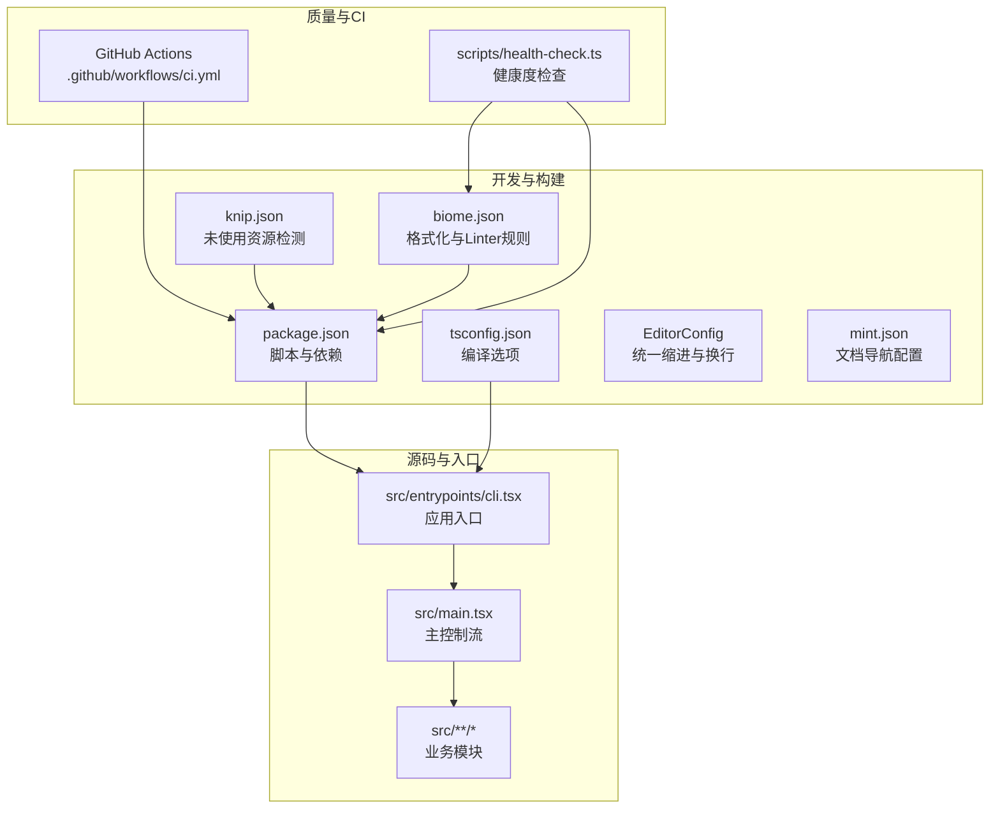
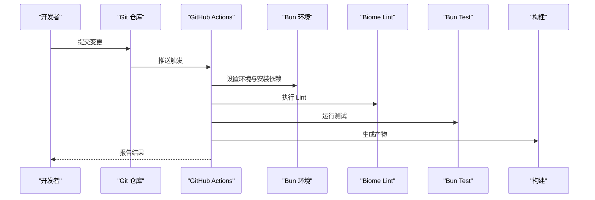
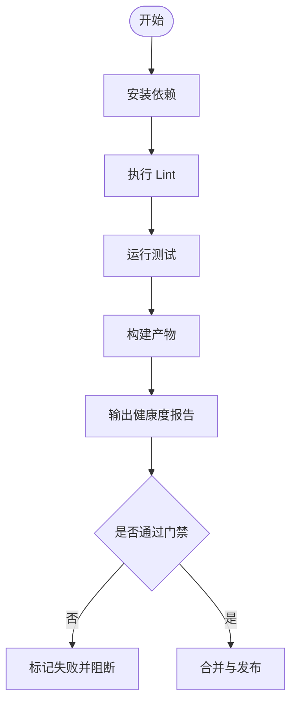
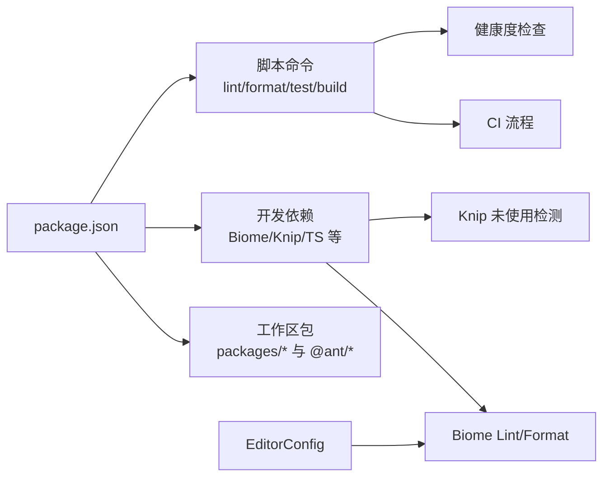

# 代码规范与质量

<cite>
**本文引用的文件**
- [tsconfig.json](file://tsconfig.json)
- [biome.json](file://biome.json)
- [package.json](file://package.json)
- [.editorconfig](file://.editorconfig)
- [knip.json](file://knip.json)
- [mint.json](file://mint.json)
- [.github/workflows/ci.yml](file://.github/workflows/ci.yml)
- [scripts/health-check.ts](file://scripts/health-check.ts)
- [src/main.tsx](file://src/main.tsx)
- [CLAUDE.md](file://CLAUDE.md)
</cite>

## 目录
1. [简介](#简介)
2. [项目结构](#项目结构)
3. [核心组件](#核心组件)
4. [架构总览](#架构总览)
5. [详细组件分析](#详细组件分析)
6. [依赖关系分析](#依赖关系分析)
7. [性能考量](#性能考量)
8. [故障排查指南](#故障排查指南)
9. [结论](#结论)
10. [附录](#附录)

## 简介
本文件面向 Claude Code 项目，系统化梳理并制定代码规范与质量标准，覆盖以下方面：
- TypeScript 配置与编译选项
- Biome 代码格式化与质量检查规则
- 命名约定、文件组织结构与注释标准
- 导入顺序与类型定义规范
- 代码审查清单与质量门禁
- 自动化工具链与持续集成实践

目标是帮助团队在多人协作中保持一致的代码风格、提升可读性与可维护性，并通过自动化工具降低技术债。

## 项目结构
该项目采用 Bun 运行时与 ESM 模块体系，主入口位于 src/entrypoints/cli.tsx，核心运行逻辑集中在 src/main.tsx 中；同时通过工作区管理内部包（packages/* 与 packages/@ant/*）。CI 使用 GitHub Actions 在 Ubuntu 环境下执行安装、Lint、测试与构建流程。

**图示来源**
- [package.json:37-49](file://package.json#L37-L49)
- [tsconfig.json:1-21](file://tsconfig.json#L1-L21)
- [.editorconfig:1-17](file://.editorconfig#L1-L17)
- [biome.json:1-115](file://biome.json#L1-L115)
- [knip.json:1-23](file://knip.json#L1-L23)
- [mint.json:1-118](file://mint.json#L1-L118)
- [.github/workflows/ci.yml:1-31](file://.github/workflows/ci.yml#L1-L31)
- [scripts/health-check.ts:1-164](file://scripts/health-check.ts#L1-L164)
- [src/main.tsx:1-800](file://src/main.tsx#L1-L800)

**章节来源**
- [package.json:1-166](file://package.json#L1-L166)
- [tsconfig.json:1-21](file://tsconfig.json#L1-L21)
- [.editorconfig:1-17](file://.editorconfig#L1-L17)
- [biome.json:1-115](file://biome.json#L1-L115)
- [knip.json:1-23](file://knip.json#L1-L23)
- [mint.json:1-118](file://mint.json#L1-L118)
- [.github/workflows/ci.yml:1-31](file://.github/workflows/ci.yml#L1-L31)
- [scripts/health-check.ts:1-164](file://scripts/health-check.ts#L1-L164)
- [src/main.tsx:1-800](file://src/main.tsx#L1-L800)

## 核心组件
- TypeScript 编译配置：目标语言、模块系统、JSX 转换、路径别名、严格性与跳过库检查等。
- Biome 格式化与 Lint：启用 VCS 集成、文件包含/排除、格式化参数（缩进、行宽、引号、分号策略）、按文件类型覆盖（TSX 行宽、分号）以及规则集开关。
- EditorConfig：统一缩进风格、换行符、字符集与尾随空白处理。
- Knip：未使用文件、导出与依赖检测，支持工作区包扫描。
- CI：Actions 使用 Bun 环境，依次执行安装、Lint、测试与构建。
- 健康度检查脚本：汇总代码规模、Biome Lint、测试、未使用资源与构建产物信息。

**章节来源**
- [tsconfig.json:1-21](file://tsconfig.json#L1-L21)
- [biome.json:1-115](file://biome.json#L1-L115)
- [.editorconfig:1-17](file://.editorconfig#L1-L17)
- [knip.json:1-23](file://knip.json#L1-L23)
- [.github/workflows/ci.yml:1-31](file://.github/workflows/ci.yml#L1-L31)
- [scripts/health-check.ts:1-164](file://scripts/health-check.ts#L1-L164)

## 架构总览
下图展示了从开发者提交到 CI 执行的关键流程，以及质量工具在其中的位置与职责边界。

**图示来源**
- [.github/workflows/ci.yml:14-31](file://.github/workflows/ci.yml#L14-L31)
- [package.json:37-49](file://package.json#L37-L49)
- [scripts/health-check.ts:58-125](file://scripts/health-check.ts#L58-L125)

## 详细组件分析

### TypeScript 配置与类型规范
- 编译目标与模块：ESNext、bundler 解析器、JSX 转换为 react-jsx。
- 严格性：关闭严格模式，开启跳过库检查，避免第三方声明文件影响。
- 输出与导入：禁止 emit，启用 ES 模块互操作与合成默认导入，允许 JSON 模块解析。
- 路径别名：src/* 映射至 ./src/*，便于相对路径简化。
- 类型声明：内置 Bun 类型，确保运行时 API 可用。

建议补充：
- 在团队内约定逐步收紧严格性，优先启用 noImplicitAny、strictNullChecks 等。
- 对于公共包，建议在工作区中增加独立 tsconfig 并开启 strict。

**章节来源**
- [tsconfig.json:2-17](file://tsconfig.json#L2-L17)
- [CLAUDE.md:30-36](file://CLAUDE.md#L30-L36)

### Biome 代码格式化与质量检查
- VCS 集成：启用 Git 客户端、忽略文件，仅对受控文件进行检查。
- 文件范围：包含所有文件，排除 dist 与特定包目录。
- 格式化：空格缩进、缩进宽度 2、行宽 80；TSX 分号强制、行宽放宽至 120；JS/脚本禁用格式化。
- Lint 规则：推荐规则开启，针对 suspicious、style、complexity、correctness、a11y、nursery 的多项规则显式关闭，以适配现有代码风格。
- JSON 格式化：关闭 JSON formatter，避免对非代码文件产生副作用。

建议补充：
- 逐步将 recommended 关闭项收敛为显式规则，减少“全局关闭”带来的维护成本。
- 对 TSX 特性（如分号）进行团队共识，确保一致性。

**章节来源**
- [biome.json:3-115](file://biome.json#L3-L115)

### EditorConfig 统一约定
- 通用：制表符缩进、缩进大小 4、LF 换行、UTF-8、去除尾随空白、末尾插入换行。
- 文档类：Markdown 不去除尾随空白；JSON/YAML/类似文件使用空格缩进、宽度 2。

建议补充：
- 在 IDE 中启用保存时自动清理尾随空白与换行，减少 CI 失败率。

**章节来源**
- [.editorconfig:1-17](file://.editorconfig#L1-L17)

### 导入顺序与模块组织
- 入口与主流程：src/entrypoints/cli.tsx 为真实入口，src/main.tsx 为控制流主干。
- 工作区包：通过 workspace:* 引用 packages/* 与 packages/@ant/*，确保本地开发与发布一致性。
- 路径别名：tsconfig 的 src/* 别名简化导入路径，避免深层相对路径。

建议补充：
- 导入顺序建议：原生/第三方依赖 → 工作区包 → src 内部模块；同组内按字母序或功能域排序。
- 对于大型模块，建议拆分导出入口并在 d.ts 中集中声明类型，减少循环依赖风险。

**章节来源**
- [package.json:30-33](file://package.json#L30-L33)
- [tsconfig.json:14-16](file://tsconfig.json#L14-L16)
- [src/main.tsx:1-100](file://src/main.tsx#L1-L100)

### 命名约定与注释标准
- 命名建议：
  - 文件：采用小驼峰或语义化短横线命名，避免缩写；组件文件以 .tsx 结尾。
  - 类型与接口：首字母大写，如 Message、AppState。
  - 常量：全大写下划线，如 MAX_RETRY。
  - 函数与变量：小驼峰，尽量语义化。
- 注释建议：
  - 公共 API 与复杂逻辑需添加 JSDoc 注释，说明用途、参数、返回值与异常。
  - 临时/试验性代码使用 TODO/XXX 标记，并附带简要说明与截止日期。
  - 重要决策与权衡在 PR 描述或变更日志中记录。

（本节为通用规范建议，不直接分析具体文件）

### 代码审查清单与质量门禁
- 代码风格
  - 通过 Biome 格式化与 Lint；无新增错误与过多警告。
  - EditorConfig 生效，无尾随空白与不一致换行。
- 类型与结构
  - 无任意类型泛滥；必要处使用明确类型或断言注释。
  - 导入顺序清晰，避免循环依赖。
- 可维护性
  - 未使用文件/导出/依赖通过 Knip 检测并清理。
  - 新增模块具备最小可用测试覆盖。
- 构建与运行
  - CI 成功；构建产物大小合理，无明显回归。
  - 健康度检查脚本通过，关键指标稳定。

**章节来源**
- [biome.json:17-78](file://biome.json#L17-L78)
- [knip.json:1-23](file://knip.json#L1-L23)
- [.github/workflows/ci.yml:23-31](file://.github/workflows/ci.yml#L23-L31)
- [scripts/health-check.ts:58-125](file://scripts/health-check.ts#L58-L125)

### 自动化工具与持续集成
- Lint：bun run lint 与 lint:fix，结合 Biome 规则与 EditorConfig。
- 测试：bun test，建议配合覆盖率阈值与失败即停策略。
- 构建：bun run build，单文件打包至 dist/cli.js。
- 健康度检查：scripts/health-check.ts 汇总 Lint、测试、未使用资源与构建状态，作为本地/CI 的质量门禁参考。

**图示来源**
- [package.json:37-49](file://package.json#L37-L49)
- [scripts/health-check.ts:130-164](file://scripts/health-check.ts#L130-L164)
- [.github/workflows/ci.yml:20-31](file://.github/workflows/ci.yml#L20-L31)

**章节来源**
- [package.json:37-49](file://package.json#L37-L49)
- [scripts/health-check.ts:1-164](file://scripts/health-check.ts#L1-L164)
- [.github/workflows/ci.yml:1-31](file://.github/workflows/ci.yml#L1-L31)

## 依赖关系分析
- 包管理与工作区：Bun 工作区管理内部包，通过 workspace:* 引用；根依赖与开发依赖集中于 package.json。
- 质量工具：Biome 作为格式化与 Lint 主体；Knip 用于未使用资源检测；EditorConfig 保障基础风格统一。
- CI 与健康度：Actions 串联安装、Lint、测试与构建；健康度脚本汇总关键指标。

**图示来源**
- [package.json:30-33](file://package.json#L30-L33)
- [package.json:51-163](file://package.json#L51-L163)
- [biome.json:1-115](file://biome.json#L1-L115)
- [knip.json:1-23](file://knip.json#L1-L23)
- [.editorconfig:1-17](file://.editorconfig#L1-L17)
- [.github/workflows/ci.yml:20-31](file://.github/workflows/ci.yml#L20-L31)
- [scripts/health-check.ts:58-125](file://scripts/health-check.ts#L58-L125)

**章节来源**
- [package.json:1-166](file://package.json#L1-L166)
- [biome.json:1-115](file://biome.json#L1-L115)
- [knip.json:1-23](file://knip.json#L1-L23)
- [.editorconfig:1-17](file://.editorconfig#L1-L17)
- [.github/workflows/ci.yml:1-31](file://.github/workflows/ci.yml#L1-L31)
- [scripts/health-check.ts:1-164](file://scripts/health-check.ts#L1-L164)

## 性能考量
- 启动与渲染：src/main.tsx 中存在延迟预取与条件加载，减少首次渲染阻塞；建议在新增功能时遵循相同模式，避免阻塞主线程。
- 构建体积：健康度检查关注 dist/cli.js 产物大小，建议通过按需加载与移除未使用依赖控制体积增长。
- Lint 与测试：在本地与 CI 中并行化任务，缩短反馈周期；对大型文件分批处理，避免一次性扫描造成卡顿。

（本节为通用指导，不直接分析具体文件）

## 故障排查指南
- Lint 失败
  - 检查 Biome 规则与覆盖配置，确认 TSX 分号与行宽设置是否符合预期。
  - 使用 lint:fix 自动修复常见问题，再手动处理复杂场景。
- 测试失败
  - 查看测试输出统计与失败用例定位；确保测试隔离与环境变量正确。
- 未使用资源告警
  - 通过 Knip 报告的未使用文件/导出/依赖进行清理，避免技术债累积。
- 构建失败
  - 关注健康度检查中的构建状态与产物大小；必要时回退最近变更或优化打包策略。
- CI 失败
  - 确认 Actions 步骤顺序与 Bun 版本；在本地复现相同步骤以缩小问题范围。

**章节来源**
- [biome.json:17-78](file://biome.json#L17-L78)
- [knip.json:1-23](file://knip.json#L1-L23)
- [scripts/health-check.ts:58-125](file://scripts/health-check.ts#L58-L125)
- [.github/workflows/ci.yml:20-31](file://.github/workflows/ci.yml#L20-L31)

## 结论
本规范以 Biome、Knip、EditorConfig 与 CI 为核心抓手，结合健康度检查脚本形成闭环的质量保障体系。建议团队在现有基础上逐步收紧规则、完善注释与测试，并通过自动化工具持续推动一致性与可维护性提升。

## 附录
- 文档导航：mint.json 定义了文档站点的导航与元数据，便于知识沉淀与检索。
- 项目概览：CLAUDE.md 提供了运行时、构建方式、入口与核心模块的高层说明，有助于新成员快速上手。

**章节来源**
- [mint.json:1-118](file://mint.json#L1-L118)
- [CLAUDE.md:1-116](file://CLAUDE.md#L1-L116)