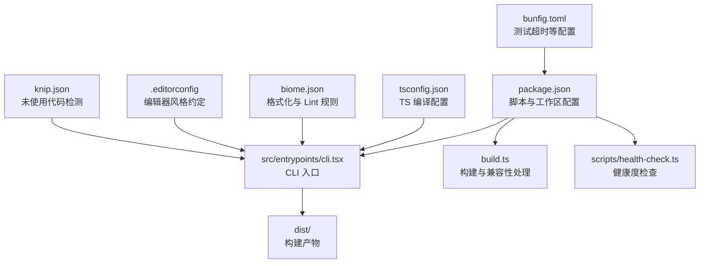
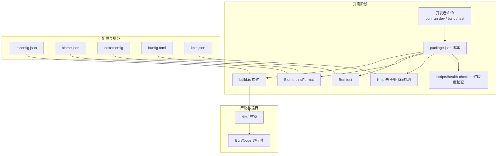
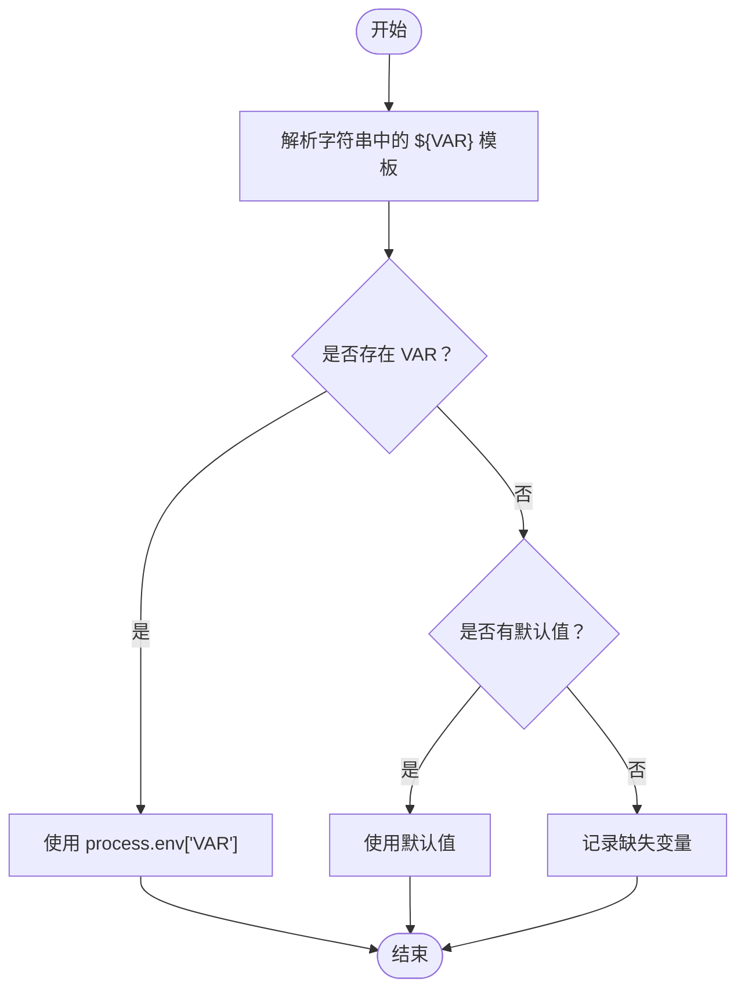
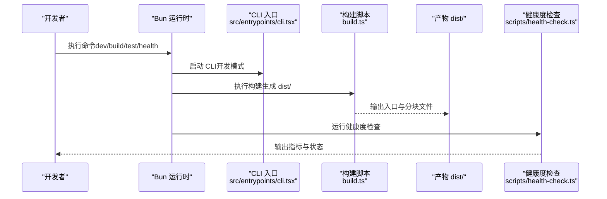
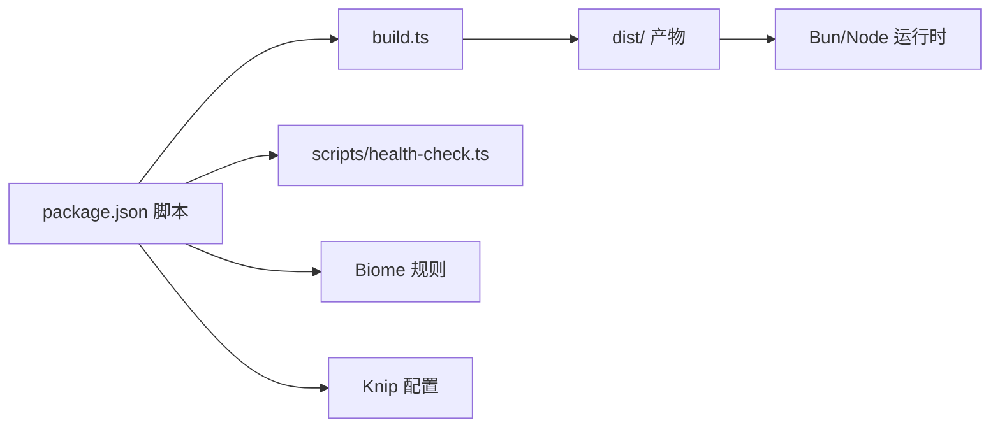

# 开发环境设置

<cite>
**本文引用的文件**
- [package.json](file://package.json)
- [README.md](file://README.md)
- [build.ts](file://build.ts)
- [tsconfig.json](file://tsconfig.json)
- [biome.json](file://biome.json)
- [bunfig.toml](file://bunfig.toml)
- [.editorconfig](file://.editorconfig)
- [knip.json](file://knip.json)
- [scripts/health-check.ts](file://scripts/health-check.ts)
- [src/services/mcp/envExpansion.ts](file://src/services/mcp/envExpansion.ts)
</cite>

## 目录
1. [简介](#简介)
2. [项目结构](#项目结构)
3. [核心组件](#核心组件)
4. [架构总览](#架构总览)
5. [详细组件分析](#详细组件分析)
6. [依赖关系分析](#依赖关系分析)
7. [性能注意事项](#性能注意事项)
8. [故障排除指南](#故障排除指南)
9. [结论](#结论)
10. [附录](#附录)

## 简介
本指南面向希望在本地搭建并开发 Claude Code（CCB）项目的工程师与贡献者，围绕以下目标展开：安装与配置必要的开发工具（Bun 运行时、Node.js 版本要求与兼容性、依赖管理）、项目克隆与初始化、环境变量配置、IDE 配置建议、调试设置与开发服务器启动流程、常见环境问题的排查与修复，以及如何验证环境配置是否正确。

## 项目结构
该项目采用 Bun workspaces 的 monorepo 结构，核心入口位于 src/entrypoints/cli.tsx，构建产物输出至 dist/，并通过 scripts/health-check.ts 提供健康度检查能力。TypeScript 编译配置、格式化与 Lint 规则分别由 tsconfig.json、biome.json 与 .editorconfig 管理；测试与脚本配置集中在 package.json 的 scripts 字段。

**图表来源**
- [package.json:37-49](file://package.json#L37-L49)
- [build.ts:10-24](file://build.ts#L10-L24)
- [scripts/health-check.ts:130-163](file://scripts/health-check.ts#L130-L163)

**章节来源**
- [package.json:30-33](file://package.json#L30-L33)
- [README.md:326-353](file://README.md#L326-L353)

## 核心组件
- 运行时与构建
  - 运行时：Bun（版本要求见“环境要求”）
  - 构建：Bun.build + 代码分割，产物 dist/cli.js 与多个 chunk 文件
  - 兼容性：构建后对 import.meta.require 的 Node.js 兼容处理
- 代码质量
  - Lint：Biome
  - 格式化：Biome（JS/TS）与 .editorconfig（通用）
  - 未使用代码：Knip
- 健康度检查：scripts/health-check.ts 汇总代码规模、Lint、测试、未使用依赖与构建状态
- TypeScript：tsconfig.json 配置严格性与模块解析策略
- 测试：Bun test，bunfig.toml 控制测试根目录与超时

**章节来源**
- [build.ts:10-47](file://build.ts#L10-L47)
- [biome.json:1-115](file://biome.json#L1-L115)
- [tsconfig.json:1-21](file://tsconfig.json#L1-L21)
- [knip.json:1-23](file://knip.json#L1-L23)
- [bunfig.toml:1-4](file://bunfig.toml#L1-L4)
- [scripts/health-check.ts:1-164](file://scripts/health-check.ts#L1-L164)

## 架构总览
下图展示了从开发者发起命令到最终产物与运行时的关系，以及健康度检查贯穿开发周期的流程。

**图表来源**
- [package.json:37-49](file://package.json#L37-L49)
- [build.ts:10-47](file://build.ts#L10-L47)
- [scripts/health-check.ts:130-163](file://scripts/health-check.ts#L130-L163)
- [tsconfig.json:1-21](file://tsconfig.json#L1-L21)
- [biome.json:1-115](file://biome.json#L1-L115)
- [.editorconfig:1-17](file://.editorconfig#L1-L17)
- [bunfig.toml:1-4](file://bunfig.toml#L1-L4)
- [knip.json:1-23](file://knip.json#L1-L23)

## 详细组件分析

### 1) 运行时与版本要求
- 运行时：Bun（版本要求见“环境要求”）
- Node.js 兼容性：构建产物可在 Node.js 运行，构建脚本对 import.meta.require 做了 Node.js 兼容替换
- 引擎声明：package.json engines.bun 指明最低版本

**章节来源**
- [README.md:32-37](file://README.md#L32-L37)
- [package.json:24-26](file://package.json#L24-L26)
- [build.ts:26-43](file://build.ts#L26-L43)

### 2) 项目克隆与初始化
- 克隆仓库后，使用 Bun 安装依赖
- 安装完成后，可直接运行开发模式或构建产物
- 项目包含 monorepo 工作区，安装时会同时处理 packages/* 与 packages/@ant/*

**章节来源**
- [README.md:39-53](file://README.md#L39-L53)
- [package.json:30-33](file://package.json#L30-L33)

### 3) 依赖安装与管理
- 使用 Bun 管理依赖与工作区
- devDependencies 中包含大量 SDK、工具库与 Biome、Knip 等开发工具
- 通过 workspaces 管理内部包，避免重复安装

**章节来源**
- [package.json:50-164](file://package.json#L50-L164)
- [package.json:30-33](file://package.json#L30-L33)

### 4) 环境变量配置
- 项目支持在 MCP 服务器配置中使用 ${VAR} 与 ${VAR:-default} 形式的环境变量展开
- 未解析到的变量会被记录为缺失变量，便于定位问题
- 建议在本地开发时为敏感或必需的变量提供默认值，减少运行时错误

**图表来源**
- [src/services/mcp/envExpansion.ts:10-38](file://src/services/mcp/envExpansion.ts#L10-L38)

**章节来源**
- [src/services/mcp/envExpansion.ts:10-38](file://src/services/mcp/envExpansion.ts#L10-L38)

### 5) IDE 配置建议
- 编辑器风格：遵循 .editorconfig 的缩进与换行约定
- TypeScript：确保 IDE 使用 tsconfig.json 的编译选项，启用路径映射
- Biome：在 IDE 中集成 Biome Lint/Format，保持与 biome.json 一致的规则集
- 调试：使用 Bun 的调试能力，结合 VS Code 或其他支持的 IDE 进行断点调试

**章节来源**
- [.editorconfig:1-17](file://.editorconfig#L1-L17)
- [tsconfig.json:1-21](file://tsconfig.json#L1-L21)
- [biome.json:1-115](file://biome.json#L1-L115)

### 6) 调试设置与开发服务器启动
- 开发模式：bun run dev 启动 CLI 交互界面
- 构建产物：bun run build 生成 dist/ 目录下的可执行入口
- 健康度检查：bun run scripts/health-check.ts 汇总代码规模、Lint、测试、未使用依赖与构建状态

**图表来源**
- [README.md:47-53](file://README.md#L47-L53)
- [build.ts:10-47](file://build.ts#L10-L47)
- [scripts/health-check.ts:130-163](file://scripts/health-check.ts#L130-L163)

**章节来源**
- [README.md:47-53](file://README.md#L47-L53)
- [build.ts:10-47](file://build.ts#L10-L47)
- [scripts/health-check.ts:130-163](file://scripts/health-check.ts#L130-L163)

### 7) 代码质量与规范
- Lint：Biome lint 与格式化，按文件类型覆盖不同规则
- 格式化：JS/TS 使用 Biome，JSON/YAML 使用 editorconfig
- 未使用代码：Knip 检测未使用文件、导出与依赖，忽略特定包与二进制
- 测试：Bun test，bunfig.toml 指定测试根目录与超时

**章节来源**
- [biome.json:1-115](file://biome.json#L1-L115)
- [.editorconfig:1-17](file://.editorconfig#L1-L17)
- [knip.json:1-23](file://knip.json#L1-L23)
- [bunfig.toml:1-4](file://bunfig.toml#L1-L4)

## 依赖关系分析
- 构建链路：package.json scripts -> build.ts -> dist/ 产物
- 质量链路：package.json scripts -> Biome/Knip -> scripts/health-check.ts
- 运行链路：dist/cli.js -> Bun/Node 运行时

**图表来源**
- [package.json:37-49](file://package.json#L37-L49)
- [build.ts:10-47](file://build.ts#L10-L47)
- [scripts/health-check.ts:130-163](file://scripts/health-check.ts#L130-L163)
- [biome.json:1-115](file://biome.json#L1-L115)
- [knip.json:1-23](file://knip.json#L1-L23)

**章节来源**
- [package.json:37-49](file://package.json#L37-L49)
- [build.ts:10-47](file://build.ts#L10-L47)
- [scripts/health-check.ts:130-163](file://scripts/health-check.ts#L130-L163)

## 性能注意事项
- 构建体积：代码分割产物较多，注意磁盘占用与冷启动时间
- Lint/Format：Biome 规则较多，建议在 CI 中缓存依赖以提升速度
- 测试：合理拆分测试用例，避免单次测试超时
- 未使用代码：定期清理未使用依赖，降低包体积与安装时间

## 故障排除指南
- 运行时版本不匹配
  - 现象：运行时报错或行为异常
  - 处理：升级到满足 engines.bun 的版本，并重新安装依赖
- 构建失败
  - 现象：bun run build 失败
  - 处理：查看构建日志，确认 import.meta.require 替换是否生效；检查 TS 编译配置与入口文件
- Lint/格式化报错
  - 现象：Biome 报告错误或警告
  - 处理：根据 biome.json 规则调整代码；必要时在 IDE 中启用自动修复
- 未使用依赖警告
  - 现象：Knip 报告未使用依赖
  - 处理：确认依赖是否仍需保留；如确需忽略，参考 knip.json 的忽略项
- 测试失败或超时
  - 现象：bun test 失败或超时
  - 处理：检查 bunfig.toml 的超时设置；拆分大型测试；确保测试环境变量齐全
- 健康度检查失败
  - 现象：scripts/health-check.ts 输出错误或警告
  - 处理：逐项检查代码规模、Lint、测试、未使用依赖与构建状态，逐一修复

**章节来源**
- [build.ts:18-24](file://build.ts#L18-L24)
- [biome.json:17-78](file://biome.json#L17-L78)
- [knip.json:6-21](file://knip.json#L6-L21)
- [bunfig.toml:1-4](file://bunfig.toml#L1-L4)
- [scripts/health-check.ts:58-125](file://scripts/health-check.ts#L58-L125)

## 结论
通过遵循本指南，您可以快速搭建并稳定地开发 Claude Code 项目。重点在于满足 Bun 版本要求、正确安装与管理依赖、遵循 Biome 与 editorconfig 的代码规范、利用健康度检查持续监控项目质量，并在出现问题时依据本指南进行定位与修复。

## 附录

### A. 环境要求与安装步骤
- 环境要求
  - Bun：满足 engines.bun 的最低版本
  - Node.js：构建产物可在 Node.js 运行，但开发与构建推荐使用 Bun
- 安装步骤
  - 克隆仓库后，使用 bun install 安装依赖
  - 运行开发模式：bun run dev
  - 构建产物：bun run build
  - 健康度检查：bun run scripts/health-check.ts

**章节来源**
- [README.md:32-53](file://README.md#L32-L53)
- [package.json:24-26](file://package.json#L24-L26)

### B. 验证环境配置
- 验证命令
  - 运行健康度检查：bun run scripts/health-check.ts
  - 查看构建产物：确认 dist/cli.js 存在且大小合理
  - 运行测试：bun test，确保通过
- 关键指标
  - 代码规模、Lint 错误/警告、测试通过/失败、未使用依赖数量、构建状态与产物大小

**章节来源**
- [scripts/health-check.ts:130-163](file://scripts/health-check.ts#L130-L163)
- [build.ts:45-47](file://build.ts#L45-L47)