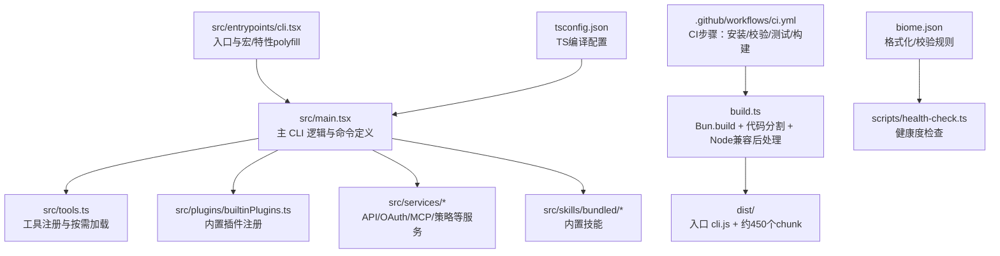
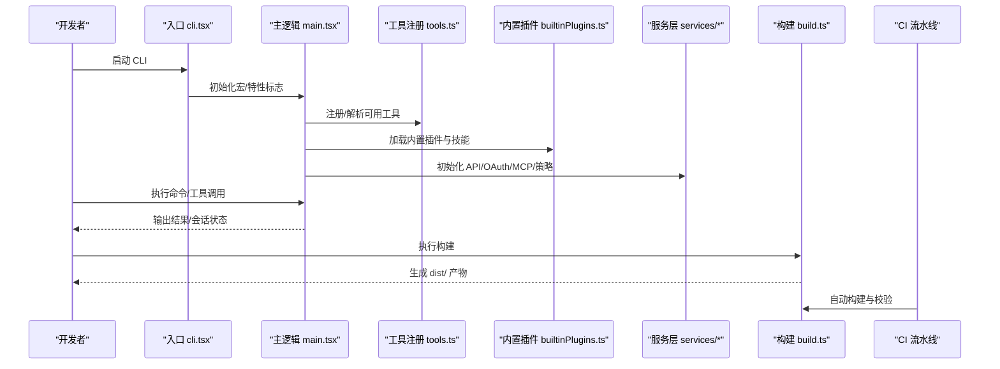
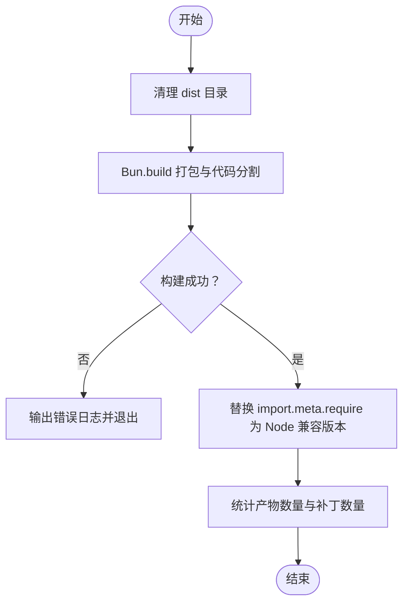
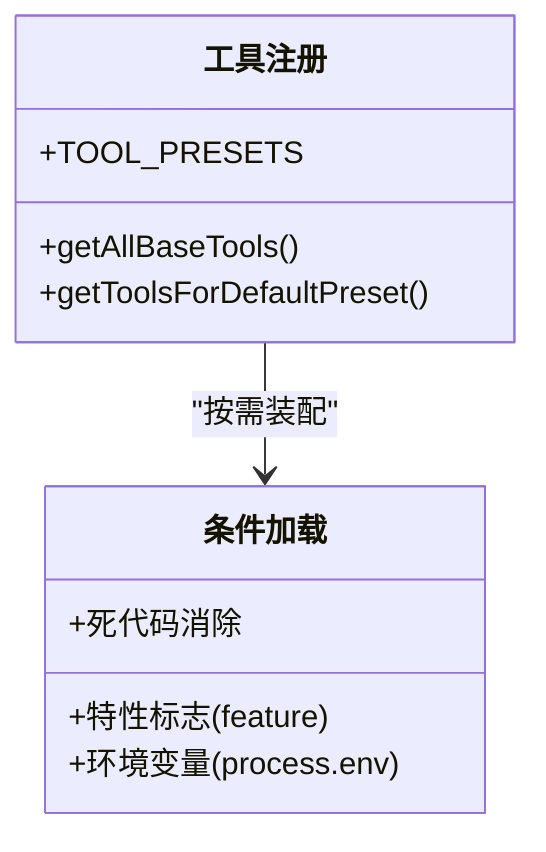
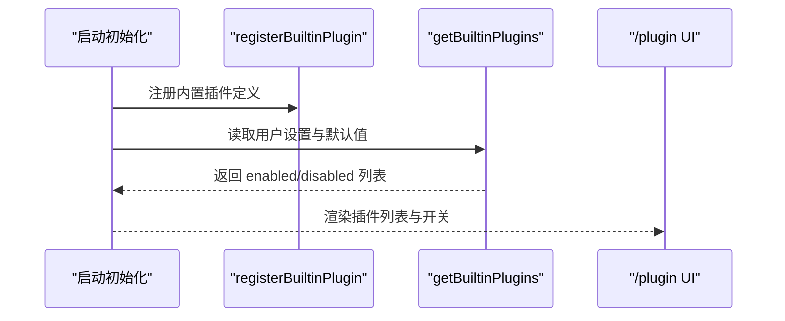
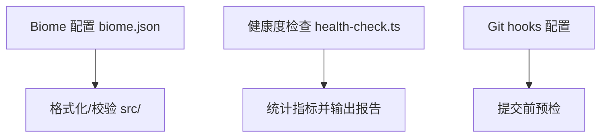
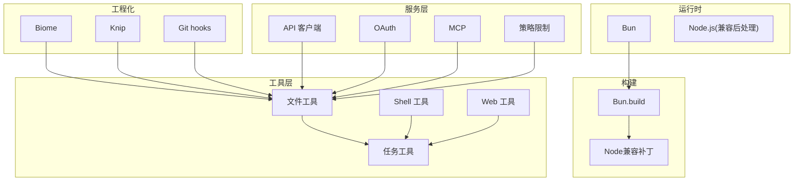

# 开发者指南

<cite>
**本文引用的文件**
- [package.json](file://package.json)
- [README.md](file://README.md)
- [biome.json](file://biome.json)
- [build.ts](file://build.ts)
- [.github/workflows/ci.yml](file://.github/workflows/ci.yml)
- [tsconfig.json](file://tsconfig.json)
- [scripts/health-check.ts](file://scripts/health-check.ts)
- [src/main.tsx](file://src/main.tsx)
- [src/tools.ts](file://src/tools.ts)
- [src/plugins/builtinPlugins.ts](file://src/plugins/builtinPlugins.ts)
- [bunfig.toml](file://bunfig.toml)
- [TODO.md](file://TODO.md)
</cite>

## 目录
1. [简介](#简介)
2. [项目结构](#项目结构)
3. [核心组件](#核心组件)
4. [架构总览](#架构总览)
5. [详细组件分析](#详细组件分析)
6. [依赖关系分析](#依赖关系分析)
7. [性能考量](#性能考量)
8. [故障排查指南](#故障排查指南)
9. [结论](#结论)
10. [附录](#附录)

## 简介
本指南面向希望参与 Claude Code（CCB）开发的工程师，覆盖开发环境设置、依赖安装、构建流程、代码规范、测试与健康检查、贡献流程、调试与性能分析、插件与工具扩展、CI/CD 与发布管理、版本控制与变更策略、代码评审与文档维护、以及社区协作等主题。文档同时提供可视化图示帮助理解系统架构与关键流程。

## 项目结构
项目采用 Bun workspaces 的 monorepo 结构，核心入口位于 src/entrypoints/cli.tsx，主逻辑在 src/main.tsx 中组织命令、工具与服务层；构建产物 dist/ 下包含入口文件与大量代码分割后的 chunk 文件；工具与技能分布在 src/tools 与 src/skills；插件体系通过 src/plugins/builtinPlugins.ts 注册与管理；工程化能力包括 Biome 格式化与校验、Knip 冗余检查、Git hooks、健康度检查脚本与 CI 流水线。

图表来源
- [build.ts:1-48](file://build.ts#L1-L48)
- [src/main.tsx:1-200](file://src/main.tsx#L1-L200)
- [src/tools.ts:1-200](file://src/tools.ts#L1-L200)
- [src/plugins/builtinPlugins.ts:1-160](file://src/plugins/builtinPlugins.ts#L1-L160)
- [.github/workflows/ci.yml:1-31](file://.github/workflows/ci.yml#L1-L31)
- [biome.json:1-115](file://biome.json#L1-L115)
- [scripts/health-check.ts:1-164](file://scripts/health-check.ts#L1-L164)
- [tsconfig.json:1-21](file://tsconfig.json#L1-L21)

章节来源
- [README.md:326-353](file://README.md#L326-L353)
- [package.json:30-49](file://package.json#L30-L49)

## 核心组件
- 入口与运行时
  - 入口文件注入特性标志与宏 polyfill，确保在开发与构建阶段行为一致。
  - 主逻辑集中于 src/main.tsx，负责命令解析、权限初始化、工具与插件加载、会话与上下文管理。
- 工具系统
  - 工具通过 src/tools.ts 统一注册，并根据特性标志与环境变量进行按需加载与死代码消除。
- 插件系统
  - 内置插件通过 src/plugins/builtinPlugins.ts 注册，支持启用/禁用、技能/钩子/MCP 服务器聚合。
- 构建与兼容
  - build.ts 使用 Bun.build 进行代码分割，随后对 import.meta.require 做 Node.js 兼容替换，保证产物可在 Node 环境运行。
- 工程化与质量保障
  - Biome 格式化与校验、Knip 冗余检查、Git hooks、健康度检查脚本与 CI 流水线共同保障代码质量与一致性。

章节来源
- [src/main.tsx:1-200](file://src/main.tsx#L1-L200)
- [src/tools.ts:1-200](file://src/tools.ts#L1-L200)
- [src/plugins/builtinPlugins.ts:1-160](file://src/plugins/builtinPlugins.ts#L1-L160)
- [build.ts:1-48](file://build.ts#L1-L48)
- [biome.json:1-115](file://biome.json#L1-L115)
- [scripts/health-check.ts:1-164](file://scripts/health-check.ts#L1-L164)

## 架构总览
下图展示了从 CLI 入口到工具与服务层的关键交互，以及构建产物与 CI 的关系。

图表来源
- [src/main.tsx:1-200](file://src/main.tsx#L1-L200)
- [src/tools.ts:1-200](file://src/tools.ts#L1-L200)
- [src/plugins/builtinPlugins.ts:1-160](file://src/plugins/builtinPlugins.ts#L1-L160)
- [build.ts:1-48](file://build.ts#L1-L48)
- [.github/workflows/ci.yml:1-31](file://.github/workflows/ci.yml#L1-L31)

## 详细组件分析

### 构建与发布流程
- 构建步骤
  - 清理 dist 目录，使用 Bun.build 进行打包与代码分割，目标为 bun。
  - 对产物中的 import.meta.require 替换为 Node.js 兼容版本，提升跨运行时兼容性。
  - 控制台输出产物数量与 Node 兼容补丁数量。
- 发布与兼容
  - 产物可在 Bun 与 Node 环境运行，适合发布到私有源或公共源。
- CI 集成
  - GitHub Actions 使用 oven-sh/setup-bun@v2，安装冻结锁文件依赖，依次执行 Lint、Test、Build。

图表来源
- [build.ts:1-48](file://build.ts#L1-L48)
- [.github/workflows/ci.yml:29-31](file://.github/workflows/ci.yml#L29-L31)

章节来源
- [build.ts:1-48](file://build.ts#L1-L48)
- [.github/workflows/ci.yml:1-31](file://.github/workflows/ci.yml#L1-L31)

### 工具系统与按需加载
- 工具注册
  - 工具在 src/tools.ts 中集中导入与注册，结合特性标志与环境变量进行条件加载，实现死代码消除与运行时按需装配。
- 工具预设与筛选
  - 提供工具预设与按 isEnabled() 过滤的机制，确保只暴露可用工具集合。
- 条件工具
  - 部分工具受特性标志（如 PROACTIVE/KAIROS/WEB_BROWSER_TOOL 等）或环境变量控制，未满足条件时返回空或禁用。

图表来源
- [src/tools.ts:156-200](file://src/tools.ts#L156-L200)

章节来源
- [src/tools.ts:1-200](file://src/tools.ts#L1-L200)

### 插件系统与内置插件
- 注册机制
  - 内置插件通过 registerBuiltinPlugin 注册，支持启用/禁用、技能/钩子/MCP 服务器聚合。
- 生命周期
  - 在启动时初始化，按用户设置与默认值决定启用状态，最终以 LoadedPlugin 形式参与会话与命令解析。
- 与技能的区别
  - 内置插件与“捆绑技能”不同，前者出现在 /plugin UI 的“内置”分组，后者作为可调用的技能集合。

图表来源
- [src/plugins/builtinPlugins.ts:25-102](file://src/plugins/builtinPlugins.ts#L25-L102)

章节来源
- [src/plugins/builtinPlugins.ts:1-160](file://src/plugins/builtinPlugins.ts#L1-L160)

### 代码规范与质量保障
- Biome 格式化与校验
  - 通过 biome.json 配置启用格式化与 linter，针对 .tsx 与脚本/包目录分别设置不同策略，关闭部分规则以适配反编译代码。
- 健康度检查
  - scripts/health-check.ts 汇总代码规模、Lint、测试、冗余代码与构建状态，输出带状态标签的报告并根据错误计数决定退出码。
- Git hooks
  - 通过 npm 脚本将 Git hooks 目录指向 .githooks，便于在提交前执行预检。

图表来源
- [biome.json:1-115](file://biome.json#L1-L115)
- [scripts/health-check.ts:1-164](file://scripts/health-check.ts#L1-L164)
- [package.json:44](file://package.json#L44)

章节来源
- [biome.json:1-115](file://biome.json#L1-L115)
- [scripts/health-check.ts:1-164](file://scripts/health-check.ts#L1-L164)
- [package.json:44](file://package.json#L44)

### 测试与调试
- 测试运行
  - 使用 bun test 运行单元测试，根目录与超时时间在 bunfig.toml 中配置。
- 调试建议
  - 在 src/main.tsx 中可利用日志与诊断输出定位启动与权限初始化问题；对于工具与插件加载异常，结合 isEnabled()/isAvailable() 与特性标志进行排查。
- 性能分析
  - 项目包含启动剖析与 FPS 指标采集工具，可用于评估渲染与交互性能瓶颈。

章节来源
- [bunfig.toml:1-3](file://bunfig.toml#L1-L3)
- [src/main.tsx:1-200](file://src/main.tsx#L1-L200)

### CI/CD 与发布管理
- CI 步骤
  - 安装：使用 oven-sh/setup-bun@v2，安装冻结锁文件依赖。
  - 校验：执行 bun run lint。
  - 测试：执行 bun test。
  - 构建：执行 bun run build。
- 发布
  - 构建产物 dist/ 可直接发布到私有或公共源，支持 Bun 与 Node 运行时。

章节来源
- [.github/workflows/ci.yml:1-31](file://.github/workflows/ci.yml#L1-L31)
- [README.md:55-57](file://README.md#L55-L57)

### 版本控制与变更策略
- 特性标志
  - 项目通过 feature() 控制功能开关，当前 polyfill 使所有特性标志返回 false，相关功能处于关闭态。
- 迁移与兼容
  - 项目包含多轮迁移脚本，用于将旧配置迁移到新设置，建议在升级时关注迁移日志与提示。

章节来源
- [README.md:368-432](file://README.md#L368-L432)
- [src/main.tsx:174-187](file://src/main.tsx#L174-L187)

### 贡献流程与代码评审
- 开发环境
  - 使用最新版本的 Bun（>= 1.3.11），安装依赖后可直接运行 dev 或 build。
- 提交流程
  - 建议在提交前执行健康度检查与 Lint，确保测试通过与构建成功。
- 代码评审
  - 评审重点包括：特性标志使用是否正确、工具与插件注册是否遵循 isEnabled()/isAvailable()、构建产物兼容性、以及变更对性能与稳定性的影响。

章节来源
- [README.md:32-53](file://README.md#L32-L53)
- [scripts/health-check.ts:1-164](file://scripts/health-check.ts#L1-L164)
- [biome.json:1-115](file://biome.json#L1-L115)

### 插件开发与工具扩展指南
- 插件开发
  - 通过 registerBuiltinPlugin 注册插件，提供技能、钩子与 MCP 服务器定义；在 /plugin UI 中可启用/禁用。
- 工具扩展
  - 在 src/tools.ts 中新增工具类，结合特性标志与环境变量控制启用；确保工具实现遵循 Tool 接口约定。
- 功能定制
  - 通过用户设置与默认值控制内置插件启用状态；通过特性标志与环境变量控制条件工具可见性。

章节来源
- [src/plugins/builtinPlugins.ts:25-102](file://src/plugins/builtinPlugins.ts#L25-L102)
- [src/tools.ts:156-200](file://src/tools.ts#L156-L200)

### 文档维护与社区参与
- 文档站点
  - 通过 npm 脚本 docs:dev 启动 Mintlify 文档站点开发。
- 社区协作
  - 项目 README 提供了社区支持与赞助相关信息，建议在提交 Issue 或讨论前先查阅现有文档与健康度检查报告。

章节来源
- [package.json:48](file://package.json#L48)
- [README.md:18-22](file://README.md#L18-L22)

## 依赖关系分析
- 运行时与构建
  - 项目基于 Bun，使用 Bun.build 进行打包；通过 polyfill 与兼容替换提升 Node 兼容性。
- 工程化依赖
  - Biome 用于格式化与校验，Knip 用于冗余检查，Git hooks 用于提交前预检。
- 服务与工具
  - 服务层涵盖 API 客户端、OAuth、MCP、策略限制等；工具层提供文件操作、Shell 执行、Web 搜索、任务管理等能力。

图表来源
- [build.ts:1-48](file://build.ts#L1-L48)
- [biome.json:1-115](file://biome.json#L1-L115)
- [scripts/health-check.ts:1-164](file://scripts/health-check.ts#L1-L164)

章节来源
- [build.ts:1-48](file://build.ts#L1-L48)
- [biome.json:1-115](file://biome.json#L1-L115)
- [scripts/health-check.ts:1-164](file://scripts/health-check.ts#L1-L164)

## 性能考量
- 启动性能
  - 通过启动剖析工具与并行预取（如 MDM、Keychain）减少冷启动时间。
- 渲染与交互
  - 使用 FPS 指标监控渲染性能，避免不必要的重渲染与大文件 diff。
- 构建与产物
  - 代码分割降低首包体积，Node 兼容补丁确保在多种运行时稳定运行。

章节来源
- [src/main.tsx:1-200](file://src/main.tsx#L1-L200)

## 故障排查指南
- 健康度检查
  - 使用 scripts/health-check.ts 汇总代码规模、Lint、测试、冗余代码与构建状态，依据状态标签快速定位问题。
- 常见问题
  - 构建失败：检查 Bun 版本与依赖安装，查看构建日志中的失败原因。
  - 工具不可用：确认特性标志与环境变量是否满足工具启用条件。
  - 插件未生效：检查用户设置与默认值，确认 isAvailable()/isEnabled() 返回预期值。

章节来源
- [scripts/health-check.ts:1-164](file://scripts/health-check.ts#L1-L164)
- [src/tools.ts:156-200](file://src/tools.ts#L156-L200)
- [src/plugins/builtinPlugins.ts:56-102](file://src/plugins/builtinPlugins.ts#L56-L102)

## 结论
本指南提供了 Claude Code（CCB）的完整开发与运维视图，涵盖从环境设置到构建发布、从代码规范到质量保障、从插件扩展到 CI/CD 的全流程实践。建议在开发过程中结合健康度检查与特性标志策略，确保功能稳定与性能可控。

## 附录
- 开发环境要求
  - 最新版本的 Bun（>= 1.3.11），安装依赖后可直接运行 dev 或 build。
- 工程化能力现状
  - 代码格式化与校验、冗余代码检查、Git hooks、健康度检查、Biome 规则调优、单元测试基础设施、CI/CD 流水线均已就绪。

章节来源
- [README.md:32-53](file://README.md#L32-L53)
- [TODO.md:18-27](file://TODO.md#L18-L27)