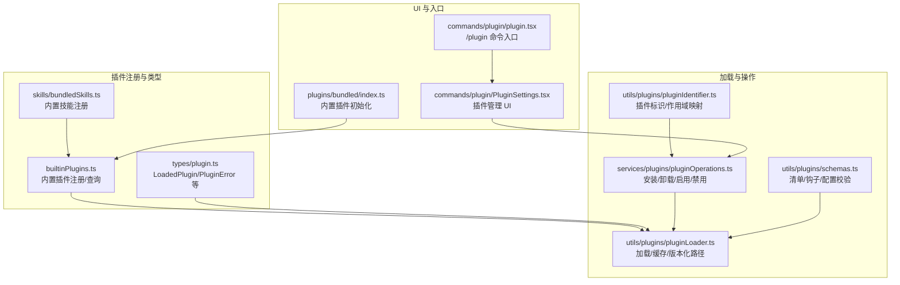
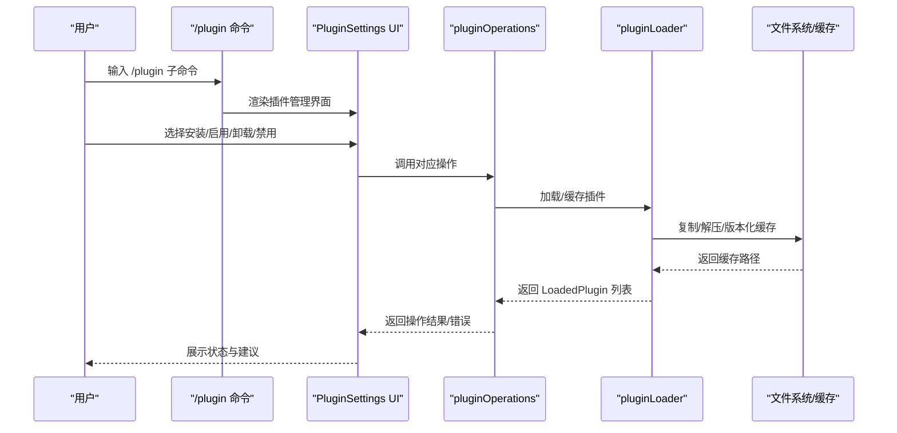
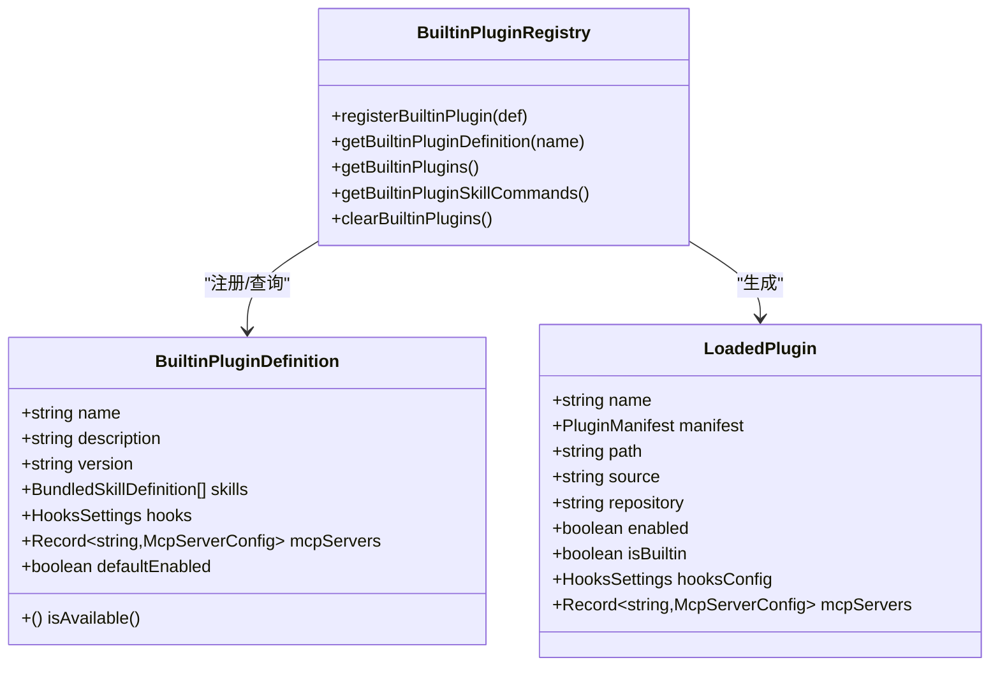
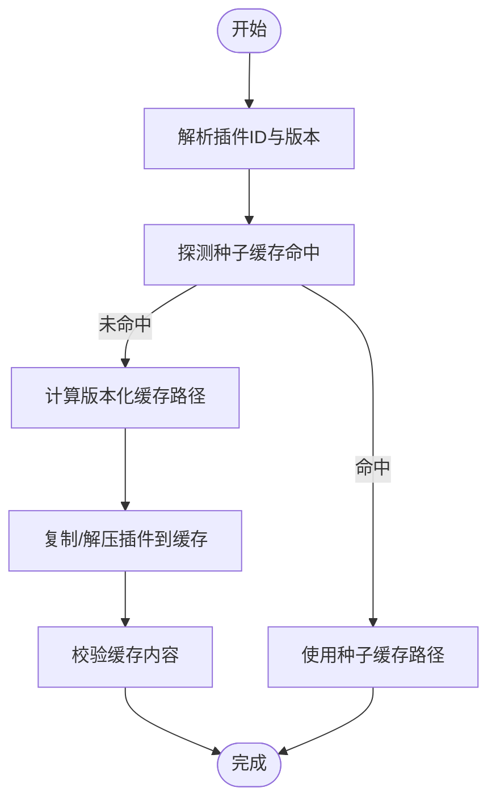
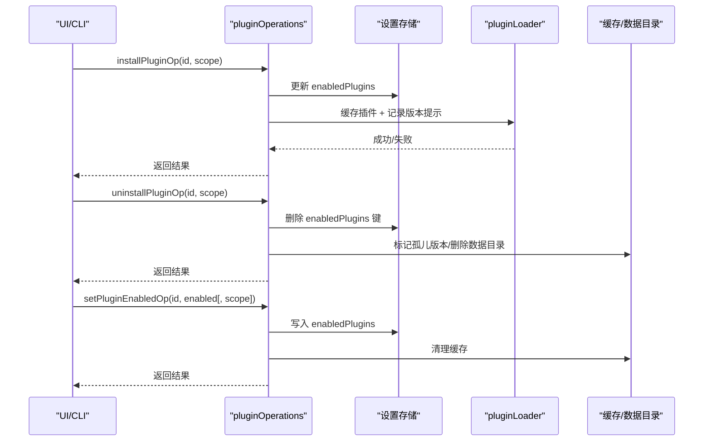
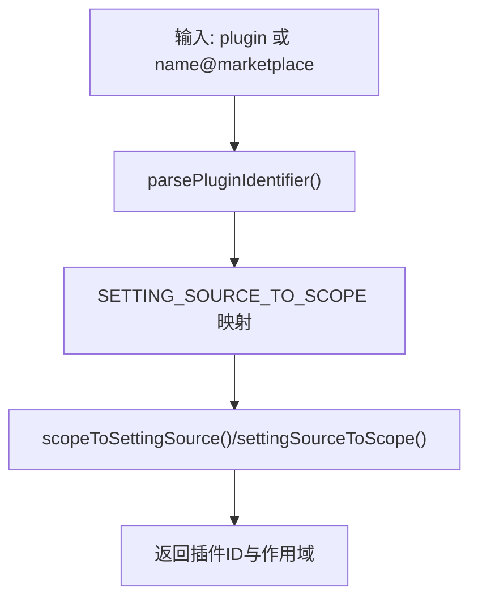
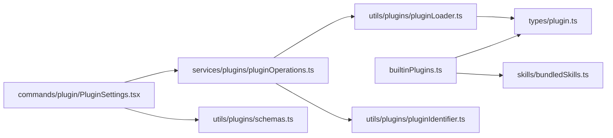

# 插件开发指南

<cite>
**本文档引用的文件**
- [builtinPlugins.ts](file://src/plugins/builtinPlugins.ts)
- [plugin.ts](file://src/types/plugin.ts)
- [bundledSkills.ts](file://src/skills/bundledSkills.ts)
- [pluginLoader.ts](file://src/utils/plugins/pluginLoader.ts)
- [pluginIdentifier.ts](file://src/utils/plugins/pluginIdentifier.ts)
- [pluginOperations.ts](file://src/services/plugins/pluginOperations.ts)
- [PluginSettings.tsx](file://src/commands/plugin/PluginSettings.tsx)
- [schemas.ts](file://src/utils/plugins/schemas.ts)
- [hooks.mdx](file://docs/extensibility/hooks.mdx)
- [index.ts](file://src/plugins/bundled/index.ts)
- [plugin.tsx](file://src/commands/plugin/plugin.tsx)
</cite>

## 目录
1. [简介](#简介)
2. [项目结构](#项目结构)
3. [核心组件](#核心组件)
4. [架构总览](#架构总览)
5. [详细组件分析](#详细组件分析)
6. [依赖关系分析](#依赖关系分析)
7. [性能考虑](#性能考虑)
8. [故障排查指南](#故障排查指南)
9. [结论](#结论)
10. [附录](#附录)

## 简介
本指南面向希望为 Claude Code 开发插件的开发者，系统讲解插件架构设计、生命周期管理、依赖注入与注册机制、配置选项与接口定义，并覆盖内置插件开发、技能系统扩展与钩子机制使用。文档同时提供插件打包、分发与版本管理策略，以及调试技巧与常见问题排查方法。

## 项目结构
Claude Code 的插件体系由“内置插件注册中心”“插件加载器”“插件操作服务”“UI 管理界面”等模块协同组成。核心文件包括：
- 内置插件注册与查询：src/plugins/builtinPlugins.ts
- 插件类型与错误模型：src/types/plugin.ts
- 技能系统（内置技能）：src/skills/bundledSkills.ts
- 插件加载与缓存：src/utils/plugins/pluginLoader.ts
- 插件标识与作用域：src/utils/plugins/pluginIdentifier.ts
- 插件安装/卸载/启用/禁用：src/services/plugins/pluginOperations.ts
- 插件 UI 管理：src/commands/plugin/PluginSettings.tsx
- 插件清单与校验：src/utils/plugins/schemas.ts
- 钩子机制文档：docs/extensibility/hooks.mdx
- 内置插件初始化入口：src/plugins/bundled/index.ts
- 插件命令入口：src/commands/plugin/plugin.tsx

图表来源
- [builtinPlugins.ts:1-160](file://src/plugins/builtinPlugins.ts#L1-L160)
- [plugin.ts:1-364](file://src/types/plugin.ts#L1-L364)
- [bundledSkills.ts:1-221](file://src/skills/bundledSkills.ts#L1-L221)
- [pluginLoader.ts:1-800](file://src/utils/plugins/pluginLoader.ts#L1-L800)
- [pluginIdentifier.ts:1-124](file://src/utils/plugins/pluginIdentifier.ts#L1-L124)
- [pluginOperations.ts:1-800](file://src/services/plugins/pluginOperations.ts#L1-L800)
- [PluginSettings.tsx:1-800](file://src/commands/plugin/PluginSettings.tsx#L1-L800)
- [schemas.ts:1-800](file://src/utils/plugins/schemas.ts#L1-L800)
- [index.ts:1-24](file://src/plugins/bundled/index.ts#L1-L24)
- [plugin.tsx:1-7](file://src/commands/plugin/plugin.tsx#L1-L7)

章节来源
- [builtinPlugins.ts:1-160](file://src/plugins/builtinPlugins.ts#L1-L160)
- [plugin.ts:1-364](file://src/types/plugin.ts#L1-L364)
- [bundledSkills.ts:1-221](file://src/skills/bundledSkills.ts#L1-L221)
- [pluginLoader.ts:1-800](file://src/utils/plugins/pluginLoader.ts#L1-L800)
- [pluginIdentifier.ts:1-124](file://src/utils/plugins/pluginIdentifier.ts#L1-L124)
- [pluginOperations.ts:1-800](file://src/services/plugins/pluginOperations.ts#L1-L800)
- [PluginSettings.tsx:1-800](file://src/commands/plugin/PluginSettings.tsx#L1-L800)
- [schemas.ts:1-800](file://src/utils/plugins/schemas.ts#L1-L800)
- [index.ts:1-24](file://src/plugins/bundled/index.ts#L1-L24)
- [plugin.tsx:1-7](file://src/commands/plugin/plugin.tsx#L1-L7)

## 核心组件
- 内置插件注册中心：负责注册、查询、启用状态管理与内置技能转换为命令对象。
- 插件加载器：负责从市场/本地/种子缓存加载插件，版本化缓存、复制与 ZIP 缓存、种子命中、错误收集。
- 插件操作服务：提供安装、卸载、启用、禁用、批量禁用、跨作用域解析与策略检查。
- 插件标识与作用域：解析插件 ID、作用域映射、官方市场名校验与来源验证。
- 插件清单与校验：定义插件清单、钩子、命令、代理、技能、输出样式、MCP/LSP 配置、用户配置等的 Zod 校验。
- 技能系统：内置技能注册与首次调用时的参考文件提取。
- 插件 UI：提供发现、已安装、市场管理、错误页签与导航。

章节来源
- [builtinPlugins.ts:1-160](file://src/plugins/builtinPlugins.ts#L1-L160)
- [pluginLoader.ts:1-800](file://src/utils/plugins/pluginLoader.ts#L1-L800)
- [pluginOperations.ts:1-800](file://src/services/plugins/pluginOperations.ts#L1-L800)
- [pluginIdentifier.ts:1-124](file://src/utils/plugins/pluginIdentifier.ts#L1-L124)
- [schemas.ts:1-800](file://src/utils/plugins/schemas.ts#L1-L800)
- [bundledSkills.ts:1-221](file://src/skills/bundledSkills.ts#L1-L221)
- [PluginSettings.tsx:1-800](file://src/commands/plugin/PluginSettings.tsx#L1-L800)

## 架构总览
插件系统采用“声明式注册 + 运行时加载 + 作用域设置 + 版本化缓存”的架构。内置插件与市场插件共享同一套加载与错误处理逻辑；UI 提供统一的管理体验。

图表来源
- [plugin.tsx:1-7](file://src/commands/plugin/plugin.tsx#L1-L7)
- [PluginSettings.tsx:1-800](file://src/commands/plugin/PluginSettings.tsx#L1-L800)
- [pluginOperations.ts:1-800](file://src/services/plugins/pluginOperations.ts#L1-L800)
- [pluginLoader.ts:1-800](file://src/utils/plugins/pluginLoader.ts#L1-L800)

## 详细组件分析

### 内置插件注册与生命周期
内置插件通过注册中心集中管理，支持：
- 注册：在启动时调用注册函数，将插件定义写入内存映射。
- 查询：按名称获取定义，或获取全部已注册插件。
- 启用状态：基于用户设置与默认值计算，内置插件使用特殊标识区分。
- 内置技能转换：将内置技能定义转换为命令对象，便于统一调度。

图表来源
- [builtinPlugins.ts:1-160](file://src/plugins/builtinPlugins.ts#L1-L160)
- [plugin.ts:18-70](file://src/types/plugin.ts#L18-L70)

章节来源
- [builtinPlugins.ts:1-160](file://src/plugins/builtinPlugins.ts#L1-L160)
- [plugin.ts:1-364](file://src/types/plugin.ts#L1-L364)

### 插件加载器与缓存策略
插件加载器负责：
- 解析插件 ID 与市场来源
- 从市场/本地/种子缓存定位插件
- 版本化缓存路径与 ZIP 缓存
- 复制插件到缓存目录，移除 .git 目录
- 错误分类与聚合（网络、Git、清单、MCP/LSP 等）

图表来源
- [pluginLoader.ts:139-465](file://src/utils/plugins/pluginLoader.ts#L139-L465)

章节来源
- [pluginLoader.ts:1-800](file://src/utils/plugins/pluginLoader.ts#L1-L800)

### 插件操作服务（安装/卸载/启用/禁用）
插件操作服务提供纯函数式操作，不直接与进程/控制台交互：
- 安装：搜索市场 -> 写入设置（声明意图）-> 缓存插件（材料化）
- 卸载：解析安装位置 -> 删除设置键 -> 清理缓存与数据目录 -> 清理依赖反向引用
- 启用/禁用：解析作用域与插件 ID -> 策略检查 -> 写入设置 -> 清理缓存
- 批量禁用：遍历可编辑作用域中的启用插件，逐个禁用

图表来源
- [pluginOperations.ts:321-776](file://src/services/plugins/pluginOperations.ts#L321-L776)
- [pluginLoader.ts:365-465](file://src/utils/plugins/pluginLoader.ts#L365-L465)

章节来源
- [pluginOperations.ts:1-800](file://src/services/plugins/pluginOperations.ts#L1-L800)

### 插件标识与作用域
插件标识支持 name@marketplace 格式；作用域分为 user/project/local/managed/flag，其中 flag 仅用于会话级插件且不持久化。标识解析与作用域映射保证跨层级设置的一致性与优先级。

图表来源
- [pluginIdentifier.ts:1-124](file://src/utils/plugins/pluginIdentifier.ts#L1-L124)

章节来源
- [pluginIdentifier.ts:1-124](file://src/utils/plugins/pluginIdentifier.ts#L1-L124)

### 插件清单与配置校验
插件清单支持多种组件声明与校验：
- 基础元数据（name/version/description/author/license 等）
- 钩子配置（hooks.json 或 manifest 中）
- 命令/代理/技能/输出样式路径声明
- MCP/LSP 服务器配置与 MCPB 下载
- 用户配置项（敏感/非敏感、默认值、范围约束）
- 市场名与来源校验（官方保留名、来源组织限制）

章节来源
- [schemas.ts:1-800](file://src/utils/plugins/schemas.ts#L1-L800)

### 钩子机制使用
钩子系统提供 22 种事件与 6 种执行类型，支持同步/异步执行、条件匹配、上下文注入与权限拦截。内置插件可通过钩子扩展行为，UI 提供错误页签与导航。

章节来源
- [hooks.mdx:1-240](file://docs/extensibility/hooks.mdx#L1-L240)
- [PluginSettings.tsx:1-800](file://src/commands/plugin/PluginSettings.tsx#L1-L800)

### 内置技能系统扩展
内置技能通过注册中心集中管理，支持：
- 注册技能定义（名称、描述、别名、允许工具、模型、钩子、上下文等）
- 首次调用时将参考文件提取到安全目录，并在提示前添加基目录前缀
- 将技能转换为命令对象，参与统一的命令调度

章节来源
- [bundledSkills.ts:1-221](file://src/skills/bundledSkills.ts#L1-L221)
- [builtinPlugins.ts:132-160](file://src/plugins/builtinPlugins.ts#L132-L160)

## 依赖关系分析
- 内置插件注册中心依赖类型定义与设置读取。
- 插件加载器依赖设置、市场管理、缓存、ZIP 缓存、种子缓存、Git 工具、文件系统实现。
- 插件操作服务依赖加载器、设置更新、依赖解析、策略检查、缓存清理。
- UI 依赖插件操作服务与市场管理，提供错误页签与导航。

图表来源
- [builtinPlugins.ts:1-160](file://src/plugins/builtinPlugins.ts#L1-L160)
- [plugin.ts:1-364](file://src/types/plugin.ts#L1-L364)
- [bundledSkills.ts:1-221](file://src/skills/bundledSkills.ts#L1-L221)
- [pluginLoader.ts:1-800](file://src/utils/plugins/pluginLoader.ts#L1-L800)
- [pluginOperations.ts:1-800](file://src/services/plugins/pluginOperations.ts#L1-L800)
- [pluginIdentifier.ts:1-124](file://src/utils/plugins/pluginIdentifier.ts#L1-L124)
- [PluginSettings.tsx:1-800](file://src/commands/plugin/PluginSettings.tsx#L1-L800)
- [schemas.ts:1-800](file://src/utils/plugins/schemas.ts#L1-L800)

章节来源
- [builtinPlugins.ts:1-160](file://src/plugins/builtinPlugins.ts#L1-L160)
- [plugin.ts:1-364](file://src/types/plugin.ts#L1-L364)
- [bundledSkills.ts:1-221](file://src/skills/bundledSkills.ts#L1-L221)
- [pluginLoader.ts:1-800](file://src/utils/plugins/pluginLoader.ts#L1-L800)
- [pluginOperations.ts:1-800](file://src/services/plugins/pluginOperations.ts#L1-L800)
- [pluginIdentifier.ts:1-124](file://src/utils/plugins/pluginIdentifier.ts#L1-L124)
- [PluginSettings.tsx:1-800](file://src/commands/plugin/PluginSettings.tsx#L1-L800)
- [schemas.ts:1-800](file://src/utils/plugins/schemas.ts#L1-L800)

## 性能考虑
- 使用版本化缓存与 ZIP 缓存减少磁盘占用与 IO。
- 种子缓存优先命中，避免重复下载与解压。
- 浅克隆与稀疏检出优化大型仓库子目录拉取。
- 依赖解析与去重降低重复执行成本。
- 异步钩子后台执行，避免阻塞主流程。

## 故障排查指南
- 常见错误类型：路径不存在、Git 认证失败/超时、网络错误、清单解析/校验失败、插件未找到、市场不可用、MCP/LSP 配置无效/启动失败、依赖不满足、缓存缺失等。
- UI 错误页签：自动分类与导航，支持一键移除多余市场、卸载问题插件、重启重试等。
- 调试建议：查看错误消息映射、检查网络/Git 配置、确认市场来源与策略、核对清单字段与钩子条件、清理缓存后重试。

章节来源
- [plugin.ts:101-284](file://src/types/plugin.ts#L101-L284)
- [PluginSettings.tsx:195-311](file://src/commands/plugin/PluginSettings.tsx#L195-L311)

## 结论
Claude Code 的插件体系以“声明式注册 + 运行时加载 + 作用域设置 + 版本化缓存”为核心，结合 UI 与钩子机制，提供了灵活、可扩展且安全的插件开发与运行环境。开发者可基于内置插件注册中心与技能系统快速扩展功能，通过插件操作服务与加载器实现稳定的安装、启用与缓存管理，并借助钩子机制实现强大的生命周期拦截与上下文注入。

## 附录

### 插件开发步骤（概要）
- 设计插件清单与组件（命令/代理/技能/钩子/MCP/LSP/输出样式）。
- 实现钩子与工具集成，确保工作区信任与条件匹配。
- 使用内置插件注册中心或市场发布，配置用户配置项与依赖。
- 通过 UI 或 CLI 安装/启用/卸载/禁用插件，观察错误页签与日志。
- 使用版本化缓存与 ZIP 缓存提升分发效率。

### 调试技巧
- 使用 /plugins 命令刷新缓存与错误列表。
- 在错误页签中根据指引移除多余市场或卸载问题插件。
- 查看错误类型映射，定位具体环节（网络/Git/清单/MCP/LSP）。
- 清理缓存后重试，或切换种子缓存以排除网络问题。