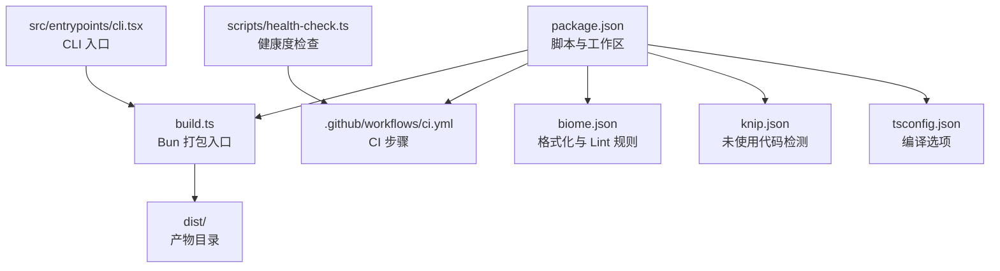
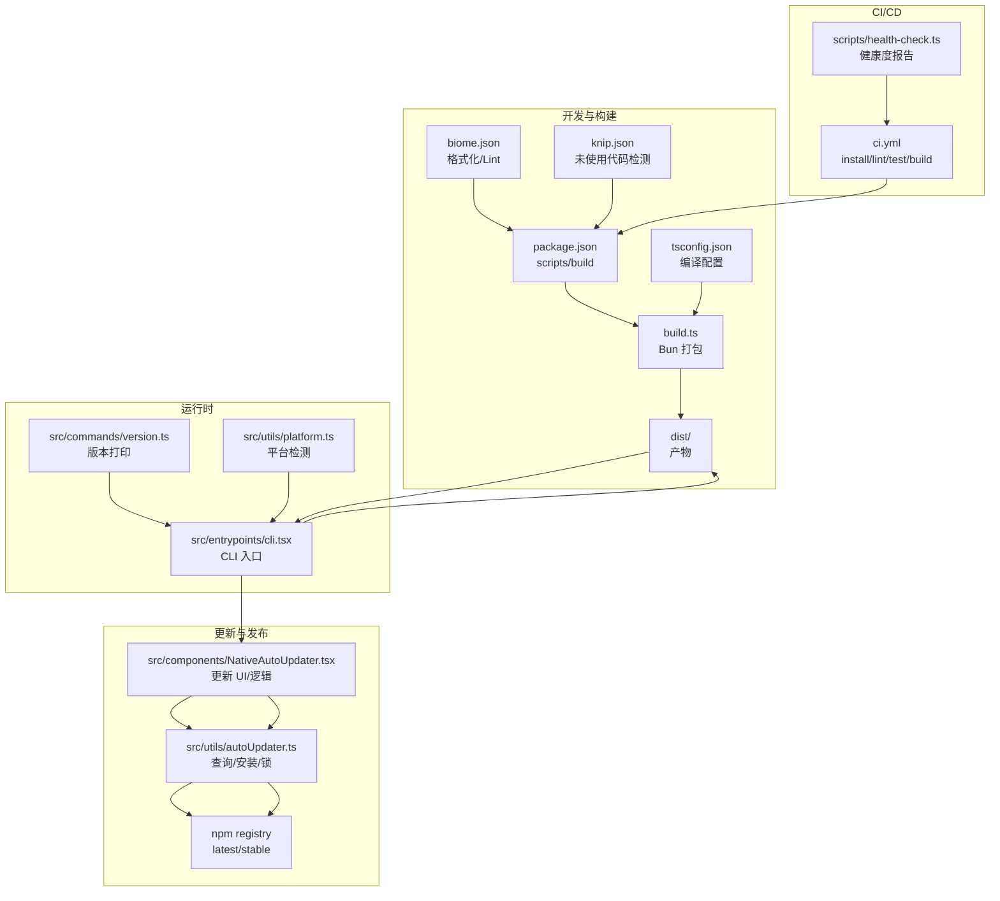
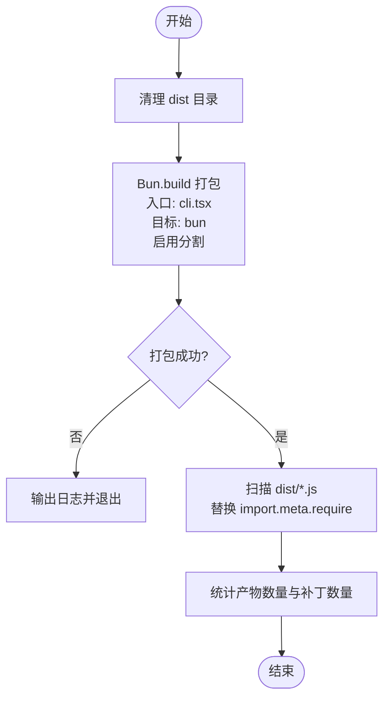
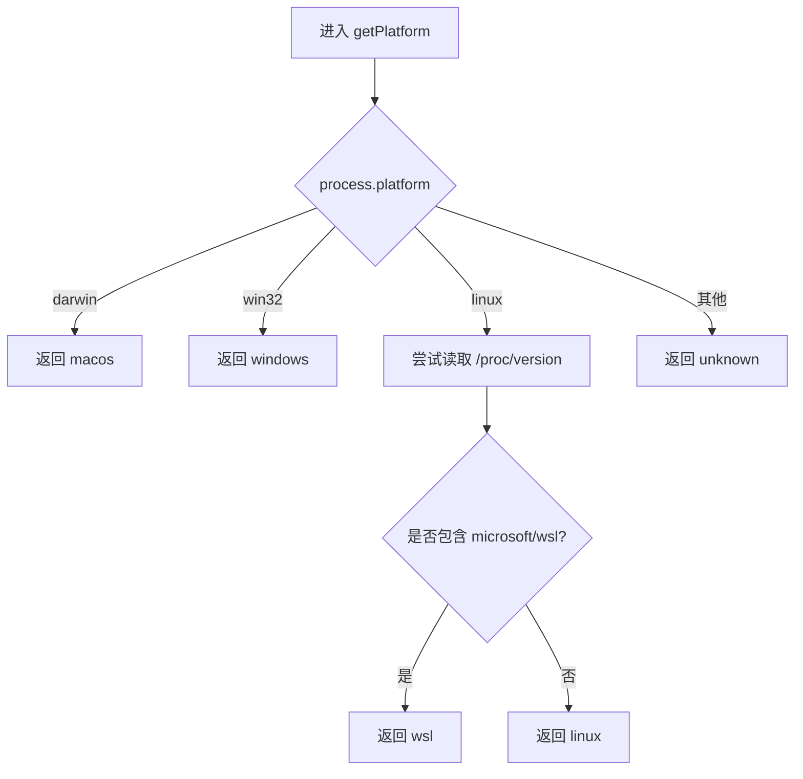
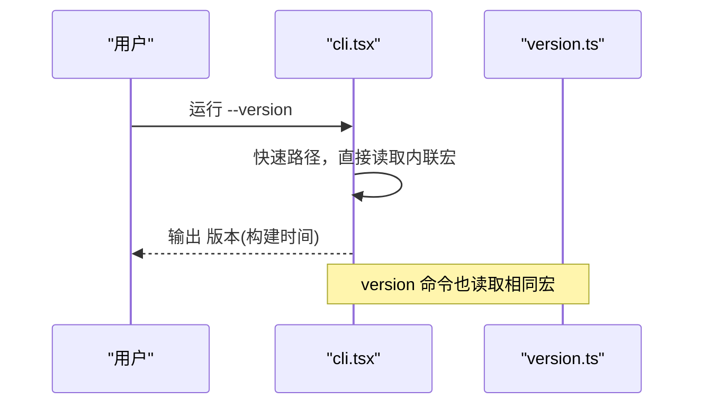
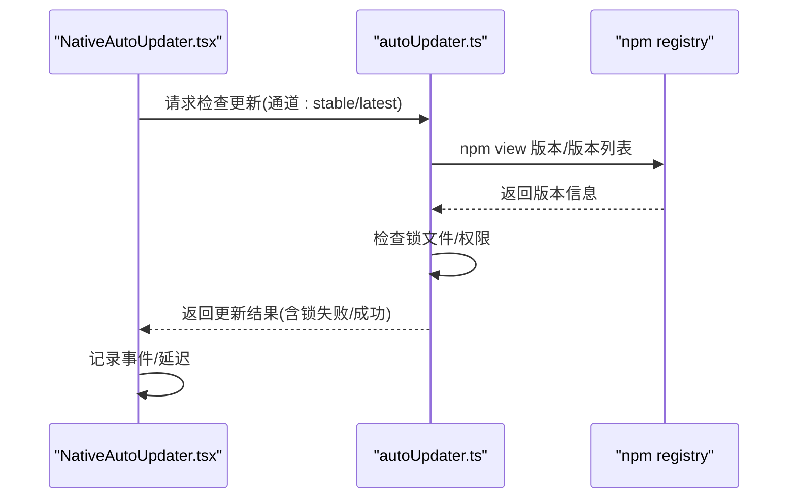
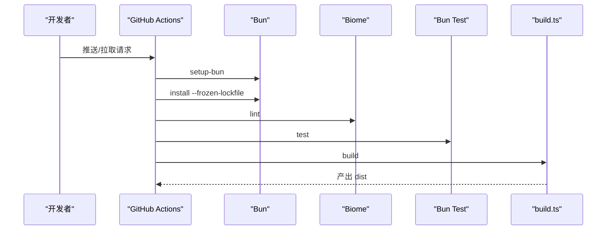
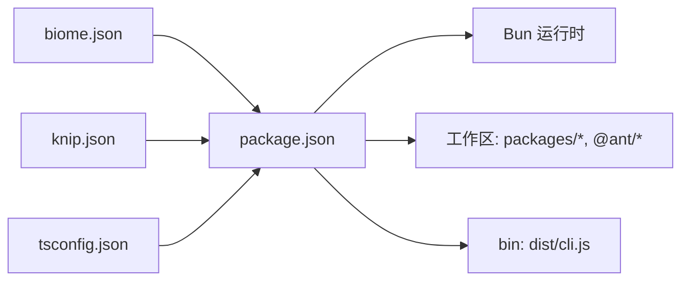

# 构建与部署

<cite>
**本文引用的文件**
- [package.json](file://package.json)
- [build.ts](file://build.ts)
- [biome.json](file://biome.json)
- [.github/workflows/ci.yml](file://.github/workflows/ci.yml)
- [scripts/health-check.ts](file://scripts/health-check.ts)
- [knip.json](file://knip.json)
- [tsconfig.json](file://tsconfig.json)
- [src/entrypoints/cli.tsx](file://src/entrypoints/cli.tsx)
- [src/commands/version.ts](file://src/commands/version.ts)
- [src/utils/autoUpdater.ts](file://src/utils/autoUpdater.ts)
- [src/components/NativeAutoUpdater.tsx](file://src/components/NativeAutoUpdater.tsx)
- [src/utils/platform.ts](file://src/utils/platform.ts)
</cite>

## 目录
1. [简介](#简介)
2. [项目结构](#项目结构)
3. [核心组件](#核心组件)
4. [架构总览](#架构总览)
5. [详细组件分析](#详细组件分析)
6. [依赖分析](#依赖分析)
7. [性能考虑](#性能考虑)
8. [故障排查指南](#故障排查指南)
9. [结论](#结论)
10. [附录](#附录)

## 简介
本指南面向 Claude Code 的构建与部署，覆盖以下主题：
- 构建脚本与打包配置、输出优化与兼容性适配
- 多平台构建与运行时平台检测
- 发布流程、版本管理与自动更新机制
- Docker 容器化部署思路与 CI/CD 集成
- 性能优化、资源压缩与缓存策略

## 项目结构
该项目采用 Bun 作为运行时与构建工具，使用 TypeScript 编写，通过自定义构建脚本进行打包，并在 CI 中完成安装、校验、测试与构建。

图表来源
- [package.json:37-49](file://package.json#L37-L49)
- [build.ts:1-48](file://build.ts#L1-L48)
- [.github/workflows/ci.yml:1-31](file://.github/workflows/ci.yml#L1-L31)
- [biome.json:1-115](file://biome.json#L1-L115)
- [knip.json:1-23](file://knip.json#L1-L23)
- [tsconfig.json:1-21](file://tsconfig.json#L1-L21)
- [src/entrypoints/cli.tsx:1-200](file://src/entrypoints/cli.tsx#L1-L200)
- [scripts/health-check.ts:1-164](file://scripts/health-check.ts#L1-L164)

章节来源
- [package.json:1-166](file://package.json#L1-L166)
- [build.ts:1-48](file://build.ts#L1-L48)
- [.github/workflows/ci.yml:1-31](file://.github/workflows/ci.yml#L1-L31)
- [biome.json:1-115](file://biome.json#L1-L115)
- [knip.json:1-23](file://knip.json#L1-L23)
- [tsconfig.json:1-21](file://tsconfig.json#L1-L21)
- [src/entrypoints/cli.tsx:1-200](file://src/entrypoints/cli.tsx#L1-L200)
- [scripts/health-check.ts:1-164](file://scripts/health-check.ts#L1-L164)

## 核心组件
- 构建脚本与打包
  - 使用 Bun.build 进行打包，目标为 bun，启用代码分割；随后对产物进行 Node.js 兼容性修复，替换 import.meta.require 用法。
  - 输出目录为 dist，包含 CLI 入口产物。
- 版本与构建时间宏
  - CLI 入口内联了构建时常量（版本、构建时间等），命令中的 version 命令会读取这些宏值。
- 自动更新与分发
  - 通过 npm view 查询远端版本信息，支持稳定版与最新版通道；提供锁文件避免并发冲突；在生产环境触发更新检查。
- 平台检测
  - 运行时根据系统信息判断平台类型，用于特性开关与兼容性控制。
- CI/CD 与质量门禁
  - CI 使用 GitHub Actions，步骤包括安装依赖、Linter、测试与构建；提供健康度检查脚本汇总多项指标。

章节来源
- [build.ts:10-47](file://build.ts#L10-L47)
- [src/entrypoints/cli.tsx:4-18](file://src/entrypoints/cli.tsx#L4-L18)
- [src/commands/version.ts:3-10](file://src/commands/version.ts#L3-L10)
- [src/utils/autoUpdater.ts:319-344](file://src/utils/autoUpdater.ts#L319-L344)
- [src/utils/autoUpdater.ts:426-454](file://src/utils/autoUpdater.ts#L426-L454)
- [src/components/NativeAutoUpdater.tsx:73-106](file://src/components/NativeAutoUpdater.tsx#L73-L106)
- [src/utils/platform.ts:11-49](file://src/utils/platform.ts#L11-L49)
- [.github/workflows/ci.yml:13-31](file://.github/workflows/ci.yml#L13-L31)
- [scripts/health-check.ts:109-125](file://scripts/health-check.ts#L109-L125)

## 架构总览
下图展示了从源码到产物、再到运行时与更新机制的整体流程。

图表来源
- [package.json:37-49](file://package.json#L37-L49)
- [build.ts:10-47](file://build.ts#L10-L47)
- [tsconfig.json:1-21](file://tsconfig.json#L1-L21)
- [biome.json:1-115](file://biome.json#L1-L115)
- [knip.json:1-23](file://knip.json#L1-L23)
- [src/entrypoints/cli.tsx:1-200](file://src/entrypoints/cli.tsx#L1-L200)
- [src/commands/version.ts:1-23](file://src/commands/version.ts#L1-L23)
- [src/utils/platform.ts:1-49](file://src/utils/platform.ts#L1-L49)
- [src/components/NativeAutoUpdater.tsx:73-106](file://src/components/NativeAutoUpdater.tsx#L73-L106)
- [src/utils/autoUpdater.ts:319-344](file://src/utils/autoUpdater.ts#L319-L344)
- [.github/workflows/ci.yml:13-31](file://.github/workflows/ci.yml#L13-L31)
- [scripts/health-check.ts:109-125](file://scripts/health-check.ts#L109-L125)

## 详细组件分析

### 构建脚本与打包配置
- 清理与打包
  - 清空 dist 目录后调用 Bun.build，入口为 src/entrypoints/cli.tsx，目标为 bun，启用代码分割。
- 兼容性后处理
  - 遍历 dist 下的 JS 文件，将 Bun 专属的 import.meta.require 替换为 Node.js 兼容实现，提升跨运行时可用性。
- 产物与入口
  - package.json 的 bin 字段指向 dist/cli.js，作为 CLI 可执行入口。

图表来源
- [build.ts:6-47](file://build.ts#L6-L47)
- [package.json:27-29](file://package.json#L27-L29)

章节来源
- [build.ts:6-47](file://build.ts#L6-L47)
- [package.json:27-29](file://package.json#L27-L29)

### 多平台构建与运行时适配
- 平台检测
  - 运行时根据 process.platform 与 /proc/version 判断 macOS、Windows、WSL、Linux 或 unknown，用于特性开关与行为差异。
- 平台支持范围
  - 支持列表包含 macos 与 wsl，其他平台可能受限或不被明确支持。
- 容器内存限制
  - 在特定远程容器环境下设置 NODE_OPTIONS 以限制堆大小，避免容器 OOM。

图表来源
- [src/utils/platform.ts:11-49](file://src/utils/platform.ts#L11-L49)

章节来源
- [src/utils/platform.ts:9-49](file://src/utils/platform.ts#L9-L49)

### 版本管理与构建宏
- 构建宏
  - CLI 入口内联了 VERSION、BUILD_TIME 等宏，在打包阶段会被替换；version 命令会读取这些宏并输出当前构建版本与构建时间。
- 版本命令
  - 仅在特定用户类型下可用，支持非交互式输出。

图表来源
- [src/entrypoints/cli.tsx:64-72](file://src/entrypoints/cli.tsx#L64-L72)
- [src/commands/version.ts:3-10](file://src/commands/version.ts#L3-L10)

章节来源
- [src/entrypoints/cli.tsx:4-18](file://src/entrypoints/cli.tsx#L4-L18)
- [src/commands/version.ts:1-23](file://src/commands/version.ts#L1-L23)

### 自动更新机制与发布流程
- 更新通道
  - 支持 stable 与 latest 两个 npm dist-tag，查询远端版本列表与最新版本。
- 锁文件与并发控制
  - 通过锁文件避免并发更新导致的冲突；若锁持有者不是当前进程则释放。
- 权限与安装前缀
  - 检测全局安装前缀与写权限，确保更新可写入。
- 生产环境触发
  - 在非测试/开发环境且未禁用时触发检查；记录事件与耗时。

图表来源
- [src/components/NativeAutoUpdater.tsx:73-106](file://src/components/NativeAutoUpdater.tsx#L73-L106)
- [src/utils/autoUpdater.ts:319-344](file://src/utils/autoUpdater.ts#L319-L344)
- [src/utils/autoUpdater.ts:426-454](file://src/utils/autoUpdater.ts#L426-L454)
- [src/utils/autoUpdater.ts:251-268](file://src/utils/autoUpdater.ts#L251-L268)

章节来源
- [src/utils/autoUpdater.ts:251-454](file://src/utils/autoUpdater.ts#L251-L454)
- [src/components/NativeAutoUpdater.tsx:67-106](file://src/components/NativeAutoUpdater.tsx#L67-L106)

### CI/CD 集成与自动化发布
- 工作流
  - 使用 GitHub Actions，运行在 ubuntu-latest；步骤包括安装 Bun、安装依赖、Linter、测试与构建。
- 健康度检查
  - 提供统一的健康度检查脚本，汇总代码规模、Lint、测试、未使用代码与构建状态，并输出报告与退出码。

图表来源
- [.github/workflows/ci.yml:13-31](file://.github/workflows/ci.yml#L13-L31)
- [scripts/health-check.ts:109-125](file://scripts/health-check.ts#L109-L125)

章节来源
- [.github/workflows/ci.yml:1-31](file://.github/workflows/ci.yml#L1-L31)
- [scripts/health-check.ts:1-164](file://scripts/health-check.ts#L1-L164)

### Docker 容器化部署思路
- 运行时内存限制
  - 在远程容器环境中设置 NODE_OPTIONS 以限制堆大小，避免容器 OOM。
- 容器内平台检测
  - 通过 /proc/version 判断 WSL/Windows 子系统，便于在容器中启用相应特性。
- 建议实践
  - 使用官方 Bun 镜像作为基础镜像，COPY dist 产物并设置可执行入口；结合环境变量控制更新与日志级别；挂载持久化目录用于会话与缓存。

章节来源
- [src/entrypoints/cli.tsx:24-33](file://src/entrypoints/cli.tsx#L24-L33)
- [src/utils/platform.ts:21-37](file://src/utils/platform.ts#L21-L37)

## 依赖分析
- 包管理与工作区
  - 使用 Bun，package.json 定义了工作区与二进制入口；依赖集中在 devDependencies 中，运行时通过 Bun 的模块解析加载。
- Lint 与格式化
  - Biome 配置启用格式化与 Lint，忽略 dist 与部分 @ant 包，TSX 行宽放宽。
- 未使用代码检测
  - Knip 配置以 CLI 入口为入口点，排除 d.ts 与部分依赖，支持工作区子包的独立入口。

图表来源
- [package.json:30-36](file://package.json#L30-L36)
- [package.json:27-29](file://package.json#L27-L29)
- [biome.json:8-10](file://biome.json#L8-L10)
- [knip.json:3-5](file://knip.json#L3-L5)

章节来源
- [package.json:1-166](file://package.json#L1-L166)
- [biome.json:1-115](file://biome.json#L1-L115)
- [knip.json:1-23](file://knip.json#L1-L23)
- [tsconfig.json:1-21](file://tsconfig.json#L1-L21)

## 性能考虑
- 启动路径优化
  - CLI 入口对 --version 等常见命令走快速路径，避免加载完整模块图，减少启动开销。
- 代码分割与按需加载
  - 打包启用分割，配合动态 import，降低首屏模块体积。
- 运行时内存限制
  - 在容器场景设置最大堆大小，避免 OOM 导致的不稳定。
- Lint 与测试前置
  - CI 中先执行 Lint 与测试，尽早发现性能回归与错误。

章节来源
- [src/entrypoints/cli.tsx:60-94](file://src/entrypoints/cli.tsx#L60-L94)
- [build.ts:10-16](file://build.ts#L10-L16)
- [src/entrypoints/cli.tsx:24-33](file://src/entrypoints/cli.tsx#L24-L33)
- [.github/workflows/ci.yml:23-27](file://.github/workflows/ci.yml#L23-L27)

## 故障排查指南
- 构建失败
  - 检查 Bun.build 日志；确认入口文件存在且可解析；核对目标与模块解析策略。
- Node.js 兼容性问题
  - 确认已执行后处理步骤，import.meta.require 已替换为兼容实现。
- CI 失败
  - 查看 Lint 与测试输出；确保依赖锁定文件一致；在本地复现 CI 环境。
- 健康度检查异常
  - 关注 Lint 错误数、测试失败数、未使用依赖与构建状态；根据报告逐项修复。

章节来源
- [build.ts:18-24](file://build.ts#L18-L24)
- [build.ts:26-43](file://build.ts#L26-L43)
- [.github/workflows/ci.yml:23-31](file://.github/workflows/ci.yml#L23-L31)
- [scripts/health-check.ts:58-125](file://scripts/health-check.ts#L58-L125)

## 结论
本项目以 Bun 为核心构建与运行时，通过自定义打包脚本实现代码分割与跨运行时兼容；借助 CI/CD 保证质量门禁；自动更新机制基于 npm registry 实现稳定与最新通道的版本管理。结合平台检测与容器内存限制，可在多环境下稳定运行。建议在生产发布前完善 Docker 镜像与自动化发布流程，并持续优化启动路径与打包体积。

## 附录
- 关键配置与入口
  - 构建入口: [src/entrypoints/cli.tsx:1-200](file://src/entrypoints/cli.tsx#L1-L200)
  - 打包脚本: [build.ts:1-48](file://build.ts#L1-L48)
  - 版本命令: [src/commands/version.ts:1-23](file://src/commands/version.ts#L1-L23)
  - 自动更新: [src/utils/autoUpdater.ts:319-344](file://src/utils/autoUpdater.ts#L319-L344), [src/components/NativeAutoUpdater.tsx:73-106](file://src/components/NativeAutoUpdater.tsx#L73-L106)
  - CI: [.github/workflows/ci.yml:1-31](file://.github/workflows/ci.yml#L1-L31)
  - 健康度检查: [scripts/health-check.ts:1-164](file://scripts/health-check.ts#L1-L164)
  - Lint/格式化: [biome.json:1-115](file://biome.json#L1-L115)
  - 未使用代码: [knip.json:1-23](file://knip.json#L1-L23)
  - 编译配置: [tsconfig.json:1-21](file://tsconfig.json#L1-L21)