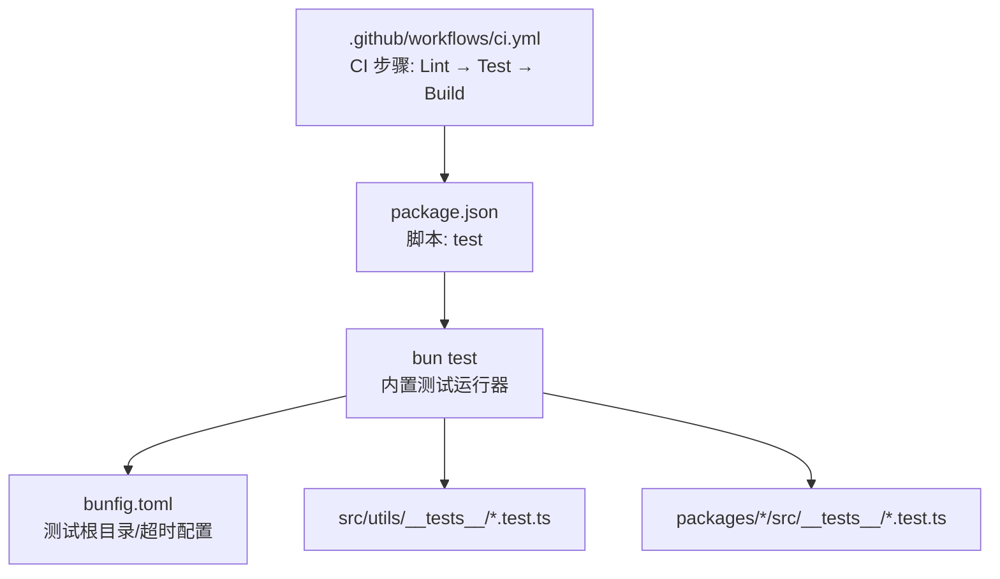
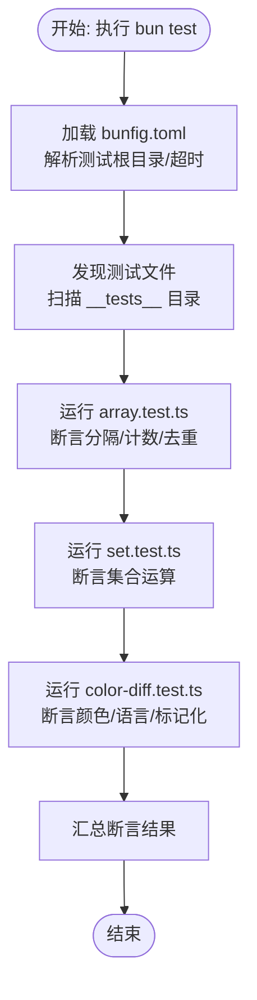
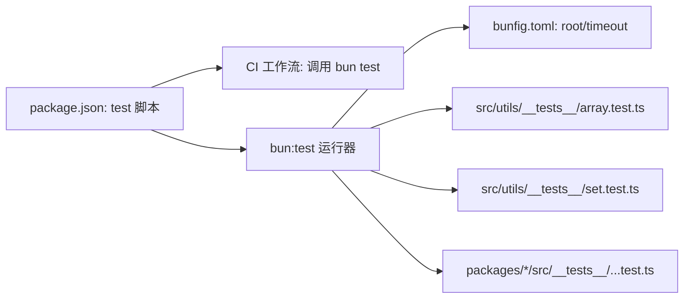

# 测试指南

<cite>
**本文引用的文件**
- [package.json](file://package.json)
- [.github/workflows/ci.yml](file://.github/workflows/ci.yml)
- [bunfig.toml](file://bunfig.toml)
- [src/utils/__tests__/array.test.ts](file://src/utils/__tests__/array.test.ts)
- [src/utils/__tests__/set.test.ts](file://src/utils/__tests__/set.test.ts)
- [packages/color-diff-napi/src/__tests__/color-diff.test.ts](file://packages/color-diff-napi/src/__tests__/color-diff.test.ts)
</cite>

## 目录
1. [简介](#简介)
2. [项目结构](#项目结构)
3. [核心组件](#核心组件)
4. [架构总览](#架构总览)
5. [详细组件分析](#详细组件分析)
6. [依赖分析](#依赖分析)
7. [性能考虑](#性能考虑)
8. [故障排查指南](#故障排查指南)
9. [结论](#结论)
10. [附录](#附录)

## 简介
本测试指南面向 Claude Code 的开发者与贡献者，系统阐述项目的测试体系与最佳实践，覆盖单元测试、集成测试与端到端测试的组织方式；说明测试框架配置、模拟对象使用与测试数据管理策略；给出测试覆盖率目标、性能测试与内存泄漏检测建议；并提供运行测试套件的方法与结果分析要点。

## 项目结构
- 测试运行器：项目采用 Bun 内置测试运行器（bun:test），通过根目录脚本触发测试执行。
- 测试组织：测试文件以“模块名.test.ts”命名，统一放置在各包或源码目录下的 __tests__ 子目录中，便于按功能域分层管理。
- CI 集成：GitHub Actions 工作流在 Ubuntu 环境中安装 Bun、依赖后依次执行 Lint、Test、Build 步骤，确保测试作为质量门禁的一部分。

图表来源
- [package.json:45](file://package.json#L45)
- [bunfig.toml:1-4](file://bunfig.toml#L1-L4)
- [src/utils/__tests__/array.test.ts:1-59](file://src/utils/__tests__/array.test.ts#L1-L59)
- [packages/color-diff-napi/src/__tests__/color-diff.test.ts:1-103](file://packages/color-diff-napi/src/__tests__/color-diff.test.ts#L1-L103)
- [.github/workflows/ci.yml:26](file://.github/workflows/ci.yml#L26)

章节来源
- [package.json:37-49](file://package.json#L37-L49)
- [.github/workflows/ci.yml:1-31](file://.github/workflows/ci.yml#L1-L31)
- [bunfig.toml:1-4](file://bunfig.toml#L1-L4)

## 核心组件
- 测试运行器与脚本
  - 使用 Bun 内置测试命令，通过 package.json 中的 test 脚本统一入口。
  - CI 工作流直接调用 bun test，保证本地与流水线一致。
- 测试配置
  - 测试根目录与超时时间在 bunfig.toml 中集中配置，便于全局控制。
- 测试文件示例
  - 模块级单元测试：如数组与集合工具函数的测试。
  - 包级单元测试：如 color-diff-napi 的颜色处理与语言识别等逻辑测试。

章节来源
- [package.json:45](file://package.json#L45)
- [.github/workflows/ci.yml:26](file://.github/workflows/ci.yml#L26)
- [bunfig.toml:1-4](file://bunfig.toml#L1-L4)
- [src/utils/__tests__/array.test.ts:1-59](file://src/utils/__tests__/array.test.ts#L1-L59)
- [src/utils/__tests__/set.test.ts:1-64](file://src/utils/__tests__/set.test.ts#L1-L64)
- [packages/color-diff-napi/src/__tests__/color-diff.test.ts:1-103](file://packages/color-diff-napi/src/__tests__/color-diff.test.ts#L1-L103)

## 架构总览
下图展示了从命令行到测试运行器、再到具体测试文件的执行链路，以及 CI 对测试的编排。

```mermaid
sequenceDiagram
participant Dev as "开发者"
participant CLI as "Bun CLI"
participant Runner as "bun : test 运行器"
participant Conf as "bunfig.toml"
participant Tests as "测试文件"
participant GH as "GitHub Actions"
Dev->>CLI : 执行 "bun test"
CLI->>Runner : 解析测试脚本与配置
Runner->>Conf : 读取测试根目录/超时设置
Runner->>Tests : 发现并执行 __tests__ 下的 *.test.ts
Tests-->>Runner : 返回断言结果
Runner-->>Dev : 输出测试报告
GH->>CLI : 在 CI 环境中执行 "bun test"
CLI->>Runner : 同上
Runner-->>GH : 上传测试结果如需
```

图表来源
- [package.json:45](file://package.json#L45)
- [bunfig.toml:1-4](file://bunfig.toml#L1-L4)
- [.github/workflows/ci.yml:26](file://.github/workflows/ci.yml#L26)

## 详细组件分析

### 单元测试组织与示例
- 组织方式
  - 每个功能模块对应一个或多个测试文件，使用 describe/test 分组表达业务语义。
  - 断言统一使用 expect，确保可读性与一致性。
- 示例一：数组工具函数
  - 测试场景包括分隔符插入、计数、去重等边界条件与典型输入。
  - 通过多组用例覆盖空数组、单元素、索引传递等细节。
- 示例二：集合工具函数
  - 覆盖差集、交集、子集判断、并集等集合运算的正确性与空集处理。
- 示例三：颜色处理与语言识别
  - 针对 ANSI/256/真彩模式选择、颜色到转义序列映射、文件扩展名到语言识别等进行精确断言。

图表来源
- [bunfig.toml:1-4](file://bunfig.toml#L1-L4)
- [src/utils/__tests__/array.test.ts:1-59](file://src/utils/__tests__/array.test.ts#L1-L59)
- [src/utils/__tests__/set.test.ts:1-64](file://src/utils/__tests__/set.test.ts#L1-L64)
- [packages/color-diff-napi/src/__tests__/color-diff.test.ts:1-103](file://packages/color-diff-napi/src/__tests__/color-diff.test.ts#L1-L103)

章节来源
- [src/utils/__tests__/array.test.ts:1-59](file://src/utils/__tests__/array.test.ts#L1-L59)
- [src/utils/__tests__/set.test.ts:1-64](file://src/utils/__tests__/set.test.ts#L1-L64)
- [packages/color-diff-napi/src/__tests__/color-diff.test.ts:1-103](file://packages/color-diff-napi/src/__tests__/color-diff.test.ts#L1-L103)

### 集成测试与端到端测试
- 集成测试建议
  - 聚焦模块间交互与外部依赖（如网络请求、文件系统）的组合行为。
  - 使用隔离的测试环境与最小化依赖注入，确保可重复性。
- 端到端测试建议
  - 覆盖关键用户路径（如 CLI 命令执行、会话创建与消息流转）。
  - 引入轻量级的外部服务桩或内存数据库，避免真实依赖带来的不确定性。
- 当前仓库现状
  - 仓库当前主要包含模块级单元测试文件，尚未发现显式的集成或端到端测试目录。建议在 CI 中新增集成与端到端测试阶段，并在 bunfig.toml 中为长耗时测试单独配置超时。

章节来源
- [.github/workflows/ci.yml:26](file://.github/workflows/ci.yml#L26)
- [bunfig.toml:1-4](file://bunfig.toml#L1-L4)

### 测试框架配置
- 测试根目录与超时
  - 通过 bunfig.toml 设置测试根目录与默认超时，便于统一管理长耗时或复杂测试。
- CI 中的测试步骤
  - GitHub Actions 在 Ubuntu 环境中直接执行 bun test，确保跨平台一致性。
- 脚本入口
  - package.json 中的 test 脚本为本地与 CI 的统一入口，便于扩展其他任务（如覆盖率收集）。

章节来源
- [bunfig.toml:1-4](file://bunfig.toml#L1-L4)
- [.github/workflows/ci.yml:26](file://.github/workflows/ci.yml#L26)
- [package.json:45](file://package.json#L45)

### 模拟对象与测试数据管理
- 模拟对象
  - 对于外部依赖（如网络、文件系统），建议在测试中引入轻量级桩或替身，确保测试稳定与可控。
- 测试数据
  - 将固定输入与期望输出集中管理，避免散落在用例中；必要时使用参数化测试提升覆盖面。
- 当前仓库现状
  - 测试文件以直接断言为主，未见专用的模拟库或测试数据工厂。可在后续迭代中引入轻量级模拟方案与共享测试数据集。

章节来源
- [src/utils/__tests__/array.test.ts:1-59](file://src/utils/__tests__/array.test.ts#L1-L59)
- [src/utils/__tests__/set.test.ts:1-64](file://src/utils/__tests__/set.test.ts#L1-L64)
- [packages/color-diff-napi/src/__tests__/color-diff.test.ts:1-103](file://packages/color-diff-napi/src/__tests__/color-diff.test.ts#L1-L103)

### 测试覆盖率、性能测试与内存泄漏检测
- 覆盖率
  - 建议在 CI 中启用覆盖率统计（如基于 Bun 的覆盖率工具），设定阈值（如语句/分支/函数/行覆盖率）作为合并门禁。
- 性能测试
  - 对热点函数与关键路径添加基准测试，记录执行时间与内存占用，结合 CI 触发回归告警。
- 内存泄漏检测
  - 在长时间运行的测试场景中，结合内存快照与 GC 计数，定位潜在泄漏点；必要时引入专用检测工具。

章节来源
- [.github/workflows/ci.yml:26](file://.github/workflows/ci.yml#L26)

## 依赖分析
- 测试运行器与配置
  - bun:test 作为内置运行器，配合 bunfig.toml 的 root 与 timeout 控制测试发现与执行。
- 依赖关系
  - package.json 的 test 脚本是本地与 CI 的统一入口；CI 工作流直接复用该脚本。
- 可能的耦合点
  - 若未来引入第三方测试框架或覆盖率工具，需注意与 bun:test 的兼容性与配置冲突。

图表来源
- [package.json:45](file://package.json#L45)
- [.github/workflows/ci.yml:26](file://.github/workflows/ci.yml#L26)
- [bunfig.toml:1-4](file://bunfig.toml#L1-L4)
- [src/utils/__tests__/array.test.ts:1-59](file://src/utils/__tests__/array.test.ts#L1-L59)
- [src/utils/__tests__/set.test.ts:1-64](file://src/utils/__tests__/set.test.ts#L1-L64)
- [packages/color-diff-napi/src/__tests__/color-diff.test.ts:1-103](file://packages/color-diff-napi/src/__tests__/color-diff.test.ts#L1-L103)

章节来源
- [package.json:45](file://package.json#L45)
- [.github/workflows/ci.yml:26](file://.github/workflows/ci.yml#L26)
- [bunfig.toml:1-4](file://bunfig.toml#L1-L4)

## 性能考虑
- 测试执行效率
  - 合理设置超时，避免个别用例拖慢整体；将长耗时测试拆分为独立任务或并行执行。
- 资源占用
  - 在 CI 中限制并发度，避免资源争用；对大文件或外部依赖使用缓存策略。
- 回归检测
  - 在 PR 中仅运行关键测试集，主干合并后再运行全量测试与性能回归。

## 故障排查指南
- 常见问题
  - 测试超时：检查 bunfig.toml 的 timeout 设置，必要时为长耗时用例单独配置。
  - 平台差异：CI 使用 Ubuntu，本地若为 macOS/Windows，需关注路径与权限差异。
  - 外部依赖不稳定：对外部服务使用桩或本地镜像，减少 flaky。
- 调试技巧
  - 使用更细粒度的 describe/test 分组，缩小失败范围。
  - 在本地使用 bun test --reporter=verbose 查看详细输出。
  - 对并发或异步逻辑增加日志与断言顺序验证。

章节来源
- [bunfig.toml:1-4](file://bunfig.toml#L1-L4)
- [.github/workflows/ci.yml:26](file://.github/workflows/ci.yml#L26)

## 结论
当前仓库已具备完善的模块级单元测试基础，测试入口与 CI 集成清晰。建议在现有基础上逐步扩展集成与端到端测试，完善覆盖率与性能回归机制，并引入模拟对象与测试数据管理策略，持续提升测试质量与稳定性。

## 附录
- 运行测试套件
  - 本地：执行测试脚本，观察断言结果与报告。
  - CI：工作流自动执行 Lint → Test → Build，测试失败将阻断后续流程。
- 分析测试结果
  - 关注失败用例的上下文与断言信息，优先修复关键路径；对 flaky 用例引入重试或隔离。

章节来源
- [package.json:45](file://package.json#L45)
- [.github/workflows/ci.yml:23-30](file://.github/workflows/ci.yml#L23-L30)