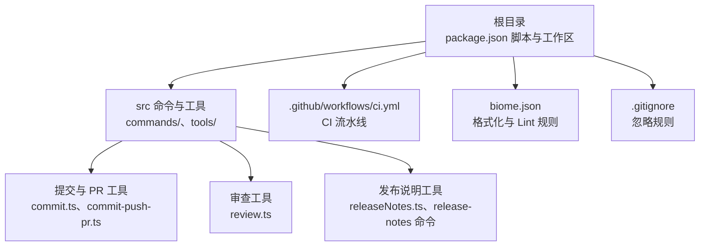
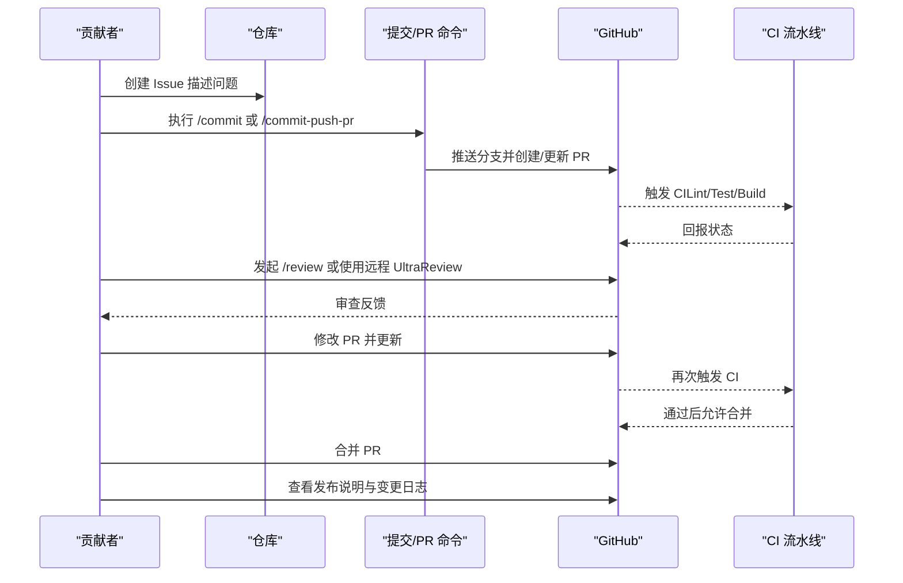
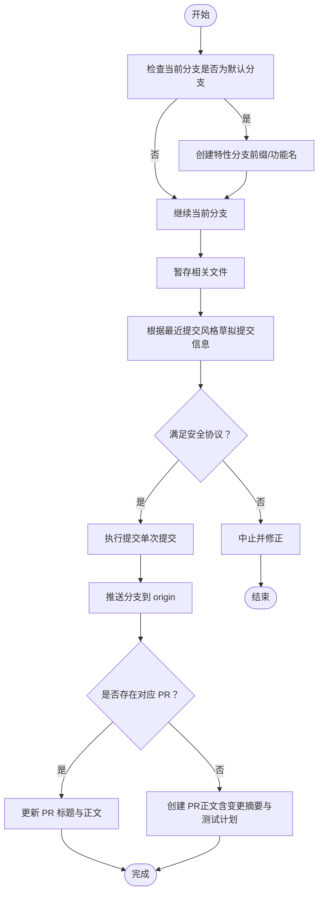
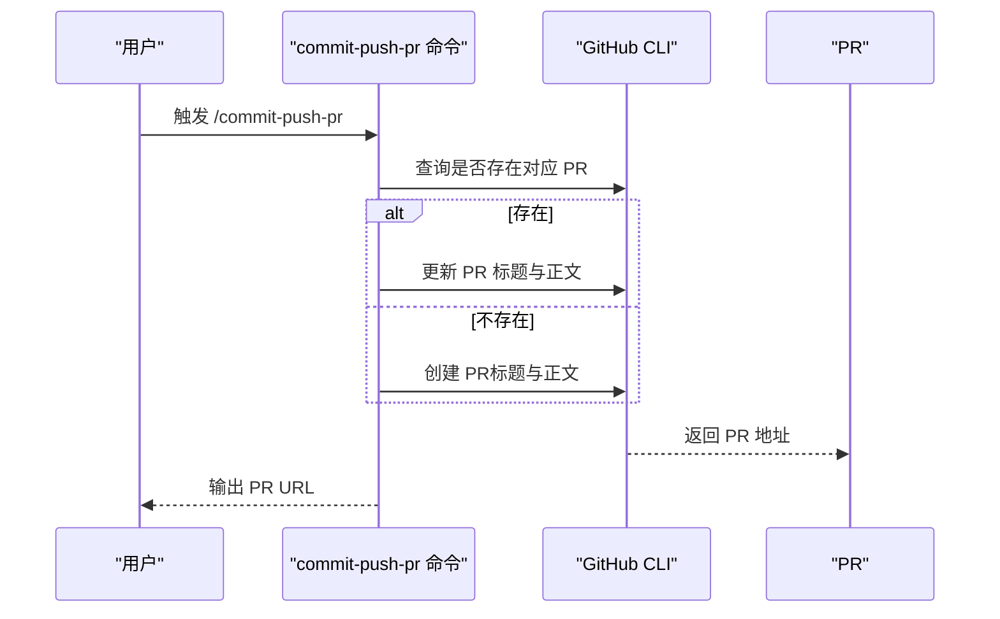
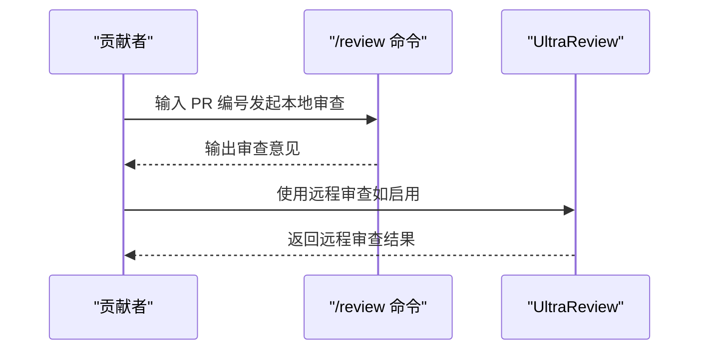
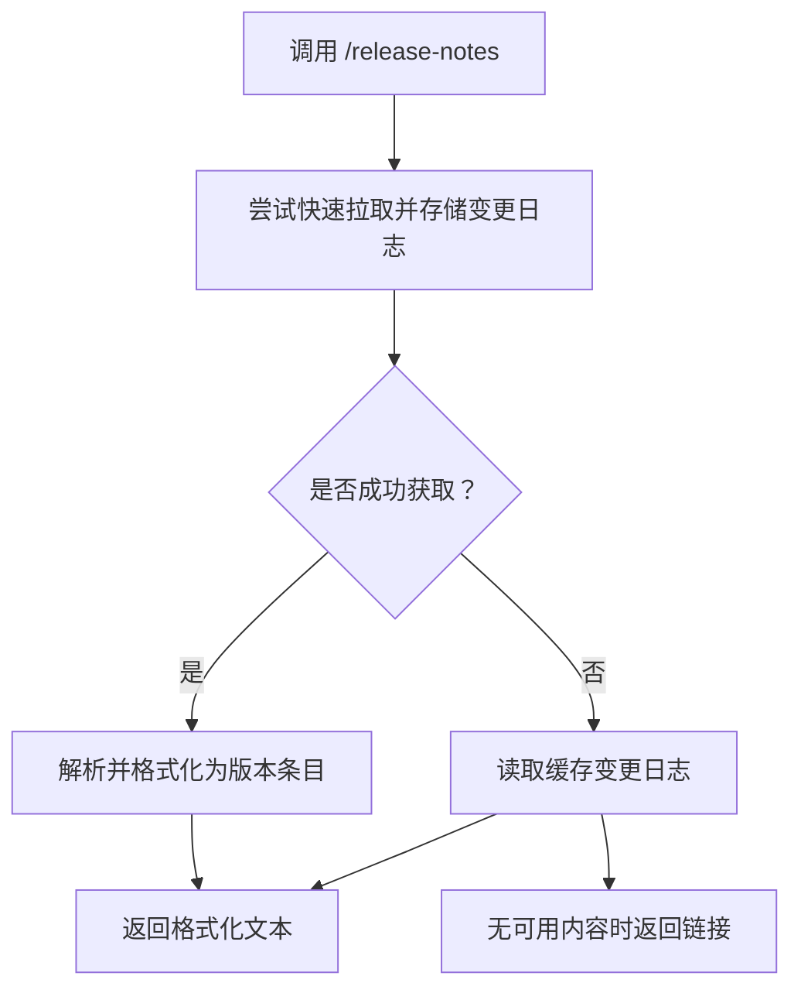
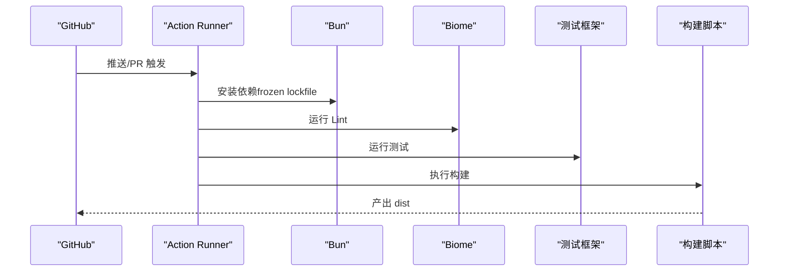
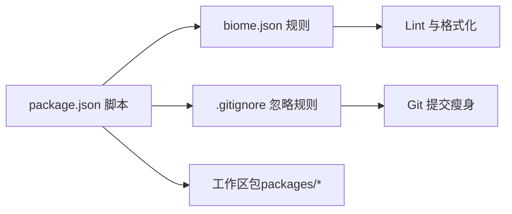

# 贡献流程

<cite>
**本文引用的文件**
- [.github/workflows/ci.yml](file://.github/workflows/ci.yml)
- [package.json](file://package.json)
- [biome.json](file://biome.json)
- [.gitignore](file://.gitignore)
- [src/commands/commit.ts](file://src/commands/commit.ts)
- [src/commands/commit-push-pr.ts](file://src/commands/commit-push-pr.ts)
- [src/tools/BashTool/prompt.ts](file://src/tools/BashTool/prompt.ts)
- [src/tools/PowerShellTool/prompt.ts](file://src/tools/PowerShellTool/prompt.ts)
- [src/commands/review.ts](file://src/commands/review.ts)
- [src/commands/install-github-app/install-github-app.tsx](file://src/commands/install-github-app/install-github-app.tsx)
- [src/utils/releaseNotes.ts](file://src/utils/releaseNotes.ts)
- [src/commands/release-notes/release-notes.ts](file://src/commands/release-notes/release-notes.ts)
</cite>

## 目录
1. [简介](#简介)
2. [项目结构](#项目结构)
3. [核心组件](#核心组件)
4. [架构总览](#架构总览)
5. [详细组件分析](#详细组件分析)
6. [依赖分析](#依赖分析)
7. [性能考虑](#性能考虑)
8. [故障排查指南](#故障排查指南)
9. [结论](#结论)
10. [附录](#附录)

## 简介
本文件面向贡献者，系统化阐述从 Issue 提交到 Pull Request 合入的完整贡献流程，覆盖分支策略、提交规范、代码审查流程、模板与变更日志维护、CI/CD 自动化与发布要点。内容基于仓库中现有实现与配置进行归纳总结，帮助贡献者高效协作并保持质量与一致性。

## 项目结构
本项目采用多包工作区（monorepo）组织方式，根目录通过脚本与工具链统一管理构建、测试、格式化与健康检查；核心功能以命令与工具形式分布在 src 下，配合 GitHub Actions 实现 CI 自动化。

图表来源
- [package.json:1-166](file://package.json#L1-L166)
- [.github/workflows/ci.yml:1-31](file://.github/workflows/ci.yml#L1-L31)
- [biome.json:1-115](file://biome.json#L1-L115)
- [.gitignore:1-10](file://.gitignore#L1-L10)
- [src/commands/commit.ts:1-93](file://src/commands/commit.ts#L1-L93)
- [src/commands/commit-push-pr.ts:1-159](file://src/commands/commit-push-pr.ts#L1-L159)
- [src/commands/review.ts:28-57](file://src/commands/review.ts#L28-L57)
- [src/utils/releaseNotes.ts:121-360](file://src/utils/releaseNotes.ts#L121-L360)
- [src/commands/release-notes/release-notes.ts:1-50](file://src/commands/release-notes/release-notes.ts#L1-L50)

章节来源
- [package.json:1-166](file://package.json#L1-L166)
- [.github/workflows/ci.yml:1-31](file://.github/workflows/ci.yml#L1-L31)
- [biome.json:1-115](file://biome.json#L1-L115)
- [.gitignore:1-10](file://.gitignore#L1-L10)

## 核心组件
- 提交流程与安全协议：通过内置命令生成安全的提交步骤与提示，避免破坏性操作与交互式命令。
- PR 创建与更新：自动推断是否存在已有 PR，按需创建或更新，并生成标准化 PR 内容与标题长度建议。
- 审查流程：本地审查命令与远程“UltraReview”能力入口，支持权限控制与提示。
- 发布说明与变更日志：提供拉取最新变更日志、解析与展示的能力，支持 Ant 与外部用户差异化路径。
- CI/CD：基于 GitHub Actions 的自动化流水线，执行安装、Lint、测试与构建。

章节来源
- [src/commands/commit.ts:1-93](file://src/commands/commit.ts#L1-L93)
- [src/commands/commit-push-pr.ts:1-159](file://src/commands/commit-push-pr.ts#L1-L159)
- [src/commands/review.ts:28-57](file://src/commands/review.ts#L28-L57)
- [src/utils/releaseNotes.ts:121-360](file://src/utils/releaseNotes.ts#L121-L360)
- [.github/workflows/ci.yml:1-31](file://.github/workflows/ci.yml#L1-L31)

## 架构总览
下图展示了贡献流程的关键节点：Issue → 分支与提交 → PR 创建/更新 → 代码审查 → CI 验证 → 合并与发布说明。

图表来源
- [src/commands/commit.ts:1-93](file://src/commands/commit.ts#L1-L93)
- [src/commands/commit-push-pr.ts:1-159](file://src/commands/commit-push-pr.ts#L1-L159)
- [src/commands/review.ts:28-57](file://src/commands/review.ts#L28-L57)
- [.github/workflows/ci.yml:1-31](file://.github/workflows/ci.yml#L1-L31)
- [src/utils/releaseNotes.ts:121-360](file://src/utils/releaseNotes.ts#L121-L360)

## 详细组件分析

### 分支策略与提交规范
- 分支命名与上游设置：建议在默认分支上创建特性分支，遵循“前缀/功能名”的语义化命名；若远程存在同名分支，可自动设置上游，便于后续推送与同步。
- 提交安全协议：
  - 严禁修改 Git 配置、跳过钩子、强制推送至主分支等高风险操作。
  - 严禁使用需要交互输入的命令（如交互式变基或选择性暂存）。
  - 严禁提交可能泄露密钥的文件。
  - 强制新建提交，避免使用 amend；除非用户明确要求。
- 提交信息风格：参考最近提交记录，聚焦“为什么”而非“做了什么”，确保简洁且准确反映变更目的。

图表来源
- [src/commands/commit.ts:12-55](file://src/commands/commit.ts#L12-L55)
- [src/commands/commit-push-pr.ts:76-106](file://src/commands/commit-push-pr.ts#L76-L106)
- [src/utils/teleport.tsx:218-253](file://src/utils/teleport.tsx#L218-L253)

章节来源
- [src/commands/commit.ts:12-55](file://src/commands/commit.ts#L12-L55)
- [src/commands/commit.ts:27-35](file://src/commands/commit.ts#L27-L35)
- [src/commands/commit-push-pr.ts:76-106](file://src/commands/commit-push-pr.ts#L76-L106)
- [src/utils/teleport.tsx:218-253](file://src/utils/teleport.tsx#L218-L253)

### PR 创建与更新流程
- 自动检测：先查询是否存在对应分支的 PR，若存在则更新标题与正文，否则创建新 PR。
- 标准化内容：标题建议短于 70 字符，正文包含摘要、测试计划、可选变更日志占位与归属信息。
- 审查与通知：可按需添加审查员；支持在创建后检查贡献者 CLAUDE.md 中的 Slack 通道并发送 PR 链接（经工具搜索确认可用时）。

图表来源
- [src/commands/commit-push-pr.ts:108-159](file://src/commands/commit-push-pr.ts#L108-L159)
- [src/commands/commit-push-pr.ts:80-106](file://src/commands/commit-push-pr.ts#L80-L106)

章节来源
- [src/commands/commit-push-pr.ts:108-159](file://src/commands/commit-push-pr.ts#L108-L159)
- [src/commands/commit-push-pr.ts:80-106](file://src/commands/commit-push-pr.ts#L80-L106)

### 代码审查流程
- 本地审查：通过 /review 命令对指定 PR 进行本地审查，输出清晰分段与要点。
- 远程 UltraReview：在 Web 环境运行的深度审查入口，受权限控制；本地仅渲染权限对话框，不直接执行。

图表来源
- [src/commands/review.ts:28-57](file://src/commands/review.ts#L28-L57)

章节来源
- [src/commands/review.ts:28-57](file://src/commands/review.ts#L28-L57)

### 变更日志与发布说明
- 拉取与缓存：首次访问会异步拉取最新变更日志并缓存，随后读取内存缓存用于渲染。
- 解析与排序：按版本解析变更条目，按新旧顺序排列，限制展示数量。
- 展示命令：提供 /release-notes 命令快速查看近期版本条目，失败或超时回退到缓存或链接。

图表来源
- [src/commands/release-notes/release-notes.ts:19-50](file://src/commands/release-notes/release-notes.ts#L19-L50)
- [src/utils/releaseNotes.ts:121-360](file://src/utils/releaseNotes.ts#L121-L360)

章节来源
- [src/commands/release-notes/release-notes.ts:19-50](file://src/commands/release-notes/release-notes.ts#L19-L50)
- [src/utils/releaseNotes.ts:121-360](file://src/utils/releaseNotes.ts#L121-L360)

### CI/CD 流程与自动化
- 触发条件：在 main 与 feature/* 分支推送以及向 main 提交 PR 时触发。
- 步骤：检出代码 → 安装依赖（Bun）→ Lint（Biome）→ 测试 → 构建。
- 产物：构建产物位于 dist 目录，随工作区打包发布。

图表来源
- [.github/workflows/ci.yml:1-31](file://.github/workflows/ci.yml#L1-L31)
- [package.json:37-49](file://package.json#L37-L49)
- [biome.json:1-115](file://biome.json#L1-L115)

章节来源
- [.github/workflows/ci.yml:1-31](file://.github/workflows/ci.yml#L1-L31)
- [package.json:37-49](file://package.json#L37-L49)
- [biome.json:1-115](file://biome.json#L1-L115)

### 贡献者工具与前置条件
- GitHub CLI：安装与可用性检查，缺失时给出安装指引与平台命令。
- Git 安全提示：针对 Bash 与 PowerShell 工具提供 Git 操作的安全与最佳实践提示，强调不跳过钩子与避免破坏性操作。

章节来源
- [src/commands/install-github-app/install-github-app.tsx:62-73](file://src/commands/install-github-app/install-github-app.tsx#L62-L73)
- [src/tools/BashTool/prompt.ts:53-81](file://src/tools/BashTool/prompt.ts#L53-L81)
- [src/tools/PowerShellTool/prompt.ts:137-145](file://src/tools/PowerShellTool/prompt.ts#L137-L145)

## 依赖分析
- 工作区与脚本：根 package.json 定义了构建、测试、格式化、准备钩子与健康检查等脚本，统一由 Bun 管理。
- Lint 与格式化：Biome 配置启用 VCS 集成、文件包含排除、格式化规则与规则集覆盖范围。
- 忽略规则：.gitignore 控制常见产物与 IDE 文件的忽略，减少无关文件进入版本控制。

图表来源
- [package.json:37-49](file://package.json#L37-L49)
- [biome.json:1-115](file://biome.json#L1-115)
- [.gitignore:1-10](file://.gitignore#L1-L10)

章节来源
- [package.json:37-49](file://package.json#L37-L49)
- [biome.json:1-115](file://biome.json#L1-L115)
- [.gitignore:1-10](file://.gitignore#L1-L10)

## 性能考虑
- CI 并行步骤：流水线各阶段独立执行，建议在本地先行 Lint 与测试，减少 CI 失败重试成本。
- 构建缓存：利用 frozen lockfile 与工作区缓存，缩短依赖安装时间。
- 变更日志异步加载：首次访问拉取并缓存，后续渲染直接命中内存缓存，降低 UI 渲染阻塞。

## 故障排查指南
- CI 失败
  - 检查本地 Lint 与测试是否通过，确保 Biome 规则一致。
  - 确认依赖安装使用 frozen lockfile，避免版本漂移。
- 提交被拒绝
  - 遵守安全协议：不要跳过钩子、不要 amend、不要推送主分支。
  - 若出现上游未设置导致推送失败，可使用自动设置上游逻辑或手动设置。
- PR 无法创建/更新
  - 确认 GitHub CLI 可用且已登录；检查网络与认证。
  - 若工具搜索未找到 Slack 工具，按静默处理逻辑跳过通知步骤。
- 发布说明为空
  - 首次访问会异步拉取；若失败或超时，回退到缓存或链接。

章节来源
- [.github/workflows/ci.yml:1-31](file://.github/workflows/ci.yml#L1-L31)
- [src/commands/commit.ts:27-35](file://src/commands/commit.ts#L27-L35)
- [src/commands/commit-push-pr.ts:80-106](file://src/commands/commit-push-pr.ts#L80-L106)
- [src/commands/install-github-app/install-github-app.tsx:62-73](file://src/commands/install-github-app/install-github-app.tsx#L62-L73)
- [src/utils/releaseNotes.ts:121-360](file://src/utils/releaseNotes.ts#L121-L360)

## 结论
本贡献流程以安全、可追溯与自动化为核心：通过内置命令约束提交与 PR 行为，借助 CI 保障质量，结合发布说明与变更日志提升可发现性与透明度。建议贡献者在本地充分验证后再提交 PR，遵循安全协议与提交规范，以提高审查效率与合并成功率。

## 附录

### 贡献者协议、许可证与行为准则
- 本仓库未提供单独的贡献者许可协议（CLA）文件与行为准则文件。请在提交前遵守项目所采用的许可证与社区规范。若需进一步确认，请查阅项目根目录或发行说明。

### Issue/PR 模板与变更日志维护建议
- Issue 模板：建议在 .github/ISSUE_TEMPLATE 目录下补充 Bug 报告与功能请求模板，包含复现步骤、期望与实际结果、环境信息等。
- PR 模板：建议在 .github/PULL_REQUEST_TEMPLATE 中定义标准字段（摘要、变更点、测试计划、影响面、迁移说明等），并与 /commit-push-pr 的正文结构保持一致。
- 变更日志：建议在 PR 正文中使用变更日志占位，PR 合并后由维护者整理至统一的变更日志文件，以便 /release-notes 命令与发布说明使用。